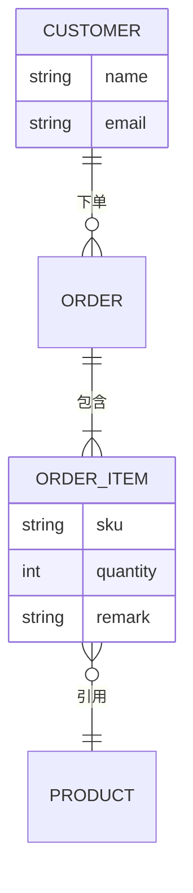

# erDiagram（ER 图）

画数据表、实体关系、外键约束。描述数据库模型、领域实体关系时最常用。

## 基础模板

````markdown

````

- 实体名用**大写**（惯例，非强制）。
- 属性写在 `实体 { ... }` 块里，缩进一层。
- 关系行格式：`实体A <基数>--<符号><基数> 实体B : 关系名`。
- 注释：`%%`。

## 基数语法

| 基数标记 | 含义 |
|---|---|
| `||` | 恰好一个 |
| `|o` | 零或一个 |
| `}o` | 零或多个 |
| `}|` | 一个或多个 |
| `o{` / `o|` | 反向对应写法 |

关系符号：`--`（标识关系，实线）、`..`（非标识关系，虚线）。

读法：`CUSTOMER ||--o{ ORDER` = "一个 CUSTOMER 下单 零或多个 ORDER"。**左边基数写左实体一侧，右边基数写右实体一侧。**

## 属性语法

- `类型 属性名 [键类型]`，如 `int id PK`、`string customer_id FK`、`string email UK`。
- 键类型：`PK` 主键、`FK` 外键、`UK` 唯一键。
- 常见类型：`string`、`int`、`long`、`float`、`decimal`、`bool`、`date`、`datetime`。
- 属性名含特殊字符时加引号：`string "user-name"`。

## 常见坑

- **实体名/属性名用英文（实体建议大写）**：erDiagram 的实体名按标识符解析，中文易出错。中文语义用关系标签表达：`CUSTOMER ||--o{ ORDER : 用户下单`。
- 关系行里基数与符号**必须连续写**：`||--o{`，不能写成 `|| -- o{`。
- 实体和属性名不要用 `--`、`{}` 等字符；确实需要就加引号。
- 属性块 `{ }` 不闭合会导致整张图解析失败，写完后检查大括号配对。
