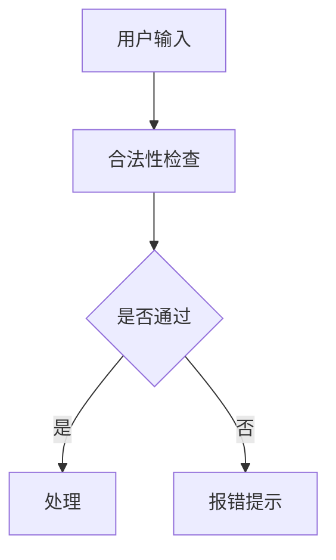

# ASCII 文本流程图 → Mermaid

文档或代码注释里常见的字符画流程图（`+---+`、`-->` 文本箭头、`| v |`）都要重写为 Mermaid。

## 识别特征

文本流程图通常长这样：

```
+-----------+        +-----------+
|   客户端    | -----> |   服务端    |
+-----------+        +-----------+
        |                |
        v                v
+-----------+        +-----------+
|   缓存     |        |  数据库    |
+-----------+        +-----------+
```

特征符号：`+---+` `| |` 边框、`-->` `->` `--->` `=>` `→` 箭头、`v` `^` `|` `↓` `↑` 竖排箭头、`┌ ┐ └ ┘ ─ │` 制表符边框。

## 转换规则

1. **提取节点**：边框里的文本是节点内容，箭头旁的文字是关系标签，其余是连接线。
2. **判断方向**：主链竖向（箭头在框下面）→ `flowchart TD`；横向（箭头在框右边）→ `flowchart LR`。斜着混排的按主方向取一个。
3. **映射节点**：每个节点 → `ID[文本]`；看起来是判断/分支的节点（旁边有"是/否""条件"字样，或引出多条路径）→ `ID{文本}`。
4. **映射箭头**：实线箭头 `-->`；带标签 `-- 标签 -->`；虚线（`~~` `: :` 风格）→ `-.->`。
5. **保留原文**：节点文本、标签照抄原图，不缩写、不美化——转换的职责是改形式不改内容。
6. 原图里重复的公共文本（比如多个指向同一节点的路径）在 Mermaid 里自然合并，不要手动复制节点。

## 示例

输入：

```
+-----------+       +-----------+
|  用户输入   | ----> |  合法性检查 |
+-----------+       +-----------+
                          |
                  是/否？ |
                    /   \
                   /     \
            +----+       +----+
            | 通过 |     | 失败 |
            +----+       +----+
              |            |
              v            v
         +--------+   +--------+
         |  处理   |   | 报错提示 |
         +--------+   +--------+
```

输出：

````markdown

````

> 注：原图里"处理"和"报错提示"后面的内容如果只是空白，就不需要额外节点；结束状态不强加 `[*]`。

## 多段 / 多图

一个文件里有多段独立流程图时，每段转成一个独立的 ```` ```mermaid ```` 代码块，不要合并进一个代码块。

## 判断点补全

文本图里的分支往往只有箭头没有判断节点，转换时根据"是否"标注或"分出两条路径"的事实补出菱形判断节点，保证逻辑完整（如上例 `C{是否通过}`）。

## 陷阱

- 不要用 `+---+` 或 `| |` 继续画图——**目标就是消灭字符画**。
- 方向选错会让图变成横躺长条，主链超过 6 个节点时优先 `TD`。
- 标签里的括号、冒号同样要加引号（见 SKILL.md 通用铁律）。
