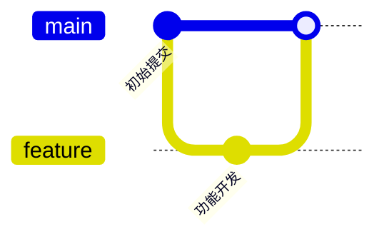
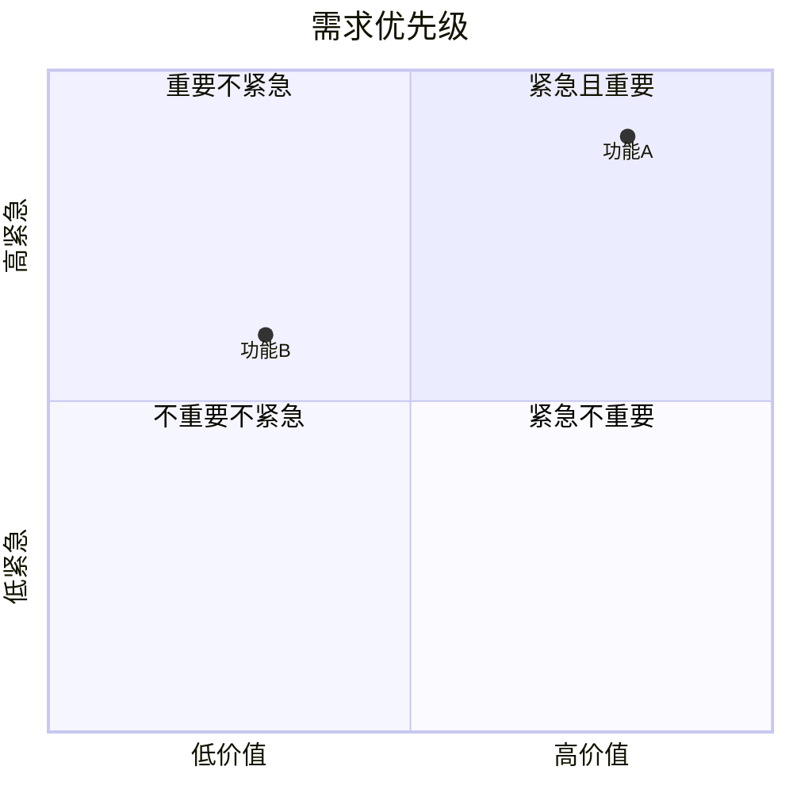
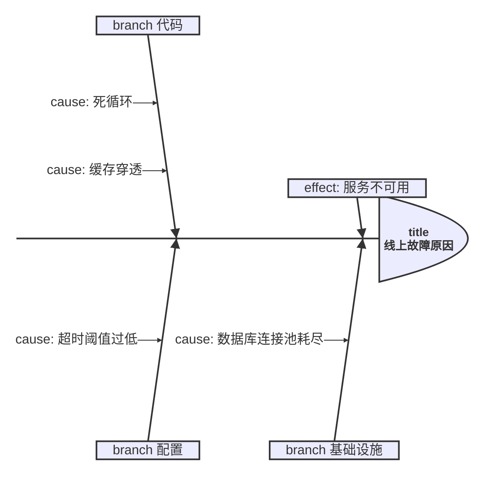

# 较新的图类型

这些图在 Mermaid 10-11 引入，Typora 1.13（内置 Mermaid 11.13）多数支持，但**渲染细节随版本变**。仅当用户点名要这些图时使用；生成后建议提示用户在 Typora 里确认一次。

> **硬性限制**：`-beta` 实验图（`block-beta`、`radar-beta`、`treemap-beta`）和 `flowchart-elk` 布局引擎**不要用**——API 未稳定或 Typora 未内置。

## gitGraph（git 分支图）

````markdown

````

## packet（报文/字节布局）

````markdown

````

- 关键字是 `packet-beta`（虽然名字带 beta，但这是官方稳定用法）。
- 范围按字节位 `起-止` 排。

## sankey（桑基图）

````markdown
```mermaid
sankey-beta
    Source,Target,Value
    请求,缓存命中,0.8
    请求,回源,0.2
    缓存命中,响应,0.8
    回源,响应,0.2
```
````

- 首行 `Source,Target,Value`，之后每行一条流。

## xychart（折线/柱状组合图）

````markdown
```mermaid
xychart-beta
    title "月度销量"
    x-axis [一月, 二月, 三月, 四月]
    y-axis "万件" 0 --> 100
    bar [30, 50, 45, 70]
    line [20, 40, 35, 60]
```
````

## quadrantChart（四象限图）

````markdown

````

## kanban（看板）

````markdown

````

- 列：`列ID [列标题]`，任务在列下**缩进**。列 ID 用英文下划线。

## architecture（架构图）

````markdown

````

- `group` / `service` 定义组件，方向后缀 `:L/R/T/B`（左/右/上/下）表示连接点。
- 类型括号内：`cloud` 云、`server` 服务、`database` 数据库、`disk` 磁盘、`internet` 外部、`firewall` 防火墙。

## venn（维恩图）

````markdown
```mermaid
venn
    A : 集合 A 的元素
    B : 集合 B 的元素
    A & B : 交集元素
```
````

## ishikawa（鱼骨图）

````markdown

````

- `effect:` 主问题，`branch` 大分类，`cause:` 原因（可多条）。

## 常见坑

- 这些图大多**缩进敏感**，生成后保持层级一致。
- 不确定 Typora 版本是否支持某类时，优先用主类型（flowchart / sequence / state / er / gantt）表达。
- `-beta` 实验图一律不用，除非用户明确要求并接受渲染风险。
