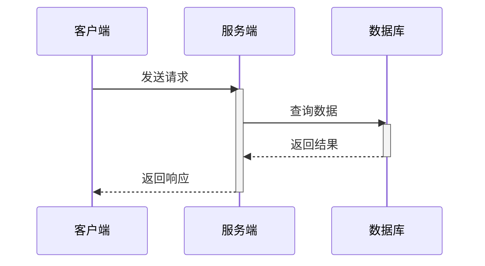
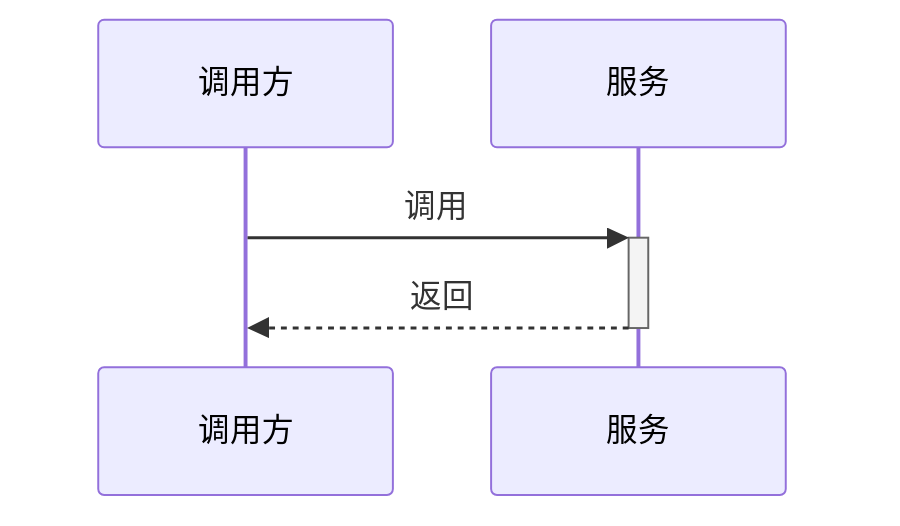
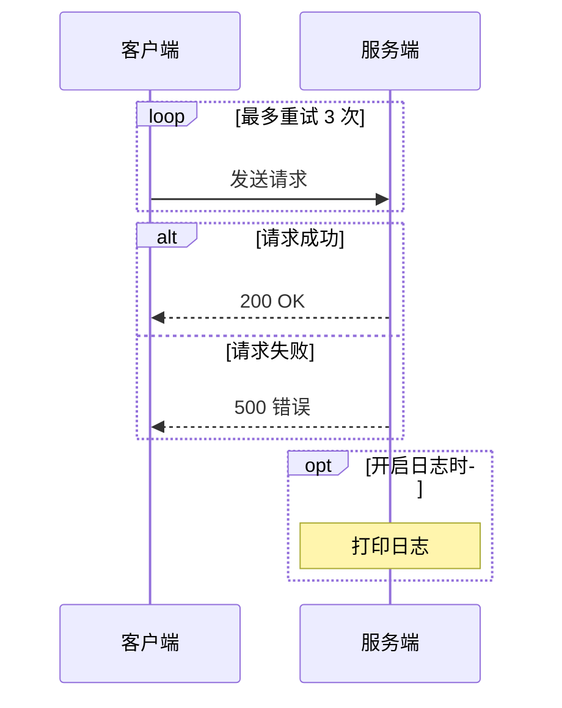

# sequenceDiagram（时序图）

画消息交互、调用链、请求-响应流程。技术文档里描述 Kafka 消费链路、HTTP 调用、Spring AI 多轮对话等场景最常用。

> **画之前先判断**：单个"A 调用 B"、两步以内的请求-响应，用一句话就够（"客户端调用服务端查询数据库后返回结果"），不必画时序图。时序图的价值在于**多参与者的先后顺序**、`alt` 分支、`loop` 重试、`par` 并行——没有这些，用文字即可（判断标准见 SKILL.md「第一原则」）。

## 基础模板

````markdown

````

## 参与者

- `participant <ID> as 显示名` —— 定义参与者，ID 用英文，显示名可中文。
- `actor <ID> as 显示名` —— 参与者画成人形图标。
- 不写 participant 直接写 `A->>B` 也可以，但**文档中建议显式定义**，顺序即显示顺序。
- `title <标题>` 放在第一行（可选）。

## 消息类型

| 写法 | 含义 |
|---|---|
| `A->B` | 实线箭头 |
| `A-->B` | 虚线箭头（返回类） |
| `A->>B` | 实线带三角箭头（**最常用**） |
| `A-->>B` | 虚线带三角箭头（返回） |
| `A-xB` / `A--xB` | 带叉箭头（中断/失败） |
| `A-)B` / `A--)B` | 开放箭头（异步） |

**消息文本含特殊字符**：`client->>server: 查询 status=1 的数据` 里 `=` 没问题，但含 `(` `)` `:` 时加引号：`client->>server: "查询 (批量)"`。

## 激活与生命周期

````markdown

````

- `->>+` 自动激活，`-->>-` 自动释放（简洁写法）。
- 或显式 `activate B` / `deactivate B`，注意配对，漏配会让生命线画不完整。

## 注释（Notes）

- `Note left of A: 文本`
- `Note right of B: 文本`
- `Note over A, B: 跨越多个参与者的说明`

## 分支与循环块

````markdown

````

- `loop 描述 ... end` 循环
- `alt 描述 ... else 描述 ... end` 条件分支
- `opt 描述 ... end` 可选步骤
- `par 描述 ... and ... end` 并行
- 块内消息照常写，缩进一层更清晰（缩进不参与语义）。

## 其他

- `autonumber` 放在开头自动编号；`autonumber 10 5` 自定义起始和步长。
- `rect rgb(200, 220, 240)` ... `end` 给一块上背景色（可用：`rect rgb(255, 245, 200)`）。
- 消息文本支持格式：`**加粗**`、`//斜体//`、`--删除线--`、`` `代码` ``。
- 注释：`%% 这是注释`。

## 常见坑

- `activate` / `deactivate` 必须配对；混用 `->>+` 和显式 `activate` 容易重复激活，同一图里选一种写法。
- 参与者 ID 里不能有空格：`participant a b as 名字` 会报错，应写 `participant ab as 名字`。
- `Note over` 引用的参与者必须都已定义。
