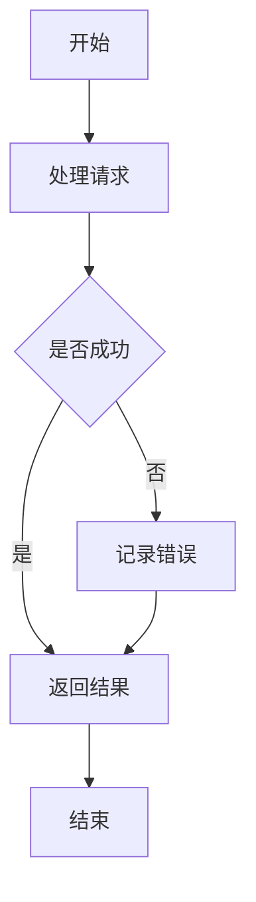
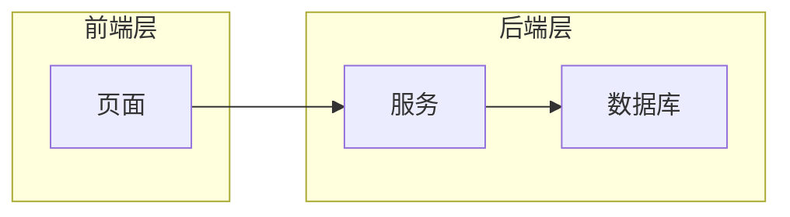

# flowchart（流程图 / 架构图）

流程图是最常用的类型，技术文档里的架构图、业务流程图、部署拓扑都用它。

> **画之前先判断**：这段流程用一句话能不能说清？一两步、无分支的流程，用一句话或一个表格更省力，不必画图（判断标准见 SKILL.md「第一原则」）。流程图只在有分支、并发、多层依赖时才值得画。

## 基础模板

````markdown

````

- 方向关键字：`TD`（从上到下）/ `TB`（同 TD）、`LR`（从左到右）、`RL`、`BT`。竖排的流程选 TD，横向的选 LR。
- `flowchart` 与 `graph` 等价，**统一用 `flowchart`**（更现代，解析更稳）。

## 节点形状

| 形状 | 写法 | 用途 |
|---|---|---|
| 矩形 | `A[文本]` | 默认节点 / 步骤 |
| 圆角矩形 | `A(文本)` | 起止 / 柔和步骤 |
| 菱形 | `A{文本}` | 判断 / 分支 |
| 六边形 | `A{{文本}}` | 准备 |
| 圆形 | `A((文本))` | 连接点 / 小状态 |
| 圆柱 | `A[(文本)]` | 数据库 |
| 子程序 | `A[[文本]]` | 子流程 / 函数 |
| 平行四边形 | `A[/文本/]` 或 `A[\文本\]` | 输入 / 输出 |
| 梯形 | `A[/文本\]` 或 `A[\文本/]` | 手动操作 |

## 箭头

| 写法 | 含义 |
|---|---|
| `A --> B` | 实线箭头（最常用） |
| `A --- B` | 实线无箭头 |
| `A -- 文本 --> B` | 带标签箭头 |
| `A -->|文本| B` | 带标签箭头（等价写法） |
| `A -.-> B` | 虚线箭头 |
| `A -. 文本 .-> B` | 虚线带标签 |
| `A ==> B` | 粗线箭头 |
| `A --o B` | 圆头线 |
| `A --x B` | 叉头线 |

**标签里有中文和特殊字符时**：`A -- "请求成功" --> B`，把标签整个用引号包起来。

## 子图（分组）

````markdown

````

- 子图 ID 用英文（`fe`），标题放方括号里（`[前端层]`）。
- 标题含特殊字符时：`subgraph fe["前端 (Web)"]`。
- 子图内可加 `direction LR` 单独指定方向（Mermaid 10+，Typora 支持）。

## 链接到 URL

````markdown

````

- `click 节点ID "URL" "提示语"` 只写链接形式。**不要写 `click A callback` 回调函数**——Mermaid 11 已移除，Typora 里会报错。

## 常见坑

- **中文节点是常态**：`A[中文节点]` 直接写就合法，不需要引号；但中文里混入 `:` `(` `)` 等特殊字符时，整个标签要加引号：`A["中文 (说明)"]`。
- **节点文本里的括号必须加引号**：`A[调用 check() 方法]` 会解析失败，要写成 `A["调用 check() 方法"]`。
- **`#` 号**：标签里出现 `#` 也加引号（`A["编号 #123"]`），或用 HTML 实体 `&#35;`。
- 不要用 `flowchart-elk`：Typora 未内置 ELK 布局引擎，写了渲染不出来。
- 并行关系 `A & B --> C` 是 Mermaid 10+ 语法，可用；但若不确定 Typora 版本，拆成两条箭头更保险。
