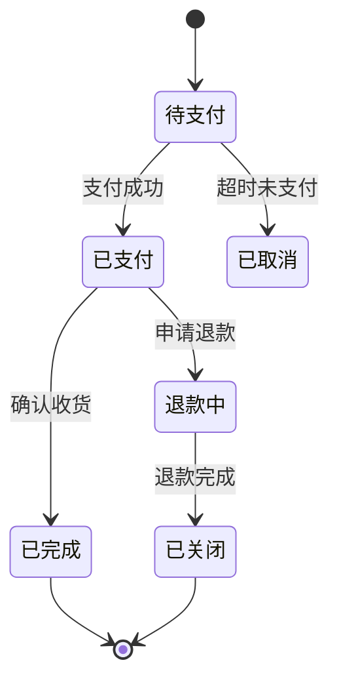
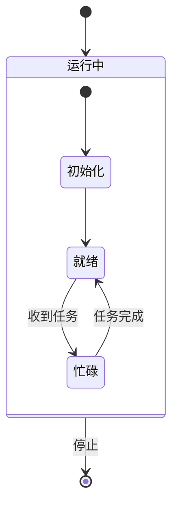

# stateDiagram-v2（状态图）

画状态机、生命周期、状态流转。订单状态机、任务状态迁移等场景最常用。

## 基础模板

````markdown

````

- **必须用 `stateDiagram-v2`**（v1 已废弃）。
- `[*]` 是开始 / 结束伪状态。开始写在第一个 `-->` 的左边，结束写在最后。
- 迁移标签用冒号：`状态1 --> 状态2 : 触发条件`。
- 状态名直接用中文即可，无需引号（含特殊字符时才加）。

## 复合状态（子状态机）

````markdown

````

- 复合状态用 `state 名称 { ... }` 包裹，内部同样有自己的一对 `[*]`。

## 状态定义与标签

- 显式定义状态并加描述：`state "处理中 (耗时)" as processing`，之后用 `processing` 引用。
- 给状态加内部注释：
  ````markdown
  ```mermaid
  stateDiagram-v2
      state 待支付 {
          note right of 待支付
              等待用户完成支付
          end note
      }
      [*] --> 待支付
  ```
  ````

## 常见坑

- 漏写 `-v2`：写成 `stateDiagram` 也能渲染但不推荐，统一 `stateDiagram-v2`。
- `[*]` 不能有出边的状态之外其他状态连着多个 `[*]` 结束（一个图一个结束点即可，多结束点允许，但别忘写）。
- 复合状态的 `state 名称 {` 和 `}` 配对，内部缩进统一。
- 状态名含空格时用 `state "含空格的名称" as id` 形式。
