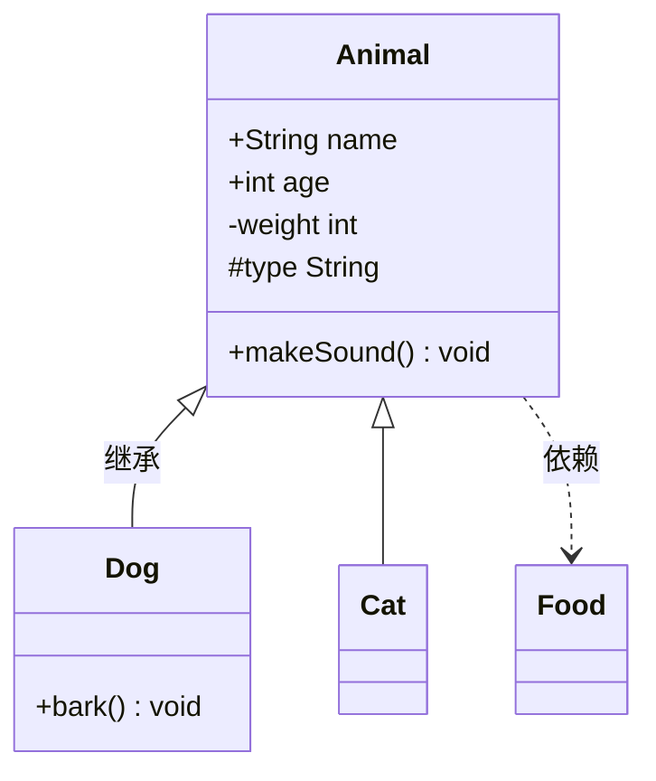
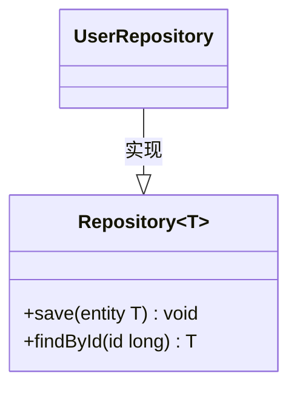

# classDiagram（UML 类图）

画类的成员、继承、接口实现、依赖关系。Java 项目文档里描述领域模型最常用。

## 基础模板

````markdown

````

## 成员写法

- 可见性前缀：`+` 公开、`-` 私有、`#` 受保护、`~` 包内。
- 两种风格：
  - `+String name`（类型在前）
  - `+getName() String`（方法，参数 + 返回类型）
- 方法名后括号里写参数：`+transfer(from, to, amount) boolean`。
- 没有成员就只写 `class Dog`。

## 关系

| 写法 | 含义 |
|---|---|
| `A <|-- B` | B 继承 A（实线空心三角） |
| `A ..|> B` | B 实现 A（虚线空心三角） |
| `A --> B` | 关联 |
| `A ..> B` | 依赖 |
| `A *-- B` | 组合（A 拥有 B） |
| `A o-- B` | 聚合 |
| `A -- B` | 普通关联 |
| `A <-- B` | 反向箭头 |

> 注意方向：箭头**指向**父类/接口。`Animal <|-- Dog` 读作"Dog 继承 Animal"。实际渲染时把子类放左边、父类放右边更自然：`Dog --|> Animal`。

带标签：`Dog --|> Animal : 继承`。带基数：`"1" *-- "many" Order`（基数要加引号）。

## 泛型

`List~int~` —— 泛型用 `~` 包裹，不用尖括号（尖括号会解析错误）。

````markdown

````

## 装饰与注释

- `classDef 名字 fill:#f9f,stroke:#333,stroke-width:2px` 定义样式，`class A,B 名字` 应用。
- 或者直接 `A:::样式名`。
- `note for A "说明文本"` 给类加注释。
- 注释 `%%`。

## 常见坑

- **类名/成员名用英文**：classDiagram 按标识符解析类名和成员名，中文容易解析出错。中文语义用 `note for 类 "中文说明"` 注释或关系标签表达：`Dog --|> Animal : 继承`。
- 泛型**必须**用 `~`，写 `List<int>` 会解析失败。
- 基数 `"many"` 两边的引号不能省。
- 类名、成员名里不要有空格和特殊字符；确实需要就加引号。
