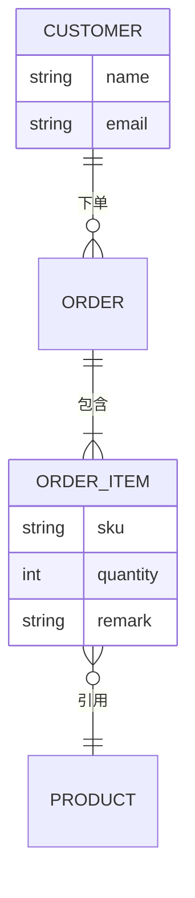
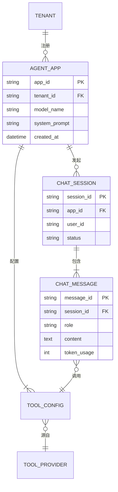

# erDiagram（ER 图）

画数据表、实体关系、外键约束。描述数据库模型、领域实体关系时最常用。

## 基础模板

````markdown

````

- 实体名用**大写**（惯例，非强制）。
- 属性写在 `实体 { ... }` 块里，缩进一层。
- 关系行格式：`实体A <基数>--<符号><基数> 实体B : 关系名`。
- 注释：`%%`。

## 基数语法

| 基数标记 | 含义 |
|---|---|
| `||` | 恰好一个 |
| `|o` | 零或一个 |
| `}o` | 零或多个 |
| `}|` | 一个或多个 |
| `o{` / `o|` | 反向对应写法 |

关系符号：`--`（标识关系，实线）、`..`（非标识关系，虚线）。

读法：`CUSTOMER ||--o{ ORDER` = "一个 CUSTOMER 下单 零或多个 ORDER"。**左边基数写左实体一侧，右边基数写右实体一侧。**

## 属性语法

- `类型 属性名 [键类型]`，如 `int id PK`、`string customer_id FK`、`string email UK`。
- 键类型：`PK` 主键、`FK` 外键、`UK` 唯一键。
- 常见类型：`string`、`int`、`long`、`float`、`decimal`、`bool`、`date`、`datetime`。
- 属性名含特殊字符时加引号：`string "user-name"`。

## 复杂场景示例（多实体 + 键标注 + 多对多拆解）

````markdown

````

- 多对多（用户 ⇄ 工具）不直接连，拆出中间实体（如 `CHAT_MESSAGE`）表达调用关系——ER 图不画 `}o--o{` 直连多对多，落库也要中间表。
- 每个实体块内一行一个属性；PK/FK/UK 标注在类型之后。

## 常见坑

| 坑 | 原因 | 修复 |
|---|---|---|
| 中文实体名/属性名报错 | 实体名按标识符解析，中文易出错 | 实体/属性名用英文（实体建议大写）；中文语义放关系标签：`CUSTOMER ||--o{ ORDER : 用户下单` |
| 基数符号加空格 `|| -- o{` 报错 | 基数与连线符号是一个 token | 连续写：`||--o{` |
| 属性块写完整图失败 | `{ }` 未闭合 | 每个实体块的 `{ }` 成对，写完通篇检查 |
| `}o--o{` 直连多对多 | ER 语义上多对多需要联结实体 | 拆中间实体表达 |
| 属性行里类型和名写反 | 语法是 `类型 名字 [键]` | `int id PK`，不是 `id int PK` |
| 属性名含 `-` 被拆 | 连字符被当语法字符 | 加引号：`string "user-name"` |
