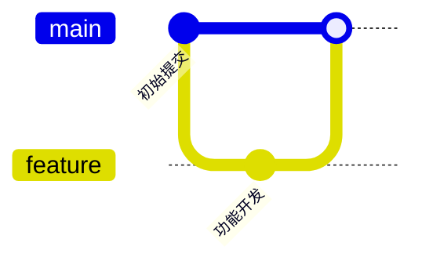
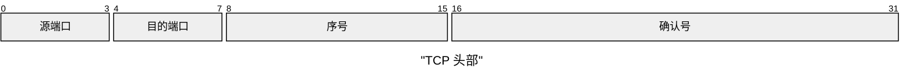
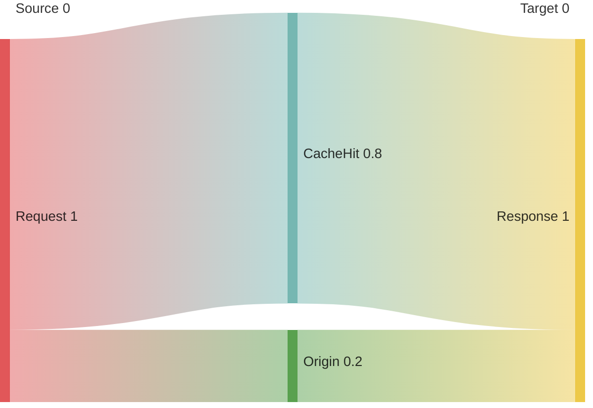
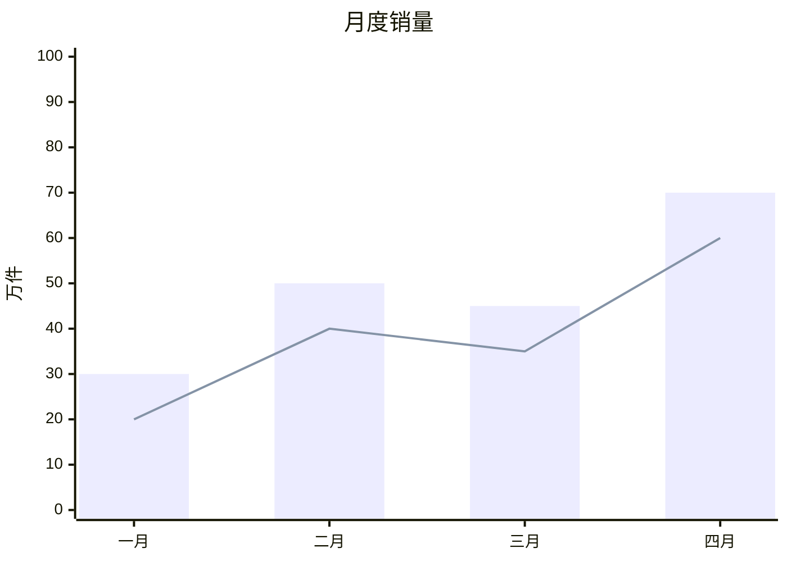
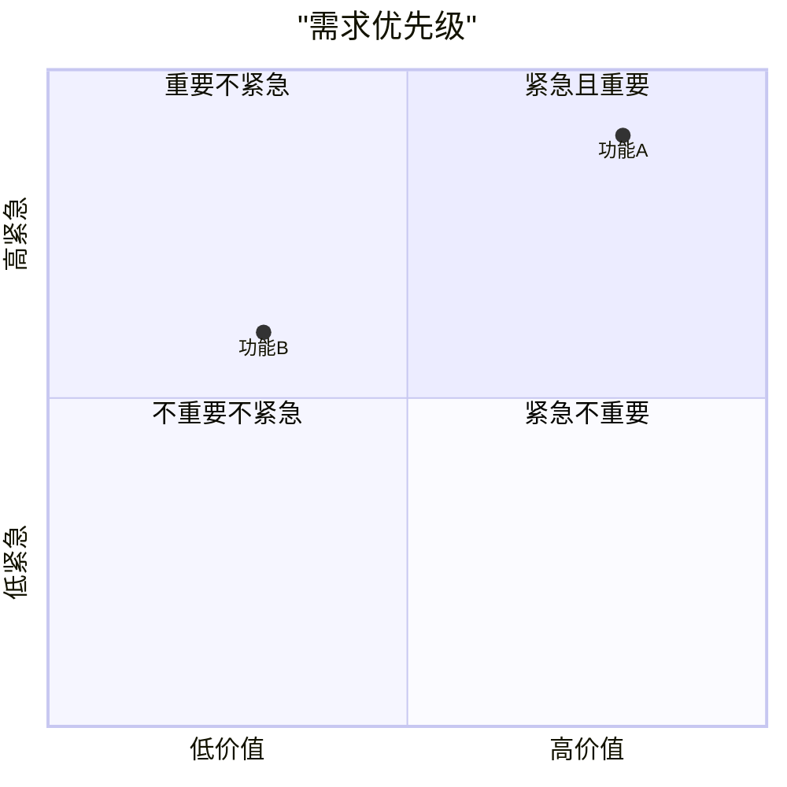
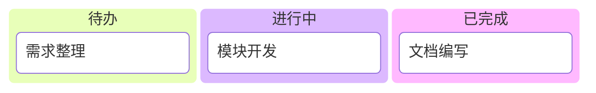
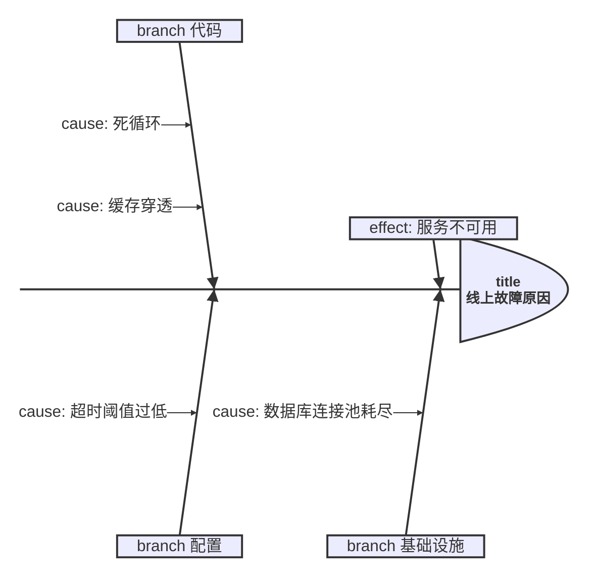

```mermaid
architecture-beta
    group cloud(gateway)
    service app(server)[App]
    service db(database)[Database]
    app:R --> L:db
```

# 较新的图类型

这些图在 Mermaid 10-11 引入，Typora 1.13（内置 Mermaid 11.13）多数支持，但**渲染细节随版本变**。仅当用户点名要这些图时使用；生成后建议提示用户在 Typora 里确认一次。

> **硬性限制**：`-beta` 实验图（`block-beta`、`radar-beta`、`treemap-beta`）和 `flowchart-elk` 布局引擎**不要用**——API 未稳定或 Typora 未内置。

## gitGraph（git 分支图）

````markdown

````

## packet-beta（报文/字节布局）

````markdown

````

- 关键字是 `packet-beta`（名字带 beta，但这是官方稳定用法）。
- 范围按字节位 `起-止` 排。
- **字段标签必须加双引号**（实测 11.13.0 不加引号中文/英文都报 lexer 错）；`title` 后直接跟文本可中文。

## sankey（桑基图）

````markdown

````

- 首行 `Source,Target,Value`，之后每行一条流。
- **数据行只接受 ASCII 标签**：中文标签实测解析失败（`Expecting ... got 'NON_ESCAPED_TEXT'`），加引号也不行——节点名用英文。

## xychart（折线/柱状组合图）

````markdown

````

- `title` 后的文本带引号可中文（不带引号仅接受 ASCII）。
- **`x-axis` 中文刻度必须加引号**：`x-axis ["一月", "二月"]`（不加引号实测报 lexical error）；`y-axis` 标签同理要引号。
- `bar`/`line` 数组纯数值，不加引号。

## quadrantChart（四象限图）

````markdown

````

- 坐标点 `[x, y]` 取值 0~1。
- **中文轴标签、象限名、坐标点名都必须加双引号**（实测不加引号报 lexical error，ASCII 不加引号可以）。

## kanban（看板）

````markdown

````

- 列：`列ID [列标题]`，任务在列下**缩进**。列 ID 用英文下划线。

## architecture（架构图）

````markdown

````

- `group 组名(图标)` 分组（图标：`cloud`、`gateway`、`disk` 等小写英文）；组件用 `service 名(类型)` 定义，可加 `[英文标签]`。
- **箭头写法是 `本端:方向 --> 方向:对端`**（如 `app:R --> L:db`），写成 `app:R --> db:L` 会报 `Expecting ARROW_DIRECTION` 解析错误。
- **方括号标签只接受 ASCII**——`[应用服务]` 中文标签实测报 lexer 错，要么用英文标签，要么省略标签靠服务名表达。

## ishikawa（鱼骨图）

````markdown

````

- `effect:` 主问题，`branch` 大分类，`cause:` 原因（可多条）。中文直接写即合法。

## venn（维恩图）——不可用

~~`venn`~~ 在 Mermaid 11.13.0 实测**不识别**（`No diagram type detected matching given configuration`）。需要表达集合交并关系时，改用文字、表格或两个圆的 flowchart 示意。**不要生成 `venn` 图。**

## 常见坑

| 坑 | 原因 | 修复 |
|---|---|---|
| `sankey-beta` 中文节点名渲染失败 | CSV 方言解析器只认 ASCII 单词 | 节点名改英文；中文含义放正文说明 |
| `architecture-beta` 中文方括号标签报错 | lexer 对 `[...]` 内的 Unicode 支持不全 | `[App]` 英文标签，或省略标签 |
| `architecture-beta` 箭头写成 `app:R --> db:L` | 方向 token 必须紧跟 `-->` 两侧（`R --> L`） | 写成 `app:R --> L:db` |
| `packet-beta` 字段名不加引号 | 语法要求位段标签是字符串字面量 | `0-3: "源端口"`，双引号必加 |
| `xychart-beta` 中文 title/x-axis 不加引号 | title 和轴刻度只接受带引号字符串或 ASCII | `title "月度销量"`、`x-axis ["一月", "二月"]` |
| `quadrantChart` 中文轴标签/象限名/点不加引号 | lexer 对非引号 Unicode 报错 | 轴、象限、点全部加双引号：`"功能A": [0.8, 0.9]` |
| 生成 `venn` 图 | 11.13.0 未内置该类型 | 改用文字/表格/flowchart 示意 |
| 这些图缩进错乱后整图不渲染 | 多数新图缩进敏感 | 层级统一，生成后跑本地校验（见 `Typora兼容性.md`） |
| 拿不准 Typora 版本是否支持 | 渲染细节随版本变 | 优先用主类型（flowchart / sequence / state / er / gantt）表达 |

> 生成任何新图类型后，建议在 Typora 里确认一次渲染效果；批量作业用 `Typora兼容性.md` 的本地校验脚本先行验证。
