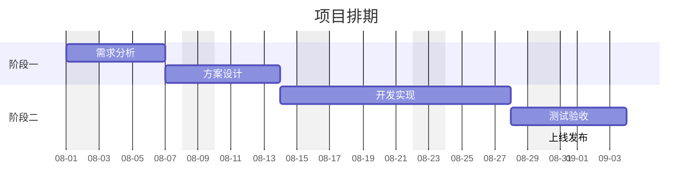
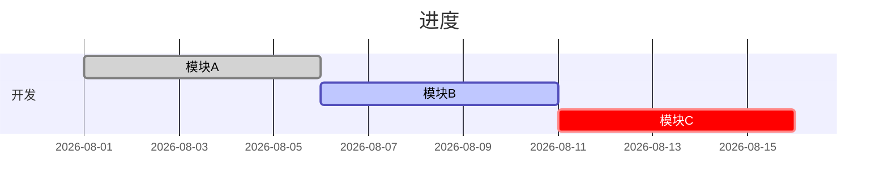

# gantt（甘特图）

画项目排期、任务依赖、里程碑。技术文档里的实施计划、迭代安排用。

## 基础模板

````markdown

````

## 关键配置

| 配置 | 说明 |
|---|---|
| `dateFormat YYYY-MM-DD` | 日期格式（`YYYY-MM-DD` 最常用） |
| `axisFormat %m-%d` | 横轴刻度显示格式 |
| `excludes weekends` | 跳过周末；或 `excludes 2026-08-01,2026-08-08` 指定日期 |
| `title 标题` | 图标题（第一行） |

## 任务写法

- 格式：`任务名 :任务ID, 开始, 时长`
- 开始可以是具体日期：`:a1, 2026-08-01, 5d`
- 也可以依赖前一任务：`:a2, after a1, 5d`（`a1` 是上一个任务的 ID）
- 时长单位：`d` 天、`w` 周、`h` 小时、`m` 月。例：`10d`、`2w`。
- 里程碑：`任务名 :milestone 任务ID, 日期, 0d`
- 任务名含特殊字符（如括号、冒号）时加引号：`"需求分析 (v2)" :a1, 2026-08-01, 5d`。

## 状态标记

在任务名前加前缀，`done` 已完成、`active` 进行中、`crit` 关键路径、`crit, done` 组合：

````markdown

````

## 常见坑

| 坑 | 原因 | 修复 |
|---|---|---|
| `after a1` 报错或依赖丢失 | 引用了未定义的任务 ID，或循环依赖 | `after` 只引用**前面已定义**的 ID，不循环 |
| 任务名含 `:` 整行解析错乱 | 冒号是任务定义的分隔符 | 任务名加引号：`"需求分析 (v2)" :a1, 2026-08-01, 5d` |
| 日期写成 `2026/08/01` 渲染异常 | 与 `dateFormat` 声明的格式不匹配 | `dateFormat YYYY-MM-DD` 对应 `2026-08-01`，写法一致 |
| 忘写 `dateFormat` | 有默认值但行为随版本不稳 | 首个 section 前显式写明 `dateFormat` |
| milestone 不显示菱形 | `milestone` 关键字顺序错误 | 写在 ID 前：`任务名 :milestone m1, 2026-08-30, 0d` |
| 时长单位乱写（`5days`） | 只接受单字母单位 | `5d` / `2w` / `10h`，别写全称 |
