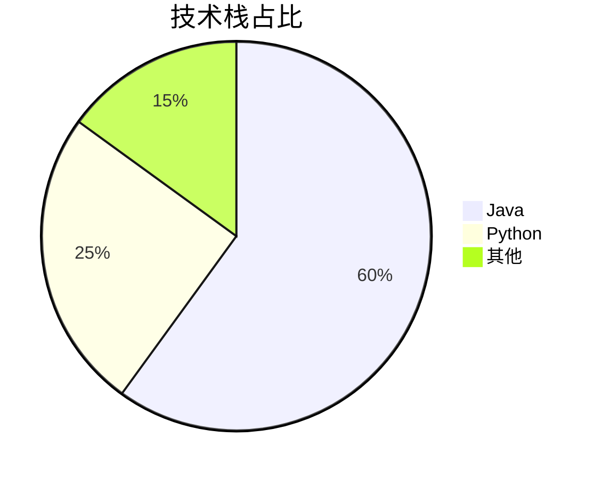
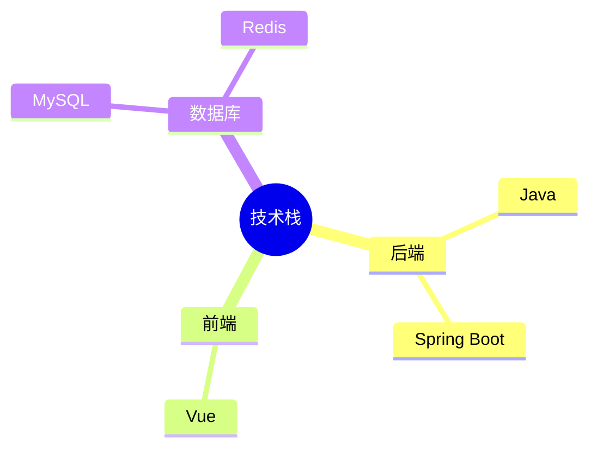
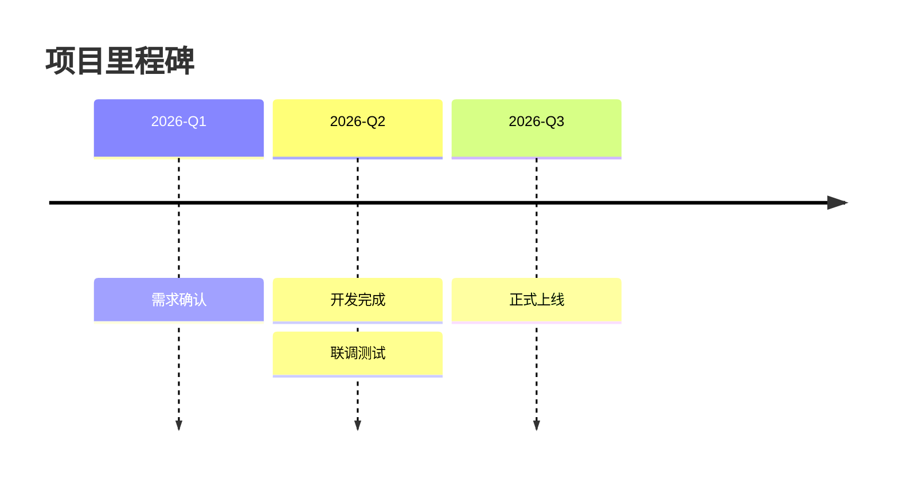
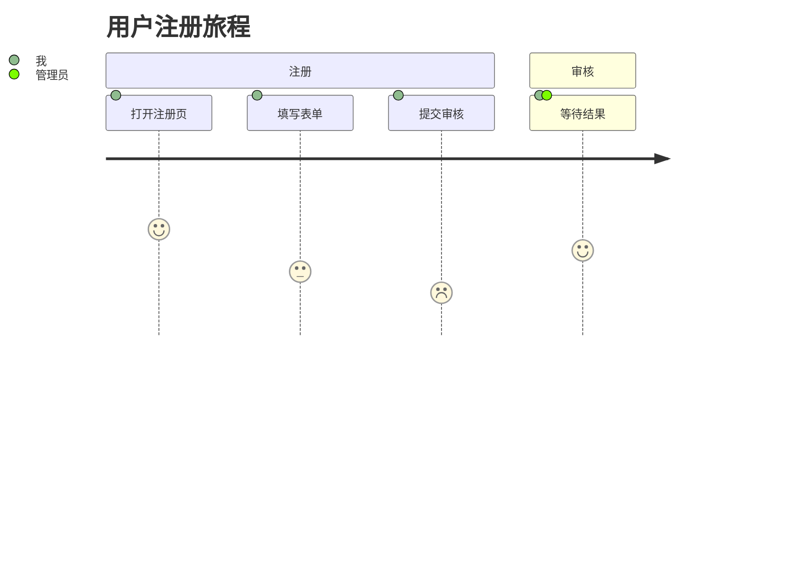

# pie / mindmap / timeline / journey

这几类语法简单，但**缩进或引号敏感**，写错整图不渲染。

## pie（饼图）

````markdown

````

- `pie` 后跟 `title 标题`（可选）。
- 每行 `"标签" : 数值`，**标签必须加引号**，数值不带单位。
- 注释：`%%`。

## mindmap（思维导图）

````markdown

````

- 关键字 `mindmap`，**严格按缩进定义层级**（缩进越深层级越低，建议统一用两个空格）。
- 根节点写法 `root((标题))`；`root` 可以省略但建议保留。
- 子节点可加形状后缀：`( )` 圆角、`[ ]` 矩形、`(( ))` 圆形、`{ }` 菱形、`[/ /]` 平行四边形。
- 节点文本含特殊字符时加引号：`"Java (JDK 21)"`。
- 缩进层级必须一致，混用 2 空格和 4 空格会导致层级错乱。

## timeline（时间线）

````markdown

````

- 格式：`时期 : 事件`；同一时期多个事件，后续事件行要**更深的缩进**并写 `: 事件`。
- 时期和事件文本含 `:` 时注意别拆错，特殊字符加引号。
- **timeline 对缩进非常挑剔**：时期行和事件行的缩进必须能区分层级，否则渲染报错。拿不准就写成单个事件一行。

## journey（旅程图）

````markdown

````

- `section 阶段` 分组；每行 `任务: 评分(1~5): 角色`，角色可多个用逗号分隔。
- 评分取 1~5，影响竖条长度（实测 0 也能解析，但 0 渲染无意义，官方语义 1~5）。

## 常见坑

| 坑 | 原因 | 修复 |
|---|---|---|
| pie 数值后写 `%` | 数值字段不接受单位 | `"Java" : 60`，不带 `%` |
| pie 标签不加引号 | 标签含空格/特殊字符时解析失败 | 标签统一加双引号：`"Java" : 60` |
| mindmap 层级错乱 | 缩进是语法本身，2/4 空格混用改变层级 | 层级缩进统一（建议 2 空格），父节点必在上一行 |
| timeline 事件行与时期行同缩进 | 解析器靠缩进区分层级 | 同时期后续事件行**更深缩进**：`     : 联调测试` |
| journey 行格式写错 | 必须是 `任务: 评分: 角色` 三段冒号结构 | `打开注册页: 5: 我`，角色多个用逗号 |
| journey 评分写 0 | 0 渲染无长度，官方语义 1~5 | 评分取 1~5 |
| 四类图整图不渲染 | 都缩进敏感，一处层级错全图失败 | 生成后用本地校验（`Typora兼容性.md`）批量验证 |
