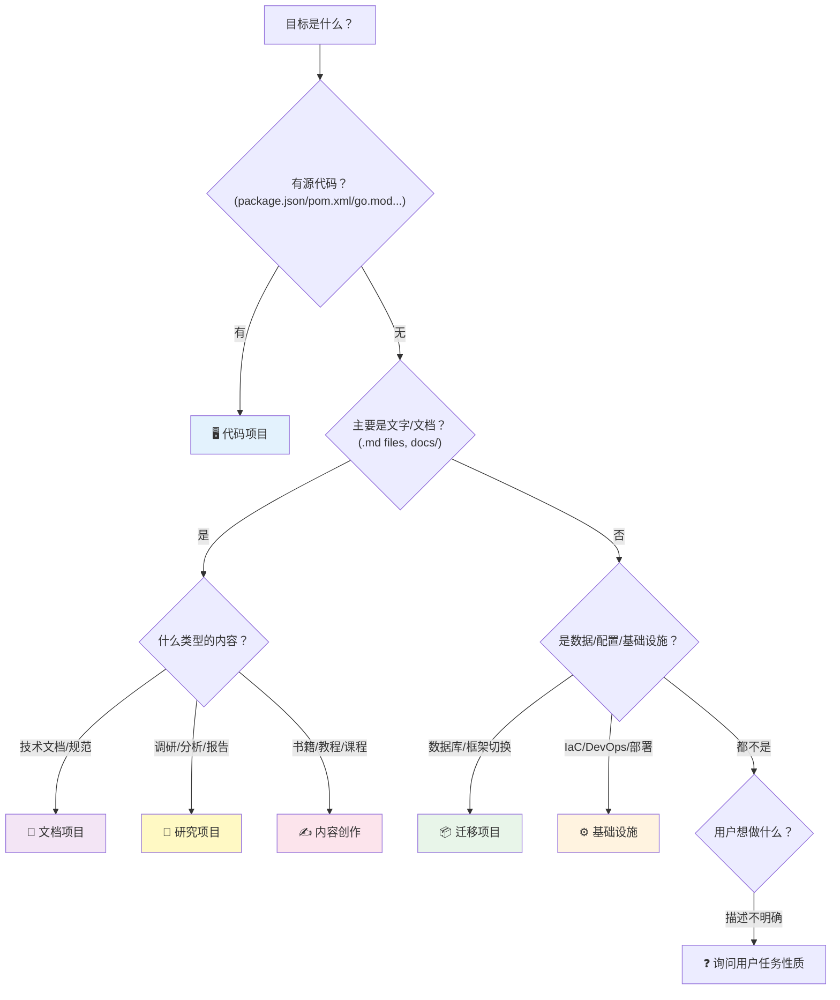
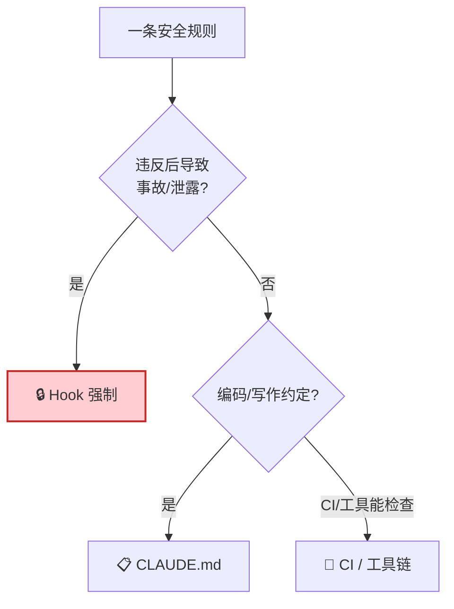

# Project Steering — 长程任务治理

## 使命

**CLAUDE.md 是方向盘，PLAN.md 是轨道。两者让长程任务不脱离你的掌控——无论任务是写代码、写文档、做调研还是迁移数据。**

长程任务（3 天+ 或多步骤）最大风险不是某一步做错——是**方向跑偏而你不知道**。Claude Code 在第 2 步的决策可能偏离了第 0 步的目标，你到最后才发现。

- **CLAUDE.md** 约束 Claude 在这类任务中的行为边界、质量标准、禁止事项——**方向盘**
- **PLAN.md** 约束每一步的方向、验证标准、恢复路径——**轨道**

本 Skill 从五篇权威指南（~8600 行、49 章）中提炼最佳实践，为**任意类型**的长程任务产出定制化的治理文件。

---

## 🔒 安全边界

| 规则 | 说明 |
|------|------|
| **目标隔离** | 用户必须指定目标路径。未指定则先问，绝不假设是当前项目 |
| **会话保护** | 不修改 `.claude/` 目录下任何文件（含本 Skill），不改当前项目 CLAUDE.md |
| **覆盖确认** | 覆盖已有文件前展示 diff 摘要并征得同意 |
| **凭证安全** | 生成内容中不含密钥/Token（检测到则替换为 `<REDACTED>`） |
| **幂等性** | 重复运行同一命令产生相同结果（日期戳除外） |

---

## 模式路由

```
用户输入
  ├─ "生成 CLAUDE.md" / "写项目指令" / "约束规则"           → §A steer
  ├─ "生成 PLAN.md" / "写计划" / "执行轨道" / "规划"        → §B plan
  ├─ "审计" / "优化" / "精简" / "检查 CLAUDE.md"            → §C audit
  ├─ "检查点" / "checkpoint" / "任务跑偏了" / "恢复"        → §D checkpoint
  ├─ "SPEC" / "需求规格" / "EARS"                           → §E spec
  └─ 不确定 → 询问需要哪种模式
```

---

## §0 目标探测协议（所有生成模式的前置步骤）

**生成任何文件前，必须完成探测。探测结果决定内容——不是填模板，是定制化。**

### 步骤 1：识别任务领域

**先问自己（或用户）：这个 CLAUDE.md / PLAN.md 服务的任务属于哪个领域？**



### 步骤 2：按领域执行探测

#### 领域 A：代码项目

```
1. 技术栈指纹
   - 检测: package.json, pom.xml, build.gradle, go.mod, pyproject.toml,
           requirements.txt, Cargo.toml, *.csproj, mix.exs, Gemfile

2. 包管理器
   - 检测: pnpm-lock.yaml, package-lock.json, yarn.lock, uv.lock, go.sum

3. 目录结构（ls + find -maxdepth 2 -type d）
   - 判断: 应用/库/CLI/Monorepo/微服务/数据管道

4. 构建/测试命令（scripts/Makefile/CI）

5. Lint/格式化工具

6. 已有 AI 指令文件
   - CLAUDE.md, .claude/CLAUDE.md, AGENTS.md
   - .cursor/rules/, .github/copilot-instructions.md

7. Git 信息（.gitignore, commit 风格, 分支模式）

8. 安全敏感度（.env.example, 密钥扫描配置）
```

#### 领域 B：文档项目

```
1. 文档规模
   - 统计: find . -name "*.md" | wc -l（文件数）
   - 统计: wc -l **/*.md（总行数）

2. 文档结构
   - 是否有目录/索引文件（SUMMARY.md, README.md, _sidebar.md）
   - 是否按主题/章节分目录
   - 是否有序列性（章节 1 → 2 → 3）

3. 文档工具
   - 检测: GitBook（book.json）, Docusaurus（docusaurus.config.js）
   - 检测: MkDocs（mkdocs.yml）, VuePress, Docsify, Hugo

4. 已有规范
   - 是否有写作风格指南（STYLE.md, CONTRIBUTING.md）
   - 是否有术语表（GLOSSARY.md）
   - Markdown 方言（GFM? 标准? 是否用 Mermaid?）

5. 图片/资源约定
   - 图片放哪里（assets/ images/ static/）
   - 是否有 Mermaid/PlantUML 图表约定
```

#### 领域 C：研究项目

```
1. 研究范围
   - 目标主题（从 README 或用户描述提取）
   - 已有素材（papers/, references/, sources/）
   - 产出形式（报告? 文档集? 对比表?）

2. 信息来源约定
   - 是否需要引用来源（URL/DOI）
   - 是否区分一手/二手来源
   - 语言要求（中文/英文/双语）

3. 质量标准
   - 深度要求（概览? 深入? 每个点多少字?）
   - 是否需要交叉验证（多来源对比）
   - 是否需要量化数据/图表
```

#### 领域 D：内容创作

```
1. 内容类型
   - 书籍/教程/课程/系列文章/技术博客

2. 风格约定
   - 目标读者（初学者/中级/专家）
   - 语气（正式/技术/轻松）
   - 语言（中文/英文/双语）
   - 是否用 V1→V2→V3 演进式结构
   - 是否用 Mermaid 图表（绝不用 ASCII?）

3. 结构约定
   - 章节编号方式（§1 / 第一步 / Phase 1）
   - 交叉引用方式（[XX篇 §X] / 链接）
   - 代码示例格式和语言
```

#### 领域 E：迁移项目

```
1. 迁移类型
   - 数据库迁移 / 框架升级 / 语言迁移 / 基础设施变更

2. 影响范围
   - 涉及哪些系统/服务
   - 是否有回滚路径
   - 是否需要零停机

3. 当前状态
   - 迁移前后的差异
   - 已有的迁移工具/脚本
   - 风险点（数据丢失? 兼容性? 性能?）
```

#### 领域 F：基础设施 / DevOps

```
1. IaC 工具
   - Terraform / Pulumi / CloudFormation / Ansible / K8s manifests

2. 环境
   - 有哪些环境（dev/staging/prod）
   - 是否有 CI/CD pipeline（.github/workflows, GitLab CI, Jenkinsfile）

3. 安全边界
   - 哪些操作需要人工确认
   - 哪些环境不可自动修改
```

### 步骤 3：输出目标指纹卡

```markdown
## 目标指纹

| 维度 | 结果 |
|------|------|
| **任务领域** | 代码 / 文档 / 研究 / 内容创作 / 迁移 / 基础设施 |
| **任务类型** | <领域内的具体分类> |
| **规模** | <文件数/行数/预计周期> |
| **已有产出** | <已有文件和结构> |
| **已有 AI 指令** | <CLAUDE.md / AGENTS.md / 无> |
| **场景匹配** | <主场景 + 次场景> |
| **质量要求** | <领域特定> |
| **安全敏感度** | <低/中/高> |
```

**展示指纹卡给用户确认后再进入生成流程。**

---

## §A steer — 生成 CLAUDE.md 行为约束

### A.1 核心理念

CLAUDE.md 的每一行都在回答：**"在做这类决策时，遵守我的约定，不要用你的默认值。"**

ETH Zurich 研究：糟糕的 CLAUDE.md 比没有更糟（成功率 -3%），精确定制的提升 +4%。核心是**定制化**。

### A.2 生成六原则（所有领域通用）

| # | 原则 | 检验 |
|---|------|------|
| 1 | **删除测试** — 删掉这行 Claude 会犯错？不会 → 删 | 逐条自问 |
| 2 | **祈使句** — "禁止 any" / "每篇文档必须引用至少 2 个来源"，不是"我们尽量..." | 无主语句式 |
| 3 | **可验证** — 能写出验证方式（命令 / Review 标准 / 检查清单） | 有对应检查方式 |
| 4 | **不重复已有工具** — Linter/格式化器/CI 已管的规则不写 | 查已有配置 |
| 5 | **不写能自学的** — 目录结构、文件列表已有就有的 | `ls` 就能看到 |
| 6 | **< 200 行** — 超了拆到 `.claude/rules/` | wc -l |

### A.3 内容架构（按领域泛化）

**CLAUDE.md 的板块因任务领域而异——但五板块框架是通用的**：

```
── 通用板块（所有领域）──
1. 项目/任务概述   ← 一句话说明任务是什么、目标是什么
2. 质量标准        ← 领域特定（见下表）
3. 硬性规则        ← 删除测试通过，≤15 条，IMPORTANT 标记
4. 工作流偏好      ← 修改流程 + 确认规范 + 多方案时让用户选
5. 禁止触碰        ← 不可修改的文件/区域
── 按需板块 ──
6. 安全条款        ← 涉及敏感数据/生产环境时
7. 术语表          ← 项目有特有概念时
8. 人工审批清单    ← 有危险操作时
```

**"质量标准"板块的领域差异**：

| 领域 | 质量标准写什么 | 示例 |
|------|-------------|------|
| 代码 | 构建命令、架构边界、编码约定 | "Controller 不含逻辑"、"修改后运行 mvn compile" |
| 文档 | 写作风格、结构约定、图表规范 | "所有图用 Mermaid 不用 ASCII"、"交叉引用格式：[XX篇 §X]" |
| 研究 | 深度要求、来源标准、交叉验证 | "每个观点至少引用 2 个来源"、"区分事实和推断" |
| 内容创作 | 目标读者、语气、演进结构 | "V1→V2→V3 演进式"、"面向中级开发者" |
| 迁移 | 回滚条件、验证标准、影响范围 | "每步必须有回滚命令"、"双写 + 影子验证" |
| 基础设施 | 环境隔离、审批流程 | "prod 环境修改需人工确认"、"IaC 变更必须 plan 先" |

### A.4 场景路由

根据 §0 指纹的"场景匹配"选择模板。详细模板见 `references/场景模板.md`。

**代码项目场景**：

| 场景 | 匹配信号 | 约束核心 |
|------|---------|---------|
| Java 企业级 | pom.xml/build.gradle | 三层架构、构造器注入、Flyway 禁改 |
| 全栈 TS | Next.js/React | Server Components 优先、Prisma 经由 lib |
| Python 后端 | Django/FastAPI | ORM 约定、类型注解 |
| Go 服务 | go.mod | error 返回、context 首参 |
| Monorepo | workspace + packages | 依赖方向规则 |
| 遗留代码 | 老项目/低覆盖率 | 风险区域表 + 修改流程 + 已知的坑 |
| 重构中 | 拆分/迁移 | 外部接口不变 + 双跑验证 |
| 微服务 | proto/ + services/ | gRPC 约定 + 数据隔离 |
| SDK/库 | exports + CHANGELOG | semver 兼容性 |
| CLI | bin/ + CLI 框架 | UX 约定 + 退出码 |

**非代码项目场景**：

| 场景 | 匹配信号 | 约束核心 |
|------|---------|---------|
| 技术文档体系 | docs/ 目录 + 多个 .md | 写作风格、结构约定、Mermaid 规范、交叉引用格式 |
| 调研报告 | 目标是产出分析/对比 | 来源标注、深度要求、量化数据、多来源交叉验证 |
| 书籍/教程 | 长篇内容创作 | 读者定位、语气、章节编号、演进结构(V1→V2→V3)、代码示例格式 |
| 数据迁移 | 框架/数据库切换 | 回滚条件、双写验证、渐进切换、影响范围 |
| 基础设施 | Terraform/K8s/Ansible | 环境隔离、plan-before-apply、审批流程 |

**多场景组合**：主场景骨架 + 次场景差异段落。总行数 < 200。

### A.5 `.claude/rules/` 路径限定规则拆分

**当 CLAUDE.md 超 200 行，或规则只对特定文件/区域生效时，拆分到 `.claude/rules/`。**

| 规则特征 | 放哪里 |
|---------|--------|
| 所有任务都需要 | CLAUDE.md 或无 paths 的 general.md |
| 只在处理特定文件时需要 | `.claude/rules/<topic>.md`（加 paths） |
| 代码项目示例 | paths: `src/api/**` / `**/*.test.ts` / `prisma/**` |
| 文档项目示例 | paths: `docs/**/*.md` / `docs/api/**` |

rules 文件格式：

```markdown
---
paths:
  - "docs/**/*.md"
  - "docs/**/*.mdx"
---

# 文档写作规则

- 每篇文档开头必须有 "> **定位**" 引用块
- 所有图表用 Mermaid，不用 ASCII
- 交叉引用格式：[XX篇 §X]
```

**paths glob 语法注意**：
- `**` 匹配任意层级；`*` 匹配单层
- `{ts,tsx}` 分组展开（budget: 1000 patterns / 4 MiB）
- `[` 是特殊字符，文件名含 `[` 需 `\[` 转义
- 无 paths → 启动时加载

### A.6 行数预算

| 复杂度 | CLAUDE.md 行数 | 额外 rules |
|--------|---------------|-----------|
| 极简 | 15-30 | 0 |
| 标准 | 50-80 | 0-2 |
| 复杂 | 80-150 | 3-5 |
| 上限 | **200** | 按需拆分 |

### A.7 安全条款决策矩阵



详细行业安全条款见 `references/场景模板.md` §安全条款。

### A.8 跨工具兼容

| 情况 | 策略 |
|------|------|
| 有 AGENTS.md | CLAUDE.md 用 `@AGENTS.md` 导入 + 追加 Claude 特定内容 |
| 有 .cursor/rules / copilot-instructions | 建议 `/init` 自动迁移 |
| 有多个 | 以 AGENTS.md 为单一事实来源 |

### A.9 交付前质量门

```
□ 每条规则/命令从实际探测中提取，不编造
□ 每条硬性规则通过删除测试
□ 无已有工具已覆盖的规则
□ 无人格指令
□ 无密钥/凭证
□ 总行数 < 200
□ 祈使句风格
□ 高优先级规则在前 40 行
□ 安全规则按决策矩阵正确归属
□ 如有 AGENTS.md，已建议 @import
□ 如超 200 行，已拆分到 .claude/rules/
□ 质量标准板块符合任务领域（代码/文档/研究/...）
```

---

## §B plan — 生成 PLAN.md 执行轨道

### B.1 核心理念

PLAN.md 通过**原子化任务 + 每步可验证 + 跨会话可恢复**让长程任务不脱轨——无论任务类型。

### B.2 前置：任务输入

必需信息：
1. 任务描述（用户提供或 $ARGUMENTS）
2. 规模（从描述推断或询问）
3. SPEC / 需求文档（有则读取，无则推导验收标准）

### B.3 规模路由（通用，不限领域）

| 规模 | 特征 | 核心结构 | 参考 |
|------|------|---------|------|
| 小型 | 1-3 步, <4h | 平铺：任务列表 + 验证标准 | `references/plan-templates.md` §1 |
| 中型 | 4-15 步, 1-3 天 | Phase 表 + 风险 + 完成标准 | §2 |
| 大型 | 15+ 步, 1+ 周 | 甘特图 + Milestone→Phase→Task + 风险矩阵 | §3 |
| 迁移 | 系统/数据/框架切换 | 每步含回滚条件 + 回滚命令 | §4 |

### B.4 每个任务的五要素（缺一不可，领域泛化）

```
| # | 任务描述 | 产出物/目标 | 验证方式 | 状态 |
```

**"产出物/目标"和"验证方式"的领域差异**：

| 领域 | 产出物示例 | 验证方式示例 |
|------|-----------|------------|
| 代码 | `src/auth/service.ts` | `pnpm test --filter auth` 全绿 |
| 文档 | `docs/api-reference.md` | Review：格式、交叉引用、完整性 |
| 研究 | 调研报告 §1-§5 | 每节 ≥ 3 个来源、数据有引用 |
| 内容 | 书籍第 3 章 | 字数 3000-5000、含代码示例、Mermaid 图 |
| 迁移 | 数据迁移脚本 + 执行 | 数据行数一致 + 回滚测试通过 |
| 基础设施 | Terraform module | `terraform plan` 无变更 + `terraform validate` 通过 |

**验证方式 SMART 原则**（通用）：

| ❌ 模糊 | ✅ 具体 |
|---------|---------|
| "完成" | "文档 ≥ 2000 字，含 3+ Mermaid 图" |
| "测试通过" | `pnpm test --filter auth` |
| "质量好" | "每个观点 ≥ 2 个引用来源" |

### B.5 三级分解体系

```
Epic（里程碑, 1 周+）
  └─ Phase（阶段, 0.5-2 天）
       └─ Task（原子任务, <2h, 可独立完成 + 可独立验证）
```

### B.6 长程任务恢复设计

PLAN.md 必须支撑**跨会话恢复**。每个 Task 需要：
- **产出物/目标**（知道做什么）
- **验证方式**（知道怎么确认完成）
- **完成标志**（知道什么时候算 done）
- **Phase 间依赖**（知道下一步做什么）

**恢复指南**（写入 PLAN.md 底部）：

```markdown
## 恢复指南

会话中断或 /compact 后恢复执行时，发给 Claude：
"读取 @PLAN.md。当前 Phase X Task X.X 正在进行。检查完成标志，继续执行。"
```

**`/compact` 后的 CLAUDE.md 行为**（告知用户）：
- 项目根 CLAUDE.md → ✅ 自动重新注入
- 子目录 / `.claude/rules/` 带 paths 的 → ❌ 需重新读取匹配文件触发

### B.7 SPEC → PLAN 映射

| SPEC 要素 | PLAN 映射 |
|-----------|-----------|
| 每条功能需求 / 内容需求 | 至少一个 Task |
| 非功能需求 / 质量要求 | 对应验证标准 |
| 约束 | 决策记录 |
| 验收标准 | 最终 Phase 的验证清单 |

### B.8 交付前质量门

```
□ 每个 Task 有产出物/目标
□ 每个 Task 有可执行的验证方式
□ 有风险/决策段落
□ 有完成标准/验收清单
□ Phase 间依赖明确
□ 大型项目有甘特图
□ 有恢复指南
□ 验证方式符合任务领域
```

---

## §C audit — 审计优化已有 CLAUDE.md

### C.1 何时使用

- CLAUDE.md > 200 行
- Claude 经常不遵守某条规则
- 任务/项目发生了变化
- 产出反复出现同类问题

### C.2 逐行决策树

```
这行 → Claude 不看会犯错?
  ├─ 不会 → 🗑️ DELETE
  └─ 会 → 能从已有文件推断?
      ├─ 能 → 🗑️ DELETE
      └─ 不能 → 必须 100% 执行?
          ├─ 是 → 🔧 HOOK（转 PreToolUse Hook）
          └─ 否 → 所有任务都需要?
              ├─ 是 → ✅ KEEP
              └─ 否 → 📋 RULE（移到 .claude/rules/ 加 paths）
```

### C.3 输出审计报告

```markdown
## CLAUDE.md 审计报告

当前: X 行 → 预计优化后: Y 行 | 节省 ~Z tokens/会话

🗑️ 建议删除 (N 条) — 行号 | 内容 | 原因
🔧 建议转 Hook (N 条) — 行号 | 内容 | Hook 配置
📋 建议移到 rules/ (N 条) — 行号 | 内容 | paths
⚠️ 冲突规则 (N 条) — 行号A | 行号B | 说明
✅ 保留 (N 条) — 确认核心规则
➕ 建议新增 — 基于目标分析发现缺失
```

---

## §D checkpoint — 长程任务中途校正

### D.1 何时使用

- 任务执行中发现偏离 PLAN.md
- 需要更新剩余任务
- Task 遇到阻塞
- 需要从 /compact 或中断恢复

### D.2 流程

```
1. 读取当前 PLAN.md
2. 对照实际产出，标记已完成 Task（✅ + 实际结果）
3. 分析偏离原因：
   - 规则缺失？→ 建议补充 CLAUDE.md 规则
   - 计划不完整？→ 补充 Task
   - 方案错误？→ 添加替代 Task + 记录决策
4. 更新 PLAN.md
5. 输出校正摘要
```

### D.3 校正摘要格式

```markdown
## Checkpoint 报告

**已完成**: Task 1.1, 1.2, 2.1 (3/N)
**进行中**: Task 2.2（遇到 <问题>）
**新增**: Task 2.2a（替代方案）
**调整**: Task 3.1 验证标准从 X 改为 Y（原因）
**偏离根因**: <规则缺失 / 计划遗漏 / 方案错误>
**CLAUDE.md 建议**: <如需补充规则>

### 更新后的剩余计划
<展示剩余 Phase 和 Task>
```

---

## §E spec — EARS 需求规格

使用 EARS 表示法生成结构化 SPEC（WHAT），作为 PLAN.md（HOW）的前置：

```markdown
# SPEC: <任务名>

## 背景
<为什么做，目标是什么>

## 需求（EARS 表示法）

### 普遍型: <主体> 应当 <恒定行为>
### 事件驱动: 当 <触发> 时，<主体> 应当 <行为>
### 状态驱动: 在 <状态> 期间，<主体> 应当 <行为>
### 非期望: 如果 <异常>，则 <主体> 应当 <响应>
### 可选: 当包含 <特性> 时，<主体> 应当 <行为>

## 非功能需求 / 质量要求
- <性能/深度/字数/覆盖率/...>

## 约束
- <技术/预算/时间/语言约束>

## 验收标准
- [ ] <可测试条件>
```

> EARS 中的"系统"可替换为任意主体——"文档应当..."、"研究报告应当..."、"迁移脚本应当..."。

EARS 五模式速查见 `references/场景模板.md` §EARS。

---

## 参考文件索引

| 文件 | 内容 | 何时读取 |
|------|------|---------|
| `references/场景模板.md` | 代码 10 场景 + 非代码 5 场景 + 安全条款 + EARS 速查 | §A steer 时 |
| `references/plan-templates.md` | 四套 PLAN.md 规模模板 + SMART/INVEST 速查 | §B plan 时 |
