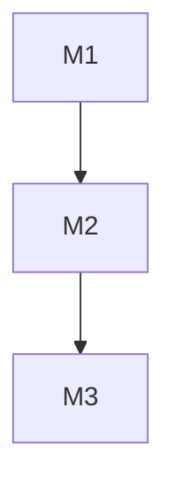
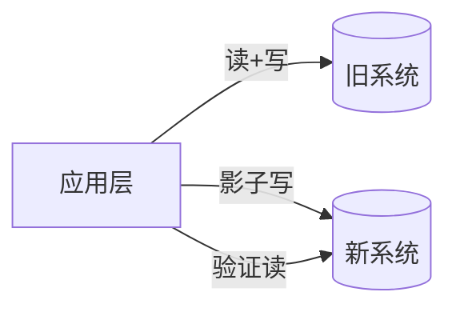

# PLAN.md 四套规模模板

> §B plan 模式的详细模板。根据任务规模选择。适用于所有任务类型——代码、文档、研究、迁移等。
> "产出物"和"验证方式"因领域而异，表格下方有领域差异对照。

---

## 1. 小型（1-3 文件, <4h）

适用：Bug 修复、小功能增强、配置变更。

```markdown
# PLAN: <一句话标题>

> 关联 Issue: #<num>
> 预计耗时: <Xh>

## 根因 / 背景
<2-3 句话>

## 任务

1. **修改** `<file>` — <做什么>
   - 验证: `<command>`
   - ✅ 完成标志: <可验证标准>

2. **添加** `<file>` — <做什么>
   - 验证: `<command>`

## 完成标准
- [ ] <标准 1>
- [ ] PR 已创建
```

**要点**：不分 Phase。每个任务必须有验证命令。

---

## 2. 中型（4-15 文件, 1-3 天）

适用：新功能开发、模块重构、API 新增。

```markdown
# PLAN: <功能名称>

> 关联 SPEC: @<path>
> 预计耗时: <N> 天

## 背景
<为什么做，目标是什么>

## 前置条件
- [ ] <条件>

## 任务分解

### Phase 1: <阶段名>（Day X 上午）

| # | 任务 | 文件 | 验证 | 状态 |
|---|------|------|------|------|
| 1.1 | <任务> | `path/to/file` | `<command>` | ⬜ |
| 1.2 | <任务> | `path/to/file` | `<command>` | ⬜ |

### Phase 2: <阶段名>（Day X 下午）

| # | 任务 | 文件 | 验证 | 状态 |
|---|------|------|------|------|
| 2.1 | <任务> | `path/to/file` | `<command>` | ⬜ |

### Phase 3: 测试与文档

| # | 任务 | 文件 | 验证 | 状态 |
|---|------|------|------|------|
| 3.1 | E2E 测试 | `e2e/<feature>.spec.ts` | `pnpm e2e` 全绿 | ⬜ |
| 3.2 | 更新文档 | `docs/<file>` | Review | ⬜ |

## 风险
- ⚠️ <风险> → <缓解>

## 完成标准
- [ ] <验收标准>

## 恢复指南
会话中断后：发 "读取 @PLAN.md，当前 Phase X 进行中，继续执行。"
```

**要点**：必须分 Phase。每 Phase 有时间预算。用表格。有恢复指南。

---

## 3. 大型（15+ 文件, 1+ 周）

适用：微服务拆分、大规模重构、新系统。

```markdown
# PLAN: <项目名>

> 关联 SPEC: @<path>
> 关联 ADR: @<path>
> 预计耗时: <N> 周
> 团队: <人数和角色>

## 里程碑

```mermaid
gantt
    title <项目> 开发计划
    dateFormat YYYY-MM-DD
    axisFormat %m/%d

    section <Section 1>
    <Task>     :m1, 2026-XX-XX, Nd
    <Task>     :m2, after m1, Nd

    section <Section 2>
    <Task>     :s1, after mN, Nd
```

### Milestone 1: <名>（Week N）

#### Phase 1.1: <子阶段>

| # | 任务 | 负责人 | 文件 | 验证 | 状态 |
|---|------|--------|------|------|------|
| 1.1.1 | <任务> | @person | `path` | `<cmd>` | ⬜ |

### Milestone 2: <名>（Week N）
...

## 跨阶段依赖



## 风险矩阵

| 风险 | 概率 | 影响 | 缓解 | 负责人 |
|------|------|------|------|--------|
| <风险> | 低/中/高 | 🔴/🟡/🟢 | <措施> | @person |

## 决策记录

| 日期 | 决策 | 理由 |
|------|------|------|
| YYYY-MM-DD | <决策> | <原因> |

## 变更日志

| 日期 | 版本 | 变更 | 原因 |
|------|------|------|------|

## 恢复指南
会话中断后：发 "读取 @PLAN.md，检查已完成 Task，继续下一个。"
```

**要点**：多级分解。甘特图。明确负责人。风险矩阵。

---

## 4. 数据库/框架迁移

适用：数据库切换、框架升级、语言迁移。

```markdown
# PLAN: <迁移名称>

> 预计耗时: <N> 周
> ⚠️ 高风险：涉及生产数据/核心依赖

## 策略
双写 + 影子验证



### Phase 1: <准备>（Day X-Y）

| # | 任务 | 验证 | 回滚条件 | 状态 |
|---|------|------|----------|------|
| 1.1 | <任务> | `<cmd>` | <条件> | ⬜ |

### Phase 2: <切换>（Day X-Y）

| # | 任务 | 验证 | 回滚条件 | 状态 |
|---|------|------|----------|------|
| 2.1 | 1% 流量切换 | 监控正常 | 回到 0% | ⬜ |
| 2.2 | 逐步放大 10%→50%→100% | 监控正常 | 回到上一步 | ⬜ |

### Phase 3: <清理>

| # | 任务 | 验证 | 状态 |
|---|------|------|------|
| 3.1 | 观察 3 天 | 监控 | ⬜ |
| 3.2 | 归档旧系统 | 备份完成 | ⬜ |

## 应急回滚
```bash
<rollback command>
```

## 恢复指南
会话中断后：发 "读取 @PLAN.md，检查当前 Phase 和 Task 状态，继续执行。"
```

**要点**：每步有回滚条件 + 命令。双写 + 影子验证。流量渐进切换。

---

## SMART 验证标准速查

| 原则 | ❌ 模糊 | ✅ 具体（代码） | ✅ 具体（非代码） |
|------|---------|----------------|-----------------|
| Specific | "完成" | `pnpm test --filter auth` | "文档 ≥ 2000 字，含 3+ Mermaid 图" |
| Measurable | "质量好" | "p99 < 100ms" | "每观点 ≥ 2 个引用来源" |
| Achievable | "零 bug" | "已知测试全绿" | "所有链接可达" |
| Relevant | "全覆盖" | "关键路径 > 90%" | "章节覆盖目标读者所有痛点" |
| Time-bound | "尽快" | "Phase 1 内" | "本周内完成 §1-§3" |

## 产出物与验证方式领域对照

| 领域 | 产出物示例 | 验证方式示例 |
|------|-----------|------------|
| 代码 | `src/auth/service.ts` | `pnpm test --filter auth` 全绿 |
| 文档 | `docs/api-reference.md` | Review: 格式/交叉引用/完整性；`grep -c '§' docs/*.md` 引用数 |
| 研究 | 调研报告 §1-§5 | 每节 ≥ 3 个来源；数据有引用；含对比表 |
| 内容创作 | 书籍第 3 章 | 3000-5000 字；含代码示例 + Mermaid 图；可运行验证 |
| 迁移 | 数据迁移脚本 | 行数一致 + 抽样对比 + 回滚测试通过 |
| 基础设施 | Terraform module | `terraform validate` + `terraform plan` 无意外变更 |

## INVEST 任务质量速查

- **I**ndependent: 不依赖同级未完成任务
- **N**egotiable: 实现方式可讨论
- **V**aluable: 完成后有可验证价值
- **E**stimable: 可估计工作量
- **S**mall: 一次会话内可完成 (<2h)
- **T**estable: 有明确验证方式

## 任务状态标记

| 标记 | 含义 |
|------|------|
| ⬜ | 待开始 |
| 🟡 | 进行中 |
| ✅ | 完成（填写实际结果） |
| ❌ | 阻塞（填写原因） |
| 🔄 | 需要修改（填写原因） |
