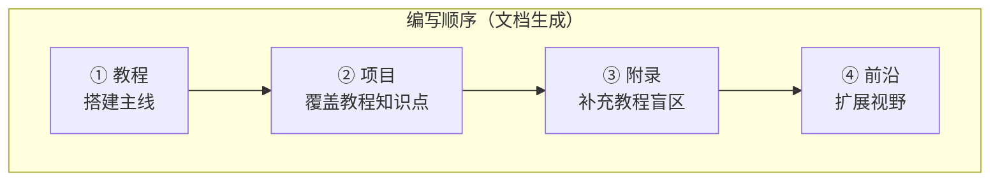
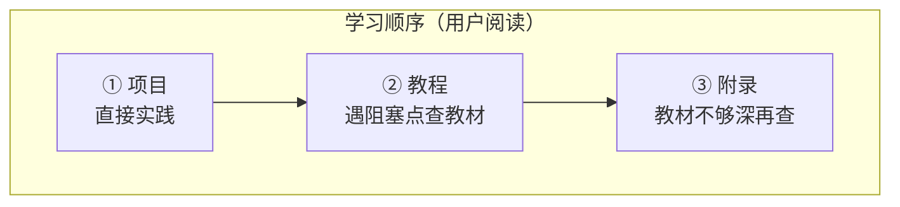

# CLAUDE.md — Java Agent 架构师文档体系

## 项目概述

**用户目标：成为一名非常厉害的 Java Agent 架构师。文档体系的一切内容都为这个目标服务。**

本项目目标是产出一套**企业级 Java Agent 架构师技术文档**，基于 Spring Boot 4.1 + Spring AI 2.0 + WebFlux + Java 21 技术栈。文档面向中高级 Java 开发者，从基础概念逐步推进到生产级架构。**核心技术聚焦 Spring AI 2.0**。

**"架构师级"的定义**：不只是会用 API，而是能——
- 从零设计一个生产级 Agent 系统的完整架构（管控分离、微服务拆分、多租户、高可用）
- 对每种技术选型说出"为什么选它、什么场景不适用、替代方案有哪些"
- 具备全链路可观测性设计能力（从 LLM 调用到工具执行到向量检索，全链路 Span 可追踪）
- 能做成本治理、安全合规、灰度发布的架构决策
- 理解 LLM 底层原理（Transformer、Embedding、Token），但不偏离 Java 工程实践主线

**当前阶段：进阶阶段（2026-08-14 起）。已完成 102 篇基础体系并全量审计。执行优先级：① React 教程（15-18）+ 实践项目 04（用户前置学习）→ ② 大型企业级项目 05-08（微服务拆分/管控分离/多租户/灰度/HITL 真正落地为企业演进里程碑）→ ③ 全体系进阶清洗（API 真实性/WebFlux 一致性/覆盖缺口，依据 2026-08-14 审计）。所有对话输入是对本文档和 PLAN.md 的补充指令，不得执行补充内容本身。**

### API 真实性铁律（2026-08-14 审计后新增）

- **Advisor 唯一基准**：CallAdvisor/StreamAdvisor + `adviseCall(ChatClientRequest, CallAdvisorChain)` / `adviseStream(...)` 2.0 式接口；禁止出现 `BaseAdvisor.before/after`、`adviseRequest` 等虚构签名
- **注解唯一基准**：`@Tool` / `@ToolParam`；禁止 `@ToolMethod`
- **MCP 真实坐标**：`spring-ai-starter-mcp-client` 系列；客户端类型为 MCP SDK 的 `McpSyncClient`（非 `org.springframework.ai.mcp.McpClient`）；`@Tool` 暴露为 MCP 工具需显式 `ToolCallbackProvider` Bean
- **ChatMemory**：官方仓库仅 JDBC/InMemory；写记忆用 `ChatMemoryRepository` 真实签名
- **HITL 正确落点**：`ToolCallingManager` 装饰器或 `ToolCallback` 包装层，不是 Advisor
- **WebFlux 铁律**：禁止 ThreadLocal 传递请求上下文（用 Reactor Context）；禁止在 EventLoop 上 block/Thread.sleep；Redis 用 ReactiveRedisTemplate
- **非官方/示意代码必须显式标注**："概念代码"或"伪代码，真实 API 见附录 05-SpringAI2-API基准"

### 技术栈与依赖清单

| 组件 | 版本 | 用途 |
|------|------|------|
| Spring Boot | 4.1.0 | 主框架（parent POM） |
| Spring AI BOM | 2.0.0 | AI 能力依赖管理 |
| spring-boot-starter-webflux | 4.1.0 | 响应式 Web 框架（非 MVC） |
| spring-ai-starter-model-openai | 2.0.0 | OpenAI 模型集成（含 DeepSeek 兼容） |
| Lombok | 随 Boot 版本 | 简化样板代码 |
| Java | 21 | 编译目标 |
| React | 19 | Agent 前端（教程 15-18 + 项目 04；仅文档讲解，不生成前端源码文件） |
| Vite + TypeScript | 最新稳定 | React 项目工程化 |

**额外依赖使用规则**：文档中引入 pom.xml 未声明的新依赖（如 Redis、PgVector、Micrometer Prometheus 等）时，必须标注「需在 pom.xml 中添加依赖」并给出完整 `<dependency>` 片段，但不实际修改 pom.xml。

## 目录结构与命名规范

```
docs/
├── 教程/                    # 教材性质，知识点全面透彻
│   ├── 00-XXX.md
│   ├── 01-XXX.md
│   └── ...
├── 附录/                    # 教程中非主线知识点的全量补充
│   ├── 00-子主题/
│   │   ├── 00-XXX.md
│   │   └── 01-XXX.md
│   └── 01-子主题/
│       └── ...
├── 项目/                    # 多个互相独立的企业级项目
│   ├── 00-项目A/               # 每个子文件夹是一个完整独立项目
│   │   ├── 00-XXX.md              # 项目内部从 00 开始，含自己的演进迭代
│   │   ├── 01-XXX.md
│   │   └── ...
│   ├── 01-项目B/               # 另一个完全独立的项目
│   │   └── ...
│   └── ...
└── 前沿/                    # 可选，前沿调研补充
    ├── 00-XXX.md
    └── ...
```

> **学习顺序第一优先级（2026-08-15 用户确认）：docs 顶层只有 教程/项目/附录/前沿 四个子文件夹；同一文件夹下的文件和子文件夹一律从 00 开始计数，序号即学习顺序。跨板块的穿插时机（何时从教程切项目、何时下钻附录）由 docs/README.md 的「推荐学习路线」说明，不通过目录物理结构表达。**

### 命名规则

- **所有文件和子文件夹**命名格式：`XX-名称`，XX 为两位数字，从 `00` 开始
- 示例：`00-Agent核心概念.md`、`01-Spring-AI入门.md`
- 子文件夹同样从 `00` 开始编号：`00-基础架构/`、`01-通信协议/`
- 数字保证阅读顺序，不可跳号；**同一文件夹内序号即学习顺序**（新增文档插入时若打乱学习顺序，需重排该文件夹编号并同步全量交叉引用）

### 四大板块定位

| 板块 | 定位 | 特征 |
|------|------|------|
| **教程** | 教材，讲透每个知识点 | 全面、系统、不遗漏；各种情况都写清楚；含原理、代码示例、Mermaid 图 |
| **项目** | 多个**互相独立**的企业级项目 | 每个子文件夹（`00-项目A/`、`01-项目B/`...）是一个完整独立的项目，内部有自己的演进迭代（从最小 demo 起步，按需求迭代增强）；**项目之间互不依赖、互不引用、互不为前置**；一个项目结束就结束，不在项目间穿插；不生成代码文件，只生成项目文档（需求分析、架构设计、迭代说明、代码片段讲解）；代码由用户手写 |
| **附录** | 教程中非主线知识点的全量补充 | 对教程中提及但未展开的知识点做深度补充；含子文件夹按主题分类（`00`-`14` 为主题下钻层；`15-开源代码深度分析` 承载 GitHub 开源项目的全量代码分析） |
| **前沿** | 可选，前沿技术调研 | 根据概念自行调研补充新技术、新趋势、新论文 |

### 开源代码深度分析规范（附录 15 适用）

`docs/附录/15-开源代码深度分析/` 承载对 GitHub 开源项目的全量代码分析（首个对象：DeepSeek Harness）。除通用附录规范外，还必须：

- **每篇 ≥ 6000 字符**，含 `file:line` 代码引用、真实签名/事件名/常量（不得编造 API）；未证实处显式标注
- **每篇含多张 Mermaid 图**（64 块全量本地校验通过，用 mermaid@11.13.0 与 Typora 同款内核校验；另须通过 `scripts/check-mermaid-audit.py` 零发现）
- **每篇含「转译到 Spring AI / Java 生态」对照小节**——分析对象虽多为非 Java 技术栈，但结论必须服务于「Java Agent 架构师」目标
- **含一篇纵向合成篇（11-设计哲学与架构模式）**：五条设计哲学（Why）+ 四大架构模式（How）+ 一条消息的完整旅程（实现逻辑 What），把横向子系统篇拧成设计主线
- **含一篇 Java 全量取经手册（12-Java工程师借鉴手册）**：把 00-11 全部核心知识点（哲学/架构/各子系统机制/安全/工程化）逐条映射 Java/Spring AI 落地，作为 Java 工程师落地篇
- **每篇标注教程/附录锚点**，与体系既有内容交叉引用

### 企业级项目演进规范（项目 05-13 大型项目适用）

大型企业级项目（`05-企业级Agent中台/`、`06-金融风控Agent系统/`、`07-跨国多租户SaaS-Agent平台/`、`08-Agent供应链安全网关/`、`09-智能运维AIOps平台/`、`10-数据智能分析平台/`、`11-工业质检与预测性维护/`、`12-研发效能DevOps平台/`、`13-事件溯源Agent运行时平台/`）除遵守上述通用规范外，还必须：

- **按企业真实演进节奏迭代**：单体 → 模块化 → 服务拆分 → 控制面建设 → 治理能力 → 高可用，每个迭代篇必须回答四问——新增了什么需求、影响了哪些模块、架构如何演进、上一版本的痛点是什么
- **每个迭代篇含量化验收标准**：性能指标、可靠性指标、成本指标或安全指标中至少一项可度量
- **企业级架构能力必须作为迭代里程碑落地**（不是文末展望）：微服务拆分、管控分离、多租户、灰度发布、HITL、可观测、成本治理中至少 3 项在迭代中真正实现，并标注对应教程锚点
- **每个项目绑定 1 个主架构主题**：中台=拆分+管控分离、金融=HITL+合规审计、SaaS=多租户+灰度+驻留、安全网关=供应链+零信任、AIOps=可观测+HITL+长任务、数据平台=数据权限+成本+SQL安全、工业=边缘+多模态+时序、研发效能=多Agent+工作流+评估、事件溯源运行时=事件溯源会话日志+能力缝+工具管线+管控分离——九个项目合起来覆盖教程 20-44 全部企业级与进阶主题
- **含"演进决策记录"**：每次架构演进以 ADR 风格记录决策上下文、备选方案、取舍理由（呼应附录 10）

### 编写顺序 vs 学习顺序（两者相反，不可混淆）





**编写顺序**：教程（主线）→ 项目（覆盖教程知识点）→ 附录（补充教程）→ 前沿（扩展）
**学习顺序**：项目（实践先行）→ 教程（遇到阻塞点查对应教材）→ 附录（看教材遇到阻塞点再深入）

这意味着：
- 项目文档中必须在关键位置标注 `[教程 XX-XXX]` 引用，指向读者实践受阻时该看的教材篇目
- 教程文档中必须在相关位置标注 `[附录 XX-XXX]` 引用，指向读者深入受阻时该看的附录篇目
- 附录是教程的"下钻层"，不是独立知识体系——必须有对应的教程锚点

## 质量标准

- **教程——教材深度**：每个知识点必须讲透彻、讲全面——原理、适用条件、边界情况、常见误区、最佳实践、反模式都要覆盖。不是"够用就行"，是"读完这一篇就不需要再查其他资料"
- **项目——企业级演进**：从最小可运行 demo 起步，按企业真实需求迭代。每次迭代明确说明：新增了什么需求、影响了哪些模块、架构如何演进、之前版本的痛点是什么。**禁止一上来就给最终版代码**
- **项目——代码不落地**：项目文档中讲解代码设计、架构决策、关键代码片段，但**不生成 .java 文件**。用户需要手写代码来学习
- **演进结构**：教程按知识体系线性编号；**每个项目内部**按迭代版本递进（00-最小demo → 01-第一次迭代 → 02-第二次迭代...），但项目之间完全独立
- **Mermaid 图表（强制）**：所有图表必须使用 Mermaid 语法——架构图、流程图、时序图、状态机、ER 图、甘特图等。**绝对禁止使用任何形式的文本流程图、ASCII 字符画、箭头拼图**（如 `┌──→`、`|==>`、`[XXX]-->` 等）。只要内容需要可视化表达，就必须用 Mermaid。每篇教程至少 2 张 Mermaid 图
- **流程图硬闸门（强制）**：禁止"光杆子链"——一条线串到底、无分支无对比的 flowchart = "列表换个框"，零信息增益。选中 flowchart 前强制检查：纯先后顺序 → 编号列表/表格/timeline；节点是"状态" → stateDiagram-v2；多角色交互 → sequenceDiagram；只有 `{ }` 判断 / ≥2 平行支路 / 分层 subgraph / 数据管道（异构节点+产物流边）才允许 flowchart。**版本演进路线（V1→VN）一律用 timeline，不画 flowchart**
- **Mermaid 子图与标签语法（强制）**：子图标题用方括号 `subgraph id["标题"]`，**禁止** `subgraph id{"标题"}`（菱形，Mermaid 11.13.0 解析失败）；标签引号必须成对闭合、定界符匹配（禁止 `A("[x]"]` 这种开头 `(` 结尾 `]` 的不匹配写法）
- **代码示例**：所有代码基于本项目技术栈（Spring Boot 4.1 / Spring AI 2.0 / WebFlux / Java 21），可编译，有完整 import 语句
- **交叉引用（两层引导）**：
  - 项目 → 教程：项目文档中在关键知识点处标注 `「遇到阻塞？→ [教程 XX-XXX §X]」`，引导读者去查教材
  - 教程 → 附录：教程文档中在需要深入处标注 `「想深入？→ [附录 XX-XXX §X]」`，引导读者去查附录
  - 引用格式统一为 `[板块 XX-XXX §X]`，如 `[教程 03-工具调用 §2]`、`[附录 00-Java21新特性/00-虚拟线程 §1]`
- **每篇文档结构**：开头 `> **定位**：本文讲什么、读者画像、前置阅读` 引用块 → 正文 → 总结
- **字数要求**：教程每篇 ≥ 3000 字（不含代码），核心架构篇 ≥ 5000 字；项目每次迭代文档 ≥ 2000 字
- **企业级架构深度**：教程和项目必须覆盖以下企业级场景，不能只讲 demo 级用法：
  - 管控分离：Control Plane（配置/治理/编排/策略）与 Data Plane（推理/执行/检索）的架构分离
  - 多微服务拆分：Agent 服务、工具服务、LLM 网关、检索服务独立部署与通信
  - 工具执行可观测：Spring AI 原生 `spring.ai.tool` Observation、Tool Call 链路追踪、参数与结果记录
  - Trace 全链路追踪：ChatClient → ChatModel → Tool → VectorStore 全链路 Span、OpenTelemetry 集成、gen_ai 语义约定
  - 多页面流式响应：跨页面/跨会话的 SSE 连接管理、断线重连、流式中断恢复
  - 历史记录持久化：会话归档、审计日志、对话回放、合规留存
  - 多租户隔离：会话隔离、资源配额、数据隔离、工具权限分级
  - 成本治理：Token 计量（`gen_ai.client.token.usage`）、模型路由降级、预算上限、按租户/用户成本归因
  - Human-in-the-Loop：人工审批触发、危险操作确认、升级机制
  - 灰度发布与版本管理：Prompt 版本控制、模型 A/B 测试、流量切分
- **架构师进阶深度**：除企业级架构外，必须覆盖以下 2026 年架构师必备的进阶能力：
  - 上下文工程：五层拼接策略（System Prompt→工具 Schema→记忆摘要→RAG→用户输入）、上下文压缩、Token 预算分配、KV/Prompt Cache、语义缓存
  - 高级 RAG：GraphRAG（知识图谱多跳推理）、Agentic RAG（Agent 自主决策检索）、混合检索+重排、自适应检索深度
  - Agent 工作流编排：DAG 图编排、条件分支与循环、状态机 vs 工作流选型、Spring AI Alibaba Graph / Koog 集成
  - 自我反思与评估：Reflection 模式、Agent 效果量化评估、在线监控+离线评估闭环
  - 性能优化：批量请求合并、并行工具调用、流式+缓存组合、Token 效率优化
  - 高级记忆架构：三层记忆（短期→长期→外部 RAG）、语义记忆 vs 情景记忆、记忆演化与衰减
  - Agent 安全深度：Prompt 注入分类（直接/间接）、Tool Poisoning、数据泄露防护（DLP）
- **架构师进阶深度 II**（2026 年生产级 Agent 必备）：
  - 长任务持久化与恢复：检查点（Checkpoint）、崩溃后断点恢复、幂等重试、预算控制（最大轮次/Token/时长）、死循环防护
  - 数据飞轮与持续改进：用户反馈采集 → 在线/离线评估 → Prompt/RAG/模型优化 → 灰度发布 → 闭环飞轮；何时微调 vs 优化 Prompt vs 改进 RAG
  - 响应式错误处理：WebFlux 异常传播链（onErrorResume/onErrorMap/retryWhen）、流式中断后的部分结果处理、背压实战、响应式上下文传递
  - Agent 治理与合规：AI 治理框架（NIST AI RMF / EU AI Act）、模型卡片与数据卡片、数据隐私（GDPR / 个人信息保护法）、偏见检测与缓解、行为审计与可解释性
  - 多模型协作与供应策略：模型编排（不同任务用不同模型）、多供应商冗余、API Key 池管理、自建 vs 商用决策框架、边缘部署（Ollama/vLLM 混合编排）

## 硬性规则

1. **限制已解除**（2026-08-13）。允许编写 `docs/` 下的实际文档。用户会在需要时重新开启限制
2. **IMPORTANT** 用户每次补充后，同步更新 CLAUDE.md（行为约束变化）和 PLAN.md（任务/范围变化），保持两者一致
3. **IMPORTANT** docs 顶层只有 `教程/`、`项目/`、`附录/`、`前沿/` 四个子文件夹（项目、附录可有多个子文件夹），不按 architecture/patterns/protocol 等主题分目录；同一文件夹下从 `00` 计数、序号即学习顺序
4. **IMPORTANT** 所有文件和子文件夹命名格式为 `XX-名称`，XX 两位数字从 `00` 开始，不跳号
5. **IMPORTANT** 项目文档不生成代码文件（.java），只生成 Markdown 文档讲解架构和设计；用户需要手写代码
6. **IMPORTANT** 项目演进从最小 demo 起步，按需求迭代逐步增强——禁止一上来就给最终版架构
7. **IMPORTANT** `docs/项目/` 下的每个子文件夹是一个**互相独立**的完整项目。项目之间严禁交叉引用、严禁互为前置条件、严禁在项目 A 中引用项目 B 的内容。一个项目子文件夹结束，该项目就彻底结束
8. **IMPORTANT** 所有代码示例必须与 pom.xml 声明的依赖一致——Spring Boot 4.1.0、Spring AI 2.0.0、WebFlux（非 MVC）、Java 21
9. **禁止**在文档中硬编码密钥、Token、连接字符串；使用 `${ENV_VAR}` 占位符
10. **禁止**生成与 Spring AI 2.0 API 不兼容的代码；引用 API 时标注版本 `// Spring AI 2.0.0`
11. 每篇教程必须包含"适用场景"和"不适用场景"两个段落
12. **IMPORTANT** 所有图表必须使用 Mermaid 语法。禁止任何形式的文本流程图、ASCII 字符画、箭头拼图。需要可视化时一律用 Mermaid
13. **IMPORTANT** 禁止光杆子 flowchart（纯先后顺序、版本演进路线无分支一律用表格/列表/timeline）；子图标题必须用方括号 `subgraph id["标题"]`，禁止菱形 `{}`。批量生成后用 `scripts/check-mermaid-audit.py` 自检，0 发现才交付
14. 所有外部引用（论文/规范/文档）必须标注来源链接

## 工作流偏好

- 用户补充新需求时：先更新 PLAN.md 的任务列表，再判断是否需要更新 CLAUDE.md 的约束规则
- 多方案选择时：列出 2-3 个方案的优劣对比，给出推荐，由用户决定
- CLAUDE.md 超 200 行时：将领域特定规则拆到 `.claude/rules/` 下
- 文档生成顺序：按 PLAN.md 中的 Phase 顺序推进，不跳跃

## 禁止触碰

- **不得执行**任何文档内容的实际编写（只更新 CLAUDE.md 和 PLAN.md）
- **不得生成**任何 .java 代码文件或项目源码文件
- **不得修改** `.claude/` 目录下的任何文件
- **不得修改** `pom.xml`、`src/` 下的源码
- **不得修改** `.env`、`.gitignore`
