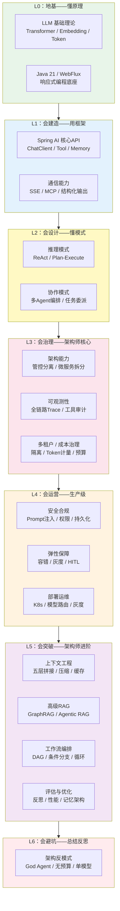
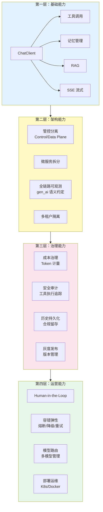

# PLAN.md — Java Agent 架构师文档执行轨道

> **最后更新**：2026-08-13
> **当前状态**：Phase 0 进行中（治理文件迭代中），等待用户补充后进入 Phase 1

---

## 任务总览

**用户目标：成为一名非常厉害的 Java Agent 架构师。文档体系的一切内容都为这个目标服务。**

基于 Spring Boot 4.1 + Spring AI 2.0 + WebFlux + Java 21 技术栈，构建一套企业级 Java Agent 架构师文档体系。**核心技术聚焦 Spring AI 2.0**。

### 架构师成长路径



**编写顺序对应成长路径**：L0 附录 → L1 基础教程 → L2 进阶教程 → L3 企业级架构教程 → L4 工程实践教程 → L5 架构师进阶教程 → 项目实战
**学习顺序相反**：先从项目实战入手（L1-L2 层），遇到阻塞查教程，教程不够深查附录（L0 层）

### 架构师能力矩阵

| 能力层 | 对应教程 | 能做到什么 |
|--------|---------|-----------|
| L0 地基 | 附录 05-LLM理论、附录 00-Java21、附录 01-WebFlux | 理解底层原理，不是黑盒使用者 |
| L1 建造 | 教程 00-13（基础+进阶） | 用 Spring AI 2.0 从零搭建一个功能完整的 Agent |
| L2 设计 | 教程 06-08（推理+协作模式） | 为不同业务场景选择正确的 Agent 模式 |
| L3 治理 | 教程 14-23（企业级架构） | 设计管控分离、全链路可观测、多租户的生产级架构 |
| L4 运营 | 教程 24-28（工程实践） | 让系统安全、稳定、经济地跑在生产环境 |
| L5 进阶 | 教程 29-39（架构师进阶 I+II） | 上下文工程、高级RAG、工作流编排、性能优化、评估闭环、长任务恢复、数据飞轮、治理合规 |
| L6 总结 | 教程 40（架构反模式） | 避坑——知道什么不该做，和知道什么该做一样重要 |
| 实战 | 项目 A-D | 从需求到架构到迭代，完整走一遍企业级项目 |

### 文档体系结构

```
docs/
├── 教程/                                         # 教材性质，知识点全面透彻
│   ├── 00-Agent核心概念.md                          # 什么是 Agent、与普通应用的区别、核心组成
│   ├── 01-Spring-AI框架入门.md                       # Spring AI 2.0 架构、核心 API、项目搭建
│   ├── 02-ChatClient与对话模型.md                    # ChatClient API、Prompt 工程、SystemMessage
│   ├── 03-工具调用.md                                # Function Calling、@Tool、工具注册与发现
│   ├── 04-记忆与会话管理.md                           # ChatMemory、会话存储、短期 vs 长期记忆
│   ├── 05-RAG检索增强生成.md                         # 向量存储、Embedding、检索策略、RAG 全流程
│   ├── 06-ReAct推理模式.md                          # 推理-行动循环、Thought-Action-Observation
│   ├── 07-Plan-and-Execute模式.md                   # 规划-执行分离、任务分解
│   ├── 08-多Agent协作.md                            # Agent 间通信、编排模式、角色分工
│   ├── 09-SSE流式通信.md                            # WebFlux SSE、流式响应、前端对接
│   ├── 10-MCP协议.md                                # Model Context Protocol、MCP 客户端/服务端
│   ├── 11-Agent状态管理.md                          # 状态机、上下文管理、会话生命周期
│   ├── 12-结构化输出.md                              # Structured Output、JSON Schema、BeanOutputConverter
│   ├── 13-Advisor链与拦截器.md                       # Advisor API、前置/后置处理、中间件模式
│   │
│   │   ────── 企业级架构专项 ──────
│   ├── 14-管控分离架构.md                            # Control Plane / Data Plane 分离、治理层设计
│   ├── 15-微服务拆分与Agent部署.md                   # Agent 服务化、工具服务化、LLM 网关、服务间通信
│   ├── 16-全链路可观测性.md                          # Spring AI 原生 Observation、gen_ai 语义约定、OTel 集成
│   ├── 17-工具执行可观测与审计.md                    # Tool Call Span、参数结果记录、安全审计日志
│   ├── 18-多页面流式响应与会话管理.md                # 跨页面 SSE、断线重连、流式中断恢复、连接池
│   ├── 19-历史记录持久化与合规.md                    # 会话归档、对话回放、审计留存、数据生命周期
│   ├── 20-多租户隔离与资源治理.md                    # 会话隔离、资源配额、数据隔离、工具权限分级
│   ├── 21-成本治理与Token计量.md                    # gen_ai.client.token.usage、按租户归因、预算上限
│   ├── 22-Human-in-the-Loop与审批流.md             # 人工审批触发、危险操作确认、升级机制
│   ├── 23-灰度发布与版本管理.md                     # Prompt 版本控制、模型 A/B 测试、流量切分
│   │
│   │   ────── 工程实践 ──────
│   ├── 24-容错与弹性设计.md                         # 重试、降级、熔断、超时、限流
│   ├── 25-安全与权限控制.md                         # 认证授权、Prompt 注入防护、工具权限、Tool Poisoning
│   ├── 26-向量数据库选型.md                         # PgVector / Pinecone / Chroma / Redis 对比
│   ├── 27-模型路由与降级.md                         # 多模型管理、路由策略、成本控制
│   ├── 28-部署与运维.md                             # Docker / K8s 部署、配置管理、生产实践
│   │
│   │   ────── 架构师进阶 ──────
│   ├── 29-上下文工程.md                              # 五层拼接、上下文压缩、Token预算、KV/Prompt Cache、语义缓存
│   ├── 30-高级RAG与AgenticRAG.md                   # GraphRAG、多跳推理、自适应检索、Agent决策检索
│   ├── 31-Agent工作流编排.md                        # DAG图编排、条件分支与循环、状态机vs工作流、Graph集成
│   ├── 32-自我反思与Agent评估.md                    # Reflection模式、量化评估、在线监控+离线评估闭环
│   ├── 33-Agent性能优化.md                          # 批量请求、并行工具调用、流式+缓存、Token效率
│   ├── 34-高级记忆架构.md                           # 三层记忆、语义vs情景、记忆演化与衰减、记忆隔离
│   │
│   │   ────── 架构师进阶 II ──────
│   ├── 35-长任务持久化与中断恢复.md                  # Checkpoint、断点恢复、幂等重试、预算控制、死循环防护
│   ├── 36-数据飞轮与持续改进.md                      # 反馈采集→评估→优化→灰度→闭环、微调vs Prompt vs RAG决策
│   ├── 37-响应式错误处理.md                          # WebFlux异常传播、流式中断恢复、背压实战、Context传递
│   ├── 38-Agent治理与合规框架.md                    # NIST AI RMF、模型卡片、GDPR隐私、偏见检测、行为审计
│   └── 39-多模型协作与供应策略.md                   # 模型编排、多供应商冗余、API Key池、自建vs商用、边缘部署
│   │
│   │   ────── 总结 ──────
│   └── 40-Agent架构反模式与避坑指南.md              # God Agent、硬编码Prompt、无超时无预算、单模型无降级、工具无幂等——全量反模式汇总
│
├── 附录/                                         # 教程中非主线知识点的全量补充
│   ├── 00-Java21新特性/
│   │   ├── 00-虚拟线程.md
│   │   ├── 01-Record与模式匹配.md
│   │   └── 02-SealedClasses.md
│   ├── 01-WebFlux与响应式编程/
│   │   ├── 00-Reactor核心.md
│   │   ├── 01-背压与流量控制.md
│   │   └── 02-WebFlux-vs-MVC.md
│   ├── 02-Prompt工程/
│   │   ├── 00-Prompt设计模式.md
│   │   ├── 01-Prompt模板管理.md
│   │   └── 02-Prompt注入防御.md
│   ├── 03-Spring-AI源码解析/
│   │   ├── 00-ChatClient源码.md
│   │   └── 01-Advisor执行链源码.md
│   ├── 04-测试策略/
│   │   ├── 00-单元测试.md
│   │   ├── 01-集成测试.md
│   │   └── 02-Eval评估.md
│   ├── 05-LLM基础理论/
│   │   ├── 00-Transformer架构.md
│   │   ├── 01-Embedding原理.md
│   │   └── 02-上下文窗口与Token.md
│   └── 06-企业级架构模式/                          # 企业级架构的深度补充
│       ├── 00-ControlPlane设计模式.md
│       ├── 01-Agent沙箱与隔离机制.md
│       └── 02-事件驱动Agent架构.md
│   ├── 07-语义缓存与性能/                           # 缓存策略深度补充
│   │   ├── 00-语义缓存实现.md                        # 相似Query语义级缓存、Advisor缓存拦截
│   │   ├── 01-Prompt缓存与KVCache.md               # 前缀缓存、缓存断点、缓存命中率优化
│   │   └── 02-批量推理与请求合并.md                  # Batch Inference、请求队列、吞吐优化
│   └── 08-Agent安全深度/                           # Agent安全攻防深度补充
│       ├── 00-Prompt注入分类与案例.md               # 直接注入vs间接注入、真实攻击案例
│       ├── 01-ToolPoisoning攻击.md                 # 工具投毒、恶意工具注册、防御策略
│       └── 02-数据泄露防护.md                       # DLP在Agent场景的挑战与方案
│   └── 09-AI治理与合规/                             # Agent治理框架深度补充
│       ├── 00-NIST-AI-RMF框架.md                    # AI 风险管理框架落地实践
│       ├── 01-模型卡片与数据卡片.md                  # Model Card / Data Card 透明度实践
│       └── 02-数据隐私与偏见检测.md                  # GDPR落地、偏见检测与缓解策略
│   └── 10-架构决策方法论/                           # 架构师核心软技能
│   │   └── 00-ADR架构决策记录.md                    # ADR 写法、何时推翻决策、技术选型框架
│   └── 11-Agent交互设计/                           # Agent UX 深度
│       └── 00-Agent用户体验设计.md                  # 流式打字、中间状态、工具透明化、错误交互——Agent 的 UX 和传统 Web 不同
│
├── 项目/                                         # 多个互相独立的企业级项目
│   ├── 00-智能客服系统/                             # 独立项目 A
│   │   ├── 00-需求分析与架构设计.md
│   │   ├── 01-最小Demo搭建.md
│   │   ├── 02-迭代一-工具集成.md
│   │   ├── 03-迭代二-RAG知识库.md
│   │   ├── 04-迭代三-记忆与会话.md
│   │   └── 05-核心代码讲解.md
│   ├── 01-智能文档助手/                             # 独立项目 B
│   │   ├── 00-需求分析与架构设计.md
│   │   ├── 01-最小Demo搭建.md
│   │   ├── 02-迭代一-文档解析与向量化.md
│   │   ├── 03-迭代二-多源检索与重排.md
│   │   └── 04-核心代码讲解.md
│   ├── 02-多Agent协作平台/                          # 独立项目 C
│   │   ├── 00-需求分析与架构设计.md
│   │   ├── 01-最小Demo搭建.md
│   │   ├── 02-迭代一-单Agent工具链.md
│   │   ├── 03-迭代二-多Agent编排.md
│   │   ├── 04-迭代三-任务委派与路由.md
│   │   └── 05-核心代码讲解.md
│   └── 03-MCP工具网关/                              # 独立项目 D
│       ├── 00-需求分析与架构设计.md
│       ├── 01-最小Demo搭建.md
│       ├── 02-迭代一-MCP客户端集成.md
│       ├── 03-迭代二-自定义MCP服务端.md
│       └── 04-核心代码讲解.md
│
└── 前沿/                                         # 可选，前沿调研
    ├── 00-A2A协议.md
    ├── 01-Agent操作系统.md
    ├── 02-多模态Agent.md
    ├── 03-Agent评测基准.md
    ├── 04-MCP生态全景.md                          # MCP Server注册中心、服务发现、工具市场
    ├── 05-Agent记忆前沿.md                        # 记忆演化模型、神经记忆、持久化记忆研究
    └── 06-Spring-AI生态全景.md                    # Spring AI Alibaba / Koog / JManus 等框架对比与集成选型
```

### 里程碑

| Milestone | 内容 | 预计文档数 |
|-----------|------|-----------|
| M1 | **教程基础篇**（00-05：概念、框架、对话、工具、记忆、RAG） | 6 |
| M2 | **教程进阶篇**（06-13：ReAct、Plan-Execute、多Agent、SSE、MCP、状态、结构化输出、Advisor） | 8 |
| M3 | **教程企业级架构篇**（14-23：管控分离、微服务、可观测、工具审计、流式会话、持久化、多租户、成本治理、HITL、灰度） | 10 |
| M4 | **教程工程实践篇**（24-28：容错、安全、向量选型、模型路由、部署） | 5 |
| M5 | **教程架构师进阶篇**（29-34：上下文工程、高级RAG、工作流编排、反思评估、性能优化、高级记忆） | 6 |
| M6 | **教程架构师进阶 II 篇**（35-39：长任务恢复、数据飞轮、响应式错误处理、治理合规、多模型策略） | 5 |
| M7 | **教程总结篇**（40：架构反模式与避坑指南） | 1 |
| M8 | **项目 A：智能客服系统**（独立完整项目） | 6 |
| M9 | **项目 B：智能文档助手**（独立完整项目） | 5 |
| M10 | **项目 C：多Agent协作平台**（独立完整项目） | 6 |
| M11 | **项目 D：MCP工具网关**（独立完整项目） | 5 |
| M12 | **附录全量补充**（Java21 / WebFlux / Prompt / 源码 / 测试 / LLM理论 / 企业架构模式 / 语义缓存 / Agent安全 / AI治理合规 / 架构决策方法论 / Agent交互设计） | 32 |
| M13 | **前沿调研**（A2A / Agent OS / 多模态 / 评测 / MCP生态 / 记忆前沿 / Spring AI生态） | 7 |
| M14 | **收尾**（索引 + 交叉引用校验 + 全量 Review） | 1 |
| **合计** | | **~103** |

---

## Phase 0 — 治理文件 ✅

| # | 任务 | 产出物 | 验证方式 | 状态 |
|---|------|--------|---------|------|
| 0.1 | 生成 CLAUDE.md | `CLAUDE.md` | 约束规则 ≤ 200 行，通过删除测试 | ✅ |
| 0.2 | 生成 PLAN.md | `PLAN.md` | 每个 Task 有产出物 + 验证方式 + 恢复路径 | ✅ |
| 0.3 | 接收用户补充并迭代 | 更新后的两个文件 | 企业级架构、架构师进阶、依赖清单、学习路径已纳入 | 🔄 进行中 |

---

## Phase 1 — 教程基础篇（M1）

| # | 任务 | 产出物 | 验证方式 | 状态 |
|---|------|--------|---------|------|
| 1.1 | Agent 核心概念 | `docs/教程/00-Agent核心概念.md` | ≥ 5000 字，含架构全景 Mermaid 图，讲透 Agent 定义/核心组成/与传统应用区别 | ⏳ |
| 1.2 | Spring AI 框架入门 | `docs/教程/01-Spring-AI框架入门.md` | ≥ 3000 字，含框架架构图、项目搭建步骤、核心 API 概览 | ⏳ |
| 1.3 | ChatClient 与对话模型 | `docs/教程/02-ChatClient与对话模型.md` | ≥ 3000 字，含 ChatClient 调用时序图、Prompt 工程、SystemMessage | ⏳ |
| 1.4 | 工具调用 | `docs/教程/03-工具调用.md` | ≥ 3000 字，含工具注册/发现/调用流程图、@Tool 注解、Function Calling | ⏳ |
| 1.5 | 记忆与会话管理 | `docs/教程/04-记忆与会话管理.md` | ≥ 3000 字，含短期/长期记忆架构图、ChatMemory API | ⏳ |
| 1.6 | RAG 检索增强生成 | `docs/教程/05-RAG检索增强生成.md` | ≥ 5000 字，含 RAG 全流程图、向量存储、Embedding、检索策略 | ⏳ |

---

## Phase 2 — 教程进阶篇（M2）

| # | 任务 | 产出物 | 验证方式 | 状态 |
|---|------|--------|---------|------|
| 2.1 | ReAct 推理模式 | `docs/教程/06-ReAct推理模式.md` | ≥ 3000 字，含 Thought-Action-Observation 循环时序图 | ⏳ |
| 2.2 | Plan-and-Execute 模式 | `docs/教程/07-Plan-and-Execute模式.md` | ≥ 3000 字，含规划-执行分离架构图 | ⏳ |
| 2.3 | 多 Agent 协作 | `docs/教程/08-多Agent协作.md` | ≥ 5000 字，含协作拓扑图，对比 3+ 协作模式 | ⏳ |
| 2.4 | SSE 流式通信 | `docs/教程/09-SSE流式通信.md` | ≥ 3000 字，WebFlux SSE 时序图 + 前端对接 | ⏳ |
| 2.5 | MCP 协议 | `docs/教程/10-MCP协议.md` | ≥ 3000 字，含 MCP 架构图、客户端/服务端代码 | ⏳ |
| 2.6 | Agent 状态管理 | `docs/教程/11-Agent状态管理.md` | ≥ 3000 字，含状态迁移 Mermaid 图、生命周期 | ⏳ |
| 2.7 | 结构化输出 | `docs/教程/12-结构化输出.md` | ≥ 3000 字，含 JSON Schema、BeanOutputConverter | ⏳ |
| 2.8 | Advisor 链与拦截器 | `docs/教程/13-Advisor链与拦截器.md` | ≥ 3000 字，含 Advisor 执行链图、中间件模式 | ⏳ |

---

## Phase 3 — 教程企业级架构篇（M3）

> **本 Phase 是文档体系的核心差异化部分**。从 demo 级用法跃升到企业生产级架构。
> 所有教程必须基于 Spring AI 2.0 原生能力（Observation、Advisor、ChatMemory 等），不空谈理论。

| # | 任务 | 产出物 | 验证方式 | 状态 |
|---|------|--------|---------|------|
| 3.1 | 管控分离架构 | `docs/教程/14-管控分离架构.md` | ≥ 5000 字，含 Control Plane / Data Plane 分离架构图；讲解配置中心、策略引擎、治理层与执行层的关系 | ⏳ |
| 3.2 | 微服务拆分与 Agent 部署 | `docs/教程/15-微服务拆分与Agent部署.md` | ≥ 5000 字，含微服务拆分图；Agent 服务、工具服务、LLM 网关、检索服务独立部署与通信模式 | ⏳ |
| 3.3 | 全链路可观测性 | `docs/教程/16-全链路可观测性.md` | ≥ 5000 字，含 ChatClient→ChatModel→Tool→VectorStore 全链路 Span 图；Spring AI 原生 Observation、gen_ai 语义约定、Micrometer + OTel 集成 | ⏳ |
| 3.4 | 工具执行可观测与审计 | `docs/教程/17-工具执行可观测与审计.md` | ≥ 3000 字，含 Tool Call Span 结构图；`spring.ai.tool` Observation、参数结果记录、安全审计日志规范 | ⏳ |
| 3.5 | 多页面流式响应与会话管理 | `docs/教程/18-多页面流式响应与会话管理.md` | ≥ 5000 字，含跨页面 SSE 连接管理架构图；断线重连、流式中断恢复、连接池、多端同步 | ⏳ |
| 3.6 | 历史记录持久化与合规 | `docs/教程/19-历史记录持久化与合规.md` | ≥ 3000 字，含数据生命周期状态机图；会话归档、对话回放、审计留存、合规策略 | ⏳ |
| 3.7 | 多租户隔离与资源治理 | `docs/教程/20-多租户隔离与资源治理.md` | ≥ 5000 字，含多租户隔离架构图；会话隔离、资源配额、数据隔离、工具权限分级 | ⏳ |
| 3.8 | 成本治理与 Token 计量 | `docs/教程/21-成本治理与Token计量.md` | ≥ 3000 字，含成本归因流程图；`gen_ai.client.token.usage` 指标体系、按租户/用户归因、预算上限告警 | ⏳ |
| 3.9 | Human-in-the-Loop 与审批流 | `docs/教程/22-Human-in-the-Loop与审批流.md` | ≥ 3000 字，含审批流程状态机图；触发条件、危险操作确认、超时升级、Advisor 实现方案 | ⏳ |
| 3.10 | 灰度发布与版本管理 | `docs/教程/23-灰度发布与版本管理.md` | ≥ 3000 字，含灰度发布流程图；Prompt 版本控制、模型 A/B 测试、流量切分策略 | ⏳ |

---

## Phase 4 — 教程工程实践篇（M4）

| # | 任务 | 产出物 | 验证方式 | 状态 |
|---|------|--------|---------|------|
| 4.1 | 容错与弹性设计 | `docs/教程/24-容错与弹性设计.md` | ≥ 3000 字，含容错策略对比表（重试/降级/熔断/超时/限流） | ⏳ |
| 4.2 | 安全与权限控制 | `docs/教程/25-安全与权限控制.md` | ≥ 3000 字，含安全架构图、Prompt 注入防护 | ⏳ |
| 4.3 | 向量数据库选型 | `docs/教程/26-向量数据库选型.md` | ≥ 3000 字，含 4+ 向量库对比表 | ⏳ |
| 4.4 | 模型路由与降级 | `docs/教程/27-模型路由与降级.md` | ≥ 3000 字，含路由决策流程图 | ⏳ |
| 4.5 | 部署与运维 | `docs/教程/28-部署与运维.md` | ≥ 3000 字，含部署拓扑图、K8s 配置 | ⏳ |

---

## Phase 5 — 教程架构师进阶篇（M5）

> **本 Phase 是区分普通架构师和顶尖架构师的关键**。覆盖 2026 年 Agent 领域的前沿进阶能力。
> 所有教程必须结合 Spring AI 2.0 实际能力讲解，不空谈理论。

| # | 任务 | 产出物 | 验证方式 | 状态 |
|---|------|--------|---------|------|
| 5.1 | 上下文工程 | `docs/教程/29-上下文工程.md` | ≥ 5000 字，含五层拼接架构图；上下文压缩、Token 预算分配、KV/Prompt Cache、语义缓存 | ⏳ |
| 5.2 | 高级 RAG 与 Agentic RAG | `docs/教程/30-高级RAG与AgenticRAG.md` | ≥ 5000 字，含 GraphRAG 多跳推理图、Agentic RAG 决策流程图；混合检索+重排、自适应检索 | ⏳ |
| 5.3 | Agent 工作流编排 | `docs/教程/31-Agent工作流编排.md` | ≥ 3000 字，含 DAG 工作流图；条件分支与循环、状态机 vs 工作流选型、Spring AI Alibaba Graph 集成 | ⏳ |
| 5.4 | 自我反思与 Agent 评估 | `docs/教程/32-自我反思与Agent评估.md` | ≥ 3000 字，含 Reflection 循环图、评估指标体系；在线监控+离线评估闭环 | ⏳ |
| 5.5 | Agent 性能优化 | `docs/教程/33-Agent性能优化.md` | ≥ 3000 字，含性能优化全景图；批量请求、并行工具调用、流式+缓存组合、Token 效率 | ⏳ |
| 5.6 | 高级记忆架构 | `docs/教程/34-高级记忆架构.md` | ≥ 5000 字，含三层记忆架构图；语义记忆 vs 情景记忆、记忆演化与衰减、记忆隔离 | ⏳ |

---

## Phase 6 — 教程架构师进阶 II 篇（M6）

> **本 Phase 覆盖 2026 年生产级 Agent 的工程化硬骨头**。这些是 demo 不会遇到、但生产环境必然踩坑的问题。
> 调研发现 40% 的 AI Agent 项目因这些问题被砍——长任务崩溃、缺乏评估闭环、错误处理不当、合规缺失、模型供应单点。

| # | 任务 | 产出物 | 验证方式 | 状态 |
|---|------|--------|---------|------|
| 6.1 | 长任务持久化与中断恢复 | `docs/教程/35-长任务持久化与中断恢复.md` | ≥ 5000 字，含检查点恢复流程图；Checkpoint 机制、崩溃后断点恢复、幂等重试、预算控制（最大轮次/Token/时长）、死循环三层防护 | ⏳ |
| 6.2 | 数据飞轮与持续改进 | `docs/教程/36-数据飞轮与持续改进.md` | ≥ 5000 字，含飞轮闭环架构图；反馈采集→评估→优化→灰度→全量闭环；微调 vs Prompt vs RAG 决策框架 | ⏳ |
| 6.3 | 响应式错误处理 | `docs/教程/37-响应式错误处理.md` | ≥ 3000 字，含错误传播链路图；WebFlux 异常传播（onErrorResume/onErrorMap/retryWhen）、流式中断恢复、背压实战、响应式 Context 传递 | ⏳ |
| 6.4 | Agent 治理与合规框架 | `docs/教程/38-Agent治理与合规框架.md` | ≥ 5000 字，含治理框架架构图；NIST AI RMF 落地、模型卡片/数据卡片、GDPR 隐私、偏见检测与缓解、行为审计 | ⏳ |
| 6.5 | 多模型协作与供应策略 | `docs/教程/39-多模型协作与供应策略.md` | ≥ 3000 字，含多模型编排架构图；模型编排、多供应商冗余、API Key 池管理、自建 vs 商用决策、边缘部署（Ollama/vLLM） | ⏳ |

---

## Phase 7 — 教程总结篇（M7）

> 全量反模式汇总。站在所有教程的肩膀上回看"什么不该做"——这是架构师经验沉淀的最终一步。

| # | 任务 | 产出物 | 验证方式 | 状态 |
|---|------|--------|---------|------|
| 7.1 | Agent 架构反模式与避坑指南 | `docs/教程/40-Agent架构反模式与避坑指南.md` | ≥ 5000 字，含反模式分类 Mermaid 图；汇总全部教程中的反模式：God Agent、硬编码 Prompt、无超时无预算、单模型无降级、工具无幂等、上下文溢出、无评估闭环等，每个反模式标注对应教程引用 | ⏳ |

---

## Phase 8 — 项目 A：智能客服系统（M8）

> **独立完整项目**。从最小 demo 起步，内部迭代到生产级客服 Agent。不依赖其他项目，不被其他项目依赖。
> **所有文档只讲解架构设计和代码片段，不生成 .java 文件，代码由用户手写。**
> **学习路径**：用户先看项目实践 → 遇到阻塞点时项目文档中用 `「遇到阻塞？→ [教程 XX-XXX]」` 引导到对应教程。

| # | 任务 | 产出物 | 验证方式 | 状态 |
|---|------|--------|---------|------|
| 8.1 | 需求与架构 | `docs/项目/00-智能客服系统/00-需求分析与架构设计.md` | ≥ 2000 字，含业务场景、技术选型、架构图 | ⏳ |
| 8.2 | 最小 Demo | `docs/项目/00-智能客服系统/01-最小Demo搭建.md` | ≥ 2000 字，最简 ChatClient + WebFlux；标注 `→ [教程 01-Spring-AI框架入门]` `[教程 02-ChatClient与对话模型]` `[教程 09-SSE流式通信]` | ⏳ |
| 8.3 | 迭代一：工具集成 | `docs/项目/00-智能客服系统/02-迭代一-工具集成.md` | ≥ 2000 字，FAQ 工具注册与调用；标注 `→ [教程 03-工具调用]` `[教程 12-结构化输出]` | ⏳ |
| 8.4 | 迭代二：RAG 知识库 | `docs/项目/00-智能客服系统/03-迭代二-RAG知识库.md` | ≥ 2000 字，向量存储 + 检索流程；标注 `→ [教程 05-RAG检索增强生成]` `[教程 30-高级RAG]` | ⏳ |
| 8.5 | 迭代三 + 代码讲解 | `docs/项目/00-智能客服系统/04-迭代三-记忆与会话.md` + `05-核心代码讲解.md` | 每篇 ≥ 2000 字，ChatMemory + Redis；标注 `→ [教程 04-记忆与会话管理]` `[教程 18-多页面流式响应]` `[教程 29-上下文工程]` `[教程 35-长任务持久化]` | ⏳ |

---

## Phase 9 — 项目 B：智能文档助手（M9）

> **独立完整项目**。RAG 驱动的文档问答系统，与项目 A 无任何关联。内部独立迭代。
> **所有文档只讲解架构设计和代码片段，不生成 .java 文件，代码由用户手写。**
> **学习路径**：用户先看项目实践 → 遇到阻塞点时项目文档中用 `「遇到阻塞？→ [教程 XX-XXX]」` 引导到对应教程。

| # | 任务 | 产出物 | 验证方式 | 状态 |
|---|------|--------|---------|------|
| 9.1 | 需求与架构 | `docs/项目/01-智能文档助手/00-需求分析与架构设计.md` | ≥ 2000 字，含业务场景、架构图 | ⏳ |
| 9.2 | 最小 Demo | `docs/项目/01-智能文档助手/01-最小Demo搭建.md` | ≥ 2000 字，文档上传 + 基础问答；标注 `→ [教程 05-RAG检索增强生成]` `[教程 12-结构化输出]` | ⏳ |
| 9.3 | 迭代一：文档解析与向量化 | `docs/项目/01-智能文档助手/02-迭代一-文档解析与向量化.md` | ≥ 2000 字，PDF/Word 解析 + Embedding；标注 `→ [教程 26-向量数据库选型]` | ⏳ |
| 9.4 | 迭代二：多源检索与重排 | `docs/项目/01-智能文档助手/03-迭代二-多源检索与重排.md` | ≥ 2000 字，混合检索 + Reranker；标注 `→ [教程 13-Advisor链与拦截器]` `[教程 30-高级RAG]` | ⏳ |
| 9.5 | 代码讲解 | `docs/项目/01-智能文档助手/04-核心代码讲解.md` | ≥ 2000 字，关键代码全解析 | ⏳ |

---

## Phase 10 — 项目 C：多Agent协作平台（M10）

> **独立完整项目**。多 Agent 编排与任务分发平台，与项目 A/B 无任何关联。内部独立迭代。
> **所有文档只讲解架构设计和代码片段，不生成 .java 文件，代码由用户手写。**
> **学习路径**：用户先看项目实践 → 遇到阻塞点时项目文档中用 `「遇到阻塞？→ [教程 XX-XXX]」` 引导到对应教程。

| # | 任务 | 产出物 | 验证方式 | 状态 |
|---|------|--------|---------|------|
| 10.1 | 需求与架构 | `docs/项目/02-多Agent协作平台/00-需求分析与架构设计.md` | ≥ 2000 字，含编排架构图 | ⏳ |
| 10.2 | 最小 Demo | `docs/项目/02-多Agent协作平台/01-最小Demo搭建.md` | ≥ 2000 字，单 Agent 基础框架；标注 `→ [教程 00-Agent核心概念]` `[教程 06-ReAct推理模式]` | ⏳ |
| 10.3 | 迭代一：单 Agent 工具链 | `docs/项目/02-多Agent协作平台/02-迭代一-单Agent工具链.md` | ≥ 2000 字，工具注册与调用；标注 `→ [教程 03-工具调用]` `[教程 11-Agent状态管理]` | ⏳ |
| 10.4 | 迭代二：多 Agent 编排 | `docs/项目/02-多Agent协作平台/03-迭代二-多Agent编排.md` | ≥ 2000 字，Agent 间通信与协调；标注 `→ [教程 08-多Agent协作]` `[教程 14-管控分离架构]` `[教程 31-Agent工作流编排]` | ⏳ |
| 10.5 | 迭代三：任务委派与路由 | `docs/项目/02-多Agent协作平台/04-迭代三-任务委派与路由.md` | ≥ 2000 字，智能路由策略；标注 `→ [教程 07-Plan-and-Execute模式]` `[教程 22-Human-in-the-Loop]` | ⏳ |
| 10.6 | 代码讲解 | `docs/项目/02-多Agent协作平台/05-核心代码讲解.md` | ≥ 2000 字，关键代码全解析 | ⏳ |

---

## Phase 11 — 项目 D：MCP工具网关（M11）

> **独立完整项目**。基于 MCP 协议的统一工具网关，与项目 A/B/C 无任何关联。内部独立迭代。
> **所有文档只讲解架构设计和代码片段，不生成 .java 文件，代码由用户手写。**
> **学习路径**：用户先看项目实践 → 遇到阻塞点时项目文档中用 `「遇到阻塞？→ [教程 XX-XXX]」` 引导到对应教程。

| # | 任务 | 产出物 | 验证方式 | 状态 |
|---|------|--------|---------|------|
| 11.1 | 需求与架构 | `docs/项目/03-MCP工具网关/00-需求分析与架构设计.md` | ≥ 2000 字，含网关架构图 | ⏳ |
| 11.2 | 最小 Demo | `docs/项目/03-MCP工具网关/01-最小Demo搭建.md` | ≥ 2000 字，MCP 客户端基础对接；标注 `→ [教程 10-MCP协议]` `[教程 03-工具调用]` | ⏳ |
| 11.3 | 迭代一：MCP 客户端集成 | `docs/项目/03-MCP工具网关/02-迭代一-MCP客户端集成.md` | ≥ 2000 字，多 MCP Server 对接；标注 `→ [教程 16-全链路可观测性]` `[教程 17-工具执行可观测与审计]` | ⏳ |
| 11.4 | 迭代二：自定义 MCP 服务端 | `docs/项目/03-MCP工具网关/03-迭代二-自定义MCP服务端.md` | ≥ 2000 字，自建工具暴露为 MCP；标注 `→ [教程 24-容错与弹性设计]` `[教程 25-安全与权限控制]` `[教程 39-多模型协作与供应策略]` | ⏳ |
| 11.5 | 代码讲解 | `docs/项目/03-MCP工具网关/04-核心代码讲解.md` | ≥ 2000 字，关键代码全解析 | ⏳ |

---

## Phase 12 — 附录全量补充（M12）

> 附录是教程的"下钻层"。每篇附录必须标注对应的教程锚点（`「本文是对 [教程 XX-XXX §X] 的深入展开」`）。
> 用户学习路径：看教程遇到阻塞点 → 教程中用 `「想深入？→ [附录 XX-XXX]」` 引导到附录。

| # | 任务 | 产出物 | 验证方式 | 状态 |
|---|------|--------|---------|------|
| 12.1 | Java 21 新特性 | `docs/附录/00-Java21新特性/00-虚拟线程.md` + `01-Record与模式匹配.md` + `02-SealedClasses.md` | 每篇 ≥ 2000 字，标注教程锚点（虚拟线程→教程09-SSE，Record→教程12-结构化输出） | ⏳ |
| 12.2 | WebFlux 与响应式编程 | `docs/附录/01-WebFlux与响应式编程/00-Reactor核心.md` + `01-背压与流量控制.md` + `02-WebFlux-vs-MVC.md` | 每篇 ≥ 2000 字，标注教程锚点（→教程01-Spring-AI入门、教程09-SSE、教程18-多页面流式、教程37-响应式错误处理） | ⏳ |
| 12.3 | Prompt 工程 | `docs/附录/02-Prompt工程/00-Prompt设计模式.md` + `01-Prompt模板管理.md` + `02-Prompt注入防御.md` | 每篇 ≥ 2000 字，标注教程锚点（→教程02-ChatClient、教程25-安全权限） | ⏳ |
| 12.4 | Spring AI 源码解析 | `docs/附录/03-Spring-AI源码解析/00-ChatClient源码.md` + `01-Advisor执行链源码.md` | 每篇 ≥ 2000 字，标注教程锚点（→教程02-ChatClient、教程13-Advisor） | ⏳ |
| 12.5 | 测试策略 | `docs/附录/04-测试策略/00-单元测试.md` + `01-集成测试.md` + `02-Eval评估.md` | 每篇 ≥ 2000 字，标注教程锚点（→教程16-可观测性、教程24-容错、教程32-自我反思与评估、教程36-数据飞轮） | ⏳ |
| 12.6 | LLM 基础理论 | `docs/附录/05-LLM基础理论/00-Transformer架构.md` + `01-Embedding原理.md` + `02-上下文窗口与Token.md` | 每篇 ≥ 2000 字，标注教程锚点（→教程05-RAG、教程21-成本治理与Token、教程29-上下文工程） | ⏳ |
| 12.7 | 企业级架构模式 | `docs/附录/06-企业级架构模式/00-ControlPlane设计模式.md` + `01-Agent沙箱与隔离机制.md` + `02-事件驱动Agent架构.md` | 每篇 ≥ 2000 字，标注教程锚点（→教程14-管控分离、教程20-多租户隔离、教程15-微服务拆分） | ⏳ |
| 12.8 | 语义缓存与性能 | `docs/附录/07-语义缓存与性能/00-语义缓存实现.md` + `01-Prompt缓存与KVCache.md` + `02-批量推理与请求合并.md` | 每篇 ≥ 2000 字，标注教程锚点（→教程29-上下文工程、教程33-Agent性能优化） | ⏳ |
| 12.9 | Agent 安全深度 | `docs/附录/08-Agent安全深度/00-Prompt注入分类与案例.md` + `01-ToolPoisoning攻击.md` + `02-数据泄露防护.md` | 每篇 ≥ 2000 字，标注教程锚点（→教程25-安全与权限控制） | ⏳ |
| 12.10 | AI 治理与合规 | `docs/附录/09-AI治理与合规/00-NIST-AI-RMF框架.md` + `01-模型卡片与数据卡片.md` + `02-数据隐私与偏见检测.md` | 每篇 ≥ 2000 字，标注教程锚点（→教程38-Agent治理与合规框架） | ⏳ |
| 12.11 | 架构决策方法论 | `docs/附录/10-架构决策方法论/00-ADR架构决策记录.md` | ≥ 2000 字，ADR 写法、何时推翻决策、技术选型框架；贯穿全部教程 | ⏳ |
| 12.12 | Agent 交互设计 | `docs/附录/11-Agent交互设计/00-Agent用户体验设计.md` | ≥ 2000 字，标注教程锚点（→教程09-SSE、教程18-多页面流式、教程22-HITL） | ⏳ |

---

## Phase 13 — 前沿调研（M13，可选）

| # | 任务 | 产出物 | 验证方式 | 状态 |
|---|------|--------|---------|------|
| 13.1 | A2A 协议 | `docs/前沿/00-A2A协议.md` | ≥ 2000 字，Google A2A 协议调研 | ⏳ |
| 13.2 | Agent 操作系统 | `docs/前沿/01-Agent操作系统.md` | ≥ 2000 字，Agent OS 概念与实践 | ⏳ |
| 13.3 | 多模态 Agent | `docs/前沿/02-多模态Agent.md` | ≥ 2000 字，视觉/音频 Agent | ⏳ |
| 13.4 | Agent 评测基准 | `docs/前沿/03-Agent评测基准.md` | ≥ 2000 字，Benchmark 现状 | ⏳ |
| 13.5 | MCP 生态全景 | `docs/前沿/04-MCP生态全景.md` | ≥ 2000 字，MCP Server 注册中心、服务发现、工具市场 | ⏳ |
| 13.6 | Agent 记忆前沿 | `docs/前沿/05-Agent记忆前沿.md` | ≥ 2000 字，记忆演化模型、神经记忆、持久化记忆研究 | ⏳ |
| 13.7 | Spring AI 生态全景 | `docs/前沿/06-Spring-AI生态全景.md` | ≥ 2000 字，Spring AI Alibaba / Koog / JManus 框架对比与集成选型 | ⏳ |

---

## Phase 14 — 收尾（M14）

| # | 任务 | 产出物 | 验证方式 | 状态 |
|---|------|--------|---------|------|
| 14.1 | 文档导航索引 | `docs/README.md` | 含完整目录树 + 教程/项目/附录/前沿阅读路线图 | ⏳ |
| 14.2 | 交叉引用校验 | 全部文档 | 所有 `[教程 XX-XXX §X]` 引用指向正确文件和章节；**项目间无交叉引用** | ⏳ |
| 14.3 | 全量 Review | 全部文档 | 检查字数、Mermaid 图数量、命名规范一致性、项目独立性、企业级架构覆盖度、进阶能力覆盖度、治理合规覆盖度 | ⏳ |

---

## 企业级架构知识图谱



---

## 项目独立性说明

```mermaid
graph TB
    subgraph PA["项目 A：智能客服系统"]
        PA1["00-需求与架构"] --> PA2["01-最小Demo"] --> PA3["02-工具集成"] --> PA4["03-RAG知识库"] --> PA5["04-记忆与会话 + 05-代码讲解"]
    end

    subgraph PB["项目 B：智能文档助手"]
        PB1["00-需求与架构"] --> PB2["01-最小Demo"] --> PB3["02-文档解析与向量化"] --> PB4["03-多源检索与重排"] --> PB5["04-代码讲解"]
    end

    subgraph PC["项目 C：多Agent协作平台"]
        PC1["00-需求与架构"] --> PC2["01-最小Demo"] --> PC3["02-单Agent工具链"] --> PC4["03-多Agent编排"] --> PC5["04-任务委派与路由"] --> PC6["05-代码讲解"]
    end

    subgraph PD["项目 D：MCP工具网关"]
        PD1["00-需求与架构"] --> PD2["01-最小Demo"] --> PD3["02-MCP客户端集成"] --> PD4["03-自定义MCP服务端"] --> PD5["04-代码讲解"]
    end

    style PA fill:#e3f2fd
    style PB fill:#f3e5f5
    style PC fill:#fff9c4
    style PD fill:#fce4ec
```



> **四个项目互相独立**：每个项目有自己的业务场景、架构设计、演进路径。项目之间无依赖、无引用、无前置关系。

### 各项目与教程知识点覆盖

| 项目 | 覆盖教程知识点 |
|------|---------------|
| A-智能客服系统 | 00-Agent概念、01-Spring-AI入门、02-ChatClient、03-工具调用、04-记忆、05-RAG、09-SSE、18-多页面流式 |
| B-智能文档助手 | 05-RAG、12-结构化输出、13-Advisor、26-向量数据库选型 |
| C-多Agent协作平台 | 06-ReAct、07-Plan-Execute、08-多Agent协作、03-工具调用、11-状态管理、14-管控分离、22-HITL |
| D-MCP工具网关 | 10-MCP协议、03-工具调用、16-全链路可观测、17-工具执行审计、24-容错弹性 |

---

## 风险与决策记录

| # | 风险/决策 | 说明 | 状态 |
|---|----------|------|------|
| R1 | Spring AI 2.0 API 变动风险 | 2.0.0 为较新版本，API 可能与文档/教程不一致 | 需验证 |
| R2 | 文档规模约 103 篇 | 需分 Phase 逐步完成，避免一次性生成质量下降 | 持续跟踪 |
| R3 | 前沿板块为可选 | 视用户需求决定是否生成 | 待确认 |
| R4 | 附录内容边界 | 附录是"非主线知识点的补充"，需判断什么放教程什么放附录 | 写作时判断 |
| R5 | 项目独立性约束 | 四个项目必须互相独立，不得交叉引用或互为前置 | 写作时强制遵守 |
| R6 | 企业级架构深度 vs 可读性 | 企业级架构篇（教程14-23）内容复杂，需平衡深度与可读性 | 写作时把握 |
| D1 | 项目拆为四个独立项目 | A-客服、B-文档助手、C-多Agent平台、D-MCP网关，各自完整独立 | ✅ 确认 |
| D2 | 新增企业级架构专项教程 | 调研发现管控分离/可观测/多租户/成本治理等是企业级核心能力，独立成篇 | ✅ 确认 |
| D3 | 新增附录06-企业级架构模式 | 企业级架构深度补充（ControlPlane/沙箱/事件驱动），下钻教程14-15-20 | ✅ 确认 |
| D4 | 架构师成长路径分层 | L0-L5 六层递进，L5 进阶层区分普通架构师和顶尖架构师 | ✅ 确认 |
| D5 | 新增架构师进阶教程 | 上下文工程/高级RAG/工作流编排/反思评估/性能优化/高级记忆——2026年架构师必备 | ✅ 确认 |
| D6 | 新增附录07-语义缓存与性能 | 缓存策略深度补充，下钻教程29和33 | ✅ 确认 |
| D7 | 新增附录08-Agent安全深度 | Prompt注入/Tool Poisoning/DLP，下钻教程25 | ✅ 确认 |
| D8 | 新增前沿04-MCP生态、05-记忆前沿 | MCP服务发现/工具市场、记忆演化/神经记忆 | ✅ 确认 |
| D9 | 新增架构师进阶II教程 | 长任务恢复/数据飞轮/响应式错误处理/治理合规/多模型策略——40%项目因这些问题被砍 | ✅ 确认 |
| D10 | 新增附录09-AI治理与合规 | NIST AI RMF/模型卡片/数据隐私偏见检测，下钻教程38 | ✅ 确认 |
| D11 | 新增教程40-架构反模式 | 全量反模式汇总，站在所有教程肩膀上回看"什么不该做" | ✅ 确认 |
| D12 | 新增附录10-架构决策方法论、11-Agent交互设计 | ADR方法论 + Agent UX设计 | ✅ 确认 |
| D13 | 新增前沿06-Spring-AI生态全景 | Spring AI Alibaba/Koog/JManus框架对比 | ✅ 确认 |

---

## 恢复指南

会话中断或 `/compact` 后恢复执行时，发给 Claude：

```
读取 @CLAUDE.md 和 @PLAN.md。检查 PLAN.md 中各 Task 状态，从第一个 ⏳ 的 Task 继续。
注意：用户补充的指令只用于更新这两个文件，不得执行文档编写任务本身。
```

**关键提醒**：用户明确要求——
1. 对话中的所有补充内容只能修改 CLAUDE.md 和 PLAN.md
2. 不得执行实际的文档编写工作
3. 项目文档不生成代码文件，代码由用户手写
4. 项目板块下的多个项目互相独立，不交叉引用、不互为前置
5. **编写顺序**（教程→项目→附录→前沿）与**学习顺序**（项目→教程→附录）相反，两者不可混淆
6. 教程必须覆盖企业级架构深度（管控分离、微服务、全链路可观测、多租户、成本治理等）
7. 教程必须覆盖架构师进阶 I（上下文工程、高级RAG、工作流编排、反思评估、性能优化、高级记忆）
8. 教程必须覆盖架构师进阶 II（长任务恢复、数据飞轮、响应式错误处理、治理合规、多模型策略）
9. **终极目标**：用户要成为非常厉害的 Java Agent 架构师。所有内容必须服务于这个目标——不只是教 API 用法，更要培养架构决策能力、技术选型判断力、生产级系统设计思维
