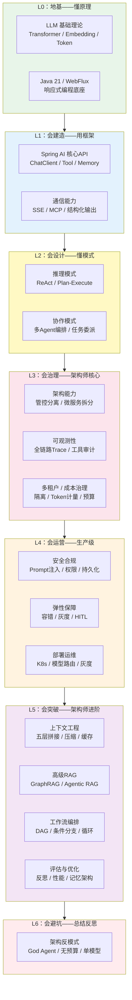
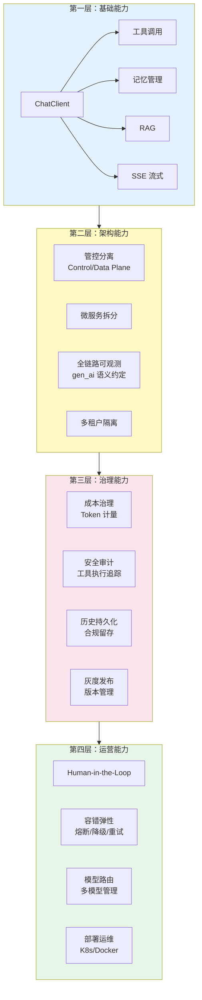

# PLAN.md — Java Agent 架构师文档执行轨道

> **最后更新**：2026-08-14
> **当前状态**：Phase 1-14 已产出 102 篇文档；2026-08-14 全量审计完成（结论见 Phase 15）。进入进阶阶段：**优先级顺序 = ① React 教程+实践项目（用户前置学习）→ ② 大型企业级项目 E-H（微服务拆分/管控分离落地）→ ③ 全体系进阶清洗（API 真实性/WebFlux 一致性/覆盖缺口）**
> **Mermaid 质量门禁**：2026-08-14 起，禁止光杆子 flowchart（纯先后顺序/版本路线一律 timeline/表格/列表）；子图标题用方括号。批量生成后必须跑 `scripts/check-mermaid-audit.py` 自检，0 发现才交付（规则见 CLAUDE.md 硬性规则 13 与质量标准）

---

## 任务总览

**用户目标：成为一名非常厉害的 Java Agent 架构师。文档体系的一切内容都为这个目标服务。**

基于 Spring Boot 4.1 + Spring AI 2.0 + WebFlux + Java 21 技术栈，构建一套企业级 Java Agent 架构师文档体系。**核心技术聚焦 Spring AI 2.0**。

### 架构师成长路径



**编写顺序对应成长路径**：L0 附录 → L1 基础教程 → L2 进阶教程 → L3 企业级架构教程 → L4 工程实践教程 → L5 架构师进阶教程 → 项目实战
**学习顺序相反**：先从项目实战入手（L1-L2 层），遇到阻塞查教程，教程不够深查附录（L0 层）

### 架构师能力矩阵

| 能力层 | 对应教程 | 能做到什么 |
|--------|---------|-----------|
| L0 地基 | 附录 05-LLM理论、附录 00-Java21、附录 01-WebFlux | 理解底层原理，不是黑盒使用者 |
| L1 建造 | 教程 00-13（基础+进阶） | 用 Spring AI 2.0 从零搭建一个功能完整的 Agent |
| L2 设计 | 教程 06-08（推理+协作模式） | 为不同业务场景选择正确的 Agent 模式 |
| L3 治理 | 教程 14-23（企业级架构） | 设计管控分离、全链路可观测、多租户的生产级架构 |
| L4 运营 | 教程 24-28（工程实践） | 让系统安全、稳定、经济地跑在生产环境 |
| L5 进阶 | 教程 29-39（架构师进阶 I+II） | 上下文工程、高级RAG、工作流编排、性能优化、评估闭环、长任务恢复、数据飞轮、治理合规 |
| L6 总结 | 教程 40（架构反模式） | 避坑——知道什么不该做，和知道什么该做一样重要 |
| 实战 | 项目 A-D | 从需求到架构到迭代，完整走一遍企业级项目 |

### 文档体系结构

```
docs/
├── 教程/                                         # 教材性质，知识点全面透彻
│   ├── 00-Agent核心概念.md                          # 什么是 Agent、与普通应用的区别、核心组成
│   ├── 01-Spring-AI框架入门.md                       # Spring AI 2.0 架构、核心 API、项目搭建
│   ├── 02-ChatClient与对话模型.md                    # ChatClient API、Prompt 工程、SystemMessage
│   ├── 03-工具调用.md                                # Function Calling、@Tool、工具注册与发现
│   ├── 04-记忆与会话管理.md                           # ChatMemory、会话存储、短期 vs 长期记忆
│   ├── 05-RAG检索增强生成.md                         # 向量存储、Embedding、检索策略、RAG 全流程
│   ├── 07-ReAct推理模式.md                          # 推理-行动循环、Thought-Action-Observation
│   ├── 08-Plan-and-Execute模式.md                   # 规划-执行分离、任务分解
│   ├── 09-多Agent协作.md                            # Agent 间通信、编排模式、角色分工
│   ├── 10-SSE流式通信.md                            # WebFlux SSE、流式响应、前端对接
│   ├── 11-MCP协议.md                                # Model Context Protocol、MCP 客户端/服务端
│   ├── 12-Agent状态管理.md                          # 状态机、上下文管理、会话生命周期
│   ├── 13-结构化输出.md                              # Structured Output、JSON Schema、BeanOutputConverter
│   ├── 14-Advisor链与拦截器.md                       # Advisor API、前置/后置处理、中间件模式
│   │
│   │   ────── 企业级架构专项 ──────
│   ├── 20-管控分离架构.md                            # Control Plane / Data Plane 分离、治理层设计
│   ├── 21-微服务拆分与Agent部署.md                   # Agent 服务化、工具服务化、LLM 网关、服务间通信
│   ├── 22-全链路可观测性.md                          # Spring AI 原生 Observation、gen_ai 语义约定、OTel 集成
│   ├── 23-工具执行可观测与审计.md                    # Tool Call Span、参数结果记录、安全审计日志
│   ├── 24-多页面流式响应与会话管理.md                # 跨页面 SSE、断线重连、流式中断恢复、连接池
│   ├── 25-历史记录持久化与合规.md                    # 会话归档、对话回放、审计留存、数据生命周期
│   ├── 26-多租户隔离与资源治理.md                    # 会话隔离、资源配额、数据隔离、工具权限分级
│   ├── 27-成本治理与Token计量.md                    # gen_ai.client.token.usage、按租户归因、预算上限
│   ├── 28-Human-in-the-Loop与审批流.md             # 人工审批触发、危险操作确认、升级机制
│   ├── 29-灰度发布与版本管理.md                     # Prompt 版本控制、模型 A/B 测试、流量切分
│   │
│   │   ────── 工程实践 ──────
│   ├── 30-容错与弹性设计.md                         # 重试、降级、熔断、超时、限流
│   ├── 31-安全与权限控制.md                         # 认证授权、Prompt 注入防护、工具权限、Tool Poisoning
│   ├── 06-向量数据库选型.md                         # PgVector / Pinecone / Chroma / Redis 对比
│   ├── 32-模型路由与降级.md                         # 多模型管理、路由策略、成本控制
│   ├── 33-部署与运维.md                             # Docker / K8s 部署、配置管理、生产实践
│   │
│   │   ────── 架构师进阶 ──────
│   ├── 34-上下文工程.md                              # 五层拼接、上下文压缩、Token预算、KV/Prompt Cache、语义缓存
│   ├── 35-高级RAG与AgenticRAG.md                   # GraphRAG、多跳推理、自适应检索、Agent决策检索
│   ├── 36-Agent工作流编排.md                        # DAG图编排、条件分支与循环、状态机vs工作流、Graph集成
│   ├── 37-自我反思与Agent评估.md                    # Reflection模式、量化评估、在线监控+离线评估闭环
│   ├── 38-Agent性能优化.md                          # 批量请求、并行工具调用、流式+缓存、Token效率
│   ├── 39-高级记忆架构.md                           # 三层记忆、语义vs情景、记忆演化与衰减、记忆隔离
│   │
│   │   ────── 架构师进阶 II ──────
│   ├── 40-长任务持久化与中断恢复.md                  # Checkpoint、断点恢复、幂等重试、预算控制、死循环防护
│   ├── 41-数据飞轮与持续改进.md                      # 反馈采集→评估→优化→灰度→闭环、微调vs Prompt vs RAG决策
│   ├── 42-响应式错误处理.md                          # WebFlux异常传播、流式中断恢复、背压实战、Context传递
│   ├── 43-Agent治理与合规框架.md                    # NIST AI RMF、模型卡片、GDPR隐私、偏见检测、行为审计
│   └── 44-多模型协作与供应策略.md                   # 模型编排、多供应商冗余、API Key池、自建vs商用、边缘部署
│   │
│   │   ────── 总结 ──────
│   └── 45-Agent架构反模式与避坑指南.md              # God Agent、硬编码Prompt、无超时无预算、单模型无降级、工具无幂等——全量反模式汇总
│
├── 附录/                                         # 教程中非主线知识点的全量补充
│   ├── 00-Java21新特性/
│   │   ├── 00-虚拟线程.md
│   │   ├── 01-Record与模式匹配.md
│   │   └── 02-SealedClasses.md
│   ├── 06-WebFlux与响应式编程/
│   │   ├── 00-Reactor核心.md
│   │   ├── 01-背压与流量控制.md
│   │   └── 02-WebFlux-vs-MVC.md
│   ├── 02-Prompt工程/
│   │   ├── 00-Prompt设计模式.md
│   │   ├── 01-Prompt模板管理.md
│   │   └── 02-Prompt注入防御.md
│   ├── 03-Spring-AI源码解析/
│   │   ├── 00-ChatClient源码.md
│   │   └── 01-Advisor执行链源码.md
│   ├── 04-测试策略/
│   │   ├── 00-单元测试.md
│   │   ├── 01-集成测试.md
│   │   └── 02-Eval评估.md
│   ├── 01-LLM基础理论/
│   │   ├── 00-Transformer架构.md
│   │   ├── 01-Embedding原理.md
│   │   └── 02-上下文窗口与Token.md
│   └── 07-企业级架构模式/                          # 企业级架构的深度补充
│       ├── 00-ControlPlane设计模式.md
│       ├── 01-Agent沙箱与隔离机制.md
│       └── 02-事件驱动Agent架构.md
│   ├── 10-语义缓存与性能/                           # 缓存策略深度补充
│   │   ├── 00-语义缓存实现.md                        # 相似Query语义级缓存、Advisor缓存拦截
│   │   ├── 01-Prompt缓存与KVCache.md               # 前缀缓存、缓存断点、缓存命中率优化
│   │   └── 02-批量推理与请求合并.md                  # Batch Inference、请求队列、吞吐优化
│   └── 09-Agent安全深度/                           # Agent安全攻防深度补充
│       ├── 00-Prompt注入分类与案例.md               # 直接注入vs间接注入、真实攻击案例
│       ├── 01-ToolPoisoning攻击.md                 # 工具投毒、恶意工具注册、防御策略
│       └── 02-数据泄露防护.md                       # DLP在Agent场景的挑战与方案
│   └── 13-AI治理与合规/                             # Agent治理框架深度补充
│       ├── 00-NIST-AI-RMF框架.md                    # AI 风险管理框架落地实践
│       ├── 01-模型卡片与数据卡片.md                  # Model Card / Data Card 透明度实践
│       └── 02-数据隐私与偏见检测.md                  # GDPR落地、偏见检测与缓解策略
│   └── 08-架构决策方法论/                           # 架构师核心软技能
│   │   └── 00-ADR架构决策记录.md                    # ADR 写法、何时推翻决策、技术选型框架
│   └── 14-Agent交互设计/                           # Agent UX 深度
│       └── 00-Agent用户体验设计.md                  # 流式打字、中间状态、工具透明化、错误交互——Agent 的 UX 和传统 Web 不同
│
├── 项目/                                         # 多个互相独立的企业级项目
│   ├── 00-智能客服系统/                             # 独立项目 A
│   │   ├── 00-需求分析与架构设计.md
│   │   ├── 01-最小Demo搭建.md
│   │   ├── 02-迭代一-工具集成.md
│   │   ├── 03-迭代二-RAG知识库.md
│   │   ├── 04-迭代三-记忆与会话.md
│   │   └── 05-核心代码讲解.md
│   ├── 01-智能文档助手/                             # 独立项目 B
│   │   ├── 00-需求分析与架构设计.md
│   │   ├── 01-最小Demo搭建.md
│   │   ├── 02-迭代一-文档解析与向量化.md
│   │   ├── 03-迭代二-多源检索与重排.md
│   │   └── 04-核心代码讲解.md
│   ├── 02-多Agent协作平台/                          # 独立项目 C
│   │   ├── 00-需求分析与架构设计.md
│   │   ├── 01-最小Demo搭建.md
│   │   ├── 02-迭代一-单Agent工具链.md
│   │   ├── 03-迭代二-多Agent编排.md
│   │   ├── 04-迭代三-任务委派与路由.md
│   │   └── 05-核心代码讲解.md
│   └── 03-MCP工具网关/                              # 独立项目 D
│       ├── 00-需求分析与架构设计.md
│       ├── 01-最小Demo搭建.md
│       ├── 02-迭代一-MCP客户端集成.md
│       ├── 03-迭代二-自定义MCP服务端.md
│       └── 04-核心代码讲解.md
│
└── 前沿/                                         # 可选，前沿调研
    ├── 00-A2A协议.md
    ├── 01-Agent操作系统.md
    ├── 02-多模态Agent.md
    ├── 03-Agent评测基准.md
    ├── 04-MCP生态全景.md                          # MCP Server注册中心、服务发现、工具市场
    ├── 05-Agent记忆前沿.md                        # 记忆演化模型、神经记忆、持久化记忆研究
    └── 06-Spring-AI生态全景.md                    # Spring AI Alibaba / Koog / JManus 等框架对比与集成选型
```

### 里程碑

| Milestone | 内容 | 预计文档数 |
|-----------|------|-----------|
| M1 | **教程基础篇**（00-05：概念、框架、对话、工具、记忆、RAG） | 6 |
| M2 | **教程进阶篇**（06-13：ReAct、Plan-Execute、多Agent、SSE、MCP、状态、结构化输出、Advisor） | 8 |
| M3 | **教程企业级架构篇**（14-23：管控分离、微服务、可观测、工具审计、流式会话、持久化、多租户、成本治理、HITL、灰度） | 10 |
| M4 | **教程工程实践篇**（24-28：容错、安全、向量选型、模型路由、部署） | 5 |
| M5 | **教程架构师进阶篇**（29-34：上下文工程、高级RAG、工作流编排、反思评估、性能优化、高级记忆） | 6 |
| M6 | **教程架构师进阶 II 篇**（35-39：长任务恢复、数据飞轮、响应式错误处理、治理合规、多模型策略） | 5 |
| M7 | **教程总结篇**（40：架构反模式与避坑指南） | 1 |
| M8 | **项目 A：智能客服系统**（独立完整项目） | 6 |
| M9 | **项目 B：智能文档助手**（独立完整项目） | 5 |
| M10 | **项目 C：多Agent协作平台**（独立完整项目） | 6 |
| M11 | **项目 D：MCP工具网关**（独立完整项目） | 5 |
| M12 | **附录全量补充**（Java21 / WebFlux / Prompt / 源码 / 测试 / LLM理论 / 企业架构模式 / 语义缓存 / Agent安全 / AI治理合规 / 架构决策方法论 / Agent交互设计） | 32 |
| M13 | **前沿调研**（A2A / Agent OS / 多模态 / 评测 / MCP生态 / 记忆前沿 / Spring AI生态） | 7 |
| M14 | **收尾**（索引 + 交叉引用校验 + 全量 Review） | 1 |
| **合计** | | **~103** |

---

## Phase 0 — 治理文件 ✅

| # | 任务 | 产出物 | 验证方式 | 状态 |
|---|------|--------|---------|------|
| 0.1 | 生成 CLAUDE.md | `CLAUDE.md` | 约束规则 ≤ 200 行，通过删除测试 | ✅ |
| 0.2 | 生成 PLAN.md | `PLAN.md` | 每个 Task 有产出物 + 验证方式 + 恢复路径 | ✅ |
| 0.3 | 接收用户补充并迭代 | 更新后的两个文件 | 企业级架构、架构师进阶、依赖清单、学习路径已纳入 | ✅ |

---

## Phase 1 — 教程基础篇（M1） ✅

| # | 任务 | 产出物 | 验证方式 | 状态 |
|---|------|--------|---------|------|
| 1.1 | Agent 核心概念 | `docs/教程/00-Agent核心概念.md` | ≥ 5000 字，含架构全景 Mermaid 图，讲透 Agent 定义/核心组成/与传统应用区别 | ✅ |
| 1.2 | Spring AI 框架入门 | `docs/教程/01-Spring-AI框架入门.md` | ≥ 3000 字，含框架架构图、项目搭建步骤、核心 API 概览 | ✅ |
| 1.3 | ChatClient 与对话模型 | `docs/教程/02-ChatClient与对话模型.md` | ≥ 3000 字，含 ChatClient 调用时序图、Prompt 工程、SystemMessage | ✅ |
| 1.4 | 工具调用 | `docs/教程/03-工具调用.md` | ≥ 3000 字，含工具注册/发现/调用流程图、@Tool 注解、Function Calling | ✅ |
| 1.5 | 记忆与会话管理 | `docs/教程/04-记忆与会话管理.md` | ≥ 3000 字，含短期/长期记忆架构图、ChatMemory API | ✅ |
| 1.6 | RAG 检索增强生成 | `docs/教程/05-RAG检索增强生成.md` | ≥ 5000 字，含 RAG 全流程图、向量存储、Embedding、检索策略 | ✅ |

---

## Phase 2 — 教程进阶篇（M2）

| # | 任务 | 产出物 | 验证方式 | 状态 |
|---|------|--------|---------|------|
| 2.1 | ReAct 推理模式 | `docs/教程/07-ReAct推理模式.md` | ≥ 3000 字，含 Thought-Action-Observation 循环时序图 | ⏳ |
| 2.2 | Plan-and-Execute 模式 | `docs/教程/08-Plan-and-Execute模式.md` | ≥ 3000 字，含规划-执行分离架构图 | ⏳ |
| 2.3 | 多 Agent 协作 | `docs/教程/09-多Agent协作.md` | ≥ 5000 字，含协作拓扑图，对比 3+ 协作模式 | ⏳ |
| 2.4 | SSE 流式通信 | `docs/教程/10-SSE流式通信.md` | ≥ 3000 字，WebFlux SSE 时序图 + 前端对接 | ⏳ |
| 2.5 | MCP 协议 | `docs/教程/11-MCP协议.md` | ≥ 3000 字，含 MCP 架构图、客户端/服务端代码 | ⏳ |
| 2.6 | Agent 状态管理 | `docs/教程/12-Agent状态管理.md` | ≥ 3000 字，含状态迁移 Mermaid 图、生命周期 | ⏳ |
| 2.7 | 结构化输出 | `docs/教程/13-结构化输出.md` | ≥ 3000 字，含 JSON Schema、BeanOutputConverter | ⏳ |
| 2.8 | Advisor 链与拦截器 | `docs/教程/14-Advisor链与拦截器.md` | ≥ 3000 字，含 Advisor 执行链图、中间件模式 | ⏳ |

---

## Phase 3 — 教程企业级架构篇（M3）

> **本 Phase 是文档体系的核心差异化部分**。从 demo 级用法跃升到企业生产级架构。
> 所有教程必须基于 Spring AI 2.0 原生能力（Observation、Advisor、ChatMemory 等），不空谈理论。

| # | 任务 | 产出物 | 验证方式 | 状态 |
|---|------|--------|---------|------|
| 3.1 | 管控分离架构 | `docs/教程/20-管控分离架构.md` | ≥ 5000 字，含 Control Plane / Data Plane 分离架构图；讲解配置中心、策略引擎、治理层与执行层的关系 | ⏳ |
| 3.2 | 微服务拆分与 Agent 部署 | `docs/教程/21-微服务拆分与Agent部署.md` | ≥ 5000 字，含微服务拆分图；Agent 服务、工具服务、LLM 网关、检索服务独立部署与通信模式 | ⏳ |
| 3.3 | 全链路可观测性 | `docs/教程/22-全链路可观测性.md` | ≥ 5000 字，含 ChatClient→ChatModel→Tool→VectorStore 全链路 Span 图；Spring AI 原生 Observation、gen_ai 语义约定、Micrometer + OTel 集成 | ⏳ |
| 3.4 | 工具执行可观测与审计 | `docs/教程/23-工具执行可观测与审计.md` | ≥ 3000 字，含 Tool Call Span 结构图；`spring.ai.tool` Observation、参数结果记录、安全审计日志规范 | ⏳ |
| 3.5 | 多页面流式响应与会话管理 | `docs/教程/24-多页面流式响应与会话管理.md` | ≥ 5000 字，含跨页面 SSE 连接管理架构图；断线重连、流式中断恢复、连接池、多端同步 | ⏳ |
| 3.6 | 历史记录持久化与合规 | `docs/教程/25-历史记录持久化与合规.md` | ≥ 3000 字，含数据生命周期状态机图；会话归档、对话回放、审计留存、合规策略 | ⏳ |
| 3.7 | 多租户隔离与资源治理 | `docs/教程/26-多租户隔离与资源治理.md` | ≥ 5000 字，含多租户隔离架构图；会话隔离、资源配额、数据隔离、工具权限分级 | ⏳ |
| 3.8 | 成本治理与 Token 计量 | `docs/教程/27-成本治理与Token计量.md` | ≥ 3000 字，含成本归因流程图；`gen_ai.client.token.usage` 指标体系、按租户/用户归因、预算上限告警 | ⏳ |
| 3.9 | Human-in-the-Loop 与审批流 | `docs/教程/28-Human-in-the-Loop与审批流.md` | ≥ 3000 字，含审批流程状态机图；触发条件、危险操作确认、超时升级、Advisor 实现方案 | ⏳ |
| 3.10 | 灰度发布与版本管理 | `docs/教程/29-灰度发布与版本管理.md` | ≥ 3000 字，含灰度发布流程图；Prompt 版本控制、模型 A/B 测试、流量切分策略 | ⏳ |

---

## Phase 4 — 教程工程实践篇（M4）

| # | 任务 | 产出物 | 验证方式 | 状态 |
|---|------|--------|---------|------|
| 4.1 | 容错与弹性设计 | `docs/教程/30-容错与弹性设计.md` | ≥ 3000 字，含容错策略对比表（重试/降级/熔断/超时/限流） | ⏳ |
| 4.2 | 安全与权限控制 | `docs/教程/31-安全与权限控制.md` | ≥ 3000 字，含安全架构图、Prompt 注入防护 | ⏳ |
| 4.3 | 向量数据库选型 | `docs/教程/06-向量数据库选型.md` | ≥ 3000 字，含 4+ 向量库对比表 | ⏳ |
| 4.4 | 模型路由与降级 | `docs/教程/32-模型路由与降级.md` | ≥ 3000 字，含路由决策流程图 | ⏳ |
| 4.5 | 部署与运维 | `docs/教程/33-部署与运维.md` | ≥ 3000 字，含部署拓扑图、K8s 配置 | ⏳ |

---

## Phase 5 — 教程架构师进阶篇（M5）

> **本 Phase 是区分普通架构师和顶尖架构师的关键**。覆盖 2026 年 Agent 领域的前沿进阶能力。
> 所有教程必须结合 Spring AI 2.0 实际能力讲解，不空谈理论。

| # | 任务 | 产出物 | 验证方式 | 状态 |
|---|------|--------|---------|------|
| 5.1 | 上下文工程 | `docs/教程/34-上下文工程.md` | ≥ 5000 字，含五层拼接架构图；上下文压缩、Token 预算分配、KV/Prompt Cache、语义缓存 | ⏳ |
| 5.2 | 高级 RAG 与 Agentic RAG | `docs/教程/35-高级RAG与AgenticRAG.md` | ≥ 5000 字，含 GraphRAG 多跳推理图、Agentic RAG 决策流程图；混合检索+重排、自适应检索 | ⏳ |
| 5.3 | Agent 工作流编排 | `docs/教程/36-Agent工作流编排.md` | ≥ 3000 字，含 DAG 工作流图；条件分支与循环、状态机 vs 工作流选型、Spring AI Alibaba Graph 集成 | ⏳ |
| 5.4 | 自我反思与 Agent 评估 | `docs/教程/37-自我反思与Agent评估.md` | ≥ 3000 字，含 Reflection 循环图、评估指标体系；在线监控+离线评估闭环 | ⏳ |
| 5.5 | Agent 性能优化 | `docs/教程/38-Agent性能优化.md` | ≥ 3000 字，含性能优化全景图；批量请求、并行工具调用、流式+缓存组合、Token 效率 | ⏳ |
| 5.6 | 高级记忆架构 | `docs/教程/39-高级记忆架构.md` | ≥ 5000 字，含三层记忆架构图；语义记忆 vs 情景记忆、记忆演化与衰减、记忆隔离 | ⏳ |

---

## Phase 6 — 教程架构师进阶 II 篇（M6）

> **本 Phase 覆盖 2026 年生产级 Agent 的工程化硬骨头**。这些是 demo 不会遇到、但生产环境必然踩坑的问题。
> 调研发现 40% 的 AI Agent 项目因这些问题被砍——长任务崩溃、缺乏评估闭环、错误处理不当、合规缺失、模型供应单点。

| # | 任务 | 产出物 | 验证方式 | 状态 |
|---|------|--------|---------|------|
| 6.1 | 长任务持久化与中断恢复 | `docs/教程/40-长任务持久化与中断恢复.md` | ≥ 5000 字，含检查点恢复流程图；Checkpoint 机制、崩溃后断点恢复、幂等重试、预算控制（最大轮次/Token/时长）、死循环三层防护 | ⏳ |
| 6.2 | 数据飞轮与持续改进 | `docs/教程/41-数据飞轮与持续改进.md` | ≥ 5000 字，含飞轮闭环架构图；反馈采集→评估→优化→灰度→全量闭环；微调 vs Prompt vs RAG 决策框架 | ⏳ |
| 6.3 | 响应式错误处理 | `docs/教程/42-响应式错误处理.md` | ≥ 3000 字，含错误传播链路图；WebFlux 异常传播（onErrorResume/onErrorMap/retryWhen）、流式中断恢复、背压实战、响应式 Context 传递 | ⏳ |
| 6.4 | Agent 治理与合规框架 | `docs/教程/43-Agent治理与合规框架.md` | ≥ 5000 字，含治理框架架构图；NIST AI RMF 落地、模型卡片/数据卡片、GDPR 隐私、偏见检测与缓解、行为审计 | ⏳ |
| 6.5 | 多模型协作与供应策略 | `docs/教程/44-多模型协作与供应策略.md` | ≥ 3000 字，含多模型编排架构图；模型编排、多供应商冗余、API Key 池管理、自建 vs 商用决策、边缘部署（Ollama/vLLM） | ⏳ |

---

## Phase 7 — 教程总结篇（M7）

> 全量反模式汇总。站在所有教程的肩膀上回看"什么不该做"——这是架构师经验沉淀的最终一步。

| # | 任务 | 产出物 | 验证方式 | 状态 |
|---|------|--------|---------|------|
| 7.1 | Agent 架构反模式与避坑指南 | `docs/教程/45-Agent架构反模式与避坑指南.md` | ≥ 5000 字，含反模式分类 Mermaid 图；汇总全部教程中的反模式：God Agent、硬编码 Prompt、无超时无预算、单模型无降级、工具无幂等、上下文溢出、无评估闭环等，每个反模式标注对应教程引用 | ⏳ |

---

## Phase 8 — 项目 A：智能客服系统（M8）

> **独立完整项目**。从最小 demo 起步，内部迭代到生产级客服 Agent。不依赖其他项目，不被其他项目依赖。
> **所有文档只讲解架构设计和代码片段，不生成 .java 文件，代码由用户手写。**
> **学习路径**：用户先看项目实践 → 遇到阻塞点时项目文档中用 `「遇到阻塞？→ [教程 XX-XXX]」` 引导到对应教程。

| # | 任务 | 产出物 | 验证方式 | 状态 |
|---|------|--------|---------|------|
| 8.1 | 需求与架构 | `docs/项目/00-智能客服系统/00-需求分析与架构设计.md` | ≥ 2000 字，含业务场景、技术选型、架构图 | ⏳ |
| 8.2 | 最小 Demo | `docs/项目/00-智能客服系统/01-最小Demo搭建.md` | ≥ 2000 字，最简 ChatClient + WebFlux；标注 `→ [教程 01-Spring-AI框架入门]` `[教程 02-ChatClient与对话模型]` `[教程 10-SSE流式通信]` | ⏳ |
| 8.3 | 迭代一：工具集成 | `docs/项目/00-智能客服系统/02-迭代一-工具集成.md` | ≥ 2000 字，FAQ 工具注册与调用；标注 `→ [教程 03-工具调用]` `[教程 13-结构化输出]` | ⏳ |
| 8.4 | 迭代二：RAG 知识库 | `docs/项目/00-智能客服系统/03-迭代二-RAG知识库.md` | ≥ 2000 字，向量存储 + 检索流程；标注 `→ [教程 05-RAG检索增强生成]` `[教程 30-高级RAG]` | ⏳ |
| 8.5 | 迭代三 + 代码讲解 | `docs/项目/00-智能客服系统/04-迭代三-记忆与会话.md` + `05-核心代码讲解.md` | 每篇 ≥ 2000 字，ChatMemory + Redis；标注 `→ [教程 04-记忆与会话管理]` `[教程 18-多页面流式响应]` `[教程 34-上下文工程]` `[教程 35-长任务持久化]` | ⏳ |

---

## Phase 9 — 项目 B：智能文档助手（M9）

> **独立完整项目**。RAG 驱动的文档问答系统，与项目 A 无任何关联。内部独立迭代。
> **所有文档只讲解架构设计和代码片段，不生成 .java 文件，代码由用户手写。**
> **学习路径**：用户先看项目实践 → 遇到阻塞点时项目文档中用 `「遇到阻塞？→ [教程 XX-XXX]」` 引导到对应教程。

| # | 任务 | 产出物 | 验证方式 | 状态 |
|---|------|--------|---------|------|
| 9.1 | 需求与架构 | `docs/项目/01-智能文档助手/00-需求分析与架构设计.md` | ≥ 2000 字，含业务场景、架构图 | ⏳ |
| 9.2 | 最小 Demo | `docs/项目/01-智能文档助手/01-最小Demo搭建.md` | ≥ 2000 字，文档上传 + 基础问答；标注 `→ [教程 05-RAG检索增强生成]` `[教程 13-结构化输出]` | ⏳ |
| 9.3 | 迭代一：文档解析与向量化 | `docs/项目/01-智能文档助手/02-迭代一-文档解析与向量化.md` | ≥ 2000 字，PDF/Word 解析 + Embedding；标注 `→ [教程 06-向量数据库选型]` | ⏳ |
| 9.4 | 迭代二：多源检索与重排 | `docs/项目/01-智能文档助手/03-迭代二-多源检索与重排.md` | ≥ 2000 字，混合检索 + Reranker；标注 `→ [教程 14-Advisor链与拦截器]` `[教程 30-高级RAG]` | ⏳ |
| 9.5 | 代码讲解 | `docs/项目/01-智能文档助手/04-核心代码讲解.md` | ≥ 2000 字，关键代码全解析 | ⏳ |

---

## Phase 10 — 项目 C：多Agent协作平台（M10）

> **独立完整项目**。多 Agent 编排与任务分发平台，与项目 A/B 无任何关联。内部独立迭代。
> **所有文档只讲解架构设计和代码片段，不生成 .java 文件，代码由用户手写。**
> **学习路径**：用户先看项目实践 → 遇到阻塞点时项目文档中用 `「遇到阻塞？→ [教程 XX-XXX]」` 引导到对应教程。

| # | 任务 | 产出物 | 验证方式 | 状态 |
|---|------|--------|---------|------|
| 10.1 | 需求与架构 | `docs/项目/02-多Agent协作平台/00-需求分析与架构设计.md` | ≥ 2000 字，含编排架构图 | ⏳ |
| 10.2 | 最小 Demo | `docs/项目/02-多Agent协作平台/01-最小Demo搭建.md` | ≥ 2000 字，单 Agent 基础框架；标注 `→ [教程 00-Agent核心概念]` `[教程 07-ReAct推理模式]` | ⏳ |
| 10.3 | 迭代一：单 Agent 工具链 | `docs/项目/02-多Agent协作平台/02-迭代一-单Agent工具链.md` | ≥ 2000 字，工具注册与调用；标注 `→ [教程 03-工具调用]` `[教程 12-Agent状态管理]` | ⏳ |
| 10.4 | 迭代二：多 Agent 编排 | `docs/项目/02-多Agent协作平台/03-迭代二-多Agent编排.md` | ≥ 2000 字，Agent 间通信与协调；标注 `→ [教程 09-多Agent协作]` `[教程 20-管控分离架构]` `[教程 36-Agent工作流编排]` | ⏳ |
| 10.5 | 迭代三：任务委派与路由 | `docs/项目/02-多Agent协作平台/04-迭代三-任务委派与路由.md` | ≥ 2000 字，智能路由策略；标注 `→ [教程 08-Plan-and-Execute模式]` `[教程 22-Human-in-the-Loop]` | ⏳ |
| 10.6 | 代码讲解 | `docs/项目/02-多Agent协作平台/05-核心代码讲解.md` | ≥ 2000 字，关键代码全解析 | ⏳ |

---

## Phase 11 — 项目 D：MCP工具网关（M11）

> **独立完整项目**。基于 MCP 协议的统一工具网关，与项目 A/B/C 无任何关联。内部独立迭代。
> **所有文档只讲解架构设计和代码片段，不生成 .java 文件，代码由用户手写。**
> **学习路径**：用户先看项目实践 → 遇到阻塞点时项目文档中用 `「遇到阻塞？→ [教程 XX-XXX]」` 引导到对应教程。

| # | 任务 | 产出物 | 验证方式 | 状态 |
|---|------|--------|---------|------|
| 11.1 | 需求与架构 | `docs/项目/03-MCP工具网关/00-需求分析与架构设计.md` | ≥ 2000 字，含网关架构图 | ⏳ |
| 11.2 | 最小 Demo | `docs/项目/03-MCP工具网关/01-最小Demo搭建.md` | ≥ 2000 字，MCP 客户端基础对接；标注 `→ [教程 11-MCP协议]` `[教程 03-工具调用]` | ⏳ |
| 11.3 | 迭代一：MCP 客户端集成 | `docs/项目/03-MCP工具网关/02-迭代一-MCP客户端集成.md` | ≥ 2000 字，多 MCP Server 对接；标注 `→ [教程 22-全链路可观测性]` `[教程 23-工具执行可观测与审计]` | ⏳ |
| 11.4 | 迭代二：自定义 MCP 服务端 | `docs/项目/03-MCP工具网关/03-迭代二-自定义MCP服务端.md` | ≥ 2000 字，自建工具暴露为 MCP；标注 `→ [教程 30-容错与弹性设计]` `[教程 31-安全与权限控制]` `[教程 44-多模型协作与供应策略]` | ⏳ |
| 11.5 | 代码讲解 | `docs/项目/03-MCP工具网关/04-核心代码讲解.md` | ≥ 2000 字，关键代码全解析 | ⏳ |

---

## Phase 12 — 附录全量补充（M12）

> 附录是教程的"下钻层"。每篇附录必须标注对应的教程锚点（`「本文是对 [教程 XX-XXX §X] 的深入展开」`）。
> 用户学习路径：看教程遇到阻塞点 → 教程中用 `「想深入？→ [附录 XX-XXX]」` 引导到附录。

| # | 任务 | 产出物 | 验证方式 | 状态 |
|---|------|--------|---------|------|
| 12.1 | Java 21 新特性 | `docs/附录/00-Java21新特性/00-虚拟线程.md` + `01-Record与模式匹配.md` + `02-SealedClasses.md` | 每篇 ≥ 2000 字，标注教程锚点（虚拟线程→教程09-SSE，Record→教程13-结构化输出） | ⏳ |
| 12.2 | WebFlux 与响应式编程 | `docs/附录/06-WebFlux与响应式编程/00-Reactor核心.md` + `01-背压与流量控制.md` + `02-WebFlux-vs-MVC.md` | 每篇 ≥ 2000 字，标注教程锚点（→教程01-Spring-AI入门、教程09-SSE、教程18-多页面流式、教程42-响应式错误处理） | ⏳ |
| 12.3 | Prompt 工程 | `docs/附录/02-Prompt工程/00-Prompt设计模式.md` + `01-Prompt模板管理.md` + `02-Prompt注入防御.md` | 每篇 ≥ 2000 字，标注教程锚点（→教程02-ChatClient、教程25-安全权限） | ⏳ |
| 12.4 | Spring AI 源码解析 | `docs/附录/03-Spring-AI源码解析/00-ChatClient源码.md` + `01-Advisor执行链源码.md` | 每篇 ≥ 2000 字，标注教程锚点（→教程02-ChatClient、教程13-Advisor） | ⏳ |
| 12.5 | 测试策略 | `docs/附录/04-测试策略/00-单元测试.md` + `01-集成测试.md` + `02-Eval评估.md` | 每篇 ≥ 2000 字，标注教程锚点（→教程16-可观测性、教程24-容错、教程32-自我反思与评估、教程36-数据飞轮） | ⏳ |
| 12.6 | LLM 基础理论 | `docs/附录/01-LLM基础理论/00-Transformer架构.md` + `01-Embedding原理.md` + `02-上下文窗口与Token.md` | 每篇 ≥ 2000 字，标注教程锚点（→教程05-RAG、教程21-成本治理与Token、教程34-上下文工程） | ⏳ |
| 12.7 | 企业级架构模式 | `docs/附录/07-企业级架构模式/00-ControlPlane设计模式.md` + `01-Agent沙箱与隔离机制.md` + `02-事件驱动Agent架构.md` | 每篇 ≥ 2000 字，标注教程锚点（→教程14-管控分离、教程20-多租户隔离、教程15-微服务拆分） | ⏳ |
| 12.8 | 语义缓存与性能 | `docs/附录/10-语义缓存与性能/00-语义缓存实现.md` + `01-Prompt缓存与KVCache.md` + `02-批量推理与请求合并.md` | 每篇 ≥ 2000 字，标注教程锚点（→教程34-上下文工程、教程38-Agent性能优化） | ⏳ |
| 12.9 | Agent 安全深度 | `docs/附录/09-Agent安全深度/00-Prompt注入分类与案例.md` + `01-ToolPoisoning攻击.md` + `02-数据泄露防护.md` | 每篇 ≥ 2000 字，标注教程锚点（→教程31-安全与权限控制） | ⏳ |
| 12.10 | AI 治理与合规 | `docs/附录/13-AI治理与合规/00-NIST-AI-RMF框架.md` + `01-模型卡片与数据卡片.md` + `02-数据隐私与偏见检测.md` | 每篇 ≥ 2000 字，标注教程锚点（→教程43-Agent治理与合规框架） | ⏳ |
| 12.11 | 架构决策方法论 | `docs/附录/08-架构决策方法论/00-ADR架构决策记录.md` | ≥ 2000 字，ADR 写法、何时推翻决策、技术选型框架；贯穿全部教程 | ⏳ |
| 12.12 | Agent 交互设计 | `docs/附录/14-Agent交互设计/00-Agent用户体验设计.md` | ≥ 2000 字，标注教程锚点（→教程09-SSE、教程18-多页面流式、教程22-HITL） | ⏳ |

---

## Phase 13 — 前沿调研（M13，可选）

| # | 任务 | 产出物 | 验证方式 | 状态 |
|---|------|--------|---------|------|
| 13.1 | A2A 协议 | `docs/前沿/00-A2A协议.md` | ≥ 2000 字，Google A2A 协议调研 | ⏳ |
| 13.2 | Agent 操作系统 | `docs/前沿/01-Agent操作系统.md` | ≥ 2000 字，Agent OS 概念与实践 | ⏳ |
| 13.3 | 多模态 Agent | `docs/前沿/02-多模态Agent.md` | ≥ 2000 字，视觉/音频 Agent | ⏳ |
| 13.4 | Agent 评测基准 | `docs/前沿/03-Agent评测基准.md` | ≥ 2000 字，Benchmark 现状 | ⏳ |
| 13.5 | MCP 生态全景 | `docs/前沿/04-MCP生态全景.md` | ≥ 2000 字，MCP Server 注册中心、服务发现、工具市场 | ⏳ |
| 13.6 | Agent 记忆前沿 | `docs/前沿/05-Agent记忆前沿.md` | ≥ 2000 字，记忆演化模型、神经记忆、持久化记忆研究 | ⏳ |
| 13.7 | Spring AI 生态全景 | `docs/前沿/06-Spring-AI生态全景.md` | ≥ 2000 字，Spring AI Alibaba / Koog / JManus 框架对比与集成选型 | ⏳ |

---

## Phase 14 — 收尾（M14）

| # | 任务 | 产出物 | 验证方式 | 状态 |
|---|------|--------|---------|------|
| 14.1 | 文档导航索引 | `docs/README.md` | 含完整目录树 + 教程/项目/附录/前沿阅读路线图 | ⏳ |
| 14.2 | 交叉引用校验 | 全部文档 | 所有 `[教程 XX-XXX §X]` 引用指向正确文件和章节；**项目间无交叉引用** | ⏳ |
| 14.3 | 全量 Review | 全部文档 | 检查字数、Mermaid 图数量、命名规范一致性、项目独立性、企业级架构覆盖度、进阶能力覆盖度、治理合规覆盖度 | ⏳ |

---

## Phase 15 — 全量审计（2026-08-14 完成）

> 四代理并行深读全部 102 篇 + 量化校验。结论已存档，驱动 Phase 16-19。

**核心结论**：
- 🔴 **P0 虚构 API（致命）**：三代 Advisor API 并存（虚构 `BaseAdvisor.before/after` vs `adviseCall+nextAroundCall` vs 2.0 式 `ChatClientRequest+CallAdvisorChain`）；教程 40 通篇 `@ToolMethod`（应 `@Tool`）；教程 02/12 `entity(Class,spec)` 虚构；教程 09 `InMemoryChatMemory`、教程 19 `RedisChatMemoryRepository` 不存在；教程 10+项目 03 `McpClient` 假想类与错误 starter 坐标；教程 22 HITL Advisor 层拦不到工具意图时点（应 ToolCallingManager 装饰器）；教程 20 RLS 方案无效；项目 02 AOP 拦 @Tool 无效
- 🟠 **P1 一致性**：WebFlux 阻塞反模式（ThreadLocal 计数、阻塞 RedisTemplate、Thread.sleep 轮询）；README 附录 07/08/11 标"规划中"实际已存在、总数 94 实为 101；死链（教程 06/07/08→不存在附录、09→"附录 06-Web工程"）；教程 34 残留"本系列到此完成"；教程 28 sessionAffinity 与 15/18 矛盾；模型栈从 DeepSeek 漂移；项目 03 权限白名单不匹配
- 🟡 **P2 缺口**：流式工具调用+SSE 事件协议零覆盖；Spring AI 2.0 原生 agentic 模块零覆盖；MCP Streamable HTTP/OAuth 2.1 缺失；Computer Use/Skills/Agent 支付(x402)/ANP 缺失；LangGraph4j/Temporal 对比缺失；知识图谱落地缺失；Ragas/Langfuse 评估生态缺失；DR/SLO/容量压测缺失；多租户与灰度四个项目无一落地

---

## Phase 16 — React 教程与实践项目（用户前置学习，最高优先级）

> **用户明确要求：在做大型企业级项目之前，先学习 React 并有实践项目。**
> React 是 Agent 前端（流式 UI、工具调用中间状态展示、Agentic UI）的基石。教程 09/18 的 SSE 前端对接将升级为引用本 Phase 的 React 教程。
> 技术约束：React 19 + Vite + TypeScript，与后端 Spring AI 2.0/WebFlux SSE 对接；**前端代码同样只写文档讲解，不生成项目源码文件**。

| # | 任务 | 产出物 | 验证方式 | 状态 |
|---|------|--------|---------|------|
| 16.1 | React 入门与现代前端工程 | `docs/教程/15-React入门与现代前端工程.md` | ≥ 3000 字，React 19/Vite/TS 项目结构、组件模型、与传统服务端渲染对比；含 Mermaid 图 ≥ 2 | ⏳ |
| 16.2 | React 状态管理与数据流 | `docs/教程/16-React状态管理.md` | ≥ 3000 字，useState/useReducer/Context/Zustand 选型、服务端状态 TanStack Query | ⏳ |
| 16.3 | React + SSE 流式 UI 实战 | `docs/教程/17-React与SSE流式UI.md` | ≥ 3000 字，fetch+ReadableStream 消费 Spring AI 流、事件协议、断线重连、乐观更新 | ⏳ |
| 16.4 | Agentic UI 与生成式界面 | `docs/教程/18-Agentic-UI设计.md` | ≥ 3000 字，thought/tool_call/token/done 事件渲染、工具执行中间态、生成式 UI（JSON→组件） | ⏳ |
| 16.5 | React 实践项目 | `docs/项目/04-React-Agent控制台/00-需求分析与架构设计.md` + `01-最小Demo搭建.md` + `02-迭代一-流式对话界面.md` + `03-迭代二-工具调用可视化.md` + `04-迭代三-多会话管理与断线恢复.md` + `05-核心代码讲解.md` | 每篇 ≥ 2000 字；独立项目（不依赖其他项目）；迭代式演进；标注 `→ [教程 14-17]` | ⏳ |

---

## Phase 17 — 大型企业级项目 E-H（核心演进能力落地）

> **用户要求：补充大型企业级项目，按企业级演进方式迭代，项目之间互相隔离。**
> 审计发现现有 4 个项目无一落地微服务拆分/管控分离/多租户/灰度。本 Phase 的 4 个大型项目**按企业真实演进节奏**（单体 → 服务拆分 → 控制面建设 → 治理能力）分多轮迭代，每个项目 9-12 篇，把教程 14-23 的企业级架构能力真正落地为迭代里程碑。
> 每个项目仍严格独立：独立业务域、独立架构演进、无交叉引用、无互为前置。

| # | 任务 | 产出物 | 验证方式 | 状态 |
|---|------|--------|---------|------|
| 17.1 | 项目 E：企业级 Agent 中台 | `docs/项目/05-企业级Agent中台/`（11 篇） | 见下方项目 E 规格 | ⏳ |
| 17.2 | 项目 F：金融风控 Agent 系统 | `docs/项目/06-金融风控Agent系统/`（10 篇） | 见下方项目 F 规格 | ⏳ |
| 17.3 | 项目 G：跨国多租户 SaaS Agent 平台 | `docs/项目/07-跨国多租户SaaS-Agent平台/`（12 篇） | 见下方项目 G 规格 | ⏳ |
| 17.4 | 项目 H：Agent 供应链安全网关 | `docs/项目/08-Agent供应链安全网关/`（10 篇） | 见下方项目 H 规格 | ⏳ |

### 项目 E：企业级 Agent 中台（11 篇）— 微服务拆分 + 管控分离全落地

> 场景：集团内部多个业务线（客服/文档/数据）共用一个 Agent 平台。**演进主线：单体 Agent 应用 → 按 Control/Data Plane 拆分 → LLM 网关独立 → 平台化多业务接入**
> 核心教程锚点：教程 14-管控分离、15-微服务拆分、27-模型路由

| 迭代 | 篇目 | 里程碑 |
|------|------|--------|
| 00 | 需求分析与架构设计 | 三业务线需求、平台化演进路线图 |
| 01 | 最小 Demo（单体） | 单体 Agent 应用，明确"何时必须拆分"的信号 |
| 02 | 迭代一：单体之痛与拆分准备 | 模块化单体（包边界/依赖规则），拆分评估矩阵 |
| 03 | 迭代二：LLM 网关独立部署 | 教程 15 落地：网关鉴权/计量/路由，业务服务无感 |
| 04 | 迭代三：Control Plane 建设 | 教程 14 落地：配置中心/策略引擎/Prompt 版本管理独立服务 |
| 05 | 迭代四：工具服务化与注册中心 | 工具独立部署、动态发现、MCP 接入 |
| 06 | 迭代五：全链路可观测 | 教程 16/17 落地：跨服务 Trace、gen_ai 语义约定 |
| 07 | 迭代六：多业务线隔离 | 命名空间隔离、按业务线成本归因 |
| 08 | 迭代七：灰度发布与 A/B | Prompt/模型灰度、流量切分（教程 23） |
| 09 | 迭代八：高可用与容灾 | 多实例、熔断降级、故障演练 |
| 10 | 核心代码讲解 | 关键组件全解析 |

### 项目 F：金融风控 Agent 系统（10 篇）— HITL + 审计合规全落地

> 场景：银行信贷审批 Agent，高风险强监管。**演进主线：纯 LLM 辅助 → HITL 审批流 → 全量审计 → 监管合规**
> 核心教程锚点：教程 22-HITL、19-持久化合规、38-治理框架

| 迭代 | 篇目 | 里程碑 |
|------|------|--------|
| 00 | 需求分析与架构设计 | 监管场景、风控 Agent 架构 |
| 01 | 最小 Demo | 单 Agent 信贷材料预审 |
| 02 | 迭代一：结构化决策与置信度 | 教程 12 落地：结构化输出驱动决策 |
| 03 | 迭代二：HITL 审批流 | 教程 22 落地：ToolCallingManager 装饰器拦截（修正原方案） |
| 04 | 迭代四：全量审计与追溯 | 审计日志哈希链、决策回放 |
| 05 | 迭代三：多模型交叉验证 | 教程 39 落地：昂贵模型复核廉价模型结论 |
| 06 | 迭代五：数据脱敏与合规 | 教程 19/38 落地：PII 脱敏、GDPR/个保法 |
| 07 | 迭代六：成本与性能治理 | 预算上限、降级链 |
| 08 | 迭代七：生产部署与 DR | K8s、备份恢复、监管报表 |
| 09 | 核心代码讲解 | 关键组件全解析 |

### 项目 G：跨国多租户 SaaS Agent 平台（12 篇）— 多租户 + 灰度 + 数据驻留全落地

> 场景：面向外部客户的 SaaS Agent 平台，跨国数据驻留。**演进主线：单租户 → 池化多租户 → 租户分级配额 → 灰度发布体系 → 数据驻留**
> 核心教程锚点：教程 20-多租户、23-灰度、28-部署

| 迭代 | 篇目 | 里程碑 |
|------|------|--------|
| 00 | 需求分析与架构设计 | SaaS 商业模型、租户分级 |
| 01 | 最小 Demo | 单租户 SaaS 雏形 |
| 02 | 迭代一：多租户数据隔离 | 教程 20 落地：schema 隔离 + 修正版 RLS（SET LOCAL/事务级） |
| 03 | 迭代二：租户配额与限流 | Token 配额原子扣减（Lua）、租户级限流 |
| 04 | 迭代三：租户级模型路由 | 按租户等级路由模型（教程 27） |
| 05 | 迭代四：计费与成本归因 | 按租户账单、chargeback（教程 21） |
| 06 | 迭代五：灰度发布体系 | Prompt/模型/功能三维灰度（教程 23） |
| 07 | 迭代六：SLO 与容量规划 | 错误预算、压测（k6 SSE 模型） |
| 08 | 迭代七：全球数据驻留 | EU/US 数据分区、GDPR 跨境传输 |
| 09 | 迭代八：平台安全与租户信任 | 租户级密钥隔离、SOC2 审计 |
| 10 | 迭代九：DR 与多活 | RTO/RPO、多区域故障切换 |
| 11 | 核心代码讲解 | 关键组件全解析 |

### 项目 H：Agent 供应链安全网关（10 篇）— MCP 工具供应链 + 安全纵深全落地

> 场景：企业统一 MCP/工具接入安全网关，防护 Tool Poisoning/间接注入/恶意工具。**演进主线：直连工具 → 集中网关 → 供应链扫描 → 零信任策略 → 事件响应**
> 核心教程锚点：教程 25-安全、10-MCP、附录 08

| 迭代 | 篇目 | 里程碑 |
|------|------|--------|
| 00 | 需求分析与架构设计 | 供应链威胁模型 |
| 01 | 最小 Demo | 代理模式工具网关 |
| 02 | 迭代一：工具准入与签名校验 | 工具指纹、签名链验证 |
| 03 | 迭代二：MCP 规范化接入 | Streamable HTTP、OAuth 2.1（修正教程 10 遗留） |
| 04 | 迭代三：动态行为分析 | 工具执行行为基线、异常检测 |
| 04 | 迭代四：Prompt 注入检测引擎 | 直接/间接注入分类检测（附录 08 落地） |
| 05 | 迭代五：零信任策略引擎 | 工具+数据+用户三维权限 |
| 06 | 迭代六：事件响应与取证 | 攻击回放、取证报告 |
| 07 | 迭代七：性能与可用性 | 网关自身高可用、旁路模式 |
| 08 | 核心代码讲解 | 关键组件全解析 |

---

## Phase 18 — 全体系进阶清洗（API 真实性 + 一致性）

> 依据 Phase 15 审计结论，按 P0→P1 顺序清洗。**必须在新项目写作前完成 API 基准附录**（否则新项目会复制同样错误）。

| # | 任务 | 产出物 | 验证方式 | 状态 |
|---|------|--------|---------|------|
| 18.1 | Spring AI 2.0 真实 API 对照表附录 | `docs/附录/05-SpringAI2-API基准/00-Advisor与ChatMemory.md` + `01-MCP真实API与坐标.md` + `02-Tool与Observation真实API.md` | 每篇 ≥ 2000 字；成为全书唯一 API 基准 | ⏳ |
| 18.2 | 教程层 P0 清洗 | 教程 02/06/07/08/09/10/11/12/13/19/20/22/23/25/29/33/34/35/38/40 | 虚构 API 替换为真实 API；22 篇 HITL 改 ToolCallingManager 装饰器；20 篇 RLS 改 SET LOCAL；40 篇 @ToolMethod→@Tool | ⏳ |
| 18.3 | 项目层 P0 清洗 | 项目 00/01/02/03 | McpClient 假想类、AdvisedRequest.from、withXxx Options、TokenTextSplitter overlap、AOP 拦 @Tool、白名单不匹配 | ⏳ 清洗时标注修正 |
| 18.4 | 死链与残留清理 | README + 教程 06/07/08/09/34 | README 更新附录 07/08/11 状态与总数；死链修复；"本系列到此完成"删除 | ⏳ |
| 18.5 | WebFlux 一致性清洗 | 教程 06/08/15/18/24/25/27 | ThreadLocal→Reactor Context、阻塞→Reactive/subscribeOn(boundedElastic) | ⏳ |
| 18.6 | 术语与口径统一 | 全体系 | 会话 ID 常量、VectorStore 命名、DeepSeek 主线模型栈、GA 时间、观察配置键名 | ⏳ |

---

## Phase 19 — 覆盖缺口补充（P2）

| # | 任务 | 产出物 | 验证方式 | 状态 |
|---|------|--------|---------|------|
| 19.1 | 流式工具调用与事件协议 | `docs/教程/19-流式工具调用与事件协议.md` | ≥ 5000 字；thought/tool_call/tool_result/token/done/error 事件模型、流式工具循环、并行工具调用、客户端取消 | ⏳ |
| 19.2 | Spring AI 2.0 原生 agentic 模块 | `docs/教程/46-SpringAI2-Agentic架构.md` | ≥ 3000 字；agentic-core 的 Agent/Workflow 抽象、与手写编排对比、何时用框架 | ⏳ |
| 19.3 | 编排选型对照 | 重写 `docs/教程/36-Agent工作流编排.md` 后半 | LangGraph4j/Temporal/Spring AI agentic/自研四象限决策框架 | ⏳ 依赖 18.1 完成 |
| 19.4 | MCP 规范升级 | 升级 `docs/教程/11-MCP协议.md` + `docs/前沿/04-MCP生态全景.md` | Streamable HTTP、OAuth 2.1、Sampling/Elicitation/Roots、真实 starter 坐标 | ⏳ |
| 19.5 | 前沿补缺 | `docs/前沿/07-ComputerUse与AgenticBrowser.md` + `08-Agent技能包Skills.md` + `09-Agent经济与支付.md`（x402/ANP） | 每篇 ≥ 2000 字 | ⏳ |
| 19.6 | 知识图谱工程实践 | `docs/附录/11-知识图谱工程/00-Neo4j落地GraphRAG.md` | ≥ 2000 字；实体消歧、增量更新、社区摘要 | ⏳ |
| 19.7 | 评估生态对接 | `docs/附录/12-评估与可观测生态/00-Langfuse与Ragas集成.md` | ≥ 2000 字 | ⏳ |
| 19.8 | 治理时效锚定 | 更新教程 38 + 附录 09 | EU AI Act GPAI 义务（2025-08 生效）、高风险时限（2026-08）、NIST AI 6001 | ⏳ |

---

## Phase 20 — 体系收尾（第二轮）

| # | 任务 | 产出物 | 验证方式 | 状态 |
|---|------|--------|---------|------|
| 20.1 | README 全量更新 | `docs/README.md` | 反映 React 教程、项目 04-08、附录 12-14、前沿 07-09 | ⏳ |
| 20.2 | 交叉引用校验（第二轮） | 全部文档 | 死链清零；项目间零交叉引用 | ⏳ |
| 20.3 | 全量 Review（第二轮） | 全部文档 | API 一致性（对照附录 12）、Mermaid 渲染、口径统一 | ⏳ |

---

## Phase 21 — 开源项目深度代码分析（附录 15，2026-08-14 完成首期）

> `docs/附录/15-开源代码深度分析/` 承载 GitHub 开源项目的全量代码分析，首个对象为 DeepSeek Harness（DeepSeek AI 的插件化 Agent 框架，一切皆插件 + Cordis）。9 个子代理并行深挖 223 个二级包 + 60+ 篇官方文档，产出 11 篇系列文档、59 张 Mermaid 图（mermaid@11.13.0 本地全量校验通过）。

| # | 任务 | 产出物 | 验证方式 | 状态 |
|---|------|--------|---------|------|
| 21.1 | DeepSeek Harness 全量代码分析 | `docs/附录/15-开源代码深度分析/00-总览与架构解析.md` | ≥ 6000 字符、9 张 Mermaid 图、仓库全景/分层架构/事件模型/阅读路线 | ✅ 完成 |
| 21.2 | Cordis 范式与运行时 | `01-Cordis插件范式与运行时.md` | 五大理念/四分发模式/waterfall 语义/可逆效果/vendoring | ✅ 完成 |
| 21.3 | 核心引擎与 Agent 生命周期 | `02-核心引擎与Agent生命周期.md` | session/system-prompt/tools/agent/agent-loop/scope/invariants、turn-step 状态机 | ✅ 完成 |
| 21.4 | 会话·上下文·记忆与持久化 | `03-会话-上下文-记忆与持久化.md` | 持久化三后端/投影冷读阶梯/compaction/spill/storage/遥测 | ✅ 完成 |
| 21.5 | 模型可见能力 | `04-模型可见能力-工具技能终端与网络.md` | skill/subprocess/shell/terminal/web/mcp/lsp/code-runtime/fs/todo 十大能力族 | ✅ 完成 |
| 21.6 | 安全·沙箱·权限与凭证 | `05-安全-沙箱-权限与凭证.md` | 沙箱缝/Landlock/审批/凭证/权限预设/hooks/E2B、fail-closed | ✅ 完成 |
| 21.7 | 编排·子代理·调度·工作流 | `06-编排-子代理-调度-工作流与目标.md` | subagent 六 provider/jobs/schedule/workflow/Ralph/goal/plan | ✅ 完成 |
| 21.8 | 宿主·API·客户端·Web | `07-宿主-API-客户端与Web前端.md` | apiproxy/webserver/connection/client+HMR/typert gateway/acp/sdk | ✅ 完成 |
| 21.9 | LLM 适配·设置·类型系统 | `08-LLM适配-设置与类型系统.md` | llm seam/deepseek/pi-ai/retry/token-meter/settings/typert | ✅ 完成 |
| 21.10 | Python-SDK·原生·示例 | `09-Python-SDK-原生沙箱与示例.md` | Python SDK 子进程 JSON-RPC/sdk-runtime/landlock-run/examples | ✅ 完成 |
| 21.11 | 工程化体系与研发效能 | `10-工程化体系与研发效能.md` | 双栈构建/run-gates/生成式文档/vendoring/测试矩阵/CI | ✅ 完成 |
| 21.12 | 设计哲学与架构模式（纵向合成） | `11-设计哲学与架构模式.md` | 五条哲学（Why）+ 四大架构模式（How）+ 一条消息的完整旅程（What）；8 张设计表达图 | ✅ 完成 |
| 21.13 | 设计标准整改（二次） | 全部 12 篇 | 每篇补「设计哲学（Why）」开篇 + 「设计决策（Why/代价/选择依据）」专节；00 补五条哲学总览表；01/08 补设计决策节；全部统一到 11 的设计标准 | ✅ 完成 |
| 21.14 | Java 工程师全量取经手册 | `12-Java工程师借鉴手册.md` | 覆盖 00-11 全部知识点：11 层 100+ 取经点，逐条映射 Java/Spring AI 落地 + 8 步移植路线图 | ✅ 完成 |
| 21.15 | 全量校验 | 全部 13 篇 | 64 块 Mermaid 图 mermaid@11.13.0 校验通过 + `check-mermaid-audit.py` 零发现；每篇含教程锚点与「转译到 Spring AI / 架构对照」小节 | ✅ 完成 |

**后续可扩展**：同一子文件夹可承载更多开源项目分析（如 LangGraph4j、Spring AI Alibaba、Koog、Claude Code 等），编号沿用 `11-` 起或新建子主题分组。

---

## Phase 22 — 项目 13：事件溯源 Agent 运行时平台（2026-08-14 完成）

> `docs/项目/13-事件溯源Agent运行时平台/` — 把 DeepSeek Harness 的设计哲学（事件溯源会话日志、能力缝、工具执行管线、fail-closed）移植到 Spring AI 2.0 的企业级项目。从最小 demo 起步，7 次迭代演进到工业落地（管控分离/多租户/灰度/HITL/可观测/成本治理 6 项企业级能力落地）。

| # | 产出物 | 里程碑 | 状态 |
|---|--------|--------|------|
| 22.1 | `00-需求分析与架构设计.md` | 业务场景/设计哲学借鉴/演进路线/ADR 013-01~02 | ✅ 完成 |
| 22.2 | `01-最小Demo搭建.md` | v0 Spring AI 单体 + 内存会话 + @Tool | ✅ 完成 |
| 22.3 | `02-迭代一-事件溯源会话日志.md` | v1 会话可重建（session_event + 投影 + sealed 事件） | ✅ 完成 |
| 22.4 | `03-迭代二-工具执行管线与能力缝.md` | v2 工具可换后端 + pre/guards/execute/post 管线 | ✅ 完成 |
| 22.5 | `04-迭代三-崩溃闭合与会话恢复.md` | v3 孤儿 turn 闭合 + 写缓冲 + 冷读阶梯 | ✅ 完成 |
| 22.6 | `05-迭代四-安全审批与凭证.md` | v4 fail-closed + HITL 审计对 + 凭证热轮换 | ✅ 完成 |
| 22.7 | `06-迭代五-管控分离微服务.md` | v5 会话/工具/LLM 网关三服务 + Control Plane（里程碑1） | ✅ 完成 |
| 22.8 | `07-迭代六-可观测与成本治理.md` | v6 OTel + gen_ai.* + 按业务线 Token 归因（里程碑2） | ✅ 完成 |
| 22.9 | `08-迭代七-多租户灰度高可用.md` | v7 租户隔离 + 灰度 + 高可用（里程碑3 收官） | ✅ 完成 |
| 22.10 | `09-核心代码讲解.md` | 五段核心骨架 + 设计哲学对照 | ✅ 完成 |
| 22.11 | 完整代码重写（二次） | 01-08 各篇含完整可手写代码（按 [附录 12] 真实 API：CallAdvisor/StreamAdvisor/@Tool/ToolCallingManager/ChatMemory），64 个代码块，一行不省略 | ✅ 完成 |
| 22.12 | 校验 | 10 篇 Mermaid 审计零发现 + 解析通过 | ✅ 完成 |

**主架构主题**：事件溯源会话日志 + 能力缝 + 工具执行管线 + fail-closed（借鉴附录 15）。与项目 05 的「管控分离中台」区别：本项目核心哲学是「会话日志即真相」，事件溯源是地基。

---

## Phase 22 — 大型工业落地项目 I-L（2026-08-14 起，工业可落地方向）

> **用户需求**：继续补充企业级工业可落地的项目，全部做。四个方向均为 2026 年企业 AI 落地 ROI 最高的场景，且覆盖教程进阶篇（24-39）尚未被项目落地的主题。
> **项目独立性**：项目 09-12 完全独立，互不引用、互不为前置。四个项目合起来覆盖：可观测驱动运维、数据治理与安全、边缘多模态工业、研发流程智能化。
> **企业级演进规范**：同项目 05-08（四问迭代、量化验收、主架构主题、ADR 决策记录、互相隔离）。

| # | 任务 | 产出物 | 验证方式 | 状态 |
|---|------|--------|---------|------|
| 22.1 | 项目 I：智能运维 AIOps 平台 | `docs/项目/09-智能运维AIOps平台/`（10 篇） | 主主题=可观测性驱动+HITL处置+长任务巡检；迭代：告警接入→降噪→根因→HITL处置→巡检→知识飞轮→容量预测→高可用 | ⏳ |
| 22.2 | 项目 J：数据智能分析平台 | `docs/项目/10-数据智能分析平台/`（11 篇） | 主主题=数据权限+成本治理+SQL安全；迭代：Text2SQL→SQL护栏→语义层指标中台→数据权限→多源Agentic RAG→报表→成本→数据质量→灰度多租户 | ⏳ |
| 22.3 | 项目 K：工业质检与预测性维护 | `docs/项目/11-工业质检与预测性维护/`（10 篇） | 主主题=边缘部署+多模态+时序检测；迭代：时序异常→视觉质检→预测性维护→边缘部署→工单自动化→工艺优化→多产线隔离→高可用断网续跑 | ⏳ |
| 22.4 | 项目 L：研发效能 DevOps 平台 | `docs/项目/12-研发效能DevOps平台/`（10 篇） | 主主题=多Agent协作+工作流编排+评估闭环；迭代：代码问答→代码审查→测试生成→CI/CD诊断→多Agent评审流水线→工作流编排→评估飞轮→私有代码安全 | ⏳ |

### 项目 I：智能运维 AIOps 平台（10 篇）— 可观测性 + HITL + 长任务

> 场景：中大型企业 IT 运维，多套监控告警风暴、故障定位靠人肉。演进主线：告警接入 → LLM 降噪聚类 → 根因分析 → 自动处置审批 → 长任务巡检 → 运维知识飞轮。
> 核心教程锚点：教程 16（可观测）、24（容错）、35（长任务）、22（HITL）、36（数据飞轮）、37（响应式）

| 迭代 | 篇目 | 里程碑 |
|------|------|--------|
| 00 | 需求分析与架构设计 | 运维场景、告警风暴痛点、演进路线 |
| 01 | 最小 Demo（告警接入） | Prometheus/自研告警接入 → 结构化告警事件流 |
| 02 | 迭代一：告警降噪聚类 | 语义聚类 + fingerprint 去重，告警量降 90% |
| 03 | 迭代二：根因分析 RCA | Trace+Log+指标多源编排，Runbook RAG，输出根因链 |
| 04 | 迭代三：HITL 自动处置审批 | 高危操作（重启/切流/回滚）ToolCallingManager 拦截，审批流 |
| 05 | 迭代四：长任务巡检 Agent | Checkpoint 巡检、定时任务、断点恢复 |
| 06 | 迭代五：运维知识飞轮 | 故障复盘→runbook 沉淀→RAG 增强闭环 |
| 07 | 迭代六：容量预测与异常检测 | 时序预测 + LLM 辅助，容量规划 |
| 08 | 迭代七：高可用与演练 | 平台自身容灾、告警风暴混沌测试 |
| 09 | 核心代码讲解 | 关键组件全解析 |

### 项目 J：数据智能分析平台（11 篇）— 数据权限 + 成本 + SQL 安全

> 场景：企业数据分析团队与业务人员自助取数。演进主线：Text2SQL → SQL 安全护栏 → 指标语义层 → 数据权限 → 多源 Agentic RAG → 报表 → 成本治理。
> 核心教程锚点：教程 12（结构化）、30（Agentic RAG）、20（数据权限）、25（安全）、21（成本）

| 迭代 | 篇目 | 里程碑 |
|------|------|--------|
| 00 | 需求分析与架构设计 | 数据分析场景、取数痛点、演进路线 |
| 01 | 最小 Demo（单库 Text2SQL） | 单库自然语言查数，结构化输出 |
| 02 | 迭代一：SQL 安全护栏 | 只读、防全表扫描、超时、注入防御（网关层） |
| 03 | 迭代二：语义层与指标中台 | 指标字典、口径统一，提升 Text2SQL 准确率 |
| 04 | 迭代三：数据权限 | 行级 RLS + 列级脱敏 + 角色数据可见性 |
| 05 | 迭代四：多数据源 Agentic RAG | Agent 决策查哪个库、跨库关联、Data Catalog |
| 06 | 迭代五：报表与可视化生成 | 结构化 UI 输出、图表生成 |
| 07 | 迭代六：成本治理与缓存 | Token+DB IO 成本、结果缓存、物化视图 |
| 08 | 迭代七：数据质量与治理 | 查询正确性评估、数据血缘、口径漂移检测 |
| 09 | 迭代八：灰度发布与多租户 | 部门隔离、查询灰度 |
| 10 | 核心代码讲解 | 关键组件全解析 |

### 项目 K：工业质检与预测性维护（10 篇）— 边缘 + 多模态 + 时序

> 场景：制造业产线质检与设备维护。演进主线：时序异常 → 视觉质检 → 预测性维护 → 边缘部署 → 工单自动化 → 工艺优化。
> 核心教程锚点：教程 39（边缘部署）、前沿 02（多模态）、教程 24（容错）、教程 34（记忆）、教程 35（长任务）

| 迭代 | 篇目 | 里程碑 |
|------|------|--------|
| 00 | 需求分析与架构设计 | 制造业场景、质检/维护痛点、演进路线 |
| 01 | 最小 Demo（时序异常检测） | 传感器数据接入（MQTT/OPC-UA）、时序异常检测 |
| 02 | 迭代一：视觉质检多模态 | 多模态 LLM 缺陷检测 vs 传统 CV 对照、质检数据闭环 |
| 03 | 迭代二：设备预测性维护 | 振动/温度/电流时序预测、RUL 剩余寿命估计 |
| 04 | 迭代三：边缘部署 | Ollama/vLLM 边缘部署、量化、显存估算、断网续跑 |
| 05 | 迭代四：维护工单自动化 | 预测→工单生成→接入 EAM/ERP、审批 |
| 06 | 迭代五：工艺参数优化 | LLM+优化算法调参、良率/能耗优化 |
| 07 | 迭代六：多产线隔离 | 产线级隔离、数据驻留、权限 |
| 08 | 迭代七：高可用与断网续跑 | 边缘-云协同、断网降级、设备数据缓冲 |
| 09 | 核心代码讲解 | 关键组件全解析 |

### 项目 L：研发效能 DevOps 平台（10 篇）— 多 Agent + 工作流 + 评估

> 场景：企业研发团队的代码质量与效率。演进主线：代码问答 → 代码审查 → 测试生成 → CI/CD 诊断 → 多 Agent 评审流水线 → 评估飞轮。
> 核心教程锚点：教程 03（工具）、08（多Agent）、31（工作流）、32（评估）、33（性能）、25（私有代码安全）

| 迭代 | 篇目 | 里程碑 |
|------|------|--------|
| 00 | 需求分析与架构设计 | 研发场景、代码质量/效率痛点、演进路线 |
| 01 | 最小 Demo（代码问答 RAG） | 代码库索引、代码问答 |
| 02 | 迭代一：代码审查 Agent | PR 审查、误报控制、与人工 review 边界 |
| 03 | 迭代二：测试生成 Agent | 单元测试生成、覆盖率、可维护性 |
| 04 | 迭代三：CI/CD 诊断 Agent | 构建/测试失败诊断、CI 日志分析 |
| 05 | 迭代四：多 Agent 评审流水线 | 架构/安全/性能/合规评审分工协作 |
| 06 | 迭代五：工作流编排 | DAG 评审流水线、条件分支、状态机 |
| 07 | 迭代六：评估闭环与飞轮 | 生成质量评估、审查通过率、误报率、离线评估集 |
| 08 | 迭代七：私有代码安全 | 代码不出域、权限、审计、涉密代码识别 |
| 09 | 核心代码讲解 | 关键组件全解析 |

---

## Phase 23 — 全部项目完整代码补全（2026-08-14 起，长程任务）

> **用户需求**：所有项目（00-12）的文档必须包含**完整可手写代码**（一行不省略），按 [附录 05-SpringAI2-API基准] 真实 API 编写，修复虚构 API。标准以项目 13（64 代码块）与项目 00（27 代码块）为样板。
> **执行方式**：逐项目并行子代理重写代码承载文档；每个代理必须读 [附录 12] 保 API 真实、以项目 13/00 为模板、末尾跑 `check-mermaid-audit.py` 零发现。质量门：每项目代码块完整 + 审计通过 + Mermaid 解析通过。
> **项目独立性**：每个项目独立重写，互不引用。

| # | 批次 | 项目 | 状态 |
|---|------|------|------|
| 23.1 | A | 00-智能客服系统 | ✅ 完成（27 块，修复 RedisChatMemory 虚构 API） |
| 23.2 | A | 01-智能文档助手 | ✅ 完成（104 代码块，修复 Advisor/WebFlux 阻塞） |
| 23.3 | B | 02-多Agent协作平台 | ✅ 完成（85 Java 块，修复 AOP 拦 @Tool→ToolCallingManager） |
| 23.4 | B | 03-MCP工具网关 | ✅ 完成（129 代码块，MCP 真实坐标/补全 import/类型修复） |
| 23.5 | B | 04-React-Agent控制台 | ✅ 完成（77 代码块，前后端双面完整） |
| 23.6 | C | 05-企业级Agent中台 | ✅ 完成（78 Java 块，修复 Reactor Context/Redis 配额） |
| 23.7 | C | 06-金融风控Agent系统 | ✅ 完成（81 代码块，反编译核对 ToolCallingManager 真实签名） |
| 23.8 | D | 07-跨国多租户SaaS-Agent平台 | ✅ 完成（94 Java 类，双层硬隔离+事务级 RLS） |
| 23.9 | D | 08-Agent供应链安全网关 | ✅ 完成（144 代码块，MCP 真实坐标/工具拦截 ToolCallback） |
| 23.10 | E | 09-智能运维AIOps平台 | ✅ 完成（71 Java 块，Temporal→Checkpoint 改教程35 机制） |
| 23.11 | E | 10-数据智能分析平台 | ✅ 完成（92 代码块，修复 JsqlParser 虚构 API） |
| 23.12 | F | 11-工业质检与预测性维护 | ✅ 完成（99 代码块，修复 ToolExecutionResult.rejected 虚构签名） |
| 23.13 | F | 12-研发效能DevOps平台 | ✅ 完成（110 代码块，修复 entity TypeReference→ParameterizedTypeReference） |
| 23.14 | — | 项目 13（事件溯源） | ✅ 完成（64 块） |
| 23.15 | — | 全量校验 | 120 文件审计零发现 + 239 块 mermaid 解析通过 + 虚构 API 全局扫描干净 | ✅ 完成 |
| 23.16 | — | 跨项目 ToolCallingManager 签名修正 | 项目 06 反编译核对发现 `executeToolCalls(Prompt, ChatResponse)` 为真实签名，旧签名 `(Prompt, ToolCallingChatOptions, List<ToolDefinition>)` 已从 02/09/11/12/13 共 7 处文件全部修正 | ✅ 完成 |

**验收标准（每个项目）**：① 每个代码承载文档含完整类（含 import）+ 完整 pom.xml/yml/SQL，无 `...` 省略 ② 仅用 [附录 12] 真实 API，无虚构类 ③ `check-mermaid-audit.py` 零发现 ④ 定位块/四问/量化验收/ADR 齐备。

---

## 企业级架构知识图谱



---

## 项目独立性说明

```mermaid
graph TB
    subgraph PA["项目 A：智能客服系统"]
        PA1["00-需求与架构"] --> PA2["01-最小Demo"] --> PA3["02-工具集成"] --> PA4["03-RAG知识库"] --> PA5["04-记忆与会话 + 05-代码讲解"]
    end

    subgraph PB["项目 B：智能文档助手"]
        PB1["00-需求与架构"] --> PB2["01-最小Demo"] --> PB3["02-文档解析与向量化"] --> PB4["03-多源检索与重排"] --> PB5["04-代码讲解"]
    end

    subgraph PC["项目 C：多Agent协作平台"]
        PC1["00-需求与架构"] --> PC2["01-最小Demo"] --> PC3["02-单Agent工具链"] --> PC4["03-多Agent编排"] --> PC5["04-任务委派与路由"] --> PC6["05-代码讲解"]
    end

    subgraph PD["项目 D：MCP工具网关"]
        PD1["00-需求与架构"] --> PD2["01-最小Demo"] --> PD3["02-MCP客户端集成"] --> PD4["03-自定义MCP服务端"] --> PD5["04-代码讲解"]
    end

    style PA fill:#e3f2fd
    style PB fill:#f3e5f5
    style PC fill:#fff9c4
    style PD fill:#fce4ec
```



> **四个项目互相独立**：每个项目有自己的业务场景、架构设计、演进路径。项目之间无依赖、无引用、无前置关系。

### 各项目与教程知识点覆盖

| 项目 | 覆盖教程知识点 |
|------|---------------|
| A-智能客服系统 | 00-Agent概念、01-Spring-AI入门、02-ChatClient、03-工具调用、04-记忆、05-RAG、09-SSE、18-多页面流式 |
| B-智能文档助手 | 05-RAG、13-结构化输出、13-Advisor、06-向量数据库选型 |
| C-多Agent协作平台 | 06-ReAct、07-Plan-Execute、09-多Agent协作、03-工具调用、11-状态管理、14-管控分离、22-HITL |
| D-MCP工具网关 | 11-MCP协议、03-工具调用、16-全链路可观测、17-工具执行审计、24-容错弹性 |

---

## 风险与决策记录

| # | 风险/决策 | 说明 | 状态 |
|---|----------|------|------|
| R1 | Spring AI 2.0 API 变动风险 | 2.0.0 为较新版本，API 可能与文档/教程不一致 | 需验证 |
| R2 | 文档规模约 103 篇 | 需分 Phase 逐步完成，避免一次性生成质量下降 | 持续跟踪 |
| R3 | 前沿板块为可选 | 视用户需求决定是否生成 | 待确认 |
| R4 | 附录内容边界 | 附录是"非主线知识点的补充"，需判断什么放教程什么放附录 | 写作时判断 |
| R5 | 项目独立性约束 | 四个项目必须互相独立，不得交叉引用或互为前置 | 写作时强制遵守 |
| R6 | 企业级架构深度 vs 可读性 | 企业级架构篇（教程14-23）内容复杂，需平衡深度与可读性 | 写作时把握 |
| D1 | 项目拆为四个独立项目 | A-客服、B-文档助手、C-多Agent平台、D-MCP网关，各自完整独立 | ✅ 确认 |
| D2 | 新增企业级架构专项教程 | 调研发现管控分离/可观测/多租户/成本治理等是企业级核心能力，独立成篇 | ✅ 确认 |
| D3 | 新增附录07-企业级架构模式 | 企业级架构深度补充（ControlPlane/沙箱/事件驱动），下钻教程14-15-20 | ✅ 确认 |
| D4 | 架构师成长路径分层 | L0-L5 六层递进，L5 进阶层区分普通架构师和顶尖架构师 | ✅ 确认 |
| D5 | 新增架构师进阶教程 | 上下文工程/高级RAG/工作流编排/反思评估/性能优化/高级记忆——2026年架构师必备 | ✅ 确认 |
| D6 | 新增附录10-语义缓存与性能 | 缓存策略深度补充，下钻教程29和33 | ✅ 确认 |
| D7 | 新增附录09-Agent安全深度 | Prompt注入/Tool Poisoning/DLP，下钻教程25 | ✅ 确认 |
| D8 | 新增前沿04-MCP生态、05-记忆前沿 | MCP服务发现/工具市场、记忆演化/神经记忆 | ✅ 确认 |
| D9 | 新增架构师进阶II教程 | 长任务恢复/数据飞轮/响应式错误处理/治理合规/多模型策略——40%项目因这些问题被砍 | ✅ 确认 |
| D10 | 新增附录13-AI治理与合规 | NIST AI RMF/模型卡片/数据隐私偏见检测，下钻教程38 | ✅ 确认 |
| D11 | 新增教程40-架构反模式 | 全量反模式汇总，站在所有教程肩膀上回看"什么不该做" | ✅ 确认 |
| D12 | 新增附录08-架构决策方法论、14-Agent交互设计 | ADR方法论 + Agent UX设计 | ✅ 确认 |
| D13 | 新增前沿06-Spring-AI生态全景 | Spring AI Alibaba/Koog/JManus框架对比 | ✅ 确认 |

---

## 恢复指南

会话中断或 `/compact` 后恢复执行时，发给 Claude：

```
读取 @CLAUDE.md 和 @PLAN.md。检查 PLAN.md 中各 Task 状态，从第一个 ⏳ 的 Task 继续。
注意：用户补充的指令只用于更新这两个文件，不得执行文档编写任务本身。
```

**关键提醒**：用户明确要求——
1. 对话中的所有补充内容只能修改 CLAUDE.md 和 PLAN.md
2. 不得执行实际的文档编写工作
3. 项目文档不生成代码文件，代码由用户手写
4. 项目板块下的多个项目互相独立，不交叉引用、不互为前置
5. **编写顺序**（教程→项目→附录→前沿）与**学习顺序**（项目→教程→附录）相反，两者不可混淆
6. 教程必须覆盖企业级架构深度（管控分离、微服务、全链路可观测、多租户、成本治理等）
7. 教程必须覆盖架构师进阶 I（上下文工程、高级RAG、工作流编排、反思评估、性能优化、高级记忆）
8. 教程必须覆盖架构师进阶 II（长任务恢复、数据飞轮、响应式错误处理、治理合规、多模型策略）
9. **终极目标**：用户要成为非常厉害的 Java Agent 架构师。所有内容必须服务于这个目标——不只是教 API 用法，更要培养架构决策能力、技术选型判断力、生产级系统设计思维

---

## 2026-08-15 任务批次：全量学习顺序物理重构 + 进阶补充

> 背景：用户要求全量文档按学习顺序排序并补充进阶。中途曾误建「00-阶段0~09-阶段9」顶层结构，**用户纠正后已完全恢复四大板块**（教程/项目/附录/前沿）。最终确认的排序原则：**docs 顶层只有四大板块；同一文件夹下文件/子文件夹从 00 计数、序号即学习顺序；跨板块穿插时机由 README「推荐学习路线」说明**。

| # | 任务 | 说明 | 状态 |
|---|------|------|------|
| R1 | 全量学习顺序路线图写入 README | 10 个学习阶段的跨板块穿插路线 + 阻塞路由图 + 总览 timeline | ✅ 完成 |
| R2 | 阶段结构误建与完全回滚 | git mv 往返保留历史；三轮链接修复（阶段路径→板块路径→越界/错位残留），终检 0 死链 | ✅ 完成 |
| R3 | CLAUDE.md 恢复四大板块规范 | 硬性规则3/7、命名规则，新增「序号即学习顺序」强调 | ✅ 完成 |
| R5 | 新增教程 47-ComputerUse与浏览器Agent | 落入 09-阶段9-前沿扩展/00-教程/；为前沿07/08补教程锚点 | ✅ 完成 |
| R6 | 新增附录 16-AIInfra与推理部署（2篇） | 落入 08-阶段8-专家纵深/04-附录-16-AIInfra与推理部署/；vLLM+GPU调度 | ✅ 完成 |
| R7 | 终验：Mermaid 校验 + 计数 + 交叉引用核查 | 全部新增文档过 check-mermaid-audit.py 零发现 | ✅ 完成 |
| R8 | 附录子文件夹按学习时机重排（11 个换序） | 00-Java21→01-LLM理论→02-Prompt→03-源码→04-测试→05-API基准→06-WebFlux→07-架构模式→08-ADR→09-安全→10-缓存→11-GraphRAG→12-评估→13-治理→14-交互→15-开源→16-AIInfra；全仓库 212 处引用同步，0 死链 | ✅ 完成 |
| R9 | 教程 React 块前移：41-45→14-17+18，原 14-40 顺移 +5 | 用户指出 41+ 反映编写时间非学习顺序；新序：00-13 核心机制→14-18 前端层（衔接项目03/04）→19-33 企业级→34-45 进阶→46-47 收官；全仓库 877+处引用同步、裸区间修正、README 索引表重建 | ✅ 完成 |
| R10 | 教程向量库选型前移：31→06（紧随05-RAG，符合其自身读者画像与项目00/01首需） | 原06-30顺移+1，32-47不动；705处引用同步、裸区间修正、索引表重建 | ✅ 完成 |

### 后续待补清单（下次会话可继续）

- 教程 48-多模态Agent开发（为前沿02补教程锚点，落入阶段9）
- 教程 49-Agent经济与支付集成（为前沿09补锚点）
- 附录 17-Agent沙箱与执行环境对比（Docker/Firecracker/gVisor，下钻教程25与附录06）
- 前沿 10-边缘Agent与端云协同（呼应 Ollama/vLLM 混合编排，教程39）
