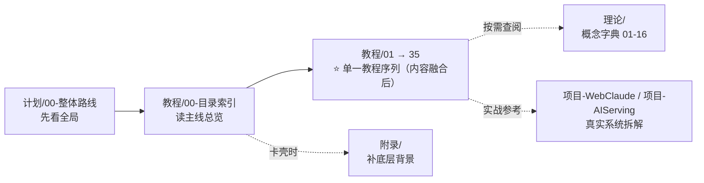
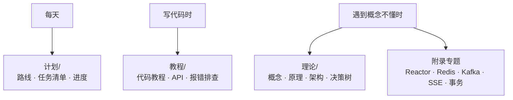
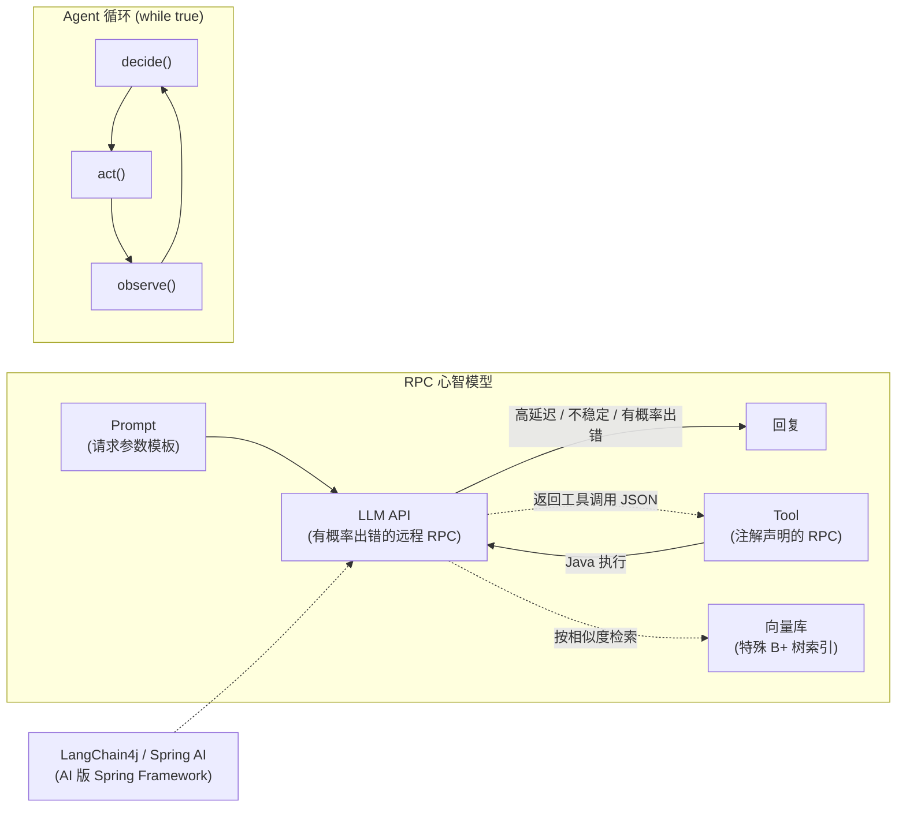

# Java 工程师 AI 实战学习仓库

> 面向有 Java 后端经验的工程师，从零起步用 **LangChain4j + Spring AI** 双轨进入 AI 应用开发。
> 理念：**先动手，再补理论**。

---

## 目录结构（2026-08 重整理）

```
docs/
├── 00-README.md                  # 根 README（你正在看的这个文件）
│
├── 计划/                         # 📋 学习计划（任务导向，按这个走）
│   ├── 00-整体路线.md            # 8 阶段主线 + 阶段 8+ 长期方向
│   └── progress.md               # 进度追踪
│
├── 教程/                         # 🛠️ 主线教程（单一 00-35 序列，代码导向）
│   ├── 00-目录索引.md            # 路线总览
│   ├── 01-2.0基础重塑.md         # 入门（已融合 LC4j 快速起步/声明式）
│   ├── 02-Tool与AgentLoop.md     # Tool 全章（已融合 Tool 设计/多 Tool 编排）
│   ├── 04-流式响应与Reactor深度.md# 流式（已融合 LC4j 流式输出）
│   ├── 09-RAG工程化实战.md       # RAG 全章（已融合 LC4j RAG 入门）
│   ├── 12-评估闭环.md            # 评估（已融合 Agent 评估入门）
│   ├── 14-安全工程与红队.md      # 安全（已融合 Agent 防失控）
│   ├── 16-多模型路由与国产化.md  # 路由（已融合 LC4j 本地/DeepSeek）
│   ├── 25-Agent记忆架构.md       # 记忆（已融合 LC4j ChatMemory）
│   └── … 35-管数分离实战.md      # 共 39 篇（原 LC4j/Agent 系列已融合进对应章节）
│
├── 理论/                         # 📚 主线理论字典（概念导向，按需查阅，扁平 01-16）
│   ├── 01-心智模型与决策树.md
│   ├── 02-RAG深度优化.md
│   ├── 03-Agent原理.md
│   ├── 04-多模态与多Agent.md
│   ├── 05-Java与AI融合架构.md
│   ├── 06-模型服务部署.md
│   ├── 07-模型微调.md
│   ├── 09-企业级Java-AI架构选型真相.md       # ⚠️ 选型前必读
│   ├── 10-SpringAI-vs-LangChain4j何时用何框架.md  # ⭐ 选型最终答案
│   ├── 11-LLMOps.md
│   ├── 12-ClaudeCode源码启示录.md
│   ├── 13-架构师进阶.md
│   ├── 14-MCP协议与生态.md
│   ├── 15-成本工程与PromptCache.md
│   └── 16-Agent可靠性工程Java视角.md
│
├── 项目-WebClaude/               # 🏗️ 实战项目：Claude Code 克隆（34 篇）
├── 项目-AIServing/               # 🏗️ 实战项目：AI 推理服务平台（6 篇）
│
├── 附录/                         # 📎 辅线知识库（专项背景，不按顺序通读）
│   ├── 00-学习路线总览.md
│   └── 各子专题/（Agent 专题 · Reactor · Redis · Kafka · 协议与数据库 …）
│
├── archive/                      # 🗄️ 历史归档（Spring AI 1.0 系列）
└── data/                         # 📁 RAG 教程数据（被 src/rag/ 代码引用）
```

---

## 学习顺序（主线）



## 三类文档怎么用

| 类型 | 用途 | 何时读 |
|------|------|--------|
| **计划/** | 学习路线、任务清单、进度追踪 | **每天**对照看，跟着走 |
| **教程/** | 代码级教程，API 细节 + 完整示例 + 报错排查 | **写代码时**对照手搓 |
| **理论/** | 概念、原理、架构、决策树 | **遇到概念不懂时**查阅 |
| **项目-*** | 真实系统设计文档 | 做综合项目时参考 |
| **附录/** | 专项知识点补充背景 | 卡壳时去补基础（双向导航） |
| **archive/** | 被新版本覆盖的历史文档 | 一般不读 |

**使用流程**：



---

## 核心心智模型（一图记住）

**把"模型推理"看作一个特殊的微服务**：高延迟、不稳定、有概率出错。

**心智模型**：



- LLM API = 一个有概率出错的远程 RPC
- Prompt = RPC 的请求参数模板
- Tool = 注解声明的 RPC，LLM 帮你"决定调用哪个"
- 向量库 = 一个特殊的 B+ 树索引（按相似度查而不是精确匹配）
- Agent = `while(true) { decide(); act(); observe(); }` 循环
- LangChain4j / Spring AI = AI 版的 Spring Framework

---

## 立即开始

1. 打开 `计划/00-整体路线.md` 看完整路线
2. 从"阶段 0：环境准备"开始
3. 进入阶段 1 时，对照 `教程/01-2.0基础重塑.md` 手搓代码

---

## 附录（辅线知识库）

学主线时遇到概念卡壳（响应式/Redis/Kafka/SSE/事务……），去 **附录** 找对应专题。先读 `附录/00-学习路线总览.md`（给初学者的跨文件夹阅读顺序：Reactor → Redis → Kafka → 管数分离实战），再按需深挖各专题文件夹。

> 附录每个子专题的 README 顶部都有「📌 辅线定位」横幅，指明它为哪篇主线文档补背景；主线文档底部也有「💡 卡壳了？」脚注——双向跳转。

---

## 学习纪律

- **手搓优先**：不复制粘贴框架搭好的骨架，自己写 pom.xml 和 Main
- **每周 Git 提交**：至少 5 次，commit message 写清楚
- **每周学习笔记**：写一篇 200-500 字，存到 `docs/notes/`（按需创建）
- **不追新框架**：盯死 LangChain4j + Spring AI
- **不跳阶段**：前一阶段没跑通，不要急着进下一阶段

---

## 防止迷失的红线

- ❌ 不要试图学会所有模型架构：会用比会改重要 10 倍
- ❌ 不要陷在 Python 教程里：你是 Java 工程师，每个概念都用 Java 实现一遍才算掌握
- ❌ 不要追新框架：每周都有新框架，盯死 **Spring AI 2.0**（LangChain4j 仅作入门与对照）
- ❌ 没跑通就上复杂特性（RAG/Agent）：基础不牢地动山摇
- ❌ **不要一上来就搞"Spring AI + LangChain4j 混用"**：理论范式，企业实战以单框架 + Workflow 为主流，不这么做
- ❌ **盲目追求自主 Agent**：能用 Workflow（确定性 DAG）解决的不要用 Agent
- ❌ **过早押注 Beta 框架**（Embabel/Koog/Google ADK）：跟进不押注
- ✅ 写文章输出：博客/笔记是最佳学习加速器
