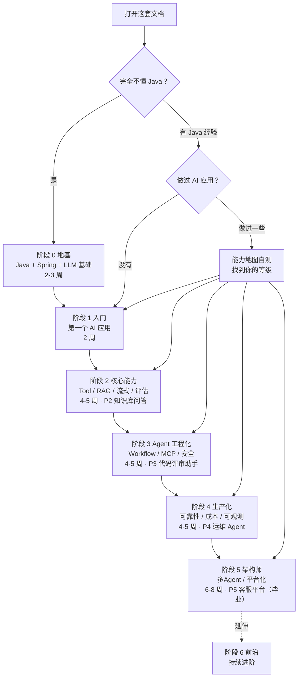
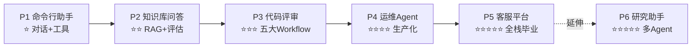
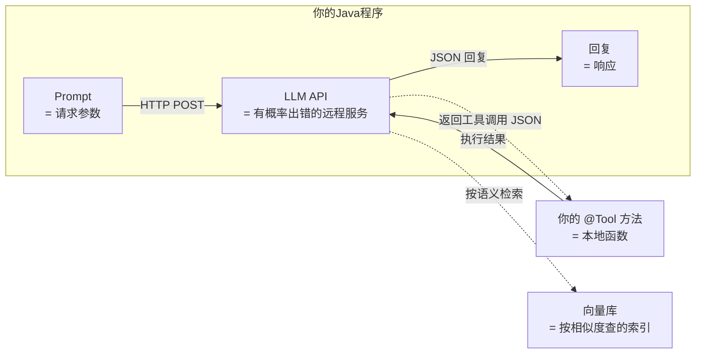

# 从零到 Agent 架构师

> 一套**从零基础到企业级 AI Agent 架构师**的完整学习体系。
> 知识 × 实践 × 项目三位一体，每个知识点都能跑通代码，每段代码都通向一个真实项目。

---

## 你是谁

- **你可能完全不懂 Java**——没关系，阶段 0 从 Java 核心语法讲起
- **你可能是有经验的 Java 工程师**——跳过阶段 0，直接从阶段 1 开始
- **你可能已经做过一些 AI 应用**——做一下 [能力地图](01-能力地图.md) 的自测，找到你的等级，从那里继续

不管你从哪进来，终点都是同一个：**能独立设计并交付一个企业级 AI Agent 系统**。

---

## 这套文档怎么读



**三步开始**：
1. 看 [能力地图](01-能力地图.md) 自测，找到你的等级
2. 看 [学习路线](02-学习路线.md) 了解全景
3. 进入你对应的阶段，开始动手

---

## 六大阶段一览

| 阶段 | 你会变成什么 | 项目产出 | 时间 |
|------|-----------|---------|------|
| **0 地基** | 能读写 Java、能搭 Spring Boot、能调通 LLM | - | 2-3 周 |
| **1 入门** | 能用 Java 做 AI 应用、理解 LLM 调用本质 | **P1 命令行助手** | 2 周 |
| **2 核心能力** | 能搭 RAG、能做评估、能流式输出 | **P2 知识库问答** | 4-5 周 |
| **3 Agent 工程化** | 能设计多步骤 Agent、掌握 Workflow/MCP/安全 | **P3 代码评审助手** | 4-5 周 |
| **4 生产化** | 敢上线：可靠性/成本/可观测/管控分离/混沌/安全/合规/灾备/红队/供应链/SLO/事故响应 | **P4 运维 Agent** | 4-5 周 |
| **5 架构师** | 能设计企业级多Agent平台、全栈交付、速率限制、熔断、调试、隐私保护 | **P5 客服平台（毕业）** | 6-8 周 |

---

## 六个递进项目

每个项目都不是孤立练习——**后面项目复用前面项目的全部能力**，最终拼成毕业项目：



| 项目 | 难度 | 你建成什么 | 复用 |
|------|------|---------|------|
| P1 | ⭐ | 能多轮对话+调工具的 CLI | - |
| P2 | ⭐⭐ | 上传PDF→自动问答+评估 | P1 对话能力 |
| P3 | ⭐⭐⭐ | 提交代码→多维自动评审 | P2 RAG+评估 |
| P4 | ⭐⭐⭐⭐ | 自然语言查K8s+流式+熔断 | P3 Workflow+工具 |
| P5 | ⭐⭐⭐⭐⭐ | 多租户+审计+多Agent | P3+P4 全部 |
| P6 | ⭐⭐⭐⭐⭐ | 开放研究+编排引擎 | P5 平台 |

---

## 十五个企业级大型项目（由简入繁）

教程中的 P1-P6 是阶段性的综合练习。除此之外，还有**十五个贯穿全部知识点的大型企业级项目**，按内容由浅入深排序：

```mermaid
flowchart LR
    E1["① EvalGuard<br/>质量评估 ⭐⭐⭐"] --> E2["② ComplyGuard<br/>合规治理 ⭐⭐⭐⭐"]
    E2 --> E3["③ AgentOps<br/>控制中心 ⭐⭐⭐⭐"]
    E3 --> E4["④ ReliabilityOps<br/>可靠性 ⭐⭐⭐⭐⭐"]
    E4 --> E5["⑤ AgentForge<br/>客服平台 ⭐⭐⭐⭐⭐"]
    E5 --> E6["⑥ KnowledgeHub<br/>知识中枢 ⭐⭐⭐⭐⭐"]
    E6 --> E7["⑦ FlowEngine<br/>工作流 ⭐⭐⭐⭐⭐+"]
    E7 --> E8["⑧ CodeForge<br/>深度Agent ⭐⭐⭐⭐⭐+"]
    E8 --> E9["⑨ AIOps<br/>运维自治 ⭐⭐⭐⭐⭐+"]
    E9 --> E10["⑩ DataFlywheel<br/>数据飞轮 ⭐⭐⭐⭐⭐+"]
    E10 --> E11["⑪ SentinelGuard<br/>安全防御 ⭐⭐⭐⭐⭐+"]
    E11 --> E12["⑫ OmniAgent<br/>多模态 ⭐⭐⭐⭐⭐+"]
    E12 --> E13["⑬ AgentForgeOps<br/>DevOps ⭐⭐⭐⭐⭐+"]
    E13 --> E14["⑭ DataGuard<br/>数据治理 ⭐⭐⭐⭐⭐+"]
    E14 --> E15["⑮ NexusOrchestra<br/>智能编排 ⭐⭐⭐⭐⭐+"]
    E10 -.->|"飞轮反馈"| E1
```



| 序号 | 项目 | 代号 | 核心问题 | 难度 | 文档 |
|------|------|------|---------|------|------|
| ① | Agent 评估质量保障 | **EvalGuard** | 怎么知道 Agent 够好？ | ⭐⭐⭐ | [总览](项目实践/01-企业项目-Eval质量保障平台/00-总览.md) |
| ② | Agent 合规治理 | **ComplyGuard** | 怎么通过合规审计？ | ⭐⭐⭐⭐ | [总览](项目实践/02-企业项目-Agent合规治理平台/00-总览.md) |
| ③ | Agent 控制中心 | **AgentOps** | 怎么管多个 Agent？ | ⭐⭐⭐⭐ | [总览](项目实践/03-企业项目-Agent控制中心/00-总览.md) |
| ④ | Agent 可靠性工程 | **ReliabilityOps** | 怎么保障 Agent 可靠？ | ⭐⭐⭐⭐⭐ | [总览](项目实践/04-企业项目-Agent可靠性工程/00-总览.md) |
| ⑤ | AI 智能客服平台 | **AgentForge** | 怎么造一个 Agent？ | ⭐⭐⭐⭐⭐ | [总览](项目实践/05-企业项目-AI客服平台/企业项目-AI客服平台-总览.md) |
| ⑥ | 企业知识中枢平台 | **KnowledgeHub** | 怎么让 Agent 懂企业知识？ | ⭐⭐⭐⭐⭐ | [总览](项目实践/06-企业项目-知识中枢平台/00-总览.md) |
| ⑦ | Agent 工作流引擎 | **FlowEngine** | 怎么编排复杂业务流程？ | ⭐⭐⭐⭐⭐+ | [总览](项目实践/07-企业项目-工作流引擎/00-总览.md) |
| ⑧ | AI 代码生成平台 | **CodeForge** | 怎么造深度 Agent？ | ⭐⭐⭐⭐⭐+ | [总览](项目实践/08-企业项目-代码生成平台/00-总览.md) |
| ⑨ | AI 运维自治平台 | **AIOps** | Agent 能自己运维吗？ | ⭐⭐⭐⭐⭐+ | [总览](项目实践/09-企业项目-AI运维自治平台/00-总览.md) |
| ⑩ | 数据飞轮平台 | **DataFlywheel** | 怎么让 Agent 越用越聪明？ | ⭐⭐⭐⭐⭐+ | [总览](项目实践/10-企业项目-数据飞轮平台/00-总览.md) |
| ⑪ | AI 安全防御平台 | **SentinelGuard** | 怎么防御持续安全威胁？ | ⭐⭐⭐⭐⭐+ | [总览](项目实践/11-企业项目-AI安全防御平台/00-总览.md) |
| ⑫ | 多模态 Agent 平台 | **OmniAgent** | 怎么处理多模态输入？ | ⭐⭐⭐⭐⭐+ | [总览](项目实践/12-企业项目-多模态Agent平台/00-总览.md) |
| ⑬ | Agent DevOps 平台 | **AgentForgeOps** | 怎么管理 Agent 全生命周期？ | ⭐⭐⭐⭐⭐+ | [总览](项目实践/13-企业项目-AgentDevOps平台/00-总览.md) |
| ⑭ | 数据治理平台 | **DataGuard** | 怎么保证数据安全合规？ | ⭐⭐⭐⭐⭐+ | [总览](项目实践/14-企业项目-Agent数据治理平台/00-总览.md) |
| ⑮ | 智能编排平台 | **NexusOrchestra** | 怎么编排上百个 Agent？ | ⭐⭐⭐⭐⭐+ | [总览](项目实践/15-企业项目-Agent智能编排平台/00-总览.md) |

---

## 三个反复出现的设计原则

整个学习过程中，这三条原则会反复强化：

### 1. Workflow > Agent

> 来自 [Anthropic《Building Effective Agents》](https://www.anthropic.com/research/building-effective-agents)

能用确定性工作流（DAG）解决的问题，**绝不用自主 Agent**。Agent 的"自主决策"是最后手段，不是默认选项。

### 2. 失败要被 LLM 看到

> 来自 Claude Code 源码工程实践

Tool 执行出错时，不要抛异常中断——要把错误信息返回给 LLM，让它自己修复。这把"崩溃"变成"自我纠正"。

### 3. 没有评估就是玄学

> 来自行业共识

改 prompt、换模型、调参数——没有评估集就不知道是变好了还是变差了。**从阶段 2 起所有改动都跑评估**。

---

## 核心心智模型（一张图记住）

**把 LLM 当成一个"有概率出错的远程 RPC"**：



| AI 概念 | Java 类比 |
|---------|----------|
| LLM API | 一个有概率出错的远程 RPC 服务 |
| Prompt | RPC 的请求参数 |
| @Tool | 注解声明的本地方法，LLM 决定调哪个 |
| 向量库 | 一个按语义相似度查询的特殊索引 |
| Agent | `while(true) { 决策(); 执行(); 观察(); }` 循环 |
| ChatMemory | HTTP 无状态，所以要客户端把历史塞回去 |
| Spring AI / LangChain4j | AI 版的 Spring Framework（封装 RPC 管道） |

---

## 目录结构

```
docs/
├── 00-README.md              ← 你在这里
├── 01-能力地图.md             ← 自测你的等级
├── 02-学习路线.md             ← 六大阶段全景
│
├── 阶段0-地基/                ← Java + Spring + LLM 零基础（3篇）
├── 阶段1-入门/                ← 第一个 AI 应用（5篇）
├── 阶段2-核心能力/            ← Tool / RAG / 流式 / 评估 / 向量库选型（8篇）
├── 阶段3-Agent工程化/         ← Workflow / MCP / 安全（8篇）
├── 阶段4-生产化/              ← 可靠性/成本/可观测/安全/合规/灾备/红队/供应链/SLO/事故响应/记忆/多模态/自我反思/反馈闭环/推理加速（42篇）
├── 阶段5-架构师/              ← 多Agent / 平台化 / 生命周期 / 速率限制 / 熔断 / 调试 / 隐私 / 事件驱动（13篇）
├── 阶段6-前沿/                ← 持续进阶：多模态/蒸馏/联邦学习/推理优化/安全攻防/商业ROI（12篇，深化版）
│
├── 项目实践/                  ← 十五个企业级大型项目（由简入繁）
│   ├── 01-企业项目-Eval质量保障平台/    ← ① EvalGuard：评估+CI 门禁+影子模式
│   ├── 02-企业项目-Agent合规治理平台/   ← ② ComplyGuard：数据分类+多租户+审计+合规
│   ├── 03-企业项目-Agent控制中心/       ← ③ AgentOps：管控分离+可视化+配置管理
│   ├── 04-企业项目-Agent可靠性工程/     ← ④ ReliabilityOps：混沌+故障切换+安全+飞轮
│   ├── 05-企业项目-AI客服平台/          ← ⑤ AgentForge：多租户客服
│   ├── 06-企业项目-知识中枢平台/        ← ⑥ KnowledgeHub：知识图谱+混合检索
│   ├── 07-企业项目-工作流引擎/          ← ⑦ FlowEngine：DAG编排+审批+集成
│   ├── 08-企业项目-代码生成平台/        ← ⑧ CodeForge：AI 编程助手
│   ├── 09-企业项目-AI运维自治平台/      ← ⑨ AIOps：AI SRE 自治
│   ├── 10-企业项目-数据飞轮平台/        ← ⑩ DataFlywheel：标注+评估+持续交付
│   ├── 11-企业项目-AI安全防御平台/      ← ⑪ SentinelGuard：语义防火墙+行为监控+DLP
│   ├── 12-企业项目-多模态Agent平台/     ← ⑫ OmniAgent：图文+语音+视频统一处理
│   ├── 13-企业项目-AgentDevOps平台/     ← ⑬ AgentForgeOps：全生命周期DevOps
│   ├── 14-企业项目-Agent数据治理平台/   ← ⑭ DataGuard：数据分类+血缘+隐私计算
│   └── 15-企业项目-Agent智能编排平台/   ← ⑮ NexusOrchestra：多Agent智能编排
│
├── 理论字典/                  ← 概念速查（13篇，按需查阅不按顺序）
├── 附录/                      ← 底层背景速成（7篇：Reactor/SSE/Redis/Kafka/向量库/可观测/Docker）
└── 调研/                      ← 行业调研报告
```

---

## 学习纪律

- **手搓优先**：每篇文档的代码自己敲一遍，不要复制粘贴
- **每周提交**：Git 提交至少 5 次，commit message 写清楚做了什么
- **不跳阶段**：前一阶段没跑通，不进下一阶段
- **概念卡壳**：去 `理论字典/` 查对应概念
- **底层卡壳**：去 `附录/` 补基础（Reactor/Redis/Kafka/SSE）

---

## 现在开始

1. → [能力地图](01-能力地图.md)：自测你的等级
2. → [学习路线](02-学习路线.md)：看六大阶段全景
3. → 进入你的阶段，开始动手
