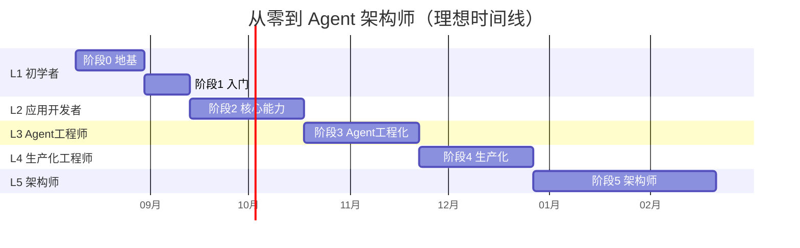

# Agent 架构师能力地图

> **怎么用这份文档**：先做 §1 的自测，找到你的等级，然后看那个等级的"晋升条件"——满足全部条件就能升到下一级。这不是一个考试，而是一份**导航图**：让你始终知道自己在哪、下一步要去哪。

---

## 1. 自测：你在哪一级

对每条能力，给自己打分：
- **0 分**：完全不会
- **1 分**：看过概念但没动手
- **2 分**：跟着教程做过一次
- **3 分**：能独立完成
- **4 分**：能教别人 / 做过生产级
- **5 分**：能做架构决策 / 有深度实践

### 能力自测表

| # | 能力 | 你的分数（0-5） |
|---|------|:---:|
| A1 | 能用 Java 读写文件、调用 HTTP API | |
| A2 | 理解 token / context window / temperature 是什么 | |
| A3 | 能用 Java 代码调通一个 LLM API 拿到回复 | |
| B1 | 理解多轮对话为什么需要记忆，能实现 ChatMemory | |
| B2 | 能写一个 @Tool 让 LLM 自己决定调用 | |
| B3 | 理解向量嵌入和相似度检索的原理 | |
| B4 | 能搭建完整的 RAG 管道（加载→分块→向量→检索→生成） | |
| B5 | 能用测试集 + 评估指标量化 AI 应用质量 | |
| B6 | 能用 SSE / Reactor Flux 实现流式输出 | |
| B7 | 理解 Advisor 链，能写自定义横切逻辑 | |
| C1 | 理解 Agent Loop 的 decide-act-observe 循环 | |
| C2 | 掌握 Anthropic 五大 Workflow 模式，知道何时用哪个 | |
| C3 | 能实现 Agent 防失控三重保护（maxTurns/预算/死循环） | |
| C4 | 能设计 Prompt Injection 防御方案 | |
| C5 | 理解 MCP 协议，能开发 MCP Server | |
| D1 | 理解 Context Engineering，能做上下文预算和缓存优化 | |
| D2 | 能设计 Agent 可靠性方案（幂等/重试/补偿/持久化执行） | |
| D3 | 能搭建 AI 应用的可观测性（全链路 trace） | |
| D4 | 能做成本工程（Prompt Cache/语义缓存/模型路由） | |
| D5 | 能设计四层测试体系（单元/集成/eval/契约） | |
| D6 | 能搭建 LLMOps（CI-CD 集成评估/数据飞轮） | |
| E1 | 能设计多 Agent 编排架构 | |
| E2 | 能设计多租户隔离方案 | |
| E3 | 能实现全链路审计与合规方案 | |
| E4 | 理解 AI 原生架构（Event Sourcing / CQRS） | |
| E5 | 能做编排引擎选型决策（Graph vs 状态机 vs 自主） | |
| E6 | 能端到端交付一个企业级 AI 系统 | |

### 评分规则

| 你的等级 | 条件 |
|---------|------|
| **L1 初学者** | A1-A3 都 ≥ 3 分 |
| **L2 应用开发者** | L1 + B1-B7 都 ≥ 3 分 |
| **L3 Agent 工程师** | L2 + C1-C5 都 ≥ 3 分 |
| **L4 生产化工程师** | L3 + D1-D6 都 ≥ 3 分 |
| **L5 Agent 架构师** | L4 + E1-E6 都 ≥ 3 分 |

> **如果你在某个等级但有几条不到 3 分**：那就是你的短板，优先补那些。文档阅读顺序就是补短板的顺序。

---

## 2. L1 初学者

> **一句话**：你能让 Java 代码和 LLM 说话了。

### 标志能力

- ✅ 能用 Java 调通 LLM API，拿到回复
- ✅ 理解 token、context window、temperature
- ✅ 能读写基本的 Java 文件 I/O 和 HTTP 调用

### 你能做什么

- 写一个单轮问答程序
- 理解"LLM 是一个有概率出错的远程 RPC"

### 晋升到 L2 的条件

| 条件 | 对应文档 |
|------|---------|
| 能实现多轮对话（ChatMemory） | `阶段1-入门/02-多轮对话与记忆.md` |
| 能写 @Tool 让 LLM 调用 | `阶段1-入门/03-工具调用.md` |
| 完成项目 P1（命令行助手） | `阶段1-入门/04-项目P1-命令行助手.md` |

### L1 的常见迷茫

| 困惑 | 解答 |
|------|------|
| "LLM 为什么有时候胡说八道？" | 这是 LLM 的本质（概率模型）。不是 bug，是要用工程手段（RAG/评估/护栏）管理的不确定性 |
| "我应该学 Python 还是 Java？" | 你是 Java 工程师就留在 Java。2026 年 Spring AI 2.0 已成熟，Java 做 AI 不输 Python |
| "要学机器学习理论吗？" | **不需要**。你不需要懂反向传播就能做 Agent 应用。把精力花在工程化上 |

---

## 3. L2 应用开发者

> **一句话**：你能独立搭建一个有检索增强的 AI 应用了。

### 标志能力

- ✅ 能搭建完整 RAG 管道
- ✅ 有评估意识，能用测试集量化质量
- ✅ 能实现流式输出
- ✅ 理解 Advisor 链（AI 版 AOP）

### 你能做什么

- 做一个"上传 PDF → 自动问答"的知识库系统
- 给 AI 应用建评估集，改 prompt 时能量化好坏

### 晋升到 L3 的条件

| 条件 | 对应文档 |
|------|---------|
| 理解 Agent Loop 循环 | `阶段3-Agent工程化/01-Agent循环.md` |
| 掌握五大 Workflow 模式 | `阶段3-Agent工程化/02-五大Workflow模式.md` |
| 能实现 Agent 防失控 | `阶段3-Agent工程化/03-Agent防失控.md` |
| 理解 MCP 协议 | `阶段3-Agent工程化/05-MCP协议入门.md` |
| 完成项目 P3（代码评审助手） | `阶段3-Agent工程化/08-项目P3-代码评审助手.md` |

### L2 的常见迷茫

| 困惑 | 解答 |
|------|------|
| "RAG 效果不好怎么办？" | 80% 是分块策略 + 检索质量问题。先建评估集，再逐环节优化。别急着上复杂方案 |
| "评估集要多少条？" | 最少 30 条。覆盖常见问题 / 边界情况 / 反例三类。宁缺毋滥，每条都要有明确期望输出 |
| "Advisor 和拦截器有什么区别？" | 没有本质区别。Advisor 就是 Spring AI 版的 AOP 拦截器，只是针对 AI 请求/响应做了专门设计 |

---

## 4. L3 Agent 工程师

> **一句话**：你能设计多步骤 Agent，知道 Workflow 和 Agent 的边界，能防失控。

### 标志能力

- ✅ 掌握五大 Workflow 模式，能正确选型
- ✅ 能实现 Agent 循环 + 终止保护
- ✅ 能开发 MCP Server
- ✅ 能设计 Prompt Injection 防御

### 你能做什么

- 做一个能自主完成多步骤任务的 Agent（代码评审、数据分析）
- 把工具暴露为 MCP Server，供跨框架消费

### 晋升到 L4 的条件

| 条件 | 对应文档 |
|------|---------|
| 理解 Context Engineering | `阶段4-生产化/01-上下文工程.md` |
| 能设计 Agent 可靠性方案 | `阶段4-生产化/02-Agent可靠性工程.md` |
| 能搭建可观测性 | `阶段4-生产化/03-可观测性建设.md` |
| 能做成本工程 | `阶段4-生产化/04-成本工程.md` |
| 能写四层测试 | `阶段4-生产化/05-测试工程化.md` |
| 完成项目 P4（运维 Agent） | `阶段4-生产化/07-项目P4-运维Agent.md` |

### L3 的常见迷茫

| 困惑 | 解答 |
|------|------|
| "Workflow 和 Agent 到底什么时候用哪个？" | 黄金法则：**能用确定性 Workflow（DAG）解决的，绝不用自主 Agent**。只在需要"动态决策下一步做什么"时才用 Agent |
| "MCP 值得投入吗？" | 值得。一次实现，跨框架复用。2026 年是工具接入事实标准 |
| "Agent 总是无限循环怎么办？" | 三重保护必须上：maxTurns（硬上限）+ 美元预算（成本上限）+ 死循环检测（transitionReason 重复检测） |

---

## 5. L4 生产化工程师

> **一句话**：你的 Agent 敢上线了。可靠性、成本、可观测、LLMOps 全都到位。

### 标志能力

- ✅ 能设计幂等/重试/补偿/持久化执行方案
- ✅ 能做 Context Engineering（上下文预算 + 缓存优化）
- ✅ 能搭建全链路可观测性
- ✅ 能做四层成本优化
- ✅ 能搭 LLMOps（CI-CD 集成评估 + 数据飞轮）

### 你能做什么

- 把一个 Demo 变成生产级系统
- 在每次改动后能量化验证"效果不退化"
- 看着成本看板优化，而不是盲猜

### 晋升到 L5 的条件

| 条件 | 对应文档 |
|------|---------|
| 能设计多 Agent 编排 | `阶段5-架构师/01-多Agent编排.md` |
| 能设计多租户隔离 | `阶段5-架构师/02-多租户与权限.md` |
| 能实现审计合规 | `阶段5-架构师/03-审计与合规.md` |
| 理解 AI 原生架构 | `阶段5-架构师/04-AI原生架构设计.md` |
| 完成项目 P5（企业客服平台） | `阶段5-架构师/06-项目P5-企业客服平台.md` |

### L4 的常见迷茫

| 困惑 | 解答 |
|------|------|
| "评估集要一直维护吗？" | 是的。这就是**数据飞轮**：生产 trace → 标注 → 补入评估集 → 改进。评估集是活的 |
| "Temporal 这种持久化执行值得引入吗？" | 当你的 Agent 有副作用（写数据库/发消息/调外部 API）且需要可恢复时，**必须**引入。否则崩溃后无法安全重试 |
| "成本优化优先做哪个？" | L1 Prompt Cache（最简单最有效）→ L3 模型路由（简单走小模型）→ L2 语义缓存 → L4 上下文裁剪 |

---

## 6. L5 Agent 架构师

> **一句话**：你能独立设计并交付一个企业级多 Agent 平台。

### 标志能力

- ✅ 能做多 Agent 编排架构设计
- ✅ 能设计多租户 + 权限 + 审计 + 合规
- ✅ 能做编排引擎选型决策
- ✅ 能端到端交付（代码 + 架构 + 评估 + 部署 + 文档）

### 你能做什么

- 从零设计一个企业级 AI Agent 平台
- 在技术选型上做出有依据的决策（ADR）
- 带团队交付完整系统

### L5 之后（持续进阶方向）

| 方向 | 文档 |
|------|------|
| Durable Agent Execution | `阶段6-前沿/01-Durable Agent Execution.md` |
| Context Engineering 深水区 | `阶段6-前沿/02-Context Engineering深水区.md` |
| AI SRE 自治 | `阶段6-前沿/03-AI SRE自治.md` |
| MCP Hub 与工具市场 | `阶段6-前沿/04-MCP Hub与工具市场.md` |
| 领域大模型融合 | `阶段6-前沿/05-领域大模型融合.md` |
| A2A 协议与 AgentOS | `阶段6-前沿/06-A2A协议与AgentOS.md` |

### L5 的核心竞争力（来自行业调研）

根据 [2026 行业调研](../调研/00-Agent架构师行业调研-2026.md)，Agent 架构师的核心竞争力**不是调 prompt**，而是：

```
分布式系统级可靠性（幂等/重试/补偿/持久化）
    + 成本工程（上下文预算/缓存/路由）
    + 多 Agent 编排（协议生态/共享上下文/规模化）
    + LLMOps（评估闭环/数据飞轮/CI-CD）
    + 架构决策能力（选型 ADR/边界判断）
```

**Java 工程师在这条赛道的天然优势**：类型系统、工程纪律、分布式中间件（Temporal/Spring Cloud/Resilience4j）——这些恰好是 Python/算法工程师最缺的。

---

## 7. 能力成长时间线

> 以下是**理想投入**（每周 10-15 小时）的估算。实际因人而异，不要赶进度。



| 等级 | 累计时间 | 标志 |
|------|---------|------|
| L1 | 5 周 | 第一个 AI 应用跑起来 |
| L2 | 10 周 | RAG 知识库 + 评估集 |
| L3 | 15 周 | 多步骤 Agent + MCP |
| L4 | 20 周 | 生产级 + LLMOps |
| L5 | 28 周 | 企业级平台交付（毕业） |

> **28 周 ≈ 7 个月**。这是从零基础到 Agent 架构师的最短路径。已有 Java 经验可缩短到 4-5 个月。
