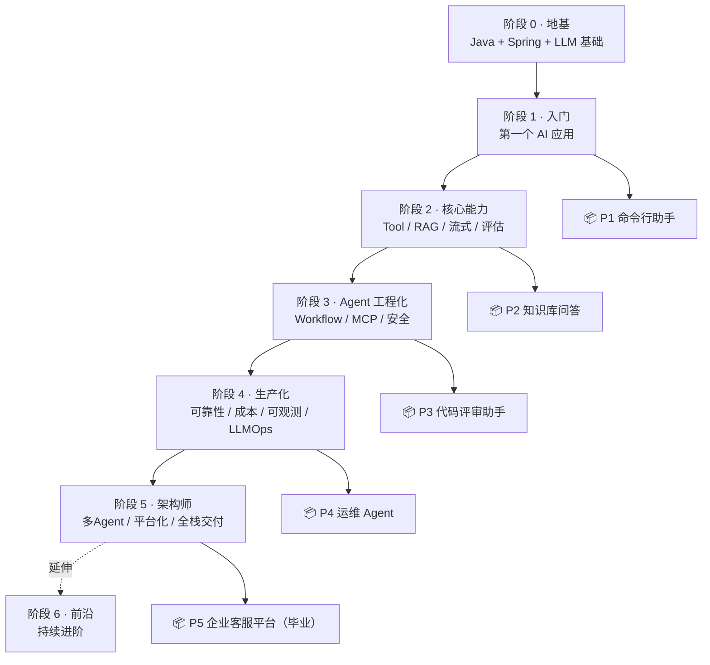

# 学习路线

> 六大阶段，从零基础到企业级 Agent 架构师。每周 10-15 小时投入，总计约 28 周（7 个月）。已有 Java 经验可跳过阶段 0，缩短到 4-5 个月。

---

## 全景图

---

## 阶段 0：地基（2-3 周）

> **如果你已有 Java + Spring 经验，直接跳到阶段 1。**

| 周 | 知识点 | 实践 | 文档 |
|---|--------|------|------|
| 1 | Java 核心：类/接口/泛型/Lambda/Stream/异常 | 10 个小练习 | `阶段0-地基/01-Java核心速成.md` |
| 2 | Maven + Spring Boot：依赖管理/REST API/配置 | 搭一个 Hello World API | `阶段0-地基/02-SpringBoot入门.md` |
| 3 | LLM 基础认知：token/context window/temperature/embedding | 用 curl 调通 LLM API | `阶段0-地基/03-LLM基础认知.md` |

**验收**：能独立写一个 `/hello?name=xxx` 的 Spring Boot 接口；能用 curl 调通 LLM 并拿到回复。

---

## 阶段 1：第一个 AI 应用（2 周）

> **目标**：用 Java 调通 LLM，建立"LLM = 远程 RPC"的心智模型。产出 **P1 命令行助手**。

| 周 | 知识点 | 实践 | 文档 |
|---|--------|------|------|
| 1 | ChatClient：用 Java 代码调 LLM | 写一个单轮问答程序 | `阶段1-入门/01-第一次调用LLM.md` |
| 1 | 多轮对话与记忆 | 加上 ChatMemory 实现多轮对话 | `阶段1-入门/02-多轮对话与记忆.md` |
| 2 | Function Calling / @Tool | 写一个"查天气"工具 | `阶段1-入门/03-工具调用.md` |
| 2 | 声明式 Agent 组装 | 整合成命令行助手 | `阶段1-入门/04-项目P1-命令行助手.md` |

**验收（P1）**：
- [ ] 命令行能多轮对话
- [ ] 能调至少 1 个自定义工具
- [ ] 能讲清"LLM 怎么决定调用工具的"
- [ ] Git 提交至少 5 次

---

## 阶段 2：核心能力（4-5 周）

> **目标**：掌握 AI 应用四大核心——工具体系、RAG、流式输出、评估方法论。产出 **P2 知识库问答**。

| 周 | 知识点 | 实践 | 文档 |
|---|--------|------|------|
| 1 | 工具体系设计：多工具/错误处理/安全 | 给 P1 加 5 个工具 | `阶段2-核心能力/01-工具体系设计.md` |
| 1-2 | 向量嵌入与相似度检索 | 手写简易向量检索 | `阶段2-核心能力/02-向量检索原理.md` |
| 2-3 | RAG 全链路 | 搭 PDF 问答管道 | `阶段2-核心能力/03-RAG全链路.md` |
| 3 | 评估方法论：测试集/RAGAS/LLM-as-Judge | 建 30 条 QA 测试集 | `阶段2-核心能力/04-评估方法论.md` |
| 3-4 | 流式输出：SSE / Reactor Flux | 让问答变成流式 | `阶段2-核心能力/05-流式输出.md` |
| 4 | Advisor 链 | 加日志/鉴权/限流 Advisor | `阶段2-核心能力/06-Advisor链.md` |
| 4-5 | 整合项目 | **P2 知识库问答** | `阶段2-核心能力/07-项目P2-知识库问答.md` |

**验收（P2）**：
- [ ] 上传 PDF → 自动问答
- [ ] 流式输出工作正常
- [ ] 有至少 30 条测试集 + 3 个量化指标（Recall@5 / faithfulness / 人工评分）
- [ ] 有评估报告

---

## 阶段 3：Agent 工程化（4-5 周）

> **目标**：让 AI 自主完成多步骤任务。掌握五大 Workflow 模式、MCP 协议、安全防线。产出 **P3 代码评审助手**。

| 周 | 知识点 | 实践 | 文档 |
|---|--------|------|------|
| 1 | Agent 循环（decide-act-observe） | 用 ToolCallingAdvisor 跑通 Agent | `阶段3-Agent工程化/01-Agent循环.md` |
| 1-2 | 五大 Workflow 模式 | 每个模式封装成 Advisor | `阶段3-Agent工程化/02-五大Workflow模式.md` |
| 2 | Agent 防失控 | 三重保护（maxTurns/预算/死循环） | `阶段3-Agent工程化/03-Agent防失控.md` |
| 3 | Prompt Injection 防御 | 4 层防御方案 | `阶段3-Agent工程化/04-Prompt Injection防御.md` |
| 3-4 | MCP 协议入门 | 消费一个 MCP Server | `阶段3-Agent工程化/05-MCP协议入门.md` |
| 4 | MCP Server 开发 | 把工具暴露为 MCP Server | `阶段3-Agent工程化/06-MCP Server开发.md` |
| 4 | 工具错误处理规范 | 所有工具返回 ToolResult.error | `阶段3-Agent工程化/07-工具错误处理规范.md` |
| 5 | 整合项目 | **P3 代码评审助手** | `阶段3-Agent工程化/08-项目P3-代码评审助手.md` |

**验收（P3）**：
- [ ] 提交 .java 文件 → 输出结构化评审报告
- [ ] 五大 Workflow 模式各至少 1 个可运行 demo
- [ ] Agent 有三重防失控保护
- [ ] 至少 1 个 MCP Tool 可用
- [ ] 有评估集指标基线

---

## 阶段 4：生产化（4-5 周）

> **目标**：让 Agent 敢上线。可靠性、成本、可观测、LLMOps——这是工程师和架构师的分水岭。产出 **P4 运维 Agent**。

| 周 | 知识点 | 实践 | 文档 |
|---|--------|------|------|
| 1 | 上下文工程 | 优化长会话成本 | `阶段4-生产化/01-上下文工程.md` |
| 1-2 | Agent 可靠性工程 | 接入 Temporal 持久化执行 | `阶段4-生产化/02-Agent可靠性工程.md` |
| 2-3 | 可观测性建设 | 接入 Micrometer + OTel + Langfuse | `阶段4-生产化/03-可观测性建设.md` |
| 3 | 成本工程 | 4 层成本优化 | `阶段4-生产化/04-成本工程.md` |
| 3-4 | 测试工程化 | 单元/集成/eval/契约 四层测试 | `阶段4-生产化/05-测试工程化.md` |
| 4 | LLMOps 与 CICD | CI 里集成 Promptfoo 评估 | `阶段4-生产化/06-LLMOps与CICD.md` |
| 4-5 | 整合项目 | **P4 运维 Agent** | `阶段4-生产化/07-项目P4-运维Agent.md` |

> **阶段4深化文档**（08-42篇）：管控分离 / Saga事务 / 多模型故障切换 / 成本归因 / 数据飞轮 / Prompt管理 / 安全审计 / MELT可观测性 / Eval驱动 / 多租户隔离 / 合规审计 / 流量回放 / 性能调优 / 灾备多活 / 版本兼容 / 容量规划 / 知识管理 / 历史持久化 / 安全防护深入 / 成本工程深入 / 可解释性 / **红队对抗测试** / **供应链安全** / **密钥管理** / **数据管线工程** / **推理加速** / **SLO管理** / **AI合规法案** / **事故响应** / **反馈闭环** / **记忆架构** / **自我反思** / **多模态Agent**（详见对应文件）

**验收（P4）**：
- [ ] 自然语言查 K8s Pod/日志/指标
- [ ] 流式输出正常
- [ ] 重启后会话不丢（持久化恢复）
- [ ] 全链路 trace 可查
- [ ] 成本看板可看
- [ ] Resilience4j 三层熔断验证通过
- [ ] 四层测试覆盖

---

## 阶段 5：架构师（6-8 周）

> **目标**：毕业项目。多 Agent 编排、平台化、AI 原生架构、全栈交付。产出 **P5 企业客服平台**。

| 周 | 知识点 | 实践 | 文档 |
|---|--------|------|------|
| 1-2 | 多 Agent 编排 | 设计路由+工人+评审 Agent 架构 | `阶段5-架构师/01-多Agent编排.md` |
| 2-3 | 多租户与权限 | 设计租户隔离方案 | `阶段5-架构师/02-多租户与权限.md` |
| 3 | 审计与合规 | append-only 审计日志 | `阶段5-架构师/03-审计与合规.md` |
| 4 | AI 原生架构 | Event Sourcing / CQRS 设计 | `阶段5-架构师/04-AI原生架构设计.md` |
| 4-5 | 编排引擎选型 | Graph vs 状态机 vs 自主 ADR | `阶段5-架构师/05-编排引擎选型.md` |
| 5-8 | 毕业项目 | **P5 企业客服平台** | `阶段5-架构师/06-项目P5-企业客服平台.md` |

**验收（P5 毕业标准）**：
- [ ] 多租户 + RAG + 多Agent + 全链路审计
- [ ] 评估集 faithfulness > 0.85
- [ ] Docker Compose 一键部署
- [ ] 成本/可靠性/安全检查清单全部通过
- [ ] 3 分钟演示
- [ ] 能写出 3 个简历级量化指标（QPS / 准确率 / 成本）

---

## 阶段 6：前沿（持续）

> 不是按周排，而是**持续投入的差异化方向**。来自 [行业调研](调研/00-Agent架构师行业调研-2026.md)。

| 方向 | ROI | 文档 |
|------|-----|------|
| Durable Agent Execution | ⭐⭐⭐⭐⭐ | `阶段6-前沿/01-Durable Agent Execution.md` |
| Context Engineering 深水区 | ⭐⭐⭐⭐⭐ | `阶段6-前沿/02-Context Engineering深水区.md` |
| AI SRE 自治 | ⭐⭐⭐⭐ | `阶段6-前沿/03-AI SRE自治.md` |
| MCP Hub 与工具市场 | ⭐⭐⭐⭐ | `阶段6-前沿/04-MCP Hub与工具市场.md` |
| 领域大模型融合 | ⭐⭐⭐ | `阶段6-前沿/05-领域大模型融合.md` |
| A2A 协议与 AgentOS | ⭐⭐ | `阶段6-前沿/06-A2A协议与AgentOS.md` |
| 多模态 Agent 前沿 | ⭐⭐⭐⭐⭐ | `阶段6-前沿/07-多模态Agent前沿.md` |
| 模型蒸馏与边缘部署 | ⭐⭐⭐⭐ | `阶段6-前沿/08-模型蒸馏与小模型部署.md` |
| 联邦学习与隐私计算 | ⭐⭐⭐ | `阶段6-前沿/09-Agent联邦学习与隐私计算.md` |
| 推理优化前沿 | ⭐⭐⭐⭐⭐ | `阶段6-前沿/10-Agent推理优化前沿.md` |
| 安全攻防前沿 | ⭐⭐⭐⭐⭐ | `阶段6-前沿/11-Agent安全攻防前沿.md` |
| 商业 ROI 与价值度量 | ⭐⭐⭐⭐ | `阶段6-前沿/12-Agent商业ROI与价值度量.md` |

---

## 进度追踪

| 阶段 | 计划周 | 状态 | 项目 | 完成日期 |
|------|--------|------|------|---------|
| 阶段 0 地基 | 2-3 周 | ⬜ | - | |
| 阶段 1 入门 | 2 周 | ⬜ | P1 | |
| 阶段 2 核心 | 4-5 周 | ⬜ | P2 | |
| 阶段 3 Agent | 4-5 周 | ⬜ | P3 | |
| 阶段 4 生产化 | 4-5 周 | ⬜ | P4 | |
| 阶段 5 架构师 | 6-8 周 | ⬜ | P5 | |
| 阶段 6 前沿 | 持续 | ⬜ | P6 | |

每完成一个阶段把 ⬜ 改成 ✅，填上完成日期。
