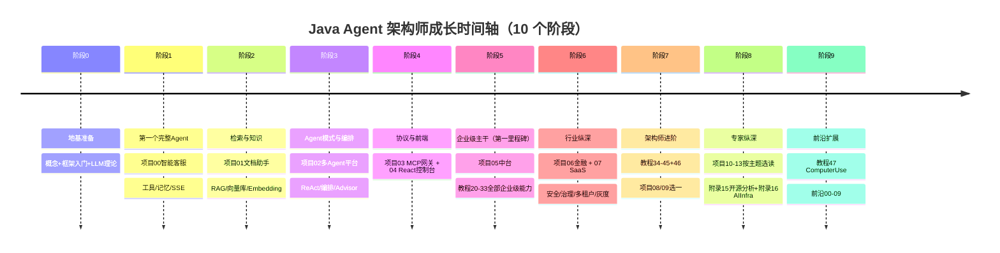
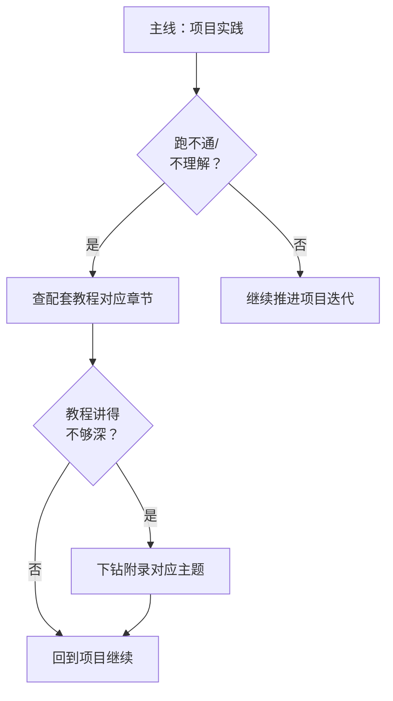
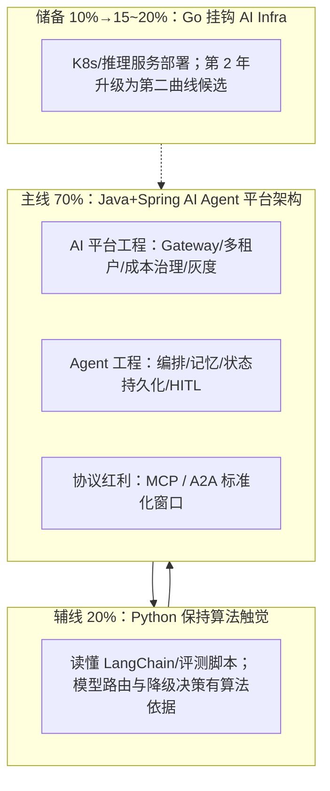

# Java Agent 架构师文档体系

> **技术栈**：Spring Boot 4.1 + Spring AI 2.0.0 + WebFlux + Java 21
>
> **定位**：一套面向中高级 Java 开发者的 AI Agent 架构师完整教程体系——从核心概念到前沿研究，从教程到实战项目，覆盖 Agent 开发的全生命周期。
>
> **文档规模**：约 530 篇文档（教程 53 + 附录 84 + 项目 381 + 前沿 12）。2026-08-17 全部 15 个项目完成进阶深化。2026-08-21 第十一批开启"进阶补充 + 深化 10 大方向"（意图路由/工作流引擎/记忆中枢/数据飞轮/A2A协作/可观测XAI/上下文工程/边缘/向量库……见 PLAN.md），已完成**方向1**（教程50+附录20+项目23）、**方向2**（教程51+项目24）、**方向3**（教程52+项目25记忆中枢）；并修复全体系迭代码/进阶N- 前缀正文链接（死链清零、命名铁律入 CLAUDE.md）。

---

## 目录结构

> **⚠️ 核心原则：同一文件夹下的文件和子文件夹一律从 `00` 开始计数，序号就是学习顺序。**
> 四大板块各自的阅读方式：教程按编号线性精读；项目按编号依次实战；附录按编号在被教程/项目提及时下钻；前沿按编号最后扩展。跨板块的穿插时机见下文[推荐学习路线](#推荐学习路线)。

```
docs/
├── README.md                          ← 你在这里
│
├── 教程/                                ← 51 篇（00-50），按编号依次学习
│   ├── 00-Agent核心概念.md
│   ├── 01-Spring-AI框架入门.md
│   ├── ...
│   ├── 46-SpringAI2-Agentic架构.md
│   ├── 47-ComputerUse与浏览器Agent.md
│   ├── 48-多模态Agent开发.md
│   ├── 49-Agent经济与支付集成.md
│   ├── 50-意图路由与路由编排.md            # 第十一批新增：意图/语义路由（入口路由）
│   ├── 51-超长任务与分布式工作流引擎.md    # 第十一批新增：Durable Workflow/长任务可靠
│   └── 52-工业级记忆架构.md                # 第十一批新增：三层记忆/演化/隔离/遗忘权
│
├── 项目/                                ← 23 个互相独立的项目（00-23），按编号依次实战
│   ├── 00-智能客服系统/                  # 内部从 00-需求分析 迭代到 05-核心代码讲解
│   ├── 01-智能文档助手/
│   ├── ...
│   ├── 13-事件溯源Agent运行时平台/
│   ├── 14-企业级多微服务管控Agent平台/    # 大型综合旗舰（36 篇：迭代+讲解+支撑+合规+前沿）
│   ├── 15-企业级Agent操作系统内核/        # OS 隐喻内核（11 篇：进程/syscall/记忆FS/调度/信号/IPC-ns）
│   ├── 16-企业级Agent服务网格/            # Mesh 视角（14 篇：透明拦截/xDS/身份/治理/遥测/联邦/WAF/A2A）
│   ├── 17-企业级实时多模态交互Agent平台/  # 实时视角（14 篇：全双工/打断/多模态/流中合规/边缘/情感/数字人/电话）
│   ├── 18-企业级Agent数据与知识中枢/      # 知识视角（14 篇：Connector/语义层/治理/时效/检索/共享 + GraphRAG/回归/联邦）
│   ├── 19-企业级Agent信任与评测平台/      # 评测视角（14 篇：金标资产/离线在线评估/红队/信任分闸门/飞轮 + 轨迹沙箱/自博弈/互认披露）
│   │   …
│   ├── 20-企业级Agent经济与结算平台/      # 经济视角（17 篇：授权三闸/计量计费/幂等账本/分账/审计/生态 + 预算/跨境/防套利/净额/互操作/信用）
│   ├── 21-企业级Agent仿真与数字孪生平台/  # 仿真视角（14 篇：流量资产/依赖替身/场景扫描/混沌彩排/容量/变更闸门 + 冷启动/极端推演/持续校准）
│   ├── 22-企业级Agent会话引擎/            # 会话引擎视角（14 篇：Actor核/三段取消/失败回填/审批缓存/压缩/恢复/steering + Guardian/会话树/投影层）
│   ├── 23-企业级Agent意图路由网关/        # 入口路由视角（14 篇：三层漏斗/语义路由/可执行链路由表/按意图阈值/观测漂移/灰度/HITL兜底/缓存/审计/策略下发）第十一批首个旗舰
│   ├── 24-企业级长任务工作流引擎/          # 长任务可靠视角（14 篇：Actor生命周期/三段式幂等/三层预算+死循环/DAG多Worker/断点续跑崩溃闭合/可视回放/独立引擎/多机分布/成本台+HITL）第十一批第二旗舰
│   └── 25-企业级Agent记忆中枢/            # 记忆基础设施视角（14 篇：三层记忆/窗口/长期持久化/语义混合召回/作用域隔离/演化衰减冲突消解/遗忘权Token预算/共享记忆/审计缓存）第十一批第三旗舰
│
├── 附录/                                ← 21 个主题子文件夹（00-20），按编号下钻
│   ├── 00-Java21新特性/
│   ├── ...
│   ├── 16-AIInfra与推理部署/             # 新增：vLLM/GPU调度
│   ├── 17-Kafka/                        # 新增：Kafka 事件骨干（10 篇）
│   ├── 18-Observation/                  # 新增：Micrometer Observation 可观测（8 篇）
│   ├── 19-Agent沙箱与执行环境/           # 新增：沙箱技术对比与选型
│   └── 20-路由与推理策略/                 # 第十一批新增：意图/模型路由与推理策略
│
└── 前沿/                                ← 12 篇（00-11），最后扩展视野
    ├── 11-八旗舰组合蓝图.md            # 体系收官导读：八旗舰组合落地路线
    ├── 00-A2A协议.md
    └── 10-边缘Agent与端云协同.md
```

**板块定位**：教程=教材（讲透每个知识点）｜项目=实战（互相独立，从最小 demo 迭代到企业级）｜附录=教程的下钻层（深度补充）｜前沿=技术雷达。学习时的阻塞路由：项目受阻→查教程对应篇→还不够深→查附录对应主题。

## 阅读路线推荐

> **同一文件夹下序号即学习顺序**（详见上方目录结构）。此处仅保留速查路线；完整跨板块穿插路线见下文[推荐学习路线](#推荐学习路线)。

### 速查路线（约 3~5 小时）

适合有 AI 开发经验、需要快速查阅关键实践的工程师：

1. `教程/45-Agent架构反模式与避坑指南.md` ← 先看避坑清单，避免踩雷
2. `教程/20-管控分离架构.md` ← 理解数据面/控制面分离核心架构
3. `教程/22-全链路可观测性.md` ← 生产级 Agent 的眼睛
4. 按需查阅下方索引表中的具体章节

**目标**：快速建立架构质量检查意识，知道"什么该做、什么不该做"。

---

## 教程编号快速索引

| 编号 | 主题 | 关键词 |
|------|------|--------|
| 00 | [Agent 核心概念](教程/00-Agent核心概念.md) | LLM、Agent 定义、感知-决策-行动 |
| 01 | [Spring AI 框架入门](教程/01-Spring-AI框架入门.md) | 环境搭建、项目结构、Hello World |
| 02 | [ChatClient 与对话模型](教程/02-ChatClient与对话模型.md) | ChatClient、Prompt、System Message |
| 03 | [工具调用](教程/03-工具调用.md) | @Tool、Function Calling、工具注册 |
| 04 | [记忆与会话管理](教程/04-记忆与会话管理.md) | ChatMemory、会话窗口、MessageWindow |
| 05 | [RAG 检索增强生成](教程/05-RAG检索增强生成.md) | 向量检索、ETL、知识库 |
| 06 | [向量数据库选型](教程/06-向量数据库选型.md) | Milvus、Pinecone、PgVector、选型矩阵 |
| 07 | [ReAct 推理模式](教程/07-ReAct推理模式.md) | Thought-Action-Observation 循环 |
| 08 | [Plan-and-Execute 模式](教程/08-Plan-and-Execute模式.md) | 任务分解、先规划后执行 |
| 09 | [多 Agent 协作](教程/09-多Agent协作.md) | Agent 通信、委派、角色分工 |
| 10 | [SSE 流式通信](教程/10-SSE流式通信.md) | Server-Sent Events、流式输出、WebFlux |
| 11 | [MCP 协议](教程/11-MCP协议.md) | Model Context Protocol、工具协议、Host/Client/Server |
| 12 | [Agent 状态管理](教程/12-Agent状态管理.md) | 状态机、会话状态、上下文管理 |
| 13 | [结构化输出](教程/13-结构化输出.md) | JSON 输出、BeanOutputConverter、entity() |
| 14 | [Advisor 链与拦截器](教程/14-Advisor链与拦截器.md) | Advisor、拦截器链、AOP 式扩展 |
| 15 | [React 入门与现代前端工程](教程/15-React入门与现代前端工程.md) | Vite、TS、组件化、现代前端工程 |
| 16 | [React 状态管理](教程/16-React状态管理.md) | useState/useReducer、Context、状态提升 |
| 17 | [React 与 SSE 流式 UI](教程/17-React与SSE流式UI.md) | EventSource、流式渲染、打字机效果 |
| 18 | [Agentic-UI 设计](教程/18-Agentic-UI设计.md) | 工具调用可视化、人工确认、过程透明 |
| 19 | [流式工具调用与事件协议](教程/19-流式工具调用与事件协议.md) | 事件类型、流式 ToolCall、前端事件协议 |
| 20 | [管控分离架构](教程/20-管控分离架构.md) | 数据面/控制面、Agent Mesh、Sidecar |
| 21 | [微服务拆分与 Agent 部署](教程/21-微服务拆分与Agent部署.md) | 微服务、容器化、服务网格 |
| 22 | [全链路可观测性](教程/22-全链路可观测性.md) | Tracing、Metrics、Micrometer、OpenTelemetry |
| 23 | [工具执行可观测与审计](教程/23-工具执行可观测与审计.md) | 工具调用日志、审计追踪 |
| 24 | [多页面流式响应与会话管理](教程/24-多页面流式响应与会话管理.md) | 多 Tab、会话隔离、前端流式 |
| 25 | [历史记录持久化与合规](教程/25-历史记录持久化与合规.md) | 对话存档、GDPR、数据保留策略 |
| 26 | [多租户隔离与资源治理](教程/26-多租户隔离与资源治理.md) | 租户隔离、资源配额、命名空间 |
| 27 | [成本治理与 Token 计量](教程/27-成本治理与Token计量.md) | Token 计费、成本告警、预算控制 |
| 28 | [Human-in-the-Loop 与审批流](教程/28-Human-in-the-Loop与审批流.md) | 人工审批、工作流、低置信度拦截 |
| 29 | [灰度发布与版本管理](教程/29-灰度发布与版本管理.md) | 灰度策略、A/B 测试、回滚 |
| 30 | [容错与弹性设计](教程/30-容错与弹性设计.md) | 重试、熔断、降级、超时 |
| 31 | [安全与权限控制](教程/31-安全与权限控制.md) | RBAC、Prompt 注入防御、数据脱敏 |
| 32 | [模型路由与降级](教程/32-模型路由与降级.md) | 多模型路由、降级策略、成本优化 |
| 33 | [部署与运维](教程/33-部署与运维.md) | Docker、K8s、CI/CD、蓝绿部署 |
| 34 | [上下文工程](教程/34-上下文工程.md) | 上下文窗口管理、压缩、截断策略 |
| 35 | [高级 RAG 与 Agentic RAG](教程/35-高级RAG与AgenticRAG.md) | 混合检索、重排序、Agentic RAG |
| 36 | [Agent 工作流编排](教程/36-Agent工作流编排.md) | DAG、状态机编排、条件分支 |
| 37 | [自我反思与 Agent 评估](教程/37-自我反思与Agent评估.md) | 自我评估、Reflection、质量度量 |
| 38 | [Agent 性能优化](教程/38-Agent性能优化.md) | 延迟优化、吞吐提升、缓存策略 |
| 39 | [高级记忆架构](教程/39-高级记忆架构.md) | 三层记忆、语义/情景记忆、记忆演化 |
| 40 | [长任务持久化与中断恢复](教程/40-长任务持久化与中断恢复.md) | 任务持久化、Checkpoint、恢复 |
| 41 | [数据飞轮与持续改进](教程/41-数据飞轮与持续改进.md) | 数据闭环、反馈飞轮、持续学习 |
| 42 | [响应式错误处理](教程/42-响应式错误处理.md) | Reactor 错误处理、错误边界 |
| 43 | [Agent 治理与合规框架](教程/43-Agent治理与合规框架.md) | AI 治理、合规审计、政策引擎 |
| 44 | [多模型协作与供应策略](教程/44-多模型协作与供应策略.md) | 模型组合、供应策略、混合推理 |
| 45 | [Agent 架构反模式与避坑指南](教程/45-Agent架构反模式与避坑指南.md) | 十大反模式、避坑清单、收官总结 |
| 46 | [SpringAI2-Agentic 架构](教程/46-SpringAI2-Agentic架构.md) | Agentic 模式、Spring AI 2.0 架构演进 |
| 47 | [ComputerUse 与浏览器 Agent](教程/47-ComputerUse与浏览器Agent.md) | 截图循环、Playwright MCP、护栏与审计 |
| 48 | [多模态 Agent 开发](教程/48-多模态Agent开发.md) | 图像/音频/文档输入、多模态 RAG、VLM 边界、图内注入 |
| 49 | [Agent 经济与支付集成](教程/49-Agent经济与支付集成.md) | 授权三闸、支付轨道、支付工具幂等、风险面 |
| 50 | [意图路由与路由编排](教程/50-意图路由与路由编排.md) | 意图识别三层漏斗、语义路由、可执行链路由表、按意图阈值、路由观测/漂移 |
| 51 | [超长任务与分布式工作流引擎](教程/51-超长任务与分布式工作流引擎.md) | Durable Workflow、Checkpoint 断点续跑、幂等重试、三层预算、死循环防护 |
| 52 | [工业级记忆架构](教程/52-工业级记忆架构.md) | 三层记忆读写、语义召回、演化衰减、冲突消解、多Agent隔离、遗忘权、Token预算 |

---

## 项目快速索引

| 项目 | 主题 | 核心技术 | 篇数 |
|------|------|----------|------|
| [00-智能客服系统](项目/00-智能客服系统/00-需求分析与架构设计.md) | 客服 Agent 全流程 | 工具调用 + RAG + 记忆 + 意图分流/坐席HITL/数据飞轮 | 11 |
| [01-智能文档助手](项目/01-智能文档助手/00-需求分析与架构设计.md) | 文档处理与检索 | 文档解析 + 混合检索重排 + GraphRAG/长文档/多模态 | 10 |
| [02-多Agent协作平台](项目/02-多Agent协作平台/00-需求分析与架构设计.md) | 多 Agent 编排 | 工具链 + DAG/A2A/协作评估 | 11 |
| [03-MCP工具网关](项目/03-MCP工具网关/00-需求分析与架构设计.md) | MCP 工具管理 | 双面网关 + Streamable/OAuth + 市场 + 联邦 | 10 |
| [04-React-Agent控制台](项目/04-React-Agent控制台/00-需求分析与架构设计.md) | Agent 前端 | 流式对话 + 工具可视化 + 性能/多端/a11y | 11 |
| [05-企业级Agent中台](项目/05-企业级Agent中台/00-需求分析与架构设计.md) | 集团中台 | 管控分离微服务 + 路由成本/能力开放/混沌 | 15 |
| [06-金融风控Agent系统](项目/06-金融风控Agent系统/00-需求分析与架构设计.md) | 金融风控 | HITL + 交叉验证 + 实时流式/监管/反欺诈 | 14 |
| [07-跨国多租户SaaS平台](项目/07-跨国多租户SaaS-Agent平台/00-需求分析与架构设计.md) | 跨国 SaaS | 多租户 + 数据驻留/全球调度/多币种 | 17 |
| [08-Agent供应链安全网关](项目/08-Agent供应链安全网关/00-需求分析与架构设计.md) | 供应链安全 | 工具准入 + SBOM/零信任/投毒检测 | 15 |
| [09-智能运维AIOps平台](项目/09-智能运维AIOps平台/00-需求分析与架构设计.md) | 智能运维 | 降噪RCA + 知识图谱/预测弹性/自愈 | 15 |
| [10-数据智能分析平台](项目/10-数据智能分析平台/00-需求分析与架构设计.md) | 数据分析 | SQL护栏 + 语义层/Text2SQL评测/血缘 | 16 |
| [11-工业质检与预测性维护](项目/11-工业质检与预测性维护/00-需求分析与架构设计.md) | 工业质检 | 多模态 + 边缘优化/融合质检/模型管理 | 15 |
| [12-研发效能DevOps平台](项目/12-研发效能DevOps平台/00-需求分析与架构设计.md) | 研发效能 | 多Agent评审 + 代码图谱/CICD自愈 | 15 |
| [13-事件溯源Agent运行时平台](项目/13-事件溯源Agent运行时平台/00-需求分析与架构设计.md) | 事件溯源 | 会话日志 + 版本化/快照/租户隔离 | 15 |
| [14-企业级多微服务管控Agent平台](项目/14-企业级多微服务管控Agent平台/00-需求分析与架构设计.md) | **综合旗舰** | 全能力：管控分离/多租户/工具治理/评估/安全/高可用/合规(标识/信创/BCM/ESG)/ADR/SRE | 36 |
| [15-企业级Agent操作系统内核](项目/15-企业级Agent操作系统内核/00-需求分析与架构设计.md) | **内核视角旗舰** | OS 隐喻：进程/syscall/记忆FS/调度cgroup/信号HITL/IPC-ns + 编排守护/沙箱/分布式内核HA | 14 |
| [16-企业级Agent服务网格](项目/16-企业级Agent服务网格/00-需求分析与架构设计.md) | **网格视角旗舰** | 零改造 Sidecar/xDS/身份mTLS/流量治理+混沌+Kill/自动遥测/联邦 + WAF/eBPF/A2A市场 | 14 |
| [17-企业级实时多模态交互Agent平台](项目/17-企业级实时多模态交互Agent平台/00-需求分析与架构设计.md) | **实时视角旗舰** | 延迟预算倒推：全双工/打断≤200ms/多模态/流中合规/边缘 + 情感/数字人/电话端侧 | 14 |
| [18-企业级Agent数据与知识中枢](项目/18-企业级Agent数据与知识中枢/00-需求分析与架构设计.md) | **知识视角旗舰** | 知识即资产：Connector/语义层/质量血缘/时效失效/检索/共享 + GraphRAG/变更回归/多模态联邦 | 14 |
| [19-企业级Agent信任与评测平台](项目/19-企业级Agent信任与评测平台/00-需求分析与架构设计.md) | **评测视角旗舰** | 效果可信：金标资产防污染/离线在线双评估/红队拦截率/五维信任分双卡闸门/飞轮AB + 轨迹沙箱/攻防自博弈/互认披露 | 14 |
| [20-企业级Agent经济与结算平台](项目/20-企业级Agent经济与结算平台/00-需求分析与架构设计.md) | **经济视角旗舰（第七旗舰）** | 交易可信：授权三闸/委托凭证/三源计量/幂等账本/多Agent分账/hash链审计/生态分润 + 预算治理/跨境合规/防套利/净额结算/协议互操作/信用体系 | 17 |
| [21-企业级Agent仿真与数字孪生平台](项目/21-企业级Agent仿真与数字孪生平台/00-需求分析与架构设计.md) | **仿真视角旗舰（第八旗舰）** | 变更可信：流量资产脱敏/全依赖替身/场景矩阵扫描/故障彩排/容量拐点/仿真闸门审批 + 合成冷启动/极端推演/孪生健康度 | 14 |
| [22-企业级Agent会话引擎](项目/22-企业级Agent会话引擎/00-需求分析与架构设计.md) | **会话引擎视角旗舰（第九旗舰）** | 交互可信：Actor会话核/三段取消/失败回填/审批三态key缓存/三路径压缩/JSONL恢复/steering + Guardian审阅/会话树/投影层 | 14 |
| [23-企业级Agent意图路由网关](项目/23-企业级Agent意图路由网关/00-需求分析与架构设计.md) | **入口路由视角旗舰（第十旗舰）** | 收敛入口：三层漏斗识别/语义路由/可执行链路由表/按意图阈值/观测漂移/灰度回滚/HITL兜底/两级缓存/审计回放/策略下发 | 14 |
| [24-企业级长任务工作流引擎](项目/24-企业级长任务工作流引擎/00-需求分析与架构设计.md) | **长任务可靠视角旗舰（第十一旗舰）** | 长任务=可持久化轨迹：Actor生命周期/三段式幂等/三层预算+死循环/DAG多Worker/断点续跑崩溃闭合/可视回放/独立引擎SPI/多机分布/成本台+HITL | 14 |
| [25-企业级Agent记忆中枢](项目/25-企业级Agent记忆中枢/00-需求分析与架构设计.md) | **记忆基础设施视角（第十二旗舰）** | 记忆=分层读写演化治理：三层记忆/窗口管理/长期持久化/语义混合召回/作用域隔离/演化衰减冲突消解/遗忘权Token预算/共享记忆/审计缓存 | 14 |

> 每项目内部结构统一：**00 需求架构（含★阅读顺序总览）→ 主体迭代 → 核心代码讲解 → 进阶迭代（领域深化）→ ADR 架构决策记录 → 工业前沿与演进收官**。文件名编号即阅读顺序。

---

## 附录快速索引

> 子文件夹顺序即学习顺序（按首次被教程/项目需要的时机排列）。

| 附录 | 主题 | 篇数 |
|------|------|------|
| [00-Java 21 新特性](附录/00-Java21新特性/00-虚拟线程.md) | 虚拟线程、Record、密封类 | 3 |
| [01-LLM 基础理论](附录/01-LLM基础理论/00-Transformer架构.md) | Transformer、Embedding、上下文窗口与 Token | 3 |
| [02-Prompt 工程](附录/02-Prompt工程/00-Prompt设计模式.md) | 设计模式、模板管理、注入防御 | 3 |
| [03-Spring AI 源码解析](附录/03-Spring-AI源码解析/00-ChatClient源码.md) | ChatClient 源码、Advisor 执行链、流式执行链 | 3 |
| [04-测试策略](附录/04-测试策略/00-单元测试.md) | 单元测试、集成测试、Eval 评估 | 3 |
| [05-SpringAI2-API 基准](附录/05-SpringAI2-API基准/00-Advisor与ChatMemory.md) | Advisor/ChatMemory/MCP/Tool/Observation 真实 API 对照 | 3 |
| [06-WebFlux 与响应式编程](附录/06-WebFlux与响应式编程/00-Reactor核心.md) | Reactor、背压、WebFlux vs MVC | 3 |
| [07-企业级架构模式](附录/07-企业级架构模式/00-ControlPlane设计模式.md) | ControlPlane 设计模式、Agent 沙箱、事件驱动 | 3 |
| [08-架构决策方法论](附录/08-架构决策方法论/00-ADR架构决策记录.md) | ADR 架构决策记录 | 1 |
| [09-Agent 安全深度](附录/09-Agent安全深度/00-Prompt注入分类与案例.md) | Prompt 注入、Tool Poisoning、DLP | 3 |
| [10-语义缓存与性能](附录/10-语义缓存与性能/00-语义缓存实现.md) | 语义缓存、Prompt/KV Cache、批量推理 | 3 |
| [11-知识图谱工程](附录/11-知识图谱工程/00-Neo4j落地GraphRAG.md) | Neo4j 落地 GraphRAG、GraphRAG 工程化 | 2 |
| [12-评估与可观测生态](附录/12-评估与可观测生态/00-Langfuse与Ragas集成.md) | Langfuse/Ragas、LLM-as-Judge 工程化、数据集版本化、A/B 统计 | 4 |
| [13-AI 治理与合规](附录/13-AI治理与合规/00-NIST-AI-RMF框架.md) | NIST AI RMF、模型卡片、数据隐私与偏见检测 | 3 |
| [14-Agent 交互设计](附录/14-Agent交互设计/00-Agent用户体验设计.md) | Agent 用户体验设计；01-中间过程可见性设计（六类过程信号/统一发射） | 2 |
| [15-开源代码深度分析](附录/15-开源代码深度分析/00-总览与架构解析.md) | DeepSeek Harness 全量代码分析 + Java 取经手册；13-codex-harness 子系列（会话引擎取经 5 篇） | 18 |
| [16-AIInfra 与推理部署](附录/16-AIInfra与推理部署/00-vLLM推理服务与SpringAI集成.md) | vLLM 推理服务、GPU 调度、vLLM 调优与容量规划 | 3 |
| [17-Kafka](附录/17-Kafka/00-Kafka全景与核心概念.md) | 事件骨干：生产者/消费者/事务/存储/调优/Streams/Connect/运维/Spring 落地 | 10 |
| [18-Observation](附录/18-Observation/00-Observation全景与核心概念.md) | Micrometer Observation：核心 API/Boot 集成/自定义扩展/Trace 传播/Agent 实战/指标治理/日志与Collector | 8 |
| [19-Agent沙箱与执行环境](附录/19-Agent沙箱与执行环境/00-沙箱技术对比与选型.md) | Docker/gVisor/Kata/Firecracker/WASM 对比与选型 | 1 |
| [20-路由与推理策略](附录/20-路由与推理策略/00-路由表与语义路由.md) | 路由表/多级语义路由/阈值标定 | 1 |

---

## 前沿调研快速索引

| 编号 | 主题 | 关键词 |
|------|------|--------|
| [00](前沿/00-A2A协议.md) | A2A 协议 | Google A2A、Agent 互操作、与 MCP 的关系 |
| [01](前沿/01-Agent操作系统.md) | Agent 操作系统 | Agent OS、运行时、调度、资源管理 |
| [02](前沿/02-多模态Agent.md) | 多模态 Agent | 视觉/音频 Agent、多模态 LLM |
| [03](前沿/03-Agent评测基准.md) | Agent 评测基准 | AgentBench、SWE-bench、GAIA、评估方法与局限性 |
| [04](前沿/04-MCP生态全景.md) | MCP 生态全景 | Server 注册中心、服务发现、工具市场、企业 Gateway |
| [05](前沿/05-Agent记忆前沿.md) | Agent 记忆前沿 | 记忆演化、神经记忆、持久化、遗忘机制 |
| [06](前沿/06-Spring-AI生态全景.md) | Spring AI 生态全景 | Spring AI Alibaba、Koog、JManus 对比与选型 |
| [10](前沿/10-边缘Agent与端云协同.md) | 边缘 Agent 与端云协同 | 端云五形态、边缘推理栈、断网韧性、经济账 |

---

## 技术栈说明

| 组件 | 版本 | 用途 |
|------|------|------|
| Java | 21（LTS） | 虚拟线程、Record、密封类、模式匹配 |
| Spring Boot | 4.1 | 应用框架、自动配置、Actuator |
| Spring AI | 2.0.0 | AI 模型集成、ChatClient、Tool、Memory |
| Spring WebFlux | (随 Spring Boot) | 响应式 Web、SSE 流式通信 |
| Reactor | (随 Spring Boot) | Mono/Flux 响应式编程 |
| Micrometer | (随 Spring Boot) | 可观测性、Metrics |

---

## 推荐学习路线（按学习顺序，全量 229 篇）

> **第一优先级：同一文件夹下文件/子文件夹从 00 计数，序号即学习顺序**——四个板块内部各自按编号线性阅读即可，本文补充的是跨板块的穿插时机（何时从教程切到项目、何时下钻附录）。排序原则（与编写顺序相反，详见 CLAUDE.md）：**项目实践先行 → 遇到阻塞点查教程 → 教材不够深再下钻附录 → 前沿扩展视野**。每阶段给出「主线（项目实践）」「配套教程（阻塞时按需查）」「下钻附录（深度不够时查）」三层。附录 15（开源代码深度分析）与前沿放在最后，因为它们需要前面全部知识做地基。
>
> **总览时间轴**（按每周 10~15 小时投入估算，总计约 7~10 个月）：



**阻塞路由规则**（学习顺序的核心机制）：



---

### 阶段 0｜地基准备（1~2 周）

| 层 | 阅读顺序 | 说明 |
|----|----------|------|
| 教程主线 | 教程 00-Agent核心概念 → 01-Spring-AI框架入门 → 02-ChatClient与对话模型 | 建立心智模型，跑通第一次模型调用 |
| 下钻附录 | 附录 00-Java21新特性/00-虚拟线程、01-Record与模式匹配、02-SealedClasses；附录 01-LLM基础理论/00-Transformer架构、01-Embedding原理、02-上下文窗口与Token；附录 02-Prompt工程/00-Prompt设计模式 | Java 21 语法不熟或想懂 LLM 原理时按需查 |

### 阶段 1｜第一个完整 Agent（2 周）

| 层 | 阅读顺序 | 说明 |
|----|----------|------|
| **项目主线** | 项目 00-智能客服系统（00 需求分析 → 01 最小Demo → 02 工具集成 → 03 RAG知识库 → 04 记忆与会话 → 05 核心代码讲解） | 第一个完整闭环，含 3 次迭代 |
| 配套教程 | 教程 03-工具调用、04-记忆与会话管理、13-结构化输出、10-SSE流式通信 | 项目迭代受阻时按需查 |
| 下钻附录 | 附录 03-Spring-AI源码解析/00-ChatClient源码；附录 04-测试策略/00-单元测试、01-集成测试 | 想吃透调用链或开始写测试时查 |

### 阶段 2｜检索与知识（2 周）

| 层 | 阅读顺序 | 说明 |
|----|----------|------|
| **项目主线** | 项目 01-智能文档助手（00 → 01 → 02 文档解析与向量化 → 03 多源检索与重排 → 04 核心代码讲解） | RAG 全链路实战 |
| 配套教程 | 教程 05-RAG检索增强生成、06-向量数据库选型 | 检索受阻时查 |
| 下钻附录 | 附录 01-LLM基础理论/01-Embedding原理；附录 02-Prompt工程/01-Prompt模板管理 | 检索质量上不去时下钻 |

### 阶段 3｜Agent 模式与编排（2~3 周）

| 层 | 阅读顺序 | 说明 |
|----|----------|------|
| **项目主线** | 项目 02-多Agent协作平台（00 → 01 → 02 单Agent工具链 → 03 多Agent编排 → 04 任务委派与路由 → 05 核心代码讲解） | 从单 Agent 到多 Agent |
| 配套教程 | 教程 07-ReAct推理模式、08-Plan-and-Execute模式、09-多Agent协作、12-Agent状态管理、14-Advisor链与拦截器 | 编排模式受阻时查 |
| 下钻附录 | 附录 03-源码解析/01-Advisor执行链源码；附录 05-SpringAI2-API基准/00-Advisor与ChatMemory | 想懂框架内部机制时查 |

### 阶段 4｜协议与前端控制台（3 周）

| 层 | 阅读顺序 | 说明 |
|----|----------|------|
| **项目主线** | 项目 03-MCP工具网关（00→04）→ 项目 04-React-Agent控制台（00→05） | MCP 协议 + 前端可视化双线 |
| 配套教程 | 教程 11-MCP协议、14-React入门、16-React状态管理、17-React与SSE流式UI、18-Agentic-UI设计、19-流式工具调用与事件协议 | 前端零基础则 15-18 必读 |
| 下钻附录 | 附录 12-API基准/01-MCP真实API与坐标、02-Tool与Observation真实API | MCP 坐标与真实签名 |

### 阶段 5｜企业级架构主干（4~6 周，第一里程碑）

| 层 | 阅读顺序 | 说明 |
|----|----------|------|
| **项目主线** | 项目 05-企业级Agent中台（00→09，10 篇：LLM网关→ControlPlane→工具服务化→可观测→业务线隔离→灰度AB→高可用容灾→核心代码） | 企业级能力的集中落地 |
| 配套教程 | 教程 20-管控分离架构 → 21-微服务拆分与Agent部署 → 22-全链路可观测性 → 23-工具执行可观测与审计 → 24-多页面流式响应与会话管理 → 25-历史记录持久化与合规 → 26-多租户隔离与资源治理 → 27-成本治理与Token计量 → 28-Human-in-the-Loop与审批流 → 29-灰度发布与版本管理 → 30-容错与弹性设计 → 31-安全与权限控制 → 32-模型路由与降级 → 33-部署与运维 | 企业级主干教程，与项目05迭代一一呼应 |
| 下钻附录 | 附录 07-企业级架构模式/00-ControlPlane设计模式、01-Agent沙箱与隔离机制、02-事件驱动Agent架构；附录 06-WebFlux与响应式编程/00-Reactor核心、01-背压与流量控制、02-WebFlux-vs-MVC | 架构模式与响应式编程深水区；02-事件驱动涉及 Kafka 时下钻 [附录 17-Kafka](附录/17-Kafka/00-Kafka全景与核心概念.md)（00-09 全 10 篇）；教程 22/23 的 Observation 机制下钻 [附录 18-Observation](附录/18-Observation/00-Observation全景与核心概念.md)（00-05 全 6 篇） |

### 阶段 6｜行业纵深（4~6 周）

| 层 | 阅读顺序 | 说明 |
|----|----------|------|
| **项目主线** | 项目 06-金融风控Agent系统（00→08：置信度分级→HITL审批→全量审计→多模型交叉验证→脱敏合规→成本治理部署）→ 项目 07-跨国多租户SaaS-Agent平台（00→11：数据隔离→配额限流→租户路由→计费→三维灰度→SLO容量→数据驻留→SOC2→DR多活） | 两大高合规行业纵深 |
| 配套教程 | 教程 43-Agent治理与合规框架 | 治理框架总览 |
| 下钻附录 | 附录 09-Agent安全深度/00-Prompt注入分类与案例、01-ToolPoisoning攻击、02-数据泄露防护；附录 13-AI治理与合规/00-NIST-AI-RMF框架、01-模型卡片与数据卡片、02-数据隐私与偏见检测 | 安全与治理深度 |

### 阶段 7｜架构师进阶（6~8 周）

| 层 | 阅读顺序 | 说明 |
|----|----------|------|
| **教程主线**（本阶段教程为主） | 教程 34-上下文工程 → 35-高级RAG与AgenticRAG → 36-Agent工作流编排 → 37-自我反思与Agent评估 → 38-Agent性能优化 → 39-高级记忆架构 → 40-长任务持久化与中断恢复 → 41-数据飞轮与持续改进 → 42-响应式错误处理 → 44-多模型协作与供应策略 → 45-Agent架构反模式与避坑指南 → 46-SpringAI2-Agentic架构 | 进阶能力主干，反模式篇收束全局 |
| **项目主线** | 项目 08-Agent供应链安全网关（00→09）或 项目 09-智能运维AIOps平台（00→09）——**二选一深入**，另一个可后补 | 安全纵深或可观测+HITL+长任务纵深 |
| 下钻附录 | 附录 10-语义缓存与性能/00-语义缓存实现、01-Prompt缓存与KVCache、02-批量推理与请求合并；附录 11-知识图谱工程/00-Neo4j落地GraphRAG；附录 12-评估与可观测生态/00-Langfuse与Ragas集成；附录 08-架构决策方法论/00-ADR架构决策记录 | 性能/高级RAG/评估/决策方法论 |

### 阶段 8｜专家纵深（6~8 周）

| 层 | 阅读顺序 | 说明 |
|----|----------|------|
| **项目主线** | 项目 10-数据智能分析平台（SQL安全/语义层/数据权限/AgenticRAG）→ 项目 11-工业质检与预测性维护（多模态/边缘/时序）→ 项目 12-研发效能DevOps平台（多Agent评审/工作流/评估闭环）→ 项目 13-事件溯源Agent运行时平台（事件溯源会话日志/能力缝/工具管线）→ **项目 14-企业级多微服务管控Agent平台（大型综合：多微服务管控分离/多租户/模型网关/工具治理/可观测/HITL/灰度成本/高可用/评估飞轮/多Agent/高级RAG/模型供应/可解释/安全纵深/前端/多模态 + ADR/数据模型/事件/SRE/运营/前沿，28 篇迭代+支撑）**——**按职业方向选读**：数据方向优先10、工业方向优先11、效能方向优先12、运行时方向优先13、**综合平台方向优先14** | 四大行业纵深 + 综合平台旗舰，全读约 4 个月；项目 14 的事件骨干机制下钻 [附录 17-Kafka](附录/17-Kafka/00-Kafka全景与核心概念.md)，管控/治理联动教程 20-44；项目 13 的事件溯源下钻 [附录 17-Kafka](附录/17-Kafka/00-Kafka全景与核心概念.md) |
| **附录主线** | 附录 16-AIInfra与推理部署/00-vLLM推理服务与SpringAI集成、01-GPU调度与K8s部署 | 自建推理能力，呼应教程 39 自建vs商用决策 |
| 下钻附录 | 附录 15-开源代码深度分析/00-总览与架构解析 → 11-设计哲学与架构模式 → 12-Java工程师借鉴手册（三篇必读）→ 01-10 各子系统篇（按需）；13-codex-harness/00-04（会话引擎取经，配项目 22） | DeepSeek Harness 与 Codex Harness 全量代码分析，站在巨人肩膀上 |

### 阶段 9｜前沿扩展（持续）

| 层 | 阅读顺序 | 说明 |
|----|----------|------|
| 教程主线 | 教程 47-ComputerUse与浏览器Agent → 48-多模态Agent开发 → 49-Agent经济与支付集成 | 前沿 07/08、02、09 的教程锚点 |
| 前沿全景 | 前沿 00-A2A协议 → 01-Agent操作系统 → 02-多模态Agent → 03-Agent评测基准 → 04-MCP生态全景 → 05-Agent记忆前沿 → 06-Spring-AI生态全景 → 07-ComputerUse与AgenticBrowser → 08-Agent技能包Skills → 09-Agent经济与支付 → 10-边缘Agent与端云协同 | 扩展视野，保持技术雷达 |
| 下钻附录 | 附录 14-Agent交互设计/00-Agent用户体验设计 → 01-中间过程可见性设计（过程透明工程，呼应教程 19/22）；附录 19-Agent沙箱与执行环境/00-沙箱技术对比与选型（呼应教程 47/48）；附录 16-AIInfra与推理部署（教程 48 成本模型） | Agent UX + 过程透明收官；边缘与沙箱纵深 |

---

## 附：职业发展方向调研最终结论（2026-08）

> **背景**：基于 2026 年 7~8 月两轮全量市场调研（猎聘《2026 人工智能行业人才供需趋势洞察》WAIC 报告、腾讯云 1 亿条招聘数据研究、紫牛新闻求职洞察、大厂实时 JD 抽样、JavaGuide 转型路线图、Addy Osmani/TechCrunch 职业趋势分析等 40+ 来源），回答"Python 算法 / Java+Spring AI Agent 平台 / Go 三条路线如何选"。

### 一、三路线前景排序（3~5 年）

| 排序 | 路线 | 前景判断 | 核心数据 |
|------|------|----------|----------|
| ① | **Java + Spring AI Agent 平台** | ⭐⭐⭐⭐⭐ 需求确定性最高，3~5 年标准化红利窗口（MCP/A2A 之于 Agent ≈ 2015 年 K8s 之于微服务） | 62% 企业已用 Java 支撑 AI；架构师新发职位 **+76.74%**（行业第一）；Agent Java 岗 25~50K、智能体方向 20~60K |
| ② | **Go / AI Infra** | ⭐⭐⭐⭐ 抗 AI 替代性最强，但岗位总量有限，"深而窄" | AI Infra 岗 40~70K·15 薪；腾讯/牛客 JD 明确 Go 为硬性要求；具身智能爆发抬升底座需求 |
| ③ | **Python 算法（作为独立路线）** | ⭐⭐ 收窄最快：算法岗增速仅 +12.84%（行业垫底）；"最紧缺"（TSI 2.64）是门票制造成的结构性稀缺 | 校招 35~45W（博士/论文价）vs 月薪 6,000 助理 offer 并存，回报方差全行业最大 |

### 二、最终选择：不对称组合，不三路并发也不单点押注



**为什么**：三路并发 = 三边都浅（AI 时代只为深度付费）；单点押注 = 丢掉最大差异化。市场上"懂算法语言"和"懂平台"的人都不少，**同时懂算法、企业平台、基础设施的工程师极少**——FDE 岗位（2026 年增速 1000%+，底薪 $200K+）本质上就是这个复合画像的定价。

### 三、Java Agent vs Go Agent（补充结论）

**写 Agent 的人 → Java 吃香**：存量企业系统 AI 化是主流路径，Spring AI 2.0 GA + LangChain4j + AgentScope Java 三线并行，受监管行业的合规型 Agent 天然选 Java。
**养 Agent 的底座 → Go 吃香**：Agent 网关、调度、观测平面、推理服务是 Go + K8s 主场，壁垒更高、更抗替代。
大厂 Agent 岗 JD（字节/腾讯/滴滴）语言要求均为"Python/Java/Go 任一"——企业按工程能力招人，不按语言。

### 四、关键时间窗与行动原则

1. **2026~2028 建仓期**：应用层红利约 2~3 年（之后培训批量供给涌入），协议标准化红利约 3~5 年
2. **2029 年前**完成"AI 应用工程师 → Agent 平台架构师"身份跃迁——从调 API 的人，变成设计别人在上面调 API 的平台的人
3. **叠能力，不换身份**：AI 技能叠加在任何既有技能上均有 40~50% 定价增益（腾讯云 1 亿条数据实证）
4. **经验可复利**：AI 行业 10 年+ 从业者年薪中位数 55.2 万（猎聘）——优先选"经验可积累"的方向，而非"吃论文新鲜度"的方向

**核心来源**：[猎聘 WAIC 2026 人才供需洞察](https://zhuanlan.zhihu.com/p/2061603921500566533) · [腾讯云 1 亿条招聘数据研究](https://cloud.tencent.com/developer/article/2674207) · [紫牛新闻 2026 求职洞察](https://www.yzwb.net/news/kj/202603/t20260309_329694.html) · [JavaGuide 后端转 AI Agent 路线图](https://javaguide.cn/roadmap/backend-to-ai-agent-roadmap.html) · [Red Hat：企业级 Agent 用 Java](https://developers.redhat.com/articles/2026/01/13/case-building-enterprise-agentic-apps-java) · [TechCrunch：FDE 崛起](https://techcrunch.com/2026/07/30/forward-deployed-engineers-are-the-ai-industrys-latest-talent-obsession/)
