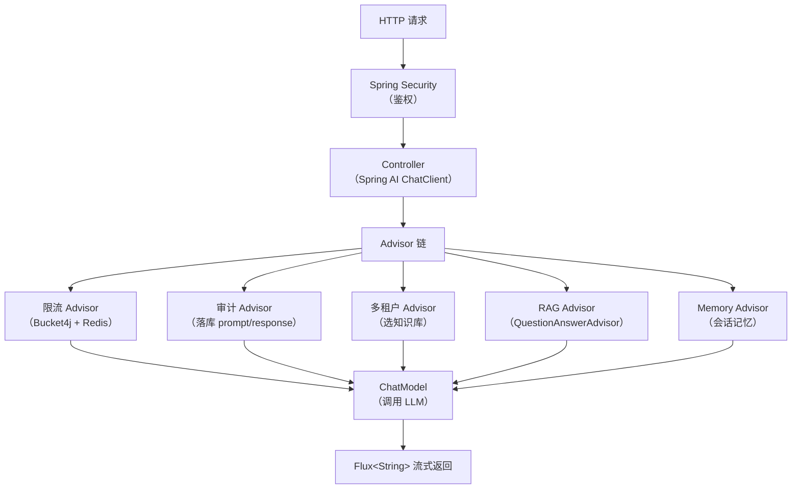
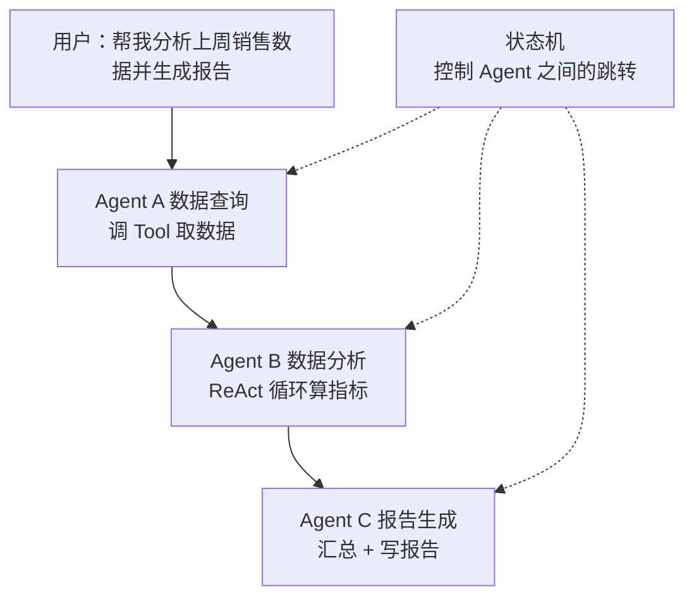
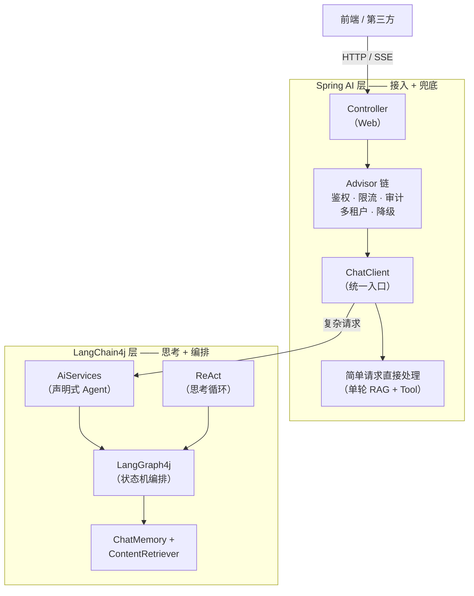
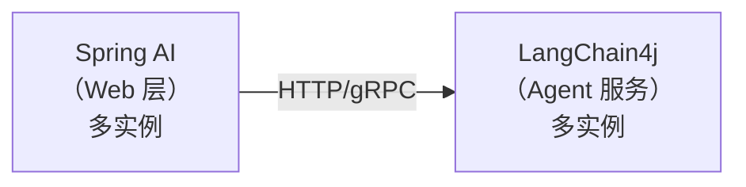
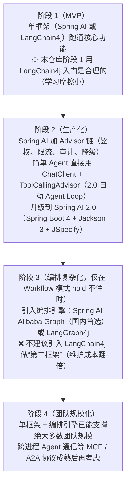

# 附录 - Spring AI 与 LangChain4j 分工模型

> ⚠️ **本文部分论点已过时（2026-07 更新）**：Spring AI 2.0 GA（2026-06-12）后，`ToolCallingAdvisor` 自动注册 + 递归迭代（即原生 Agent Loop）让 Spring AI 在"思考/编排"上的短板大幅补齐。本文仍可作为**理解两框架设计哲学差异**的教材，但**不要把"两层分工架构"当作企业标准实践**——企业实战以单框架为主、不混用（落地结论见本文第 9 节『演进路径建议』）。
>
> 一句话定位：**Spring AI 负责"接入"和"兜底"，LangChain4j 负责"思考"和"编排"**（⚠️ 此定位在 Spring AI 2.0 后已弱化：Spring AI 的 `ToolCallingAdvisor` 已能自动完成 Agent Loop 与结构化输出）。
>
> 这不是简单的"二选一"，而是大型 Java AI 项目里两个框架的**职责分工模型**（⚠️ 理论范式，企业实战罕见）。本文把"两框架核心差异"这一主题深入展开成一套分工模型，供你理解两框架的设计哲学。

---

## 1. 为什么要分工

两个框架各自有"舒适区"（⚠️ Spring AI 2.0 GA 后部分边界已模糊）：

| 框架 | 舒适区 | 不舒适区 |
|------|--------|----------|
| **Spring AI** | 接入 Spring 生态、Advisor 链、Web 层、Tool 注入业务 Bean、**ToolCallingAdvisor 自动 Agent Loop（2.0）**、MCP Server（2.0 独占） | 复杂状态机多 Agent（需借 LangGraph4j 或 Alibaba Graph） |
| **LangChain4j** | AiServices 声明式 Agent（接口驱动）、ChatMemory 灵活装配、LangGraph4j 状态机、Quarkus 生态、纯 Java 无容器 | Spring 容器集成、Web 鉴权限流审计、MCP Server、生产级可观测性 |

**核心洞察**（⚠️ 已修正）：原结论是"舒适区不重叠，可以共存"——Spring AI 2.0 GA 后，**两者的舒适区大幅重叠**（Spring AI 已能做 Agent Loop 和结构化输出），共存理由减弱。**企业实战以单框架为主**。

---

## 2. "接入"与"兜底" —— Spring AI 的职责

### 2.1 "接入"指什么

Spring AI 负责**把 LLM 能力接入到 Spring 业务系统**：

**接入链路**：



**关键能力**：
- `ChatClient.Builder` 全局默认配置（system prompt、advisors、tools）
- `@Tool` Bean 直接注入业务 Service（`@Transactional`、`@Cacheable` 都能用）
- `Advisor` 链是**横切关注点**的天然位置
- 与 Spring Security / Cloud / Data / Actuator 无缝集成

### 2.2 "兜底"指什么

Spring AI 负责**生产环境的兜底机制**：

| 兜底场景 | 实现方式 |
|---------|---------|
| 主模型超时 | `ChatClient` 配置 fallback Model Bean |
| 流式中断 | `Flux` 的 `onErrorResume` 切备用模型 |
| Tool 调用失败 | Advisor 捕获异常，返回降级响应 |
| 配额超限 | 限流 Advisor 直接拒绝，不走 LLM |
| 敏感词 | Advisor 前置过滤，prompt 不发出去 |
| 审计追溯 | Advisor 后置落库，所有调用可回放 |

**为什么 Spring AI 适合兜底**：Advisor 链是 Spring AOP 的 AI 版，所有横切关注点都能在这里统一处理，**不需要侵入业务代码**。

---

## 3. "思考"与"编排" —— LangChain4j 的职责

### 3.1 "思考"指什么

LangChain4j 负责**单次 LLM 调用的思考过程**：

```java
// AiServices 声明式 —— 接口签名即契约
interface Analyst {
    @SystemMessage("你是数据分析师，按 schema 输出")
    AnalysisResult analyze(@MemoryId String sessionId,
                          @UserMessage String question);
}

Assistant agent = AiServices.builder(Analyst.class)
    .chatLanguageModel(model)
    .contentRetriever(retriever)         // RAG
    .tools(queryTools, calcTools)        // Tool 集合
    .chatMemoryProvider(id -> ...)       // 记忆
    .build();
```

**关键能力**：
- `AiServices` 接口驱动，**类型安全**，IDE 提示完整
- `@SystemMessage` / `@UserMessage` 注解管理 prompt
- 返回类型直接映射结构化输出（不用 `.entity(Class)`）
- `ChatMemory` 装配式组合（窗口策略、Token 策略、自定义 Store）

### 3.2 "编排"指什么

LangChain4j 负责**多步骤、多 Agent 的编排**：

**编排流程**：



**核心工具**：
- **LangGraph4j**（`langchain4j-graph`）：状态机式多 Agent 编排
- **ReAct 循环**：思考 → 行动 → 观察 → 再思考
- **Chain of Responsibility**：链式调用多个 Agent
- **自定义 `ContentRetriever`**：复杂 RAG 策略（混合检索、重排序）

**为什么 LangChain4j 适合编排**：它的 API 设计**更接近 Python LangChain**，概念对应清晰，编排逻辑可以直接复用 Python 生态的成熟模式。

---

## 4. 分工模型架构图

**分工模型架构**：



---

## 5. 边界划分规则

### 5.1 用 Spring AI 做

- **Web 接入层**：Controller、SSE、WebSocket
- **横切关注点**：鉴权、限流、审计、敏感词、多租户
- **简单 LLM 调用**：单轮 RAG 问答、单 Tool 调用
- **Tool 的业务实现**：`@Component` + `@Tool`，注入 Spring Bean
- **降级与兜底**：fallback model、超时、重试策略
- **可观测性**：Micrometer + Prometheus 指标

### 5.2 用 LangChain4j 做

- **复杂 Agent**：需要 ReAct 循环、多步推理
- **多 Agent 协作**：LangGraph4j 状态机
- **结构化输出密集场景**：AiServices 接口签名即契约
- **复杂 RAG 策略**：混合检索、重排序、多路召回
- **离线批处理**：不依赖 Spring 容器的脚本任务
- **ChatMemory 精细控制**：自定义 Store、Token 窗口策略

### 5.3 边界争议场景

| 场景 | 推荐归属 | 理由 |
|------|---------|------|
| 单轮 RAG 问答 | Spring AI | Advisor 链足够，无需 LangChain4j |
| 多轮对话 + Tool | 两者皆可 | Spring AI 用 Memory Advisor；LangChain4j 用 AiServices |
| 多 Agent 工单系统 | LangChain4j | 状态机编排是 LangChain4j 强项 |
| 流式聊天 | Spring AI | `Flux<String>` 与 Web 层天然契合 |
| 离线文档处理 | LangChain4j | 不需要 Spring 容器 |

---

## 6. 两层之间的通信

### 6.1 同进程调用（推荐起步）

Spring AI 层直接注入 LangChain4j 的 `AiServices` Bean：

```java
// LangChain4j 侧：定义 Agent 接口
public interface AnalysisAgent {
    String analyze(@MemoryId String sessionId, @UserMessage String question);
}

// Spring AI 侧：作为 Bean 注入
@Configuration
class AgentConfig {
    @Bean
    AnalysisAgent analysisAgent(ChatLanguageModel model,
                                  ContentRetriever retriever) {
        return AiServices.builder(AnalysisAgent.class)
                .chatLanguageModel(model)
                .contentRetriever(retriever)
                .build();
    }
}

// Spring AI Controller 调用
@RestController
@RequiredArgsConstructor
class AnalysisController {
    private final AnalysisAgent agent;  // LangChain4j Bean

    @PostMapping("/analyze")
    String analyze(@RequestBody Req req) {
        return agent.analyze(req.sessionId(), req.question());
    }
}
```

**优点**：零网络开销、调试简单。
**缺点**：两层耦合，无法独立扩缩容。

### 6.2 跨进程调用（生产级）

Spring AI 层通过 HTTP/gRPC 调用 LangChain4j 服务：



**适用场景**：
- Agent 服务需要独立扩容（推理密集 vs IO 密集）
- 团队分工（Web 团队 vs AI 团队）
- Agent 服务复用给多个上游

---

## 7. 一个完整的分工示例

**需求**：企业内部知识库助手，支持多轮对话 + Tool 调用 + 复杂工单生成。

### 7.1 Spring AI 层（接入 + 兜底）

```java
@Configuration
class SpringAiConfig {
    @Bean
    ChatClient chatClient(ChatClient.Builder builder,
                          VectorStore vs,
                          ChatMemory memory) {
        return builder
            .defaultSystem("你是企业内部助手")
            .defaultAdvisors(
                new SecurityAdvisor(),           // 鉴权
                new RateLimitAdvisor(),          // 限流
                new AuditAdvisor(),              // 审计
                new MessageChatMemoryAdvisor(memory),
                new QuestionAnswerAdvisor(vs)    // RAG
            )
            .build();
    }
}

@RestController
@RequiredArgsConstructor
class AssistantController {
    private final ChatClient client;
    private final AnalysisAgent complexAgent;  // LangChain4j

    @PostMapping("/chat")
    Flux<String> chat(@RequestBody ChatReq req) {
        // 简单请求：Spring AI 直接处理
        if (req.isSimple()) {
            return client.prompt()
                .user(req.message())
                .stream()
                .content();
        }
        // 复杂请求：交给 LangChain4j 编排
        return Flux.fromCallable(() ->
            complexAgent.process(req.sessionId(), req.message())
        );
    }
}
```

### 7.2 LangChain4j 层（思考 + 编排）

```java
public interface AnalysisAgent {
    String process(@MemoryId String sessionId, @UserMessage String task);
}

@Configuration
class LangChain4jConfig {
    @Bean
    AnalysisAgent analysisAgent(ChatLanguageModel model,
                                  @Qualifier("hybridRetriever")
                                  ContentRetriever retriever,
                                  EmployeeTools empTools,
                                  OrderTools orderTools) {
        return AiServices.builder(AnalysisAgent.class)
            .chatLanguageModel(model)
            .contentRetriever(retriever)        // 混合检索
            .tools(empTools, orderTools)        // 业务 Tool
            .chatMemoryProvider(id ->
                MessageWindowChatMemory.builder()
                    .maxMessages(20)
                    .id(id)
                    .build())
            .build();
    }
}
```

### 7.3 分工收益

| 维度 | 收益 |
|------|------|
| 关注点分离 | Web 层不关心 Agent 内部逻辑；Agent 层不关心鉴权限流 |
| 可测试性 | Spring AI 层 mock 掉 Agent；LangChain4j 层独立单测 |
| 可演进 | Agent 逻辑变化不影响 Web 层；Web 层加 Advisor 不影响 Agent |
| 团队分工 | Web 工程师改 Spring AI 层；AI 工程师改 LangChain4j 层 |

---

## 8. 常见反模式

### 8.1 ❌ 在 Spring AI 层写复杂编排

```java
// 反模式：在 Controller 里写 ReAct 循环
@PostMapping("/chat")
String chat(@RequestBody Req req) {
    String thought = client.prompt().user(req.q() + " 先思考").call().content();
    String action = client.prompt().user("根据" + thought + "选工具").call().content();
    String result = callTool(action);
    String answer = client.prompt().user(thought + result + " 总结").call().content();
    return answer;
}
```

**问题**：编排逻辑散落在 Web 层，无法复用、无法测试、无法独立演进。
**正解**：交给 LangChain4j 的 AiServices 或 LangGraph4j。

### 8.2 ❌ 在 LangChain4j 层做鉴权限流

```java
// 反模式：在 AiServices 的 Tool 里做鉴权
public class EmployeeTools {
    @Tool
    String queryEmployee(String name, String authToken) {  // ❌ token 不该到这
        if (!authService.check(authToken)) throw ...;
        return ...;
    }
}
```

**问题**：横切关注点侵入业务 Tool，每个 Tool 都要重复鉴权逻辑。
**正解**：Spring AI 的 Advisor 链统一处理。

### 8.3 ❌ 起步就搞分工架构

新项目第一天就分两层，是过度设计。
**正解**：先用一个框架（推荐 Spring AI）跑通 MVP，等编排逻辑复杂到 Advisor 链 hold 不住时，再引入 LangChain4j。

---

## 9. 演进路径建议

> ⚠️ **2026-07 更新**：原"阶段 3 引入 LangChain4j"建议已过时。Spring AI 2.0 GA 后 LangChain4j 在"思考/编排"上的优势大幅缩水，企业实战更倾向于**单框架 + 编排引擎**而非"两层分工"。修正后的演进路径如下：



**核心修正**：原方案的"两层独立部署"在企业实战中**几乎没有案例**。

---

## 10. 自检清单

读完本节后，你应该能回答：

- [ ] "接入"和"兜底"分别指什么？为什么 Spring AI 适合？
- [ ] "思考"和"编排"分别指什么？为什么 LangChain4j 适合？（⚠️ Spring AI 2.0 后这条已弱化：ToolCallingAdvisor 已能自动 Agent Loop）
- [ ] 两层之间同进程和跨进程两种通信方式各有什么取舍？
- [ ] 哪些场景不该用分工模型（应单框架解决）？
- [ ] **本文哪些论点在 Spring AI 2.0 GA 后已过时？为什么企业不采用"两层分工"架构？**
- [ ] 在你当前的项目里，哪些逻辑属于"接入/兜底"，哪些属于"思考/编排"？

---

## 11. 阅读提示

本文是"两框架职责分工"这一主题的完整展开。**如果你要落地选型**，请直接采用本文第 9 节的结论：企业以单框架 + 编排引擎为主流，不混用两框架。

---

> 💡 **卡壳了？** 底层背景（响应式 / Redis / Kafka / SSE / 事务）去 `../附录/` 对应专题补基础；回到 `../教程/` 继续主线。
