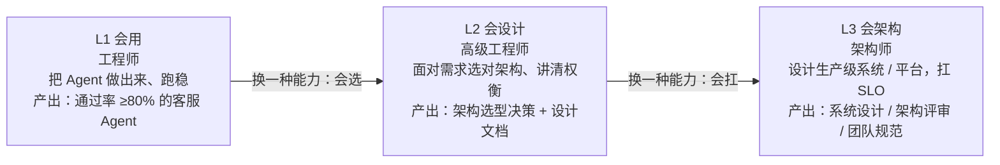
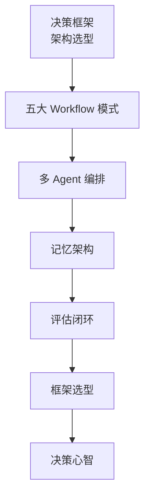
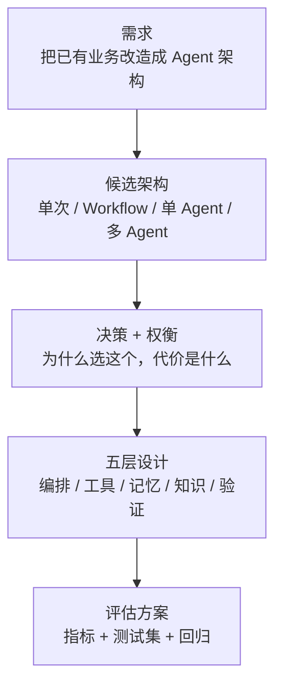

# 从入门到 Agent 架构师——三阶段路线

> **这份文档是什么**：回答"我想成为 **Agent 架构师**，路怎么走"。给一条从"会做一个 Agent"到"会设计 Agent 系统"的三阶段路线，每阶段讲清楚：**你要掌握什么 → 去读哪些文档（本专题 + 仓库深处）→ 做一个什么项目来证明**。它是本专题从"入门"通向"架构师"的桥。
>
> 前提：你会独立做一个能跑、通过率 ≥80% 的客服 Agent——单 Agent 循环、工具、提示词、护栏、评估都已上手（对应本专题入门篇 + 练手项目的能力）。

---

## 0. 一句话

> **架构师 = 会设计系统 + 会做决策 + 会扛生产。** 把它拆成三个阶段，每阶段都有明确的"掌握清单 + 路线图 + 收官项目"——不是看完所有文档就是架构师，是**做完每一层的收官项目**才算数。

---

## 1. 三个阶段总览

| 阶段 | 你是谁 | 核心能力 | 典型产出 |
|:---:|--------|---------|---------|
| **L1 会用** | 工程师 | 把一个 Agent 做出来、跑稳 | 通过率 ≥80% 的客服 Agent（练手项目） |
| **L2 会设计** | 高级工程师 | 面对需求能**选出正确架构**、讲清权衡 | 架构选型决策 + 设计文档 |
| **L3 会架构** | 架构师 | 设计**生产级** Agent 系统 / 平台，扛 SLO | 系统设计、架构评审、团队规范 |

> **关键认知**：三阶段之间不是"看更多文档"，而是**换一种能力**——L1 练"做出"，L2 练"选对"，L3 练"扛住"。

**三阶段路线**：

---

## 2. L1 会用（本专题，做完练手项目就毕业）

| 要掌握 | 读什么 | 做完的标志 |
|--------|--------|-----------|
| 单 Agent 循环、工具、提示词、护栏、评估 | 本专题入门篇（认知 → 动手 → 评估） | 练手项目的 12 条评估集通过率 ≥80% |

> **验收标准**：你能独立把"一个客服需求"做成能跑的 Agent，并讲清"为什么这么设计、通过率是多少"。**这就是 L1 毕业。**

---

## 3. L2 会设计（决策能力：从"会做"到"会选"）

### 3.1 要掌握什么

| 能力 | 读哪些 | 掌握什么 |
|------|--------|---------|
| **架构选型** | 系统设计决策框架（本专题） | 什么时候用 单次调用 / Workflow / 单 Agent / 多 Agent |
| **Workflow 模式** | 五大 Workflow 模式 | 五种编排模式的适用场景（评价器 / 规划者 / 并行化…） |
| **多 Agent 编排** | 多 Agent 编排实战 | 什么时候真的要多个 Agent、怎么协作 |
| **记忆架构** | Agent 记忆架构 | 三类记忆怎么配、上下文怎么管 |
| **评估闭环** | 评估闭环与 Prompt 版本管理 | 评估 + 版本化 + A/B 的完整闭环 |
| **框架选型** | 企业级 Java AI 架构选型 | Spring AI vs LangChain4j、自研 vs 框架 |
| **决策心智** | 心智模型与决策树 | 概念映射、选型决策树、防迷失红线 |

### 3.2 路线（按顺序）

### 3.3 收官项目：写一份"架构设计文档"

**不是再写一个 Agent**，而是把一个已有业务（比如你做过的一个 Spring Boot 服务）改造成 Agent 架构，写一份设计文档：

**设计文档流程**：

> **验收标准**：面对一个需求，你能在 30 分钟内给出架构选型 + 权衡，**经得起追问**——别人问"为什么不用多 Agent"，你能答出"一个 Agent + 好工具就够，多 Agent 的复杂度不值"。

---

## 4. L3 会架构（生产化 + 平台化：从"会选"到"会扛"）

### 4.1 要掌握什么

| 能力 | 读哪些 |
|------|--------|
| **可靠性工程** | Agent 可靠性工程、AI 工程的 SRE 实践 |
| **可观测 + 成本** | 可观测性与成本治理、成本工程与 Prompt Cache |
| **测试 + CI/CD** | 测试工程化、AI 项目的 CI/CD 与 Git 工作流 |
| **安全与红队** | 安全工程与红队 |
| **大规模 Agent 平台** | 大规模 Agent 平台与数据基础设施 |
| **AI 原生系统设计** | AI 原生系统设计、Java 与 AI 融合架构 |
| **自研 vs 框架边界** | 自研 vs 框架的边界 |
| **终极视野** | 架构师进阶（AI 原生架构、事件驱动 Agent、开源影响力） |

### 4.2 收官项目：落地一个"能扛生产"的系统

设计并落地一个**多 Agent 平台**，或把公司一个核心系统改造成 Agent 化。它必须包含：

- [ ] SLO（可用性 / 准确率 / 成本预算）
- [ ] 评估闭环 + 回归（评估进 CI）
- [ ] 可观测（每次调用的轨迹 / 步数 / token / 失败率）
- [ ] 成本治理（预算上限、缓存、模型分级）
- [ ] 安全（注入防线、越权隔离）

> **验收标准**：你的系统能扛生产（有 SLO、有评估、有监控、有成本治理）；你能给**别人的系统**做架构评审，一针见血指出"能不能上生产"。

---

## 5. 三条主线怎么选（对应架构师进阶的战场）

| 主线 | 做什么 | Java 友好度 |
|------|--------|-----------|
| **AI 工程平台**（黄金赛道） | LLM Gateway / 向量库服务 / Agent 编排引擎 | ⭐⭐⭐⭐⭐（Java 强项） |
| **AI 效用落地** | RAG / Agent 极致优化 + 业务结合 | ⭐⭐⭐⭐ |
| **模型算法** | 微调、推理优化 | ⭐（需转 Python/C++） |

> 架构师的价值不只在技术，更在**"把 demo 变成生产系统"的责任感**。你已经在乎"服务挂掉"，这是最大的优势。

---

## 6. 理解检查

1. L1 / L2 / L3 的核心能力分别是什么？
2. L2 的收官项目为什么是"写设计文档"，而不是"再写一个 Agent"？
3. L3 里哪几个主题是"能不能上生产"的关键？
4. 三条主线（平台 / 落地 / 算法）里，对 Java 工程师最友好的是哪条？为什么？

---

## 7. 相关文档

- 本专题入门篇（L1 的地基）、系统设计决策框架（L2 的核心技能）
- 系统课：Spring AI 2.0 目录索引
- 参考：心智模型与决策树、企业级 Java AI 架构选型、Agent 可靠性工程、架构师进阶

下一篇：**11-Agent系统设计——架构决策框架**——把"需求"翻译成"一个 Agent 系统设计"的三层决策流程。
