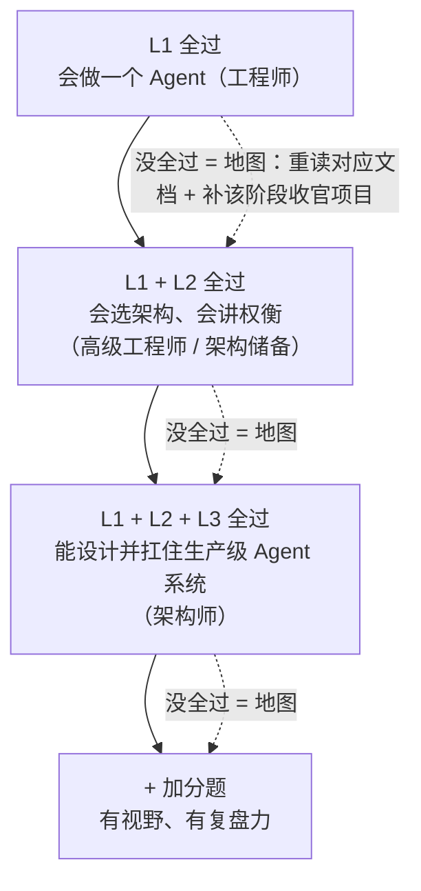

# Agent 架构师面试与自测——你在哪个水平？

> **这份文档是什么**：按"会用 → 会设计 → 会架构"三阶段出一套自测题（含面试题），每阶段一组，每题带**过关标准**和**复习指引**。它同时是两个用途：**自测**——答不出就是该阶段没到位；**面试准备**——检验你不是"背过概念"，而是"会用"。
>
> 前提：你已读完本专题从入门到复盘的全部内容，会做、会设计、会复盘 Agent。

---

## 0. 一句话

> **面试题不是背答案，是检验"你会不会用"。** 每题都能答出"为什么"，才算过关；答不出，回去看复习指引，而不是硬记答案。

---

## 1. 怎么用这份自测

1. 按 L1 → L2 → L3 顺序，逐组自测，**先别翻文档**。
2. 每题答不上 / 说不清"为什么"，标出来，回去复习指引里的文档。
3. **全组答出 = 该阶段过关**；三组全过 + 加分题有见解，你就具备架构师水平，能去面试、能带项目。

---

## 2. L1 会用级（8 题）

| # | 问题 | 过关标准 | 复习 |
|:--:|------|---------|------|
| 1 | Agent 和普通 LLM 调用的本质区别？ | 能说出"模型在循环里做决策"，而不只是"多调几次" | Agent 心智模型 §1 |
| 2 | ReAct 的 Thought / Action / Observation 各指什么？现代实现是什么？ | 能画出一条完整消息序列，说出 Function Calling 是它的结构化收敛 | Agent 心智模型 §1.3/1.4 |
| 3 | Agent 的五个零件？哪些决定"能跑"、哪些决定"能生产"？ | 能说出模型/工具/循环 vs 记忆/护栏 | Agent 心智模型 §2 |
| 4 | 工具描述要写清哪五件事？为什么"何时别用"最关键？ | 能举出"查询订单 vs 查询用户"两个工具靠它路由的例子 | Agent 提示词实战 §2 |
| 5 | 提示词五要素？为什么约束放 System？ | 能说出 Role/Task/Context/Constraint/Format 的分层理由 | 提示词工程入门 §2 |
| 6 | 怎么让模型输出可被代码直接解析？ | 说出 JSON Schema + 结构化输出 + 校验重试 | 提示词工程入门 §3 |
| 7 | 什么时候**不该**用 Agent？ | 能举反例（固定规则任务硬套 Agent），说出 Workflow / 单次调用的适用场景 | Agent 心智模型 §3 |
| 8 | 怎么评估一个 Agent？为什么要测"过程"而不只测"答案"？ | 说出两个维度 + 四类用例 + 通过率 | 怎么评估一个 Agent |

## 3. L2 会设计级（8 题）

| # | 问题 | 过关标准 | 复习 |
|:--:|------|---------|------|
| 1 | 面对一个需求，怎么选"单次 / Workflow / 单 Agent / 多 Agent"？ | 能说出两轴判断（可预测性 × 复杂度），并走一遍决策案例 | 系统设计决策框架 §1 |
| 2 | 三类记忆各靠什么？ | 对话记忆靠上下文 / 长期记忆靠存储 / 知识记忆靠 RAG | Agent 心智模型 §2.1 |
| 3 | RAG / 长上下文 / 微调怎么选？ | 能按"数据量 / 更新频率 / 要能力还是要资料"判断 | RAG 入门 §3 |
| 4 | MCP 和 `@Tool` 什么时候用哪个？ | 能说出"工具要出进程了"（共享 / 跨语言 / 独立部署）才上 MCP | MCP 入门 §3 |
| 5 | 评估的三种方法？怎么配？ | 规则断言打底 + LLM 判卷 + 人工抽检 | 怎么评估一个 Agent §3 |
| 6 | 改 Agent 提示词为什么用"过程指标"？ | 能说出工具调用成功率 / 步数比最终答案更能定位问题 | Agent 提示词实战 §8 |
| 7 | 五大 Workflow 模式是哪些？各自适合什么？ | 能说出评价器 / 规划者 / 并行化等至少三种 + 适用场景 | 五大 Workflow 模式 |
| 8 | 什么时候真的值得上多 Agent？ | 能说出"先问一个 Agent 为什么不行"，95% 场景一个 Agent + 好工具就够 | Agent 心智模型 §3.3 |

## 4. L3 会架构级（8 题）

| # | 问题 | 过关标准 | 复习 |
|:--:|------|---------|------|
| 1 | 一个 Agent 系统怎么才算"能上生产"？ | 能列出 SLO / 评估闭环 / 可观测 / 成本治理 / 安全 | 入门到架构师 §4 |
| 2 | 准确率 / 成本 / 延迟 / 风险怎么权衡？默认起步策略是什么？ | 说出"先最简方案跑通 + 评估，用指标决定升级" | 系统设计决策框架 §3 |
| 3 | 演进式架构和过度设计的界线？ | 能讲研究 Agent 的演进哲学 | 案例复盘 案例二 |
| 4 | 金融等高风险行业，Agent 的铁律是什么？ | 说出"LLM 做建议、规则做决策、人做复核、全链路留痕" | 案例复盘 案例一 |
| 5 | 提示词注入是什么？三条防线？ | 说出"不可信数据声明 / 危险操作护栏 / 外部内容不进 System" | Agent 提示词实战 §6 |
| 6 | 可观测 / 成本 / SLO 对 Agent 意味着什么？ | 说出"没轨迹就没法定位、没数字就没法决策" | 可观测性与成本治理 |
| 7 | 自研 vs 用框架怎么选？ | 能说出框架 vs 自研的边界（何时抽象不够用了） | 自研 vs 框架 |
| 8 | 给一个陌生系统做架构评审，你会问哪 8 个问题？ | 能背出架构评审清单并解释为什么 | 系统设计决策框架 §4 |

## 5. 加分题（视野 / 复盘，3 题）

1. **"2026 年 Agent 架构往哪走？"** —— 能说出推理模型 / MCP 标准化 / Agent 平台化 / 多 Agent 协议四个方向，并给出对架构决策的影响（前沿地图）。
2. **"你会怎么从零搭一个 Agent 平台？"** —— 能画出 LLM Gateway → 编排 → 工具 → 记忆 → 评估 → 可观测的最小架构（大规模 Agent 平台）。
3. **"讲一个你踩过 / 见过最惨的 Agent 事故。"** —— 能复盘到"约束压错了哪个目标"，而不只是描述现象（案例复盘）。

---

## 6. 自测结论

| 全过的组 | 你的水平 |
|---------|---------|
| L1 | 会做一个 Agent（工程师） |
| L1 + L2 | 会选架构、会讲权衡（高级工程师 / 架构储备） |
| L1 + L2 + L3 | 能设计并扛住生产级 Agent 系统（**架构师**） |
| + 加分题 | 有视野、有复盘力，可以向"非常厉害"进发 |

**自测结论**：

> **没全过不是坏事，是地图**——哪组没过，就回去把对应文档重读 + 把该阶段的收官项目补上。**架构师是"做完收官项目"练出来的，不是"背完答案"考出来的。**

---

## 7. 相关文档

- 按"会用 → 会设计 → 会架构"的三阶段对照复习
- 每题的复习指引见上表；落地做法看系统设计决策框架、案例复盘

下一篇：**14-Agent 前沿地图——架构师的眼界**——保持敏感但不追新。
