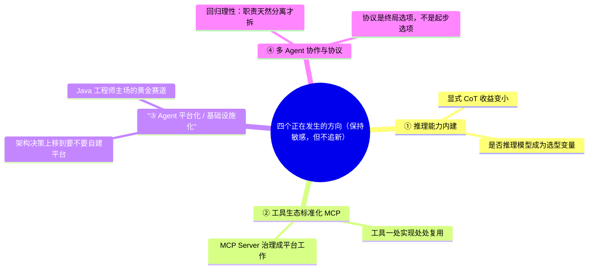

# Agent 前沿地图——架构师的眼界

> **这份文档是什么**：帮架构师**保持敏感、但不追新**。讲四个正在发生的方向，每个讲"发生了什么 → 对架构决策的影响 → 在哪验证"。它不是一份"必追清单"，而是一张"风向图"——你知道风往哪吹，但不为每个新框架动心。
>
> 前提：你已读完本专题从入门到自测的全部内容。**本文内容有"时效性"——标注为趋势的，请以官方文档 / 最新论文为准。**

---

## 0. 一句话

> **架构师不追新，但要知道风往哪吹。** 追新是工程师的焦虑，看得清风向是架构师的定力。

---

## 1. 方向一：推理能力内建，显式技巧让位

**发生了什么**：从 2025 年起，主流模型（o1 系列、DeepSeek-R1、Claude 新系列等）把"思考"内建进模型本身。你不再需要靠 "Let's think step by step" 来逼它推理。

**对架构决策的影响**：
- 显式 CoT 在推理模型上**收益变小**，提示词重心继续转向"上下文工程"。
- **"是否推理模型"成为选型决策变量**：简单任务用快模型，复杂推理才用慢的推理模型，用"模型分级"换成本（对应四目标权衡里的成本目标）。

**在哪验证**：官方模型文档、Prompt 工程深入。

---

## 2. 方向二：工具生态走向标准化（MCP）

**发生了什么**：MCP（Model Context Protocol，Anthropic 2024 年推出）把"工具"从进程内变成了**跨进程的标准协议**——一个工具服务，任何 Agent / 产品都能接。生态在快速生长（官方 Server 仓库、各框架内建支持）。

**对架构决策的影响**：
- 工具从"每个 Agent 各写一份"走向"**公司级工具资产，一处实现处处复用**"。
- 架构上的新问题：**MCP Server 的治理**（谁来维护、怎么鉴权、怎么监控）会成为平台团队的工作（对应大规模 Agent 平台的职责）。
- 但**别为了 MCP 而 MCP**：工具不出进程就还用 `@Tool`。

**在哪验证**：MCP 官方文档（modelcontextprotocol.io）、MCP 协议全解。

---

## 3. 方向三：Agent 平台化 / 基础设施化

**发生了什么**：Agent 从"一个应用"走向"**平台上的应用**"——LLM Gateway、编排引擎、可观测、评估、成本治理正在成为**平台能力**，而不是每个 Agent 自己造。

**对架构决策的影响**：
- 大团队的架构决策从"选哪个 Agent 框架"上移到"**要不要自建 Agent 平台**"（对应自研 vs 框架的边界）。
- 这是架构师进阶篇说的**"AI 工程平台"黄金赛道**——Java 工程师的主场：LLM Gateway、向量库服务、Agent 编排引擎。
- 单体"一个 Controller + 一个 ChatClient"的 Demo，会在规模下让位给"网关 + 编排 + 观测"的分层。

**在哪验证**：可观测性与成本治理、AI 原生系统设计、大规模 Agent 平台。

---

## 4. 方向四：多 Agent 协作与协议

**发生了什么**：多 Agent 从"自家框架编排"走向"**跨厂商协作协议**"——Google 2025 年提出 A2A（Agent2Agent）等协议，让不同系统的 Agent 能互相对话。同时 Anthropic 官方反复强调：**多数场景一个 Agent 就够**（[Building effective agents](https://www.anthropic.com/engineering/building-effective-agents)）。

**对架构决策的影响**：
- 多 Agent 的讨论正在**回归理性**：从"炫技"走向"只有职责天然分离才拆"。
- 架构师要做的是：**先做单 Agent，等系统真的需要跨组织协作时，再研究协议**。协议是终局选项，不是起步选项。

**在哪验证**：官方协议文档（A2A 等）、多 Agent 编排实战。

**四方向总览**：

---

## 5. 怎么保持敏感（不追新）

| 做 | 不做 |
|----|------|
| 每周 30 分钟看官方文档（Anthropic / OpenAI / 你的框架） | 追每周冒出来的新框架 |
| 论文挑着读（挑和自己方向相关的，别贪多） | 收藏一堆论文从不读 |
| 把趋势**接到自己的架构决策里**验证 | 为了"前沿"重写已跑通的系统 |
| 盯死 LangChain4j + Spring AI（你吃饭的生态） | 每出现个新库就换栈 |

> **红线**：**不要追新框架**。你的架构判断力，来自把"会用 → 会设计 → 会复盘"练扎实，而不是见过多少个新名词。

---

## 6. 理解检查

1. 四个方向分别是什么？各自对架构决策有什么影响？
2. 为什么"推理模型普及"让显式 CoT 收益变小？
3. "工具标准化（MCP）"给平台团队带来了什么新工作？
4. 多 Agent 协议（A2A 等）为什么是"终局选项"而不是"起步选项"？
5. "保持敏感"和"追新"的界线在哪？

---

## 7. 相关文档

- 提示词工程入门（推理模型 / 上下文工程）、MCP 入门、Agent 心智模型 §3.3（多 Agent）
- 深入：可观测性与成本治理、AI 原生系统设计、大规模 Agent 平台、自研 vs 框架
- 架构师进阶、心智模型与决策树

到这里，本专题从"我该不该学提示词"一路走到"架构师的眼界"，闭环完成。现在，**把文档合上，开始动手**——架构师不是读出来的。

下一篇：**15-Agent架构模式全集**——架构师的"模式字典"，用到再查。
