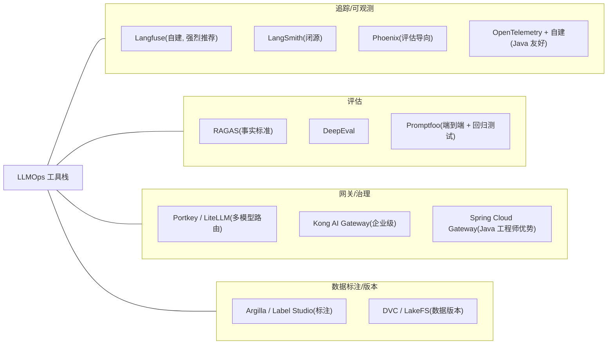
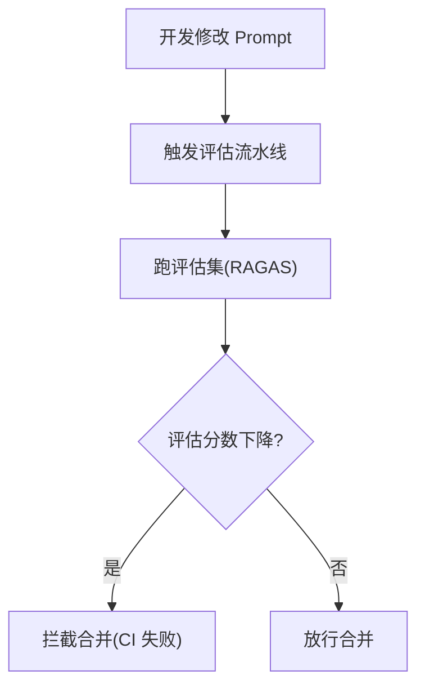
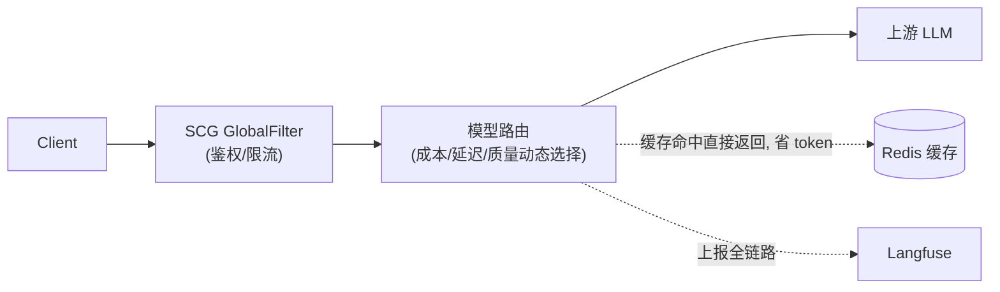

# 第四阶段 - LLMOps（将 AI 开发过程软件化）

> 痛点：一个 RAG 应用上线后，如何评估它的好坏？
> 提示词改了一个词，效果变好了还是变差了？这些都是黑盒。

---

## 1. 核心问题清单

| 问题 | 解决方向 |
|------|---------|
| 提示词改了一个词，效果变好还是变差？ | 自动化评估流水线 |
| 上线后 RAG 检索准确率怎么持续监控？ | 可观测 + 回归测试 |
| 哪个用户消耗的 token 最多？哪个 conversation 出错？ | 追踪系统 |
| 如何回滚到上个版本的 prompt？ | Prompt 版本管理 |

---

## 2. 工具栈全景

| 类别 | 工具 | 备注 |
|------|------|------|
| **追踪/可观测** | **Langfuse**（自建，开源）| 强烈推荐，类 Skywalking |
|  | LangSmith | LangChain 官方，闭源 |
|  | Phoenix (Arize) | 开源，评估导向 |
|  | OpenTelemetry + 自建 | Java 友好 |
| **评估** | **RAGAS** | RAG 评估事实标准 |
|  | DeepEval | 类似 RAGAS |
|  | Promptfoo | 端到端评估 + 回归测试 |
| **网关/治理** | **Portkey / LiteLLM** | 多模型路由 |
|  | Kong AI Gateway | 企业级 |
|  | **Spring Cloud Gateway** | **Java 工程师优势** |
| **数据标注/版本** | Argilla / Label Studio | 标注 |
|  | DVC / LakeFS | 数据版本 |

**工具栈分层全景**：四类工具共同支撑 LLMOps 闭环。



---

## 3. Langfuse 集成（Java 视角）

Langfuse 通过 **OpenTelemetry 协议**接收数据，Java 侧用 OTel SDK：

```java
// 用 Spring Boot Starter
implementation 'io.opentelemetry.instrumentation:opentelemetry-spring-boot-starter'

// 自定义 span 记录 LLM 调用
Span span = tracer.spanBuilder("llm.chat")
    .setAttribute("llm.model", "qwen2.5-7b")
    .setAttribute("llm.tokens.input", inputTokens)
    .setAttribute("llm.tokens.output", outputTokens)
    .startSpan();
// ... 调用 ...
span.end();
```

**Spring AI 已原生支持 Langfuse**（通过 OTel advisor）。

---

## 4. RAGAS 评估指标（必懂）

| 指标 | 含义 |
|------|------|
| **Faithfulness（忠实度）** | 答案是否只基于上下文，没幻觉 |
| **Answer Relevancy（答案相关性）** | 答案是否切题 |
| **Context Precision（上下文精确率）** | 检索到的内容有多少被用到 |
| **Context Recall（上下文召回率）** | 该召回的内容召回比例 |
| **Context Recall@K** | 前 K 条召回中的命中率 |

### 集成进 CI/CD

每次 prompt 变更 → 跑评估集 → 分数下降就拦截合并。

**评估流水线**：每次 Prompt 变更都触发自动化评分，分数下降即拦截合并。



---

## 5. AI Gateway（Java 工程师优势战场）

### 5.1 核心能力

- 多模型路由（成本/延迟/质量动态选择）
- 限速（per-user / per-tenant）
- 重试与降级（主模型失败切备用）
- 缓存（同 prompt 直接返回，省 token）
- 审计与合规（敏感词过滤、PII 脱敏）
- A/B 测试路由（10% 流量走新 prompt）

### 5.2 用 Spring Cloud Gateway 实现 LLM Gateway

```
Client → SCG GlobalFilter (鉴权/限流) → 模型路由 → 上游 LLM
                                    ↓
                                Redis 缓存
                                    ↓
                                Langfuse 上报
```

**整体架构**：Client 请求经 GlobalFilter 鉴权/限流后进入模型路由，Redis 缓存与 Langfuse 上报为旁路能力。



---

## 6. 推荐资料

- Langfuse 文档：`langfuse.com/docs`（极清晰）
- RAGAS 文档：`docs.ragas.io`
- 论文 *"Ragas: Automated Evaluation of Retrieval Augmented Generation"* (2023)
- Chip Huyen *"AI Engineering"* 书（2025，第 8~10 章 LLMOps 部分）
- Hugging Face *"LLM Course"* 的 Evaluation 章节

---

## 7. 实操项目：可观测性增强

把第三阶段的智能客服项目升级：

1. 接入 **Langfuse**，全链路 trace
2. 用 **RAGAS** 建立评估集，跑自动化评分
3. 在 GitLab CI 加 **Promptfoo** 回归测试
4. 用 **Spring Cloud Gateway** 加一层 LLM Gateway，支持多模型降级

---

## 8. 学习检查点

> 能讲清：
> - 为什么 LLM 应用比传统应用更需要可观测性
> - 如何设计一套自动化评估流水线
