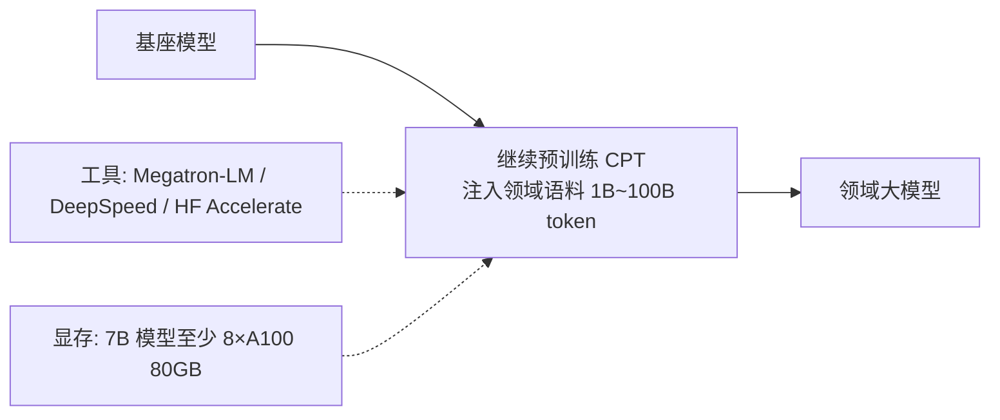
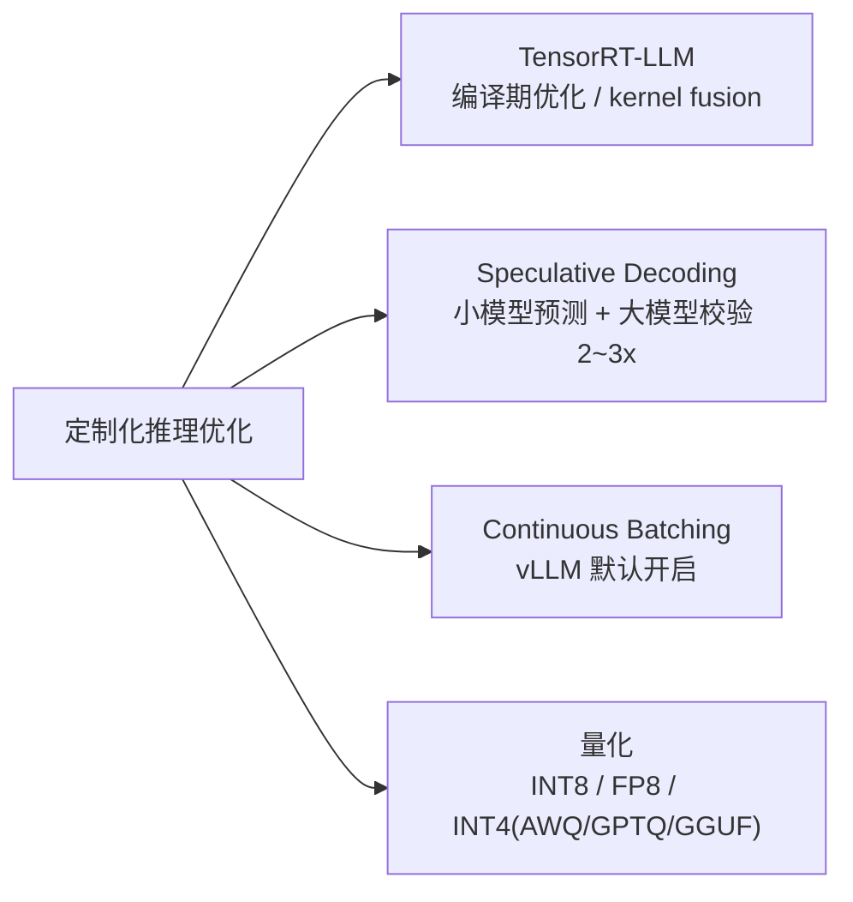
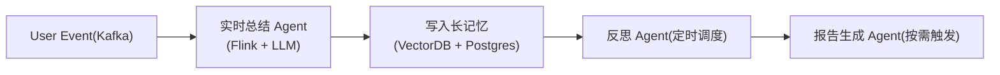
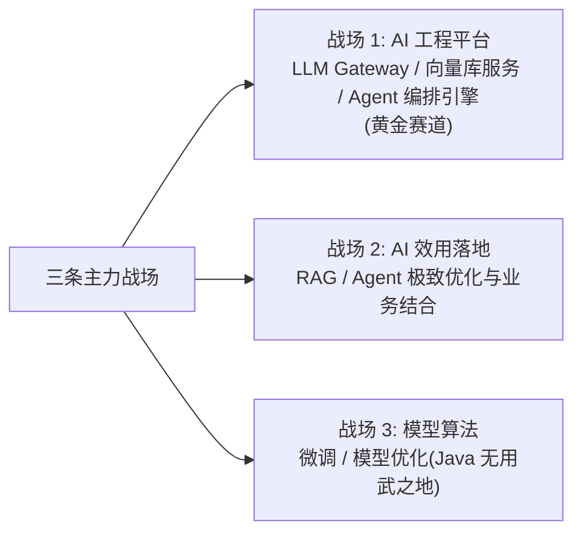

# 第五阶段 - 终极之路：架构师与指挥家

> 在这个阶段，你不只实现需求，而是定义和创造新的范式。
> 本阶段更依赖**持续探索**而非系统学习，重点给方向指引而非教程清单。

---

## 1. 领域大模型构建（Domain Pretraining）

### 1.1 路径
- 继续**预训练（CPT, Continual Pre-training）**：往基座模型注入领域语料
- 数据规模：1B~100B token
- 工具：Megatron-LM、DeepSpeed、Hugging Face Accelerate
- 显存需求：训练 7B 模型至少 8×A100 80GB

**路径**：在基座模型上继续预训练，注入领域语料得到领域大模型。



### 1.2 Java 工程师视角

你的角色是**数据工程**（清洗、去重、质量评估），而不是模型代码。
**Spark / Flink 是你的主场**。

---

## 2. 定制化推理优化

### 2.1 技术栈

| 技术 | 说明 |
|------|------|
| **TensorRT-LLM** | 编译期优化、kernel fusion |
| **Speculative Decoding** | 小模型预测、大模型校验，提升 2~3x |
| **Continuous Batching** | vLLM 默认开启 |
| **量化** | INT8 / FP8 / INT4（AWQ、GPTQ、GGUF） |
| **C++/CUDA 算子优化** | 极度专精方向 |

**技术栈**：四条优化路线各有侧重。



### 2.2 学习路径
- Karpathy *"Zero to Hero"* 系列（B 站有搬运）
- NVIDIA TensorRT-LLM 官方教程
- 论文 *"FlashAttention"* 系列

---

## 3. 实时与多模态 Agent

### 3.1 应用方向
- 流式输入（视频流、音频流）+ Agent 决策
- 工业场景：产线巡检、安防、自动驾驶

### 3.2 关键技术
- VLM 流式推理
- 低延迟 Agent
- 边缘部署

---

## 4. AI 原生架构设计（Java 工程师强项）

### 4.1 事件驱动 AI 架构

```
User Event (Kafka)
   → 实时总结 Agent (Flink + LLM)
   → 写入长记忆 (VectorDB + Postgres)
   → 反思 Agent (定时调度)
   → 报告生成 Agent (按需触发)
```

**事件驱动流水线**：用户事件经实时总结流入长记忆，反思与报告按需触发。



### 4.2 核心组件

| 组件 | 选型 |
|------|------|
| 消息总线 | Kafka / Pulsar |
| 流处理 | **Flink（Java 友好）** |
| 长记忆存储 | Postgres + pgvector / Neo4j（图记忆） |
| 工作流编排 | **Temporal（Java SDK 强大）** / Camunda |

---

## 5. 开源贡献与影响力

### 5.1 按价值排序

1. **LangChain4j / Spring AI**：你最有发言权的生态，PR 易合
2. **vLLM**：性能优化方向，C++/Python
3. **LlamaIndex**：Python，但生态广
4. **Hugging Face Transformers**：硬核方向

### 5.2 写作输出

把"Java 工程师视角的 LLM 应用架构"沉淀成博客 / 知乎专栏 / 公众号。
**这是最稀缺的视角**，比纯 Python 工程师有差异化竞争力。

---

## 6. 三条主力战场建议

### 6.1 偏"AI 工程平台"
专注于 AI 能力的中台化，用 Java 构建稳定、高效的：
- LLM Gateway
- 向量数据库服务
- Agent 编排引擎

> **这是你的黄金赛道。**

### 6.2 偏"AI 效用落地"
专注于 RAG、Agent 等应用范式的极致优化和业务结合。
用你熟练的 Java 或新学的 Python 一样能做好。

### 6.3 偏"模型算法"
如果你对数学和模型本身有浓厚兴趣，可以深耕微调和模型优化。
**但这条路上 Java 已无用武之地**，需要全身心投入 Python/C++ 生态。
**选择之前想清楚。**

**三条主力战场**：按 Java 优势程度选择主攻方向。


