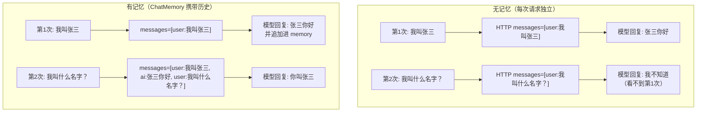
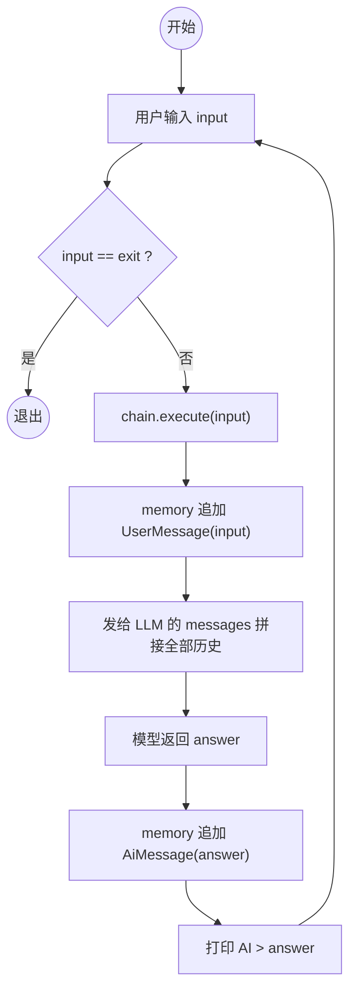
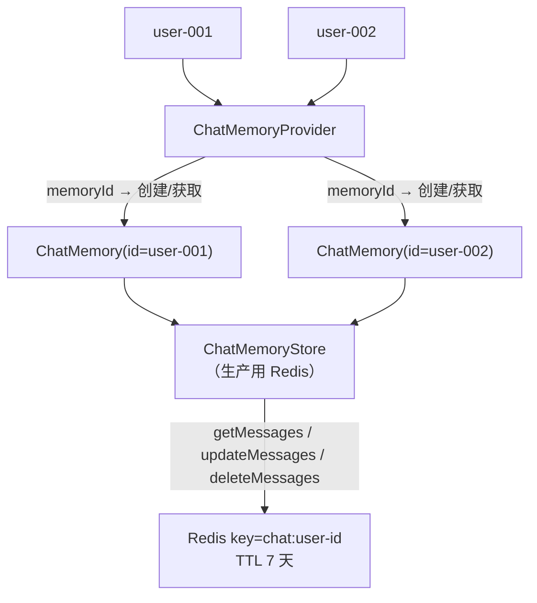

# LangChain4j 02 - ChatMemory（多轮对话）

> 目标：理解为什么 LLM 是"无状态"的，用 `ChatMemory` 实现多轮对话。
> 前提：你已经会配置模型并用 `model.chat("...")` 跑通单次 LLM 调用（如果还没跑通，先回到 01 快速起步）。

---

## 1. 为什么需要 ChatMemory

### 1.1 一个让你困惑的现象

你跑这个代码：

```java
String r1 = model.chat("我叫张三");
System.out.println(r1);
String r2 = model.chat("我叫什么名字？");
System.out.println(r2);
```

**结果**：第二个回答大概率会说"我不知道你的名字"。

### 1.2 原因

**LLM 本身是完全无状态的**。每次 `chat()` 都是一个独立的 HTTP 请求，模型不记得上一次说了什么。
（这和 HTTP 是无状态的一个道理 —— 你需要 Cookie/Session 来"携带状态"。）

### 1.3 解决方案

**每次请求时，把之前的对话历史一起带上**：

```java
// 伪代码
List<Message> history = ...;
history.add(UserMessage("我叫张三"));
history.add(AiMessage("好的，张三你好"));   // 第一次的回复
history.add(UserMessage("我叫什么名字？"));  // 第二次的问题

model.chat(history);  // 把全部历史一起发给模型
```

`ChatMemory` 就是帮你自动管理这个 `history` 列表的对象。

**无记忆 vs 有记忆**：



---

## 2. ChatMemory 的本质

### 2.1 一句话定义

> `ChatMemory` 是一个**有界消息列表**，自动拼接在每次请求里发给 LLM。

### 2.2 类比 Java

| AI 概念 | Java 类比 |
|---------|----------|
| `ChatMemory` | `Deque<Message>`（带容量上限的队列） |
| `add(Message)` | 队列入队 |
| `messages()` | 转成 List 发给 LLM |
| `clear()` | 清空会话 |

### 2.3 为什么需要"有界"

LLM 的输入 token 数有上限（context window），通常是 4K-32K token。
**全部历史塞进去 → token 超限 → 报错**。

所以需要淘汰策略（窗口、摘要等）。

---

## 3. 内置的两种 ChatMemory

### 3.1 MessageWindowChatMemory（按消息条数）

```java
import dev.langchain4j.memory.chat.MessageWindowChatMemory;

ChatMemory memory = MessageWindowChatMemory.builder()
        .maxMessages(20)       // 保留最近 20 条消息
        .id("user-001")        // 会话 ID（多用户隔离）
        .build();
```

**特点**：
- 超过 20 条时，自动淘汰最早的消息
- 简单、最常用
- **坑**：每条消息长度不一致，可能 20 条就超 token 了

### 3.2 TokenWindowChatMemory（按 token 数）

```java
import dev.langchain4j.memory.chat.TokenWindowChatMemory;

ChatMemory memory = TokenWindowChatMemory.builder()
        .maxTokens(1000, tokenizer)   // 保留最近 1000 token
        .id("user-001")
        .build();
```

**特点**：
- 精确控制 token 数
- 需要传 `Tokenizer`（不同模型用不同 tokenizer）
- **推荐生产用**

---

## 4. 实战代码：命令行多轮对话

### 4.1 完整 Main.java

```java
package org.demo01;

import dev.langchain4j.chain.ConversationalChain;
import dev.langchain4j.memory.ChatMemory;
import dev.langchain4j.memory.chat.MessageWindowChatMemory;
import dev.langchain4j.model.openai.OpenAiChatModel;

import java.util.Scanner;

public class ChatDemo {

    public static void main(String[] args) {
        var model = OpenAiChatModel.builder()
                .baseUrl("https://api.deepseek.com")
                .apiKey(System.getenv("DEEPSEEK_API_KEY"))
                .modelName("deepseek-chat")
                .temperature(0.7)
                .build();

        ChatMemory memory = MessageWindowChatMemory.withMaxMessages(10);

        // ConversationalChain 自动管理 memory
        ConversationalChain chain = ConversationalChain.builder()
                .chatModel(model)
                .chatMemory(memory)
                .build();

        System.out.println("已就绪，输入 exit 退出");
        try (var scanner = new Scanner(System.in)) {
            while (true) {
                System.out.print("你 > ");
                String input = scanner.nextLine();
                if ("exit".equalsIgnoreCase(input.trim())) break;

                String answer = chain.execute(input);
                System.out.println("AI > " + answer);
            }
        }
    }
}
```

### 4.2 关键点

- `ConversationalChain` 是 LangChain4j 提供的最简链路：自动把 memory 拼到 prompt 里。
- 每轮对话，`memory` 自动追加 `UserMessage` 和 `AiMessage`，下次请求时一并发出。
- `maxMessages(10)` 意味着只保留最近 10 条消息（5 轮对话）。

**多轮对话循环**：



---

## 5. 理解请求到底发了什么

开 `logRequests(true)` 后，你会看到 LangChain4j 实际发的请求：

```json
{
  "model": "deepseek-chat",
  "messages": [
    {"role": "user", "content": "我叫张三"},
    {"role": "assistant", "content": "好的，张三你好"},
    {"role": "user", "content": "我叫什么名字？"}
  ]
}
```

**这就是 ChatMemory 的全部秘密**：把历史消息拼到 `messages` 数组里发给模型。

---

## 6. 多用户场景：ChatMemoryStore

### 6.1 问题

如果有 100 个用户同时和你的 AI 聊天：
- 每个 `ChatMemory` 只能存一个用户的对话
- 重启服务后历史丢失

### 6.2 解决：ChatMemoryProvider + ChatMemoryStore

```java
import dev.langchain4j.memory.chat.MessageWindowChatMemory;
import dev.langchain4j.store.memory.chat.ChatMemoryStore;
import dev.langchain4j.memory.ChatMemory;

// 自定义 Store（生产用 Redis 实现）
ChatMemoryStore store = new InMemoryChatMemoryStore();

ChatMemoryProvider provider = memoryId -> MessageWindowChatMemory.builder()
        .id(memoryId)
        .maxMessages(20)
        .chatMemoryStore(store)   // 持久化到这里
        .build();

// 按用户 ID 取 memory
ChatMemory user1Memory = provider.get("user-001");
ChatMemory user2Memory = provider.get("user-002");
```

**多用户隔离 + 持久化**：



### 6.3 自定义 Redis Store（伪代码）

```java
public class RedisChatMemoryStore implements ChatMemoryStore {
    private final RedisTemplate<String, String> redis;

    @Override
    public List<ChatMessage> getMessages(Object id) {
        String json = redis.opsForValue().get("chat:" + id);
        return ChatMessageDeserializer.messagesFromJson(json);
    }

    @Override
    public void updateMessages(Object id, List<ChatMessage> messages) {
        String json = ChatMessageSerializer.messagesToJson(messages);
        redis.opsForValue().set("chat:" + id, json, Duration.ofDays(7));
    }

    @Override
    public void deleteMessages(Object id) {
        redis.delete("chat:" + id);
    }
}
```

> 阶段 5（生产化）会详细讲这个，这里先理解概念。

---

## 7. 常见错误

### 7.1 上下文越长越慢越贵

**症状**：聊了 20 轮后，每次回复越来越慢。
**原因**：每轮把全部历史发给模型 → token 数线性增长 → 推理耗时和成本线性增长。
**解决**：合理设 `maxMessages`（10-20）或 `maxTokens`（2000-4000）。

### 7.2 模型"失忆"

**症状**：聊到一半突然忘了前面说过的话。
**原因**：窗口太小，关键信息被淘汰了。
**解决**：
1. 增大窗口
2. 在 SystemMessage 里固定关键信息（用户身份等）
3. 进阶：用"摘要式记忆"（LangChain4j 暂未内置，自己实现）

### 7.3 跨用户对话混乱

**症状**：A 用户聊的内容串到 B 用户。
**原因**：用了全局共享的 `ChatMemory`。
**解决**：每个请求用 `memoryId`（如用户 ID）隔离。

---

## 8. SystemMessage 的作用

```java
ChatMemory memory = MessageWindowChatMemory.withMaxMessages(10);
memory.add(SystemMessage.from("你是一个热情的导游，回答简洁。"));
memory.add(UserMessage.from("北京有什么好玩的？"));
```

**特点**：
- `SystemMessage` 永远排在 messages 数组第一位
- 用于定义 AI 的角色、风格、约束
- **重要**：不会被 `MessageWindowChatMemory` 淘汰（它是特殊保留的）

---

## 9. 理解检查

1. 为什么 LLM 自己没有记忆？底层 HTTP 请求是怎么样的？
2. `MessageWindowChatMemory` 和 `TokenWindowChatMemory` 该选哪个？为什么？
3. 多用户场景下，怎么避免对话混乱？
4. 为什么 `SystemMessage` 不会被淘汰？

---

## 10. 练习任务

1. 把第 4 节的代码跑通，多轮对话正常工作
2. 试一下把 `maxMessages` 改成 2，观察模型什么时候"失忆"
3. 加一个 `SystemMessage`，定义 AI 是"海盗风格的助手"
4. （进阶）实现一个简单的"重置对话"命令：输入 `/reset` 时清空 memory

完成后进入下一节：**03-Tool 调用**——让 LLM 自己决定调用你的 Java 方法。
