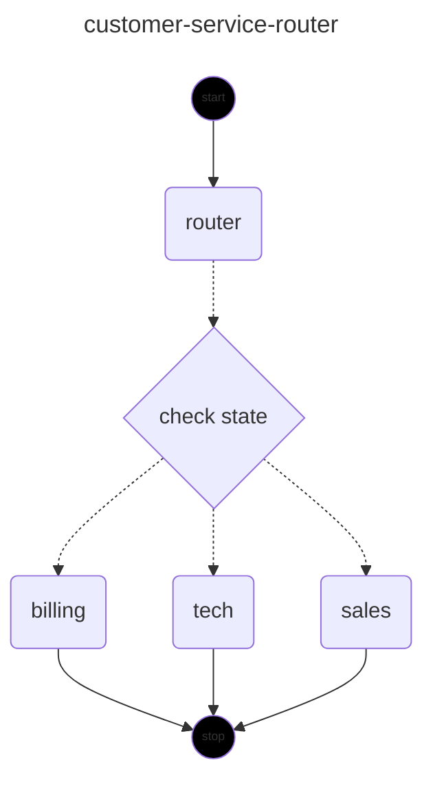

# L2 多 Agent 编排实战（Spring AI 2.0）

> 本文回答：**什么时候需要多 Agent？怎么编排？单 Agent 什么时候会撞墙？**
>
> Spring AI 2.0 本身不带多 Agent 框架，但生态里 `Spring AI Alibaba Graph` 是首选编排工具。
>
> 本文所有代码均基于 **`spring-ai-alibaba-graph-core:2.0.0-M1.1`**（截至 2026-07，唯一匹配 Spring AI 2.0 版本线的稳定版），所有 API 都已经过 `javap` 核验。
>
> 前置：[`./02-Tool与AgentLoop.md`](./02-Tool与AgentLoop.md) + [`./05-MCP协议全解.md`](./05-MCP协议全解.md)
> 预计：1.5 天

---

## 0. 认知地图

```
单 Agent（一个 ChatClient + N 个 Tool）
    ↓
能力边界：工具数量爆炸（10+）→ 决策变差；prompt 太长；上下文炸
    ↓
多 Agent（按职责拆分，互相协作）
    ├── 路由模式（Router）
    ├── 管道模式（Pipeline）
    ├── 协作模式（Collaborator）
    └── 监督模式（Supervisor）
```

---

## 1. 什么时候需要多 Agent

### 1.1 单 Agent 的天花板

一个 Agent 的能力受限于：

1. **Prompt 容量**：工具描述 + system prompt + memory 加起来不能超模型 context。
2. **决策质量**：Anthropic 实测，工具数 > 10 时 LLM 选错工具的概率显著上升。
3. **专业深度**：一个 prompt 想兼顾"客服话术"+"代码生成"+"数据分析"，每个都不精。
4. **可观测性**：所有逻辑挤一个 prompt，出错难定位。

### 1.2 多 Agent 的代价

- **复杂度上升**：状态管理、错误处理、超时控制都要自己写。
- **延迟翻倍**：Agent 间通信每次都是一次 LLM 调用。
- **Token 翻倍**：每个 Agent 都要重新喂 context。
- **调试困难**：流程非线性的，复现问题难。

**结论**：**优先单 Agent + Tool**，撞墙了再上多 Agent。

### 1.3 该上多 Agent 的信号

| 信号 | 说明 |
|------|------|
| 工具超过 15 个 | 工具 schema 已经塞爆 prompt，决策变差 |
| 业务流程明确分阶段 | 例如"采集 → 分析 → 报告"，每个阶段用不同 prompt |
| 多角色协作 | 客服 / 工程师 / 经理各有专长 |
| 需要并行 | 同时调多个 LLM 拿不同视角的答案 |
| 子任务可重用 | 同一个"摘要 Agent"被多个流程用 |

---

## 2. 四种主流编排模式

### 2.1 Router（路由）

```
用户请求 → [Router Agent] ──┬─→ [客服 Agent]
                            ├─→ [技术 Agent]
                            └─→ [销售 Agent]
```

Router 用 LLM 判断该走哪条路。

**适用**：业务领域边界清晰。

**陷阱**：Router 判断错就全错。Router 用便宜模型 + few-shot 强化。

### 2.2 Pipeline（管道）

```
[Agent A: 采集] → [Agent B: 分析] → [Agent C: 报告]
```

串行流水线，每个 Agent 输出是下一个的输入。

**适用**：阶段明确（如 ETL、报告生成）。

**陷阱**：上游错下游全错。每一步要有 schema 校验。

### 2.3 Collaborator（协作）

```
[Planner] ←→ [Coder] ←→ [Reviewer]
```

多 Agent 循环协作，互相评审。

**适用**：高质量要求场景（如代码生成 + code review）。

**陷阱**：可能死循环。设最大轮数 + 终止条件。

### 2.4 Supervisor（监督）

```
[Supervisor] ──┬─→ [Worker 1]
              ├─→ [Worker 2]
              ├─→ [Worker 3]
              └─→ (汇总)
```

Supervisor 是大脑，动态分配任务给 Worker，收集结果再决策下一步。

**适用**：复杂任务（如多源数据采集 + 综合）。

**陷阱**：Supervisor 自己也是 LLM，可能做出离谱决策。

---

## 3. Spring AI Alibaba Graph：编排框架

Spring AI 2.0 自身不带多 Agent 编排，但同生态的 **Spring AI Alibaba Graph** 是 Java 生态最成熟的选择。

> **版本匹配警告（重要）**：
> - `graph-core:1.0.0.x` 和 `1.1.x` 都依赖 Spring AI **1.0**，**不能**用在 Spring AI 2.0 项目里（包冲突会直接编译不过或运行时 `NoSuchMethodError`）。
> - `graph-core:2.0.0-M1.1` 是唯一在 Spring AI **2.0** 版本线上的版本，依赖 `spring-ai-*:2.0.0-M1`。
> - 你项目用的是 `spring-ai:2.0.0` GA。Maven 通过 `dependencyManagement`（pom.xml 顶部已经 import `spring-ai-bom:2.0.0`）会强制覆盖 graph-core 传递进来的 `2.0.0-M1`，让所有 spring-ai 模块统一到 `2.0.0`。同版本线内通常二进制兼容，**但首次跑请观察启动日志有没有 `NoSuchMethodError`**。
> - 另外：`com.alibaba.cloud.ai:spring-ai-alibaba-graph`（没有 `-core` 后缀）是 `<packaging>pom</packaging>` 的**聚合父 POM，仓库里只有 .pom 文件没有 .jar**，直接依赖会报 `jar was not found`。**必须依赖带代码的子模块 `spring-ai-alibaba-graph-core`**。

### 3.1 核心概念

| 概念 | 类比 | 含义 |
|------|------|------|
| **OverAllState** | 流程的"共享内存" | 一个 `Map<String, Object>`，每个节点读写其中的 key |
| **KeyStrategy** | 字段合并策略 | 同一个 key 被多次写入时怎么处理：REPLACE / APPEND / MERGE |
| **Node（节点）** | 一个 Agent | 一个 `NodeAction`，接收 state 返回 `Map<String, Object>` 增量 |
| **Edge（边）** | 状态机迁移 | 固定边（`addEdge`）或条件边（`addConditionalEdges`） |
| **StateGraph** | 图定义 | 节点 + 边构成的有向图（**编译前**） |
| **CompiledGraph** | 可执行的图 | `stateGraph.compile()` 产物，调用 `invoke` / `stream` |

### 3.2 依赖

```xml
<!-- pom.xml 已有的 spring-ai-bom 会接管所有 spring-ai-* 的版本统一 -->
<dependencyManagement>
    <dependencies>
        <dependency>
            <groupId>org.springframework.ai</groupId>
            <artifactId>spring-ai-bom</artifactId>
            <version>2.0.0</version>
            <type>pom</type>
            <scope>import</scope>
        </dependency>
    </dependencies>
</dependencyManagement>

<dependencies>
    <!-- 多 Agent 编排：注意是 -core 后缀 -->
    <dependency>
        <groupId>com.alibaba.cloud.ai</groupId>
        <artifactId>spring-ai-alibaba-graph-core</artifactId>
        <version>2.0.0-M1.1</version>
    </dependency>

    <!-- 必须显式声明！graph-core 的 SpringAIJacksonStateSerializer 在 <clinit>
         里硬依赖 spring-ai-deepseek 的 DeepSeekAssistantMessage 类。
         Spring Boot 4.1 BOM 默认会从 graph-core 排除 deepseek + zhipuai
         （视为 optional），不显式加回来，StateGraph 第一次加载就抛
         NoClassDefFoundError，整个应用启动失败。 -->
    <dependency>
        <groupId>org.springframework.ai</groupId>
        <artifactId>spring-ai-deepseek</artifactId>
    </dependency>

    <!-- ...其他依赖 -->
</dependencies>
```

**踩坑提示（每一条都是实际跑过踩出来的）**：

1. **必须显式加 `spring-ai-deepseek`**：见上面注释。这是 Spring Boot 4.1 + graph-core 2.0.0-M1.1 组合下的硬要求。验证方式：跑一次 `mvn dependency:tree -Dverbose | grep deepseek`，看到 `2.0.0` 就对了。

2. **不要 exclusion `spring-ai-deepseek` 或 `spring-ai-zhipuai`**：网上很多教程会让你排除掉"用不到的方言"，但在 graph-core 这里一排除就运行时 `NoClassDefFoundError`。

3. **如果之前已经尝试过 `1.0.0.3` 或 `1.0.0`**，本地 Maven 仓库里会留下 `*.lastUpdated` 失败标记。Maven 默认按更新间隔跳过实际请求，导致 `mvn -U` 也救不回来。**清掉对应版本目录**：
   ```bash
   # 你 settings.xml 里 localRepository=/Volumes/data/software/maven/repository
   rm -rf /Volumes/data/software/maven/repository/com/alibaba/cloud/ai/spring-ai-alibaba-graph-core/1.0.0.3
   rm -rf /Volumes/data/software/maven/repository/com/alibaba/cloud/ai/spring-ai-alibaba-graph/1.0.0.3
   mvn clean compile -U
   ```

4. **验证版本统一**：
   ```bash
   mvn dependency:tree -Dincludes=org.springframework.ai
   ```
   所有 `spring-ai-*` 都应该是 `2.0.0`。如果有 `2.0.0-M1` 残留，确认 `dependencyManagement` 里的 BOM import 顺序没被覆盖。

### 3.3 最小例子：Router 模式

**目标流程图**：

```
                    START
                      │
                      ▼
              ┌───────────────┐
              │ router (LLM)  │   ← 判断 user_query 属于哪个域，写入 state["route"]
              └───────────────┘
                      │
              (条件边：读 state["route"])
                      │
        ┌─────────────┼─────────────┐
        ▼             ▼             ▼
   ┌────────┐   ┌────────┐    ┌────────┐
   │billing │   │  tech  │    │ sales  │
   └────────┘   └────────┘    └────────┘
        │             │             │
        └─────────────┼─────────────┘
                      ▼
                     END
```

**完整代码**：

```java
// org.demo02.agent.graph.RouterGraphConfig
package org.demo02.agent.graph;

import com.alibaba.cloud.ai.graph.CompiledGraph;
import com.alibaba.cloud.ai.graph.KeyStrategy;
import com.alibaba.cloud.ai.graph.KeyStrategyFactory;
import com.alibaba.cloud.ai.graph.StateGraph;
import com.alibaba.cloud.ai.graph.action.AsyncEdgeAction;
import com.alibaba.cloud.ai.graph.action.AsyncNodeAction;
import com.alibaba.cloud.ai.graph.action.EdgeAction;
import org.springframework.ai.chat.client.ChatClient;
import org.springframework.context.annotation.Bean;
import org.springframework.context.annotation.Configuration;

import java.util.Map;

import static com.alibaba.cloud.ai.graph.StateGraph.END;
import static com.alibaba.cloud.ai.graph.StateGraph.START;

@Configuration
public class RouterGraphConfig {

    @Bean
    public CompiledGraph routerGraph(ChatClient chatClient) throws Exception {
        // 1. 定义 State：声明会被节点读写的 key，每个 key 绑定一个合并策略
        //    - REPLACE：后写覆盖前写（默认）
        //    - APPEND：累加成 List（适合消息历史）
        //    - MERGE：按 Map 合并
        KeyStrategyFactory stateFactory = KeyStrategy.builder()
                .addStrategy("user_query", KeyStrategy.REPLACE)
                .addStrategy("route", KeyStrategy.REPLACE)
                .addStrategy("answer", KeyStrategy.REPLACE)
                .build();

        // 2. 定义节点：路由判断（用 LLM 输出一个词）
        AsyncNodeAction routerNode = AsyncNodeAction.node_async(state -> {
            String query = state.value("user_query").orElse("").toString();
            String route = chatClient.prompt()
                    .system("""
                        判断用户问题属于哪个域。只输出一个词：
                        - billing（账单/支付/退款）
                        - tech（技术故障）
                        - sales（产品咨询/购买）
                        """)
                    .user(query)
                    .call()
                    .content()
                    .trim()
                    .toLowerCase();
            return Map.of("route", route);  // 这个 Map 会按 KeyStrategy 合并进 state
        });

        // 3. 定义三个 Worker 节点
        AsyncNodeAction billingNode = AsyncNodeAction.node_async(state -> {
            String answer = chatClient.prompt()
                    .system("你是客服，处理账单问题。")
                    .user(state.value("user_query").orElse("").toString())
                    .call()
                    .content();
            return Map.of("answer", answer);
        });

        AsyncNodeAction techNode = AsyncNodeAction.node_async(state -> {
            String answer = chatClient.prompt()
                    .system("你是技术支持，处理故障问题。")
                    .user(state.value("user_query").orElse("").toString())
                    .call()
                    .content();
            return Map.of("answer", answer);
        });

        AsyncNodeAction salesNode = AsyncNodeAction.node_async(state -> {
            String answer = chatClient.prompt()
                    .system("你是销售顾问，介绍产品。")
                    .user(state.value("user_query").orElse("").toString())
                    .call()
                    .content();
            return Map.of("answer", answer);
        });

        // 4. 条件边：根据 state["route"] 决定下一节点
        //    第二个参数返回的字符串必须是第三个参数 Map 的 key（或 END）
        //    注意：addConditionalEdges 只接受 AsyncEdgeAction，
        //    同步 EdgeAction 必须用 AsyncEdgeAction.edge_async(...) 包装
        EdgeAction guard = state -> {
            String route = state.value("route").orElse("tech").toString();
            return switch (route) {
                case "billing" -> "billing";
                case "sales" -> "sales";
                default -> "tech";
            };
        };

        // 5. 组装图
        StateGraph graph = new StateGraph("customer-service-router", stateFactory);
        graph.addNode("router", routerNode);
        graph.addNode("billing", billingNode);
        graph.addNode("tech", techNode);
        graph.addNode("sales", salesNode);

        graph.addEdge(START, "router");
        graph.addConditionalEdges("router", AsyncEdgeAction.edge_async(guard), Map.of(
                "billing", "billing",
                "tech", "tech",
                "sales", "sales"
        ));
        graph.addEdge("billing", END);
        graph.addEdge("tech", END);
        graph.addEdge("sales", END);

        // 6. 编译成可执行图
        return graph.compile();
    }
}
```

**代码要点逐行说明**：

- `KeyStrategy.builder()...build()` 返回 `KeyStrategyFactory`，是 State 的"schema"。每个节点只能修改这里声明过的 key（未声明的会被忽略）。
- `AsyncNodeAction.node_async(state -> {...})` 把一个同步 lambda 包装成异步 NodeAction。lambda 的返回值 `Map<String, Object>` 是 **state 增量**，会按 KeyStrategy 合并进 State。
- `state.value("key")` 返回 `Optional<T>`，用 `.orElse(default)` 取值。
- `addConditionalEdges(fromNode, AsyncEdgeAction.edge_async(edgeAction), targetMap)`：`edgeAction` 返回一个字符串，`targetMap` 把这个字符串映射到目标节点名。**注意**：`addConditionalEdges` 的第二个参数只接受 `AsyncEdgeAction`（异步），同步的 `EdgeAction` 必须用 `AsyncEdgeAction.edge_async(...)` 包装一层，否则编译不过。
- `compile()` 返回 `CompiledGraph`，是真正能调用的对象。`StateGraph` 本身只能"定义"，不能"运行"。

### 3.4 调用图

```java
// org.demo02.agent.controller.AgentController
package org.demo02.agent.controller;

import com.alibaba.cloud.ai.graph.CompiledGraph;
import com.alibaba.cloud.ai.graph.OverAllState;
import org.springframework.web.bind.annotation.*;

import java.util.Map;

@RestController
@RequestMapping("/demo02/agent")
public class AgentController {

    private final CompiledGraph routerGraph;

    public AgentController(CompiledGraph routerGraph) {
        this.routerGraph = routerGraph;
    }

    @GetMapping("/route")
    public String route(@RequestParam String q) throws Exception {
        // invoke 接收初始 state，返回 Optional<OverAllState>
        OverAllState result = routerGraph
                .invoke(Map.of("user_query", q))
                .orElseThrow(() -> new IllegalStateException("graph returned empty state"));
        return (String) result.value("answer").orElse("(no answer)");
    }
}
```

测试：

```bash
curl "http://127.0.0.1:8080/demo02/agent/route?q=我上个月的账单怎么多了10块"
# → 走 billing 节点

curl "http://127.0.0.1:8080/demo02/agent/route?q=登录一直闪退怎么办"
# → 走 tech 节点
```

### 3.5 看看图长什么样





```java
// 任意位置注入 CompiledGraph，输出 Mermaid 文本
String mermaid = routerGraph.getGraph(
        com.alibaba.cloud.ai.graph.GraphRepresentation.Type.MERMAID
).content();
System.out.println(mermaid);
```

把输出贴到 [Mermaid Live Editor](https://mermaid.live/) 渲染，或者直接放进 Markdown 里 ```mermaid 代码块。

---

## 4. 实战场景：技术报告生成 Pipeline

### 4.1 场景描述

输入：一个技术主题（如 "Spring AI 2.0 的 Advisor 链"）。

输出：一份结构化报告（含大纲、各章节、参考文献）。

**目标流程图**：

```
              START
                │
                ▼
        ┌───────────────┐
        │   outliner    │  生成章节大纲 JSON
        └───────────────┘
                │
                ▼
        ┌───────────────┐
   ┌───▶│    writer     │  写第 current_chapter 章
   │    └───────────────┘
   │            │
   │   (条件边：done?)
   │            │
   │     ┌──────┴──────┐
   │     ▼             ▼
   │  未完成          完成
   │     │             │
   └─────┘             ▼
                ┌───────────────┐
                │   reviewer    │  审稿，pass=true/false
                └───────────────┘
                        │
                (条件边：pass?)
                        │
                ┌───────┴───────┐
                ▼               ▼
              不通过          通过
                │               │
                ▼               ▼
        (回到 writer)   ┌───────────────┐
                        │   formatter   │  Markdown 输出
                        └───────────────┘
                                │
                                ▼
                              END
```

### 4.2 完整代码

```java
// org.demo02.agent.graph.ReportPipelineGraph
package org.demo02.agent.graph;

import com.alibaba.cloud.ai.graph.CompiledGraph;
import com.alibaba.cloud.ai.graph.KeyStrategy;
import com.alibaba.cloud.ai.graph.KeyStrategyFactory;
import com.alibaba.cloud.ai.graph.StateGraph;
import com.alibaba.cloud.ai.graph.action.AsyncEdgeAction;
import com.alibaba.cloud.ai.graph.action.AsyncNodeAction;
import com.alibaba.cloud.ai.graph.action.EdgeAction;
import org.springframework.ai.chat.client.ChatClient;
import org.springframework.context.annotation.Bean;
import org.springframework.context.annotation.Configuration;

import java.util.Map;

import static com.alibaba.cloud.ai.graph.StateGraph.END;
import static com.alibaba.cloud.ai.graph.StateGraph.START;

@Configuration
public class ReportPipelineGraph {

    private final ChatClient chatClient;

    public ReportPipelineGraph(ChatClient chatClient) {
        this.chatClient = chatClient;
    }

    @Bean
    public CompiledGraph reportGraph() throws Exception {

        // State：分清哪些 key 是"输入"、哪些是"中间结果"、哪些是"输出"
        KeyStrategyFactory stateFactory = KeyStrategy.builder()
                // 输入
                .addStrategy("topic", KeyStrategy.REPLACE)
                // 中间结果
                .addStrategy("outline", KeyStrategy.REPLACE)
                .addStrategy("current_chapter", KeyStrategy.REPLACE)
                .addStrategy("chapter_contents", KeyStrategy.APPEND)   // 用 APPEND 累积每章
                .addStrategy("review_pass", KeyStrategy.REPLACE)
                .addStrategy("iteration", KeyStrategy.REPLACE)         // reviewer 失败次数
                // 输出
                .addStrategy("final_report", KeyStrategy.REPLACE)
                .build();

        // 节点 1：outliner — 生成大纲
        AsyncNodeAction outliner = AsyncNodeAction.node_async(state -> {
            String topic = state.value("topic").orElse("").toString();
            String outline = chatClient.prompt()
                    .system("""
                        你是技术大纲设计专家。把主题拆成 3-5 个章节，
                        输出 JSON 数组，每个元素形如 {"chapter": "标题", "key_points": ["..."]}
                        只输出 JSON，不要前后缀。
                        """)
                    .user(topic)
                    .call()
                    .content();
            return Map.of("outline", outline, "current_chapter", 0, "iteration", 0);
        });

        // 节点 2：writer — 写当前章节
        AsyncNodeAction writer = AsyncNodeAction.node_async(state -> {
            String topic = state.value("topic").orElse("").toString();
            String outline = state.value("outline").orElse("[]").toString();
            int currentChapter = (int) state.value("current_chapter").orElse(0);
            int totalChapters = countChapters(outline);  // 解析 outline JSON，省略实现

            if (currentChapter >= totalChapters) {
                return Map.of("all_chapters_done", true);
            }
            String content = chatClient.prompt()
                    .system("""
                        你是技术作者，写一章节内容。
                        要求：800-1500 字，有代码示例，结构清晰。
                        """)
                    .user("主题：%s\n章节序号：%d\n大纲：%s".formatted(topic, currentChapter + 1, outline))
                    .call()
                    .content();
            return Map.of(
                    "current_chapter", currentChapter + 1,
                    "chapter_contents", content,   // APPEND 策略会自动追加到列表
                    "all_chapters_done", false
            );
        });

        // 节点 3：reviewer — 审稿
        AsyncNodeAction reviewer = AsyncNodeAction.node_async(state -> {
            String contents = String.join("\n---\n", state.value("chapter_contents").orElseThrow().toString());
            int iteration = (int) state.value("iteration").orElse(0);
            String review = chatClient.prompt()
                    .system("""
                        你是技术审稿人。检查报告：技术准确性、章节连贯性、代码示例正确性。
                        输出 JSON：{"pass": true/false}
                        只输出 JSON。
                        """)
                    .user(contents)
                    .call()
                    .content();
            boolean pass = review.contains("\"pass\": true");
            return Map.of(
                    "review_pass", pass,
                    "iteration", iteration + 1
            );
        });

        // 节点 4：formatter — Markdown 输出
        AsyncNodeAction formatter = AsyncNodeAction.node_async(state -> {
            String contents = String.join("\n---\n", state.value("chapter_contents").orElseThrow().toString());
            String formatted = chatClient.prompt()
                    .system("把内容整理为 Markdown，添加目录、标题层级、代码块标记")
                    .user(contents)
                    .call()
                    .content();
            return Map.of("final_report", formatted);
        });

        // 条件边 1：writer 之后，看是否所有章节写完
        EdgeAction afterWriter = state -> {
            boolean done = (boolean) state.value("all_chapters_done").orElse(false);
            return done ? "reviewer" : "writer";
        };

        // 条件边 2：reviewer 之后，看是否通过；连续失败 3 次也强制通过
        EdgeAction afterReview = state -> {
            boolean pass = (boolean) state.value("review_pass").orElse(false);
            int iteration = (int) state.value("iteration").orElse(0);
            if (pass || iteration >= 3) {
                return "formatter";
            }
            // 回 writer 重写：重置 current_chapter + 清空 chapter_contents
            return "writer_reset";
        };

        // 兜底节点：reset 状态后回到 writer
        AsyncNodeAction writerReset = AsyncNodeAction.node_async(state -> {
            // 这里需要清空 chapter_contents（APPEND 不能直接清，要靠 MARK_FOR_REMOVAL）
            return Map.of(
                    "current_chapter", 0,
                    "chapter_contents", com.alibaba.cloud.ai.graph.OverAllState.MARK_FOR_REMOVAL
            );
        });

        // 组装图
        StateGraph graph = new StateGraph("report-pipeline", stateFactory);
        graph.addNode("outliner", outliner);
        graph.addNode("writer", writer);
        graph.addNode("writer_reset", writerReset);
        graph.addNode("reviewer", reviewer);
        graph.addNode("formatter", formatter);

        graph.addEdge(START, "outliner");
        graph.addEdge("outliner", "writer");
        graph.addConditionalEdges("writer", AsyncEdgeAction.edge_async(afterWriter), Map.of(
                "writer", "writer",
                "reviewer", "reviewer"
        ));
        graph.addEdge("writer_reset", "writer");
        graph.addConditionalEdges("reviewer", AsyncEdgeAction.edge_async(afterReview), Map.of(
                "formatter", "formatter",
                "writer_reset", "writer_reset"
        ));
        graph.addEdge("formatter", END);

        // 设置最大迭代次数，防止意外死循环
        CompiledGraph compiled = graph.compile();
        compiled.setMaxIterations(20);
        return compiled;
    }

    private int countChapters(String outlineJson) {
        // 省略：解析 outline JSON，返回章节数
        return 3;
    }
}
```

### 4.3 调用

```java
@Autowired CompiledGraph reportGraph;

public String generateReport(String topic) throws Exception {
    OverAllState result = reportGraph
            .invoke(Map.of("topic", topic))
            .orElseThrow();
    return (String) result.value("final_report").orElse("(empty)");
}
```

---

## 5. 状态机思维：把 Agent 流程当状态机设计

### 5.1 设计步骤

```
1. 列出所有节点（Agent）和它们的输入/输出 schema
2. 列出所有可能的转移条件
3. 画状态转移图（用纸/白板，不要省）
4. 每个节点设定幂等性（重试不会出问题）
5. 设全局超时 + 最大轮数（用 compiled.setMaxIterations(n)）
6. 设计 State 结构（用 KeyStrategy 声明每个 key 的合并策略）
```

### 5.2 State 设计原则

Graph 框架的 State 本质就是一个 `Map<String, Object>`，"设计"主要体现在两件事：

**（1）每个 key 选对合并策略**：

| 策略 | 行为 | 适合 |
|------|------|------|
| `REPLACE` | 后写覆盖前写 | 默认值，单值字段（query、answer、status） |
| `APPEND` | 把新值追加进 List | 消息历史、累积的章节内容、trace |
| `MERGE` | 当 value 是 Map 时按 key 合并 | 多节点向同一个聚合字段写不同子键 |

```java
KeyStrategy.builder()
        .addStrategy("user_query", KeyStrategy.REPLACE)        // 单值
        .addStrategy("messages", KeyStrategy.APPEND)           // 累积
        .addStrategy("metrics", KeyStrategy.MERGE)             // 多节点写不同 metric
        .build();
```

**（2）字段命名分组**（避免冲突）：

```java
// ❌ 反模式：两个节点都写 "result"，互相覆盖
.addStrategy("result", KeyStrategy.REPLACE)

// ✅ 正模式：加节点前缀
.addStrategy("router_result", KeyStrategy.REPLACE)
.addStrategy("writer_result", KeyStrategy.REPLACE)
.addStrategy("reviewer_result", KeyStrategy.REPLACE)
```

**（3）必要时分输入/中间/输出区**（用 key 前缀，不需要嵌套结构）：

```java
// 输入（只读，只 START 时初始化）
.addStrategy("input_topic", KeyStrategy.REPLACE)
.addStrategy("input_user_id", KeyStrategy.REPLACE)
// 中间结果
.addStrategy("inter_outline", KeyStrategy.REPLACE)
.addStrategy("inter_chapter_count", KeyStrategy.REPLACE)
// 输出
.addStrategy("output_final_report", KeyStrategy.REPLACE)
// 元数据
.addStrategy("meta_start_time", KeyStrategy.REPLACE)
.addStrategy("meta_node_trace", KeyStrategy.APPEND)
```

### 5.3 错误处理

Graph 没有"throw 异常自动跳错误节点"的能力。条件边只能根据 state 决定下一节点，所以错误处理的写法是：

```java
AsyncNodeAction safeNode = AsyncNodeAction.node_async(state -> {
    try {
        String result = chatClient.prompt()...call().content();
        return Map.of("answer", result, "node_status", "success");
    } catch (Exception e) {
        log.error("Node failed", e);
        // 把错误信息写入 state，让条件边据此决定去兜底节点
        return Map.of(
                "node_status", "error",
                "error_message", e.getMessage()
        );
    }
});

// 条件边根据 node_status 路由
EdgeAction afterSafeNode = state -> {
    String status = state.value("node_status").orElse("success").toString();
    return "error".equals(status) ? "error_handler" : "next_node";
};
```

---

## 6. 从单 Agent 升级到多 Agent 的路径

### 6.1 渐进式升级

```
阶段 1：单 Agent + 5 个 Tool
        ↓ 工具数膨胀到 15
阶段 2：单 Agent + ToolSearchToolCallingAdvisor（自动检索相关工具）
        ↓ 还是不够，业务领域分明
阶段 3：Router 模式，3 个领域 Agent
        ↓ 流程变复杂，需要多步
阶段 4：Pipeline 模式
        ↓ 需要反馈循环
阶段 5：Collaborator / Supervisor 模式
```

### 6.2 不要一上来就上多 Agent

新手最容易踩的坑：**第一次学多 Agent 就把所有逻辑拆成 5 个 Agent**。结果：

- 每个 Agent 之间的 context 传递混乱。
- 一次请求 10+ 次 LLM 调用，延迟 30s+。
- 一个 Agent 出错整个流程崩。

**建议**：先用单 Agent 跑通业务，遇到具体痛点（如某个工具集和另一个完全无关）再拆。

---

## 7. 调试与可观测

### 7.1 用 GraphLifecycleListener 记录 trace

`CompileConfig.Builder` 支持注入 `GraphLifecycleListener`，每个节点前后会回调：

```java
import com.alibaba.cloud.ai.graph.CompileConfig;
import com.alibaba.cloud.ai.graph.GraphLifecycleListener;

GraphLifecycleListener listener = new GraphLifecycleListener() {
    @Override
    public void onNodeStart(String nodeName, Map<String, Object> state) {
        log.info("[{}] node start, state keys={}", nodeName, state.keySet());
    }
    @Override
    public void onNodeEnd(String nodeName, Map<String, Object> result) {
        log.info("[{}] node end, result keys={}", nodeName, result.keySet());
    }
};

CompiledGraph compiled = graph.compile(
        CompileConfig.builder().withLifecycleListener(listener).build()
);
```

也可以集成 Spring AI 的 `ObservationRegistry`：

```java
CompileConfig.builder()
        .observationRegistry(observationRegistry)
        .build();
```

接 Micrometer / Zipkin / Langfuse 看完整 trace。

### 7.2 可视化 Graph

`GraphRepresentation.Type.MERMAID` 输出 Mermaid 流程图语法：

```java
String mermaid = compiledGraph
        .getGraph(GraphRepresentation.Type.MERMAID)
        .content();
System.out.println(mermaid);
```

或者用 `GraphRepresentation.Type.PLANTUML` 输出 PlantUML 语法。把输出贴到 [Mermaid Live Editor](https://mermaid.live/) 或 PlantUML 渲染器，能直观看到整个图。

### 7.3 Checkpoint 状态回放

每个 `RunnableConfig`（包含一个 `thread_id`）跑过的所有 state 快照都会被 `BaseCheckpointSaver` 持久化。出问题时能精确回放哪一步出错：

```java
import com.alibaba.cloud.ai.graph.checkpoint.config.SaverConfig;
import com.alibaba.cloud.ai.graph.checkpoint.savers.MemorySaver;

CompileConfig config = CompileConfig.builder()
        .saverConfig(SaverConfig.builder().register(new MemorySaver()).build())
        .build();
CompiledGraph compiled = graph.compile(config);

// 查某次执行的 state 历史
RunnableConfig rc = RunnableConfig.builder().threadId("session-123").build();
Collection<StateSnapshot> history = compiled.getStateHistory(rc);
```

可用的 Saver：`MemorySaver`（开发用）、`FileSystemSaver`、`RedisSaver`、`MongoSaver`。

---

## 8. 实战避坑

### 8.1 "Agent 死循环"

**症状**：reviewer 总说"不通过"，writer 一直重写。

**原因**：reviewer 的"通过"标准太严，或 writer 永远达不到。

**解决**：

- `compiled.setMaxIterations(20)` 加全局最大轮数。
- reviewer 给出具体可执行的修改建议而非模糊要求。
- 用计数器（state 里加 `iteration` 字段），达到 N 次直接走兜底节点（参见 §4.2 `afterReview`）。

### 8.2 "Router 判断错"

**症状**：用户问"我账单错了"被路由到 tech Agent。

**原因**：Router 用了廉价模型，理解能力不够。

**解决**：

- Router 用更强的模型（如 GPT-4），Worker 用便宜的。
- Router prompt 加 few-shot 例子。
- 多个候选 Router 投票。

### 8.3 "State 字段冲突"

**症状**：两个节点都写 `result` 字段，互相覆盖。

**解决**：

- 字段命名加前缀（`router_result` / `writer_result`）。
- 用对 KeyStrategy：累加用 `APPEND`、子键合并用 `MERGE`。

### 8.4 "延迟翻倍"

**原因**：4 个节点串行 = 4 次 LLM 调用，延迟 4 倍。

**解决**：

- 能并行的节点用 `addParallelConditionalEdges`（一次 fan-out 到多个节点，框架会并发执行）或 `addEdge(List<String>, target)`（多个节点 fan-in 到一个节点，框架会等所有上游完成）。
- 简单节点（如 Router）用便宜小模型。
- 缓存中间结果（同 query 不重算）。

### 8.5 "Token 爆炸"

**原因**：每个 Agent 都把全部 context 喂一遍。

**解决**：

- Agent 间只传必要字段（摘要 + 关键信息），不传完整对话历史。State 里不要塞原始对话，只塞结论。
- 长文本先用 summarizer 压缩再传。

---

## 9. 选型对比

| 框架 | 语言 | 特点 | 适合 |
|------|------|------|------|
| **Spring AI Alibaba Graph** | Java | Spring 生态深度集成，状态机式，提供完整 `KeyStrategy` 状态合并语义 | Java 工程师首选 |
| **LangGraph** | Python | 业界标杆，思路最完整 | Python 项目 |
| **LangChain4j AI Services** | Java | 用 `@SystemMessage` + interface 代理，无显式状态机 | 已经在用 LangChain4j 的项目 |
| **手撸** | Java | 自己写 if/else + 状态 | 极简场景（< 3 节点） |

**推荐**：Java 项目用 Spring AI Alibaba Graph，可以无缝接 Spring AI 的 ChatClient。

---

## 10. 实战任务

1. **Router**：实现本文 §3.3 的 Router 模式，跑通 3 条 curl 路径。
2. **Router 加 fallback**：在 `guard` 里加一个"路由置信度低时走通用 Agent"分支。提示：让 Router 节点同时返回 `route` 和 `confidence`，`guard` 里判断 `confidence < 0.5` 时返回 `"fallback"`。
3. **Pipeline**：实现本文 §4.2 的报告生成 Pipeline，跑通端到端。
4. **加最大轮数**：给 Pipeline 加 `setMaxIterations(20)` 和 §4.2 的 `iteration >= 3` 兜底。
5. **画图**：用 `getGraph(MERMAID).content()` 输出图，贴到 https://mermaid.live 渲染，对照流程图核对实现。
6. **（进阶）Supervisor 模式**：Supervisor 节点每次返回 `next_worker`，循环执行直到 `next_worker == END`。
7. **（选做）** 接 Micrometer，让每个节点的耗时和 token 用量都进 trace。

---

## 11. 理解检查

1. 单 Agent 在什么场景下应该升级到多 Agent？
2. Router / Pipeline / Collaborator / Supervisor 四种模式各适合什么场景？
3. 多 Agent 的代价是什么（延迟、Token、复杂度）？
4. `KeyStrategy` 的 REPLACE / APPEND / MERGE 各自适合什么字段？
5. 怎么防止 Agent 死循环？
6. 为什么建议从单 Agent 渐进升级而非一开始就拆？

---

## 12. 进 L2 下一篇之前的能力确认

完成本篇你应该能：

- [ ] 说出单 Agent 撞墙的 4 个信号
- [ ] 画出 4 种编排模式的状态图
- [ ] 用 `KeyStrategy.builder()` 定义 state schema
- [ ] 用 `StateGraph + addNode + addEdge + addConditionalEdges` 写一个 Router 图
- [ ] 用 `compiledGraph.invoke(...)` 跑通并读取结果
- [ ] 用 `getGraph(MERMAID)` 输出流程图自检
- [ ] 处理 Agent 死循环、Router 误判等常见问题
- [ ] 解释为什么不要一开始就上多 Agent

---

## 13. 相关文档

- [`./02-Tool与AgentLoop.md`](./02-Tool与AgentLoop.md) —— 单 Agent 基础
- [`./05-MCP协议全解.md`](./05-MCP协议全解.md) —— 跨进程 Agent 协作
- [`./15-可观测性与成本治理.md`](./15-可观测性与成本治理.md) —— 多 Agent trace
- **GitHub 仓库**：[alibaba/spring-ai-alibaba](https://github.com/alibaba/spring-ai-alibaba)（仓库的 `spring-ai-alibaba-graph-core/` 模块有完整 example）
- **Maven Central**：[spring-ai-alibaba-graph-core](https://repo.maven.apache.org/maven2/com/alibaba/cloud/ai/spring-ai-alibaba-graph-core/)

> **注意**：原官方文档站 `java2ai.com/docs/dev/graph/overview/` 已经返回 404（站点 OSS bucket 改了配置），所以本节不引用该链接。最新文档请直接看 GitHub 仓库 README 和 example 代码。

---

回到 [`./00-目录索引.md`](./00-目录索引.md)。
