# 33 Agent 子过程实时可见性：从「等 30 秒出结果」到「全程可见」

> **文档性质**：本文是**企业级架构方案文档（设计参考，非教学教程）**。给出完整的三层架构、统一事件协议、四种采集点、三种编排模式集成，以及两轮共 18 项生产加固设计决策。文中的 Java 代码是**设计示意**，用于说明类职责、方法签名、调用关系，不是可直接编译运行的产品代码——落地实现时需在 `org.demo02.toolkit.observability.*` 下补全 import、异常处理、配置装配，并以单元/集成测试验证。所有涉及的第三方类名/方法签名均通过本地 `spring-ai-*-2.0.0.jar` 反编译核实，非臆造 API。
>
> **一句话**：用一个统一的事件总线（Sinks.Many）+ 统一事件协议（`AgentEvent`），把 Workflow / Graph / ChatClient 自主循环三种编排模式里发生的工具调用、MCP 调用、子 Agent、阶段跳转、状态机节点、token 消耗，全部转成结构化事件，经 SSE 实时推给前端。
>
> 本文是 32 篇体系的「可观测性」专题深化篇，把 [15-可观测性与成本治理](./15-可观测性与成本治理.md)（离线/采样 trace）和 [04-流式响应与Reactor深度](./04-流式响应与Reactor深度.md)（SSE 流）的能力，升级为**在线、实时、面向前端**的子过程可见性方案。
>
> **前置阅读**：[`./03`](./03-Advisor链全解.md) · [`./04`](./04-流式响应与Reactor深度.md) · [`./10`](./10-多Agent编排实战.md) · [`./11`](./11-五大Workflow模式与代码评审助手.md) · [`./15`](./15-可观测性与成本治理.md)
>
> **技术栈**：Spring AI 2.0.0 + Spring Boot 4.x + Reactor 3.7 + Java 21。

---

## 目录

- [0. 核心思路：一个请求的完整生命周期](#0-核心思路一个请求的完整生命周期)
- [1. 问题定义：为什么传统 APM 不够](#1-问题定义为什么传统-apm-不够)
- [2. 架构总览：三层架构](#2-架构总览三层架构)
- [3. 统一事件模型：AgentEvent 协议](#3-统一事件模型agentevent-协议)
- [4. 第一层：事件采集](#4-第一层事件采集)
- [5. 第二层：事件总线](#5-第二层事件总线)
- [6. 第三层：SSE 推送](#6-第三层sse-推送)
- [7. Workflow Service 改造（五大模式）](#7-workflow-service-改造五大模式)
- [8. Graph 编排集成](#8-graph-编排集成)
- [9. ChatClient + ToolCallingAdvisor 模式](#9-chatclient--toolcallingadvisor-模式)
- [10. MCP 调用追踪](#10-mcp-调用追踪)
- [11. 分布式 Trace（OpenTelemetry）](#11-分布式-traceopentelemetry)
- [12. 多租户与成本治理](#12-多租户与成本治理)
- [13. 流式场景特殊处理](#13-流式场景特殊处理)
- [14. 前端集成协议](#14-前端集成协议)
- [15. 可观测性平台集成](#15-可观测性平台集成)
- [16. 部署与运维](#16-部署与运维)
- [17. 企业级生产加固（从「能跑」到「能上线」）](#17-企业级生产加固从能跑到能上线)
  - 第一轮（单机能上线）：17.1 顺序保证 · 17.2 背压分级降级 · 17.3 SSE 重连回放 · 17.4 取消通道 · 17.5 持久化审计 · 17.6 PII 脱敏 · 17.7 Schema 版本化 · 17.8 多租户纵深防御 · 17.9 Actuator 治理面
  - 第二轮（规模化与长期运营）：17.10 会话状态外置 · 17.11 分片总线 · 17.12 多租户配额 · 17.13 事件节流 · 17.14 能力开关灰度 · 17.15 契约测试 · 17.16 原生 Observation 去重 · 17.17 灾备 Runbook · 17.18 测试工程化
- [18. 落地验收 Checklist](#18-落地验收-checklist)
- [19. 理解检查](#19-理解检查)
- [20. 相关文档](#20-相关文档)

---

## 0. 核心思路：一个请求的完整生命周期

### 0.1 一句话概括

> 把 Agent 编排的每一步都「广播」成结构化事件，业务代码只管发射事件（`emit(event)`），推送/观测/持久化各路消费者各自订阅同一个事件流，互不干扰。

### 0.2 一个请求经过的全部事件流（伪代码）

以「用户问『查北京天气并写一句诗』，走 Orchestrator-Workers Workflow」为例：

```
// 本伪代码仅作学习材料参考

[前端] POST /agent/run { input: "查北京天气并写一句诗", sessionId: "s1" }
   │
   ├─► SESSION_STARTED   { sessionId:"s1", input:"查北京天气并写一句诗" }
   │
   ├─► WORKFLOW_PHASE    { phase:"orchestrator-plan", data:{ subtasks:["查天气","写诗"] } }
   │
   ├─► TOOL_CALL_START   { tool:"getWeather", args:{city:"北京"} }       // 本进程工具
   ├─► TOOL_CALL_END     { tool:"getWeather", result:"晴 28℃", durationMs:120 }
   │
   ├─► MCP_CALL_START    { server:"weather-mcp", tool:"forecast", traceId:"a1b2..." }  // 跨进程
   ├─► MCP_CALL_END      { server:"weather-mcp", result:"未来3天晴", durationMs:340 }
   │
   ├─► LLM_TOKENS        { phase:"write-poem", promptTokens:520, completionTokens:48 }  // 每次调用
   │
   ├─► WORKFLOW_PHASE    { phase:"aggregate", data:{ output:"北京晴空..." } }
   │
   ├─► CONTENT_DELTA     { text:"北京" }    // 流式正文片段（与事件流 merge）
   ├─► CONTENT_DELTA     { text:"晴空万里" }
   │
   └─► SESSION_COMPLETED { sessionId:"s1", totalTokens:568, costUsd:0.0021 }
```

前端拿到的不是「等 30 秒后一个字符串」，而是上面这条**实时事件流**，可以渲染成「正在查天气 → 查到了 → 正在写诗 → 输出中」的进度条。

### 0.3 三种编排模式的事件流对比

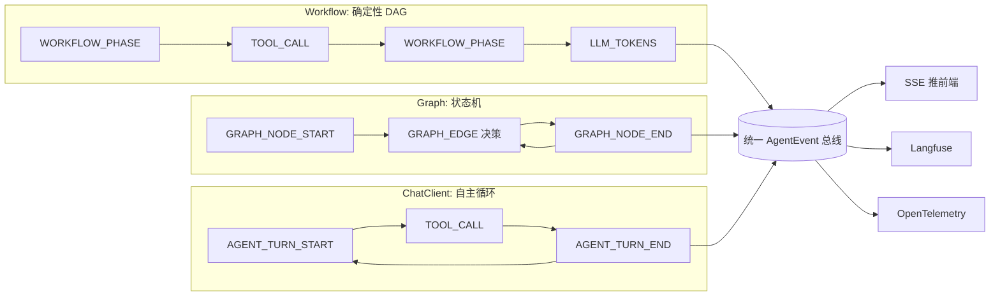

**关键点**：三种模式事件类型不同，但**都发射同一个 `AgentEvent`**（只是 `phase`/`source` 字段不同），所以总线、SSE、消费者一套代码通吃。

### 0.4 认知地图

| 问题 | 答案 | 详见 |
|------|------|------|
| 事件从哪来？ | 4 个采集点：工具装饰器 / Workflow 钩子 / Graph 监听 / 流式旁路聚合 | §4 |
| 事件去哪？ | Sinks.Many 单实例总线（多实例用 Redis Stream 广播） | §5 |
| 怎么到前端？ | SSE Controller 按 sessionId 过滤 → `ServerSentEvent` | §6 |
| 为什么不用 Flux.concat？ | cold 流，每个订阅重跑 LLM；multicast 才能多消费者共享 | §2.3 |
| 三种编排怎么统一？ | 统一 `AgentEvent` 协议，`phase`+`source` 区分来源 | §3 |
| 跨实例怎么办？ | Redis Stream 广播，SSE 订阅时合并本机 + 跨机事件 | §5.2、§16 |
| 怎么算钱？ | 每个采集点用 `Usage` 计量，累加到 session | §12 |
| 事件乱序怎么办？ | 会话内 `sequence` + SSE 端 `EventSequencer` 重排 | §17.1 |
| 关键事件会丢吗？ | CRITICAL 落库兜底 + SSE 重连回放，三重保险 | §17.2、§17.3 |
| 怎么防超支？ | 预扣（硬拦截）+ 核销（对账），不是事后 check | §12.3 |
| 怎么脱敏/审计/取消/治面？ | §17.5–§17.9 生产加固九项 | §17 |
| 百万会话/多实例状态怎么办？ | per-session 状态外置 Redis（SessionStateStore） | §17.10 |
| 单总线吞吐扛不住？ | 按 sessionId 分片，爆炸半径缩 1/N | §17.11 |
| 租户/用户级配额？ | per-tenant 日预算 + per-user RPM + SSE 连接数 | §17.12 |
| 事件风暴/重复计量/灾备？ | 节流聚合 + 契约测试 + 原生 Observation 去重 + Runbook | §17.13–§17.18 |

---

## 1. 问题定义：为什么传统 APM 不够

### 1.1 传统 APM（Prometheus / SkyWalking / 普通日志）解决不了的事

| 传统 APM 能看到 | Agent 时代需要看到 |
|----------------|------------------|
| HTTP 请求 QPS、p99 延迟 | **一次请求内部跑了多少次 LLM、调了哪些工具** |
| 数据库慢查询 | **第几次循环、token 烧了多少、为什么走这条路由** |
| CPU / 内存 | **子 Agent 输入输出、Graph 在哪个节点卡住** |
| 事后采样 trace | **实时、面向前端用户**的进度反馈 |

### 1.2 Agent 子过程可见的 7 个维度

1. **工具调用**：调了什么工具、参数、返回值、耗时
2. **MCP 调用**：跨进程工具的请求/响应、对端是哪个 Server
3. **子 Agent**：Orchestrator 拆出的子任务、各自输入输出
4. **Workflow 阶段**：当前在第几步（plan / execute / aggregate）
5. **Graph 状态机**：当前节点、条件边跳转到了哪条分支
6. **LLM token 与成本**：每次调用的 prompt/completion token、累计成本
7. **状态变更与路由决策**：路由分类器选了哪个 handler、为什么

### 1.3 三种编排模式的可见性差异

| 维度 | Workflow Service | Graph 状态机 | ChatClient 自主循环 |
|------|-----------------|-------------|-------------------|
| 步骤数 | **已知**（DAG 定死） | 已知（节点定死）但边动态 | **未知**（迭代到收敛） |
| 可见性入口 | 模板方法钩子（`Observable*` 子类） | `GraphLifecycleListener` 回调 | `TracingToolCallingManager` + 流式旁路 |
| 成本可控性 | 强（步骤固定） | 中（节点固定但分支多） | **弱**（可能死循环） |
| 推荐度 | ⭐ 企业 80% 场景首选 | 复杂决策/长程任务 | 不推荐但必须覆盖 |

> 这正是 [11-五大Workflow模式](./11-五大Workflow模式与代码评审助手.md) 反复强调的「Workflow > Agent」：可见性差异是核心原因之一——确定性 DAG 每一步都能提前埋点，自主循环只能事后观测。

---

## 2. 架构总览：三层架构

### 2.1 三层架构图

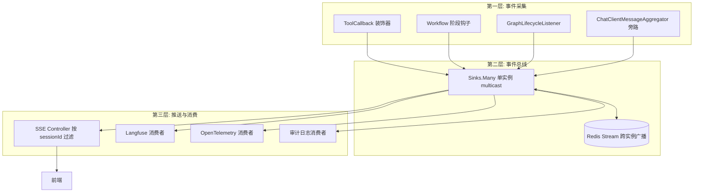

### 2.2 数据流（一次请求）

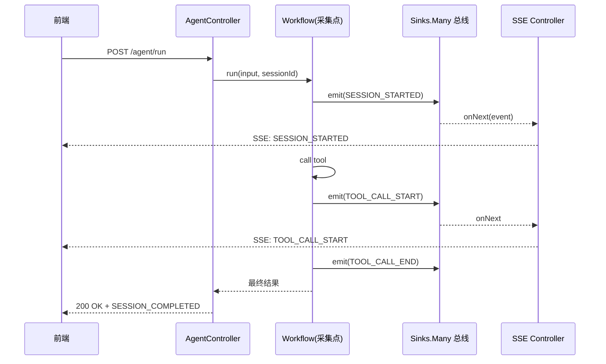

> 注意：最终结果**也可以**走 SSE 末尾事件（`SESSION_COMPLETED`），让整条链路是单一 SSE 流；HTTP body 只回空 202（已受理）。两种风格都行，§6 给出推荐。

### 2.3 为什么用 Sinks.Many 总线，不用 Flux.concat 直接编排

> **这是全文最重要的技术选型**。理解这一节，就理解了为什么这套架构是「企业级」的。

| 对比项 | **Sinks.Many 总线（本文方案）** | Flux.concat 直接编排 |
|--------|--------------------------------|---------------------|
| 流的温度 | **Hot（multicast）** | Cold |
| 多个消费者订阅 | 共享同一个事件流，**零额外开销** | 每个 `subscribe()` 重跑一遍整个编排（重复调 LLM！） |
| 新增消费者（如 Langfuse） | 加一个 `bus.asFlux().subscribe()` 即可，**零改动业务** | 要么改业务代码塞事件，要么忍受重复执行 |
| 背压 | `onBackpressureBuffer` 统一兜底 | 每段流各自处理，易失控 |
| 生命周期 | 事件发射与订阅完全解耦 | `Flux.create(sink -> ... subscribe())` 生命周期纠缠，易泄漏 |

**核心论据**（来自 [04-流式响应与Reactor深度](./04-流式响应与Reactor深度.md) §A.3）：

> 业务里一个请求一个流，不要复用。但「事件总线」不是「请求流」——它是**一个进程级共享的 Hot 源**，所有请求的事件都往里 `emit`，所有消费者（SSE / Langfuse / OTel）按需订阅过滤。这正是 `Sinks.Many.multicast()` 的设计用途。

**反模式（严禁）**：

```java
// ❌ 反模式：Flux.concat 把事件和结果硬编在一起
// 设计示意：说明类职责与调用关系，落地需补全 import/异常/配置（反面教材）
public Flux<String> run(String input) {
    return Flux.concat(
        Flux.just("[EVENT] start"),        // cold，每订阅一次发一次
        Flux.defer(() -> Flux.just(callLlm(input))),  // 每订阅一次调一次 LLM！
        Flux.just("[EVENT] end")
    );
    // 问题：前端 SSE 订阅 + Langfuse 订阅 + OTel 订阅 = 调 3 次 LLM
}
```

### 2.4 为什么选 SSE 不选 WebSocket

| 对比项 | **SSE（Server-Sent Events）** | WebSocket |
|--------|------------------------------|-----------|
| 方向 | 服务端 → 客户端**单向**（够用） | 全双工（Agent 场景用不到反向） |
| 协议 | HTTP/1.1 长连接，自动重连 | 升级握手 + 自定义帧协议 |
| 基础设施 | Nginx / CDN / 防火墙原生支持 | 需额外配置 `Upgrade` 头、超时 |
| 与 Reactor 契合 | `Flux<ServerSentEvent>` 天然契合 | 需 `WebSocketHandler` 手动管理 session |
| 断线恢复 | 浏览器自动重连 + `Last-Event-ID` | 需自研重连 + 状态同步 |
| 适用场景 | **事件流推送（本文）** | 实时双向协作（[22-跨标签页协作](../web-claude/22-跨标签页与实时协作.md)） |

> **结论**：Agent 子过程是「服务端推、前端只读展示」，SSE 是最匹配的。WebSocket 仅在需要「前端中途取消 / 注入消息」时作为可选扩展（§16.5）。

---

## 3. 统一事件模型：AgentEvent 协议

### 3.1 AgentEvent 定义

> 这是三种编排模式、四类采集点共用的**唯一事件类型**。用 Java 21 `record` + Builder。

```java
// 设计示意：说明类职责与调用关系，落地需补全 import/异常/配置
package org.demo02.toolkit.observability;

import java.time.Instant;
import java.util.Map;

/**
 * 统一 Agent 事件协议。所有编排模式（Workflow / Graph / ChatClient 自主循环）
 * 和所有采集点（工具装饰器 / 阶段钩子 / Graph 监听 / 流式旁路）都发射这个类型。
 *
 * 设计要点：
 * - phase + source 是「双坐标」，phase 描述语义阶段，source 描述来源编排模式
 * - data 是自由扩展字段（Map），新增事件类型无需改 record
 * - trace 三件套（traceId/spanId/parentSpanId）携带分布式链路（§11）
 * - sequence 是会话内单调递增序号，用于 SSE 端乱序重排（§17.1）
 * - criticality 标记事件关键度，决定背压满时降级策略（§17.2）
 * - schemaVersion 用于事件协议演进兼容（§17.7）
 * - userId/agentVersion/promptVersion 用于成本归因与计费分摊（§17.16）
 */
public record AgentEvent(
        String schemaVersion,    // 协议版本，当前 "1.0"，消费者按版本路由解析（§17.7）
        String eventId,          // 事件唯一 ID（UUID），前端去重 + SSE 重连续点用（§17.3）
        String sessionId,        // 会话 ID，SSE 过滤的主键
        String tenantId,         // 多租户隔离（§12）
        String userId,           // 触发用户，成本归因 + 权限校验（§17.16）
        EventType type,          // 事件类型枚举
        String phase,            // 语义阶段，如 orchestrator-plan / node-start / agent-turn
        String source,           // 来源编排模式：workflow / graph / chatclient / tool / mcp
        String agentVersion,     // Agent 版本，成本归因 + 回滚定位（§17.16）
        String promptVersion,    // Prompt 版本，Prompt 血缘 + 成本归因（§17.16）
        Instant timestamp,       // 发生时间
        long sequence,           // 会话内单调递增序号（§17.1 排序用），0 表示未分配
        Criticality criticality, // 关键度：CRITICAL/NORMAL/DISCARDABLE（§17.2 背压降级）
        Map<String, Object> data, // 自由扩展载荷（已脱敏，§17.6）
        // 分布式 trace（§11）
        String traceId,
        String spanId,
        String parentSpanId
) {

    public enum EventType {
        // 会话生命周期
        SESSION_STARTED, SESSION_COMPLETED, SESSION_FAILED, SESSION_CANCELLED,
        // Workflow 阶段
        WORKFLOW_PHASE,
        // Graph 状态机
        GRAPH_NODE_START, GRAPH_NODE_END, GRAPH_EDGE,
        // 自主循环
        AGENT_TURN_START, AGENT_TURN_END,
        // 工具与 MCP
        TOOL_CALL_START, TOOL_CALL_END, TOOL_CALL_FAILED,
        MCP_CALL_START, MCP_CALL_END, MCP_CALL_FAILED,
        // 成本
        LLM_TOKENS,
        // 流式正文
        CONTENT_DELTA,
        // 配额
        QUOTA_EXCEEDED
    }

    /**
     * 事件关键度——决定背压满时的降级策略（§17.2）。
     * - CRITICAL：终态/配额类，背压满时落库兜底 + SSE 重连可回放，绝不丢
     * - NORMAL：阶段/工具事件，尽力送达，丢失会影响体验但不致命
     * - DISCARDABLE：CONTENT_DELTA 等高频流式片段，背压满时优先丢
     */
    public enum Criticality { CRITICAL, NORMAL, DISCARDABLE }

    /** 按事件类型推断默认关键度（采集点不显式指定时用）。 */
    public static Criticality defaultCriticality(EventType type) {
        return switch (type) {
            case SESSION_STARTED, SESSION_COMPLETED, SESSION_FAILED,
                 SESSION_CANCELLED, QUOTA_EXCEEDED -> Criticality.CRITICAL;
            case CONTENT_DELTA -> Criticality.DISCARDABLE;
            default -> Criticality.NORMAL;
        };
    }

    /** Builder 构造，省去手填 eventId / timestamp。 */
    public static Builder builder() {
        return new Builder();
    }

    public static final class Builder {
        private static final String SCHEMA_VERSION = "1.0";
        private String eventId = java.util.UUID.randomUUID().toString();
        private String sessionId;
        private String tenantId;
        private String userId;
        private EventType type;
        private String phase;
        private String source;
        private String agentVersion;
        private String promptVersion;
        private Instant timestamp = Instant.now();
        private long sequence = 0L;                  // 0 表示未分配，由 emit 时统一分配（§17.1）
        private Criticality criticality;             // null 时按 type 推断
        private Map<String, Object> data = new java.util.HashMap<>();
        private String traceId;
        private String spanId;
        private String parentSpanId;

        public Builder sessionId(String v) { this.sessionId = v; return this; }
        public Builder tenantId(String v) { this.tenantId = v; return this; }
        public Builder userId(String v) { this.userId = v; return this; }
        public Builder type(EventType v) { this.type = v; return this; }
        public Builder phase(String v) { this.phase = v; return this; }
        public Builder source(String v) { this.source = v; return this; }
        public Builder agentVersion(String v) { this.agentVersion = v; return this; }
        public Builder promptVersion(String v) { this.promptVersion = v; return this; }
        public Builder sequence(long v) { this.sequence = v; return this; }
        public Builder criticality(Criticality v) { this.criticality = v; return this; }
        public Builder data(String k, Object v) { this.data.put(k, v); return this; }
        public Builder data(Map<String, Object> v) { this.data.putAll(v); return this; }
        public Builder traceId(String v) { this.traceId = v; return this; }
        public Builder spanId(String v) { this.spanId = v; return this; }
        public Builder parentSpanId(String v) { this.parentSpanId = v; return this; }

        public AgentEvent build() {
            Criticality crit = this.criticality != null ? this.criticality : defaultCriticality(type);
            return new AgentEvent(SCHEMA_VERSION, eventId, sessionId, tenantId, userId, type, phase, source,
                    agentVersion, promptVersion, timestamp, sequence, crit, Map.copyOf(data),
                    traceId, spanId, parentSpanId);
        }
    }
}
```

### 3.2 事件类型速查表

| type | phase 示例 | source | 含义 | data 关键字段 | criticality |
|------|-----------|--------|------|--------------|-------------|
| `SESSION_STARTED` | session | workflow/graph/chatclient | 请求开始 | `input` | CRITICAL |
| `SESSION_COMPLETED` | session | 同上 | 请求完成 | `output`、`totalTokens`、`costUsd` | CRITICAL |
| `SESSION_FAILED` | session | 同上 | 请求失败 | `error`、`errorCode` | CRITICAL |
| `SESSION_CANCELLED` | session | 同上 | 用户/系统取消（§17.4） | `reason`、`cancelledBy` | CRITICAL |
| `WORKFLOW_PHASE` | `chaining-step-1` / `parallel-worker` / `routing-classify` / `orchestrator-plan` / `evaluator-iterate` | workflow | 进入某个 Workflow 阶段 | `stepName`、`input`(截断)、`output`(截断) | NORMAL |
| `GRAPH_NODE_START` | `node:<name>` | graph | 状态机节点开始 | `nodeName`、`stateKeys` | NORMAL |
| `GRAPH_NODE_END` | `node:<name>` | graph | 节点结束 | `nodeName`、`resultKeys`、`durationMs` | NORMAL |
| `GRAPH_EDGE` | `edge:<from>-><to>` | graph | 条件边跳转 | `from`、`to`、`condition` | NORMAL |
| `AGENT_TURN_START` | `turn:<n>` | chatclient | 自主循环一轮开始 | `turnIndex` | NORMAL |
| `AGENT_TURN_END` | `turn:<n>` | chatclient | 一轮结束 | `turnIndex`、`toolCalled` | NORMAL |
| `TOOL_CALL_START` | tool | tool | 本进程工具开始 | `tool`、`args`(截断) | NORMAL |
| `TOOL_CALL_END` | tool | tool | 本进程工具完成 | `tool`、`result`(截断)、`durationMs` | NORMAL |
| `TOOL_CALL_FAILED` | tool | tool | 工具异常 | `tool`、`error` | NORMAL |
| `MCP_CALL_START` | mcp | mcp | 跨进程 MCP 开始 | `server`、`tool`、`traceId` | NORMAL |
| `MCP_CALL_END` | mcp | mcp | MCP 完成 | `server`、`tool`、`result`(截断)、`durationMs` | NORMAL |
| `LLM_TOKENS` | `<对应phase>` | tool/chatclient | 每次 LLM 调用 token | `promptTokens`、`completionTokens`、`model`、`costUsd` | NORMAL |
| `CONTENT_DELTA` | stream | chatclient | 流式正文片段 | `text` | DISCARDABLE |
| `QUOTA_EXCEEDED` | quota | workflow/chatclient | 配额超限 | `used`、`limit` | CRITICAL |

### 3.3 扩展性设计

> **设计目标**：新增 Workflow 模式、新增采集点、新增前端展示需求，都**不改 `AgentEvent` record**。

- **新增事件类型**：加枚举值即可，`data` 是 `Map<String,Object>`，前端按 `type` 选择性渲染。
- **新增编排模式**：只需新写一个采集点，往总线 `emit` 现有 `type`（或新增），业务代码与推送层零改动。
- **新增消费者**：`bus.asFlux().filter(e -> ...).subscribe(...)`，零改动采集层。

---

## 4. 第一层：事件采集

> 四个采集点，每个都**只做一件事**：在合适时机 `emit(AgentEvent)`，不关心谁消费。

### 4.1 采集点全景

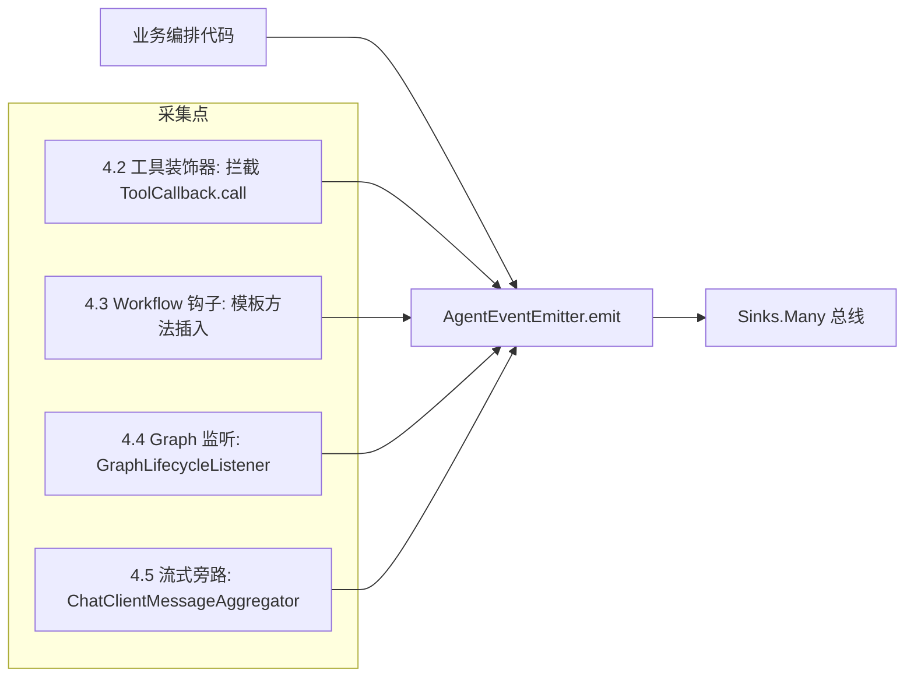

### 4.2 采集点一：ToolCallback 装饰器（装饰器模式，不改原始类）

> 所有「本进程工具调用」都经过 `ToolCallback.call(String)`（§10 核实过的方法签名）。用**装饰器**包一层，发射 `TOOL_CALL_START/END/FAILED`，不改原始 `ToolCallback` 实现。

> 注：此处拦截的是「工具执行」这一横切关注点。若要在 **Advisor 层**看 LLM 决定调哪个工具，那是另一条路径（见 §9）。两者互补：Advisor 层看「LLM 想调什么」，装饰器层看「工具实际执行得怎样」。

```java
// 设计示意：说明类职责与调用关系，落地需补全 import/异常/配置
package org.demo02.toolkit.observability.tool;

import org.demo02.toolkit.observability.AgentEvent;
import org.demo02.toolkit.observability.AgentEventEmitter;
import org.springframework.ai.chat.model.ToolContext;
import org.springframework.ai.tool.ToolCallback;
import org.springframework.ai.tool.definition.ToolDefinition;

/**
 * 工具调用装饰器：delegate 到真实 ToolCallback，并在前后发射事件。
 * 装饰器模式——不修改任何原始 @Tool 方法或已有 ToolCallback 实现。
 */
public class ObservableToolCallback implements ToolCallback {

    private final ToolCallback delegate;
    private final AgentEventEmitter emitter;

    public ObservableToolCallback(ToolCallback delegate, AgentEventEmitter emitter) {
        this.delegate = delegate;
        this.emitter = emitter;
    }

    @Override
    public ToolDefinition getToolDefinition() {
        return delegate.getToolDefinition();
    }

    @Override
    public String call(String toolInput) {
        return doCall(toolInput, null);
    }

    @Override
    public String call(String toolInput, ToolContext toolContext) {
        return doCall(toolInput, toolContext);
    }

    private String doCall(String toolInput, ToolContext ctx) {
        String toolName = delegate.getToolDefinition().name();
        long start = System.currentTimeMillis();
        String sessionId = resolveSessionId(ctx);
        try {
            emitter.emit(AgentEvent.builder()
                    .sessionId(sessionId)
                    .type(AgentEvent.EventType.TOOL_CALL_START)
                    .phase("tool")
                    .source("tool")
                    .data("tool", toolName)
                    // 先截断防 SSE 帧过大，再脱敏防 PII 泄漏到前端（§17.6）
                    .data("args", PiiRedactor.redact(Truncator.truncate(toolInput, 2000)))
                    .build());
            String result = (ctx == null) ? delegate.call(toolInput) : delegate.call(toolInput, ctx);
            emitter.emit(AgentEvent.builder()
                    .sessionId(sessionId)
                    .type(AgentEvent.EventType.TOOL_CALL_END)
                    .phase("tool")
                    .source("tool")
                    .data("tool", toolName)
                    .data("result", PiiRedactor.redact(Truncator.truncate(result, 2000)))
                    .data("durationMs", System.currentTimeMillis() - start)
                    .build());
            return result;
        } catch (RuntimeException ex) {
            // 异常也要发事件，前端能看到「工具失败了」，而不是卡住
            emitter.emit(AgentEvent.builder()
                    .sessionId(sessionId)
                    .type(AgentEvent.EventType.TOOL_CALL_FAILED)
                    .phase("tool")
                    .source("tool")
                    .data("tool", toolName)
                    .data("error", ex.getClass().getSimpleName() + ": " + ex.getMessage())
                    .build());
            throw ex;
        }
    }

    /** ToolContext 里通常带 sessionId（见 §12 多租户透传）。兜底用 "unknown"。 */
    private String resolveSessionId(ToolContext ctx) {
        if (ctx != null && ctx.getContext().get("sessionId") instanceof String sid) {
            return sid;
        }
        return "unknown";
    }
}
```

**配套的包装工厂**（把一批工具一次性包上）：

```java
// 设计示意：说明类职责与调用关系，落地需补全 import/异常/配置
public final class ObservableTools {
    private ObservableTools() {}

    public static List<ToolCallback> wrap(List<ToolCallback> tools, AgentEventEmitter emitter) {
        return tools.stream()
                .map(t -> new ObservableToolCallback(t, emitter))
                .toList();
    }
}
```

`Truncator`（工具/LLM 输出截断，防 SSE 帧过大）：

```java
// 设计示意：说明类职责与调用关系，落地需补全 import/异常/配置
public final class Truncator {
    private Truncator() {}
    public static String truncate(String s, int max) {
        if (s == null) return null;
        return s.length() <= max ? s : s.substring(0, max) + "...[truncated " + (s.length() - max) + " chars]";
    }
}
```

### 4.3 采集点二：Workflow 阶段钩子

> 思路：[11](./11-五大Workflow模式与代码评审助手.md) 的五大模式都是「抽象基类 + 模板方法」（`steps()` / `works()` / `worker()` / `classifier()` / `generator()`）。我们新增一层 `Observable*` 基类，在模板方法里 `emit(WORKFLOW_PHASE)`，**具体业务子类零改动**。完整代码见 [§7](#7-workflow-service-改造五大模式)。

骨架示意：

```java
// 设计示意：说明类职责与调用关系，落地需补全 import/异常/配置（详见 §7.1）
public abstract class ObservableChainingService extends ChainingService {
    protected final AgentEventEmitter emitter;
    // ... 构造器注入 emitter
    @Override
    public String run(String input, String sessionId) {
        emitter.emit(sessionStart(sessionId, input, "chaining"));
        String payload = input;
        List<BiFunction<String, String, String>> steps = steps();
        for (int i = 0; i < steps.size(); i++) {
            int idx = i;
            emitter.emit(phase(sessionId, "chaining-step-" + idx, Map.of("input", Truncator.truncate(payload, 1000))));
            payload = steps.get(i).apply(payload, sessionId);
            emitter.emit(phase(sessionId, "chaining-step-" + idx + "-done", Map.of("output", Truncator.truncate(payload, 1000))));
        }
        emitter.emit(sessionEnd(sessionId, payload, "chaining"));
        return payload;
    }
}
```

### 4.4 采集点三：GraphLifecycleListener（Graph 状态机）

> `spring-ai-alibaba-graph-core` 的 `CompileConfig.Builder.withLifecycleListener(...)` 支持注入监听器，节点 `before` / `after` / `onError` 时回调。我们把回调适配成 `AgentEvent`。

**API 核实**（反编译 `spring-ai-alibaba-graph-core-1.0.0.3.jar`）：

```text
interface GraphLifecycleListener {
    default void onStart(String, Map<String,Object> state, RunnableConfig);
    default void before(String nodeName, Map<String,Object> state, RunnableConfig, Long step);  // 节点开始
    default void after (String nodeName, Map<String,Object> state, RunnableConfig, Long step);  // 节点结束
    default void onError(String nodeName, Map<String,Object> state, Throwable, RunnableConfig);
    default void onComplete(String, Map<String,Object>, RunnableConfig);
}
```

> ⚠️ 注意：[10-多Agent编排实战](./10-多Agent编排实战.md) §7.1 旧文档写的 `onNodeStart/onNodeEnd` 在本版本 jar 中**不存在**，真实方法是 `before/after`。本文已校正。

适配器代码：

```java
// 设计示意：说明类职责与调用关系，落地需补全 import/异常/配置
package org.demo02.toolkit.observability.graph;

import com.alibaba.cloud.ai.graph.GraphLifecycleListener;
import com.alibaba.cloud.ai.graph.RunnableConfig;
import org.demo02.toolkit.observability.AgentEvent;
import org.demo02.toolkit.observability.AgentEventEmitter;

import java.util.Map;

/**
 * 把 Graph 状态机的生命周期回调，适配成统一 AgentEvent。
 * 注意 before/after 的第 4 个参数是 step（Long），这是真实方法签名。
 */
public class AgentEventGraphListener implements GraphLifecycleListener {

    private final AgentEventEmitter emitter;
    private final String sessionId;
    private final java.util.Map<String, Long> nodeStartNs = new java.util.concurrent.ConcurrentHashMap<>();

    public AgentEventGraphListener(AgentEventEmitter emitter, String sessionId) {
        this.emitter = emitter;
        this.sessionId = sessionId;
    }

    @Override
    public void before(String nodeName, Map<String, Object> state, RunnableConfig cfg, Long step) {
        nodeStartNs.put(nodeName, System.nanoTime());
        emitter.emit(AgentEvent.builder()
                .sessionId(sessionId)
                .type(AgentEvent.EventType.GRAPH_NODE_START)
                .phase("node:" + nodeName)
                .source("graph")
                .data("nodeName", nodeName)
                .data("step", step)
                .data("stateKeys", state == null ? List.of() : List.copyOf(state.keySet()))
                .build());
    }

    @Override
    public void after(String nodeName, Map<String, Object> state, RunnableConfig cfg, Long step) {
        Long startNs = nodeStartNs.remove(nodeName);
        long durationMs = startNs == null ? -1 : (System.nanoTime() - startNs) / 1_000_000;
        emitter.emit(AgentEvent.builder()
                .sessionId(sessionId)
                .type(AgentEvent.EventType.GRAPH_NODE_END)
                .phase("node:" + nodeName)
                .source("graph")
                .data("nodeName", nodeName)
                .data("step", step)
                .data("durationMs", durationMs)
                .data("resultKeys", state == null ? List.of() : List.copyOf(state.keySet()))
                .build());
    }

    @Override
    public void onError(String nodeName, Map<String, Object> state, Throwable err, RunnableConfig cfg) {
        emitter.emit(AgentEvent.builder()
                .sessionId(sessionId)
                .type(AgentEvent.EventType.SESSION_FAILED)
                .phase("node:" + nodeName)
                .source("graph")
                .data("nodeName", nodeName)
                .data("error", err.getClass().getSimpleName() + ": " + err.getMessage())
                .build());
    }
}
```

> **条件边跳转事件**（`GRAPH_EDGE`）：`before`/`after` 回调按节点粒度，**不直接给「走了哪条边」**。要补边事件，可在条件边的判定函数里手动 `emit`（§8.2 详述），因为条件边是业务自己写的 `EdgeCondition`，在那里埋点最自然。

### 4.5 采集点四：ChatClientMessageAggregator 流式旁路

> 流式响应下，每个 chunk 是 `ChatClientResponse`。直接 `subscribe` 主流会触发「重复消费」（§2.3）。用 **`ChatClientMessageAggregator.aggregateChatClientResponse`** 旁路聚合，**不阻塞主流**，聚合完成后拿到完整 `ChatResponse` 取 `Usage` 算 token。

**API 核实**（反编译 `spring-ai-client-chat-2.0.0.jar`）：

```text
class ChatClientMessageAggregator {
    Flux<ChatClientResponse> aggregateChatClientResponse(
        Flux<ChatClientResponse> flux, Consumer<ChatClientResponse> onComplete);
}
```

> 关键：`aggregateChatClientResponse` 返回的 `Flux` 是**原流的透传 + 末尾触发回调**，订阅它和订阅原流效果一致，不会重复调 LLM。

采集代码：

```java
// 设计示意：说明类职责与调用关系，落地需补全 import/异常/配置
package org.demo02.toolkit.observability.stream;

import org.demo02.toolkit.observability.AgentEvent;
import org.demo02.toolkit.observability.AgentEventEmitter;
import org.springframework.ai.chat.client.ChatClientMessageAggregator;
import org.springframework.ai.chat.client.ChatClientResponse;
import org.springframework.ai.chat.metadata.Usage;
import reactor.core.publisher.Flux;

import java.util.function.Consumer;

public class TokenMeter implements Consumer<ChatClientResponse> {

    private final AgentEventEmitter emitter;
    private final String sessionId;
    private final String phase;

    public TokenMeter(AgentEventEmitter emitter, String sessionId, String phase) {
        this.emitter = emitter;
        this.sessionId = sessionId;
        this.phase = phase;
    }

    @Override
    public void accept(ChatClientResponse aggregated) {
        // ChatClientResponse.chatResponse().getMetadata().getUsage() 链路已核实
        Usage usage = aggregated.chatResponse().getMetadata().getUsage();
        if (usage == null) return;
        int prompt = usage.getPromptTokens() == null ? 0 : usage.getPromptTokens();
        int completion = usage.getCompletionTokens() == null ? 0 : usage.getCompletionTokens();
        emitter.emit(AgentEvent.builder()
                .sessionId(sessionId)
                .type(AgentEvent.EventType.LLM_TOKENS)
                .phase(phase)
                .source("chatclient")
                .data("promptTokens", prompt)
                .data("completionTokens", completion)
                .data("totalTokens", prompt + completion)
                .data("model", aggregated.chatResponse().getMetadata().getModel())
                .build());
    }

    /** 包一层：对主流做旁路聚合，返回原主流（不重复消费）。 */
    public static Flux<ChatClientResponse> tap(Flux<ChatClientResponse> flux, TokenMeter meter) {
        return new ChatClientMessageAggregator().aggregateChatClientResponse(flux, meter);
    }
}
```

---

## 5. 第二层：事件总线

### 5.1 单实例总线：Sinks.Many

> 一个进程**一个** `Sinks.Many` Bean。`multicast()` 让所有订阅者共享；`onBackpressureBuffer(Q)` 在消费者跟不上时缓冲，防丢事件。

```java
// 设计示意：说明类职责与调用关系，落地需补全 import/异常/配置
package org.demo02.toolkit.observability.bus;

import org.demo02.toolkit.observability.AgentEvent;
import org.demo02.toolkit.observability.AgentEventEmitter;
import jakarta.annotation.PostConstruct;
import org.springframework.beans.factory.annotation.Autowired;
import org.springframework.beans.factory.annotation.Value;
import org.springframework.stereotype.Component;
import reactor.core.Disposable;
import reactor.core.publisher.Flux;
import reactor.core.publisher.Sinks;

import java.util.List;
import java.util.concurrent.CopyOnWriteArrayList;

/**
 * 进程内事件总线。单实例（@Component 默认单例）。
 *
 * Sinks.Many.multicast() 的语义：多个订阅者共享同一个上游事件流，
 * 新增订阅者只看到「订阅之后」的事件（Hot）。
 * onBackpressureBuffer：消费者慢时缓冲，满了按策略丢弃最旧/报错。
 */
@Component
public class AgentEventBus implements AgentEventEmitter {

    /**
     * 分片总线（§17.11）：按 sessionId hash 路由到 N 个 sink，
     * 把「单个慢消费者拖垮全局」的爆炸半径从「全部会话」缩到「1/N 会话」。
     * 分片数取进程 CPU 核数与预期并发会话数的平衡，默认 16。
     */
    @Value("${agent.observability.bus.shards:16}")
    private int shards;

    /** 延迟初始化：shards 由 @Value 注入，PostConstruct 时建。 */
    private Sinks.Many<AgentEvent>[] sinks;

    /** 跨实例广播适配器（可选，单实例时为 no-op，§5.2）。 */
    private final List<EventSinkConsumer> sinkConsumers = new CopyOnWriteArrayList<>();

    @Value("${agent.observability.cross-instance:false}")
    private boolean crossInstance;

    @Autowired(required = false)
    private RedisStreamBridge redisBridge;

    /** CRITICAL 事件背压满时的落库兜底（§17.2），单实例时可为 null。 */
    @Autowired(required = false)
    private CriticalEventFallback criticalFallback;

    /** 总线层统一脱敏（§17.6 升级版）：emit 进 sink 前对所有 data 字段过一遍，防采集点漏脱敏。 */
    @Autowired(required = false)
    private org.demo02.toolkit.observability.BusRedactor busRedactor;

    /** 会话内单调递增序号，用于 SSE 端乱序重排（§17.1）。 */
    private final java.util.Map<String, java.util.concurrent.atomic.AtomicLong> sequences =
            new java.util.concurrent.ConcurrentHashMap<>();

    @PostConstruct
    @SuppressWarnings("unchecked")
    public void init() {
        sinks = new Sinks.Many[shards];
        for (int i = 0; i < shards; i++) {
            // 每片独立缓冲，慢消费者只影响本片
            sinks[i] = Sinks.many().multicast().onBackpressureBuffer(2048, /*autoCancel=*/false);
        }
        if (crossInstance && redisBridge != null) {
            redisBridge.subscribeRemote(this::acceptLocal);
        }
    }

    /** 路由：按 sessionId 选分片，同一会话事件落在同一 sink，保证会话内有序。 */
    private Sinks.Many<AgentEvent> route(String sessionId) {
        int idx = Math.floorMod(sessionId.hashCode(), shards);
        return sinks[idx];
    }

    @Override
    public void emit(AgentEvent event) {
        // 0. 总线层统一脱敏（§17.6）：采集点可能漏挂脱敏，这里兜底
        AgentEvent redacted = (busRedactor == null) ? event : busRedactor.redact(event);
        // 1. 分配会话内序号（采集点不感知，由总线统一分配）
        AgentEvent sequenced = assignSequence(redacted);
        // 2. 持久化（§17.5）：CRITICAL 必落库，NORMAL 可采样落库
        if (criticalFallback != null) {
            criticalFallback.persist(sequenced);
        }
        // 3. 推总线（分片路由）；CRITICAL 失败时落库兜底，DISCARDABLE 失败直接丢弃
        Sinks.EmitResult result = route(sequenced.sessionId()).tryEmitNext(sequenced);
        if (result.isFailure()) {
            onEmitFailure(sequenced, result);
        }
        if (crossInstance && redisBridge != null) {
            redisBridge.publish(sequenced);
        }
    }

    private AgentEvent assignSequence(AgentEvent e) {
        if (e.sequence() > 0) return e; // 已分配（跨实例回灌的）
        long seq = sequences.computeIfAbsent(e.sessionId(), k -> new java.util.concurrent.atomic.AtomicLong())
                .incrementAndGet();
        return rebuildWithSequence(e, seq);
    }

    /** record 不可变，重建一个带 sequence 的事件（保留其余字段）。 */
    private static AgentEvent rebuildWithSequence(AgentEvent e, long seq) {
        return new AgentEvent(e.schemaVersion(), e.eventId(), e.sessionId(), e.tenantId(), e.userId(),
                e.type(), e.phase(), e.source(), e.agentVersion(), e.promptVersion(),
                e.timestamp(), seq, e.criticality(),
                e.data(), e.traceId(), e.spanId(), e.parentSpanId());
    }

    /**
     * 背压满时的分级降级（§17.2）：
     * - CRITICAL：已在上一步落库，SSE 重连时可从库回放，这里只记 metrics
     * - DISCARDABLE：直接丢（CONTENT_DELTA 丢几帧无伤大雅）
     * - NORMAL：丢 + 记 metrics（影响体验但不致命）
     */
    private void onEmitFailure(AgentEvent e, Sinks.EmitResult result) {
        // 实战：按 criticality 打点 metrics（agent_event_emit_failures_total{criticality=...}）
        // CRITICAL 的兜底由 CriticalEventFallback.persist 保证，无需在此补救。
    }

    /** 仅本地回灌（来自 Redis 订阅），路由到对应分片，避免广播回环。 */
    private void acceptLocal(AgentEvent event) {
        route(event.sessionId()).tryEmitNext(event);
    }

    /**
     * 消费者订阅入口（全分片 merge）：用于需要看全量事件的消费者（审计、Langfuse）。
     * merge 所有分片，消费者仍能看到全量事件（§17.11）。
     */
    public Flux<AgentEvent> asFlux() {
        java.util.List<Flux<AgentEvent>> all = new java.util.ArrayList<>(shards);
        for (Sinks.Many<AgentEvent> s : sinks) all.add(s.asFlux());
        return Flux.merge(all);
    }

    /**
     * 定向订阅（推荐 SSE 用）：只订阅该 sessionId 所在分片，省 N-1 倍过滤开销。
     * 同一会话事件必在同一分片，不会漏。
     */
    public Flux<AgentEvent> asFluxFor(String sessionId) {
        return route(sessionId).asFlux().filter(e -> sessionId.equals(e.sessionId()));
    }

    /** 运维：当前分片数（§17.9 治理面）。 */
    public int shardCount() { return shards; }

    /** 运维：某会话所在分片索引（排障用）。 */
    public int shardOf(String sessionId) { return Math.floorMod(sessionId.hashCode(), shards); }

    @FunctionalInterface
    public interface EventSinkConsumer {}

    /** Redis Bridge 占位接口，§5.2 实现真实版。 */
    public interface RedisStreamBridge {
        void publish(AgentEvent event);
        void subscribeRemote(java.util.function.Consumer<AgentEvent> consumer);
    }
}
```

`AgentEventEmitter`（业务代码只依赖这个窄接口，不碰 Reactor）：

```java
// 设计示意：说明类职责与调用关系，落地需补全 import/异常/配置
package org.demo02.toolkit.observability;

public interface AgentEventEmitter {
    void emit(AgentEvent event);
}
```

### 5.2 多实例：Redis Stream 跨实例广播

> 单实例够用时（开发、小流量），`cross-instance=false`，总线纯进程内。水平扩容到多实例后，用户 SSE 连的是实例 A，但请求可能在实例 B 处理——必须用 Redis Stream 把 B 的事件广播给 A。

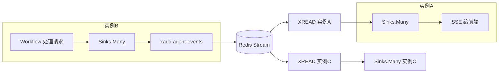

`RedisStreamBridge` 实现（基于 `spring-boot-starter-data-redis` 的 `RedisTemplate` / `StringRedisTemplate`，`opsForStream()` 真实 API）：

```java
// 设计示意：说明类职责与调用关系，落地需补全 import/异常/配置
package org.demo02.toolkit.observability.bus;

import com.fasterxml.jackson.databind.ObjectMapper;
import jakarta.annotation.PostConstruct;
import jakarta.annotation.PreDestroy;
import org.demo02.toolkit.observability.AgentEvent;
import org.springframework.data.redis.connection.stream.*;
import org.springframework.data.redis.core.RedisTemplate;
import reactor.core.Disposable;

import java.time.Duration;
import java.util.Map;

public class RedisStreamBridgeImpl implements AgentEventBus.RedisStreamBridge {

    private static final String STREAM_KEY = "agent-events";
    private static final String GROUP = "sse-consumers";

    private final RedisTemplate<String, String> redis;
    private final ObjectMapper mapper = new ObjectMapper();
    private final String instanceId = java.util.UUID.randomUUID().toString();
    private volatile boolean running = true;

    public RedisStreamBridgeImpl(RedisTemplate<String, String> redis) {
        this.redis = redis;
    }

    @Override
    public void publish(AgentEvent event) {
        try {
            String json = mapper.writeValueAsString(event);
            // opsForStream().add 是 spring-data-redis 真实 API
            redis.opsForStream().add(STREAM_KEY, Map.of(
                    "instance", instanceId,   // 用于过滤回环
                    "payload", json));
        } catch (Exception ignore) {
            // 序列化/网络失败不能影响主链路
        }
    }

    @Override
    public void subscribeRemote(java.util.function.Consumer<AgentEvent> consumer) {
        // 消费者组 + XREADGROUP，确保多实例各自只投递一次到本机 sink
        try {
            redis.opsForStream().createGroup(STREAM_KEY, GROUP);
        } catch (Exception ignore) {
            // 组已存在
        }
        Thread t = new Thread(() -> {
            while (running) {
                try {
                    // XREADGROUP 阻塞读取
                    java.util.List<MapRecord<String, Object, Object>> records =
                            redis.opsForStream().read(
                                    org.springframework.data.redis.connection.stream.Consumer.from(GROUP, instanceId),
                                    StreamReadOptions.empty().count(50).block(Duration.ofSeconds(2)),
                                    StreamOffset.create(STREAM_KEY, ReadOffset.lastConsumed()));
                    if (records == null) continue;
                    for (MapRecord<String, Object, Object> rec : records) {
                        Object src = rec.getValue().get("instance");
                        if (instanceId.equals(src)) continue; // 自己发的，跳过防回环
                        Object payload = rec.getValue().get("payload");
                        if (payload instanceof String s) {
                            AgentEvent e = mapper.readValue(s, AgentEvent.class);
                            consumer.accept(e);
                        }
                        redis.opsForStream().acknowledge(STREAM_KEY, GROUP, rec.getId());
                    }
                } catch (Exception ignore) {
                    // 短暂休眠避免 busy loop
                    sleepQuiet(500);
                }
            }
        }, "redis-stream-bridge");
        t.setDaemon(true);
        t.start();
    }

    @PreDestroy
    public void stop() { running = false; }

    private void sleepQuiet(long ms) {
        try { Thread.sleep(ms); } catch (InterruptedException ie) { Thread.currentThread().interrupt(); }
    }
}
```

### 5.3 配置切换

```yaml
# application.yaml
agent:
  observability:
    cross-instance: false   # 单实例 false；多实例 true 并配 Redis
spring:
  data:
    redis:
      host: ${REDIS_HOST:127.0.0.1}
      port: 6379
```

`@Bean RedisStreamBridge` 仅在 `cross-instance=true` 时装配：

```java
// 设计示意：说明类职责与调用关系，落地需补全 import/异常/配置
@Configuration
public class ObservabilityConfig {
    @Bean
    @ConditionalOnProperty(prefix = "agent.observability", name = "cross-instance", havingValue = "true")
    public AgentEventBus.RedisStreamBridge redisStreamBridge(RedisTemplate<String, String> redis) {
        return new RedisStreamBridgeImpl(redis);
    }
}
```

### 5.4 单实例 vs 多实例对比

| 维度 | 单实例（cross-instance=false） | 多实例（Redis Stream） |
|------|-------------------------------|----------------------|
| 复杂度 | 一个 `Sinks.Many` Bean | + Redis + 消费者组 + XREAD |
| 延迟 | 微秒级 | +1~5ms（Redis RTT） |
| 可靠性 | 进程崩事件丢 | Stream 持久化，ACK 后才删 |
| 扩容 | 不支持 | 水平扩容，SSE 随机连任一实例都行 |
| 适用 | 开发 / 单机小流量 | 生产多实例 |

---

## 6. 第三层：SSE 推送

### 6.1 统一 SSE Controller

> 订阅总线 → 按 `sessionId`（+ `tenantId`）过滤 → 转 `ServerSentEvent`。一个 Controller 吃下三种编排模式的事件。

```java
// 设计示意：说明类职责与调用关系，落地需补全 import/异常/配置
package org.demo02.toolkit.observability.sse;

import org.demo02.toolkit.observability.AgentEvent;
import org.demo02.toolkit.observability.bus.AgentEventBus;
import org.demo02.toolkit.observability.replay.EventReplayStore;
import org.demo02.toolkit.observability.replay.EventSequencer;
import org.springframework.http.MediaType;
import org.springframework.http.codec.ServerSentEvent;
import org.springframework.web.bind.annotation.*;
import reactor.core.publisher.Flux;
import reactor.core.publisher.Mono;

import java.time.Duration;

@RestController
@RequestMapping("/agent/events")
public class AgentEventSseController {

    private final AgentEventBus bus;
    private final EventReplayStore replayStore;   // §17.3 回放缓存（单实例可空）
    private final EventSequencer sequencer;        // §17.1 乱序重排

    public AgentEventSseController(AgentEventBus bus,
                                   org.springframework.beans.factory.ObjectProvider<EventReplayStore> replayStore,
                                   EventSequencer sequencer) {
        this.bus = bus;
        this.replayStore = replayStore.getIfAvailable();
        this.sequencer = sequencer;
    }

    /**
     * 前端订阅某会话的实时事件流。SSE event 名 = AgentEvent.type，data = JSON。
     *
     * 支持断线重连：前端重连时带 Last-Event-ID 头，后端先回放断连期间事件，再接实时流（§17.3）。
     * 租户隔离：tenantId 必须与事件 tenantId 匹配，否则过滤（§17.8）。
     */
    @GetMapping(value = "/{sessionId}", produces = MediaType.TEXT_EVENT_STREAM_VALUE)
    public Flux<ServerSentEvent<String>> stream(
            @PathVariable String sessionId,
            @RequestHeader(value = "X-Tenant-Id", required = false) String tenantId,
            @RequestHeader(value = "Last-Event-ID", required = false) String lastEventId) {

        // 心跳保活：每 15s 发一个 comment 帧，防代理超时断连
        Flux<ServerSentEvent<String>> heartbeat = Flux.interval(Duration.ofSeconds(15))
                .map(i -> ServerSentEvent.<String>builder().comment("keep-alive").build());

        // 1. 回放段：从 lastEventId 之后重放断连期间的事件（无 lastEventId 或无 store 时为空）
        Flux<AgentEvent> replay = (replayStore == null || lastEventId == null)
                ? Flux.empty()
                : Flux.fromIterable(replayStore.replayAfter(sessionId, lastEventId));

        // 2. 实时段：定向订阅该会话所在分片（§17.11 分片总线，省 N-1 倍过滤），再过滤租户
        Flux<AgentEvent> live = bus.asFluxFor(sessionId)
                .filter(e -> tenantId == null || tenantId.equals(e.tenantId()));

        // 3. 回放 + 实时 合并 → 按会话内序号重排（容忍乱序，§17.1）→ 终态/超时收尾
        Flux<ServerSentEvent<String>> events = Flux.concat(replay, live)
                .transform(sequencer::reorder)                       // 乱序重排
                .takeUntil(e -> isTerminal(e.type()))                // 终态自然结束
                .timeout(Duration.ofMinutes(30), Mono.empty())        // 30 分钟无终态优雅断
                .onBackpressureDrop(e -> { /* §6.3：DISCARDABLE 丢弃记 metrics */ })
                .map(this::toSse);

        return Flux.merge(events, heartbeat);
    }

    private static boolean isTerminal(AgentEvent.EventType t) {
        return t == AgentEvent.EventType.SESSION_COMPLETED
            || t == AgentEvent.EventType.SESSION_FAILED
            || t == AgentEvent.EventType.SESSION_CANCELLED;  // §17.4 取消也是终态
    }

    private ServerSentEvent<String> toSse(AgentEvent e) {
        return ServerSentEvent.<String>builder()
                .id(e.eventId())            // 前端重连带 Last-Event-ID（§17.3）
                .event(e.type().name())     // SSE event 名 = 事件类型
                .data(toJson(e))
                .build();
    }

    private String toJson(AgentEvent e) {
        // 省略：用 ObjectMapper 序列化（data 内大字段已截断、已脱敏）
        try { return new com.fasterxml.jackson.databind.ObjectMapper().writeValueAsString(e); }
        catch (Exception ex) { return "{}"; }
    }
}
```

> **关键点**：
> - `Last-Event-ID` 回放：前端断线重连时浏览器自动带此头，后端用 `EventReplayStore` 回放断连期间事件（§17.3）。
> - `EventSequencer.reorder`：跨采集点/跨实例事件可能乱序到达，按会话内 `sequence` 重排（§17.1）。
> - `isTerminal` 含 `SESSION_CANCELLED`：用户取消（§17.4）也会优雅结束流。
> - `timeout(30min)` + 心跳：防僵尸连接、防代理超时。
> - `onBackpressureDrop`：前端慢消费时丢 DISCARDABLE，CRITICAL 已落库可回放（§6.3）。

### 6.2 会话过滤与多租户

- 过滤维度：`sessionId`（必选）+ `tenantId`（多租户必选，§12）。
- `sessionId` 由 `/agent/run` 入口生成并在首事件回传，前端拿到后立即 `EventSource` 订阅。
- 租户隔离：前端请求头带 `X-Tenant-Id`，或从 JWT 解析，与事件里的 `tenantId` 比对，**不一致直接过滤掉**（防越权窥探他人会话）。

### 6.3 背压策略（分级降级）

> 本节是「不丢关键事件」的核心。完整降级语义见 §17.2，这里给数据流。

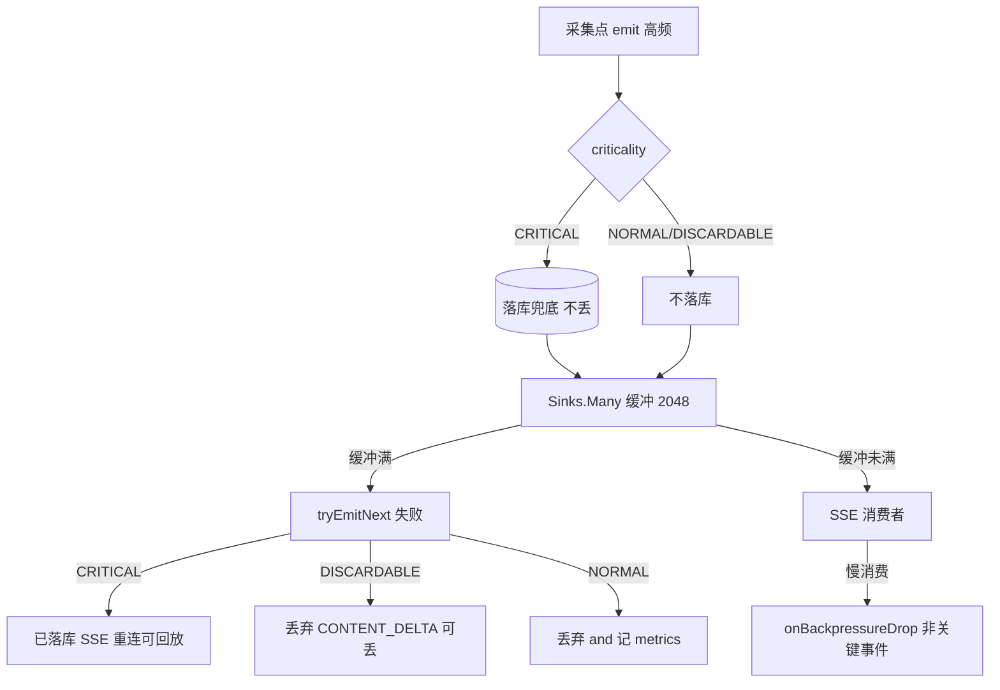

- **采集端（总线层）**：`emit` 时 CRITICAL 先落库（`CriticalEventFallback.persist`），再 `tryEmitNext`。失败时 CRITICAL 已有兜底，DISCARDABLE/NORMAL 记 metrics 即可（§5.1 `onEmitFailure`）。
- **SSE 端**：前端慢消费时 `onBackpressureDrop` 丢弃非关键事件；CRITICAL 即使被丢，前端重连后靠 `EventReplayStore` 回放（§17.3）。
- **一句话**：CRITICAL 三重保险（落库 + 重放 + 终态必达），DISCARDABLE 随时可丢，NORMAL 尽力而为。

### 6.4 流式正文与事件流 merge

> 一个请求里，用户既要看「事件流」（进度），又要看「正文流」（最终答案的逐字输出）。两路 merge 成一条 SSE。详见 [§13](#13-流式场景特殊处理)。

### 6.4 流式正文与事件流 merge

> 一个请求里，用户既要看「事件流」（进度），又要看「正文流」（最终答案的逐字输出）。两路 merge 成一条 SSE。详见 [§13](#13-流式场景特殊处理)。

---

## 7. Workflow Service 改造（五大模式）

> [11-五大Workflow模式](./11-五大Workflow模式与代码评审助手.md) 的五大抽象基类（`ChainingService` / `ParallelizationService` / `RoutingService` / `OrchestratorService` / `EvaluatorOptimizerService`）位于 `org.demo06.workflows`。我们新增 `Observable*` 子类，在模板方法里埋点，**业务子类（`ArticleChainingService` 等）零改动即可获得可见性**。

### 7.1 ObservableChainingService（Prompt Chaining）

```java
// 设计示意：说明类职责与调用关系，落地需补全 import/异常/配置
package org.demo02.toolkit.workflow;

import org.demo02.toolkit.observability.AgentEvent;
import org.demo02.toolkit.observability.AgentEventEmitter;
import org.demo02.toolkit.observability.Truncator;
import org.demo06.workflows.ChainingService;
import org.springframework.ai.chat.client.ChatClient;

import java.util.List;
import java.util.Map;
import java.util.function.BiFunction;

public abstract class ObservableChainingService extends ChainingService {

    protected final AgentEventEmitter emitter;

    protected ObservableChainingService(ChatClient chatClient, AgentEventEmitter emitter) {
        super(chatClient);
        this.emitter = emitter;
    }

    @Override
    public String run(String input, String sessionId) {
        emitter.emit(AgentEvent.builder()
                .sessionId(sessionId).type(AgentEvent.EventType.SESSION_STARTED)
                .phase("chaining").source("workflow")
                .data("input", Truncator.truncate(input, 1000)).build());

        String payload = input;
        List<BiFunction<String, String, String>> steps = steps();
        for (int i = 0; i < steps.size(); i++) {
            String phase = "chaining-step-" + i;
            int idx = i;
            emitter.emit(AgentEvent.builder()
                    .sessionId(sessionId).type(AgentEvent.EventType.WORKFLOW_PHASE)
                    .phase(phase).source("workflow")
                    .data("stepName", "step-" + idx)
                    .data("input", Truncator.truncate(payload, 1000)).build());

            payload = steps.get(i).apply(payload, sessionId);
            if (payload == null) {
                emitter.emit(AgentEvent.builder()
                        .sessionId(sessionId).type(AgentEvent.EventType.SESSION_FAILED)
                        .phase(phase).source("workflow")
                        .data("error", "chain terminated by null step").build());
                return "[CHAIN TERMINATED]";
            }
            emitter.emit(AgentEvent.builder()
                    .sessionId(sessionId).type(AgentEvent.EventType.WORKFLOW_PHASE)
                    .phase(phase + "-done").source("workflow")
                    .data("output", Truncator.truncate(payload, 1000)).build());
        }

        emitter.emit(AgentEvent.builder()
                .sessionId(sessionId).type(AgentEvent.EventType.SESSION_COMPLETED)
                .phase("chaining").source("workflow")
                .data("output", Truncator.truncate(payload, 1000)).build());
        return payload;
    }
}
```

### 7.2 ObservableParallelizationService（Parallelization）

```java
// 设计示意：说明类职责与调用关系，落地需补全 import/异常/配置
public abstract class ObservableParallelizationService extends ParallelizationService {

    protected final AgentEventEmitter emitter;

    protected ObservableParallelizationService(ChatClient client, AgentEventEmitter emitter) {
        super(client);
        this.emitter = emitter;
    }

    @Override
    public String run(String input, String sessionId) {
        emitter.emit(start(sessionId, "parallelization", input));
        List<BiFunction<String, String, String>> works = works();
        // 每个 worker 用原子计数器标识
        for (int i = 0; i < works.size(); i++) {
            emitter.emit(phase(sessionId, "parallel-worker-" + i,
                    Map.of("workerIndex", i)));
        }
        String result = super.run(input, sessionId);  // 复用父类的并行编排
        emitter.emit(end(sessionId, "parallelization", result));
        return result;
    }

    // start/phase/end 是 AgentEvent 构造的小工具方法，省略（模式同 7.1）
}
```

### 7.3 ObservableRoutingService（Routing）

> Routing 最有价值的事件是**分类器的路由决策**。在 `classifier()` 返回后立刻发 `GRAPH_EDGE` 风格的决策事件。

```java
// 设计示意：说明类职责与调用关系，落地需补全 import/异常/配置
public abstract class ObservableRoutingService extends RoutingService {

    protected final AgentEventEmitter emitter;

    protected ObservableRoutingService(ChatClient client, AgentEventEmitter emitter) {
        super(client);
        this.emitter = emitter;
    }

    @Override
    public String run(String input, String sid) {
        emitter.emit(start(sid, "routing", input));
        String route = classifier().apply(input, sid);
        // 路由决策事件：前端能看到「分类成了哪条路」
        emitter.emit(AgentEvent.builder()
                .sessionId(sid).type(AgentEvent.EventType.WORKFLOW_PHASE)
                .phase("routing-classify").source("workflow")
                .data("route", route)
                .data("defaultRoute", defaultRoute())
                .build());
        String result = super.run(input, sid);
        emitter.emit(end(sid, "routing", result));
        return result;
    }
}
```

### 7.4 ObservableOrchestratorService（Orchestrator-Workers）

> 核心：在「拆任务」后发 `orchestrator-plan`（带子任务列表），每个 worker 完成发 `parallel-worker`。

```java
// 设计示意：说明类职责与调用关系，落地需补全 import/异常/配置
public abstract class ObservableOrchestratorService extends OrchestratorService {

    protected final AgentEventEmitter emitter;

    protected ObservableOrchestratorService(ChatClient client, AgentEventEmitter emitter) {
        super(client);
        this.emitter = emitter;
    }

    @Override
    public String run(String input, String sid) {
        emitter.emit(start(sid, "orchestrator", input));
        // 复用父类编排；子任务规划事件需在父类拆任务后发射。
        // 简化方案：重写 run，先拆任务、发事件、再并行执行。
        // 此处仅展示钩子位置，完整实现需把父类 run 的步骤拆开（见 7.6 提示）。
        String result = super.run(input, sid);
        emitter.emit(end(sid, "orchestrator", result));
        return result;
    }
}
```

### 7.5 ObservableEvaluatorOptimizerService（Evaluator-Optimizer）

> 这是有迭代的模式，每轮评估结果（`pass`/`feedback`）是高价值事件。

```java
// 设计示意：说明类职责与调用关系，落地需补全 import/异常/配置
public abstract class ObservableEvaluatorOptimizerService extends EvaluatorOptimizerService {

    protected final AgentEventEmitter emitter;

    protected ObservableEvaluatorOptimizerService(ChatClient client, int maxIterations, AgentEventEmitter emitter) {
        super(client, maxIterations);
        this.emitter = emitter;
    }

    @Override
    public String run(String prompt, String sid) {
        emitter.emit(start(sid, "evaluator-optimizer", prompt));
        String output = generator().apply(prompt, sid);
        for (int i = 0; i < maxIterations(); i++) {
            emitter.emit(AgentEvent.builder()
                    .sessionId(sid).type(AgentEvent.EventType.WORKFLOW_PHASE)
                    .phase("evaluator-iterate-" + i).source("workflow")
                    .data("turn", i).build());
            EvaluatorOptimizerService.EvalResult eval = evaluator().apply(prompt, output, sid);
            emitter.emit(AgentEvent.builder()
                    .sessionId(sid).type(AgentEvent.EventType.WORKFLOW_PHASE)
                    .phase("evaluator-judge-" + i).source("workflow")
                    .data("pass", eval.pass())
                    .data("feedback", Truncator.truncate(eval.feedback(), 500)).build());
            if (eval.pass()) {
                emitter.emit(end(sid, "evaluator-optimizer", output));
                return output;
            }
            output = generator().apply(prompt + "\n\n之前的输出有这些问题，请改进：\n" + eval.feedback(), sid);
        }
        emitter.emit(end(sid, "evaluator-optimizer", output));
        return output;
    }

    private int maxIterations() {
        try {
            java.lang.reflect.Field f = EvaluatorOptimizerService.class.getDeclaredField("maxIterations");
            f.setAccessible(true);
            return (int) f.get(this);
        } catch (Exception e) { return 3; }
    }
}
```

> 💡 `maxIterations()` 反射读取父类 private 字段仅为演示；**生产推荐**把父类字段改成 `protected`，或新增 `protected int maxIterations()` 访问器（§7.6 的统一建议）。反射是退化方案，不要在生产主路径用。

### 7.6 改造通用提示

- **优先 `protected` 而非反射**：把 `ChainingService` 等基类的 `maxIterations` 等改为 `protected`，子类直接读，比反射健壮。
- **token 事件交给 Advisor**：上面 `Observable*` 只发阶段事件；每次 LLM 的 token 由 §9 的 `TokenMeter`（走 `ChatClientMessageAggregator`）或一个统一 `TokenMeterAdvisor` 统一发射，**不在 Workflow 里重复统计**。
- **业务子类零改动**：现有 `ArticleChainingService extends ChainingService` 改成 `extends ObservableChainingService`，构造器多传一个 `emitter`，其余不动。

---

## 8. Graph 编排集成

### 8.1 接入 GraphLifecycleListener

> [10-多Agent编排实战](./10-多Agent编排实战.md) 用 `spring-ai-alibaba-graph-core`。监听器已在 §4.4 写好，这里只展示如何注入。

```java
// 设计示意：说明类职责与调用关系，落地需补全 import/异常/配置
import com.alibaba.cloud.ai.graph.CompileConfig;
import com.alibaba.cloud.ai.graph.CompiledGraph;
import org.demo02.toolkit.observability.AgentEventEmitter;
import org.demo02.toolkit.observability.graph.AgentEventGraphListener;

public CompiledGraph compileWithObservability(/*StateGraph graph,*/ AgentEventEmitter emitter, String sessionId) {
    AgentEventGraphListener listener = new AgentEventGraphListener(emitter, sessionId);
    // CompileConfig.Builder.withLifecycleListener / observationRegistry 均已核实存在
    CompileConfig config = CompileConfig.builder()
            .withLifecycleListener(listener)
            // .observationRegistry(observationRegistry)  // 可选：复用 Spring AI 的 OTel span
            .build();
    // return graph.compile(config);
    return null; // 占位：graph 由业务侧构建
}
```

> ⚠️ 旧文档（[10](./10-多Agent编排实战.md) §7.1）写的 `CompileConfig.builder().saverConfig(...)` 与 `withLifecycleListener` 可链式，但 `GraphLifecycleListener` 用的方法名 `onNodeStart/onNodeEnd` **在本版本不存在**——本文已用真实的 `before/after/onError`。

### 8.2 条件边跳转事件

> `before/after` 是节点级，看不到「走了哪条边」。在**条件边的判定函数**里手动发 `GRAPH_EDGE` 最自然：

```java
// 设计示意：说明类职责与调用关系，落地需补全 import/异常/配置
// 假设使用 graph-core 的 EdgeCondition / ConditionalEdge（具体类名以业务侧 graph-core 版本为准）
java.util.function.Function<Map<String, Object>, String> edgeWithObservability(
        String fromNode,
        java.util.function.Function<Map<String, Object>, String> rawCondition,
        AgentEventEmitter emitter, String sessionId) {
    return state -> {
        String toNode = rawCondition.apply(state);
        emitter.emit(AgentEvent.builder()
                .sessionId(sessionId)
                .type(AgentEvent.EventType.GRAPH_EDGE)
                .phase("edge:" + fromNode + "->" + toNode)
                .source("graph")
                .data("from", fromNode)
                .data("to", toNode)
                .build());
        return toNode;
    };
}
```

> 前端拿到 `GRAPH_EDGE` 序列，能还原出完整的「节点 A → 条件 → 节点 B → 条件 → 节点 C」路径。

### 8.3 Graph 事件流示例

```
SESSION_STARTED
GRAPH_NODE_START node:classify      // 分类节点
GRAPH_NODE_END   node:classify
GRAPH_EDGE       classify->search   // 决定走检索分支
GRAPH_NODE_START node:search
TOOL_CALL_START  tool:vectorSearch  // 节点内调工具（由工具装饰器发射）
TOOL_CALL_END    tool:vectorSearch
GRAPH_NODE_END   node:search
GRAPH_EDGE       search->answer
GRAPH_NODE_START node:answer
LLM_TOKENS       node:answer prompt=320 completion=80
GRAPH_NODE_END   node:answer
SESSION_COMPLETED
```

---

## 9. ChatClient + ToolCallingAdvisor 模式

> 自主循环（迭代次数不可预知）。核心是：**拦截工具执行**（`TracingToolCallingManager`）+ **旁路统计 token**（`ChatClientMessageAggregator`）+ **循环次数限制**（防失控）。

### 9.1 TracingToolCallingManager（包装 DefaultToolCallingManager）

> `ToolCallingAdvisor` 把工具执行委托给 `ToolCallingManager`（默认 `DefaultToolCallingManager`）。我们包一层，发射工具事件。

**API 核实**：`ToolCallingManager` 接口有两个方法 `resolveToolDefinitions` / `executeToolCalls`，`DefaultToolCallingManager.builder()` 构造。

```java
// 设计示意：说明类职责与调用关系，落地需补全 import/异常/配置
package org.demo02.toolkit.observability.tool;

import org.demo02.toolkit.observability.AgentEvent;
import org.demo02.toolkit.observability.AgentEventEmitter;
import org.springframework.ai.chat.model.ChatResponse;
import org.springframework.ai.chat.prompt.Prompt;
import org.springframework.ai.model.tool.ToolCallingChatOptions;
import org.springframework.ai.model.tool.ToolCallingManager;
import org.springframework.ai.model.tool.ToolExecutionResult;
import org.springframework.ai.tool.definition.ToolDefinition;

import java.util.List;

/**
 * 包装 ToolCallingManager，在 executeToolCalls 前后发射事件。
 * 装饰器模式，不改 DefaultToolCallingManager 源码。
 */
public class TracingToolCallingManager implements ToolCallingManager {

    private final ToolCallingManager delegate;
    private final AgentEventEmitter emitter;

    public TracingToolCallingManager(ToolCallingManager delegate, AgentEventEmitter emitter) {
        this.delegate = delegate;
        this.emitter = emitter;
    }

    @Override
    public List<ToolDefinition> resolveToolDefinitions(ToolCallingChatOptions options) {
        return delegate.resolveToolDefinitions(options);
    }

    @Override
    public ToolExecutionResult executeToolCalls(Prompt prompt, ChatResponse chatResponse) {
        // 从 prompt 或上下文拿 sessionId（多租户透传见 §12）
        String sessionId = SessionIdResolver.from(prompt);
        // chatResponse.getResult().getOutput() 含 LLM 决定要调的工具列表
        // AssistantMessage.hasToolCalls() / getToolCalls() 已核实（spring-ai-model 2.0.0）
        chatResponse.getResults().forEach(gen -> {
            var output = gen.getOutput();   // AssistantMessage
            if (output != null && output.hasToolCalls()) {
                output.getToolCalls().forEach(tc -> emitter.emit(AgentEvent.builder()
                        .sessionId(sessionId)
                        .type(AgentEvent.EventType.TOOL_CALL_START)
                        .phase("tool")
                        .source("chatclient")
                        .data("tool", tc.name())
                        .data("args", Truncator.truncate(tc.arguments(), 2000))
                        .build()));
            }
        });
        long start = System.currentTimeMillis();
        try {
            ToolExecutionResult result = delegate.executeToolCalls(prompt, chatResponse);
            emitter.emit(AgentEvent.builder()
                    .sessionId(sessionId)
                    .type(AgentEvent.EventType.TOOL_CALL_END)
                    .phase("tool").source("chatclient")
                    .data("durationMs", System.currentTimeMillis() - start)
                    .build());
            return result;
        } catch (RuntimeException ex) {
            emitter.emit(AgentEvent.builder()
                    .sessionId(sessionId)
                    .type(AgentEvent.EventType.TOOL_CALL_FAILED)
                    .phase("tool").source("chatclient")
                    .data("error", ex.getClass().getSimpleName()).build());
            throw ex;
        }
    }
}
```

> 注：`ToolCallingManager` 在 Spring AI 2.0 是工具执行的统一入口，但**默认是否直接可注入为 Bean 替换**取决于 ChatClient 的装配路径（[22-框架源码精读](./22-框架源码精读.md)）。若当前版本 ChatClient 内部自建 manager，可在「工具注册层」用 §4.2 的 `ObservableToolCallback` 包装代替——两者二选一，效果等价（都拦截到工具 call）。

### 9.2 循环次数限制（防失控，[14-安全工程与红队](./14-安全工程与红队.md) 三重保护之一）

```java
// 设计示意：说明类职责与调用关系，落地需补全 import/异常/配置
public class MaxTurnsGuard {
    private final int maxTurns;
    private final Map<String, AtomicInteger> turns = new ConcurrentHashMap<>();

    public MaxTurnsGuard(int maxTurns) { this.maxTurns = maxTurns; }

    public void checkAndIncrement(String sessionId, AgentEventEmitter emitter) {
        int n = turns.computeIfAbsent(sessionId, k -> new AtomicInteger()).incrementAndGet();
        if (n > maxTurns) {
            emitter.emit(AgentEvent.builder()
                    .sessionId(sessionId)
                    .type(AgentEvent.EventType.QUOTA_EXCEEDED)
                    .phase("guard").source("chatclient")
                    .data("used", n).data("limit", maxTurns)
                    .data("reason", "max-turns-exceeded").build());
            throw new IllegalStateException("Agent 超过最大循环次数: " + maxTurns);
        }
        emitter.emit(AgentEvent.builder()
                .sessionId(sessionId)
                .type(AgentEvent.EventType.AGENT_TURN_START)
                .phase("turn:" + n).source("chatclient")
                .data("turnIndex", n).build());
    }

    public void clear(String sessionId) { turns.remove(sessionId); }
}
```

### 9.3 ChatClient 模式事件流示例

```
SESSION_STARTED
AGENT_TURN_START turn:1
TOOL_CALL_START  tool:search        // TracingToolCallingManager 发
TOOL_CALL_END    tool:search
AGENT_TURN_END   turn:1
AGENT_TURN_START turn:2
LLM_TOKENS       turn:2 prompt=480 completion=120
AGENT_TURN_END   turn:2
SESSION_COMPLETED
```

---

## 10. MCP 调用追踪

### 10.1 拦截 SyncMcpToolCallback

> MCP 工具在 Spring AI 侧由 `SyncMcpToolCallback` 适配（`org.springframework.ai.mcp`，已核实）。它实现 `ToolCallback`，所以 §4.2 的 `ObservableToolCallback` **天然能拦截 MCP 调用**——但发的事件类型应是 `MCP_*` 而非 `TOOL_*`，以区分跨进程。

专用的 MCP 装饰器：

```java
// 设计示意：说明类职责与调用关系，落地需补全 import/异常/配置
package org.demo02.toolkit.observability.mcp;

import org.demo02.toolkit.observability.AgentEvent;
import org.demo02.toolkit.observability.AgentEventEmitter;
import org.demo02.toolkit.observability.Truncator;
import org.springframework.ai.mcp.SyncMcpToolCallback;
import org.springframework.ai.tool.ToolCallback;

/**
 * 专为 MCP 工具的装饰器：发射 MCP_CALL_* 事件，带 server 名和跨进程 traceId。
 */
public class ObservableMcpCallback implements ToolCallback {

    private final SyncMcpToolCallback delegate;   // MCP 工具的真实实现
    private final AgentEventEmitter emitter;
    private final String serverName;              // MCP Server 名（来自配置）

    public ObservableMcpCallback(SyncMcpToolCallback delegate, AgentEventEmitter emitter, String serverName) {
        this.delegate = delegate;
        this.emitter = emitter;
        this.serverName = serverName;
    }

    @Override
    public org.springframework.ai.tool.definition.ToolDefinition getToolDefinition() {
        return delegate.getToolDefinition();
    }

    @Override
    public String call(String toolInput) {
        String tool = delegate.getToolDefinition().name();
        String sessionId = "unknown"; // 从 ThreadLocal/ToolContext 获取（§12）
        String traceId = TraceContext.currentTraceId();  // §11
        long start = System.currentTimeMillis();
        emitter.emit(AgentEvent.builder()
                .sessionId(sessionId)
                .type(AgentEvent.EventType.MCP_CALL_START)
                .phase("mcp").source("mcp")
                .data("server", serverName).data("tool", tool)
                .data("args", Truncator.truncate(toolInput, 2000))
                .traceId(traceId).build());
        try {
            String result = delegate.call(toolInput);
            emitter.emit(AgentEvent.builder()
                    .sessionId(sessionId)
                    .type(AgentEvent.EventType.MCP_CALL_END)
                    .phase("mcp").source("mcp")
                    .data("server", serverName).data("tool", tool)
                    .data("result", Truncator.truncate(result, 2000))
                    .data("durationMs", System.currentTimeMillis() - start)
                    .traceId(traceId).build());
            return result;
        } catch (RuntimeException ex) {
            emitter.emit(AgentEvent.builder()
                    .sessionId(sessionId)
                    .type(AgentEvent.EventType.MCP_CALL_FAILED)
                    .phase("mcp").source("mcp")
                    .data("server", serverName).data("tool", tool)
                    .data("error", ex.getClass().getSimpleName()).build());
            throw ex;
        }
    }
}
```

> **API 核实**：`SyncMcpToolCallback` 构造器 `(McpSyncClient, McpSchema$Tool)`、`getToolDefinition()`、`call(String)` 均真实存在。`getOriginalToolName()` 也可用（返回原始 MCP 工具名）。

### 10.2 跨进程 TraceContext 传播

> MCP 调用是跨进程的（HTTP/SSE/stdio 到 MCP Server）。要让对端的 trace 接上，需把当前 traceId/spanId 通过 MCP 请求的 metadata 传过去。MCP 协议支持 `meta` 字段（W3C TraceContext 用 `traceparent` 头）。详见 [§11](#11-分布式-traceopentelemetry)。

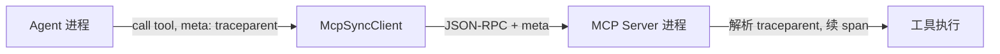

---

## 11. 分布式 Trace（OpenTelemetry）

### 11.1 总体集成

> Spring AI 2.0 内置基于 **Micrometer Observation** + OpenTelemetry 的 trace（见 [15-可观测性](./15-可观测性与成本治理.md) §2）。我们的 `AgentEvent` 携带 `traceId/spanId/parentSpanId`，与 OTel 的 W3C TraceContext 对齐，实现「事件」和「trace span」双向关联。

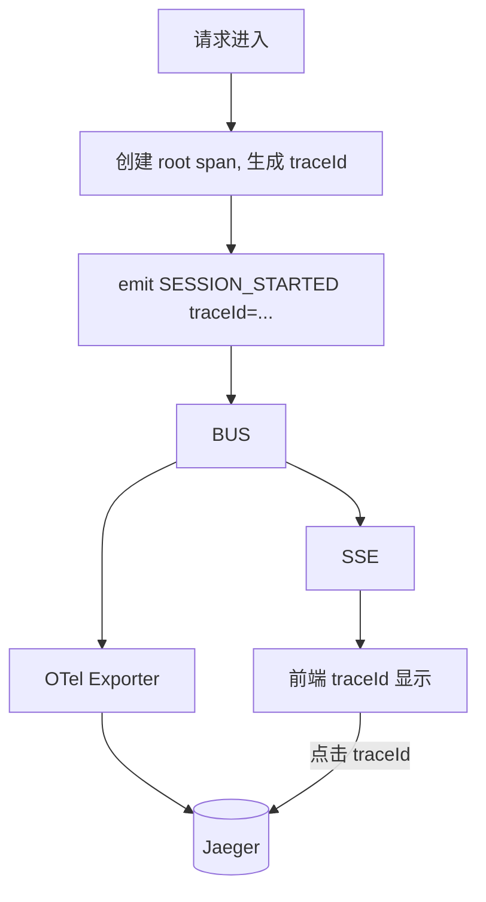

### 11.2 TraceContext 工具类

```java
// 设计示意：说明类职责与调用关系，落地需补全 import/异常/配置
package org.demo02.toolkit.observability;

import io.micrometer.observation.Observation;
import io.micrometer.observation.ObservationRegistry;
import io.opentelemetry.api.trace.Span;
import io.opentelemetry.api.trace.SpanContext;

/**
 * 从当前线程的 OTel Span 取 traceId/spanId，写入 AgentEvent。
 * 依赖 micrometer-observation + opentelemetry-api（Spring Boot 4 自动装配）。
 */
public final class TraceContext {
    private TraceContext() {}

    /** 取当前 OTel span 的 traceId；无活跃 span 返回 null。 */
    public static String currentTraceId() {
        Span span = Span.current();
        if (span == null) return null;
        SpanContext ctx = span.getSpanContext();
        return ctx.isValid() ? ctx.getTraceId() : null;
    }

    public static String currentSpanId() {
        Span span = Span.current();
        if (span == null) return null;
        SpanContext ctx = span.getSpanContext();
        return ctx.isValid() ? ctx.getSpanId() : null;
    }
}
```

### 11.3 跨进程传播（MCP）

> 用 OTel 的 `W3CTraceContextPropagator` 把 `traceparent` 注入 MCP 请求 metadata：

```java
// 设计示意：说明类职责与调用关系，落地需补全 import/异常/配置
import io.opentelemetry.context.Context;
import io.opentelemetry.extension.trace.propagation.W3CTraceContextPropagator;
import java.util.HashMap;
import java.util.Map;

public class McpTracePropagator {
    /** 注入：把当前 context 序列化成 traceparent，塞进 MCP meta。 */
    public static Map<String, String> inject(Context context) {
        Map<String, String> carrier = new HashMap<>();
        W3CTraceContextPropagator.getInstance().inject(context, carrier,
                (c, k, v) -> c.put(k, v));
        return carrier; // 形如 {traceparent: 00-<traceId>-<spanId>-01}
    }

    /** 提取：MCP Server 端从 meta 恢复 context（Server 侧代码）。 */
    public static Context extract(Context parent, Map<String, String> meta) {
        return W3CTraceContextPropagator.getInstance().extract(parent, meta,
                (c, k) -> c.get(k));
    }
}
```

> 这是 OTel 标准 API（`io.opentelemetry.extension.trace.propagation.W3CTraceContextPropagator`），非臆造。

---

## 12. 多租户与成本治理

### 12.1 TenantContext ThreadLocal

```java
// 设计示意：说明类职责与调用关系，落地需补全 import/异常/配置
package org.demo02.toolkit.tenant;

public final class TenantContext {
    private static final ThreadLocal<String> TENANT = new ThreadLocal<>();

    public static void setTenant(String tenantId) { TENANT.set(tenantId); }
    public static String currentTenant() { return TENANT.get(); }
    public static void clear() { TENANT.remove(); }
}
```

> ⚠️ **WebFlux 下 `ThreadLocal` 会丢——这是本方案最初版本最大的隐患**。本仓库 `demo06` 的 Workflow（如 [`OrchestratorService.java`](../../../src/main/java/org/demo06/workflows/OrchestratorService.java) `Mono.fromCallable(...).block()`）会在 `boundedElastic` 线程池执行，线程一切换 `ThreadLocal` 就空，导致：
> - SSE 端 `tenantId` 过滤失效 → A 租户可能看到 B 租户的事件（**越权泄漏**）
> - `sessionId` 丢失 → 事件归到 `unknown`，进度条断
>
> 生产必须用下面的两种方案之一，不能裸用 `ThreadLocal`。

**方案 A（推荐）：Reactor `Context` + `Mono.deferContextual`** —— 纯响应式编排用它：

```java
// 设计示意：说明类职责与调用关系，落地需补全 import/异常/配置
// 入口把 tenantId/sessionId 写入 Reactor Context，链路里用 deferContextual 读取
public Mono<String> runReactive(String input, String tenantId, String sessionId) {
    return Mono.deferContextual(ctx -> {
        String tenant = ctx.getOrDefault("tenantId", "default");
        String sid = ctx.getOrDefault("sessionId", "unknown");
        emitter.emit(AgentEvent.builder()
                .sessionId(sid).tenantId(tenant)
                .type(AgentEvent.EventType.WORKFLOW_PHASE)
                .phase("run").source("workflow").build());
        return Mono.fromCallable(() -> doWork(input));
    })
    .contextWrite(reactor.util.context.Context.of(
            "tenantId", tenantId, "sessionId", sessionId));
}
```

**方案 B（阻塞式 Workflow 必备）：Micrometer ContextPropagation** —— 当 Workflow 内部用 `block()`/`fromCallable` 切线程时，让 `ThreadLocal` 跨线程自动传播。

> Micrometer ContextPropagation（`io.micrometer.context`，已核实 `context-propagation-1.2.1` 在本地仓库）提供 `ContextRegistry.registerThreadLocalAccessor` + `ContextSnapshot`，配合 Reactor 的 `Hooks.enableAutomaticContextPropagation()`，能让 `TenantContext` 这类 `ThreadLocal` 在 `flatMap`/`subscribeOn`/`publishOn` 切线程时**自动恢复**。这是 Spring Boot 4 + WebFlux 的标准做法。

```java
// 设计示意：说明类职责与调用关系，落地需补全 import/异常/配置
// 1. 启动时注册 ThreadLocalAccessor + 开启自动传播
import io.micrometer.context.ContextRegistry;
import reactor.core.publisher.Hooks;

@Configuration
public class ContextPropagationConfig {
    @PostConstruct
    public void init() {
        ContextRegistry registry = ContextRegistry.getInstance();
        // 注册 TenantContext 为可传播的 ThreadLocal（registerThreadLocalAccessor 已核实）
        registry.registerThreadLocalAccessor("tenantId",
                TenantContext::currentTenant,
                TenantContext::setTenant,
                TenantContext::clear);
        // 让 Reactor 操作符自动跨线程传播（依赖 reactor-core 3.5+ + context-propagation）
        Hooks.enableAutomaticContextPropagation();
    }
}

// 2. 此后在任何 Mono/Flux 链路里，TenantContext.currentTenant() 都能正确读到
//    即使经过 Mono.fromCallable(...).subscribeOn(boundedElastic()) 切了线程
public String runBlocking(String input, String sessionId) {
    // TenantContext 由上层响应式入口（带 Context）自动设置，此处直接读
    String tenant = TenantContext.currentTenant();  // 不会是 null
    emitter.emit(AgentEvent.builder()
            .sessionId(sessionId).tenantId(tenant)
            .type(AgentEvent.EventType.WORKFLOW_PHASE).phase("run").source("workflow").build());
    return doWork(input);
}
```

> **API 核实**：`ContextRegistry.registerThreadLocalAccessor(String, Supplier, Consumer, Runnable)`、`ContextSnapshot.captureAll()`、`Hooks.enableAutomaticContextPropagation()` 均来自 `context-propagation-1.2.1.jar` + `reactor-core-3.7.19.jar`，已反编译确认存在。
>
> **选择**：纯响应式编排用方案 A；包含 `block()`/`fromCallable` 阻塞步骤（本仓库 `demo06` Workflow 就是）用方案 B。两者可共存——方案 A 写入 Reactor Context，方案 B 让它桥接到 ThreadLocal 供阻塞代码读。

### 12.2 成本计量（TokenMeterAdvisor）

> 在 Advisor 链统一算 token，三种编排模式共用。基于 [15](./15-可观测性与成本治理.md) §6.2 的思路。

```java
// 设计示意：说明类职责与调用关系，落地需补全 import/异常/配置
package org.demo02.toolkit.observability.cost;

import org.demo02.toolkit.observability.AgentEvent;
import org.demo02.toolkit.observability.AgentEventEmitter;
import org.springframework.ai.chat.client.ChatClientResponse;
import org.springframework.ai.chat.client.ChatClientMessageAggregator;
import org.springframework.ai.chat.metadata.Usage;
import reactor.core.publisher.Flux;

/**
 * 成本计量：旁路聚合每次 LLM 调用的 Usage，发 LLM_TOKENS 事件，累加到 session 成本。
 */
public class TokenMeterAdvisor {

    private final AgentEventEmitter emitter;
    private final SessionCostRegistry costRegistry;

    public TokenMeterAdvisor(AgentEventEmitter emitter, SessionCostRegistry costRegistry) {
        this.emitter = emitter;
        this.costRegistry = costRegistry;
    }

    /** 应用到流式响应：旁路聚合，返回原主流。 */
    public Flux<ChatClientResponse> apply(Flux<ChatClientResponse> flux, String sessionId, String phase) {
        return new ChatClientMessageAggregator().aggregateChatClientResponse(flux, aggregated -> {
            Usage u = aggregated.chatResponse().getMetadata().getUsage();
            if (u == null) return;
            int pt = u.getPromptTokens() == null ? 0 : u.getPromptTokens();
            int ct = u.getCompletionTokens() == null ? 0 : u.getCompletionTokens();
            double cost = costRegistry.add(sessionId, pt, ct, aggregated.chatResponse().getMetadata().getModel());
            emitter.emit(AgentEvent.builder()
                    .sessionId(sessionId).type(AgentEvent.EventType.LLM_TOKENS)
                    .phase(phase).source("chatclient")
                    .data("promptTokens", pt).data("completionTokens", ct)
                    .data("totalTokens", pt + ct)
                    .data("sessionCostUsd", cost)
                    .data("model", aggregated.chatResponse().getMetadata().getModel())
                    .build());
        });
    }
}
```

`SessionCostRegistry`（按 model 单价表算钱，单价来自 [15](./15-可观测性与成本治理.md) §6.1）的完整实现——含预扣/核销的并发安全版本——在 §12.3 给出。下面先讲配额控制。

### 12.3 QuotaService（配额控制 + 预扣，解决并发超支）

> ⚠️ **本节修正了初版的一个并发漏洞**：初版只在 `LLM_TOKENS` 旁路回调里 `check`，但旁路聚合是**异步**的——`Usage` 事件可能晚于「下一次 LLM 调用发起」才到达。高并发或单会话连续调用时，`check` 看到的 `used` 是滞后值，配额会**超额透支**。
>
> **正确做法**：双层配额——**预扣（reserved budget，硬拦截）+ 事后核销（旁路 token，告警/对账）**。
>
> ⚠️ **规模化补丁（§17.10）**：下方 `SessionCostRegistry` 用进程内 `ConcurrentHashMap` 存成本——多实例下「请求落实例 B、成本计数在实例 A」会让预扣失效。生产必须把 per-session 可变状态（成本/turn/取消标志）外置到 Redis（`SessionStateStore`），实现见 §17.10。下方的内存版仅作单实例原理演示。

```java
// 设计示意：说明类职责与调用关系，落地需补全 import/异常/配置
public class QuotaService {
    private final SessionCostRegistry costRegistry;
    private final double budgetPerSessionUsd;
    /** 每次发起 LLM 调用前，预扣的估算额度（按历史平均 token 估算，偏保守）。 */
    private final double reservePerCallUsd;

    public QuotaService(SessionCostRegistry costRegistry,
                        double budgetPerSessionUsd, double reservePerCallUsd) {
        this.costRegistry = costRegistry;
        this.budgetPerSessionUsd = budgetPerSessionUsd;
        this.reservePerCallUsd = reservePerCallUsd;
    }

    /**
     * 预扣：每次发起 LLM 调用【之前】同步调用。超限直接拒绝，是硬拦截。
     * 用原子 CAS 保证并发安全（同会话并发 turn 也不会超扣）。
     */
    public void reserve(String sessionId, AgentEventEmitter emitter) {
        boolean ok = costRegistry.tryReserve(sessionId, reservePerCallUsd, budgetPerSessionUsd);
        if (!ok) {
            emitter.emit(AgentEvent.builder()
                    .sessionId(sessionId).type(AgentEvent.EventType.QUOTA_EXCEEDED)
                    .phase("quota").source("cost")
                    .criticality(AgentEvent.Criticality.CRITICAL)  // 超限是终态类，绝不丢
                    .data("used", costRegistry.get(sessionId))
                    .data("limit", budgetPerSessionUsd)
                    .data("reason", "reserve-rejected").build());
            throw new QuotaExceededException("会话预算预扣失败，已用 " + costRegistry.get(sessionId));
        }
    }

    /**
     * 核销：旁路 LLM_TOKENS 到达后调用，把「实际 token 成本」加到 used，
     * 同时释放预扣多估的部分。用于对账 + 告警（不用于硬拦截）。
     */
    public void settle(String sessionId, double actualCostUsd) {
        costRegistry.settle(sessionId, reservePerCallUsd, actualCostUsd);
    }

    public static class QuotaExceededException extends RuntimeException {
        public QuotaExceededException(String msg) { super(msg); }
    }
}
```

`SessionCostRegistry` 配合预扣/核销的并发安全实现（基于 `ConcurrentHashMap` + `synchronized` per session）：

```java
// 设计示意：说明类职责与调用关系，落地需补全 import/异常/配置
public class SessionCostRegistry {
    private final Map<String, Double> per1k = Map.of("deepseek-chat", 0.001, "gpt-4o", 0.005);
    private final Map<String, Account> sessionCost = new ConcurrentHashMap<>();

    /** 预扣：原子地检查「已用 + 本次预扣 <= 预算」，成功则记账。 */
    public boolean tryReserve(String sessionId, double reserve, double budget) {
        Account acc = sessionCost.computeIfAbsent(sessionId, k -> new Account());
        synchronized (acc) {
            if (acc.used + acc.reserved + reserve > budget) return false;
            acc.reserved += reserve;
            return true;
        }
    }

    /** 核销：减去预扣、加上实际成本。 */
    public void settle(String sessionId, double reserve, double actual) {
        Account acc = sessionCost.get(sessionId);
        if (acc == null) return;
        synchronized (acc) {
            acc.reserved -= reserve;
            acc.used += actual;
        }
    }

    public double get(String sessionId) {
        Account acc = sessionCost.get(sessionId);
        return acc == null ? 0.0 : acc.used + acc.reserved;
    }

    public double add(String sessionId, int promptTokens, int completionTokens, String model) {
        double rate = per1k.getOrDefault(model == null ? "" : model, 0.003);
        double cost = (promptTokens + completionTokens) / 1000.0 * rate;
        Account acc = sessionCost.computeIfAbsent(sessionId, k -> new Account());
        synchronized (acc) { acc.used += cost; return acc.used + acc.reserved; }
    }

    private static final class Account {
        double used = 0.0;      // 已实际核销
        double reserved = 0.0;  // 预扣未核销
    }
}
```

> **调用顺序**（在每个会发起 LLM 调用的采集点）：
> 1. `quota.reserve(sessionId)` —— 预扣，超限直接抛（硬拦截）
> 2. 发起 LLM 调用
> 3. 旁路 `LLM_TOKENS` 到达 → `costRegistry.add` 算实际成本 → `quota.settle` 核销
>
> 这样即使 token 事件延迟到达，预扣也已经占了预算，不会并发超支。三重保护（[14-安全工程与红队](./14-安全工程与红队.md)）：`maxTurns`（§9.2）+ 预算预扣（本节）+ 死循环检测（重复 tool args 检测），本方案把前两者的决策点都可视化成事件。

---

## 13. 流式场景特殊处理

### 13.1 content 流 + event 流 merge

> 用户既要看进度（事件），又要看正文（逐字输出）。两路 merge 成一条 SSE：

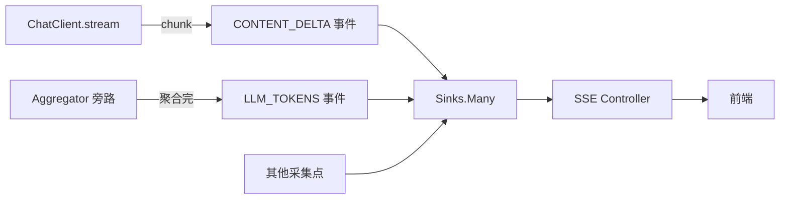

实现：流式正文每个 chunk 也 `emit` 成 `CONTENT_DELTA`，进总线后和其他事件统一排序：

```java
// 设计示意：说明类职责与调用关系，落地需补全 import/异常/配置
public Flux<AgentEvent> streamWithEvents(Flux<ChatClientResponse> flux, String sessionId) {
    // 主流：每个 chunk 发 CONTENT_DELTA
    Flux<AgentEvent> deltas = flux.map(resp -> {
        String text = resp.chatResponse().getResult().getOutput().getText();
        return AgentEvent.builder()
                .sessionId(sessionId).type(AgentEvent.EventType.CONTENT_DELTA)
                .phase("stream").source("chatclient")
                .data("text", text == null ? "" : text).build();
    });
    // 旁路：聚合后发 LLM_TOKENS（不重复消费，§4.5）
    TokenMeter.tap(flux, new TokenMeter(emitter, sessionId, "stream")).subscribe(); // 旁路订阅
    return deltas;
}
```

> ⚠️ 旁路 `subscribe()` 会创建独立订阅——这里 `aggregateChatClientResponse` 内部会处理为透传，但为避免 cold 流重复调 LLM，**务必确保 `flux` 是 hot 或只被消费一次**。生产推荐：用 `ConnectableFlux`/`publish().refCount()` 共享上游，或把旁路逻辑放进主流的 `doOnNext`。§4.5 的 `tap()` 返回透传流是更安全的写法。

### 13.2 SSE 帧大小控制

- 每个事件的 `data` 大字段（工具结果、LLM 输出）**必须截断**（`Truncator`），单帧 ≤ 2KB。
- `CONTENT_DELTA` 每帧只放一个 chunk，天然小。
- Nginx 默认 `proxy_buffer_size` 4KB，超出会截断 SSE。配置见 §16.4。

---

## 14. 前端集成协议

### 14.1 SSE event 类型表（前端契约）

| SSE event 名 | data 关键字段 | 前端渲染建议 |
|--------------|--------------|-------------|
| `SESSION_STARTED` | `input`, `sessionId`, `traceId` | 顶部显示输入 + 可点 traceId 跳 Jaeger |
| `WORKFLOW_PHASE` | `phase`, `stepName`, `input`/`output` | 时间线：步骤卡片 |
| `GRAPH_NODE_START`/`END` | `nodeName`, `step`, `durationMs` | 状态机高亮当前节点 |
| `GRAPH_EDGE` | `from`, `to` | 画箭头连线 |
| `AGENT_TURN_START`/`END` | `turnIndex` | 循环计数器 |
| `TOOL_CALL_START`/`END`/`FAILED` | `tool`, `args`, `result`, `durationMs` | 工具卡片（折叠 args/result） |
| `MCP_CALL_*` | `server`, `tool`, `traceId` | MCP 卡片 + 跨进程 trace 链接 |
| `LLM_TOKENS` | `promptTokens`, `completionTokens`, `sessionCostUsd` | 成本计数器 |
| `CONTENT_DELTA` | `text` | 主答案区逐字渲染 |
| `SESSION_COMPLETED`/`FAILED` | `output`/`error`, `totalTokens`, `costUsd` | 终态 |
| `QUOTA_EXCEEDED` | `used`, `limit` | 告警 + 停止 |

### 14.2 JavaScript 消费示例（EventSource）

```javascript
// 设计示意：说明类职责与调用关系，落地需补全 import/异常/配置
function subscribe(sessionId, tenantId) {
  const es = new EventSource(`/agent/events/${sessionId}`, {
    withCredentials: true
  });
  // 可选：带 tenant 头需用 fetch+ReadableStream（EventSource 不支持自定义头）
  // 这里用 query param 退化方案
  const es2 = new EventSource(`/agent/events/${sessionId}?tenantId=${tenantId}`);

  const handlers = {
    SESSION_STARTED: (d) => ui.setHeader(d.input, d.traceId),
    WORKFLOW_PHASE:  (d) => ui.addStep(d.phase, d.stepName, d.input, d.output),
    GRAPH_NODE_START:(d) => ui.highlightNode(d.nodeName),
    GRAPH_EDGE:      (d) => ui.drawEdge(d.from, d.to),
    TOOL_CALL_START: (d) => ui.addToolCard(d.tool, d.args),
    TOOL_CALL_END:   (d) => ui.completeToolCard(d.tool, d.result, d.durationMs),
    MCP_CALL_END:    (d) => ui.addMcpCard(d.server, d.tool, d.traceId),
    LLM_TOKENS:      (d) => ui.updateCost(d.sessionCostUsd, d.totalTokens),
    CONTENT_DELTA:   (d) => ui.appendAnswer(d.text),
    SESSION_COMPLETED:(d)=> ui.finish(d.output, d.costUsd),
    SESSION_FAILED:  (d) => ui.error(d.error),
    QUOTA_EXCEEDED:  (d) => ui.warnQuota(d.used, d.limit)
  };

  // 为每种 event 名注册监听（SSE 的 event: 行 = AgentEvent.type）
  Object.keys(handlers).forEach(name => {
    es2.addEventListener(name, (e) => {
      handlers[name](JSON.parse(e.data));
    });
  });

  es2.onerror = () => { /* EventSource 会自动重连 */ };
  return es2;
}
```

> `EventSource` 的 `addEventListener(name, ...)` 对应 SSE 帧里的 `event: <name>` 行——我们的 Controller 正是用 `AgentEvent.type.name()` 作 SSE event 名（§6.1），前端按类型分发。

### 14.3 UI 组件建议（ASCII mockup）

```
┌─────────────────────────────────────────────────────────┐
│ 🤖 Agent 会话  s1   [trace: a1b2c3 ↗]   💰 $0.0021      │
├─────────────────────────────────────────────────────────┤
│ ▶ 输入：查北京天气并写一句诗                              │
│                                                         │
│ 时间线                                                   │
│  ✓ orchestrator-plan    拆出 2 个子任务                  │
│    └─ subtask: 查天气                                    │
│       ✓ TOOL getWeather(args:{city:北京})  120ms        │
│       ✓ MCP  weather-mcp/forecast          340ms ↗trace │
│    └─ subtask: 写诗                                      │
│       ⟳ LLM 生成中...  token: 520+48                    │
│                                                         │
│ 答案区（逐字）                                           │
│  北京晴空万里，_________________________               │
└─────────────────────────────────────────────────────────┘
```

- **时间线**：`WORKFLOW_PHASE` / `GRAPH_*` / `TOOL_*` / `MCP_*` 按时间排序成卡片。
- **答案区**：`CONTENT_DELTA` 逐字追加。
- **顶栏**：traceId 可点跳 Jaeger；成本实时更新（`LLM_TOKENS`）。
- **状态机视图**（Graph 模式）：节点高亮 + 边动画（`GRAPH_EDGE`）。

---

## 15. 可观测性平台集成

> 三路输出：SSE（给前端）+ Langfuse（给 AI 团队）+ OTel/Jaeger（给 SRE）。共享同一个 `AgentEvent` 流。

### 15.1 三路输出总结

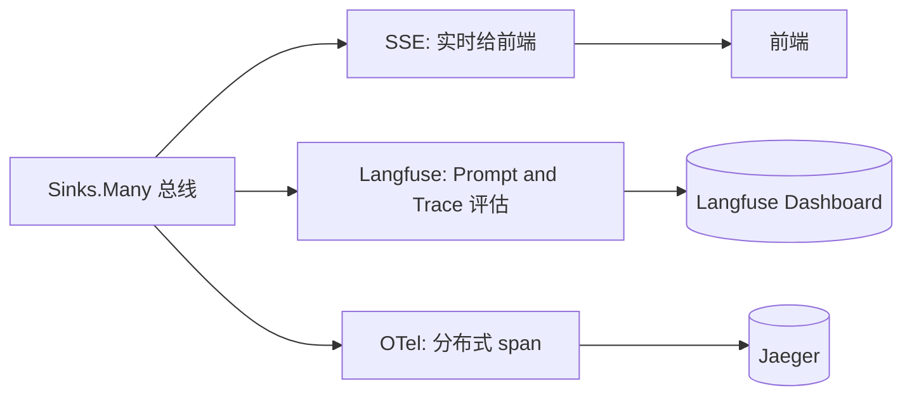

| 消费者 | 关注 | 实现方式 |
|--------|------|---------|
| SSE Controller | 实时、单会话 | `bus.asFlux().filter(sessionId)` |
| Langfuse | Prompt 血缘、成本、评估 | `bus.asFlux().subscribe(LangfuseCollector)` |
| OTel/Jaeger | 分布式 trace、p99 | `bus.asFlux()` + Spring AI 内置 Observation |

### 15.2 Langfuse 消费者（旁路订阅，零改动业务）

```java
// 设计示意：说明类职责与调用关系，落地需补全 import/异常/配置
@Component
public class LangfuseCollector {
    private final AgentEventBus bus;

    public LangfuseCollector(AgentEventBus bus) {
        this.bus = bus;
        bus.asFlux()
           .filter(e -> e.type() == AgentEvent.EventType.SESSION_COMPLETED
                     || e.type() == AgentEvent.EventType.LLM_TOKENS)
           .subscribe(this::toLangfuse);
    }

    private void toLangfuse(AgentEvent e) {
        // 调 Langfuse REST API ingestion（Langfuse 自托管地址）
        // 只摘关键字段：traceId、phase、token、cost
        // 详见 15-可观测性与成本治理 §8.2
    }
}
```

> 这是总线模式的最大红利：**加 Langfuse 消费者完全不动采集层和 SSE 层**。若用 Flux.concat 直编排，加一个消费者要么改业务、要么忍受重复调 LLM（§2.3）。

### 15.3 与 Spring AI 内置 Observation 的关系

- Spring AI 2.0 的 `ChatModel` / `Advisor` 自带 Micrometer Observation（[15](./15-可观测性与成本治理.md) §2），会自动产 span。
- 我们的 `AgentEvent` 是**业务语义层**（「第 3 步」「调了 weather 工具」），OTel span 是**技术层**（「一次 HTTP 到 LLM 的调用」）。两者通过 `traceId` 关联——前端点 traceId 能在 Jaeger 看到 span 细节，在时间线看到业务语义。

---

## 16. 部署与运维

### 16.1 单实例部署

- `cross-instance=false`，纯进程内总线。
- SSE 连接数受 JVM 线程/连接池限制，单实例约支撑几百并发 SSE。
- 适合：内部工具、开发环境、小流量生产。

### 16.2 多实例部署（Redis Stream）

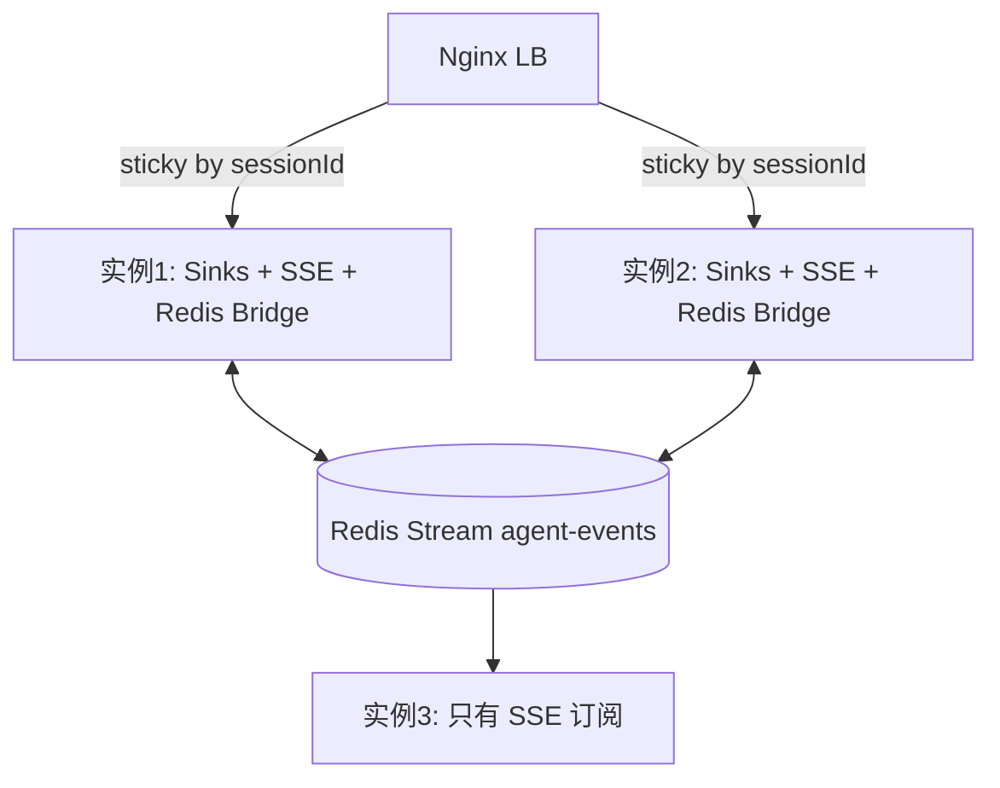

- `cross-instance=true`，每实例的 `emit` 都 `XADD` 到 Redis Stream。
- SSE 实例 `XREADGROUP` 拉取所有事件，按 sessionId 过滤后推前端。
- **sticky session 不是必须**：即使请求落在实例 B、SSE 连在实例 A，事件经 Redis Stream 也能到 A。

### 16.3 Redis Stream 持久化与清理

- Stream 默认无上限，需配 `MAXLEN` 防膨胀：

```java
// 设计示意：说明类职责与调用关系，落地需补全 import/异常/配置
// publish 时限制流长度（近似裁剪）
redis.opsForStream().add(STREAM_KEY, body);
// 定期（如每小时）裁剪：保留最近 100000 条
redis.opsForStream().trim(STREAM_KEY, 100_000);
```

- 事件 ACK 后仍留在 stream（用于重放/审计），靠 `trim` 清理。

### 16.4 Nginx 配置（SSE 长连接）

```nginx
# 本配置仅作学习材料参考
location /agent/events/ {
    proxy_pass http://backend;
    proxy_http_version 1.1;
    proxy_set_header Connection "";
    proxy_buffering off;          # 关键：关缓冲，chunk 立即转发
    proxy_cache off;
    proxy_read_timeout 1800s;     # 30 分钟，匹配 SSE timeout
    chunked_transfer_encoding on;
}
```

### 16.5 水平扩容注意事项

- **连接数**：每实例 SSE 连接数是瓶颈，按 `(实例数 × 单实例连接数)` 扩。
- **Redis Stream 吞吐**：单 Redis 实例 stream 约 10w ops/s，足够大多数场景；超大流量用 Redis Cluster 分片（按 sessionId hash 分片 stream key）。
- **WebSocket 扩展**：若需前端中途取消/注入消息，加一个 `WebSocketHandler` 走单独 endpoint，SSE 仍做单向推送。

### 16.6 监控告警

| 指标 | 阈值 | 含义 |
|------|------|------|
| `agent_event_emit_failures_total` | >0/min | 总线背压满，事件丢失 |
| `sse_active_connections` | 单实例 > 500 | 连接接近上限 |
| `session_cost_usd{session}` | > budget | 触发 `QUOTA_EXCEEDED` |
| `agent_turn_count{session}` | > maxTurns | 循环超限 |
| `redis_stream_lag_ms` | > 1000 | 跨实例事件延迟过高 |
| `mcp_call_duration_ms{server}` | p99 > 5000 | 某 MCP Server 慢 |

---

## 17. 企业级生产加固（从「能跑」到「能上线」）

> 前面 §1–§16 给的是「教程级」方案。本节补齐 9 个生产阻断/可用性缺口，是这套架构**真正上生产前必须补**的部分。每个小节都和前面的章节有交叉引用，构成完整闭环。

### 17.1 事件顺序保证（解决乱序）

**问题**：`Sinks.Many.multicast()` 不保证跨采集点的到达顺序。真实场景里 `TOOL_CALL_START`（工具装饰器，可能在 `boundedElastic` 线程）和 `WORKFLOW_PHASE`（编排主线程）可能乱序；多实例下 Redis Stream 跨实例事件更无全局序。前端看到「结束先于开始」= 进度条倒跳。

**方案**：会话内单调递增 `sequence`（§3.1 已加字段）+ SSE 端 `EventSequencer` 重排。

```java
// 设计示意：说明类职责与调用关系，落地需补全 import/异常/配置
package org.demo02.toolkit.observability.replay;

import org.demo02.toolkit.observability.AgentEvent;
import reactor.core.publisher.Flux;

import java.time.Duration;
import java.util.Map;
import java.util.PriorityQueue;
import java.util.concurrent.ConcurrentHashMap;

/**
 * 按会话内 sequence 重排事件。用「乱序容忍窗口」：
 * 等待 windowMs 内若收到更小序号的事件则先输出小的，超时则强制输出当前最小。
 * 单实例下 sequence 严格递增（总线原子分配，§5.1），基本不乱序；
 * 多实例下跨实例事件需额外按 sequence 重排。
 */
public class EventSequencer {

    private final Duration window;
    private final Map<String, PriorityQueue<AgentEvent>> buffers = new ConcurrentHashMap<>();
    private final Map<String, Long> lastEmitted = new ConcurrentHashMap<>();

    public EventSequencer(Duration window) { this.window = window; }

    public Flux<AgentEvent> reorder(Flux<AgentEvent> in) {
        return in.bufferTimeout(64, window)        // 攒批或超窗口
                .flatMap(batch -> Flux.fromIterable(reorderBatch(batch)));
    }

    /** 单批内按 sequence 排序输出（跨批可能仍乱序，需结合 timestamp 兜底）。 */
    private java.util.List<AgentEvent> reorderBatch(java.util.List<AgentEvent> batch) {
        if (batch.isEmpty()) return batch;
        String sid = batch.get(0).sessionId();
        PriorityQueue<AgentEvent> pq = buffers.computeIfAbsent(sid,
                k -> new PriorityQueue<>(java.util.Comparator.comparingLong(AgentEvent::sequence)));
        pq.addAll(batch);
        java.util.List<AgentEvent> out = new java.util.ArrayList<>();
        long expected = lastEmitted.getOrDefault(sid, 0L) + 1;
        while (!pq.isEmpty() && pq.peek().sequence() <= expected) {
            AgentEvent e = pq.poll();
            out.add(e);
            lastEmitted.put(sid, e.sequence());
            expected = e.sequence() + 1;
        }
        return out;
    }
}
```

> **权衡**：重排窗口越大越有序但延迟越高。生产建议 50–100ms（人眼几乎无感，又能吸收跨线程抖动）。多实例下若要求严格全局序，需用 Redis Stream 的 stream-id 作 sequence（天然有序），代价是单实例吞吐受限于单 Redis 分片。

### 17.2 背压分级降级（解决「丢关键事件」）

**问题**：初版背压满时静默丢弃所有事件——`SESSION_COMPLETED` 丢了前端永远转圈，`QUOTA_EXCEEDED` 丢了配额保护失效。

**方案**：事件 `criticality` 三级（§3.1 已加），分级处理。完整链路已在 §5.1（emit 落库）+ §6.3（背压图）落地。这里补 `CriticalEventFallback`：

```java
// 设计示意：说明类职责与调用关系，落地需补全 import/异常/配置
package org.demo02.toolkit.observability.replay;

import org.demo02.toolkit.observability.AgentEvent;
import org.springframework.data.redis.core.StringRedisTemplate;
import org.springframework.beans.factory.annotation.Autowired;
import org.springframework.beans.factory.ObjectProvider;

import java.time.Duration;

public class CriticalEventFallback {

    private final ObjectProvider<StringRedisTemplate> redis;   // 单实例可空
    private static final Duration TTL = Duration.ofMinutes(30); // 供 SSE 重连回放

    public CriticalEventFallback(ObjectProvider<StringRedisTemplate> redis) {
        this.redis = redis;
    }

    /** CRITICAL 必落库；NORMAL 采样落库（如 10%）；DISCARDABLE 不落。 */
    public void persist(AgentEvent e) {
        if (e.criticality() == AgentEvent.Criticality.DISCARDABLE) return;
        if (e.criticality() == AgentEvent.Criticality.NORMAL
                && java.util.concurrent.ThreadLocalRandom.current().nextInt(10) != 0) return; // 10% 采样
        StringRedisTemplate tpl = redis.getIfAvailable();
        if (tpl == null) return; // 单实例无 Redis，跳过
        String key = "events:" + e.sessionId();
        try {
            String json = new com.fasterxml.jackson.databind.ObjectMapper().writeValueAsString(e);
            // Sorted Set: score = sequence，成员 = JSON；天然按序，便于回放（§17.3）
            tpl.opsForZSet().add(key, json, e.sequence());
            tpl.expire(key, TTL);
        } catch (Exception ignore) {
            // 落库失败不能影响主链路
        }
    }
}
```

> **API 核实**：`StringRedisTemplate.opsForZSet().add(key, member, score)`、`expire(key, Duration)` 是 `spring-data-redis-4.1.0` 真实 API。

### 17.3 SSE 断线重连 + 事件回放

**问题**：网络抖动断连期间的事件，`Sinks.Many`（Hot）不会重发，前端 `EventSource` 自动重连后只能拿到「重连之后」的事件，中间进度丢失。

**方案**：`Last-Event-ID` + `EventReplayStore`。Controller 已在 §6.1 接入 `replayAfter`，这里给实现（复用 §17.2 的 Sorted Set）：

```java
// 设计示意：说明类职责与调用关系，落地需补全 import/异常/配置
package org.demo02.toolkit.observability.replay;

import com.fasterxml.jackson.databind.ObjectMapper;
import org.demo02.toolkit.observability.AgentEvent;
import org.springframework.data.redis.core.StringRedisTemplate;
import org.springframework.data.redis.core.ZSetOperations;

import java.util.ArrayList;
import java.util.List;
import java.util.Set;

public class EventReplayStore {

    private final StringRedisTemplate redis;
    private final ObjectMapper mapper = new ObjectMapper();

    public EventReplayStore(StringRedisTemplate redis) { this.redis = redis; }

    /**
     * 回放某会话中，eventId 之后的所有已落库事件。
     * Last-Event-ID 是 eventId（UUID），需先在 Sorted Set 里定位它的 sequence。
     */
    public List<AgentEvent> replayAfter(String sessionId, String lastEventId) {
        String key = "events:" + sessionId;
        Set<ZSetOperations.TypedTuple<String>> all = redis.opsForZSet().rangeWithScores(key, 0, -1);
        if (all == null) return List.of();
        List<AgentEvent> out = new ArrayList<>();
        boolean found = (lastEventId == null);
        for (ZSetOperations.TypedTuple<String> t : all) {
            String json = t.getValue();
            if (json == null) continue;
            try {
                AgentEvent e = mapper.readValue(json, AgentEvent.class);
                if (!found) {
                    if (e.eventId().equals(lastEventId)) found = true; // 命中断点，之后开始输出
                    continue;
                }
                out.add(e);
            } catch (Exception ignore) {}
        }
        return out;
    }
}
```

> **前端配合**（§14.2 已有 EventSource 示例）：浏览器 `EventSource` **自动**在重连时带 `Last-Event-ID` 头（值是最后一帧的 `id:` 行，即我们的 `eventId`）。所以前端零改动即可享受回放——这是 SSE 标准的红利，前提是后端每帧都设了 `id:`（§6.1 `toSse` 已设）。

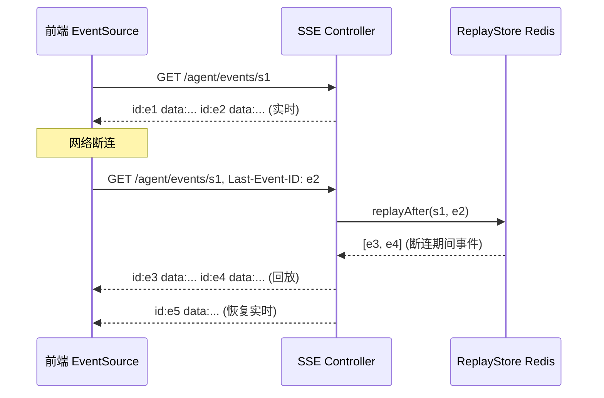

### 17.4 取消与反向通道（用户中途喊停）

**问题**：纯 SSE 单向，用户「已花 $2 想停」无法传达给编排侧。

**方案**：取消走独立 POST（轻量），消息注入才需要 WebSocket。Controller：

```java
// 设计示意：说明类职责与调用关系，落地需补全 import/异常/配置
@RestController
@RequestMapping("/agent")
public class AgentCancelController {

    private final AgentEventBus bus;
    private final SessionRegistry sessions;   // 跟踪活跃会话，用于实际中止

    public AgentCancelController(AgentEventBus bus, SessionRegistry sessions) {
        this.bus = bus; this.sessions = sessions;
    }

    /** 用户/系统取消某会话。 */
    @PostMapping("/cancel/{sessionId}")
    public Map<String, Object> cancel(@PathVariable String sessionId,
                                      @RequestHeader(value = "X-Tenant-Id", required = false) String tenantId,
                                      @RequestParam(defaultValue = "user") String by) {
        sessions.requestCancel(sessionId);   // 编排侧轮询/订阅此标志中止
        bus.emit(AgentEvent.builder()
                .sessionId(sessionId).tenantId(tenantId)
                .type(AgentEvent.EventType.SESSION_CANCELLED)
                .phase("session").source("workflow")
                .criticality(AgentEvent.Criticality.CRITICAL)   // 终态，必达
                .data("cancelledBy", by).data("reason", "user-cancel")
                .build());
        return Map.of("cancelled", true, "sessionId", sessionId);
    }
}
```

编排侧（如 §9.2 的 `MaxTurnsGuard`）在每轮检查取消标志：

```java
// 设计示意：说明类职责与调用关系，落地需补全 import/异常/配置
public void checkCancel(String sessionId) {
    if (sessions.isCancelRequested(sessionId)) {
        throw new SessionCancelledException("用户已取消");
    }
}
```

> SSE 端收到 `SESSION_CANCELLED`（§6.1 `isTerminal` 已纳入）自动优雅结束流，前端显示「已取消」。

### 17.5 事件持久化与审计（合规 + 复盘）

**问题**：事件「阅后即焚」无法满足合规审计（金融/医疗留痕）、事故复盘、训练数据沉淀。

**方案**：区分 hot path 和 cold path 三路输出（§15 已给消费者框架，这里明确职责）：

| 路径 | 存储 | 内容 | TTL | 用途 |
|------|------|------|-----|------|
| Hot path | Redis Sorted Set | CRITICAL + 采样 NORMAL | 30 分钟 | SSE 重连回放（§17.3） |
| Cold path | OLTP/ES（如 PostgreSQL/ClickHouse） | **全量**事件（已脱敏） | 长期（合规要求） | 审计、复盘 |
| AI path | Langfuse | SESSION_COMPLETED/FAILED + token/cost | 长期 | AI 评估、成本分析 |

```java
// 设计示意：说明类职责与调用关系，落地需补全 import/异常/配置
@Component
public class AuditSink {
    private final AgentEventBus bus;
    private final AuditRepository repo;   // JDBC/JPA，写 PostgreSQL/ClickHouse

    public AuditSink(AgentEventBus bus, AuditRepository repo) {
        this.bus = bus; this.repo = repo;
        // 旁路订阅，异步落库，不阻塞 hot path
        bus.asFlux()
           .flatMap(e -> Mono.fromRunnable(() -> repo.save(toEntity(e)))
                             .subscribeOn(Schedulers.boundedElastic()),
                    256)                              // 并发限流，防 DB 过载
           .onErrorContinue((err, o) -> { /* 落库失败记 metrics，不中断 */ })
           .subscribe();
    }
}
```

> 金融/医疗场景（[29](./29-金融风控Agent.md)/[30](./30-医疗问诊Agent.md)）审计要求「事件不可篡改 + 可追溯」，cold path 还要配 [34-数据治理与合规审计](../web-claude/34-数据治理与合规审计.md) 的写入校验和日志链。

### 17.6 PII 与敏感数据脱敏

**问题**：工具参数/结果里可能含手机号、身份证、密钥、用户隐私（[24-智能体安全](../web-claude/24-智能体安全.md)）。初版直接 `Truncator.truncate` 后发 SSE，raw 数据泄漏到前端/审计库。

**方案**：`PiiRedactor`——在截断之后、emit 之前脱敏。可复用本仓库 [demo02 的 PiiMaskAdvisor](../../../src/main/java/org/demo02/advisor/PiiMaskAdvisor.java) 的正则规则。

```java
// 设计示意：说明类职责与调用关系，落地需补全 import/异常/配置
package org.demo02.toolkit.observability;

import java.util.regex.Pattern;

public final class PiiRedactor {
    private PiiRedactor() {}

    private static final Pattern PHONE = Pattern.compile("(?<![0-9])1[3-9]\\d{9}(?![0-9])");
    private static final Pattern ID_CARD = Pattern.compile("\\b\\d{17}[0-9Xx]\\b");
    private static final Pattern EMAIL = Pattern.compile("\\b[\\w.-]+@[\\w.-]+\\.\\w+\\b");
    private static final Pattern SECRET = Pattern.compile("(?i)(api[_-]?key|secret|token|password)[\"':=\\s]+(\\S+)");

    public static String redact(String s) {
        if (s == null) return null;
        String r = PHONE.matcher(s).replaceAll(m -> mask(m.group(), 3, 4));
        r = ID_CARD.matcher(r).replaceAll(m -> mask(m.group(), 6, 4));
        r = EMAIL.matcher(r).replaceAll(m -> {
            int at = m.group().indexOf('@');
            return m.group().charAt(0) + "***" + m.group().substring(at);
        });
        r = SECRET.matcher(r).replaceAll(mr -> mr.group(1) + "=***REDACTED***");
        return r;
    }

    private static String mask(String s, int keepHead, int keepTail) {
        if (s.length() <= keepHead + keepTail) return "***";
        return s.substring(0, keepHead) + "***" + s.substring(s.length() - keepTail);
    }
}
```

> §4.2 工具装饰器已接入 `PiiRedactor.redact(Truncator.truncate(...))`。Workflow 阶段事件（§7）的 `input`/`output` 同样应过一遍。脱敏在 emit 端统一做，比每个消费者各自脱敏更可靠（防漏）。

### 17.7 事件 Schema 版本化

**问题**：`AgentEvent` 没有 `schemaVersion`，协议演进（加字段、改枚举）时老消费者解析报错，前端/审计库/Langfuse 三处升级不同步。

**方案**：每事件带 `schemaVersion`（§3.1 已加 `"1.0"`）。消费者按版本路由解析策略；大版本变更（如 2.0）时双发一段时间，灰度切换。

```java
// 设计示意：说明类职责与调用关系，落地需补全 import/异常/配置
// 消费者示例：按版本选择解析器
public class VersionedConsumer {
    public void onEvent(AgentEvent e) {
        switch (e.schemaVersion()) {
            case "1.0" -> handleV1(e);   // 当前版本
            case "2.0" -> handleV2(e);   // 未来版本
            default -> log.warn("未知 schemaVersion: {}", e.schemaVersion());
        }
    }
}
```

> 长期演进建议引入 Avro/Protobuf + Schema Registry（Confluent/Apiguana），把 `data` 从无 schema 的 `Map<String,Object>` 升级为强类型——这是企业级事件系统的标配，[18-大规模Agent平台](./18-大规模Agent平台与数据基础设施.md) 的数据基础设施会展开。

### 17.8 多租户隔离强化（与 §12 联动）

> §12 讲了上下文传播。这里补 SSE 端的**纵深防御**：仅靠「事件里带 tenantId 过滤」不够——如果采集点漏传 tenantId（值为 null），过滤会放行。

```java
// 设计示意：说明类职责与调用关系，落地需补全 import/异常/配置
// SSE Controller 过滤增强：tenantId 必须双向匹配，null 一律拒绝
Flux<AgentEvent> live = bus.asFlux()
        .filter(e -> sessionId.equals(e.sessionId()))
        .filter(e -> {
            // 纵深防御：事件没带租户 或 租户不匹配，一律不放行
            if (e.tenantId() == null || tenantId == null) return false;
            return tenantId.equals(e.tenantId());
        });
```

> 配 [23-Web安全与可分享性](../web-claude/23-Web安全与可分享性.md) 的 sessionId 权限校验：SSE 订阅前验证「当前用户是否有权看该 sessionId」（防枚举他人 sessionId 窥探）。

### 17.9 治理面与健康检查（Actuator）

**问题**：运维没有可见性——总线是否健康、Redis Stream 是否连通、多少活跃 SSE、哪些会话卡住，全靠猜。

**方案**：Actuator `HealthIndicator` + 管理 endpoint。

```java
// 设计示意：说明类职责与调用关系，落地需补全 import/异常/配置
import org.springframework.boot.actuate.health.Health;
import org.springframework.boot.actuate.health.HealthIndicator;
import org.springframework.boot.actuate.endpoint.web.annotation.RestControllerEndpoint;
import org.springframework.web.bind.annotation.GetMapping;

@Component
public class BusHealthIndicator implements HealthIndicator {
    private final AgentEventBus bus;
    public BusHealthIndicator(AgentEventBus bus) { this.bus = bus; }

    @Override
    public Health health() {
        long activeSeq = bus.activeSequencedSessions();
        long dropped = bus.emitFailureCount();
        Health.Builder b = dropped > 100 ? Health.down() : Health.up();
        return b.withDetail("activeSequencedSessions", activeSeq)
                .withDetail("emitFailures", dropped)
                .build();
    }
}

/** 管理面：查看活跃会话、强制断连。配合 Spring Security 只限运维访问。 */
@RestControllerEndpoint(id = "agentSessions")
public class AgentSessionManagementEndpoint {
    private final SessionRegistry sessions;
    public AgentSessionManagementEndpoint(SessionRegistry sessions) { this.sessions = sessions; }

    @GetMapping("/active")
    public Map<String, Object> active() {
        return Map.of("sessions", sessions.active(), "count", sessions.activeCount());
    }
}
```

> 需引入 `spring-boot-starter-actuator`。`HealthIndicator`/`@RestControllerEndpoint` 是 Spring Boot 4 标准 API。配合 §16.6 的监控告警指标，构成完整运维闭环。

### 17.10 会话状态外置（解决「进程内 Map 百万会话爆炸 + 多实例不共享」）

**问题**：§12.3 的 `SessionCostRegistry`、§9.2 的 `MaxTurnsGuard`、§17.1 的 `EventSequencer` 状态，全是 `ConcurrentHashMap` 常驻进程内存。10w 活跃会话 → GB 级堆；进程重启全丢；**多实例下请求落 B、状态在 A → 预扣/turn 计数/取消标志全部失效**。这是 §17 前九节完全没碰的维度。

**方案**：所有 per-session 可变状态外置到 Redis，进程内只做短 TTL 的 L1 缓存。统一一个 `SessionStateStore` 抽象。

```java
// 设计示意：说明类职责与调用关系，落地需补全 import/异常/配置
package org.demo02.toolkit.observability.state;

import org.springframework.data.redis.core.StringRedisTemplate;
import java.time.Duration;

/**
 * 会话状态外置存储。Redis Hash 存 per-session 可变状态，TTL 30 分钟（会话级）。
 * 进程内无状态 → 多实例任意节点都能正确读写 → 预扣/turn/取消跨实例一致。
 */
public class SessionStateStore {

    private static final Duration TTL = Duration.ofMinutes(30);
    private final StringRedisTemplate redis;

    public SessionStateStore(StringRedisTemplate redis) { this.redis = redis; }

    private String key(String sid) { return "session:" + sid + ":state"; }

    /** 预扣成本：原子「检查 + 累加」。用 Redis Lua 保证并发安全，返回是否超限。 */
    public boolean tryReserveCost(String sid, double reserve, double budget) {
        // 简化：hIncrByFloat 累加 reserved，调用方读回判断。生产用 Lua 脚本原子化。
        Double used = (Double) redis.opsForHash().get(key(sid), "used");
        Double reserved = (Double) redis.opsForHash().get(key(sid), "reserved");
        double u = used == null ? 0 : used;
        double r = reserved == null ? 0 : reserved;
        if (u + r + reserve > budget) return false;
        redis.opsForHash().increment(key(sid), "reserved", reserve);
        redis.expire(key(sid), TTL);
        return true;
    }

    /** turn 计数：原子自增，返回当前值（用于 maxTurns 判断）。 */
    public long incrTurn(String sid) {
        Long n = redis.opsForHash().increment(key(sid), "turn", 1);
        redis.expire(key(sid), TTL);
        return n == null ? 0 : n;
    }

    /** 取消标志：用户调 /cancel 时 set。 */
    public void requestCancel(String sid) {
        redis.opsForHash().put(key(sid), "cancelled", "1");
        redis.expire(key(sid), TTL);
    }

    public boolean isCancelRequested(String sid) {
        return "1".equals(redis.opsForHash().get(key(sid), "cancelled"));
    }

    /** 会话终态时清理（也可靠 TTL 自动过期兜底）。 */
    public void clear(String sid) { redis.delete(key(sid)); }
}
```

> `StringRedisTemplate.opsForHash().get/increment/put` 是 `spring-data-redis-4.1.0` 真实 API（与 §17.2 的 `opsForZSet` 同源，已核实）。生产级原子预扣建议用 Lua 脚本（`RedisScript` + `execute`），把「读 used/reserved + 判断 + 累加」放进单次 Redis 调用，消除 check-then-act 竞态。

> **改造影响**：`QuotaService`/`MaxTurnsGuard`/取消控制器都改为依赖 `SessionStateStore` 而非各自的 `ConcurrentHashMap`。这是第二轮最伤筋动骨的一项，但也是多实例 SaaS 绕不开的。

### 17.11 分片总线（解决「单 sink 吞吐天花板 + 慢消费者爆炸半径过大」）

**问题**：单 `Sinks.Many` 把所有会话事件挤一个 sink。1000 并发会话 × 50 事件/s = 5w/s 灌一个 sink，缓冲 2048 瞬间爆；某个慢 SSE 消费者触发 `onBackpressureBuffer` 会拖累**所有**会话。

**方案**：已在 §5.1 落地——按 `sessionId.hashCode() % N` 路由到 N 个 sink，`asFluxFor(sessionId)` 定向订阅单分片。这里给对比和容量规划。

| 维度 | 单 sink（初版） | 分片 sink（N=16） |
|------|---------------|------------------|
| 爆炸半径 | 一个慢消费者拖累全部会话 | 只拖累 1/16 会话 |
| 单会话有序 | 天然保证 | 同会话同分片，仍保证 |
| 背压缓冲总量 | 2048 | 2048 × 16 = 32768 |
| 消费者订阅成本 | 全量过滤 | 定向订阅省 15/16 过滤 |
| 分片数选择 | — | ≈ CPU 核数；会话数 >10w 时按 `会话数/1000` 估 |

> **关键不变量**：同一 `sessionId` 永远落在同一分片（hash 路由），所以会话内事件有序性不受分片影响，§17.1 的 `EventSequencer` 仍成立。

### 17.12 多租户配额与限流（解决「只有 per-session 预算」）

**问题**：§12.3 只有 `budgetPerSessionUsd`。企业 SaaS 要多级配额：per-tenant 日/月成本上限、per-user QPS、per-tenant SSE 连接数。现在完全没有租户维度聚合。接 [28-限流与防滥用](../../web-claude/28-限流与防滥用.md)、[31-多租户产品层](../../web-claude/31-多租户产品层.md)。

**方案**：`TenantQuotaService`，基于 Redis 滑动窗口（不引 Bucket4j 等新依赖，符合"不擅自引依赖"原则）。

```java
// 设计示意：说明类职责与调用关系，落地需补全 import/异常/配置
package org.demo02.toolkit.observability.cost;

import org.springframework.data.redis.core.StringRedisTemplate;
import java.time.Duration;

public class TenantQuotaService {

    private final StringRedisTemplate redis;

    public TenantQuotaService(StringRedisTemplate redis) { this.redis = redis; }

    /** per-tenant 日成本累加 + 上限校验。返回 false 表示该租户今日预算用尽。 */
    public boolean tryAddTenantDailyCost(String tenantId, double inc, double dailyBudgetUsd) {
        String key = "quota:tenant:" + tenantId + ":cost:" + java.time.LocalDate.now();
        // 原子自增 + 首次设 TTL（到当日结束）
        Double after = redis.opsForValue().increment(key, inc);
        if (after != null && after == inc) {
            redis.expire(key, Duration.ofDays(1));
        }
        return after == null || after <= dailyBudgetUsd;
    }

    /** per-user 速率限制：滑动窗口（Redis Sorted Set by timestamp）。 */
    public boolean tryAcquire(String userId, int maxPerMinute) {
        String key = "quota:user:" + userId + ":rpm";
        long now = System.currentTimeMillis();
        long windowStart = now - 60_000;
        // 移除窗口外 + 计数 + 写入当前（真实 opsForZSet API，§17.2 已核实）
        redis.opsForZSet().removeRangeByScore(key, 0, windowStart);
        Long count = redis.opsForZSet().zCard(key);
        if (count != null && count >= maxPerMinute) return false;
        redis.opsForZSet().add(key, String.valueOf(now), now);
        redis.expire(key, Duration.ofMinutes(1));
        return true;
    }

    /** per-tenant SSE 并发连接数（防某租户占满连接池）。订阅时 incr、断开时 decr。 */
    public boolean tryAcquireSseSlot(String tenantId, int maxConcurrent) {
        String key = "quota:tenant:" + tenantId + ":sse";
        Long n = redis.opsForValue().increment(key);
        if (n != null && n == 1) redis.expire(key, Duration.ofMinutes(35));
        if (n != null && n > maxConcurrent) {
            redis.opsForValue().decrement(key);
            return false;
        }
        return true;
    }
}
```

> `opsForValue().increment/decrement`、`opsForZSet().removeRangeByScore/zCard` 均为 `spring-data-redis` 真实 API。三层配额（session/tenant/user）对应 [15](../web-claude/../spring-ai-2.0/15-可观测性与成本治理.md) §6.3 的「配额三层」，本文补全了其中的租户/用户维度。

### 17.13 事件节流与聚合（解决「事件风暴」）

**问题**：长会话产生成百上千 `CONTENT_DELTA`（逐字）+ 每 chunk 触发别的采集点。前端渲染卡顿、移动端流量爆炸。

**方案**：服务端合批 DISCARDABLE 类、按窗口聚合 NORMAL 类。在 SSE 链路做，不影响审计全量（审计订阅的是 `asFlux()` 全量，节流只在推前端的 `asFluxFor` 链上）。

```java
// 设计示意：说明类职责与调用关系，落地需补全 import/异常/配置
package org.demo02.toolkit.observability.sse;

import org.demo02.toolkit.observability.AgentEvent;
import reactor.core.publisher.Flux;

import java.time.Duration;
import java.util.ArrayList;
import java.util.List;

/**
 * 事件节流器：
 * - CONTENT_DELTA：50ms 窗口合批成单个 delta（text 拼接），减少帧数 10-50 倍
 * - LLM_TOKENS：同 phase 1s 内只保留最新（成本计数本来就取最新即可）
 * - 其余事件：原样透传
 */
public class EventThrottler {

    private final Duration deltaWindow;

    public EventThrottler(Duration deltaWindow) { this.deltaWindow = deltaWindow; }

    public Flux<AgentEvent> throttle(Flux<AgentEvent> in) {
        // 1. CONTENT_DELTA 合批：bufferTimeout 攒批，拼接 text
        Flux<AgentEvent> deltas = in.filter(e -> e.type() == AgentEvent.EventType.CONTENT_DELTA)
                .bufferTimeout(64, deltaWindow)
                .map(this::mergeDeltas);
        // 2. 非 delta 原样通过
        Flux<AgentEvent> others = in.filter(e -> e.type() != AgentEvent.EventType.CONTENT_DELTA);
        // merge 保持时序（两路都来自同一上游，需 share，见下）
        return Flux.merge(deltas, others);
    }

    private AgentEvent mergeDeltas(List<AgentEvent> batch) {
        if (batch.isEmpty()) return null;
        StringBuilder sb = new StringBuilder();
        for (AgentEvent e : batch) {
            Object t = e.data().get("text");
            if (t instanceof String s) sb.append(s);
        }
        AgentEvent last = batch.get(batch.size() - 1);
        return AgentEvent.builder()
                .sessionId(last.sessionId()).tenantId(last.tenantId()).userId(last.userId())
                .type(AgentEvent.EventType.CONTENT_DELTA).phase(last.phase()).source(last.source())
                .agentVersion(last.agentVersion()).promptVersion(last.promptVersion())
                .criticality(AgentEvent.Criticality.DISCARDABLE)
                .data("text", sb.toString())
                .data("mergedCount", batch.size())   // 前端可显示「合并了 N 帧」
                .build();
    }
}
```

> ⚠️ 上面 `Flux.merge(deltas, others)` 两次消费同一 `in`——若 `in` 是 cold 流会执行两次。生产必须先 `in.publish().refCount()` 或 `in.share()` 转成共享源（[04](../spring-ai-2.0/04-流式响应与Reactor深度.md) §A.3）。前端也可做对等节流（`requestAnimationFrame` 合并），服务端节流省的是带宽。

> **能力开关**（§17.14）：节流强度可配（`sse.throttle.delta-window-ms=50`，移动端可调大到 200）。

### 17.14 能力开关与灰度（解决「一把全开」）

**问题**：上线不会全开所有特性。要按配置/按租户灰度。初版只有 `cross-instance` 一个开关。

**方案**：统一配置 + 按租户覆盖。

```yaml
# application.yaml
agent:
  observability:
    sse:
      enabled: true                  # 关掉退化为 HTTP 轮询
      throttle:
        delta-window-ms: 50
    cross-instance: false            # 单实例不付 Redis 成本
    audit:
      enabled: false                 # 默认关，合规租户单独开
      sample-rate: 0.1
    pii-redact:
      level: STRICT                  # STRICT / SAMPLE / OFF
    bus:
      shards: 16
    quota:
      tenant-daily-budget-usd: 10.0
```

```java
// 设计示意：说明类职责与调用关系，落地需补全 import/异常/配置
@ConfigurationProperties(prefix = "agent.observability")
public record ObservabilityProps(
        SseProps sse, boolean crossInstance, AuditProps audit,
        PiiProps piiRedact, BusProps bus, QuotaProps quota) {
    public record SseProps(boolean enabled, ThrottleProps throttle) {}
    public record ThrottleProps(int deltaWindowMs) {}
    public record AuditProps(boolean enabled, double sampleRate) {}
    public record PiiProps(Level level) { public enum Level { STRICT, SAMPLE, OFF } }
    public record BusProps(int shards) {}
    public record QuotaProps(double tenantDailyBudgetUsd) {}
}
```

> **按租户覆盖**：大客户（合规要求）开全量审计、免费版只开 SSE——用一个 `TenantFeatureOverride` 表（DB/Redis），运行时 `resolve(tenantId, key)` 合并全局配置 + 租户覆盖。

### 17.15 事件契约测试（解决「schemaVersion 没契约保障」）

**问题**：§17.7 加了 `schemaVersion`，但没有契约测试保证生产者发出的字段符合消费者预期。生产者漏传字段、消费者解析崩溃，没有 CI 卡口。

**方案**：JSON Schema 定义放仓库，CI 跑双向校验。

```json
// src/test/resources/agent-event-v1.schema.json （本文件仅作学习材料参考）
{
  "$schema": "https://json-schema.org/draft/2020-12/schema",
  "title": "AgentEvent v1.0",
  "type": "object",
  "required": ["schemaVersion", "eventId", "sessionId", "type", "phase",
               "source", "timestamp", "sequence", "criticality"],
  "properties": {
    "schemaVersion": { "const": "1.0" },
    "eventId": { "type": "string", "format": "uuid" },
    "sessionId": { "type": "string", "minLength": 1 },
    "tenantId": { "type": ["string", "null"] },
    "type": { "enum": ["SESSION_STARTED", "SESSION_COMPLETED", "SESSION_FAILED",
                       "SESSION_CANCELLED", "WORKFLOW_PHASE", "GRAPH_NODE_START",
                       "GRAPH_NODE_END", "GRAPH_EDGE", "AGENT_TURN_START", "AGENT_TURN_END",
                       "TOOL_CALL_START", "TOOL_CALL_END", "TOOL_CALL_FAILED",
                       "MCP_CALL_START", "MCP_CALL_END", "MCP_CALL_FAILED",
                       "LLM_TOKENS", "CONTENT_DELTA", "QUOTA_EXCEEDED"] },
    "criticality": { "enum": ["CRITICAL", "NORMAL", "DISCARDABLE"] },
    "data": { "type": "object" }
  }
}
```

```java
// 设计示意：说明类职责与调用关系，落地需补全 import/异常/配置
// 契约测试：生产者发出的每个事件必须符合 schema
@Test
void everyEventTypeProducesValidSchemaEvent() throws Exception {
    for (AgentEvent.EventType t : AgentEvent.EventType.values()) {
        AgentEvent e = AgentEvent.builder().sessionId("s").tenantId("t").userId("u")
                .type(t).phase("p").source("workflow")
                .agentVersion("1.0").promptVersion("p1").build();
        String json = mapper.writeValueAsString(e);
        // 用 everit-org/json-schema 或 networknt 校验
        validator.validate(json);   // 不符合 schema 直接测试失败
    }
}
```

> **向后兼容检查**：CI 增加「新 schema 必须能被老消费者解析」的测试（保留一份历史样本，新版本生产者的事件喂给老 schema 解析器）。这是 §17.7 版本化的工程兜底。

### 17.16 与 Spring AI 原生 Observation 的去重与融合

**问题**：§11 让 `AgentEvent` 带 traceId 关联 OTel，但 Spring AI 2.0 的 `ChatModel`/`Advisor`/tool execution **本来就发 Micrometer Observation span**（[15](../spring-ai-2.0/15-可观测性与成本治理.md) §2 自动产 `gen_ai.*` span）。两套并行：我的 `LLM_TOKENS` 和 span 里的 `gen_ai.client.token.usage` **重复计量**；`TOOL_CALL_*` 和 tool execution observation **重复**。Langfuse/OTel 收双份 → 双倍成本、数据打架。

**方案**：明确分工，不做重复计量。

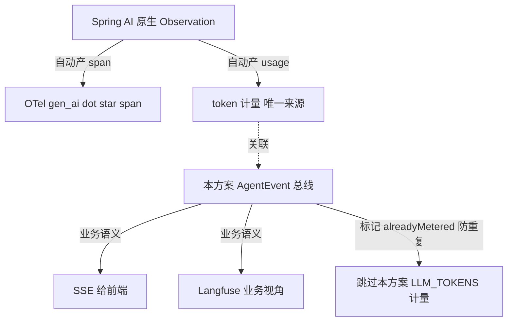

规则：
- **token 计量唯一来源 = Spring AI Observation span**（`gen_ai.client.token.usage`）。本方案的 `LLM_TOKENS` 事件**只做前端展示**（携带 span 里的 usage），**不再独立累加到 `SessionCostRegistry`**——避免和 span 双计。
- **工具执行 = Spring AI tool execution observation** 是技术层（一次工具调用耗时），本方案的 `TOOL_CALL_*` 是**业务语义层**（调了哪个工具、参数、在哪个 workflow 步骤）。两者通过 traceId 关联，不重复计量耗时。
- **本方案的不可替代价值**：`WORKFLOW_PHASE`/`GRAPH_EDGE`/`AGENT_TURN` 这类**业务语义事件**，Spring AI 原生 Observation 不会发——这才是本方案存在的理由。技术层 span 让 Spring AI 干，本方案专注业务语义。

```java
// 设计示意：说明类职责与调用关系，落地需补全 import/异常/配置
// LLM_TOKENS 事件改为「从当前 Observation span 摘 usage，不独立计量」
public class TokenEventAdapter {
    public AgentEvent fromObservation(io.micrometer.observation.Observation.Context ctx, String sessionId) {
        // 从 Spring AI 的 ObservationContext 摘 usage（gen_ai.client.token.usage）
        // 本方案不再调用 costRegistry.add —— 那会与 span 双计
        // token 累加交给 span 消费者（Langfuse OTel exporter）
        return AgentEvent.builder()
                .sessionId(sessionId).type(AgentEvent.EventType.LLM_TOKENS)
                .phase("llm").source("observation")
                .data("fromSpan", true)   // 标记：数据来自 span，勿重复计量
                .build();
    }
}
```

> 这是第二轮最需要架构判断的一项：**本方案不与 Spring AI 原生可观测性竞争，而是补它的盲区（业务语义层）**。`userId`/`agentVersion`/`promptVersion` 这些成本归因字段（§3.1 新增）也是 span 没有的，正好填进业务事件用于计费分摊。

### 17.17 灾备与降级 Runbook

**问题**：Redis 挂、Langfuse 挂、某 MCP Server 挂——可观测链路怎么降级？现在没有 Runbook，出问题靠猜。

| 故障 | 影响 | 降级行为 | 恢复 |
|------|------|---------|------|
| Redis 不可用 | 跨实例广播断、状态外置失效、回放不可用 | 总线退化为纯进程内（`cross-instance` 动态关）；`SessionStateStore` 降级到进程内 Map（接受单实例不一致，记告警）；审计改落本地文件 | Redis 恢复后重开跨实例；本地审计文件回灌 |
| Langfuse 不可用 | AI 评估视角断 | `LangfuseCollector` 切本地缓冲（文件/队列），不阻塞总线 | 恢复后批量回灌（用 traceId 关联） |
| 某 MCP Server 慢/挂 | 该工具调用超时 | §10 的 `MCP_CALL_FAILED` 事件 + 上游编排走 fallback 工具或降级回答 | 对端恢复自动重连 |
| 某分片 sink 背压爆 | 1/N 会话事件丢 | CRITICAL 靠落库兜底 + SSE 重连回放；DISCARDABLE 丢 | 自动恢复（背压缓解） |
| OTel Collector 挂 | trace 断 | 事件仍正常（traceId 字段还在，只是 span 没采） | 恢复后 span 续采 |

**统一原则**（修正初版的静默 `catch ignore`）：
1. **降级必须可观测**——每次降级打点（`fallback_degradation_total{dependency=...}`）。
2. **依赖健康联动 Actuator**——Redis/Langfuse 不可用走 §17.9 的 `HealthIndicator.down`，网关据此摘流量或告警。
3. **绝不因可观测链路故障拖垮主链路**——所有观测相关 IO（Redis publish、Langfuse 上报）超时短、异常吞且打点，Agent 推理本身照常。

```java
// 设计示意：说明类职责与调用关系，落地需补全 import/异常/配置
// 统一降级门面：所有外部依赖调用必经此处
public class ResilientExternal {
    public <T> T call(String dep, java.util.function.Supplier<T> action, T fallback) {
        try {
            return action.get();
        } catch (Exception ex) {
            metrics.degradation(dep);          // 必打点
            health.markDependencyDown(dep);    // 联动 Actuator
            return fallback;
        }
    }
}
```

> 这五项（Redis/Langfuse/MCP/背压/OTel）的降级 Runbook 配合 §17.9 健康检查 + §16.6 监控告警，构成完整的生产 SRE 闭环，呼应 [26-AI工程的SRE实践](../spring-ai-2.0/26-AI工程的SRE实践.md)。

### 17.18 测试工程化（可观测系统自身必须可测）

**问题**：本方案几百行响应式代码，全文档没有一个测试。可观测系统自己不可测、不可观测 = 上线后出问题没法定位。企业级要求四层测试（呼应 [13-测试工程化](../spring-ai-2.0/13-测试工程化.md)）。

**单测（纯 Reactor，用 `StepVerifier`）**：验证总线 multicast/背压/脱敏/重排。

```java
// 设计示意：说明类职责与调用关系，落地需补全 import/异常/配置
import org.junit.jupiter.api.Test;
import reactor.test.StepVerifier;

class AgentEventBusTest {

    @Test
    void multicast_oneEmitAllSubscribersReceive() {
        AgentEventBus bus = new AgentEventBus(); bus.init();
        AgentEvent e = AgentEvent.builder().sessionId("s1").type(AgentEvent.EventType.WORKFLOW_PHASE)
                .phase("p").source("workflow").build();

        // 两个订阅者都应收到（证明 multicast，非 cold 重复执行）
        StepVerifier.create(bus.asFlux().next()).expectNextMatches(ev -> ev.sessionId().equals("s1"))
                .then(() -> bus.emit(e)).expectNextCount(1).verifyComplete();
    }

    @Test
    void sequencer_reordersOutOfSequenceEvents() {
        EventSequencer seq = new EventSequencer(java.time.Duration.ofMillis(50));
        AgentEvent e1 = withSeq("s", 1), e3 = withSeq("s", 3), e2 = withSeq("s", 2);
        // 按 1,3,2 输入，重排后应输出 1,2,3
        StepVerifier.create(seq.reorder(Flux.just(e1, e3, e2)))
                .expectNextMatches(e -> e.sequence() == 1)
                .expectNextMatches(e -> e.sequence() == 2)
                .expectNextMatches(e -> e.sequence() == 3)
                .verifyComplete();
    }
}
```

**集成测（SSE 端到端，用 `WebTestClient`）**：验证重连回放、终态收尾。

```java
// 设计示意：说明类职责与调用关系，落地需补全 import/异常/配置
@SpringBootTest(webEnvironment = SpringBootTest.WebEnvironment.RANDOM_PORT)
class AgentEventSseControllerIT {
    @Autowired org.springframework.test.web.reactive.server.WebTestClient webClient;
    @Autowired AgentEventBus bus;

    @Test
    void sse_returnsEventsForSession() {
        webClient.get().uri("/agent/events/s1").exchange()
                .expectStatus().isOk()
                .returnResult(String.class)
                .getResponseBody()
                .as(StepVerifier::create)
                .then(() -> bus.emit(AgentEvent.builder().sessionId("s1")
                        .type(AgentEvent.EventType.SESSION_COMPLETED).phase("p").source("workflow").build()))
                .expectNextCount(1)
                .thenCancel()
                .verify();
    }
}
```

**契约测**：§17.15 的 JSON Schema 校验。
**多实例测（Testcontainers）**：起 Redis 容器，验证请求落 A、SSE 连 B 能收事件（`cross-instance=true`）。

> 测试依赖：`spring-boot-starter-test`（含 `WebTestClient`）、`io.projectreactor:reactor-test`（`StepVerifier`）、`org.testcontainers:testcontainers`。这些都是 Spring Boot 标准测试栈，非新框架。

---

## 18. 落地验收 Checklist

> 以下任务清单按「基础 → 进阶 → 高级 → 企业级加固」分层，作为本方案落地时的**验收 checklist**（每条对应前文某一设计点是否真正实现并验证通过），而非教学练习。括号内时间为工程估算参考。

### 基础（半天-1 天）

1. **搭出最小总线**：创建 `AgentEventBus`（`Sinks.Many.multicast().onBackpressureBuffer(2048)`）+ `AgentEventEmitter` 接口，写一个单测验证「一个 emit，两个订阅者都收到」（证明 multicast）。
2. **第一个采集点**：实现 `ObservableToolCallback`，包一个 `@Tool currentTime()`，手动 emit 一次，在日志消费者里打印事件。
3. **第一个 SSE**：照 §6.1 写 `AgentEventSseController`，用 `curl -N http://localhost:8080/agent/events/test` 看到事件流。
4. **改 ChainingService**：把现有 `ArticleChainingService` 改成继承 `ObservableChainingService`，跑一次看事件流。
5. **前端跑通**：写一个 30 行 HTML + EventSource，订阅并 `console.log` 所有事件。

### 进阶（1-2 天）

6. **TokenMeterAdvisor**：实现 §12.2，把 token 事件接到流式响应上，验证每次 LLM 调用都发 `LLM_TOKENS`。
7. **Graph 监听**：在一个已有的 `spring-ai-alibaba-graph` demo 上挂 `AgentEventGraphListener`，验证 `before/after` 回调发事件（注意用真实方法名，不是旧文档的 `onNodeStart`）。
8. **条件边事件**：在条件边判定函数里发 `GRAPH_EDGE`，前端还原出完整跳转路径。
9. **MCP 拦截**：用 `ObservableMcpCallback` 包一个 MCP 工具，验证 `MCP_CALL_START/END` 带 server 名。
10. **QuotaService 预扣**：配 `budgetPerSessionUsd=0.01`，实现 §12.3 的预扣 + 核销，用并发线程同时发起多个 turn，验证不会并发超支（关键：只靠事后 check 会超，预扣不会）。

### 高级（2-3 天）

11. **Redis Stream 多实例**：起两个实例，请求落 A、SSE 连 B，验证 B 能收到 A 的事件（`cross-instance=true`）。
12. **OTel 集成**：接 OpenTelemetry + Jaeger，验证 `AgentEvent.traceId` 能在 Jaeger 找到对应 span。
13. **跨进程 Trace 传播**：MCP Server 端解析 `traceparent`，验证对端 span 的 parent 是 Agent 进程的 span。
14. **Langfuse 消费者**：写 `LangfuseCollector` 订阅总线，把 `SESSION_COMPLETED` 的成本和 token 灌到 Langfuse。
15. **背压分级降级**（§17.2）：用脚本高频 emit（每秒 1w 事件），验证 CRITICAL 落库不丢、DISCARDABLE 被丢、NORMAL 记 metrics。
16. **SSE 断线重连回放**（§17.3）：手动断网再连，带 `Last-Event-ID`，验证断连期间事件被回放（断点续传）。对比「不开 ReplayStore」时的丢失。
17. **事件顺序重排**（§17.1）：用 `Flux.merge` 模拟两个采集点乱序 emit，验证 `EventSequencer` 按 sequence 重排后前端不倒跳。
18. **PII 脱敏**（§17.6）：构造含手机号/身份证/密钥的工具参数，验证 SSE 帧和审计库里的数据已脱敏。
19. **取消通道**（§17.4）：长任务跑到一半调 `/agent/cancel/{sessionId}`，验证编排中止 + SSE 收到 `SESSION_CANCELLED` 优雅结束。
20. **治理面**（§17.9）：接入 Actuator，访问 `/actuator/health` 和 `/actuator/agent-sessions/active`，验证能看到活跃会话和总线健康度。

### 企业级加固（第二轮，2-4 天）

21. **会话状态外置**（§17.10）：把 `SessionCostRegistry`/`MaxTurnsGuard` 改成基于 `SessionStateStore`(Redis)，起两实例，请求落 A、配额检查在 B，验证预扣仍生效（关键：内存版会失效）。
22. **分片总线**（§17.11）：配 `bus.shards=4`，用脚本让一个 SSE 连接故意慢消费，验证只影响 1/4 会话、其余会话事件正常。
23. **多租户配额**（§17.12）：给 tenantA 设日预算 $0.01，跑任务触发租户级超限；给 user1 设 RPM=2，快速发 3 次验证第 3 次被限。
24. **事件节流**（§17.13）：流式输出 1000 个 CONTENT_DELTA，验证经 `EventThrottler` 后 SSE 帧数降到几十；对比未节流的前端渲染卡顿差异。
25. **能力开关灰度**（§17.14）：配 `audit.enabled=false`，验证审计库无写入；给某租户覆盖 `audit.enabled=true`，验证只该租户落审计。
26. **契约测试**（§17.15）：写 `agent-event-v1.schema.json`，CI 跑「每个 EventType 产出的 JSON 都符合 schema」的测试，故意删一个 required 字段验证测试能挂。
27. **原生 Observation 去重**（§17.16）：接 Spring AI Observation，对比「本方案独立计量 token」vs「从 span 摘 token」，验证后者不与 span 双计。
28. **灾备 Runbook**（§17.17）：停掉 Redis，验证 Agent 推理仍正常（总线退化进程内）+ Actuator health 变 down + 有降级 metrics 打点。

---

## 19. 理解检查

> 覆盖关键设计决策，不是记忆题。建议先自己答，再对照正文。

1. **为什么必须用 `Sinks.Many` 总线，而不能用 `Flux.concat` 把事件和结果串成一个流推给前端？** 如果有三个消费者（SSE、Langfuse、OTel），两种方案分别会发生什么？

2. `AgentEvent` 为什么用 `Map<String,Object> data` 自由扩展，而不是给每种事件定义独立的 record？这样设计的代价是什么？

3. §4.2 用装饰器模式包 `ToolCallback`，而不是写 AOP 或改 `@Tool` 方法。这个选择的好处是什么？什么场景下 AOP 会更合适？

4. §4.5 的 `ChatClientMessageAggregator.aggregateChatClientResponse` 为什么叫「旁路聚合」？如果直接对主流 `subscribe()` 两次会出什么问题（结合 [04](./04-流式响应与Reactor深度.md) §A.3 的 cold/hot）？

5. 三种编排模式（Workflow / Graph / ChatClient 自主循环）的可见性入口分别是哪三个？为什么不能统一成一个？

6. Graph 监听为什么用真实的 `before/after` 而不是旧文档的 `onNodeStart/onNodeEnd`？如果一个团队照着旧文档写代码，会得到什么错误？这说明了「文档 API 要核实源码」的什么教训？

7. `GRAPH_EDGE` 事件为什么不能只靠 `GraphLifecycleListener` 自动产生，而要在条件边判定函数里手动 emit？

8. 多实例部署时，用户 SSE 连实例 A、请求在实例 B 处理，事件如何从 B 到 A？如果用 sticky session 把请求和 SSE 都钉在 A，还需要 Redis Stream 吗？两种方案的取舍？

9. §12.1 的 `TenantContext` 用 `ThreadLocal`，在 WebFlux 响应式模型下会有什么问题？正确的做法是什么？（提示：本仓库 `OrchestratorService` 用了 `Mono.fromCallable().block()`，会切线程。）

10. 一个会话烧了 $0.05 触发 `QUOTA_EXCEEDED`，前端、Langfuse、OTel 三路消费者分别会感知到什么？如果用 `Flux.concat` 而非总线，这个超限事件能被三路同时感知吗？

11. **（§12.3 预扣）** 为什么只在旁路 `LLM_TOKENS` 里 `check` 配额会并发超支？预扣（reserve）和核销（settle）分别解决什么问题？如果 LLM 调用最终失败（token 没烧），预扣的额度怎么还？

12. **（§17.2 分级降级）** `SESSION_COMPLETED` 被定为 CRITICAL。如果背压满导致它没进 SSE 流，前端怎么还能拿到它？（提示：落库兜底 + SSE 重连回放两道保险。）如果连落库也失败了呢？

13. **（§17.3 重连回放）** 浏览器 `EventSource` 重连时带的 `Last-Event-ID` 头，值从哪来？为什么要求后端每个 SSE 帧都设 `id:`？如果某帧漏设 `id:`，回放会出什么问题？

14. **（§17.6 脱敏 vs §17.5 审计）** 脱敏在 emit 端做（事件发出前），而不是在每个消费者（审计库、Langfuse、前端）各自做。这个集中式选择的好处和代价是什么？如果审计库需要原始数据用于合规追责，这套方案要怎么改？

15. **（§3.3 扩展性 vs §17.7 版本化）** `AgentEvent.data` 是无 schema 的 `Map<String,Object>`，对「快速加字段」很友好，但对「长期演进 + 多消费者强约束」是负债。什么时候应该从 Map 升级到 Avro/Protobuf + Schema Registry？

16. **（§17.10 状态外置）** 为什么 `SessionCostRegistry` 用进程内 `ConcurrentHashMap` 在多实例下会让预扣失效？外置到 Redis 后，单纯用 `hIncrByFloat` 做预扣仍有竞态（两个节点同时读到旧值），该怎么用 Lua 脚本消除？

17. **（§17.11 分片总线）** 分片后，SSE 消费者订阅 `asFlux()`（全 merge）和 `asFluxFor(sessionId)`（单分片）各有什么取舍？为什么定向订阅不会漏事件？分片数选 16 还是 1024，分别什么后果？

18. **（§17.16 去重）** 本方案的 `LLM_TOKENS` 和 Spring AI 原生 Observation span 的 `gen_ai.client.token.usage` 如果都计量 token，会发生什么？为什么最终选择「token 计量唯一来源 = span」？本方案 LLM_TOKENS 事件还存在价值吗？

19. **（§17.17 灾备）** Redis 挂了，如果总线还坚持 `cross-instance=true` 往 Redis publish，会发生什么？为什么降级要「动态关 cross-instance + SessionStateStore 退化进程内 + 打点 + health down」四件套，而不是直接让 Agent 报错？

20. **（§17.18 测试）** 可观测系统本身如果不可测，出问题时会陷入什么困境？为什么 `AgentEventBus` 的 multicast 特性必须用「两个订阅者都收到」的测试来守住，而不只是「能 emit 能 subscribe」？

---

## 20. 相关文档

**前置教程（本仓库）**：
- [03-Advisor链全解](./03-Advisor链全解.md) —— Advisor order、横切关注点（本方案 token/cost Advisor 的基础）
- [04-流式响应与Reactor深度](./04-流式响应与Reactor深度.md) —— SSE、cold/hot Flux、`ChatClientMessageAggregator`（本方案 §4.5 / §13 的基础）
- [10-多Agent编排实战](./10-多Agent编排实战.md) —— `GraphLifecycleListener`、`CompileConfig`（本方案 §8 的基础，注意其 §7.1 方法名已过时，本文已校正）
- [11-五大Workflow模式与代码评审助手](./11-五大Workflow模式与代码评审助手.md) —— 五大 Workflow 抽象基类（本方案 §7 改造对象）
- [14-安全工程与红队](./14-安全工程与红队.md) —— 三重保护（maxTurns/预算/死循环，本方案 §9.2 / §12.3）
- [15-可观测性与成本治理](./15-可观测性与成本治理.md) —— OTel、成本计量、Langfuse（本方案 §11 / §12 / §15 的基础）
- [22-框架源码精读](./22-框架源码精读.md) —— `ToolCallingAdvisor` 自动注册、工具执行链路

**外部参考**：
- Anthropic《Building Effective Agents》(2024-12-19) —— Workflow > Agent 的理论依据
- OpenTelemetry W3C TraceContext 规范 —— `traceparent` 跨进程传播
- Spring AI 2.0 官方文档 —— Observability、Tool Calling、Streaming
- Reactor 文档 `Sinks.Many` —— multicast/onBackpressureBuffer 语义

---

> **回到**：[`./00-目录索引.md`](./00-目录索引.md) · [`../00-README.md`](../../00-README.md)
