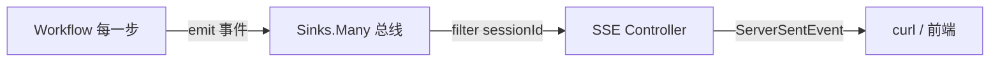

# 33a Agent 可观测性最小实战：30 分钟跑通三层事件总线

> **本文定位**：[33-Agent子过程实时可见性方案](./33-Agent子过程实时可见性方案.md) 的**最小实战版**。那份是 3300 行的企业级方案文档（理论），本文只做一件事——**用最少代码让你亲手跑通「采集 → 总线 → SSE」这条核心链路**，理解整个框架是怎么转起来的。
>
> **前置**：本仓库 demo06 已跑通（五大 Workflow），读过 33 文档的 §0–§6。
> **预计**：30-60 分钟，4 个类 + 1 个 Controller，接 demo06 现有的 chaining。
> **砍掉了什么**：方案里的 18 项企业级加固（顺序重排、背压分级、多租户、状态外置、分片总线、脱敏、灾备……）**一个都不做**。最小 demo 只追求「跑通、看懂」，不追求「能上线」。读完本文你应能自己对照 33 文档逐项补加固。

---

## 0. 这份 demo 要达到的效果

demo06 现有的 `GET /demo06/workflow/chaining` 是黑盒——调一次，等几秒，出最终文章。中间「生成大纲 → 生成草稿 → 润色」三步完全不可见。

本 demo 给它加一个**并行的 SSE 端点**，跑同一条 chaining，但每一步开始/结束都实时推一个事件给前端：

```
$ curl -N "http://localhost:8080/demo06/obs/chaining?prompt=AI的未来&sessionId=s1"

event:SESSION_STARTED   data:{...input:"AI的未来"...}
event:STEP_START        data:{...step:0, name:"生成大纲"...}      ← 第1步开始
event:STEP_END          data:{...step:0, output:"一、引言..."...}  ← 第1步结束
event:STEP_START        data:{...step:1, name:"生成草稿"...}
event:STEP_END          data:{...step:1, output:"AI正在..."...}
event:STEP_START        data:{...step:2, name:"润色"...}
event:STEP_END          data:{...step:2, output:"（流畅的最终文）"...}
event:SESSION_COMPLETED data:{...output:"（流畅的最终文）"...}
```

**不是等 10 秒出一个字符串，而是每 3 秒看到一个步骤完成。** 这就是「子过程可见性」。

---

## 1. 核心心智模型（先记住这张图）



三个角色，对应三个类：

| 角色 | 类 | 职责 | 行数 |
|------|----|----|----|
| 事件 | `AgentEvent` | 一个 record，描述「发生了什么」 | ~30 |
| 总线 | `EventBus` | 一个 `Sinks.Many`，所有人往里塞、往外订阅 | ~25 |
| 采集+推送 | `ObservableChainingService` + `ObsController` | Workflow 里埋点 emit；Controller 订阅转 SSE | ~60 |

**就这么多。** 剩下的所有复杂度（背压、重连、多租户……）都是给这三个角色加戏，骨架永远是这三个。

---

## 2. 动手：4 个文件

> 包路径建议 `org.demo06.observability`，和 demo06 现有代码放一起。下面的代码**可直接复制编译**（基于已核实的 Spring AI 2.0 + WebFlux API）。

### 2.1 AgentEvent —— 事件本身

最小化：只留 `type`/`sessionId`/`data`/`timestamp`。方案里的 sequence/criticality/schemaVersion/traceId **全砍**——它们是加固，理解框架不需要。

```java
// 文件：src/main/java/org/demo06/observability/AgentEvent.java
package org.demo06.observability;

import java.time.Instant;
import java.util.Map;

/**
 * 最小事件模型。只描述「发生了什么」。
 * 对照方案 §3.1：这是 AgentEvent 砍到只剩骨架的版本。
 */
public record AgentEvent(
        String type,        // 事件类型，如 SESSION_STARTED / STEP_START
        String sessionId,   // 会话 ID，SSE 按它过滤
        Instant timestamp,
        Map<String, Object> data
) {
    public static AgentEvent of(String type, String sessionId, Map<String, Object> data) {
        return new AgentEvent(type, sessionId, Instant.now(), data);
    }
}
```

**理解点**：事件就是一个不可变的数据载体。谁产生的、给谁看的，都不归它管——它只负责「描述」。这就是为什么后面所有采集点、所有消费者能用同一种数据结构。

### 2.2 EventBus —— 进程内事件总线（核心）

```java
// 文件：src/main/java/org/demo06/observability/EventBus.java
package org.demo06.observability;

import org.springframework.stereotype.Component;
import reactor.core.publisher.Flux;
import reactor.core.publisher.Sinks;

/**
 * 进程内事件总线。整个 demo 就一个 Bean（单例）。
 *
 * 这是整个方案的「心脏」。理解它就理解了框架：
 * - Sinks.Many.multicast()：所有订阅者共享同一个事件流（Hot）
 * - emit()：往里塞事件，不关心谁订阅
 * - flux()：订阅事件流，不关心谁塞的
 * 生产者和消费者彻底解耦。
 */
@Component
public class EventBus {

    // onBackpressureBuffer(256)：消费者来不及处理时，最多缓冲 256 条
    // autoCancel=false：最后一个订阅者离开时不要关闭总线（demo 要反复订阅）
    private final Sinks.Many<AgentEvent> sink =
            Sinks.many().multicast().onBackpressureBuffer(256, false);

    /** 采集点调这个：发射事件。 */
    public void emit(AgentEvent event) {
        sink.tryEmitNext(event);   // 非阻塞，失败也不抛（demo 不管背压失败）
    }

    /** Controller / 消费者调这个：订阅事件流。 */
    public Flux<AgentEvent> flux() {
        return sink.asFlux();
    }
}
```

**理解点（最重要）**：为什么用 `Sinks.Many` 而不是直接在 Workflow 里返回一个 `Flux`？

```java
// ❌ 反例：如果不用总线，Workflow 直接返回 Flux 给 Controller
//   那么每个新消费者（想加个日志、加个 metrics）都得改 Workflow 代码，
//   或者重复跑一遍 LLM（cold 流）。
// ✅ 总线：Workflow 只管 emit，任何想消费的人 flux().subscribe() 即可，互不干扰。
```

这就是方案 §2.3 反复强调的「企业级 = 解耦」的最小体现。本 demo 只有一个消费者（SSE Controller），但架构允许你随时加第二个（比如打个日志），零改动 Workflow。

### 2.3 ObservableChainingService —— 给 Workflow 加埋点

继承 demo06 现有的 `ChainingService`，重写 `run`，在每个步骤前后 emit 事件。**业务逻辑（steps）零改动**。

```java
// 文件：src/main/java/org/demo06/observability/ObservableChainingService.java
package org.demo06.observability;

import org.demo06.workflows.ChainingService;
import org.springframework.ai.chat.client.ChatClient;
import java.util.List;
import java.util.Map;
import java.util.function.BiFunction;

/**
 * 可观测版 ChainingService：在父类的步骤链前后埋点。
 * 对照方案 §7.1：这就是「采集点二（Workflow 阶段钩子）」的最小实现。
 *
 * 关键：不碰 steps() 的业务逻辑，只在 run() 外层套一层 emit。
 * 子类（你的业务）只管声明 steps，可见性白送。
 */
public abstract class ObservableChainingService extends ChainingService {

    protected final EventBus bus;

    protected ObservableChainingService(ChatClient chatClient, EventBus bus) {
        super(chatClient);
        this.bus = bus;
    }

    @Override
    public String run(String input, String sessionId) {
        bus.emit(AgentEvent.of("SESSION_STARTED", sessionId, Map.of("input", input)));

        String payload = input;
        List<BiFunction<String, String, String>> steps = steps();  // 复用父类的步骤链
        for (int i = 0; i < steps.size(); i++) {
            int step = i;
            bus.emit(AgentEvent.of("STEP_START", sessionId,
                    Map.of("step", step, "total", steps.size())));

            payload = steps.get(i).apply(payload, sessionId);  // 这一步会调一次 LLM（耗时）

            // 截断输出，避免事件太大（方案 §4.2 的 Truncator 最小版）
            String preview = payload == null ? "" :
                    (payload.length() > 80 ? payload.substring(0, 80) + "..." : payload);
            bus.emit(AgentEvent.of("STEP_END", sessionId,
                    Map.of("step", step, "output", preview)));
        }

        bus.emit(AgentEvent.of("SESSION_COMPLETED", sessionId,
                Map.of("output", payload == null ? "" :
                        (payload.length() > 80 ? payload.substring(0, 80) + "..." : payload))));
        return payload;
    }
}
```

**理解点**：这就是「采集层」——在编排的每一步主动 emit 事件。方案里的 4 个采集点（工具装饰器/Workflow 钩子/Graph 监听/流式旁路）本质都是这个模式：**在合适的时机 emit**。本 demo 只做最直观的 Workflow 钩子这一个。

### 2.4 给 chaining 做一个可观测的具体子类 + Controller

```java
// 文件：src/main/java/org/demo06/observability/ObservableArticleChaining.java
package org.demo06.observability;

import org.springframework.ai.chat.client.ChatClient;
import org.springframework.stereotype.Service;
import java.util.List;
import java.util.function.BiFunction;

/**
 * 复制 demo06 的 ArticleChainingService 业务逻辑，继承 ObservableChainingService。
 * steps() 内容和 ArticleChainingService 完全一样——只是换了父类。
 */
@Service
public class ObservableArticleChaining extends ObservableChainingService {

    public ObservableArticleChaining(ChatClient chatClient, EventBus bus) {
        super(chatClient, bus);
    }

    @Override
    protected List<BiFunction<String, String, String>> steps() {
        return List.of(
                (topic, sid) -> call("生成大纲，只输出大纲", topic, sid),
                (outline, sid) -> call("根据大纲生成草稿，只输出草稿", outline, sid),
                (draft, sid) -> call("润色草稿让它更流畅，只输出最终文本", draft, sid)
        );
    }
}
```

```java
// 文件：src/main/java/org/demo06/observability/ObsController.java
package org.demo06.observability;

import org.springframework.http.MediaType;
import org.springframework.http.codec.ServerSentEvent;
import org.springframework.web.bind.annotation.*;
import reactor.core.publisher.Flux;
import java.util.Map;

/**
 * SSE Controller：订阅总线 → 按 sessionId 过滤 → 转 ServerSentEvent 推给前端。
 * 对照方案 §6.1 的最小版（砍了 Last-Event-ID 重连、序号重排、心跳、超时）。
 */
@RestController
@RequestMapping("/demo06/obs")
public class ObsController {

    private final EventBus bus;
    private final ObservableArticleChaining chaining;

    public ObsController(EventBus bus, ObservableArticleChaining chaining) {
        this.bus = bus;
        this.chaining = chaining;
    }

    /**
     * 跑可观测 chaining + 实时推事件。一个端点干两件事：
     * 1. 异步启动 chaining（它内部会 emit 事件）
     * 2. 同时订阅总线，把本 sessionId 的事件推给客户端
     */
    @GetMapping(value = "/chaining", produces = MediaType.TEXT_EVENT_STREAM_VALUE)
    public Flux<ServerSentEvent<String>> chainingStream(
            @RequestParam String prompt,
            @RequestHeader String sessionId) {

        // 订阅总线（必须在启动任务之前订阅，否则会漏掉 SESSION_STARTED）
        Flux<ServerSentEvent<String>> events = bus.flux()
                .filter(e -> sessionId.equals(e.sessionId()))
                // 收到 SESSION_COMPLETED 就结束流（否则会一直挂着）
                .takeUntil(e -> "SESSION_COMPLETED".equals(e.type()))
                .map(this::toSse);

        // 异步跑 chaining（在另一个线程，不阻塞 SSE 流）
        // demo 用法：生产请用 @Async 或响应式编排，这里简单起见新起线程
        new Thread(() -> chaining.run(prompt, sessionId)).start();

        return events;
    }

    private ServerSentEvent<String> toSse(AgentEvent e) {
        return ServerSentEvent.<String>builder()
                .event(e.type())                    // SSE 的 event: 行 = 事件类型
                .data(toJson(e))                    // SSE 的 data: 行 = 事件 JSON
                .build();
    }

    private String toJson(AgentEvent e) {
        // demo 最简序列化（生产用 ObjectMapper）
        return "{\"type\":\"%s\",\"timestamp\":\"%s\",\"data\":%s}"
                .formatted(e.type(), e.timestamp(), mapToJson(e.data()));
    }

    private String mapToJson(Map<String, Object> m) {
        StringBuilder sb = new StringBuilder("{");
        m.forEach((k, v) -> sb.append("\"").append(k).append("\":\"")
                .append(String.valueOf(v).replace("\"", "'")).append("\","));
        if (sb.length() > 1) sb.setLength(sb.length() - 1);
        return sb.append("}").toString();
    }
}
```

> ⚠️ 上面 `ObsController` 省略了 `import java.util.Map;`，复制进 IDE 时补上。`new Thread(...)` 是 demo 的偷懒做法（生产用线程池/响应式，见方案 §17.10 的状态外置和 §13 的响应式编排）。

---

## 3. 跑起来

### 3.1 前提
demo06 已能跑（`/demo06/workflow/chaining` 正常返回）。本 demo 复用同一个 `ChatClient`、同一个 LLM 配置，无需改 pom、无需改 yaml。

### 3.2 启动 + 验证

```bash
# 启动（demo06 主类）
mvn spring-boot:run -Dspring-boot.run.main-class=org.demo06.ApplicationDemo06

# 另开终端，订阅事件流（-N 关闭 curl 缓冲，实时看到事件）
curl -N -H "sessionId: s1" \
  "http://localhost:8080/demo06/obs/chaining?prompt=AI的未来"
```

你会看到每 3-5 秒冒出一个 `event:`，一共 8 个（1 个 STARTED + 3×2 个 STEP + 1 个 COMPLETED），最后 curl 正常退出。

### 3.3 对比黑盒版
同时跑原始端点感受差异：

```bash
# 黑盒：等 ~15 秒，一次性出最终文章，中间什么也看不到
curl -H "sessionId: s2" "http://localhost:8080/demo06/workflow/chaining?prompt=AI的未来"
```

**这就是「子过程可见性」的全部价值：从"等 15 秒盲等"变成"每步可见"。**

---

## 4. 加一个消费者，验证「总线解耦」的价值

上面的 demo 只有一个消费者（SSE Controller）。总线的好处要加第二个消费者才能体会。**不改 Workflow，不改 Controller**，只加一个 Bean：

```java
// 文件：src/main/java/org/demo06/observability/LogSubscriber.java
package org.demo06.observability;

import jakarta.annotation.PostConstruct;
import org.springframework.stereotype.Component;

/**
 * 第二个消费者：把所有事件打到日志。零改动 Workflow 和 Controller。
 * 这就是「Sinks.Many multicast」的红利——加消费者不改生产者。
 */
@Component
public class LogSubscriber {

    private final EventBus bus;

    public LogSubscriber(EventBus bus) {
        this.bus = bus;
    }

    @PostConstruct
    public void init() {
        bus.flux().subscribe(e ->
                System.out.println("[EVENT] " + e.type() + " sid=" + e.sessionId()));
    }
}
```

加上它，再跑一次 §3.2 的 curl：你会看到**控制台同时打印事件**，而 SSE 流照常工作。两个消费者共享同一个事件流，Workflow 只跑了一次 LLM 链。

> 体会一下：如果是用「Workflow 直接返回 Flux」的反例，加这个日志订阅者要么改 Workflow 代码、要么再跑一遍 LLM。这就是方案 §2.3「为什么用 Sinks.Many 不用 Flux.concat」的体感证明。

---

## 5. 你现在掌握了什么 / 还差什么

### ✅ 已掌握（核心框架）

| 概念 | 在本 demo 哪里 | 方案对应章节 |
|------|--------------|-------------|
| 统一事件协议 | `AgentEvent` record | §3 |
| 进程内总线（multicast） | `EventBus` 的 `Sinks.Many` | §5.1 |
| 采集点（Workflow 钩子） | `ObservableChainingService.run` 里的 emit | §4.3 / §7.1 |
| SSE 推送（sessionId 过滤） | `ObsController` | §6.1 |
| 总线解耦（多消费者） | `LogSubscriber` | §2.3 |

**这五样就是整个框架的骨架。** 后面所有东西都是给这个骨架加肉。

### ❌ 故意没做（对照方案逐项补）

| 没做 | 后果 | 方案章节 |
|------|------|---------|
| 顺序号 + 重排 | 多线程 emit 可能乱序 | §17.1 |
| 背压分级降级 | 高频时事件可能丢 | §17.2 |
| SSE 重连回放 | 断网漏事件 | §17.3 |
| 脱敏 | 工具参数泄漏 | §17.6 |
| 状态外置 | 多实例不一致 | §17.10 |
| 工具调用采集 | 只看到 Workflow 步骤，看不到工具调用细节 | §4.2 |
| Graph / ChatClient 模式 | 只覆盖了 Workflow 一种编排 | §8 / §9 |

**练习建议**：按这个表的顺序逐个补，每补一个回方案文档读对应章节。第一个建议补「工具调用采集（§4.2）」——给 `call()` 里的 LLM 调用包一层装饰器 emit `TOOL_CALL_*`，你会立刻理解装饰器模式在采集层的用法，和 Workflow 钩子是同一套思路。

---

## 6. 常见踩坑

1. **订阅必须在任务启动之前**：`ObsController` 里先 `bus.flux()...takeUntil(...)` 再 `new Thread(run)`，顺序反了会漏掉 `SESSION_STARTED`（事件发了但没人订阅）。
2. **`takeUntil` 的行为**：它会在匹配的事件**之后**结束流，所以 `SESSION_COMPLETED` 本身会被推送（不是丢弃）。要丢弃用 `takeWhile`。
3. **curl 必须加 `-N`**：否则 curl 会缓冲输出，直到流结束才一次性打印，看不到"实时"效果。
4. **`@RequestHeader String sessionId`** 必须带，不带会 400。curl 里 `-H "sessionId: s1"`。
5. **事件 data 里的引号**：demo 的手写 JSON 没做转义，LLM 输出含引号会破坏 JSON。生产用 `ObjectMapper`（方案代码里就是）。

---

## 7. 相关文档

- [33-Agent子过程实时可见性方案](./33-Agent子过程实时可见性方案.md) —— 完整企业级方案（本 demo 的理论全本）
- [04-流式响应与Reactor深度](./04-流式响应与Reactor深度.md) —— SSE、cold/hot Flux（理解 `Sinks.Many` 的基础）
- [11-五大Workflow模式与代码评审助手](./11-五大Workflow模式与代码评审助手.md) —— demo06 的 chaining 基类来源

---

> **回到**：[`./00-目录索引.md`](./00-目录索引.md) · [`./33-Agent子过程实时可见性方案.md`](./33-Agent子过程实时可见性方案.md)
