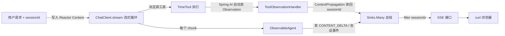

# 33a Agent 可观测性最小实战：用 Spring AI 原生 Observation 看清工具调用

> **这份文档是什么**：[33-方案](./33-Agent子过程实时可见性方案.md) 的最小可跑版。照着敲，得到一个独立模块 **demo07**——一个能自主调用 TimeTool 的 Agent，用 **Spring AI 原生 Observation 机制**把「LLM 调用、工具调用（含参数和返回值）」全程通过 SSE 实时推给前端。
>
> **为什么用 Observation（企业级规范）**：工具调用发生在 Spring AI 内部（`ToolCallingAdvisor` 循环里），手动包 `ToolCallback` 或写 Advisor 都拦不全。Spring AI 官方提供了 `ToolCallingObservation`——这是看工具调用的**标准机制**，企业级就该用它，而不是自己包底层。
>
> **和 33b 的关系**：33a 是练手小项目（最小骨架）；33b 是终极项目（完整演进）。
>
> **技术栈**：Spring Boot 4.1 · Spring AI 2.0.0 · Java 21 · WebFlux · Micrometer Observation · **Micrometer ContextPropagation（会话隔离）** · 流式（`.stream()`）· DeepSeek。所有 API 经本地 jar 反编译核实，照抄能编译。

---

## 0. 这个 demo 要达到的效果

一个能自主调工具的 Agent。用户问「现在几点了？帮我规划今天下午」，Agent 自己决定调 `getCurrentTime` 工具拿到时间，再基于时间回答。

整个过程的每一步对开发者**实时可见**——通过 SSE 流能看到：
- 工具调用的名字、参数、**返回值**（`"2026-07-22 14:30:25"`）
- LLM 回答的**逐字输出**（流式 `CONTENT_DELTA`）

```
# 终端 1：订阅事件流（sessionId 走 header）
$ curl -N -H "sessionId: s1" "http://localhost:8080/demo07/obs/sse"

# 终端 2：触发任务（sessionId 走 header，与订阅一致 → 只收到 s1 这个会话的事件）
$ curl -X POST -H "sessionId: s1" \
    "http://localhost:8080/demo07/obs/chat?prompt=现在几点了，用一句话规划今天下午"

# 终端 1 实时收到（SSE 帧只有 data: 行，靠 JSON 里的 type 分发）：
data:{"type":"SESSION_STARTED","sessionId":"s1",...,"data":{"input":"现在几点了..."}}
data:{"type":"TOOL_CALL","sessionId":"s1",...,"data":{"tool":"getCurrentTime","args":"{}","result":"2026-07-22 14:30:25"}}
data:{"type":"CONTENT_DELTA","sessionId":"s1",...,"data":{"text":"现在"}}
data:{"type":"CONTENT_DELTA","sessionId":"s1",...,"data":{"text":"是14:30"}}
data:{"type":"CONTENT_DELTA","sessionId":"s1",...,"data":{"text":"，下午建议..."}}
data:{"type":"SESSION_COMPLETED","sessionId":"s1",...,"data":{...}}
```

> **会话隔离已做实**：`sessionId` 经 Micrometer ContextPropagation 从 `/chat` 透传到工具执行的 `ToolObservationHandler`，业务事件和工具事件**都标到同一个 sessionId**。订阅 `s1` 只收 `s1` 的事件，多会话并发互不串流。

**核心价值**：工具的 `result`（`"2026-07-22 14:30:25"`）在事件流里看得清清楚楚——这就是「子过程可见」。

---

## 1. 核心心智模型



两条观测路径，都汇入同一个总线，且**都带同一个 sessionId**（经 ContextPropagation 透传）：
| 观测什么 | 机制 | sessionId 怎么来 | 谁负责发事件 |
|---------|------|----------------|------------|
| 工具调用（名/参数/返回值） | Spring AI **原生 ToolCallingObservation**（自动发） | Handler 在 `onStop` 用 ContextPropagation 从线程读回 | `ToolObservationHandler` 转成 `TOOL_CALL` 事件 |
| LLM 流式正文 + 会话生命周期 | 业务代码直接发 | Agent 方法参数直接拿 | `ObservableAgent` 发 `CONTENT_DELTA` / `SESSION_*` |

> **两个关键**：
> 1. 工具调用我们**不自己拦**，而是订阅 Spring AI 已经在发的 Observation——这才是企业级做法（用框架原生能力，不侵入业务）。
> 2. 会话隔离靠 **Micrometer ContextPropagation**：`/chat` 把 sessionId 写进 Reactor Context，Reactor 操作符自动跨线程传播到工具执行线程，Handler 在 `onStop` 读回。这是 Spring Boot 4 多租户的标准做法。

---

## 2. 项目结构（分层清晰）

demo07 独立模块，零依赖。按职责分层：

```
demo07/
├── pom.xml
├── src/main/resources/
│   ├── application.yaml
│   └── static/demo07.html                ← 调试页面（§4.4，fetch + ReadableStream）
└── src/main/java/com/example/demo07/
    ├── Application.java                   ← 启动类
    ├── config/
    │   ├── ChatClientConfig.java          ← 装配 ChatClient（注册工具 + Advisor）
    │   ├── ObservationConfig.java         ← 注册 ToolObservationHandler 到 Registry
    │   └── ContextPropagationConfig.java  ← 注册 SessionIdHolder + 开启自动传播（会话隔离核心）
    ├── tool/
    │   └── TimeTools.java                 ← 工具层：@Tool getCurrentTime
    └── obs/                               ← 可观测层
        ├── AgentEvent.java                ← 事件模型（含 sessionId，@Builder）
        ├── SessionIdHolder.java           ← 可传播的 ThreadLocal（存当前 sessionId）
        ├── AgentEventBus.java             ← 事件总线（flux(sessionId) 自带过滤）
        ├── ToolObservationHandler.java    ← 订阅工具 Observation → 读 sessionId → 发 TOOL_CALL
        ├── ObservableAgent.java           ← 编排：ChatClient.stream + 发 CONTENT_DELTA/会话事件
        └── ObsController.java             ← /chat + /sse 两接口
```

**分层理由**（企业级规范）：
- `config/`：Bean 装配集中管理，不散落
- `tool/`：工具定义独立，将来加工具只动这
- `obs/`：可观测逻辑全在一起，和业务解耦

---

## 3. 动手：敲代码

### 3.1 pom.xml

```xml
<?xml version="1.0" encoding="UTF-8"?>
<project xmlns="http://maven.apache.org/POM/4.0.0"
         xmlns:xsi="http://www.w3.org/2001/XMLSchema-instance"
         xsi:schemaLocation="http://maven.apache.org/POM/4.0.0
         https://maven.apache.org/xsd/maven-4.0.0.xsd">
    <modelVersion>4.0.0</modelVersion>

    <parent>
        <groupId>org.springframework.boot</groupId>
        <artifactId>spring-boot-starter-parent</artifactId>
        <version>4.1.0</version>
        <relativePath/>
    </parent>

    <groupId>com.example.demo07</groupId>
    <artifactId>demo07</artifactId>
    <version>0.1.0-SNAPSHOT</version>
    <name>demo07</name>

    <properties>
        <java.version>21</java.version>
        <spring-ai.version>2.0.0</spring-ai.version>
    </properties>

    <dependencies>
        <!-- WebFlux：HTTP 接口 + SSE（不是 spring-boot-starter-web） -->
        <dependency>
            <groupId>org.springframework.boot</groupId>
            <artifactId>spring-boot-starter-webflux</artifactId>
        </dependency>

        <!-- Spring AI 调 OpenAI 兼容协议（DeepSeek 兼容） -->
        <dependency>
            <groupId>org.springframework.ai</groupId>
            <artifactId>spring-ai-starter-model-openai</artifactId>
        </dependency>

        <!-- Actuator：必须引！它带来 ObservationRegistry Bean（Spring Boot 4 的 Observation 核心自动配置在 actuator 里）。
             没它的话 ObservationRegistry 装配不到，ToolObservationHandler 注册不了。
             actuator 也是企业级标配（健康检查、metrics），并间接带入 context-propagation。 -->
        <dependency>
            <groupId>org.springframework.boot</groupId>
            <artifactId>spring-boot-starter-actuator</artifactId>
        </dependency>

        <!-- Lombok：AgentEvent 的 @Builder 用。版本由 spring-boot-starter-parent 管理，无需显式指定。 -->
        <dependency>
            <groupId>org.projectlombok</groupId>
            <artifactId>lombok</artifactId>
            <optional>true</optional>
        </dependency>
    </dependencies>

    <!-- Spring AI BOM：统一管版本 -->
    <dependencyManagement>
        <dependencies>
            <dependency>
                <groupId>org.springframework.ai</groupId>
                <artifactId>spring-ai-bom</artifactId>
                <version>${spring-ai.version}</version>
                <type>pom</type>
                <scope>import</scope>
            </dependency>
        </dependencies>
    </dependencyManagement>

    <build>
        <plugins>
            <plugin>
                <groupId>org.springframework.boot</groupId>
                <artifactId>spring-boot-maven-plugin</artifactId>
            </plugin>
        </plugins>
    </build>
</project>
```

> `micrometer-observation` 由 `spring-boot-starter-webflux` 间接带入，无需单独引。Spring AI starter 也自带 Observation 支持。
>
> **会话隔离依赖**：`io.micrometer:context-propagation` 由 `spring-boot-starter-actuator` 间接带入（Spring Boot 4 把它列为核心依赖），无需单独引。它是 Reactor Context ↔ ThreadLocal 桥接的标准库。

### 3.2 application.yaml

`src/main/resources/application.yaml`：

```yaml
spring:
  ai:
    openai:
      # 换成你的 DeepSeek API key（platform.deepseek.com 申请）
      # 用环境变量优先，避免把 key 提交进 git
      api-key: ${DEEPSEEK_API_KEY:你的key}
      base-url: https://api.deepseek.com
      chat:
        model: deepseek-chat
        temperature: 0.7
logging:
  level:
    org.springframework.ai: info
```

> ⚠️ API key 别硬编码进 git。`${DEEPSEEK_API_KEY:你的key}` 是「优先读环境变量，没有用默认值」。

### 3.3 启动类

`src/main/java/com/example/demo07/Application.java`：

```java
package com.example.demo07;

import org.springframework.boot.SpringApplication;
import org.springframework.boot.autoconfigure.SpringBootApplication;

@SpringBootApplication
public class Application {
    public static void main(String[] args) {
        SpringApplication.run(Application.class, args);
    }
}
```

### 3.4 工具层：TimeTools

`src/main/java/com/example/demo07/tool/TimeTools.java`：

```java
package com.example.demo07.tool;

import org.springframework.ai.tool.annotation.Tool;
import org.springframework.stereotype.Component;

import java.time.LocalDateTime;
import java.time.format.DateTimeFormatter;

/**
 * 时间工具。@Tool 注解的方法会被 Spring AI 注册成工具，LLM 可自主调用。
 * description 写清楚——LLM 据此决定要不要调。
 */
@Component
public class TimeTools {

    @Tool(description = "获取服务器当前时间，格式 yyyy-MM-dd HH:mm:ss")
    public String getCurrentTime() {
        return LocalDateTime.now().format(DateTimeFormatter.ofPattern("yyyy-MM-dd HH:mm:ss"));
    }
}
```

> 注意：**工具用最简单的 `@Tool` 声明即可**，不需要手动转 `ToolCallback`、不需要包装饰器。工具调用的可见性由后面的 Observation 机制负责，和工具定义解耦。

### 3.5 可观测层：AgentEvent + AgentEventBus

`src/main/java/com/example/demo07/obs/AgentEvent.java`：

```java
package com.example.demo07.obs;

import lombok.Builder;

import java.time.Instant;
import java.util.Map;

/**
 * 一个 Agent 事件。record + Lombok @Builder：不可变 + 链式构造。
 * timestamp 不传时自动取当前时间（@Builder.Default）。
 */
@Builder
public record AgentEvent(
        String type,                  // 事件类型
        String sessionId,             // 会话 ID（SSE 按它过滤）
        @Builder.Default Instant timestamp = Instant.now(),
        Map<String, Object> data      // 附加信息
) {
}
```

> `data` 用 `Map<String,Object>`：`TOOL_CALL` 放 `{tool, args, result}`，`CONTENT_DELTA` 放 `{text}`，`SESSION_*` 放 `{input/output}`。前端按 `type` 选择性渲染。
>
> 用法全程 builder：`AgentEvent.builder().type("TOOL_CALL").sessionId(sid).data(Map.of(...)).build()`，`timestamp` 不传自动取 `Instant.now()`。

`src/main/java/com/example/demo07/obs/AgentEventBus.java`：

```java
package com.example.demo07.obs;

import org.springframework.stereotype.Component;
import reactor.core.publisher.Flux;
import reactor.core.publisher.Sinks;

/**
 * 事件总线。整个进程一个实例。
 * 当成「公共公告板」：emit 塞事件、flux 订阅。生产者消费者解耦。
 */
@Component
public class AgentEventBus {

    private final Sinks.Many<AgentEvent> sink =
            Sinks.many().multicast().onBackpressureBuffer(256, false);

    public void emit(AgentEvent event) {
        sink.tryEmitNext(event);
    }

    /** 订阅全量事件（审计/日志消费者用）。 */
    public Flux<AgentEvent> flux() {
        return sink.asFlux();
    }

    /** 订阅某会话的事件（SSE 接口用，自带 sessionId 过滤）。 */
    public Flux<AgentEvent> flux(String sessionId) {
        return sink.asFlux().filter(e -> sessionId.equals(e.sessionId()));
    }
}
```

### 3.6 会话隔离核心：SessionIdHolder（可传播的 ThreadLocal）

> **为什么需要它**：工具的 Observation 由 Spring AI 内部（`DefaultToolCallingManager`）发起，我们的 `ToolObservationHandler` 只能在 `onStop` 里**只读**回调，无法在发起时往里塞 sessionId。要让 Handler 拿到本次请求的 sessionId，只能靠「当前线程上下文」——即一个 ThreadLocal。
>
> **WebFlux 下的坑**：`ChatClient.stream()` 的 Flux 链会在 `boundedElastic` 等线程池上切换线程执行工具，普通 ThreadLocal 一切线程就丢。解决办法是 Micrometer ContextPropagation：把它注册为「可传播 ThreadLocal」，配合 `Hooks.enableAutomaticContextPropagation()`，Reactor 操作符切线程时自动恢复。

`src/main/java/com/example/demo07/obs/SessionIdHolder.java`：

```java
package com.example.demo07.obs;

/**
 * 持有「当前请求的 sessionId」。设计为可传播的 ThreadLocal（见 ContextPropagationConfig 注册）。
 * - ObservableAgent.run 入口 set，工具执行线程经 ContextPropagation 自动读到
 * - ToolObservationHandler.onStop 在此读回 sessionId，给 TOOL_CALL 事件标会话
 * - 用完必须 clear，防线程池复用导致串会话
 */
public final class SessionIdHolder {
    private static final ThreadLocal<String> SESSION_ID = new ThreadLocal<>();

    public static void set(String sessionId) { SESSION_ID.set(sessionId); }
    public static String get() {
        String sid = SESSION_ID.get();
        return sid != null ? sid : "unknown";
    }
    public static void clear() { SESSION_ID.remove(); }

    private SessionIdHolder() {}
}
```

`src/main/java/com/example/demo07/config/ContextPropagationConfig.java`：

```java
package com.example.demo07.config;

import com.example.demo07.obs.SessionIdHolder;
import io.micrometer.context.ContextRegistry;
import jakarta.annotation.PostConstruct;
import org.springframework.context.annotation.Configuration;
import reactor.core.publisher.Hooks;

/**
 * 会话隔离的装配核心（企业级标准做法）：
 * 1. 把 SessionIdHolder 注册为可传播 ThreadLocal——Reactor Context 里的 "sessionId"
 *    能自动桥接进出这个 ThreadLocal
 * 2. 开启 Reactor 自动上下文传播——flatMap/subscribeOn/publishOn 切线程时
 *    ThreadLocal 自动恢复，工具执行线程也能读到 sessionId
 *
 * 这是 Spring Boot 4 + WebFlux 多租户/会话隔离的标准机制，非自研。
 */
@Configuration
public class ContextPropagationConfig {

    @PostConstruct
    public void init() {
        ContextRegistry registry = ContextRegistry.getInstance();
        // registerThreadLocalAccessor(key, getter, setter, clearer)
        registry.registerThreadLocalAccessor("sessionId",
                SessionIdHolder::get,
                SessionIdHolder::set,
                SessionIdHolder::clear);
        // 开启自动传播：Reactor 操作符切线程时，自动用上面的 accessor 恢复 ThreadLocal
        Hooks.enableAutomaticContextPropagation();
    }
}
```

> **API 核实**（反编译确认）：
> - `ContextRegistry.registerThreadLocalAccessor(String, Supplier, Consumer, Runnable)` —— `io.micrometer:context-propagation`（Spring Boot 4 actuator 间接带入）
> - `Hooks.enableAutomaticContextPropagation()` —— `reactor-core` 3.5+（要求 context-propagation 在类路径，已满足）
>
> **顺序很重要**：`ContextPropagationConfig` 必须在最早初始化（`@PostConstruct`），`Hooks.enableAutomaticContextPropagation()` 才能对后续所有 Reactor 链生效。

### 3.7 核心可观测组件：ToolObservationHandler

**这是本 demo 的关键**——订阅 Spring AI 原生的工具调用 Observation，把「工具名/参数/返回值」转成 `TOOL_CALL` 事件。

`src/main/java/com/example/demo07/obs/ToolObservationHandler.java`：

```java
package com.example.demo07.obs;

import io.micrometer.observation.Observation;
import io.micrometer.observation.ObservationHandler;
import org.springframework.ai.tool.observation.ToolCallingObservationContext;
import org.springframework.stereotype.Component;

import java.util.Map;

/**
 * 订阅 Spring AI 原生的工具调用 Observation，转成 TOOL_CALL 事件。
 *
 * 企业级规范：工具调用由 Spring AI 内部发 Observation（ToolCallingObservation），
 * 我们写一个 ObservationHandler 订阅它，把工具的【名字、参数、返回值】转成业务事件。
 * —— 不侵入工具代码、不手动包 ToolCallback。
 *
 * 关键时机：onStop 时，工具已执行完，context.getToolCallResult() 才有值。
 */
@Component
public class ToolObservationHandler implements ObservationHandler<ToolCallingObservationContext> {

    private final AgentEventBus bus;

    public ToolObservationHandler(AgentEventBus bus) {
        this.bus = bus;
    }

    /** 只处理工具调用的 Observation（ChatClient 的 LLM 调用 Observation 是别的类型，这里不管）。 */
    @Override
    public boolean supportsContext(Observation.Context context) {
        return context instanceof ToolCallingObservationContext;
    }

    /** 工具调用结束：此时 getToolCallResult() 有值。发事件。 */
    @Override
    public void onStop(ToolCallingObservationContext context) {
        // sessionId 从 SessionIdHolder 读回——工具执行线程与 run() 不同线程，
        // 靠 ContextPropagationConfig 的自动传播，此处能读到 run() 入口 set 的值
        String sessionId = SessionIdHolder.get();

        String toolName = context.getToolDefinition() != null
                ? context.getToolDefinition().name() : "unknown";

        // 注意：用 HashMap 而不是 Map.of——Map.of 不允许 null，
        // 而 getToolCallArguments()/getToolCallResult() 在异常或无参时可能返回 null。
        // 保留原始类型（不强转 String），SSE 由框架序列化，数字/字符串都正确。
        Map<String, Object> data = new java.util.HashMap<>();
        data.put("tool", toolName);
        data.put("args", context.getToolCallArguments());
        data.put("result", context.getToolCallResult());
        data.put("toolType", context.getToolType());

        bus.emit(AgentEvent.of("TOOL_CALL", sessionId, data));
    }
}
```

> **API 核实**（全部反编译确认）：
> - `ObservationHandler<T>` 的 `onStop(T)` / `supportsContext(Context)` —— micrometer-observation
> - `ToolCallingObservationContext`（`final`，可 `instanceof`）的 `getToolDefinition().name()`、`getToolCallArguments()`、`getToolCallResult()`、`getToolType()` —— spring-ai-model 2.0.0
> - `DefaultToolCallingManager` 构造器强制接收 `ObservationRegistry` —— 说明工具执行设计上是带 Observation 的
>
> **为什么 `onStop` 才发事件？** 工具调用开始时（`onStart`）还没有返回值。`onStop` 时工具已执行完，`getToolCallResult()` 有值——这时才能发完整的「参数+返回值」事件。
>
> **sessionId 怎么到这里的**：`/chat` 调 `agent.run(prompt).contextWrite(Context.of("sessionId", sid))` 注入 Reactor Context；`run()` 里 `deferContextual` 读出。工具执行时，`Hooks.enableAutomaticContextPropagation()` 把 Reactor Context 的 sessionId 恢复到工具线程的 `SessionIdHolder`，`onStop` 在此读到。⚠️ 这环依赖 Spring AI ToolCallingAdvisor 走标准 Reactor 链，需实跑验证；若读不到退路见 §3.9 末尾说明。
>
> ⚠️ **关于工具 Observation 是否触发**：`defaultTools` 注册的工具被调用时，Spring AI 经 `DefaultToolCallingManager`（带 ObservationRegistry）执行，设计上会发 `ToolCallingObservation`。**前提是 `ObservationRegistry` Bean 存在**——所以 pom 里必须引 `spring-boot-starter-actuator`（见 §3.1），它带来 Observation 的完整自动配置。引了 actuator 后这条链路才是完整的。
>
> 如果跑起来还是收不到 `TOOL_CALL`：
> - 在 `ObservationConfig.init()` 打个日志确认 Handler 注册了
> - 兜底方案：改回手动包 `ToolCallback` 装饰器（[33 方案 §4.2](./33-Agent子过程实时可见性方案.md)）

#### 注册 Handler

`ToolObservationHandler` 是 `@Component`，但还需要注册到 `ObservationRegistry` 才能收到事件。在配置层做：

`src/main/java/com/example/demo07/config/ObservationConfig.java`：

```java
package com.example.demo07.config;

import com.example.demo07.obs.ToolObservationHandler;
import io.micrometer.observation.ObservationRegistry;
import org.springframework.context.annotation.Configuration;

import jakarta.annotation.PostConstruct;

/**
 * 注册 ObservationHandler：把我们的 ToolObservationHandler 挂到 ObservationRegistry。
 * Spring Boot 自动注入 ObservationRegistry（starter 提供）。
 */
@Configuration
public class ObservationConfig {

    private final ObservationRegistry registry;
    private final ToolObservationHandler toolHandler;

    public ObservationConfig(ObservationRegistry registry, ToolObservationHandler toolHandler) {
        this.registry = registry;
        this.toolHandler = toolHandler;
    }

    @PostConstruct
    public void init() {
        registry.observationConfig().observationHandler(toolHandler);
    }
}
```

> **API 核实**：`ObservationRegistry.observationConfig().observationHandler(handler)` —— micrometer-observation 真实方法。

### 3.8 配置层：ChatClientConfig（注册工具）

`src/main/java/com/example/demo07/config/ChatClientConfig.java`：

```java
package com.example.demo07.config;

import com.example.demo07.tool.TimeTools;
import org.springframework.ai.chat.client.ChatClient;
import org.springframework.context.annotation.Bean;
import org.springframework.context.annotation.Configuration;

/**
 * 装配 ChatClient：注册 TimeTool（LLM 可自主调用）。
 * 用最简单的 .defaultTools()——工具可见性交给 Observation，这里不管。
 */
@Configuration
public class ChatClientConfig {

    @Bean
    public ChatClient chatClient(ChatClient.Builder builder, TimeTools timeTools) {
        return builder
                .defaultTools(timeTools)    // 注册工具，LLM 自主决定调不调
                .build();
    }
}
```

### 3.9 可观测层：ObservableAgent（流式编排 + 发业务事件）

`src/main/java/com/example/demo07/obs/ObservableAgent.java`：

```java
package com.example.demo07.obs;

import org.springframework.ai.chat.client.ChatClient;
import org.springframework.ai.chat.client.ChatClientResponse;
import org.springframework.stereotype.Component;
import reactor.core.publisher.Flux;

import java.util.Map;

/**
 * Agent 编排：流式调 ChatClient，把每个阶段实时转成事件，推到总线。
 *
 * 工具调用事件不在这发——由 ToolObservationHandler 订阅 Observation 自动发。
 * 职责分离：业务事件（正文/会话生命周期）归 Agent，工具事件归 ObservationHandler。
 *
 * 会话隔离：sessionId 不用裸 ThreadLocal（切线程会丢），而是走 Reactor Context——
 * 它随 Flux 链一路传播，配合 ContextPropagation 自动恢复到工具执行线程的 SessionIdHolder。
 */
@Component
public class ObservableAgent {

    private final ChatClient chatClient;
    private final AgentEventBus bus;

    public ObservableAgent(ChatClient chatClient, AgentEventBus bus) {
        this.chatClient = chatClient;
        this.bus = bus;
    }

    /**
     * 流式执行 Agent，返回事件流（不阻塞、不在内部 subscribe）。
     * 由 /chat 触发后订阅这个 Flux，事件自然地边产出边进总线，/sse 从总线过滤推前端。
     *
     * sessionId 通过 Reactor Context 传入：调用方 .contextWrite(Context.of("sessionId", sid))，
     * 这里 deferContextual 读出来，整条流（含切线程执行工具）都能拿到同一个 sessionId。
     */
    public Flux<AgentEvent> run(String userInput) {
        // deferContextual：订阅时才从 Reactor Context 读 sessionId，保证每次调用拿到的是本次的值
        return Flux.deferContextual(ctx -> {
            String sessionId = ctx.getOrDefault("sessionId", "unknown");

            // 1. 会话开始事件
            bus.emit(AgentEvent.builder()
                    .type("SESSION_STARTED").sessionId(sessionId)
                    .data(Map.of("input", userInput)).build());

            // 2. 流式调用：LLM 自主决定调工具——工具调用会被 ToolObservationHandler 捕获发事件
            Flux<ChatClientResponse> stream = chatClient.prompt()
                    .user(userInput)
                    .stream()
                    .chatClientResponse();   // 返回 Flux<ChatClientResponse>，每个 chunk 一个

            // 3. 每个 chunk → CONTENT_DELTA（正文逐字）；完成 → SESSION_COMPLETED；错误 → SESSION_FAILED
            return stream
                    .doOnNext(resp -> {
                        String text = resp.chatResponse().getResult().getOutput().getText();
                        if (text != null && !text.isEmpty()) {
                            bus.emit(AgentEvent.builder()
                                    .type("CONTENT_DELTA").sessionId(sessionId)
                                    .data(Map.of("text", text)).build());
                        }
                    })
                    .doOnError(err -> bus.emit(AgentEvent.builder()
                            .type("SESSION_FAILED").sessionId(sessionId)
                            .data(Map.of("error", err.getClass().getSimpleName() + ": " + err.getMessage()))
                            .build()))
                    .doFinally(signal -> bus.emit(AgentEvent.builder()
                            .type("SESSION_COMPLETED").sessionId(sessionId)
                            .data(Map.of()).build()));
        });
    }
}
```

> **流式的关键**：`.stream().chatClientResponse()` 返回 `Flux<ChatClientResponse>`，LLM 边产出边推，每个 chunk 触发一次 `doOnNext` 发 `CONTENT_DELTA`——前端拿到的是逐字流，不是等 30 秒后的整段。`run()` 返回的是**声明式的 Flux**，不阻塞、不在内部 `subscribe()`，由 `/chat` 触发订阅。
>
> **会话隔离用 Reactor Context 而非裸 ThreadLocal**：sessionId 经调用方 `.contextWrite(Context.of("sessionId", sid))` 注入，`deferContextual` 读出。这是 Spring Boot 4 + WebFlux 的标准做法。
>
> ⚠️ **关于「能不能传到工具线程」的诚实说明**：`Hooks.enableAutomaticContextPropagation()` 会把 Reactor Context 里的 `sessionId` 自动恢复到 Reactor 操作符切换的线程的 `SessionIdHolder`。但 `ToolObservationHandler.onStop` 能否读到，**取决于 Spring AI 2.0 的 `ToolCallingAdvisor` 内部执行工具时是否走标准 Reactor 操作符链**（走则自动传播生效；若内部脱离 Reactor Context 用裸线程/CompletableFuture 则读不到）。本 demo 的设计是标准做法，但这一环需要**实跑验证**——如果跑起来 `TOOL_CALL` 的 sessionId 是 `unknown`，说明该版本工具执行没走自动传播路径，退路是把 sessionId 通过 `ToolContext` 显式传给工具（`@Tool` 方法签名加 `ToolContext` 参数），在工具里手动 emit 事件。
>
> **为什么返回 Flux 而不内部 subscribe**：返回 Flux 让 `/chat` 触发订阅（`agent.run(prompt).contextWrite(...).subscribe()`），事件流的生命周期由调用方控制，符合企业级「事件源声明式、订阅方控制」的范式。

### 3.10 Controller：两个接口

`src/main/java/com/example/demo07/obs/ObsController.java`：

```java
package com.example.demo07.obs;

import org.springframework.http.MediaType;
import org.springframework.web.bind.annotation.*;
import reactor.core.publisher.Flux;

import java.util.Map;

/**
 * 两个接口，职责分离：
 *   POST /chat —— 触发 Agent（异步，立即返回 sessionId）
 *   GET  /sse  —— 订阅事件流（返回 Flux，声明式不阻塞）
 * 调用顺序：先连 /sse，再调 /chat（否则漏 SESSION_STARTED）。
 */
@RestController
@RequestMapping("/demo07/obs")
public class ObsController {

    private final AgentEventBus bus;
    private final ObservableAgent agent;

    public ObsController(AgentEventBus bus, ObservableAgent agent) {
        this.bus = bus;
        this.agent = agent;
    }

    /**
     * 接口一：触发 Agent。订阅 run() 返回的事件流（异步），立即返回 sessionId。
     *
     * sessionId 通过 contextWrite 注入 Reactor Context，run() 里 deferContextual 读出，
     * 整条流（含切线程执行工具）都带这个 sessionId —— 不阻塞、不靠 ThreadLocal 透传。
     */
    @PostMapping("/chat")
    public Map<String, String> chat(@RequestParam String prompt,
                                    @RequestHeader String sessionId) {
        agent.run(prompt)
                .contextWrite(reactor.util.context.Context.of("sessionId", sessionId))
                .subscribe();   // 触发订阅：事件流开始产出，边出边进总线。不阻塞当前请求线程。
        return Map.of("sessionId", sessionId);
    }

    /**
     * 接口二：订阅事件流。sessionId 走 header（浏览器 EventSource 不能设头，前端用 fetch + ReadableStream）。
     *
     * 直接返回 Flux<AgentEvent>（不包 ServerSentEvent）：
     *   - WebFlux 自带 Jackson 编解码器，自动把 record 序列化成 SSE 的 data: 行（JSON）
     *   - 声明式返回，WebFlux 异步逐帧推送，不在请求线程阻塞
     *   - 这种写法 SSE 帧只有 data: 行，没有 event: 行——前端靠 JSON 里的 type 字段分发
     */
    @GetMapping(value = "/sse", produces = MediaType.TEXT_EVENT_STREAM_VALUE)
    public Flux<AgentEvent> sse(@RequestHeader String sessionId) {
        return bus.flux(sessionId)                      // AgentEventBus.flux(sessionId) 自带过滤
                .takeUntil(e -> "SESSION_COMPLETED".equals(e.type()));
    }
}
```

---

## 4. 跑起来验证

### 4.1 启动

```bash
cd demo07
mvn spring-boot:run
```

### 4.2 两个终端配合（先订阅、后触发）

```bash
# 终端 1：先订阅（sessionId 走 header，自定义一个如 s1）
curl -N -H "sessionId: s1" "http://localhost:8080/demo07/obs/sse"

# 终端 2：再触发（sessionId 与订阅一致 → 会话隔离，只收 s1 的事件）
curl -X POST -H "sessionId: s1" \
    "http://localhost:8080/demo07/obs/chat?prompt=现在几点了，用一句话规划今天下午"
```

> **会话隔离验证**：开第二个终端用 `-H "sessionId: s2"` 再触发一次，终端 1（订阅 s1）**不会**收到 s2 的事件——证明 sessionId 经 ContextPropagation 透传成功，工具事件也只标到对应会话。

### 4.3 你会看到

终端 1 实时输出（SSE 帧只有 `data:` 行，靠 JSON 里的 `type` 分发）：

```
data:{"type":"SESSION_STARTED","sessionId":"s1",...,"data":{"input":"现在几点了，用一句话规划今天下午"}}

data:{"type":"TOOL_CALL","sessionId":"s1",...,"data":{"tool":"getCurrentTime","args":"{}","result":"2026-07-22 14:30:25","toolType":"..."}}
                                                                ↑ 工具返回值！

data:{"type":"CONTENT_DELTA","sessionId":"s1",...,"data":{"text":"现在"}}
data:{"type":"CONTENT_DELTA","sessionId":"s1",...,"data":{"text":"是14:30"}}
data:{"type":"CONTENT_DELTA","sessionId":"s1",...,"data":{"text":"，下午建议..."}}
                                ↑ LLM 回答逐字流出

data:{"type":"SESSION_COMPLETED","sessionId":"s1",...,"data":{}}
```

**关键**：`TOOL_CALL` 的 `result` 是 `"2026-07-22 14:30:25"`——工具返回值在事件流里看得清清楚楚；`CONTENT_DELTA` 是流式正文，逐字到达。这些都是 Spring AI 原生 Observation + 流式给的，我们没写任何「拦工具」「拼结果」的代码。

> **如果没看到 TOOL_CALL**：LLM 这次没决定调工具。换明确要时间的 prompt（如「**现在几点了**？告诉我当前时间」），或 temperature=0。

### 4.4 用 HTML 页面看（调试用，比 curl 直观）

放 `src/main/resources/static/demo07.html`，浏览器打开 `http://localhost:8080/demo07.html`。Spring Boot 自动服务静态资源。

> 为什么用 `fetch + ReadableStream` 而不是 `EventSource`：SSE 的 sessionId 走 header（§3.10），而浏览器原生 `EventSource` 不能设自定义 header。`fetch` 可以。后端返回的是「只有 `data:` 行」的 SSE（没有 `event:` 行），前端靠 JSON 里的 `type` 字段分发。

```html
<!DOCTYPE html>
<html lang="zh-CN">
<head>
    <meta charset="UTF-8">
    <title>Agent 可观测性 Demo</title>
    <style>
        * { box-sizing: border-box; margin: 0; padding: 0; }
        body {
            font-family: -apple-system, "PingFang SC", "Microsoft YaHei", sans-serif;
            background: #f7f7f8; height: 100vh; display: flex; flex-direction: column;
        }
        header {
            background: #fff; padding: 14px 24px; border-bottom: 1px solid #ececec;
            font-size: 16px; font-weight: 600; color: #333;
        }
        #chat { flex: 1; overflow-y: auto; padding: 24px 0; }
        .msg { max-width: 760px; margin: 0 auto; padding: 0 24px; }
        .user { display: flex; justify-content: flex-end; margin-bottom: 20px; }
        .user .bubble {
            background: #4d6bfe; color: #fff; padding: 10px 16px;
            border-radius: 14px 14px 4px 14px; max-width: 70%; line-height: 1.6;
            word-break: break-all;
        }
        .assistant { margin-bottom: 24px; }
        .assistant .avatar { font-size: 13px; color: #999; margin-bottom: 8px; }
        .assistant .bubble {
            background: #fff; padding: 14px 18px; border-radius: 12px;
            line-height: 1.8; color: #333; word-break: break-all;
            box-shadow: 0 1px 3px rgba(0,0,0,0.04);
        }
        .process { max-width: 760px; margin: 0 auto 20px; padding: 0 24px; }
        .process summary { cursor: pointer; color: #999; font-size: 13px; padding: 6px 0; user-select: none; }
        .process summary b { color: #666; }
        .step {
            background: #fff; border-left: 3px solid #4d6bfe; margin: 6px 0;
            padding: 8px 12px; border-radius: 0 6px 6px 0; font-size: 13px;
            box-shadow: 0 1px 2px rgba(0,0,0,0.03);
        }
        .step .label { color: #4d6bfe; font-weight: 600; margin-right: 6px; }
        .step .kv { color: #888; margin-right: 10px; }
        .step .kv b { color: #333; font-weight: 500; }
        .step.tool { border-left-color: #00b96b; }
        .step.tool .label { color: #00b96b; }
        .step.done { border-left-color: #999; }
        .step.done .label { color: #888; }
        #input-bar { background: #fff; border-top: 1px solid #ececec; padding: 14px 24px; }
        #input-wrap {
            max-width: 760px; margin: 0 auto; display: flex; gap: 10px;
            align-items: center; background: #f7f7f8; border-radius: 22px;
            padding: 6px 6px 6px 18px;
        }
        #prompt { flex: 1; border: none; background: transparent; outline: none; font-size: 15px; padding: 8px 0; line-height: 1.5; }
        #send {
            background: #4d6bfe; color: #fff; border: none; width: 36px; height: 36px;
            border-radius: 50%; cursor: pointer; font-size: 18px; flex-shrink: 0;
        }
        #send:disabled { background: #c5cdfa; cursor: not-allowed; }
        #status { text-align: center; color: #bbb; font-size: 12px; padding: 6px 0; }
    </style>
</head>
<body>
<header>Agent 可观测性 Demo <span style="font-weight:400;color:#bbb;font-size:13px">· 流式 + 工具调用全程可见</span></header>

<div id="chat"></div>

<div id="status">输入问题，回车或点发送</div>
<div id="input-bar">
    <div id="input-wrap">
        <input id="prompt" placeholder="问点什么，如：现在几点了？规划今天下午"
               value="现在几点了，用一句话规划今天下午">
        <button id="send" onclick="start()">➤</button>
    </div>
</div>

<script>
    let sending = false, sseController = null;

    document.getElementById('prompt').addEventListener('keydown', e => {
        if (e.key === 'Enter') start();
    });

    function start() {
        if (sending) return;             // 上一次还没完，禁止并发（避免事件串流）
        const promptInput = document.getElementById('prompt');
        const prompt = promptInput.value.trim();
        if (!prompt) return;
        // 每次发新生成一个 sessionId——验证会话隔离：多次发送互不串流
        const sessionId = 's-' + Date.now();
        const chat = document.getElementById('chat');

        // 用户气泡
        const u = document.createElement('div');
        u.className = 'msg user';
        u.innerHTML = '<div class="bubble"></div>';
        u.querySelector('.bubble').textContent = prompt;
        chat.appendChild(u);

        // 可折叠「过程」区（默认展开）
        const proc = document.createElement('details');
        proc.className = 'process'; proc.open = true;
        proc.innerHTML = '<summary><b>Agent 执行过程</b>（' + sessionId + '，点击折叠）</summary>';
        chat.appendChild(proc);

        // 助手回答气泡（CONTENT_DELTA 逐字填充）
        const a = document.createElement('div');
        a.className = 'msg assistant';
        a.innerHTML = '<div class="avatar">Assistant</div><div class="bubble"></div>';
        chat.appendChild(a);
        chat.scrollTop = chat.scrollHeight;

        promptInput.value = '';
        setSending(true);
        document.getElementById('status').textContent = '连接中...';
        subscribeSse(sessionId, prompt, proc, a);   // 先订阅，订阅成功后再触发
    }

    // fetch + ReadableStream 订阅 SSE：能带 sessionId header（EventSource 做不到）
    function subscribeSse(sessionId, prompt, proc, assistantEl) {
        sseController = new AbortController();
        fetch('/demo07/obs/sse', {
            method: 'GET',
            headers: { 'sessionId': sessionId, 'Accept': 'text/event-stream' },
            signal: sseController.signal
        }).then(resp => {
            if (!resp.ok) throw new Error('SSE 连接失败: ' + resp.status);
            document.getElementById('status').textContent = 'Agent 思考中...';
            triggerChat(sessionId, prompt);          // 订阅成功后触发，保证不漏 SESSION_STARTED
            const reader = resp.body.getReader();
            const decoder = new TextDecoder('utf-8');
            let buffer = '';
            function pump() {
                reader.read().then(({ done, value }) => {
                    if (done) { onStreamEnd(); return; }
                    buffer += decoder.decode(value, { stream: true }).replace(/\r\n/g, '\n');
                    let idx;
                    while ((idx = buffer.indexOf('\n\n')) >= 0) {     // 按空行切 SSE 帧
                        handleFrame(buffer.slice(0, idx), proc, assistantEl);
                        buffer = buffer.slice(idx + 2);
                    }
                    pump();
                }).catch(err => { if (err.name !== 'AbortError') onStreamEnd(); });
            }
            pump();
        }).catch(err => {
            document.getElementById('status').textContent = '连接失败: ' + err.message;
            setSending(false);
        });
    }

    function triggerChat(sessionId, prompt) {
        fetch('/demo07/obs/chat?prompt=' + encodeURIComponent(prompt), {
            method: 'POST', headers: { 'sessionId': sessionId }
        });
    }

    // 解析一帧：后端只发 data: 行（没有 event: 行），靠 JSON 里的 type 分发
    function handleFrame(frame, proc, assistantEl) {
        let dataLine = '';
        for (const line of frame.split('\n')) {
            if (line.startsWith('data:')) dataLine += line.slice(5).trim();
        }
        if (!dataLine) return;
        let evt;
        try { evt = JSON.parse(dataLine); } catch (e) { return; }
        onEvent(evt.type, evt.data || {}, proc, assistantEl);
    }

    function onEvent(type, data, proc, assistantEl) {
        if (type === 'TOOL_CALL') {
            addStep(proc, 'tool', '🔧 ' + (data.tool || 'tool'), [
                ['参数', data.args], ['返回值', data.result]
            ]);
        } else if (type === 'CONTENT_DELTA') {
            // 流式正文：逐字追加到助手气泡
            if (data.text) assistantEl.querySelector('.bubble').textContent += data.text;
        } else if (type === 'SESSION_COMPLETED') {
            addStep(proc, 'done', '✓ 完成', []);
            document.getElementById('status').textContent = '完成';
            setSending(false);
            if (sseController) sseController.abort();
        } else if (type === 'SESSION_FAILED') {
            const errStep = document.createElement('div');
            errStep.className = 'step done';
            errStep.style.borderLeftColor = '#e53935';
            errStep.innerHTML = '<span class="label" style="color:#e53935">❌ 后端错误</span>'
                + '<span class="kv">error: <b>' + escapeHtml(String(data.error || '')) + '</b></span>';
            proc.appendChild(errStep);
            document.getElementById('status').textContent = '失败';
            setSending(false);
            if (sseController) sseController.abort();
        }
        document.getElementById('chat').scrollTop = document.getElementById('chat').scrollHeight;
    }

    function onStreamEnd() {
        if (sending) {
            document.getElementById('status').textContent = '连接已结束';
            setSending(false);
        }
    }

    function addStep(proc, cls, label, kvs) {
        const step = document.createElement('div');
        step.className = 'step ' + cls;
        let html = '<span class="label">' + label + '</span>';
        for (const [k, v] of kvs) {
            if (v !== null && v !== undefined && v !== '') {
                html += '<span class="kv">' + k + ': <b>' + escapeHtml(String(v)) + '</b></span>';
            }
        }
        step.innerHTML = html;
        proc.appendChild(step);
    }

    function escapeHtml(s) {
        return s.replace(/[&<>"]/g, c => ({'&':'&amp;','<':'&lt;','>':'&gt;','"':'&quot;'}[c]));
    }

    function setSending(v) {
        sending = v;
        document.getElementById('send').disabled = v;
        document.getElementById('prompt').disabled = v;
    }
</script>
</body>
</html>
```

点发送后：你的问题以右侧蓝色气泡出现，下面是一个**可折叠的「Agent 执行过程」区**（仿 DeepSeek 思考过程，标题带本次 sessionId），里面绿色步骤显示 `工具调用 / 参数 / 返回值`，助手回答以左侧气泡**逐字流式填充**（`CONTENT_DELTA`）。每次发送用新 sessionId，互不串流——这就是会话隔离做实后的效果。

---

## 5. 这个方案为什么「企业级、合理」

| 做法 | 为什么合理 |
|------|-----------|
| 工具用原生 `@Tool` + `.defaultTools()` | 用框架原生能力，不手动包底层 `ToolCallback` |
| 工具可见性用 `ObservationHandler` | 订阅框架已发的 Observation，不侵入工具代码 |
| 流式 `.stream()` + `CONTENT_DELTA` | 每个阶段实时可见，不等整段返回；run() 返回 Flux、不阻塞 |
| 业务事件（会话/正文）和工具事件分离 | Agent 发业务事件、Handler 发工具事件，职责清晰 |
| 会话隔离走 Reactor Context + ContextPropagation | 不裸用 ThreadLocal（切线程会丢），随流传播到工具执行线程 |
| config/tool/obs 分层 | 装配、工具、可观测各管各的，加工具/改观测互不影响 |
| 两接口（/chat + /sse）分离 | 触发和订阅解耦，符合企业项目标准 |
| `AgentEventBus` 总线 | 多消费者共享，加日志/审计消费者零改 Agent |

**对比另一种常见做法**（企业里也有人这么写，但不如本方案规范）：
- ❌ 手动把 `@Tool` 对象转成 `ToolCallback[]` 再包一层装饰器拦截 `call()` —— 能达成工具可见，但要写「转回调 + 包装饰器」的底层代码，侵入性强、不像用框架
- ✅ 本方案用 Spring AI 原生 `Observation`：框架本就在发工具调用观测事件，我们只订阅，零侵入

简单说：**能用框架原生能力的，就不要自己包底层**。这是企业级的基本判断。

---

## 6. 会话隔离：已实现（回顾）

本 demo 会话隔离**已做实**，不再是进阶项。回顾闭环链路：

```
/chat 收到 sessionId(s1)
   ↓ agent.run(prompt).contextWrite(Context.of("sessionId", s1)).subscribe()
ObservableAgent.run：Flux.deferContextual 读出 s1
   ↓ SESSION_STARTED 带上 s1
ChatClient.stream() 流式调用，LLM 决定调工具
   ↓ 工具执行切到 boundedElastic 线程
ContextPropagationConfig（Hooks.enableAutomaticContextPropagation）
   ↓ Reactor Context 的 sessionId 自动恢复到工具线程的 SessionIdHolder
ToolObservationHandler.onStop：SessionIdHolder.get() 读到 s1
   ↓ TOOL_CALL 带上 s1
AgentEventBus → /sse 过滤 sessionId=s1 → 前端只收 s1 的事件
```

企业级做法的两个要点：
1. **sessionId 走 Reactor Context，不裸用 ThreadLocal**——ThreadLocal 切线程就丢，Reactor Context 随流传播。
2. **ContextPropagation 桥接**——Reactor Context ↔ ThreadLocal，让 `ToolObservationHandler`（Spring AI 内部发起，只能读当前线程）也能拿到 sessionId。

> 更复杂的多租户/多实例隔离（tenantId 透传、Redis 跨实例广播）见 [33 方案 §12](./33-Agent子过程实时可见性方案.md)、[33b](./33b-Agent可观测性企业级演进实践.md)。

---

## 7. 这个 demo 没做什么（对照 33 方案）

| 没做 | 后果 | 方案章节 |
|------|------|---------|
| 事件序号 + 重排 | 可能乱序 | §17.1 |
| 背压分级降级 | 高频时事件可能丢 | §17.2 |
| SSE 断线重连 | 刷新页面漏中间事件 | §17.3 |
| LLM token 统计 | 不知道烧了多少钱 | §12 |
| 多实例 | 单机扛不住高并发 | §4 |
| 多租户（tenantId） | 只有 sessionId 维度 | §12 |

---

## 8. 相关文档

- [33-Agent子过程实时可见性方案](./33-Agent子过程实时可见性方案.md) —— 完整方案（本 demo 的理论全本）
- [33b-Agent可观测性企业级演进实践](./33b-Agent可观测性企业级演进实践.md) —— 终极项目（本 demo 的完整版）

---

> **回到**：[`./00-目录索引.md`](./00-目录索引.md) · [`./33-Agent子过程实时可见性方案.md`](./33-Agent子过程实时可见性方案.md)
