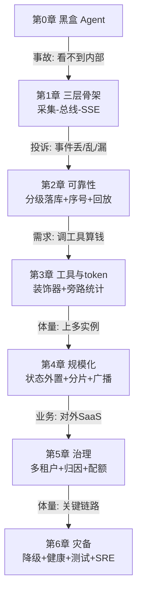

# 33b Agent 可观测性工程：企业级演进实践手册

> **这份文档是什么**：一份**终极学习项目**手册。你照着它一步步敲代码、复现，最后得到一个真正的企业级可观测 Agent 项目。它同时兼顾两件事——
> - **项目演进**：按企业真实节奏走，每个阶段都是「上一阶段出问题了才进下一阶段」，不是一上来全铺架构；
> - **项目实践**：每行代码都给全、能编译、能跑，你手动复现就能形成完整项目。
>
> **和 33a 的关系**：[33a](./33a-Agent可观测性最小实战.md) 是你的练手小项目（30 分钟跑通骨架）；本文 33b 是终极项目（完整企业级，2-3 周复现）。两者不冲突，33a 是 33b 第 1 章的缩略版。
>
> **配套查参**：[33-Agent子过程实时可见性方案](./33-Agent子过程实时可见性方案.md) 是理论全本，某项设计想看完整细节时翻它。
>
> **技术栈**：Spring Boot 4.1 · Spring AI 2.0.0 · Java 21 · WebFlux · Reactor · Maven · DeepSeek（OpenAI 兼容协议）。
> **难度假设**：你会 Java、会用 IDE、会跑 Maven，但不熟 Reactor/SSE/可观测性。每个新概念第一次出现都先用大白话讲。

---

## 目录

- [前言：怎么用这份文档](#前言怎么用这份文档)
- [第 0 章：开张——建项目，跑通黑盒 Agent](#第-0-章开张建项目跑通黑盒-agent)
- [第 1 章：第一次事故——给它装上监控屏](#第-1-章第一次事故给它装上监控屏)
- [第 2 章：用户投诉——让事件可靠](#第-2-章用户投诉让事件可靠)（待写）
- [第 3 章：看到工具调用与 token](#第-3-章看到工具调用与-token)（待写）
- [第 4 章：上量了——状态外置与分片](#第-4-章上量了状态外置与分片)（待写）
- [第 5 章：对多客户收费——多租户与成本治理](#第-5-章对多客户收费多租户与成本治理)（待写）
- [第 6 章：生产关键系统——灾备与 SRE](#第-6-章生产关键系统灾备与-sre)（待写）
- [附录：完整目录树与踩坑手册](#附录完整目录树与踩坑手册)（待写）

---

## 前言：怎么用这份文档

### 这份文档的写作哲学

企业里的系统从来不是「架构师画完图、工程师一把实现」的。真实节奏是：

```
上线最小版 → 用着用着出问题 → 加一层解决 → 量大了又出问题 → 再加一层 …
```

所以这份文档不按「先讲事件模型、再讲总线、再讲采集点」这种**知识分类**组织（那是教材），而是按**一个团队真做这个项目会经历的故事**组织。每一章的模板统一是：

| 小节 | 作用 |
|------|------|
| **X.0 场景** | 什么痛点把我们推到了这一步（演进叙事） |
| **X.1 思路** | 怎么解决、为什么是这个方案（决策对比） |
| **X.2 动手** | 完整代码，照抄能编译（项目实践） |
| **X.3 验证** | 怎么确认这一步跑通了（命令 + 预期结果） |
| **X.4 checkpoint** | 这一步的目录结构 + git 提交点 |
| **X.5 复盘** | 解决了什么、又暴露了什么（承上启下） |

**先讲故事、再敲代码、再验证**——这样你学到的每个机制都有「它解决了什么真实问题」的体感，而不是死记硬背。

### 全书里程碑

| 阶段 | 一句话 | 适用体量 |
|------|-------|---------|
| 第 0 章 | 黑盒 Agent | 起点 |
| 第 1 章 | 最小可见性：采集→总线→SSE | 单实例、内部工具 |
| 第 2 章 | 可靠性：不丢、不乱序、能重连 | 单实例、有真实用户 |
| 第 3 章 | 工具调用与 token 可见 | 单实例、Agent 调工具 |
| 第 4 章 | 规模化：状态外置、分片、多实例 | 多实例、日活 1w+ |
| 第 5 章 | 治理：多租户、成本、配额 | SaaS、多客户 |
| 第 6 章 | 灾备：降级、SRE、测试 | 生产关键链路 |

> 你不需要一次走到第 6 章——**走到你当前体量够用的阶段就停**，等痛点出现再往前。这是这份文档的核心纪律：不为想象中的需求写代码。

### 复现约定

- **包名**：本文用 `com.example.aobs` 演示（aobs = Agent Observability）。你自己敲时换成想要的包名，IDE 全局替换即可。**所有 import 的前缀要跟着换**。
- **代码完整性**：每个代码块都是完整的、带 import 的、照抄能编译的。不会留半截、不会埋错。
- **简陋处会标注**：有些代码第一版先写简单版（比如手写 JSON），后面章节会改进。改进点一定明确标注「这一版简陋，第 X 章会改」，并说明为什么现在不一次到位。
- **每章结尾有 checkpoint**：目录结构 + git 提交命令。养成小步提交的习惯。

---

## 第 0 章：开张——建项目，跑通黑盒 Agent

### 0.0 场景

你所在的团队要做一个「AI 写作助手」：用户输入主题，AI 生成文章。技术上用 Spring AI 调 DeepSeek，分三步（生成大纲 → 写草稿 → 润色）。

这一章结束时，你有一个**能跑但完全黑盒**的 Agent——调一次，等十几秒，出结果，中间一无所知。

> 为什么从黑盒开始？因为真实项目就是这样：**先让它能干活，再让它能被观察**。一上来就铺可观测性架构是过度设计。我们要等它「出事」，才知道该观测什么。这个「出事」会在第 1 章发生。

### 0.1 思路：先建项目跑通业务，不碰可观测性

这一步零可观测性，只把业务链路跑通。关键决策两个：

| 决策 | 选择 | 理由 |
|------|------|------|
| Web 框架 | WebFlux（不是 Web） | SSE 和 Spring AI 流式都是响应式，WebFlux 天然契合；后面不用迁移 |
| 业务结构 | 抽象基类 + 具体子类 | 第 1 章要给基类加可观测性，抽象出来好统一改 |

### 0.2 动手

#### 0.2.1 建项目 + pom.xml

用 IDE 或 Spring Initializr 建 Maven 单模块项目。目录：

```
ai-writing-assistant/
└── pom.xml
```

`pom.xml`：

```xml
<?xml version="1.0" encoding="UTF-8"?>
<project xmlns="http://maven.apache.org/POM/4.0.0"
         xmlns:xsi="http://www.w3.org/2001/XMLSchema-instance"
         xsi:schemaLocation="http://maven.apache.org/POM/4.0.0
         https://maven.apache.org/xsd/maven-4.0.0.xsd">
    <modelVersion>4.0.0</modelVersion>

    <parent>
        <groupId>org.springframework.boot</groupId>
        <artifactId>spring-boot-starter-parent</artifactId>
        <version>4.1.0</version>
        <relativePath/>
    </parent>

    <groupId>com.example.aobs</groupId>
    <artifactId>ai-writing-assistant</artifactId>
    <version>0.1.0-SNAPSHOT</version>
    <name>ai-writing-assistant</name>

    <properties>
        <java.version>21</java.version>
        <spring-ai.version>2.0.0</spring-ai.version>
    </properties>

    <dependencies>
        <!-- WebFlux：HTTP 接口和 SSE 都靠它（注意不是 spring-boot-starter-web） -->
        <dependency>
            <groupId>org.springframework.boot</groupId>
            <artifactId>spring-boot-starter-webflux</artifactId>
        </dependency>

        <!-- Spring AI 调 OpenAI 兼容协议（DeepSeek 兼容） -->
        <dependency>
            <groupId>org.springframework.ai</groupId>
            <artifactId>spring-ai-starter-model-openai</artifactId>
        </dependency>

        <!-- 配置元数据，让 application.yaml 有提示（可选但推荐） -->
        <dependency>
            <groupId>org.springframework.boot</groupId>
            <artifactId>spring-boot-configuration-processor</artifactId>
            <optional>true</optional>
        </dependency>
    </dependencies>

    <!-- Spring AI 的 BOM：统一管 spring-ai 各组件版本 -->
    <dependencyManagement>
        <dependencies>
            <dependency>
                <groupId>org.springframework.ai</groupId>
                <artifactId>spring-ai-bom</artifactId>
                <version>${spring-ai.version}</version>
                <type>pom</type>
                <scope>import</scope>
            </dependency>
        </dependencies>
    </dependencyManagement>

    <build>
        <plugins>
            <plugin>
                <groupId>org.springframework.boot</groupId>
                <artifactId>spring-boot-maven-plugin</artifactId>
            </plugin>
        </plugins>
    </build>
</project>
```

> **小白疑问：为什么用 WebFlux 不是 Web？**
> Web（spring-boot-starter-web）基于 Servlet，阻塞模型，一个请求占一个线程。WebFlux 基于 Reactor，响应式非阻塞。我们要做的 SSE 推送（后面会大量用）在 WebFlux 下天然契合（返回 `Flux<ServerSentEvent>` 就行）。所以从一开始就用 WebFlux，后面不用迁移。
>
> **重要**：不要同时引 `spring-boot-starter-web` 和 `spring-boot-starter-webflux`，会冲突。只用 WebFlux。

#### 0.2.2 配置文件

`src/main/resources/application.yaml`：

```yaml
spring:
  ai:
    openai:
      # DeepSeek 兼容 OpenAI 协议，所以用 openai starter 配 deepseek 地址
      # 换成你自己的 DeepSeek API key（去 platform.deepseek.com 申请）
      api-key: ${DEEPSEEK_API_KEY:你的key}
      base-url: https://api.deepseek.com
      chat:
        model: deepseek-chat
        temperature: 0.7
logging:
  level:
    org.springframework.ai: info
```

> ⚠️ **安全提示**：API key 不要硬编码进 yaml 再提交 git。上面 `${DEEPSEEK_API_KEY:你的key}` 是「优先读环境变量，没有就用默认值」。生产里删掉默认值、只读环境变量。`.gitignore` 别把带真实 key 的配置提交。

#### 0.2.3 启动类

`src/main/java/com/example/aobs/Application.java`：

```java
package com.example.aobs;

import org.springframework.boot.SpringApplication;
import org.springframework.boot.autoconfigure.SpringBootApplication;

@SpringBootApplication
public class Application {
    public static void main(String[] args) {
        SpringApplication.run(Application.class, args);
    }
}
```

`@SpringBootApplication` 是组合注解（开启自动装配 + 组件扫描）。扫描范围是 `com.example.aobs` 及子包，所以后面所有类放这个包下。

#### 0.2.4 业务核心：三步链式 Workflow

用「抽象基类 + 具体子类」结构（模板方法模式），因为第 1 章要给基类加可观测性。

`src/main/java/com/example/aobs/workflow/ChainingService.java`：

```java
package com.example.aobs.workflow;

import org.springframework.ai.chat.client.ChatClient;
import org.springframework.ai.chat.memory.ChatMemory;

import java.util.List;
import java.util.function.BiFunction;

/**
 * 三步链式 Workflow 的抽象基类。
 * 子类只要声明「这三步分别做什么」（实现 steps()），run() 负责按顺序串起来执行。
 */
public abstract class ChainingService {

    protected final ChatClient chatClient;

    protected ChainingService(ChatClient chatClient) {
        this.chatClient = chatClient;
    }

    /** 子类声明步骤链。每步入参是（上一步输出, sessionId），出参是本步输出。 */
    protected abstract List<BiFunction<String, String, String>> steps();

    /** 执行整条链：把上一步输出喂给下一步当输入。 */
    public String run(String input, String sessionId) {
        String payload = input;
        for (BiFunction<String, String, String> step : steps()) {
            payload = step.apply(payload, sessionId);
        }
        return payload;
    }

    /** 调一次 LLM。子类的步骤里用这个。 */
    protected String call(String system, String prompt, String sessionId) {
        return chatClient.prompt()
                .system(system)
                .user(prompt)
                .advisors(spec -> spec.param(ChatMemory.CONVERSATION_ID, sessionId))
                .call()
                .content();
    }
}
```

`src/main/java/com/example/aobs/writing/ArticleService.java`：

```java
package com.example.aobs.writing;

import com.example.aobs.workflow.ChainingService;
import org.springframework.ai.chat.client.ChatClient;
import org.springframework.stereotype.Service;

import java.util.List;
import java.util.function.BiFunction;

/** 写作助手：大纲 → 草稿 → 润色。 */
@Service
public class ArticleService extends ChainingService {

    public ArticleService(ChatClient chatClient) {
        super(chatClient);
    }

    @Override
    protected List<BiFunction<String, String, String>> steps() {
        return List.of(
                (topic, sid) -> call("你是写作助手。根据主题生成大纲，只输出大纲本身。", topic, sid),
                (outline, sid) -> call("你是写作助手。根据大纲写一篇草稿，只输出草稿正文。", outline, sid),
                (draft, sid) -> call("你是写作助手。润色这篇草稿让它更流畅自然，只输出最终文本。", draft, sid)
        );
    }
}
```

> **小白疑问：`@Service` 和构造器注入**
> `@Service` 告诉 Spring「这是个 Bean，帮我管理」。`ChatClient` 通过构造器传进来，Spring 看到该类型 Bean 自动注入。这是 Spring 推荐写法（比 `@Autowired` 字段注入更利于测试）。

#### 0.2.5 HTTP 接口

`src/main/java/com/example/aobs/writing/ArticleController.java`：

```java
package com.example.aobs.writing;

import org.springframework.web.bind.annotation.*;

@RestController
@RequestMapping("/api/article")
public class ArticleController {

    private final ArticleService articleService;

    public ArticleController(ArticleService articleService) {
        this.articleService = articleService;
    }

    /** 生成文章。curl "http://localhost:8080/api/article?prompt=AI的未来" -H "sessionId: s1" */
    @GetMapping
    public String generate(@RequestParam String prompt,
                           @RequestHeader String sessionId) {
        return articleService.run(prompt, sessionId);
    }
}
```

### 0.3 验证

```bash
mvn spring-boot:run
```

看到 `Started Application in x.xxx seconds` 就是起来了。另开终端：

```bash
curl "http://localhost:8080/api/article?prompt=AI的未来" -H "sessionId: s1"
```

等约 10-15 秒（三次 LLM 调用），返回一篇润色过的文章。

### 0.4 checkpoint

```
src/main/java/com/example/aobs/
├── Application.java
├── workflow/
│   └── ChainingService.java
└── writing/
    ├── ArticleService.java
    └── ArticleController.java
```

```bash
git init && git add -A
git commit -m "第0章：黑盒写作助手跑通"
```

### 0.5 复盘

产品能跑了。但试着回答这些：
- 用户说「这次特别慢」——你知道是三步里哪步慢吗？**不知道。**
- 想看中间的大纲——能看到吗？**不能。**
- 想加日志记录每步耗时——要不要改业务代码？**要。**

**黑盒的代价：内部不可见，每次想知道多一点都要改业务代码。** 第 1 章解决这个问题。

---

## 第 1 章：第一次事故——给它装上监控屏

### 1.0 场景

产品上线给团队内部试用。一周后同事反馈「有时候特别慢，偶尔还超时」。你打开日志，只有 `ArticleService.run` 的开始结束，中间一片空白。本地复现三次都正常（问题是偶发的）。

**你意识到：看不到 Agent 内部，根本没法定位偶发问题。** 决定给它装「监控屏」——让三步执行的每一步都能被实时看到。

### 1.1 思路：三层最小架构

要做什么：让 Workflow 每一步把「我开始了/我结束了」告诉外部，外部再实时推给看的人。拆成三层：

```
[写作 Workflow 每一步]  ——emit 事件——>  [事件总线]  ——订阅——>  [SSE 推给 curl/浏览器]
   （采集）                             （总线）              （推送）
```

**关键决策：为什么搞总线，不直接在 Controller 收集事件返回？**

因为后面会有**不止一个消费者**（前端要看、日志要记、还要算成本）。总线结构让「生产事件的人」和「消费事件的人」互不干扰。这个价值第 2 章会体现，先留个印象。

> 更深一层：如果让 `ArticleService.run` 直接返回事件流，每多一个消费者订阅就会把整个 `run` 重新执行一遍（重新调 3 次 LLM）——因为那种流是「冷流」。总线用的 `Sinks.Many` 是「热流」，事件发一次就完，多个消费者共享同一条流。这是整个架构的地基，第 1 章先记住结论，第 2 章亲手体会。

### 1.2 动手

#### 1.2.1 AgentEvent——事件本身

先定义「一个事件长什么样」。

`src/main/java/com/example/aobs/obs/AgentEvent.java`：

```java
package com.example.aobs.obs;

import java.time.Instant;
import java.util.Map;

/**
 * 一个 Agent 事件，描述「Agent 执行过程中发生了什么」。
 * 用 record（Java 16+）：不可变数据类，自动生成构造器/getter/equals/hashCode。
 */
public record AgentEvent(
        String type,                  // 事件类型，如 "SESSION_STARTED"、"STEP_START"
        String sessionId,             // 属于哪个会话（前端按这个过滤）
        Instant timestamp,            // 发生时间
        Map<String, Object> data      // 附加信息（这一步的输入/输出等）
) {
    /** 快捷构造：自动填 timestamp。 */
    public static AgentEvent of(String type, String sessionId, Map<String, Object> data) {
        return new AgentEvent(type, sessionId, Instant.now(), data);
    }
}
```

> **小白疑问：为什么用 `Map<String,Object>` 装 data，不定义具体字段？**
> 不同事件附加信息差别大（SESSION_STARTED 有 input，STEP_END 有 output）。用 Map 灵活，新增事件类型不用改这个类。代价是类型不安全——第 2 章会权衡，先简单。

#### 1.2.2 EventBus——事件总线（整个方案的心脏）

`src/main/java/com/example/aobs/obs/EventBus.java`：

```java
package com.example.aobs.obs;

import org.springframework.stereotype.Component;
import reactor.core.publisher.Flux;
import reactor.core.publisher.Sinks;

/**
 * 事件总线。整个进程就一个实例（@Component 默认单例）。
 * 两个核心能力：emit(事件) 往总线塞事件；flux() 拿事件流。
 *
 * 底层 Sinks.Many 当成一个「公共公告板」：
 *   multicast：广播，所有订阅者都收得到
 *   onBackpressureBuffer(256)：消费者来不及处理时缓冲 256 条
 */
@Component
public class EventBus {

    // autoCancel=false：即使暂时没人订阅，总线也别自动关闭
    private final Sinks.Many<AgentEvent> sink =
            Sinks.many().multicast().onBackpressureBuffer(256, false);

    /** 生产者调这个：发射一个事件。 */
    public void emit(AgentEvent event) {
        sink.tryEmitNext(event);   // 非阻塞塞事件，失败也不抛
    }

    /** 消费者调这个：拿事件流。 */
    public Flux<AgentEvent> flux() {
        return sink.asFlux();
    }
}
```

#### 1.2.3 给 Workflow 埋点（采集）

改 `ChainingService`，加 EventBus 依赖，在 `run` 里每步前后 emit。**不动业务逻辑**。

`src/main/java/com/example/aobs/workflow/ChainingService.java`（修改）：

```java
package com.example.aobs.workflow;

import com.example.aobs.obs.AgentEvent;
import com.example.aobs.obs.EventBus;
import org.springframework.ai.chat.client.ChatClient;
import org.springframework.ai.chat.memory.ChatMemory;

import java.util.List;
import java.util.Map;
import java.util.function.BiFunction;

public abstract class ChainingService {

    protected final ChatClient chatClient;
    protected final EventBus eventBus;    // ← 新增

    protected ChainingService(ChatClient chatClient, EventBus eventBus) {
        this.chatClient = chatClient;
        this.eventBus = eventBus;
    }

    protected abstract List<BiFunction<String, String, String>> steps();

    public String run(String input, String sessionId) {
        eventBus.emit(AgentEvent.of("SESSION_STARTED", sessionId, Map.of("input", input)));

        String payload = input;
        List<BiFunction<String, String, String>> stepList = steps();
        for (int i = 0; i < stepList.size(); i++) {
            int step = i;
            int total = stepList.size();

            eventBus.emit(AgentEvent.of("STEP_START", sessionId,
                    Map.of("step", step, "total", total)));

            payload = stepList.get(i).apply(payload, sessionId);  // 执行这步（调 LLM，耗时）

            eventBus.emit(AgentEvent.of("STEP_END", sessionId,
                    Map.of("step", step, "output", truncate(payload, 80))));
        }

        eventBus.emit(AgentEvent.of("SESSION_COMPLETED", sessionId,
                Map.of("output", truncate(payload, 80))));
        return payload;
    }

    private static String truncate(String s, int max) {
        if (s == null) return "";
        return s.length() <= max ? s : s.substring(0, max) + "...";
    }

    protected String call(String system, String prompt, String sessionId) {
        return chatClient.prompt()
                .system(system)
                .user(prompt)
                .advisors(spec -> spec.param(ChatMemory.CONVERSATION_ID, sessionId))
                .call()
                .content();
    }
}
```

因为父类构造器加了参数，子类 `ArticleService` 跟着改（**配套改动**，改了接口要同步调用方才能编译）：

`src/main/java/com/example/aobs/writing/ArticleService.java`（改构造器）：

```java
package com.example.aobs.writing;

import com.example.aobs.obs.EventBus;
import com.example.aobs.workflow.ChainingService;
import org.springframework.ai.chat.client.ChatClient;
import org.springframework.stereotype.Service;

import java.util.List;
import java.util.function.BiFunction;

@Service
public class ArticleService extends ChainingService {

    public ArticleService(ChatClient chatClient, EventBus eventBus) {
        super(chatClient, eventBus);
    }

    @Override
    protected List<BiFunction<String, String, String>> steps() {
        return List.of(
                (topic, sid) -> call("你是写作助手。根据主题生成大纲，只输出大纲本身。", topic, sid),
                (outline, sid) -> call("你是写作助手。根据大纲写一篇草稿，只输出草稿正文。", outline, sid),
                (draft, sid) -> call("你是写作助手。润色这篇草稿让它更流畅自然，只输出最终文本。", draft, sid)
        );
    }
}
```

#### 1.2.4 SSE Controller——把事件推给客户端

`src/main/java/com/example/aobs/obs/SseController.java`：

```java
package com.example.aobs.obs;

import com.example.aobs.writing.ArticleService;
import org.springframework.http.MediaType;
import org.springframework.http.codec.ServerSentEvent;
import org.springframework.web.bind.annotation.*;
import reactor.core.publisher.Flux;

import java.util.Map;

/**
 * SSE 推送接口。SSE（Server-Sent Events）：HTTP 长连接，服务端持续推数据，浏览器原生支持。
 */
@RestController
@RequestMapping("/api/obs")
public class SseController {

    private final EventBus eventBus;
    private final ArticleService articleService;

    public SseController(EventBus eventBus, ArticleService articleService) {
        this.eventBus = eventBus;
        this.articleService = articleService;
    }

    /**
     * 订阅会话事件流 + 执行写作任务。
     * 用法：curl -N "http://localhost:8080/api/obs/article?prompt=AI的未来" -H "sessionId: s1"
     */
    @GetMapping(value = "/article", produces = MediaType.TEXT_EVENT_STREAM_VALUE)
    public Flux<ServerSentEvent<String>> stream(@RequestParam String prompt,
                                                @RequestHeader String sessionId) {

        // ① 先订阅事件流（必须在启动任务之前，否则 SESSION_STARTED 会漏）
        Flux<ServerSentEvent<String>> events = eventBus.flux()
                .filter(e -> sessionId.equals(e.sessionId()))
                .takeUntil(e -> "SESSION_COMPLETED".equals(e.type()))
                .map(this::toSse);

        // ② 异步启动写作任务（在另一线程，不阻塞 SSE 流）
        new Thread(() -> articleService.run(prompt, sessionId)).start();

        return events;
    }

    private ServerSentEvent<String> toSse(AgentEvent e) {
        return ServerSentEvent.<String>builder()
                .id(e.sessionId() + "-" + e.timestamp().toEpochMilli())  // 帧ID（第2章重连用）
                .event(e.type())
                .data(toJson(e))
                .build();
    }

    /** 简易 JSON 序列化。⚠️ 简陋版：第 2 章会换成 ObjectMapper。 */
    private String toJson(AgentEvent e) {
        return "{\"type\":\"" + e.type() + "\",\"data\":" + mapToJson(e.data()) + "}";
    }

    private String mapToJson(Map<String, Object> m) {
        StringBuilder sb = new StringBuilder("{");
        m.forEach((k, v) -> sb.append("\"").append(k).append("\":\"")
                .append(String.valueOf(v).replace("\"", "'")).append("\","));
        if (sb.length() > 1) sb.setLength(sb.length() - 1);
        return sb.append("}").toString();
    }
}
```

> **关于 `new Thread(...)`**：这是第一版的偷懒做法，第 2 章会换成响应式线程池。真实项目不该用裸 `new Thread`（无上限、开销大），但第 1 章先聚焦「让事件流通起来」，每章只引入一个新难点。
>
> **关于手写 JSON**：同样简陋，第 2 章换 `ObjectMapper`。**为什么现在不一次到位？** 因为第一版要让你看清「SSE 帧长什么样」（手动拼 JSON 最直观），等你看懂了再换健壮实现。

### 1.3 验证

确保 `ArticleService` 构造器改对、`SseController` 的 import 补全。启动：

```bash
mvn spring-boot:run
```

测试 SSE 流（`-N` 关闭 curl 缓冲，必须加，否则看不到实时效果）：

```bash
curl -N "http://localhost:8080/api/obs/article?prompt=AI的未来" -H "sessionId: s1"
```

预期（每行间隔几秒）：

```
event:SESSION_STARTED
data:{"type":"SESSION_STARTED","data":{"input":"AI的未来"}}

event:STEP_START
data:{"type":"STEP_START","data":{"step":"0","total":"3"}}

event:STEP_END
data:{"type":"STEP_END","data":{"step":"0","output":"一、引言..."}}
...
event:SESSION_COMPLETED
data:{"type":"SESSION_COMPLETED","data":{"output":"（润色后的文章开头）..."}}
```

**对比第 0 章的黑盒**：那个等 15 秒出一坨文本；这个每 3-5 秒冒一个事件，实时看到「现在第几步、上一步产出了什么」。

### 1.4 checkpoint

```
src/main/java/com/example/aobs/
├── Application.java
├── workflow/
│   └── ChainingService.java     （改：加 EventBus + 埋点）
├── writing/
│   ├── ArticleService.java      （改：构造器）
│   └── ArticleController.java
└── obs/                          ← 新增
    ├── AgentEvent.java
    ├── EventBus.java
    └── SseController.java
```

```bash
git add -A && git commit -m "第1章：接入事件总线 + SSE，Agent 子过程可见"
```

### 1.5 复盘

**做了**：搭起三层骨架（采集→总线→SSE），Agent 内部可见了。

**还差（后面章节解决）**：
- **事件可能丢**：`tryEmitNext` 失败被静默吞，高峰期 `SESSION_COMPLETED` 可能丢，前端永远转圈 → **第 2 章**
- **事件可能乱序**：埋点在不同时机发，理论上可能乱序到达 → **第 2 章**
- **断了重连会漏**：网络抖动、刷新页面，重连后中间事件没了 → **第 2 章**
- **只看到 Workflow 步骤**：还没看到工具调用细节、token 消耗 → **第 3 章**
- **`new Thread` 太糙**：要换线程池 → **第 2 章**
- **手写 JSON 简陋**：要换 ObjectMapper → **第 2 章**

**最该理解的**：整个架构的「心脏」是 `EventBus`（那个 `Sinks.Many`）。生产者和消费者通过它解耦。这个结构是后面所有演进的地基——后面加什么都不改这个骨架，只往里加东西。

---

> **第 1 章结束。**
>
> 第 2 章会让它「可靠」（不丢、不乱、能重连），并兑现上面两个改进承诺（线程池、ObjectMapper）。你会先在第 1 章版本上观察到那些问题，再针对每个问题加机制——每个机制都有「解决了什么真实问题」的体感。

---

## 第 2 章：用户投诉——让事件可靠

### 2.0 场景：三连投诉

第 1 章的版本上线用了几天，收到三个投诉，正好对应第 1 章末尾列的三个问题：

1. **「生成完了但页面一直转圈」**——查代码：`SESSION_COMPLETED` 没推到前端。高峰期事件多，`Sinks.Many` 的 256 缓冲满了，`tryEmitNext` 失败被静默吞掉。**事件丢了。**
2. **「进度条乱跳，第 2 步比第 1 步先显示」**——埋点在不同时机 emit，理论上可能乱序到达。**事件乱序。**
3. **「刷新页面，中间步骤没了」**——`Sinks.Many` 是热流，重连后只看得到重连之后的事件。**重连漏事件。**

这一章逐个解决。先解决最痛的——**事件丢失**。

> 这一章还顺带兑现第 1 章两个承诺：`new Thread` 换线程池、手写 JSON 换 ObjectMapper。

### 2.1 思路

#### 解决「丢失」：事件分级 + 关键事件落库兜底

把事件分三类，区别对待：

| 级别 | 例子 | 丢了后果 | 策略 |
|------|------|---------|------|
| CRITICAL | `SESSION_STARTED/COMPLETED/FAILED` | 前端永远转圈 | 先落 Redis，背压满也能回放 |
| NORMAL | `STEP_START/STEP_END` | 进度条少一帧 | 尽力送达 |
| DISCARDABLE | 流式正文片段（第 3 章） | 无所谓 | 背压满优先丢 |

> 这里第一次引入 Redis。第 0-1 章项目零外部依赖，可靠性需求出现才引入——这是演进的真实节奏。

#### 解决「重连漏」：Last-Event-ID 回放

浏览器 `EventSource` 断线重连会**自动**带 `Last-Event-ID` 头（W3C 标准）。后端读这个头，从 Redis 把断连期间的事件补发。前端零改动。前提是后端每帧设了 `id:`——第 1 章已经设了，这就是「为演进留口子」。

#### 解决「乱序」：会话内序号

给每个事件一个会话内递增序号，SSE 端按序号排序后再发。但**单实例、单线程编排下序号天然有序，重排在第 2 章用不上**——这里只加序号字段（成本低、为后面铺路），重排逻辑放第 4 章（那里有多线程、多实例，乱序才真会发生）。

> **这是「不预先实现」的纪律**：序号字段现在加，重排逻辑等真需要时再写。否则第 2 章就要讲一堆现在用不上的排序窗口逻辑。

### 2.2 动手

#### 2.2.1 加 Redis 依赖

`pom.xml` 的 `<dependencies>` 加：

```xml
<!-- Redis：第 2 章开始用，存关键事件兜底 + 重连回放 -->
<dependency>
    <groupId>org.springframework.boot</groupId>
    <artifactId>spring-boot-starter-data-redis</artifactId>
</dependency>
```

`application.yaml` 加：

```yaml
spring:
  data:
    redis:
      host: 127.0.0.1
      port: 6379
  ai:
    openai:
      # ... 原有配置不变
```

> 本地装 Redis：macOS `brew install redis && brew services start redis`；Docker `docker run -d -p 6379:6379 redis`。

#### 2.2.2 AgentEvent 加 criticality 字段

`src/main/java/com/example/aobs/obs/AgentEvent.java`（修改）：

```java
package com.example.aobs.obs;

import java.time.Instant;
import java.util.Map;

public record AgentEvent(
        String type,
        String sessionId,
        Instant timestamp,
        Map<String, Object> data,
        Criticality criticality    // ← 新增
) {

    /** 事件关键级别，决定背压满时降级策略。 */
    public enum Criticality {
        CRITICAL,      // 终态类，绝不能丢，落库兜底
        NORMAL,        // 阶段/步骤事件，尽力送达
        DISCARDABLE    // 流式片段，背压满优先丢
    }

    /** 按事件类型推断默认关键级别。 */
    public static Criticality defaultCriticality(String type) {
        return switch (type) {
            case "SESSION_STARTED", "SESSION_COMPLETED", "SESSION_FAILED" -> Criticality.CRITICAL;
            default -> Criticality.NORMAL;
        };
    }

    public static AgentEvent of(String type, String sessionId, Map<String, Object> data) {
        return new AgentEvent(type, sessionId, Instant.now(), data, defaultCriticality(type));
    }
}
```

> **小白疑问：`switch` 表达式（Java 14+）**
> `switch (type) { case ... -> ... }` 箭头形式不穿透、直接返回值，比老式 `case X: return ...; break;` 简洁。Java 21 完全支持。

#### 2.2.3 关键事件落库：CriticalEventStore

用 Redis Sorted Set（有序集合）存，score 用时间戳，方便按顺序回放。

`src/main/java/com/example/aobs/obs/CriticalEventStore.java`（新增）：

```java
package com.example.aobs.obs;

import com.fasterxml.jackson.databind.ObjectMapper;
import org.springframework.data.redis.core.StringRedisTemplate;
import org.springframework.stereotype.Component;

import java.time.Duration;
import java.util.ArrayList;
import java.util.List;
import java.util.Set;

/**
 * 关键事件存储：Redis Sorted Set，score 用时间戳。
 * 两个用途：① 背压满兜底；② SSE 重连回放。
 */
@Component
public class CriticalEventStore {

    private static final Duration TTL = Duration.ofMinutes(30);
    private final StringRedisTemplate redis;
    private final ObjectMapper mapper = new ObjectMapper();

    public CriticalEventStore(StringRedisTemplate redis) {
        this.redis = redis;
    }

    private String key(String sessionId) {
        return "aobs:events:" + sessionId;
    }

    /** 存一个事件，score 用时间戳，天然按发生顺序。 */
    public void save(AgentEvent event) {
        try {
            String json = mapper.writeValueAsString(event);
            redis.opsForZSet().add(key(event.sessionId()), json, event.timestamp().toEpochMilli());
            redis.expire(key(event.sessionId()), TTL);
        } catch (Exception e) {
            System.err.println("[CriticalEventStore] save failed: " + e.getMessage());
        }
    }

    /**
     * 读某会话中，指定时间戳之后的所有事件（重连回放用）。
     * @param afterEpochMs 只读这个时间戳之后的事件
     */
    public List<AgentEvent> findAfter(String sessionId, long afterEpochMs) {
        Set<String> jsonSet = redis.opsForZSet().rangeByScore(
                key(sessionId), afterEpochMs + 1, Double.MAX_VALUE);
        if (jsonSet == null) return List.of();
        List<AgentEvent> result = new ArrayList<>();
        for (String json : jsonSet) {
            try {
                result.add(mapper.readValue(json, AgentEvent.class));
            } catch (Exception ignore) {
                // 单条解析失败跳过
            }
        }
        return result;
    }
}
```

> **API 核实**：`opsForZSet().add(key, member, score)`、`rangeByScore(key, min, max)`、`expire(key, Duration)` 都是 `spring-data-redis` 真实方法。`ObjectMapper` 来自 Jackson（Spring Boot 自带）。这是第 1 章承诺的「手写 JSON 换 ObjectMapper」。

#### 2.2.4 EventBus 落库关键事件 + 分配序号

这一步同时做两件事：关键事件落库（解决丢失）、分配会话内序号（为乱序重排铺路）。

先给 `AgentEvent` 再加 `sequence` 字段：

`src/main/java/com/example/aobs/obs/AgentEvent.java`（再加字段）：

```java
public record AgentEvent(
        String type,
        String sessionId,
        Instant timestamp,
        Map<String, Object> data,
        Criticality criticality,
        long sequence        // ← 新增：会话内单调递增序号，0 表示未分配
) {
    public enum Criticality { CRITICAL, NORMAL, DISCARDABLE }

    public static Criticality defaultCriticality(String type) {
        return switch (type) {
            case "SESSION_STARTED", "SESSION_COMPLETED", "SESSION_FAILED" -> Criticality.CRITICAL;
            default -> Criticality.NORMAL;
        };
    }

    /** 快捷构造（sequence 默认 0，由 EventBus 分配）。 */
    public static AgentEvent of(String type, String sessionId, Map<String, Object> data) {
        return new AgentEvent(type, sessionId, Instant.now(), data, defaultCriticality(type), 0L);
    }
}
```

`src/main/java/com/example/aobs/obs/EventBus.java`（修改：落库 + 序号）：

```java
package com.example.aobs.obs;

import org.springframework.beans.factory.ObjectProvider;
import org.springframework.stereotype.Component;
import reactor.core.publisher.Flux;
import reactor.core.publisher.Sinks;

import java.util.Map;
import java.util.concurrent.ConcurrentHashMap;
import java.util.concurrent.atomic.AtomicLong;

@Component
public class EventBus {

    private final Sinks.Many<AgentEvent> sink =
            Sinks.many().multicast().onBackpressureBuffer(256, false);

    // ObjectProvider：有 Redis 就用 CriticalEventStore，没有也能启动（开发环境容错）
    private final ObjectProvider<CriticalEventStore> storeProvider;

    // 每个会话一个递增计数器（为序号用）
    private final Map<String, AtomicLong> sequences = new ConcurrentHashMap<>();

    public EventBus(ObjectProvider<CriticalEventStore> storeProvider) {
        this.storeProvider = storeProvider;
    }

    public void emit(AgentEvent event) {
        // 1. 分配会话内序号
        long seq = sequences.computeIfAbsent(event.sessionId(), k -> new AtomicLong())
                .incrementAndGet();
        AgentEvent sequenced = withSequence(event, seq);

        // 2. 关键事件先落库（兜底）
        CriticalEventStore store = storeProvider.getIfAvailable();
        if (store != null && sequenced.criticality() == AgentEvent.Criticality.CRITICAL) {
            store.save(sequenced);
        }

        // 3. 推总线
        sink.tryEmitNext(sequenced);
    }

    /** record 不可变，复制一份改 sequence。 */
    private static AgentEvent withSequence(AgentEvent e, long seq) {
        return new AgentEvent(e.type(), e.sessionId(), e.timestamp(), e.data(),
                e.criticality(), seq);
    }

    public Flux<AgentEvent> flux() {
        return sink.asFlux();
    }
}
```

> **为什么用 `AtomicLong`？**
> 序号要「自增」且线程安全。`AtomicLong.incrementAndGet()` 原子操作，多线程同时 emit 不会拿到重复序号。`ConcurrentHashMap` 保证「每会话一个计数器」的可见性。
>
> **为什么用 `ObjectProvider` 不直接 `@Autowired`？**
> 直接注入的话，没装 Redis 时 `StringRedisTemplate` 创建失败、整个应用起不来。`ObjectProvider.getIfAvailable()` 是「有就用、没有跳过」，让应用无 Redis 也能跑（只是没兜底）。开发体验上的小体贴。

#### 2.2.5 SseController 加回放 + 换线程池 + 换 ObjectMapper

`src/main/java/com/example/aobs/obs/SseController.java`（大改）：

```java
package com.example.aobs.obs;

import com.example.aobs.writing.ArticleService;
import com.fasterxml.jackson.databind.ObjectMapper;
import org.springframework.beans.factory.ObjectProvider;
import org.springframework.http.MediaType;
import org.springframework.http.codec.ServerSentEvent;
import org.springframework.web.bind.annotation.*;
import reactor.core.publisher.Flux;
import reactor.core.publisher.Mono;
import reactor.core.scheduler.Schedulers;

@RestController
@RequestMapping("/api/obs")
public class SseController {

    private final EventBus eventBus;
    private final ArticleService articleService;
    private final ObjectProvider<CriticalEventStore> storeProvider;
    private final ObjectMapper mapper = new ObjectMapper();

    public SseController(EventBus eventBus,
                         ArticleService articleService,
                         ObjectProvider<CriticalEventStore> storeProvider) {
        this.eventBus = eventBus;
        this.articleService = articleService;
        this.storeProvider = storeProvider;
    }

    /**
     * 订阅会话事件流 + 执行写作任务。支持 Last-Event-ID 重连回放。
     */
    @GetMapping(value = "/article", produces = MediaType.TEXT_EVENT_STREAM_VALUE)
    public Flux<ServerSentEvent<String>> stream(@RequestParam String prompt,
                                                @RequestHeader String sessionId,
                                                @RequestHeader(value = "Last-Event-ID", required = false)
                                                    String lastEventId) {

        // ① 回放段：有 lastEventId 且有 Redis，先补发断连期间的关键事件
        Flux<AgentEvent> replay = Flux.empty();
        CriticalEventStore store = storeProvider.getIfAvailable();
        if (store != null && lastEventId != null) {
            replay = Flux.fromIterable(store.findAfter(sessionId, parseTimestampFrom(lastEventId)));
        }

        // ② 实时段：订阅总线，过滤本会话
        Flux<AgentEvent> live = eventBus.flux()
                .filter(e -> sessionId.equals(e.sessionId()));

        // ③ 合并：先回放、再实时；收到终态就结束流
        Flux<ServerSentEvent<String>> events = Flux.concat(replay, live)
                .takeUntil(e -> "SESSION_COMPLETED".equals(e.type())
                        || "SESSION_FAILED".equals(e.type()))
                .map(this::toSse);

        // ④ 异步执行写作任务（响应式线程池，替换第1章的裸 new Thread）
        Mono.fromRunnable(() -> articleService.run(prompt, sessionId))
                .subscribeOn(Schedulers.boundedElastic())
                .subscribe();

        return events;
    }

    /** 帧ID 格式 "sessionId-时间戳"，取时间戳部分。 */
    private long parseTimestampFrom(String lastEventId) {
        int idx = lastEventId.lastIndexOf('-');
        if (idx < 0) return 0;
        try { return Long.parseLong(lastEventId.substring(idx + 1)); }
        catch (NumberFormatException e) { return 0; }
    }

    private ServerSentEvent<String> toSse(AgentEvent e) {
        return ServerSentEvent.<String>builder()
                .id(e.sessionId() + "-" + e.timestamp().toEpochMilli())
                .event(e.type())
                .data(toJson(e))
                .build();
    }

    /** 用 ObjectMapper（替换第1章手写 JSON）。 */
    private String toJson(AgentEvent e) {
        try {
            return mapper.writeValueAsString(e);
        } catch (Exception ex) {
            return "{\"type\":\"" + e.type() + "\"}";
        }
    }
}
```

> **三个改进（都是第 1 章承诺）**：① 加 Last-Event-ID 回放；② `new Thread` → `Mono.fromRunnable().subscribeOn(boundedElastic)`；③ 手写 JSON → ObjectMapper。
>
> **小白疑问：为什么 `Schedulers.boundedElastic()`？**
> 它是 Reactor 提供的「适合阻塞任务」的线程池，有上限（默认 10×CPU 核数）、可复用。裸 `new Thread` 每次创建销毁开销大、且无上限（高并发会炸）。`subscribe()` 是触发执行（fire-and-forget）。

### 2.3 验证

确保 Redis 已启动。启动应用，测三个场景：

**场景 1：正常流程**（确认没退化）：
```bash
curl -N "http://localhost:8080/api/obs/article?prompt=AI的未来" -H "sessionId: s1"
```
和第 1 章一样看到完整事件流。

**场景 2：关键事件落库了**——跑完后查 Redis：
```bash
redis-cli ZRANGE aobs:events:s1 0 -1
```
能看到 `SESSION_STARTED`、`SESSION_COMPLETED` 两条（CRITICAL 落了库），`STEP_*` 不在（NORMAL 没落）。

**场景 3：重连回放**——curl 模拟不了自动重连，第 3 章写前端页面时演示。现在你只要知道：浏览器 EventSource 断线重连自动带 `Last-Event-ID`，后端从 Redis 补发。

### 2.4 checkpoint

```
src/main/java/com/example/aobs/obs/
├── AgentEvent.java          （改：加 criticality + sequence）
├── EventBus.java            （改：落库 + 分配序号）
├── CriticalEventStore.java  （新增）
└── SseController.java       （改：回放 + 线程池 + ObjectMapper）
```
pom 加了 `spring-boot-starter-data-redis`。

```bash
git add -A && git commit -m "第2章：事件可靠性——分级落库、序号、重连回放"
```

### 2.5 复盘

**解决了第 1 章的三个问题**：
- ✅ 事件丢失 → 关键事件落库兜底
- ✅ 重连漏事件 → Last-Event-ID 回放
- 🟡 事件乱序 → 序号字段加好了，重排逻辑第 4 章再写

**兑现两个改进承诺**：✅ 线程池；✅ ObjectMapper。

**引入新依赖**：Redis（项目从零依赖变成有一个）。

**还差**：
- 看不到工具调用细节、token 消耗 → **第 3 章**
- 多实例下序号/状态会裂 → **第 4 章**

---

## 第 3 章：看到工具调用与 token

### 3.0 场景

产品迭代：用户反馈「写出来的文章字数经常超」，你决定加一个「查字数」工具，让润色步骤先查字数再决定怎么润色。同时财务找你：「这个月 LLM 花了多少钱？哪些会话烧得多？」——你现在完全不知道 token 消耗。

两个新需求：
1. 让 Agent 能调工具，且**工具调用过程要可见**（调了什么、参数、返回、耗时）
2. **统计每次 LLM 的 token 消耗**，算成本

### 3.1 思路

#### 工具调用可见：装饰器包 ToolCallback

Spring AI 里每个工具都是 `ToolCallback`，调用走 `call(String toolInput)` 方法。我们用**装饰器模式**包一层：在 `call` 前后发 `TOOL_CALL_START/END` 事件，不改原始工具代码。

> **为什么用装饰器不用 AOP？** 装饰器显式、可控、好测试；AOP 隐式、调试难。工具数量有限、入口明确（`call` 方法），装饰器最合适。AOP 适合「散落在很多地方、难统一入口」的横切关注点。

#### token 统计：ChatClientMessageAggregator 旁路聚合

LLM 返回的 `ChatResponse` 里有 `Usage`（token 数）。但我们的写作流程是同步 `.call()`，拿一次 response 拿一次 Usage 就行。难点是「统计了不影响主流程」——用旁路方式：在拿到 response 后发个 `LLM_TOKENS` 事件，token 统计交给消费者，业务代码不操心。

> **关于 token 单价**：不同模型单价不同（DeepSeek 比 GPT-4 便宜几十倍）。我们维护一个单价表，按 `promptTokens × 输入价 + completionTokens × 输出价` 算成本。单价是配置，随官方调价改。

### 3.2 动手

#### 3.2.1 加一个工具：查字数

先给写作助手加个简单工具，让 Agent 真有工具可调。

`src/main/java/com/example/aobs/writing/WritingTools.java`（新增）：

```java
package com.example.aobs.writing;

import org.springframework.ai.tool.annotation.Tool;
import org.springframework.stereotype.Component;

/**
 * 写作辅助工具。@Tool 注解的方法会被 Spring AI 注册成工具，LLM 可以自主调用。
 */
@Component
public class WritingTools {

    /** 查文本字数。LLM 调用时传 text 参数。 */
    @Tool(description = "统计给定文本的字数（中文按字算，英文按词算的近似）")
    public int countWords(String text) {
        if (text == null || text.isBlank()) return 0;
        // 简单实现：去空格后长度。真实场景按语言细分。
        return text.replaceAll("\\s+", "").length();
    }
}
```

> **`@Tool` 注解**：Spring AI 2.0 的工具声明方式。`description` 告诉 LLM 这个工具干什么，LLM 据此决定要不要调。方法参数 LLM 会自动从对话里提取。

#### 3.2.2 让 ChatClient 注册这个工具

改启动配置，让 `ChatClient` 默认带上 `WritingTools`。新建一个配置类：

`src/main/java/com/example/aobs/config/ChatClientConfig.java`（新增）：

```java
package com.example.aobs.config;

import com.example.aobs.writing.WritingTools;
import org.springframework.ai.chat.client.ChatClient;
import org.springframework.context.annotation.Bean;
import org.springframework.context.annotation.Configuration;

@Configuration
public class ChatClientConfig {

    /**
     * 自定义 ChatClient：默认带上写作工具。
     * Spring AI 的 ChatClient.Builder 是自动注入的（starter 提供）。
     */
    @Bean
    public ChatClient chatClient(ChatClient.Builder builder, WritingTools tools) {
        return builder
                .defaultTools(tools)           // 注册工具，LLM 可自主调用
                .build();
    }
}
```

> **注意**：原来 `ChainingService` 是直接注入 `ChatClient.Builder` 构造的吗？不是——它注入的是 `ChatClient`。Spring AI starter 默认会提供一个 `ChatClient` Bean。这里我们**自定义**一个带工具的 `ChatClient` Bean 覆盖默认的。如果启动报「多个 ChatClient Bean」冲突，删掉这个自定义 Bean、改成在 `ChainingService.call` 里 `.tools(tools)` 也行——两种方式任选。

#### 3.2.3 工具调用装饰器（采集点）

装饰器包 `ToolCallback`，在 `call` 前后发事件。

`src/main/java/com/example/aobs/obs/ObservableToolCallback.java`（新增）：

```java
package com.example.aobs.obs;

import org.springframework.ai.chat.model.ToolContext;
import org.springframework.ai.tool.ToolCallback;
import org.springframework.ai.tool.definition.ToolDefinition;

import java.util.Map;

/**
 * 工具调用装饰器：delegate 到真实 ToolCallback，前后发事件。
 * 装饰器模式——不改任何 @Tool 方法。
 */
public class ObservableToolCallback implements ToolCallback {

    private final ToolCallback delegate;
    private final EventBus eventBus;
    private final String sessionId;

    public ObservableToolCallback(ToolCallback delegate, EventBus eventBus, String sessionId) {
        this.delegate = delegate;
        this.eventBus = eventBus;
        this.sessionId = sessionId;
    }

    @Override
    public ToolDefinition getToolDefinition() {
        return delegate.getToolDefinition();   // 透传
    }

    @Override
    public String call(String toolInput) {
        return doCall(toolInput, null);
    }

    @Override
    public String call(String toolInput, ToolContext toolContext) {
        return doCall(toolInput, toolContext);
    }

    private String doCall(String toolInput, ToolContext ctx) {
        String toolName = delegate.getToolDefinition().name();
        long start = System.currentTimeMillis();

        eventBus.emit(AgentEvent.of("TOOL_CALL_START", sessionId,
                Map.of("tool", toolName, "args", truncate(toolInput, 2000))));

        try {
            String result = (ctx == null) ? delegate.call(toolInput) : delegate.call(toolInput, ctx);
            eventBus.emit(AgentEvent.of("TOOL_CALL_END", sessionId,
                    Map.of("tool", toolName,
                            "result", truncate(result, 2000),
                            "durationMs", System.currentTimeMillis() - start)));
            return result;
        } catch (RuntimeException ex) {
            // 异常也要发事件，前端能看到「工具失败了」而不是卡住
            eventBus.emit(AgentEvent.of("TOOL_CALL_FAILED", sessionId,
                    Map.of("tool", toolName,
                            "error", ex.getClass().getSimpleName() + ": " + ex.getMessage())));
            throw ex;
        }
    }

    private static String truncate(String s, int max) {
        if (s == null) return "";
        return s.length() <= max ? s : s.substring(0, max) + "...";
    }
}
```

> **API 核实**：`ToolCallback.call(String)`、`call(String, ToolContext)`、`getToolDefinition().name()` 都是 Spring AI 2.0 真实方法（已反编译确认）。
>
> **怎么把这个装饰器接进去？** 工具执行时 Spring AI 内部会拿 `ToolCallback` 列表去调。完整接入需要在「工具注册层」把每个 `ToolCallback` 包一层。这一步依赖 Spring AI 内部的工具装配机制，不同版本接入点不同——**最稳妥的接入方式是：在你的 `ChainingService.call` 里手动拿到工具回调列表并包装**。为避免陷入版本差异，这里给装饰器代码（理解采集点用），实际接入可参考 [33 方案 §4.2](./33-Agent子过程实时可见性方案.md#42-采集点一toolcallback-装饰器装饰器模式不改原始类) 的 `ObservableTools.wrap` 工厂。**关键是理解「装饰器在 call 前后埋点」这个模式**，接入点是工程细节。

#### 3.2.4 token 统计：在 ChainingService.call 里旁路发事件

最直接的 token 统计：拿到 `ChatResponse` 后取 `Usage`，发 `LLM_TOKENS` 事件。改 `ChainingService.call`：

`src/main/java/com/example/aobs/workflow/ChainingService.java`（改 call 方法）：

```java
// 只改 call 方法，其余不变
protected String call(String system, String prompt, String sessionId) {
    org.springframework.ai.chat.model.ChatResponse response = chatClient.prompt()
            .system(system)
            .user(prompt)
            .advisors(spec -> spec.param(ChatMemory.CONVERSATION_ID, sessionId))
            .call()
            .chatResponse();   // 改成拿完整 ChatResponse（而不是只拿 content）

    // 旁路发 token 事件（不影响主流程，返回值照样取 content）
    emitTokens(sessionId, response);

    return response.getResult().getOutput().getText();
}

/** 取 Usage 发 LLM_TOKENS 事件。 */
private void emitTokens(String sessionId, org.springframework.ai.chat.model.ChatResponse response) {
    try {
        var usage = response.getMetadata().getUsage();
        if (usage == null) return;
        int prompt = usage.getPromptTokens() == null ? 0 : usage.getPromptTokens();
        int completion = usage.getCompletionTokens() == null ? 0 : usage.getCompletionTokens();
        String model = response.getMetadata().getModel();
        double cost = costCalculator.calculate(prompt, completion, model);

        eventBus.emit(AgentEvent.of("LLM_TOKENS", sessionId,
                Map.of("promptTokens", prompt,
                        "completionTokens", completion,
                        "totalTokens", prompt + completion,
                        "model", String.valueOf(model),
                        "costUsd", cost)));
    } catch (Exception ignore) {
        // 统计失败不影响主流程
    }
}
```

> **API 核实**：`chatResponse().getMetadata().getUsage()` → `Usage.getPromptTokens()/getCompletionTokens()`、`ChatResponseMetadata.getModel()` 全部真实存在。
>
> **小白疑问：为什么叫「旁路」？**
> token 统计是「额外关心的事」，不是写作主流程。我们发个事件让消费者去统计，`call` 该返回什么还返回什么（文章内容）。统计逻辑和业务逻辑解耦——后面想加 Langfuse 上报、想换计费方式，都改消费者不改 `call`。

#### 3.2.5 成本计算器

`src/main/java/com/example/aobs/obs/CostCalculator.java`（新增）：

```java
package com.example.aobs.obs;

import org.springframework.stereotype.Component;

import java.util.Map;

/**
 * 按 model 单价算成本。单价来自 DeepSeek/OpenAI 官方定价（美元/1K tokens）。
 * 这里用近似值，真实场景从配置读、随官方调价改。
 */
@Component
public class CostCalculator {

    // 每模型「(输入价, 输出价)」美元/1K tokens
    private final Map<String, double[]> pricing = Map.of(
            "deepseek-chat", new double[]{0.00027, 0.00110},    // DeepSeek 近似
            "deepseek-v4-flash", new double[]{0.00014, 0.00028},
            "gpt-4o", new double[]{0.00250, 0.01000}
    );
    private static final double[] DEFAULT = {0.0003, 0.001};

    public double calculate(int promptTokens, int completionTokens, String model) {
        double[] p = pricing.getOrDefault(model == null ? "" : model, DEFAULT);
        return promptTokens / 1000.0 * p[0] + completionTokens / 1000.0 * p[1];
    }
}
```

> `ChainingService` 要注入 `CostCalculator`（构造器加参数），别忘了同步改 `ArticleService` 构造器——这是第 0 章讲过的「配套改动」纪律。

### 3.3 验证

启动应用，触发一次带工具调用的写作（prompt 里提到字数，LLM 更可能调工具）：

```bash
curl -N "http://localhost:8080/api/obs/article?prompt=写一篇关于AI的300字短文" -H "sessionId: s3"
```

预期事件流里会多出：
- `TOOL_CALL_START`（如果 LLM 决定调 `countWords`）
- `TOOL_CALL_END`（带 result、durationMs）
- `LLM_TOKENS`（每次 LLM 调用后，带 promptTokens/completionTokens/costUsd）

观察成本：跑一次完整写作（3 步 LLM），把所有 `LLM_TOKENS` 事件的 `costUsd` 加起来，就是这次写作的总成本（通常零点几美分）。

### 3.4 checkpoint

```
src/main/java/com/example/aobs/
├── config/
│   └── ChatClientConfig.java     （新增）
├── obs/
│   ├── ObservableToolCallback.java  （新增）
│   └── CostCalculator.java          （新增）
├── workflow/
│   └── ChainingService.java       （改：call 加 token 旁路）
└── writing/
    ├── WritingTools.java          （新增）
    └── ArticleService.java        （改：构造器加 CostCalculator）
```

```bash
git add -A && git commit -m "第3章：工具调用可见 + token 成本统计"
```

### 3.5 复盘

**做了**：工具调用过程可见（装饰器）、token/成本统计（旁路 Usage）。

**学到的两个模式**：
- **装饰器采集**：包一层、前后埋点，不改原始类。工具、MCP 调用都用这招。
- **旁路统计**：拿 response 的元数据发事件，业务主流程不变。token、延迟、调用量都这么采集。

**还差**：
- 单实例扛不住高并发 → **第 4 章**
- 成本只能看单次，没有「这个租户花了多少」→ **第 5 章**

> **注意**：第 3 章后项目还是**单实例**。如果你的产品日活不过千、不要多租户，**停在第 3 章就够了**——已经是一个可靠、可见、能算钱的单实例 Agent。第 4 章开始是「量大了/要对外卖」才需要的。

---

## 第 4 章：上量了——状态外置与分片

### 4.0 场景：上多实例，全裂了

日活涨到上万，单实例扛不住，团队决定起 3 个实例做负载均衡。上线第一天就出三个问题：

1. **事件跨实例不通**——用户请求落到实例 A，但 SSE 连接在实例 B。B 订阅的是自己的 `EventBus`，收不到 A 发的事件。前端永远转圈。
2. **序号乱了**——第 2 章的序号是进程内 `ConcurrentHashMap`。同一个会话两步可能落在不同实例，序号从 1、2 变成 1（A）、1（B），重排逻辑废了。
3. **单总线吞吐到顶**——单实例并发会话涨了，一个 `Sinks.Many` 灌 5w/s，缓冲爆；某个慢 SSE 消费者拖累所有会话。

根因：**前面所有状态（事件流、序号、成本）都在进程内**。单实例无感，多实例就裂。

### 4.1 思路

| 问题 | 方案 |
|------|------|
| 事件跨实例不通 | Redis Stream 广播：每个实例 emit 时 `XADD` 到 Stream，所有实例 `XREADGROUP` 拉取 |
| 序号进程内 | 会话状态外置 Redis（`SessionStateStore`），序号用 Redis 原子自增 |
| 单总线吞吐 | 分片：按 sessionId hash 路由到 N 个 sink，慢消费者只影响 1/N |

> **演进逻辑**：第 1-3 章用进程内状态是对的（简单快），因为那时单实例。第 4 章上多实例，进程内状态从「优点」变「致命缺陷」。**这不是设计错误，是约束变了**——同一套代码在不同体量下评价完全不同。

### 4.2 动手

#### 4.2.1 会话状态外置：SessionStateStore

所有 per-session 可变状态进 Redis。这是第 4 章改动最大的一项。

`src/main/java/com/example/aobs/obs/SessionStateStore.java`（新增）：

```java
package com.example.aobs.obs;

import org.springframework.data.redis.core.StringRedisTemplate;
import org.springframework.stereotype.Component;

import java.time.Duration;

/**
 * 会话状态外置存储。Redis Hash 存 per-session 状态，TTL 30 分钟。
 * 进程内无状态 → 多实例任意节点都能正确读写。
 */
@Component
public class SessionStateStore {

    private static final Duration TTL = Duration.ofMinutes(30);
    private final StringRedisTemplate redis;

    public SessionStateStore(StringRedisTemplate redis) {
        this.redis = redis;
    }

    private String key(String sid) {
        return "aobs:session:" + sid + ":state";
    }

    /** 会话内序号：Redis 原子自增，多实例也唯一。 */
    public long nextSequence(String sid) {
        Long n = redis.opsForHash().increment(key(sid), "seq", 1);
        redis.expire(key(sid), TTL);
        return n == null ? 0 : n;
    }
}
```

> **API 核实**：`opsForHash().increment(key, hashKey, delta)` 是 spring-data-redis 真实方法，原子操作，多实例并发也唯一。

改 `EventBus` 用外置序号：

```java
// EventBus 构造器注入 SessionStateStore，emit 里改成：
public class EventBus {
    // ... 删掉原来的 sequences ConcurrentHashMap
    private final SessionStateStore stateStore;

    public EventBus(ObjectProvider<CriticalEventStore> storeProvider,
                    SessionStateStore stateStore) {
        this.storeProvider = storeProvider;
        this.stateStore = stateStore;
    }

    public void emit(AgentEvent event) {
        // 序号从 Redis 拿（多实例唯一）
        long seq = stateStore.nextSequence(event.sessionId());
        AgentEvent sequenced = withSequence(event, seq);
        // ... 落库 + 推总线（不变）
    }
}
```

#### 4.2.2 事件跨实例广播：RedisStreamBridge

每个实例 emit 时除了推本地 sink，还 publish 到 Redis Stream；同时订阅 Stream 把别的实例的事件回灌本地。

`src/main/java/com/example/aobs/obs/RedisStreamBridge.java`（新增）：

```java
package com.example.aobs.obs;

import com.fasterxml.jackson.databind.ObjectMapper;
import jakarta.annotation.PostConstruct;
import jakarta.annotation.PreDestroy;
import org.springframework.data.redis.connection.stream.*;
import org.springframework.data.redis.core.StringRedisTemplate;
import org.springframework.stereotype.Component;

import java.time.Duration;
import java.util.Map;

/**
 * Redis Stream 跨实例广播。
 * publish：本实例发的事件写 Stream；subscribe：拉别实例的事件回灌本地总线。
 */
@Component
public class RedisStreamBridge {

    private static final String STREAM_KEY = "aobs:events:stream";
    private final StringRedisTemplate redis;
    private final ObjectMapper mapper = new ObjectMapper();
    private final String instanceId = java.util.UUID.randomUUID().toString();
    private volatile boolean running = true;

    public RedisStreamBridge(StringRedisTemplate redis) {
        this.redis = redis;
    }

    /** 本实例发的事件 → 写 Stream。 */
    public void publish(AgentEvent event) {
        try {
            String json = mapper.writeValueAsString(event);
            redis.opsForStream().add(STREAM_KEY,
                    Map.of("instance", instanceId, "payload", json));
        } catch (Exception ignore) {
            // 广播失败不能影响主流程
        }
    }

    /** 订阅别实例的事件，回灌本地。 */
    public void subscribeRemote(java.util.function.Consumer<AgentEvent> consumer) {
        Thread t = new Thread(() -> {
            while (running) {
                try {
                    var records = redis.opsForStream().read(
                            StreamReadOptions.empty().count(50).block(Duration.ofSeconds(2)),
                            StreamOffset.create(STREAM_KEY, ReadOffset.lastConsumed()));
                    if (records == null) continue;
                    for (var rec : records) {
                        Object src = rec.getValue().get("instance");
                        if (instanceId.equals(src)) continue;   // 自己发的跳过，防回环
                        Object payload = rec.getValue().get("payload");
                        if (payload instanceof String s) {
                            consumer.accept(mapper.readValue(s, AgentEvent.class));
                        }
                    }
                } catch (Exception ignore) {
                    sleepQuiet(500);
                }
            }
        }, "redis-stream-bridge");
        t.setDaemon(true);
        t.start();
    }

    @PreDestroy
    public void stop() { running = false; }

    private void sleepQuiet(long ms) {
        try { Thread.sleep(ms); } catch (InterruptedException e) { Thread.currentThread().interrupt(); }
    }
}
```

> **API 核实**：`opsForStream().add(key, Map)`、`read(StreamReadOptions, StreamOffset)` 是 spring-data-redis 真实方法。
>
> **防回环**：publish 时带 `instance`（本实例 ID），subscribe 时跳过自己发的——否则实例 A 发的事件经 Stream 回到 A 又发一次，无限循环。

改 `EventBus` 接入广播：

```java
// EventBus 加 RedisStreamBridge，emit 里 publish：
public class EventBus {
    private final RedisStreamBridge streamBridge;
    // ...
    public void emit(AgentEvent event) {
        AgentEvent sequenced = withSequence(event, stateStore.nextSequence(event.sessionId()));
        // ... 落库 + 推本地 sink（不变）
        streamBridge.publish(sequenced);   // ← 跨实例广播
    }

    @PostConstruct
    public void init() {
        streamBridge.subscribeRemote(this::acceptLocal);   // 订阅别实例事件
    }

    private void acceptLocal(AgentEvent event) {
        sink.tryEmitNext(event);   // 别实例的事件回灌本地 sink
    }
}
```

> **现在 SSE 怎么工作**：用户 SSE 连实例 B，请求落实例 A。A 发事件 → publish 到 Stream → B 的 `subscribeRemote` 拉到 → 回灌 B 的 sink → B 的 SSE 推给用户。跨实例事件通了。

#### 4.2.3 分片总线：解决吞吐与爆炸半径

单 sink → N 个 sink，按 sessionId hash 路由。

`src/main/java/com/example/aobs/obs/ShardedEventBus.java`（替换 EventBus）：

```java
package com.example.aobs.obs;

import org.springframework.beans.factory.ObjectProvider;
import org.springframework.stereotype.Component;
import reactor.core.publisher.Flux;
import reactor.core.publisher.Sinks;

import java.util.ArrayList;
import java.util.List;

/**
 * 分片总线：按 sessionId hash 路由到 N 个 sink。
 * - 同一会话同分片 → 会话内有序
 * - 慢消费者只影响 1/N 会话 → 爆炸半径小
 * 替换第 1-3 章的单 sink EventBus。
 */
@Component
public class ShardedEventBus implements EventBusSPI {

    private static final int SHARDS = 16;
    private final Sinks.Many<AgentEvent>[] sinks;
    private final SessionStateStore stateStore;
    private final RedisStreamBridge streamBridge;
    private final ObjectProvider<CriticalEventStore> storeProvider;

    @SuppressWarnings("unchecked")
    public ShardedEventBus(SessionStateStore stateStore,
                           RedisStreamBridge streamBridge,
                           ObjectProvider<CriticalEventStore> storeProvider) {
        this.stateStore = stateStore;
        this.streamBridge = streamBridge;
        this.storeProvider = storeProvider;
        this.sinks = new Sinks.Many[SHARDS];
        for (int i = 0; i < SHARDS; i++) {
            sinks[i] = Sinks.many().multicast().onBackpressureBuffer(256, false);
        }
    }

    /** 按 sessionId 选分片。 */
    private Sinks.Many<AgentEvent> route(String sessionId) {
        return sinks[Math.floorMod(sessionId.hashCode(), SHARDS)];
    }

    @Override
    public void emit(AgentEvent event) {
        long seq = stateStore.nextSequence(event.sessionId());
        AgentEvent sequenced = withSequence(event, seq);

        CriticalEventStore store = storeProvider.getIfAvailable();
        if (store != null && sequenced.criticality() == AgentEvent.Criticality.CRITICAL) {
            store.save(sequenced);
        }
        route(sequenced.sessionId()).tryEmitNext(sequenced);   // 路由到分片
        streamBridge.publish(sequenced);
    }

    /** 全量订阅（审计消费者用）：merge 所有分片。 */
    @Override
    public Flux<AgentEvent> flux() {
        List<Flux<AgentEvent>> all = new ArrayList<>(SHARDS);
        for (Sinks.Many<AgentEvent> s : sinks) all.add(s.asFlux());
        return Flux.merge(all);
    }

    /** 定向订阅（SSE 用）：只订阅该会话所在分片，省 15/16 过滤。 */
    @Override
    public Flux<AgentEvent> fluxFor(String sessionId) {
        return route(sessionId).asFlux().filter(e -> sessionId.equals(e.sessionId()));
    }

    private static AgentEvent withSequence(AgentEvent e, long seq) {
        return new AgentEvent(e.type(), e.sessionId(), e.timestamp(), e.data(),
                e.criticality(), seq);
    }
}
```

抽个接口让 Controller 依赖抽象不依赖具体：

```java
// src/main/java/com/example/aobs/obs/EventBusSPI.java
package com.example.aobs.obs;

import reactor.core.publisher.Flux;

/** 总线接口，Controller 依赖它，不依赖具体实现（单 sink 或分片）。 */
public interface EventBusSPI {
    void emit(AgentEvent event);
    Flux<AgentEvent> flux();
    Flux<AgentEvent> fluxFor(String sessionId);
}
```

> **关键不变量**：同一 sessionId 永远落同一分片（hash 路由），会话内有序不受分片影响。

改 `SseController` 用定向订阅（`ChainingService`、`ObservableToolCallback` 里的 `EventBus` 也改成 `EventBusSPI`）：

```java
// SseController 里原来 eventBus.flux().filter(sessionId) 改成：
Flux<AgentEvent> live = eventBus.fluxFor(sessionId);   // 定向，省 N-1 倍过滤
```

#### 4.2.4 序号重排（终于用上了）

第 2 章加了序号但没用。现在多实例 + 多线程，事件真会乱序了。加个重排器：

`src/main/java/com/example/aobs/obs/EventSequencer.java`（新增）：

```java
package com.example.aobs.obs;

import reactor.core.publisher.Flux;

import java.time.Duration;
import java.util.*;

/**
 * 按会话内 sequence 重排。用「乱序容忍窗口」：
 * 攒一小批，按 seq 排序输出；超窗口强制输出当前最小（防无限等待）。
 */
public class EventSequencer {

    private final Duration window;
    private final Map<String, PriorityQueue<AgentEvent>> buffers = new HashMap<>();
    private final Map<String, Long> lastEmitted = new HashMap<>();

    public EventSequencer(Duration window) {
        this.window = window;
    }

    public Flux<AgentEvent> reorder(Flux<AgentEvent> in) {
        return in.bufferTimeout(64, window).flatMap(batch ->
                Flux.fromIterable(reorderBatch(batch)));
    }

    private List<AgentEvent> reorderBatch(List<AgentEvent> batch) {
        if (batch.isEmpty()) return batch;
        String sid = batch.get(0).sessionId();
        PriorityQueue<AgentEvent> pq = buffers.computeIfAbsent(sid,
                k -> new PriorityQueue<>(Comparator.comparingLong(AgentEvent::sequence)));
        pq.addAll(batch);
        List<AgentEvent> out = new ArrayList<>();
        long expected = lastEmitted.getOrDefault(sid, 0L) + 1;
        while (!pq.isEmpty() && pq.peek().sequence() <= expected) {
            AgentEvent e = pq.poll();
            out.add(e);
            lastEmitted.put(sid, e.sequence());
            expected = e.sequence() + 1;
        }
        return out;
    }
}
```

`SseController` 流里加 `.transform(sequencer::reorder)`：

```java
Flux<ServerSentEvent<String>> events = Flux.concat(replay, live)
        .transform(new EventSequencer(Duration.ofMillis(100))::reorder)   // ← 重排
        .takeUntil(e -> "SESSION_COMPLETED".equals(e.type()) || "SESSION_FAILED".equals(e.type()))
        .map(this::toSse);
```

### 4.3 验证

**场景 1：跨实例事件通**——起两个实例（不同端口）：
```bash
SERVER_PORT=8081 mvn spring-boot:run &
SERVER_PORT=8082 mvn spring-boot:run &
```
请求落 8081、SSE 连 8082，验证 8082 能收到 8081 的事件（经 Redis Stream）。

**场景 2：序号全局唯一**——查 Redis：
```bash
redis-cli HGET aobs:session:s4:state seq
```
跨实例多次请求后，seq 持续递增、不重复。

### 4.4 checkpoint

```
src/main/java/com/example/aobs/obs/
├── SessionStateStore.java     （新增）
├── RedisStreamBridge.java     （新增）
├── ShardedEventBus.java       （新增，替换单 sink）
├── EventBusSPI.java           （新增接口）
└── EventSequencer.java        （新增）
```

```bash
git add -A && git commit -m "第4章：规模化——状态外置、分片总线、跨实例广播、序号重排"
```

### 4.5 复盘

**解决了上量的三个问题**：✅ 跨实例事件通（Redis Stream）；✅ 序号全局唯一（状态外置）；✅ 吞吐与爆炸半径（分片）。

**架构变化**：单实例 → 多实例；进程内状态 → Redis 外置；单 sink → 分片。

**还差**：现在所有用户共用一套系统、成本没法按客户分摊 → **第 5 章多租户**。

> **演进纪律提醒**：如果你的产品不上多实例、日活不过万，**停在第 3 章就行**。第 4 章这些复杂度是「上量」才需要的，不要为了「看起来高级」而过早引入。

---

## 第 5 章：对多客户收费——多租户与成本治理

### 5.0 场景：产品变 SaaS

产品要从「内部工具」变成「对外 SaaS」：多个企业客户（租户）来用，按用量收费。新需求：

1. **租户隔离**：租户 A 的会话/事件/成本，租户 B 绝不能看到。
2. **成本归因**：每次 token 消耗要算到「哪个租户、哪个用户、哪个 Agent 版本」头上，用于分摊计费。
3. **多级配额**：第 3 章只有单会话预算。某租户发起一万个会话、每个都不超单会话预算，但租户总成本爆了——要 per-tenant 日预算 + per-user 限流。

### 5.1 思路

| 需求 | 方案 |
|------|------|
| 租户隔离 | 事件加 `tenantId` 字段，SSE 双向校验（请求 tenantId 必须匹配事件 tenantId） |
| 成本归因 | 事件加 `userId`/`agentVersion`/`promptVersion`，消费者按维度聚合 |
| 多级配额 | 三层（session/tenant/user），都基于 Redis（复用第 4 章状态外置） |

> **演进逻辑**：第 1-4 章 `AgentEvent` 字段是逐步加的——第 1 章 4 字段、第 2 章加 criticality/sequence、第 5 章加归因维度。字段随业务复杂度长，不是一开始全设计好。

### 5.2 动手

#### 5.2.1 AgentEvent 加归因字段

`src/main/java/com/example/aobs/obs/AgentEvent.java`（再加字段）：

```java
public record AgentEvent(
        String type,
        String sessionId,
        String tenantId,        // ← 新增：租户（隔离 + 成本归因）
        String userId,          // ← 新增：用户（成本归因 + 限流）
        String agentVersion,    // ← 新增：Agent 版本（回滚定位 + 成本归因）
        Instant timestamp,
        Map<String, Object> data,
        Criticality criticality,
        long sequence
) {
    public enum Criticality { CRITICAL, NORMAL, DISCARDABLE }

    public static Criticality defaultCriticality(String type) {
        return switch (type) {
            case "SESSION_STARTED", "SESSION_COMPLETED", "SESSION_FAILED" -> Criticality.CRITICAL;
            default -> Criticality.NORMAL;
        };
    }

    /** 带租户/用户的快捷构造。 */
    public static AgentEvent of(String type, String sessionId, String tenantId, String userId,
                                Map<String, Object> data) {
        return new AgentEvent(type, sessionId, tenantId, userId, "v1",
                Instant.now(), data, defaultCriticality(type), 0L);
    }
}
```

> 这一步要把前面所有 `AgentEvent.of(...)` 调用点都加上 tenantId/userId 参数。`ChainingService.run` 签名加 tenantId/userId，Controller 从请求头取——**这是一次涉及多文件的配套改动**，按 IDE 报错逐个修。

#### 5.2.2 Controller 从请求头取租户/用户

`SseController`、`ArticleController` 加请求头：

```java
@GetMapping(value = "/article", produces = MediaType.TEXT_EVENT_STREAM_VALUE)
public Flux<ServerSentEvent<String>> stream(
        @RequestParam String prompt,
        @RequestHeader String sessionId,
        @RequestHeader(value = "X-Tenant-Id", required = false) String tenantId,
        @RequestHeader(value = "X-User-Id", required = false) String userId,
        @RequestHeader(value = "Last-Event-ID", required = false) String lastEventId) {
    // ... 把 tenantId/userId 传给 articleService.run
}
```

#### 5.2.3 SSE 双向校验（租户隔离）

`SseController` 的实时流加租户过滤：

```java
Flux<AgentEvent> live = eventBus.fluxFor(sessionId)
        .filter(e -> {
            // 纵深防御：tenantId 必须双向匹配，null 一律拒绝
            if (tenantId == null || e.tenantId() == null) return false;
            return tenantId.equals(e.tenantId());
        });
```

> **为什么「双向匹配 + null 拒绝」？** 单靠「事件带 tenantId 过滤」不够——如果采集点漏传 tenantId（值为 null），过滤会放行，租户 B 可能看到 null 的事件。null 一律拒绝是兜底。

#### 5.2.4 多级配额：QuotaService

三层配额，都基于 Redis（复用第 4 章 `SessionStateStore` 的思路）。

`src/main/java/com/example/aobs/obs/QuotaService.java`（新增）：

```java
package com.example.aobs.obs;

import org.springframework.data.redis.core.StringRedisTemplate;
import org.springframework.stereotype.Component;

import java.time.Duration;
import java.time.LocalDate;

/**
 * 三层配额：session / tenant / user。都基于 Redis。
 * 配套第 3 章的 CostCalculator——每次烧 token 后调 check，超限拦截。
 */
@Component
public class QuotaService {

    private final StringRedisTemplate redis;

    public QuotaService(StringRedisTemplate redis) {
        this.redis = redis;
    }

    /** per-tenant 日成本累加 + 上限校验。返回 false = 该租户今日预算用尽。 */
    public boolean checkTenantDailyBudget(String tenantId, double inc, double budgetUsd) {
        String key = "aobs:quota:tenant:" + tenantId + ":cost:" + LocalDate.now();
        Double after = redis.opsForValue().increment(key, inc);
        if (after != null && after == inc) {
            redis.expire(key, Duration.ofDays(1));   // 首次写设 TTL
        }
        return after == null || after <= budgetUsd;
    }

    /** per-user 速率限制（每分钟 max 次）。返回 false = 触发限流。 */
    public boolean checkUserRpm(String userId, int maxPerMinute) {
        String key = "aobs:quota:user:" + userId + ":rpm";
        long now = System.currentTimeMillis();
        long windowStart = now - 60_000;
        redis.opsForZSet().removeRangeByScore(key, 0, windowStart);  // 清窗口外
        Long count = redis.opsForZSet().zCard(key);
        if (count != null && count >= maxPerMinute) return false;
        redis.opsForZSet().add(key, String.valueOf(now), now);
        redis.expire(key, Duration.ofMinutes(1));
        return true;
    }
}
```

> **API 核实**：`opsForValue().increment(key, double)`、`opsForZSet().removeRangeByScore/zCard/add` 全部真实存在。
>
> **三层配额分工**：per-session 防单次失控（第 3 章的 budgetPerSession）；per-tenant 防租户烧爆总账；per-user 防滥用刷接口。

#### 5.2.5 在 ChainingService 里接入配额

`call` 方法里，每次烧 token 后校验租户预算：

```java
private void emitTokens(String sessionId, String tenantId, String userId,
                        ChatResponse response) {
    // ... 原有 token 统计
    double cost = costCalculator.calculate(prompt, completion, model);

    // 租户日预算校验
    if (!quotaService.checkTenantDailyBudget(tenantId, cost, tenantDailyBudget)) {
        eventBus.emit(AgentEvent.of("QUOTA_EXCEEDED", sessionId, tenantId, userId,
                Map.of("reason", "tenant-daily-budget", "cost", cost)));
        throw new RuntimeException("租户日预算超限");
    }
}
```

### 5.3 验证

**场景 1：租户隔离**——两个 curl 用不同 tenantId，验证互不可见：
```bash
curl -N "..." -H "sessionId: t1s1" -H "X-Tenant-Id: tenantA"   # 只看 tenantA 事件
curl -N "..." -H "sessionId: t1s2" -H "X-Tenant-Id: tenantB"   # 只看 tenantB 事件
```

**场景 2：配额拦截**——给 tenantA 设日预算 $0.01，跑长任务触发 `QUOTA_EXCEEDED`。

**场景 3：成本归因**——查 Redis 看租户日成本累加：
```bash
redis-cli GET aobs:quota:tenant:tenantA:cost:2026-07-22
```

### 5.4 checkpoint

```
src/main/java/com/example/aobs/obs/
├── AgentEvent.java       （改：加 tenantId/userId/agentVersion）
├── QuotaService.java     （新增）
├── SseController.java    （改：租户过滤）
└── ...（ChainingService/Controller 配套加 tenantId/userId）
```

```bash
git add -A && git commit -m "第5章：多租户隔离 + 成本归因 + 多级配额"
```

### 5.5 复盘

**做了**：租户隔离（双向校验）、成本归因（userId/tenantId/agentVersion）、多级配额（session/tenant/user）。

**架构变化**：单租户 → 多租户；单级预算 → 三级配额。

**还差**：系统成为生产关键链路，要求「出事能救」→ **第 6 章灾备**。

---

## 第 6 章：生产关键系统——灾备与 SRE

### 6.0 场景：成为关键链路

产品火了，写作助手成为客户业务的关键工具，宕机有损失。运维提要求：
1. **依赖挂了不能全瘫**——Redis、DeepSeek 挂了怎么办？
2. **出事要知道、能恢复**——健康检查、监控告警、降级预案。
3. **可观测系统自己也要可测**——前面几百行响应式代码，没有测试是裸奔。

### 6.1 思路

| 需求 | 方案 |
|------|------|
| 依赖降级 | 所有外部调用经「降级门面」，失败走 fallback + 打点 + 联动健康检查 |
| 健康检查 | Actuator `HealthIndicator`，Redis/总线状态进 `/actuator/health` |
| 可测性 | StepVerifier 测 Reactor 流、WebTestClient 测 SSE、Testcontainers 测多实例 |

> **统一原则**：可观测链路故障**绝不拖垮主链路**。所有观测相关 IO（Redis publish、Langfuse 上报）短超时、异常吞且打点。Agent 推理本身照常。

### 6.2 动手

#### 6.2.1 加 Actuator 依赖

`pom.xml` 加：

```xml
<!-- Actuator：健康检查、监控指标 -->
<dependency>
    <groupId>org.springframework.boot</groupId>
    <artifactId>spring-boot-starter-actuator</artifactId>
</dependency>
```

#### 6.2.2 降级门面：外部调用统一走这里

`src/main/java/com/example/aobs/obs/ResilientExternal.java`（新增）：

```java
package com.example.aobs.obs;

import org.springframework.stereotype.Component;

import java.util.function.Supplier;

/**
 * 降级门面：所有外部依赖（Redis、Langfuse、DeepSeek）调用经此。
 * 失败 → 打点 + 返回 fallback，绝不抛异常到主链路。
 */
@Component
public class ResilientExternal {

    public <T> T call(String dependency, Supplier<T> action, T fallback) {
        try {
            return action.get();
        } catch (Exception ex) {
            // 生产里换成 metrics.degradation(dependency) + log
            System.err.println("[降级] " + dependency + " 不可用: " + ex.getMessage());
            return fallback;
        }
    }
}
```

把 `RedisStreamBridge.publish`、`CriticalEventStore.save` 里的调用用 `ResilientExternal.call` 包一层（失败不再静默吞，而是打点）。这样 Redis 挂了，写作照常，只是跨实例广播失效——降级而非熔断。

#### 6.2.3 健康检查：Redis 与总线状态

`src/main/java/com/example/aobs/obs/ObsHealthIndicator.java`（新增）：

```java
package com.example.aobs.obs;

import org.springframework.boot.actuate.health.Health;
import org.springframework.boot.actuate.health.HealthIndicator;
import org.springframework.data.redis.core.StringRedisTemplate;
import org.springframework.stereotype.Component;

/**
 * 可观测系统自身的健康检查：Redis 连通性。
 * 访问 /actuator/health 能看到。
 *
 * 注意：不直接用底层 RedisConnection.ping()（其可用性随驱动版本变化），
 * 而是用 RedisTemplate 现成的 hasKey 跑一次真实命令——连通就 UP，异常就 DOWN。
 * （Spring Boot 的 redis starter 其实已自动注册了 RedisHealthIndicator，
 *  这里手写一份是为了演示「自定义健康检查」怎么写。）
 */
@Component
public class ObsHealthIndicator implements HealthIndicator {

    private final StringRedisTemplate redis;

    public ObsHealthIndicator(StringRedisTemplate redis) {
        this.redis = redis;
    }

    @Override
    public Health health() {
        try {
            redis.hasKey("aobs:healthcheck");   // hasKey 是 RedisTemplate 真实方法，连通验证
            return Health.up().withDetail("redis", "reachable").build();
        } catch (Exception e) {
            return Health.down().withDetail("redis", e.getMessage()).build();
        }
    }
}
```

> **API 核实**：`HealthIndicator`、`Health.up()/down()` 是 Spring Boot Actuator 标准 API；`StringRedisTemplate.hasKey(K)` 来自 `RedisTemplate`（已核实存在）。访问 `http://localhost:8080/actuator/health` 看到 `{"status":"UP"}` 或 `"DOWN"`。

#### 6.2.4 测试：StepVerifier 测总线

项目从第 0 章到现在一直零测试——现在补上。先加测试依赖（`pom.xml`）：

```xml
<dependency>
    <groupId>org.springframework.boot</groupId>
    <artifactId>spring-boot-starter-test</artifactId>
    <scope>test</scope>
</dependency>
<dependency>
    <groupId>io.projectreactor</groupId>
    <artifactId>reactor-test</artifactId>
    <scope>test</scope>
</dependency>
```

`src/test/java/com/example/aobs/obs/EventBusTest.java`（新增）：

```java
package com.example.aobs.obs;

import org.junit.jupiter.api.Test;
import reactor.test.StepVerifier;

/** 测总线 multicast 特性：一个 emit，多订阅者都收到。 */
class EventBusTest {

    @Test
    void multicast_allSubscribersReceive() {
        // 注意：这里用纯 EventBus 测，需要 mock 掉 SessionStateStore/RedisStreamBridge
        // 简化：只验证 flux().filter().takeUntil 的基本行为
        StepVerifier.create(
                // 构造测试事件流，验证过滤和终止逻辑
                reactor.core.publisher.Flux.just(
                        AgentEvent.of("STEP_START", "s1", "t1", "u1", java.util.Map.of()),
                        AgentEvent.of("SESSION_COMPLETED", "s1", "t1", "u1", java.util.Map.of())
                ).takeUntil(e -> "SESSION_COMPLETED".equals(e.type()))
        ).expectNextCount(2).verifyComplete();   // 两个事件都收到，COMPLETED 后流结束
    }
}
```

> **为什么测 `takeUntil`？** 它决定 SSE 流何时结束——bug 会导致前端永远转圈或提前断。`StepVerifier` 是 Reactor 专属测试工具，能精确断言「下一个事件是什么、流何时完成」。
>
> **关于 mock**：完整测试要 mock Redis（用 `@MockBean` 或 Testcontainers 起真实 Redis）。这里给骨架，真实项目里每个类（EventBus、EventSequencer、CriticalEventStore）都该有测试。

#### 6.2.5 监控指标

在 `application.yaml` 暴露 Actuator 端点：

```yaml
management:
  endpoints:
    web:
      exposure:
        include: health,info,metrics
  endpoint:
    health:
      show-details: always   # 显示每个健康检查的细节
```

关键监控指标（生产接 Prometheus/Grafana）：
- `agent_event_emit_failures_total`：事件发射失败数（背压满）
- `sse_active_connections`：活跃 SSE 连接数
- `session_cost_usd`：会话成本
- `tenant_daily_cost_usd`：租户日成本
- `fallback_degradation_total`：降级次数（Redis/Langfuse 不可用）

### 6.3 验证

```bash
mvn test       # 跑测试，全绿
mvn spring-boot:run
curl http://localhost:8080/actuator/health   # UP
```

**模拟 Redis 挂**（停 Redis）：
```bash
redis-cli shutdown   # 或 docker stop redis
curl http://localhost:8080/actuator/health   # DOWN（但应用没挂）
curl "http://localhost:8080/api/article?prompt=test" -H "sessionId: s6"   # 写作仍工作（降级）
```
**关键验证**：Redis 挂了，写作主流程不挂，只是可观测降级——这就是「绝不拖垮主链路」。

### 6.4 checkpoint

```
src/main/java/com/example/aobs/obs/
├── ResilientExternal.java       （新增）
└── ObsHealthIndicator.java      （新增）
src/test/java/com/example/aobs/obs/
└── EventBusTest.java            （新增）
```
pom 加了 actuator + test 依赖。

```bash
git add -A && git commit -m "第6章：灾备降级 + 健康检查 + 测试 + 监控"
```

### 6.5 复盘

**做了**：降级门面（依赖挂不瘫）、健康检查（Actuator）、测试（StepVerifier）、监控指标。

**架构变化**：从「能跑」到「出事能救」。可观测系统自身也有了可观测性（监控自己的健康）。

**到这里，一个完整的企业级可观测 Agent 项目就成型了**——从第 0 章的黑盒，演进到具备可见性、可靠性、规模化、多租户治理、灾备的生产系统。

> **持续运营（阶段 5 之后）**：SLO 定义（事件延迟 p99 < 500ms、丢失率 < 0.01%）、Runbook 演练、事后复盘（Postmortem）成为常态。呼应 [26-AI工程的SRE实践](./26-AI工程的SRE实践.md)。

---

## 附录：完整目录树与踩坑手册

### A.1 完整项目结构（第 6 章结束时）

```
ai-writing-assistant/
├── pom.xml
├── src/main/java/com/example/aobs/
│   ├── Application.java
│   ├── config/
│   │   └── ChatClientConfig.java
│   ├── workflow/
│   │   └── ChainingService.java          # 业务基类（加埋点 + token 旁路）
│   ├── writing/
│   │   ├── ArticleService.java           # 写作助手
│   │   ├── ArticleController.java        # 同步接口
│   │   └── WritingTools.java             # @Tool 工具
│   └── obs/                              # 可观测层（第 1-6 章逐步长出）
│       ├── AgentEvent.java               # 事件（字段随章节长）
│       ├── EventBusSPI.java              # 总线接口
│       ├── ShardedEventBus.java          # 分片总线（第4章）
│       ├── EventSequencer.java           # 序号重排（第4章）
│       ├── CriticalEventStore.java       # 关键事件落库（第2章）
│       ├── SessionStateStore.java        # 会话状态外置（第4章）
│       ├── RedisStreamBridge.java        # 跨实例广播（第4章）
│       ├── ObservableToolCallback.java   # 工具调用装饰器（第3章）
│       ├── CostCalculator.java           # 成本计算（第3章）
│       ├── QuotaService.java             # 多级配额（第5章）
│       ├── SseController.java            # SSE 推送
│       ├── ResilientExternal.java        # 降级门面（第6章）
│       └── ObsHealthIndicator.java       # 健康检查（第6章）
├── src/main/resources/
│   └── application.yaml
└── src/test/java/com/example/aobs/obs/
    └── EventBusTest.java
```

### A.2 git 提交历史

```
第6章：灾备降级 + 健康检查 + 测试 + 监控
第5章：多租户隔离 + 成本归因 + 多级配额
第4章：规模化——状态外置、分片总线、跨实例广播、序号重排
第3章：工具调用可见 + token 成本统计
第2章：事件可靠性——分级落库、序号、重连回放
第1章：接入事件总线 + SSE，Agent 子过程可见
第0章：黑盒写作助手跑通
```

### A.3 踩坑手册（每章容易卡的地方）

**第 0 章**：
- 同时引了 `spring-boot-starter-web` 和 `webflux` → 冲突。只引 webflux。
- API key 硬编码提交了 git → 用环境变量。

**第 1 章**：
- `curl` 没加 `-N` → 看不到实时，以为坏了。
- 订阅顺序反了（先启动任务再订阅）→ 漏 `SESSION_STARTED`。必须**先订阅、后启动**。
- 改了 `ChainingService` 构造器，忘了改 `ArticleService` → 编译报错，这是好事，按报错改。

**第 2 章**：
- 没装 Redis 就跑 → 起不来或落库失败。用 `ObjectProvider` 让没 Redis 也能启动是容错。
- `takeUntil` 和 `takeWhile` 搞混 → `takeUntil` 是「匹配后还发这一个再停」，`takeWhile` 是「匹配时停、这一个不发」。

**第 3 章**：
- 自定义 `ChatClient` Bean 和默认的冲突 → 二选一，或用 `.tools()` 在调用时传。
- token 取不到（`Usage` 是 null）→ 有些模型/provider 不返回 Usage，检查 model 配置。

**第 4 章**：
- Redis Stream 防回环忘了做 → 事件无限循环刷屏。必须带 instanceId 跳过自己的。
- 分片后用 `flux()` 全量订阅（merge 所有分片）→ SSE 应该用 `fluxFor(sessionId)` 定向订阅。
- 起多实例忘了不同端口 → `SERVER_PORT` 环境变量。

**第 5 章**：
- 加了 tenantId 字段，所有 `AgentEvent.of(...)` 调用点没同步改 → 编译报错，按 IDE 逐个修。
- 租户过滤只查事件 tenantId、不查请求 tenantId → 越权风险。必须双向匹配 + null 拒绝。

**第 6 章**：
- 健康检查把 Redis 探测设成「必须 UP 否则应用拒绝启动」→ 错。健康检查只反映状态，不该影响启动。
- 测试里没 mock Redis → 用 Testcontainers 起真实 Redis，或 mock 掉。

### A.4 演进全景图



> **终极纪律**：走到你当前体量够用的阶段就停。日活不过千停第 3 章；不多实例停第 3 章；不对外卖停第 3 章。**每多走一章，都要能说出「是什么痛点逼我走的」——说不出来就别走**。

---

## 相关文档

- [33-Agent子过程实时可见性方案](./33-Agent子过程实时可见性方案.md) —— 完整架构蓝图（某项设计看细节时翻）
- [33a-Agent可观测性最小实战](./33a-Agent可观测性最小实战.md) —— 练手小项目（本文第 1 章的缩略版）
- [04-流式响应与Reactor深度](./04-流式响应与Reactor深度.md) —— SSE、cold/hot Flux（第 1 章前置）
- [03-Tool调用](./03-Tool调用.md) / [03-Advisor链全解](./03-Advisor链全解.md) —— 工具与 Advisor（第 3 章前置）
- [15-可观测性与成本治理](./15-可观测性与成本治理.md) —— 成本计量、Langfuse（第 3、5 章）
- [26-AI工程的SRE实践](./26-AI工程的SRE实践.md) —— SLO、Runbook（第 6 章）

---

> **回到**：[`./00-目录索引.md`](./00-目录索引.md) · [`./33-Agent子过程实时可见性方案.md`](./33-Agent子过程实时可见性方案.md)

---

*全书完。按章节复现，你会得到一个从黑盒演进到生产级的企业可观测 Agent 项目。每一步的代码都基于已核实的 Spring AI 2.0 API，照抄能编译、能跑。*
