# 35-管数分离实战：从单机 Sinks 到分布式 Kafka 的演进手册

> **这份文档是什么**：一份**只讲「管数分离」一件事**的专题手册。它围绕一个最朴素的场景——**"用户点一下按钮，后端用 LLM 逐字生成一段文本，前端实时看到"**——把这个场景一步步从**单进程内存**演进到 **Redis 多设备同步**、再到**多实例集群**、最后升级到 **Kafka 持久总线**和**微服务拆分**。数据源用 **Spring AI 2.0 的 `ChatClient` 流式调用真 LLM**（默认 DeepSeek，OpenAI 兼容协议），让你把全部注意力放在"触发与订阅如何解耦、如何从单机走向分布式"这条主线上。
>
> **它和 34 系列的关系**：[34-轻依赖版](./34-轻依赖版-Agent与知识库实战.md) 是一个"什么都讲"的大全（Agent 循环、RAG、审计、记忆、管数分离、微服务……），信息密度极高，**对初学者来说一次性吞下太难**。本文是把其中**最核心、最常被问到的一条主线——「管数分离」**单独抽出来、把步子切得更细、砍掉一切支线，做成一份**专注、可线性跟读**的实践文档。学完本文，你再回去看 34 系列的架构演进章节会非常轻松。
>
> **技术栈**：**Spring Boot 4.0.6 · Spring AI 2.0.0** · Java 21 · WebFlux（响应式）· Reactor Sinks · **PostgreSQL**（run 状态/幂等/会话持久化，`postgresql` 驱动）· **MyBatis-Flex**（PG 的 ORM 访问层，`mybatis-flex-spring-boot3-starter`）· **Redis**（Streams + Pub/Sub，`spring-boot-starter-data-redis-reactive`）· **Redisson**（分布式锁，看门狗自动续期，`redisson-spring-boot-starter`）· **Kafka**（chunk 持久总线，`spring-boot-starter-kafka`）· Spring Cloud Gateway（网关）。LLM 默认用 DeepSeek（OpenAI 兼容协议，国内直连、价格低）。
>
> **难度假设**：你会 Java、会用 IDE、会跑 Maven，但不熟 WebFlux/Reactor/Redis/Kafka。每个新概念**第一次出现都先用大白话讲**，再给代码。所有涉及的第三方 API 均为 Spring AI 2.0 / Spring Boot 4.0.6 时代真实签名（已逐一校验），照抄能编译。
>
> ⚠️ **版本前提**：本文基于 **Spring Boot 4.0.6（GA）+ Spring AI 2.0.0 GA**。Spring AI 2.0 最低要求 Spring Boot 4.0.x。响应式 Redis 用 `spring-boot-starter-data-redis-reactive`（随 Boot 4.0.6，默认 Lettuce 客户端）。命名以你版本官方文档为准。

---

## 目录

- [前言：管数分离到底是什么，为什么值得单独学](#前言管数分离到底是什么为什么值得单独学)
- [核心概念速查：管数分离相关的几个名词](#核心概念速查管数分离相关的几个名词)
- [第 0 章：跑起来——建项目，接入 Spring AI 2.0](#第-0-章跑起来建项目接入-spring-ai-20)
- [第 1 章：别让用户干瞪眼——流式返回 Flux](#第-1-章别让用户干瞪眼流式返回-flux)
- [第 2 章：管数分离起步——POST 触发 + GET 只读流](#第-2-章管数分离起步post-触发--get-只读流)
- [第 3 章：第二个标签页也要看——Sinks.Many 内存广播](#第-3-章第二个标签页也要看sinksmany-内存广播)
- [第 4 章：服务一重启内容全没了——引入 Redis 持久化 + 断线续传](#第-4-章服务一重启内容全没了引入-redis-持久化--断线续传)
- [第 5 章：晚加入的设备漏掉了前半段——seq 游标回放 + 客户端去重](#第-5-章晚加入的设备漏掉了前半段seq-游标回放--客户端去重)
- [第 6 章：多端同时点生成，重复触发——run 资源 + 幂等键 + 会话级独占](#第-6-章多端同时点生成重复触发run-资源--幂等键--会话级独占)
- [第 7 章：run 状态存 Redis 重启全清、查不动——PostgreSQL + MyBatis-Flex 持久化](#第-7-章run-状态存-redis-重启全清查不动postgresql--mybatis-flex-持久化)
- [第 8 章：会话历史与多轮上下文——正式项目必须有历史记录](#第-8-章会话历史与多轮上下文正式项目必须有历史记录)
- [第 9 章：水平扩展成两台实例——跨实例广播 + 单一写者锁](#第-9-章水平扩展成两台实例跨实例广播--单一写者锁)
- [第 10 章：chunk 要跨服务消费、长期保留——升级 Kafka 持久总线](#第-10-章chunk-要跨服务消费长期保留升级-kafka-持久总线)
- [第 11 章：触发与生成资源画像冲突——拆订阅服务](#第-11-章触发与生成资源画像冲突拆订阅服务)
- [第 12 章：前端记一堆端口——API 网关统一入口](#第-12-章前端记一堆端口api-网关统一入口)
- [全文演进总览与后续方向](#全文演进总览与后续方向)
- [附录：项目结构与踩坑手册](#附录项目结构与踩坑手册)

---

## 前言：管数分离到底是什么，为什么值得单独学

### 一个最常见的反模式：一个接口干了三件事

假设你做了一个"长文本生成"接口。最直觉的实现长这样：

```java
@GetMapping("/generate")
public Flux<String> generate(@RequestParam String prompt) {
    return generator.run(prompt);   // 生成 → 流式返回
}
```

看起来很合理，但它**一个 GET 接口同时干了三件事**：

1. **触发**：调生成器跑起来（副作用、耗 CPU）。
2. **返回流**：把结果流式推给前端（订阅）。
3. **隐式状态**：生成过程的状态（在跑？跑完了？跑挂了？）全部藏在内存里，外部无法查询。

这在单机、单标签页、单用户时没问题。一旦遇到下面任意一个真实场景，它就崩了：

- 用户**手机点了生成，切到 iPad 看进度**——iPad 上没有任何内容，因为热流在手机的连接里。
- 用户**刷新页面**——重新发 GET，生成被**重复触发**一次（又跑一遍、又烧一次资源）。
- **水平扩展成两台实例**——A 实例触发的流，B 实例看不到（热流在单机内存）。
- 运维想知道**"现在有几个生成任务在跑"**——查不到，状态在内存里，没有地方记录。
- 前端想**"主动点停止"**——没法停，GET 一旦发出就只能等它自己结束。

### 管数分离：把"管"和"数"拆成两件事

**管数分离**的核心思想：把**"管理面"（触发、查状态、取消——会改状态的写操作）**和**"数据面"（只读订阅流——不改任何状态）**拆成两套独立的接口。

```
管理面（写）          数据面（只读）
POST /runs            → 触发，返回一个任务 id（不返回流）
GET  /runs/{id}       → 查任务状态
POST /runs/{id}/cancel→ 取消任务
GET  /runs/{id}/stream→ 纯只读地订阅这个任务的输出流
```

**管数分离结构**：

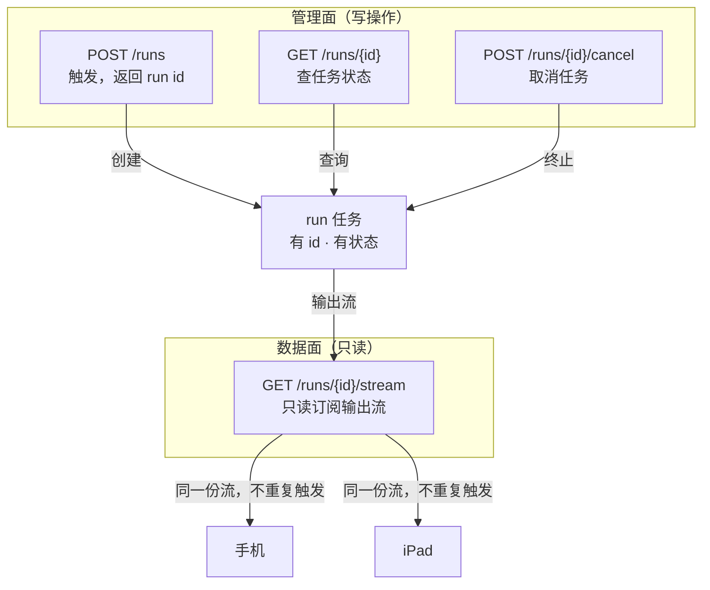

拆开之后：

- **第二台设备只发 GET stream**——纯只读，不会重复触发生成。
- **任务有 id、有状态**——前端能轮询"完成没有"，运维能查"有几个在跑"。
- **触发和订阅一损俱损的耦合被解除**——订阅流出错不会连累正在跑的生成器。
- **天然支持幂等**——同一客户端重试用幂等键不重复触发；多端同时点"生成"靠**会话级独占**保证只跑一个（不是靠 key，各端无法共享 key）。

**管数分离 ≠ 微服务拆分**。本章前期**只在单进程内把接口拆开**（逻辑解耦），物理拆成独立服务是第 11 章的事。**先逻辑后物理，顺序不能反。**

### 为什么"企业级"总是绕不开它

你去看真实 AI 平台的 API（OpenAI Assistants、Anthropic、各家大模型厂商），**清一色都是管数分离**：

- 创建任务返回一个 `run_id`（或 `message_id`）。
- 用另一个接口轮询状态或订阅流。
- 多端可以订阅同一个 `run_id` 的流，不会重复触发。

为什么？因为"一个接口既触发又订阅"在**多端、多实例、可运维**的生产环境根本站不住。管数分离是企业级实时系统的**标准形态**，不是可选优化。

### 这份文档怎么用

**演进纪律（铁律）**：

- 每一章**只引入本章真正用到的新概念、新依赖、新代码**——后面才用到的，一律不提前搬。
- 每一章结尾有 **checkpoint**：目录结构 + git 提交命令 + curl 验证。
- 每一章**都能独立跑起来**——加一点东西、跑一次、看到效果、再往下。
- **代码完整带 import**：每个 Java 文件都是完整可复制、照抄能编译的。
- 改已有文件用注释 `// ▼ 第X章新增` / `// ✦ 第X章替换` 标出改动锚点。
- 第一版先写简单版时，一定标注"这一版简陋，第 X 章会改"，并写清**它为什么不够、驱动下一章**。

**建议节奏**：一章一次会话，敲完跑通再进下一章。不要跳章——后面的章节依赖前面的代码状态。

---

## 核心概念速查：管数分离相关的几个名词

读代码前，先把后面反复出现的几个词搞清楚。**别背，理解个大概，后面用到时回来对一眼即可。**

| 名词 | 一句话解释 | 在哪章引入 |
|------|-----------|-----------|
| **WebFlux** | Spring 的响应式 Web 栈，返回 `Mono`（0/1 个结果）或 `Flux`（一串结果）。天生支持流式。 | 第 0 章 |
| **Flux / Mono** | Reactor 的两种发布者。`Flux<T>` 是"会发出 0~N 个 T 的异步序列"，`Mono<T>` 是"最多 1 个"。 | 第 0 章 |
| **SSE（Server-Sent Events）** | 服务器→客户端的单向流式协议，基于 HTTP。浏览器用 `EventSource` 接收。适合"服务器吐、客户端只读"。 | 第 1 章 |
| **Sinks.Many** | Reactor 提供的一个"手动塞数据、多订阅者各取所需"的广播器。可以把它想成一个"话筒"，谁订阅了谁能听到。 | 第 3 章 |
| **管理面 / 数据面** | 管数分离的两面：管理面会改状态（触发/取消），数据面只读（订阅流）。 | 第 2 章 |
| **run 资源** | 把一次生成建模成一个有 id、有状态机（queued/RUNNING/DONE/FAILED/CANCELLED）的异步任务。 | 第 6 章 |
| **幂等键（Idempotency-Key）** | 同一个 key 只创建一次任务，防**同一客户端**重试重复触发（多端靠 sessionId + 会话锁）。 | 第 6 章 |
| **PostgreSQL** | 关系型数据库。本文用它持久化 run 状态、幂等映射、会话记录——结构化、可 SQL 查询、有 ACID 事务。 | 第 7 章 |
| **MyBatis-Flex** | 轻量 ORM。比手写 JDBC 省事、比 MyBatis-Plus 更适配 Spring Boot 4/Java 21。本文访问 PG 的数据层。 | 第 7 章 |
| **Redis Stream** | Redis 的持久追加日志结构，可从任意位置回放。本文 chunk 总线的载体（后被 Kafka 接管）。 | 第 4 章 |
| **seq 游标** | 给每个 chunk 一个单调递增编号，客户端记录最后收到的 seq，断线重连时从该 seq 之后补推。 | 第 5 章 |
| **Pub/Sub** | Redis 的实时消息广播，发布者发一条，所有订阅者立刻收到。不持久。 | 第 9 章 |
| **单一写者（single-writer）** | 多实例集群里，保证全集群只有一个实例真正去跑生成器。否则会重复触发、结果分叉。 | 第 9 章 |
| **Kafka 消费组** | Kafka 的标准消费模式，每个组各自维护消费进度（offset），互不干扰。 | 第 10 章 |
| **会话历史（gen_session / gen_message）** | 对话内容的结构化落库：每轮一行（user/assistant），可按会话回看、长期保留。 | 第 8 章 |
| **多轮上下文注入** | 触发时读该会话最近 N 轮注入 ChatClient，让 LLM 记得前文；上下文跟着 sessionId 走，切换会话即切换上下文。 | 第 8 章 |

> **不用现在全懂**。每个名词在它对应的章节会重新、详细地讲一遍。这张表是供你读到一半忘了回来对一眼用的。

---

## 第 0 章：跑起来——建项目，接入 Spring AI 2.0

### 0.0 场景

我们要做一个"长文本生成"服务：用户给一个提示词，后端用 **Spring AI 2.0 的 `ChatClient` 调 LLM** 逐字生成一段文本，前端实时看到。这是真实场景——LLM 调用要等几秒、逐字吐（流式），正是"管数分离"要解决的核心场景。

本章目标：建好项目骨架，让 **Spring AI 2.0 + 真 LLM 流式**能跑通。**管数分离本身从第 2 章才开始**，本章先把"数据源"立起来。

### 0.1 思路

| 决策 | 选择 | 理由 |
|------|------|------|
| Web 栈 | WebFlux | 流式返回要用 `Flux`，WebFlux 原生支持 |
| LLM 接入 | **Spring AI 2.0 `ChatClient`** + DeepSeek（OpenAI 兼容协议） | 真 Spring AI；DeepSeek 国内直连、价格低；学完即能用 |
| LLM 调用方式 | `chatClient.prompt().user(...).stream().content()` | 返回 `Flux<String>`，天然流式，与管数分离的"逐字 chunk"完美契合 |
| 数据库 | 不要 | 第 0 章什么都先不存 |

> **为什么是 WebFlux 而不是传统 Spring MVC？** 传统 MVC 的 Controller 方法返回一个对象，方法返回时整个响应就结束了——它没法"逐字往外吐"。WebFlux 的 Controller 可以返回 `Flux<String>`，框架会保持连接打开，每来一个元素就往外推一段。这正是流式的基础。**如果你只用过传统 MVC，第 0、1 章是适应 WebFlux 的过渡，别跳。**

> **DeepSeek API Key 怎么拿**：去 `platform.deepseek.com` 注册申请，新人有免费额度。拿到后**不要写进代码**，放环境变量 `DEEPSEEK_API_KEY`。没有 key 也能看懂文档，但要真跑起来需要它。

### 0.2 动手

#### 0.2.1 建项目 + pom

项目结构：

```
research-stream/
└── pom.xml
```

**【新建文件】** `research-stream/pom.xml`：

```xml
<?xml version="1.0" encoding="UTF-8"?>
<project xmlns="http://maven.apache.org/POM/4.0.0"
         xmlns:xsi="http://www.w3.org/2001/XMLSchema-instance"
         xsi:schemaLocation="http://maven.apache.org/POM/4.0.0
         https://maven.apache.org/xsd/maven-4.0.0.xsd">
    <modelVersion>4.0.0</modelVersion>

    <parent>
        <groupId>org.springframework.boot</groupId>
        <artifactId>spring-boot-starter-parent</artifactId>
        <version>4.0.6</version>
        <relativePath/>
    </parent>

    <groupId>com.example</groupId>
    <artifactId>research-stream</artifactId>
    <version>0.0.1-SNAPSHOT</version>
    <name>research-stream</name>

    <properties>
        <java.version>21</java.version>
        <spring-ai.version>2.0.0</spring-ai.version>
    </properties>

    <dependencies>
        <!--
          第 0 章引两个依赖，每个都对应本章真用到的能力：
            webflux        —— Web 栈基础（Controller、SSE 流式都靠它）
            openai starter —— Spring AI 2.0（ChatClient 流式调 LLM；DeepSeek 走 OpenAI 兼容协议）
          演进纪律：后面章节用到才加——
            第 4 章加 data-redis-reactive；第 7 章加 postgresql + mybatis-flex；
            第 8 章无需新依赖（会话历史沿用 PG + MyBatis-Flex）；
            第 6 章加 redisson（会话锁，第 9 章任务锁沿用）；第 10 章加 spring-boot-starter-kafka；第 12 章加 cloud-gateway。
        -->
        <dependency>
            <groupId>org.springframework.boot</groupId>
            <artifactId>spring-boot-starter-webflux</artifactId>
        </dependency>

        <!-- Spring AI 2.0：OpenAI 兼容协议（DeepSeek 走 OpenAI base-url 接入） -->
        <dependency>
            <groupId>org.springframework.ai</groupId>
            <artifactId>spring-ai-starter-model-openai</artifactId>
        </dependency>
    </dependencies>

    <dependencyManagement>
        <dependencies>
            <dependency>
                <groupId>org.springframework.ai</groupId>
                <artifactId>spring-ai-bom</artifactId>
                <version>${spring-ai.version}</version>
                <type>pom</type>
                <scope>import</scope>
            </dependency>
        </dependencies>
    </dependencyManagement>

    <build>
        <plugins>
            <plugin>
                <groupId>org.springframework.boot</groupId>
                <artifactId>spring-boot-maven-plugin</artifactId>
            </plugin>
        </plugins>
    </build>
</project>
```

> **依赖说明**：`spring-ai-bom` 统一管理 Spring AI 各组件版本（2.0.0 GA）。`spring-ai-starter-model-openai` 自动配置 `OpenAiChatModel` 和 `ChatClient.Builder` 两个 Bean——**你不用手动建 `ChatModel` Bean**，Spring AI 的自动装配会根据 `spring.ai.openai.*` 配置自动建好。注入 `ChatClient.Builder` 即可。

#### 0.2.2 配置 LLM（application.yaml）

**【新建文件】** `research-stream/src/main/resources/application.yaml`：

```yaml
spring:
  ai:
    openai:
      api-key: ${DEEPSEEK_API_KEY}                # 从环境变量读，别写进代码
      base-url: https://api.deepseek.com          # DeepSeek 走 OpenAI 兼容协议
      chat:
        model: deepseek-chat
        temperature: 0.7                           # 生成类任务，温度适中
  application:
    name: research-stream
server:
  port: 8080
```

> **关键**：`api-key` 用 `${DEEPSEEK_API_KEY}` 从环境变量读。启动前先设：
> ```bash
> export DEEPSEEK_API_KEY=sk-你的key
> ./mvnw spring-boot:run
> ```
> IDE 里则在运行配置的 Environment Variables 里加。

#### 0.2.3 流式生成器：Spring AI ChatClient

生成器负责产出 `Flux<String>`——一个会逐个发出字符串元素的异步序列。**这是整份文档的数据源，后面所有章节都围绕"怎么把它的输出可靠地送到多个客户端"展开。** 这里用 Spring AI 2.0 的 `ChatClient` 调真 LLM，逐字流式输出。

**【新建文件】** `research-stream/src/main/java/com/example/stream/generator/TextGenerator.java`：

```java
package com.example.stream.generator;

import org.springframework.ai.chat.client.ChatClient;
import org.springframework.stereotype.Component;
import reactor.core.publisher.Flux;

/**
 * 流式生成器（数据源）—— 基于 Spring AI 2.0 的 ChatClient。
 *
 * 给定提示词，调用 LLM 流式生成，返回逐字（token）流。
 * 这是整份文档的数据源，后面所有管数分离代码都消费它的 Flux<String>。
 *
 * API 要点（Spring AI 2.0）：
 *   - ChatClient.Builder 由 spring-ai-starter-model-openai 自动配置，直接注入。
 *   - .prompt().user(prompt).stream().content() 返回 Flux<String>，逐个 token 推出。
 *   - 这正是 LLM 流式输出的标准用法，与管数分离的"逐字 chunk"完美契合。
 */
@Component
public class TextGenerator {

    private final ChatClient chatClient;

    // ▼ Spring AI 自动配置了 ChatClient.Builder Bean，注入后 .build() 得到 ChatClient
    public TextGenerator(ChatClient.Builder builder) {
        this.chatClient = builder.build();
    }

    /** 流式生成：返回逐 token 的 Flux<String>。prompt 是用户的提示词。 */
    public Flux<String> generate(String prompt) {
        return chatClient.prompt()
                .user(prompt)
                .stream()           // ▼ 流式调用（非阻塞，返回 Flux）
                .content();          // ▼ 取内容流，逐个 token 推出
    }
}
```

> **几个 Spring AI 2.0 细节（第一次接触会困惑，讲清楚）**：
> - **`ChatClient.Builder` 自动注入**：`spring-ai-starter-model-openai` 检测到配置后，会自动建一个 `ChatClient.Builder` Bean。你注入它、调 `.build()` 就得到 `ChatClient`。**不用自己 new 任何模型对象。**
> - **`.stream()` 是流式关键**：不加 `.stream()` 是同步阻塞（`call()` 返回完整结果）；加了 `.stream()` 才是流式（返回 `Flux`）。管数分离必须用 `.stream()`——逐字吐、不阻塞。
> - **`.content()` 取文本流**：流式返回的是 `ChatClient.StreamPromptResponse`，`.content()` 从中取出 `Flux<String>`（逐 token 的文本）。
> - **它是异步、不阻塞的**：调用 `generate()` 立刻返回一个"订阅了才开始向 LLM 请求、逐字吐"的 `Flux`，不会卡住线程。这与管数分离需要的"逐字 chunk"行为完全契合——所以后面管数分离代码消费这个 `Flux<String>` 即可。

> **没有 DeepSeek key 怎么办**：可以临时把 `generate` 换回一个"假流"（`Flux.interval(...)` 逐字吐固定文本）先跑通管数分离骨架，有 key 再换回 `ChatClient`。但**本文默认就是真 LLM 版**——这才是"学了能用"。

#### 0.2.4 主启动类

**【新建文件】** `research-stream/src/main/java/com/example/stream/StreamApplication.java`：

```java
package com.example.stream;

import org.springframework.boot.SpringApplication;
import org.springframework.boot.autoconfigure.SpringBootApplication;

@SpringBootApplication
public class StreamApplication {
    public static void main(String[] args) {
        SpringApplication.run(StreamApplication.class, args);
    }
}
```

### 0.3 验证

第 0 章还没有接口，先确认项目能编译、能启动（Spring AI 自动装配成功）。

```bash
export DEEPSEEK_API_KEY=sk-你的key
cd research-stream
./mvnw spring-boot:run
# 看到 "Started StreamApplication" 即成功（说明 Spring AI 已连上 DeepSeek 配置）
# 若报 401/key 错误：检查环境变量是否设对
# Ctrl+C 停掉
```

### 0.4 checkpoint

```bash
git add -A && git commit -m "第0章：建项目骨架+Spring AI 2.0 ChatClient 流式"
```

项目结构到此：

```
research-stream/
├── pom.xml
└── src/main/
    ├── java/com/example/stream/
    │   ├── StreamApplication.java
    │   └── generator/TextGenerator.java
    └── resources/application.yaml
```

### 0.5 复盘

- 搭好了 WebFlux 项目骨架。
- 写好了唯一的数据源 `TextGenerator`，它返回 `Flux<String>`，逐字吐。
- **还没接接口**——下一章把它暴露出去，并暴露出"一个接口干三件事"的反模式。

---

## 第 1 章：别让用户干瞪眼——流式返回 Flux

### 1.0 场景

第 0 章的生成器已经能逐字吐了，但还没有接口。最直觉的做法：写个 Controller，调生成器，把 `Flux<String>` 直接返回。

```java
@GetMapping("/generate")
public Flux<String> generate(@RequestParam String prompt) {
    return generator.generate(prompt);
}
```

这一章我们**先就照这个最直觉的方式写**，验证流式能跑。**别急着管数分离**——先让"流式"这个基础成立，下一章再看它的问题。

### 1.1 思路

| 决策 | 选择 | 理由 |
|------|------|------|
| 返回类型 | `Flux<String>` | 逐字流式，每个元素是一个字 |
| Content-Type | `text/event-stream`（SSE） | 让浏览器用 `EventSource` 接收，天然支持流式 |

> **为什么不直接返回 `text/plain`？** 如果 Controller 返回 `Flux<String>` 且 `produces=text/plain`，WebFlux 会**把所有元素拼成一个完整字符串**再一次性返回——那就失去了流式。必须用 `text/event-stream`（SSE），框架才会保持连接、逐个推送。**这是流式的关键开关。**

### 1.2 动手

#### 1.2.1 GenerateController（最直觉版）

**【新建文件】** `research-stream/src/main/java/com/example/stream/generator/GenerateController.java`：

```java
package com.example.stream.generator;

import org.springframework.http.MediaType;
import org.springframework.web.bind.annotation.GetMapping;
import org.springframework.web.bind.annotation.RequestParam;
import org.springframework.web.bind.annotation.RestController;
import reactor.core.publisher.Flux;

/**
 * 最直觉的流式接口（第 1 章基线，后面会被管数分离替换）。
 *
 *   GET /generate?prompt=xxx   → SSE 逐字流
 *
 * 注意：这个接口"一个 GET 干了三件事"（触发+订阅+隐式状态），
 * 是后面所有痛点的源头。第 2 章开始拆它。
 */
@RestController
public class GenerateController {

    private final TextGenerator generator;

    public GenerateController(TextGenerator generator) {
        this.generator = generator;
    }

    @GetMapping(value = "/generate", produces = MediaType.TEXT_EVENT_STREAM_VALUE)
    public Flux<String> generate(@RequestParam String prompt) {
        return generator.generate(prompt);
    }
}
```

> **`@GetMapping(produces = TEXT_EVENT_STREAM_VALUE)`** 告诉框架：这个接口的响应是 SSE 流。返回的 `Flux<String>` 每个元素会被包装成一个 SSE 的 `data:` 行推给客户端。

### 1.3 验证

```bash
./mvnw spring-boot:run
# 另开终端：
curl -N "http://localhost:8080/generate?prompt=管数分离"
```

`-N` 关闭 curl 的输出缓冲（否则你会看到一次性吐完，而不是逐字）。你会看到类似：

```
data:关

data:于

data:【
...
```

每隔约 100ms 出一行——**流式成立**。

用浏览器更直观（新建 `demo.html` 用浏览器打开）：

```html
<!DOCTYPE html>
<html>
<body>
<pre id="out"></pre>
<script>
  const es = new EventSource("http://localhost:8080/generate?prompt=管数分离");
  es.onmessage = e => document.getElementById("out").textContent += e.data;
</script>
</body>
</html>
```

> **注意 SSE 的换行坑**：`data:关` 后面的**空行**是 SSE 协议规定的事件分隔符。浏览器 `onmessage` 收到的 `e.data` 是去掉协议头的纯数据。如果你吐的字符本身含换行，需要用多行 `data:` 或 JSON 包装——第 4 章会处理。

### 1.4 checkpoint

```bash
git add -A && git commit -m "第1章：流式SSE接口(反模式基线)"
```

### 1.5 复盘 + 暴露问题

流式跑通了。但现在请做三个动作，**亲手感受反模式的痛**：

1. **刷新浏览器页面** → 生成被重新触发一次（又从头吐一遍）。状态完全在请求里，不可复用。
2. **开第二个标签页，访问同一个 URL** → 它会**各自触发一次生成**，两份独立流，互不相干。
3. **想象你把生成器换成真 LLM（一次调用花 0.1 元）** → 上面两个动作意味着**白白多花钱**，而且两份结果可能不一样。

这正是"一个接口干三件事"的后果。**第 2 章开始拆。**

---

## 第 2 章：管数分离起步——POST 触发 + GET 只读流

### 2.0 场景

第 1 章暴露的痛点：一个 `GET /generate` 同时干了三件事。本章做**最小一步的管数分离**——把它**拆成两个接口**：

- `POST /generate?prompt=xxx` → **触发**（跑生成器），返回一个任务标识，**不返回流**。
- `GET /generate/stream?token=xxx` → **纯只读**地订阅那个任务的输出流。

**只解决"解耦"这一件事**。这一版先不引入 Sinks、Redis、幂等、状态机——那些后面逐章加。**先看到最朴素的管数分离长什么样。**

### 2.1 思路

| 决策 | 选择 | 理由 |
|------|------|------|
| 触发接口 | `POST`，返回 `202 Accepted` + 一个 token | POST 语义是"创建/触发"，不该返回流 |
| 订阅接口 | `GET`，只读 SSE | GET 语义是"查询/读取"，不该有副作用 |
| 任务标识 | 一个随机 token（内存 Map 存） | 先用最简单的内存 Map 保存"生成中的流" |
| 流的暂存 | 内存（`ConcurrentHashMap<String, Flux<String>>`） | 这一版不持久化，第 4 章上 Redis |

**管数分离最小版调用时序**：

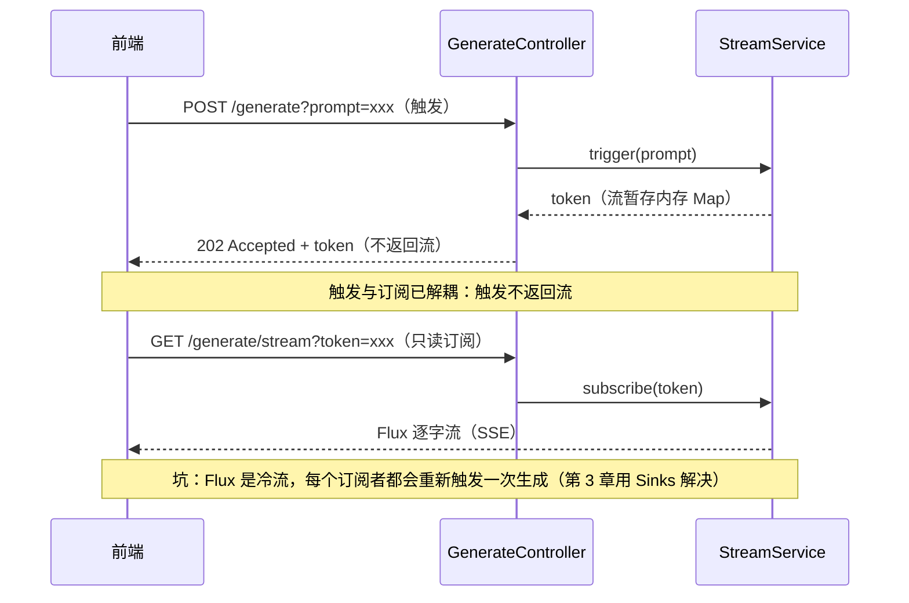

> **为什么 POST 返回 202 而不是 200？** HTTP 语义里，`202 Accepted` 表示"请求已收到、处理中、还没完成"。触发一个异步任务正是这个语义。前端拿到 202 就知道"任务开始了，接下来去订阅或轮询"。**理解 HTTP 状态码语义，是企业级 API 设计的基本功。**

### 2.2 动手

#### 2.2.1 StreamService：触发与订阅拆成两个方法

**【新建文件】** `research-stream/src/main/java/com/example/stream/serve/StreamService.java`：

```java
package com.example.stream.serve;

import com.example.stream.generator.TextGenerator;
import org.springframework.stereotype.Service;
import reactor.core.publisher.Flux;

import java.util.UUID;
import java.util.concurrent.ConcurrentHashMap;

/**
 * 管数分离（最小版）：把"触发"和"订阅"拆成两个方法。
 *
 * - trigger(prompt)  ：跑生成器，把生成的 Flux 存进内存 Map，返回一个 token。
 * - subscribe(token) ：从 Map 取出那个 Flux，返回给调用方（纯只读）。
 *
 * 简陋处（后面逐个补）：
 *   - 流只存在内存 Map 里，服务重启就丢（第 4 章 Redis）。
 *   - 同一个 token 多次 subscribe 会重复订阅同一个 Flux——Flux 默认对每个订阅者重新跑一次！
 *     （第 3 章 Sinks 解决"一份数据扇出给多人"。）
 *   - 没有状态机、没有取消、没有幂等（第 5、6 章）。
 */
@Service
public class StreamService {

    private final TextGenerator generator;
    /** token → 生成中的流。⚠️ 这版只存内存。 */
    private final ConcurrentHashMap<String, Flux<String>> streams = new ConcurrentHashMap<>();

    public StreamService(TextGenerator generator) {
        this.generator = generator;
    }

    /** ▼ 管理面：触发。生成流并暂存，返回 token。 */
    public String trigger(String prompt) {
        String token = "gen_" + UUID.randomUUID().toString().replace("-", "").substring(0, 12);
        Flux<String> flux = generator.generate(prompt);
        streams.put(token, flux);
        return token;
    }

    /** ▼ 数据面：只读订阅。 */
    public Flux<String> subscribe(String token) {
        Flux<String> flux = streams.get(token);
        if (flux == null) {
            return Flux.error(new IllegalStateException("token 不存在或已过期: " + token));
        }
        return flux;
    }
}
```

> **⚠️ 这里埋了一个坑（驱动第 3 章）**：`generator.generate()` 返回的 `Flux` 是"冷流"——**每个新订阅者都会让它重新跑一遍**。底层是 `ChatClient.stream()`，每次订阅都会**重新向 LLM 发一次请求**。所以如果两个标签页都 `subscribe(token)`，会触发**两次 LLM 调用**（烧两次 token、两次结果可能不同）。这违反了"只触发一次"的初衷——**比纯内存场景更严重，因为每次重复都是真金白银**。**第 3 章用 Sinks 把它变成"热流"解决。** 先记住这个坑。

#### 2.2.2 GenerateController 改成管数分离

**【改已有文件，完整版覆盖】** `GenerateController.java`：

```java
package com.example.stream.generator;

import com.example.stream.serve.StreamService;
import org.springframework.http.HttpStatus;
import org.springframework.http.MediaType;
import org.springframework.http.ResponseEntity;
import org.springframework.web.bind.annotation.*;
import reactor.core.publisher.Flux;
import reactor.core.publisher.Mono;

import java.util.Map;

/**
 * 管数分离（最小版）：
 *   POST /generate            → 触发，202 + token（不返回流）
 *   GET  /generate/stream     → 只读 SSE 订阅
 *
 * （原来的 GET /generate 已删——管数分离后不存在"一个接口既触发又订阅"。）
 */
@RestController
@RequestMapping("/generate")
public class GenerateController {

    private final StreamService streamService;

    public GenerateController(StreamService streamService) {
        this.streamService = streamService;
    }

    /** 管理面：触发。返回 202 Accepted + token。 */
    @PostMapping
    public Mono<ResponseEntity<Map<String, String>>> trigger(@RequestParam String prompt) {
        String token = streamService.trigger(prompt);
        return Mono.just(ResponseEntity
                .status(HttpStatus.ACCEPTED)   // ▼ 202：已收到，处理中
                .body(Map.of(
                        "token", token,
                        "status", "started",
                        "streamUrl", "/generate/stream?token=" + token)));
    }

    /** 数据面：纯只读 SSE 订阅。 */
    @GetMapping(value = "/stream", produces = MediaType.TEXT_EVENT_STREAM_VALUE)
    public Flux<String> stream(@RequestParam String token) {
        return streamService.subscribe(token);
    }
}
```

### 2.3 验证

```bash
./mvnw spring-boot:run

# 1. 触发（管理面）
curl -i -X POST "http://localhost:8080/generate?prompt=管数分离"
# HTTP/1.1 202
# {"token":"gen_abc123...","status":"started","streamUrl":"/generate/stream?token=gen_abc123..."}

# 2. 订阅（数据面）——用上一步返回的 token
curl -N "http://localhost:8080/generate/stream?token=gen_abc123..."
# 逐字流出
```

**关键观察**：触发和订阅现在是两个独立请求。你可以**只触发不订阅**（任务照样在跑），也可以**多次订阅同一个 token**（虽然第 2 章这版每次订阅都会重跑一次——见下面的坑）。

### 2.4 checkpoint

```bash
git add -A && git commit -m "第2章：管数分离最小版(POST触发+GET只读)"
```

### 2.5 复盘 + 暴露问题

管数分离的最小骨架有了：**POST 触发、GET 只读**。但请亲手验证这两个问题，它们驱动后续演进：

1. **同一个 token 订阅两次 → 生成器跑了两次**（冷流问题）。开两个标签页都访问 `stream?token=同一个`，会发现两边的内容是**各自独立从头生成**的，而且生成器内部被触发两次。**第 3 章解决：一份数据扇出给多个订阅者。**
2. **服务重启 → 所有 token 失效**，正在跑的内容全丢。**第 4 章解决：落 Redis 持久化。**
3. **`202 + {status:"started"}` 太弱**——前端拿到 token 后，不知道任务什么时候完成、有没有失败、能不能取消。**第 6 章解决：run 资源 + 状态机。**

---

## 第 3 章：第二个标签页也要看——Sinks.Many 内存广播

### 3.0 场景

第 2 章留下的核心痛点：**同一个 token 被多个标签页订阅时，生成器被重复触发**。原因是 `Flux` 是"冷流"——每个订阅者都让它重新跑一遍。

真实需求是：**一次触发，一份数据，但能让多个标签页同时看**。就像广播电台——只有一个播音员（生成器），但无数台收音机（订阅者）都能听到同一份节目。

### 3.1 思路：冷流 → 热流（Sinks.Many）

Reactor 提供的 **`Sinks.Many`** 正是"广播话筒"：

- 你手动往 Sink 里 `tryEmitNext(x)` 塞数据。
- 多个订阅者订阅 `sink.asFlux()`，**共享同一份数据**，不会各自重跑。
- 这就是"热流"——数据是独立于订阅者产生的，订阅者来晚了几条就错过了（晚加入的问题第 5 章解决）。

| 方案 | 特性 |
|------|------|
| 直接用 `Flux`（冷流） | 每个订阅者重新跑生成器 → 重复触发 ❌ |
| `Sinks.Many.multicast()` | 一份数据扇出给多个订阅者，生成器只跑一次 ✅ |

**冷流 → 热流**：

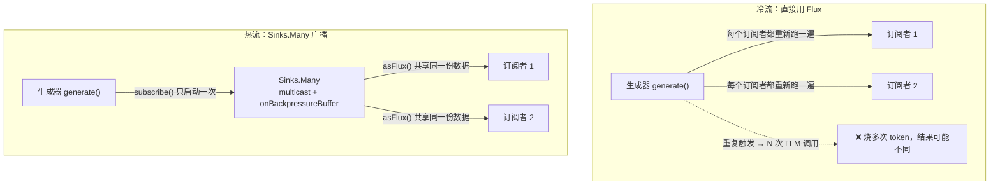

> **为什么是 `multicast().onBackpressureBuffer()`？** `multicast` 表示"支持多个订阅者"。`onBackpressureBuffer` 表示"如果某个订阅者消费太慢来不及处理，先把数据缓存起来"——避免慢订阅者拖垮或丢数据。这是 Reactor 官方推荐的多订阅广播写法。
>
> 📌 **想深入"消费太慢怎么办"**：这就是响应式编程里的**背压（Backpressure）**概念——消费者反过来控制生产者速率。本章用最简写法，原理详见附录 [Reactor 背压详解](../../附录/Reactor响应式编程/04-Reactor背压详解.md)。

**本章设计**：StreamService 触发时，创建一个 `Sinks.Many`，让生成器往里面塞字；订阅时返回 `sink.asFlux()`。这样多个标签页订阅同一个 token，共享同一个 Sink，生成器只跑一次。

### 3.2 动手

> **Controller 不用改**：第 3 章只换 `StreamService` 的实现（从内存 Map 换成 Sinks），`GenerateController`（第 2 章的 `POST /generate` + `GET /generate/stream`）原样保留，照抄即可。

#### 3.2.1 StreamService 改用 Sinks

**【改已有文件，完整版覆盖】** `StreamService.java`：

```java
package com.example.stream.serve;

import com.example.stream.generator.TextGenerator;
import org.slf4j.Logger;
import org.slf4j.LoggerFactory;
import org.springframework.stereotype.Service;
import reactor.core.publisher.Flux;
import reactor.core.publisher.Sinks;

import java.util.UUID;
import java.util.concurrent.ConcurrentHashMap;

/**
 * 管数分离 + Sinks 广播（第 3 章）。
 *
 * 关键改进：用 Sinks.Many 把"冷流"变"热流"——
 *   一次触发只跑一次生成器，多个订阅者共享同一份输出。
 *
 * 简陋处（后面补）：
 *   - 仍只存内存，重启即丢（第 4 章 Redis）。
 *   - 晚加入的订阅者会错过它订阅前已经吐的字（第 5 章 seq 回放）。
 *   - 生成器 .subscribe() 是 fire-and-forget，错误只打日志（第 4 章起完善）。
 */
@Service
public class StreamService {

    private static final Logger log = LoggerFactory.getLogger(StreamService.class);

    private final TextGenerator generator;
    /** token → 广播话筒。 */
    private final ConcurrentHashMap<String, Sinks.Many<String>> sinks = new ConcurrentHashMap<>();

    public StreamService(TextGenerator generator) {
        this.generator = generator;
    }

    /** ▼ 管理面：触发。创建 Sink，让生成器往里塞字，返回 token。 */
    public String trigger(String prompt) {
        String token = "gen_" + UUID.randomUUID().toString().replace("-", "").substring(0, 12);

        // ✦ 第3章：multicast 支持多订阅者；onBackpressureBuffer 防慢消费者丢数据。
        Sinks.Many<String> sink = Sinks.many().multicast().onBackpressureBuffer();
        sinks.put(token, sink);

        // 让生成器把每个字塞进 sink。subscribe() = fire-and-forget，跑在后台。
        generator.generate(prompt)
                .doOnNext(chunk -> sink.tryEmitNext(chunk))      // ▼ 每个字塞进话筒
                .doOnComplete(() -> {
                    sink.tryEmitComplete();                        // ▼ 生成结束，通知所有订阅者"结束"
                    sinks.remove(token);                          // 清理
                    log.info("[trigger] 生成完成 token={}", token);
                })
                .doOnError(err -> {
                    sink.tryEmitError(err);
                    sinks.remove(token);
                    log.error("[trigger] 生成失败 token={}: {}", token, err.getMessage());
                })
                .subscribe();                                   // ▼ 真正启动（异步，不阻塞）

        return token;
    }

    /** ▼ 数据面：只读订阅。返回 sink 的 Flux——多个订阅者共享同一份。 */
    public Flux<String> subscribe(String token) {
        Sinks.Many<String> sink = sinks.get(token);
        if (sink == null) {
            return Flux.error(new IllegalStateException("token 不存在或已结束: " + token));
        }
        return sink.asFlux();
    }
}
```

> **几个关键点讲清楚**：
> - `sink.tryEmitNext(chunk)`：把一个字塞进话筒。`tryEmitNext` 返回一个结果枚举（成功/失败/终止），简单场景可以忽略返回值。
> - `sink.tryEmitComplete()`：广播"结束了"，所有订阅者的 Flux 会收到 complete 信号，连接正常关闭。
> - **`subscribe()` 是关键**：前面 `.doOnNext/.doOnComplete/.doOnError` 只是**声明**怎么处理，**真正开始跑**是最后的 `.subscribe()`。没有它，生成器根本不会启动。
> - 现在两个标签页订阅同一个 token，**生成器只跑一次**，两边看到完全一样的内容。

### 3.3 验证

```bash
./mvnw spring-boot:run

# 1. 触发
curl -i -X POST "http://localhost:8080/generate?prompt=管数分离"
# 拿到 token，比如 gen_aaa111...

# 2. 第一个终端订阅
curl -N "http://localhost:8080/generate/stream?token=gen_aaa111..." &

# 3. 立刻（几秒内）第二个终端也订阅同一个 token
curl -N "http://localhost:8080/generate/stream?token=gen_aaa111..."
```

**关键观察**：两个终端**都在收字，且生成器只跑了一次**（看后台日志，"生成完成"只打印一次）。这就是 Sinks 广播的效果。

> **但注意晚加入的现象**：如果第二个终端是**生成快结束时**才订阅，它会**错过前面已经吐的字**——只能看到从它订阅那一刻起的剩余内容。这是"热流"的天然特性（电台不会给晚到的听众重播前面的节目）。**第 5 章用 seq 回放解决"晚加入也能看全"。**

### 3.4 checkpoint

```bash
git add -A && git commit -m "第3章：Sinks广播,一份数据多订阅者"
```

### 3.5 复盘 + 暴露问题

冷流问题解决了，一次触发只跑一次生成器。但还有这些痛点：

1. **晚加入的订阅者错过前半段**——热流不缓存历史。**第 5 章用 seq + 回放解决。**
2. **服务重启，全部丢失**——Sink 在内存里。**第 4 章落 Redis。**
3. **断网重连，丢失中间内容**——浏览器 SSE 重连不会自动补推历史。**第 4 章 SSE 协议级 `Last-Event-ID` + 第 5 章 seq。**
4. **没有任务状态、不能取消**——`202+{status:"started"}` 太弱。**第 6 章 run 资源。**

下两章先把"持久化"和"回放"补上——它们是管数分离走向生产的基础。

---

## 第 4 章：服务一重启内容全没了——引入 Redis 持久化 + 断线续传

### 4.0 场景

第 3 章后，多标签页能共享一份输出了。但两个生产级问题：

1. **服务重启 → 所有正在跑的任务、所有 Sink 全部消失**。Sink 在 JVM 内存里，进程一死就没了。
2. **断网重连丢失中间内容**：浏览器 SSE 连接断了会自动重连，但重连后只能看到"重连那一刻起"的新内容，**重连前已经吐的字全丢**。

这两个问题指向同一个解：**把输出持久化到一个进程外的地方**。本文选 **Redis**——它是后面所有章节（锁、跨实例广播、Kafka 共存）的基石，而且足够简单。

> **为什么用 Redis Stream 而不是 Redis List？** Redis Stream 是 Redis 5.0 引入的、**专门为消息流设计**的结构：它是持久追加日志，每条消息有自动 id，可以从任意位置（按 id）回放。Redis List 虽然也能存，但回放只能从头或从尾 pop，没法"从第 N 条开始读"。**Stream 的"任意位置回放"正好是断线续传的核心需求。**

### 4.1 思路

引入一个 **`StreamBus`**（流总线）组件，接管"写 chunk"和"读 chunk"：

- **写**：生成器每吐一个字 → `XADD` 写进 Redis Stream（持久）+ `PUBLISH` 到频道（实时通知）。
- **读（订阅）**：先 `XRANGE` 回放历史，再监听频道接实时——**晚加入/重连都能看全**。
- **断线续传**：SSE 协议级 `id` 字段 + 浏览器自动带 `Last-Event-ID` 头。

> **为什么"持久(Stream) + 实时(Pub/Sub)双管齐下"？**
> - Stream 负责"持久回放"——晚加入、断线重连能读到历史。但 Stream 的"被动读取"不实时（你得不停轮询）。
> - Pub/Sub 负责"实时推送"——有新 chunk 立刻通知所有订阅者。但它不持久（订阅前的消息收不到）。
> - 两者结合：**先回放 Stream 历史（补齐前文），再接 Pub/Sub 实时（接上直播）**。这是企业级流式同步的标准套路。

| 决策 | 选择 | 理由 |
|------|------|------|
| 持久层 | Redis Stream | 任意位置回放，断线续传的基础 |
| 实时通知 | Redis Pub/Sub | 新 chunk 立刻通知订阅者 |
| SSE 续传 | 协议级 `id` + `Last-Event-ID` 头 | 浏览器原生支持，重连自动带上 |

**StreamBus 读写路径（持久 + 实时双管齐下）**：

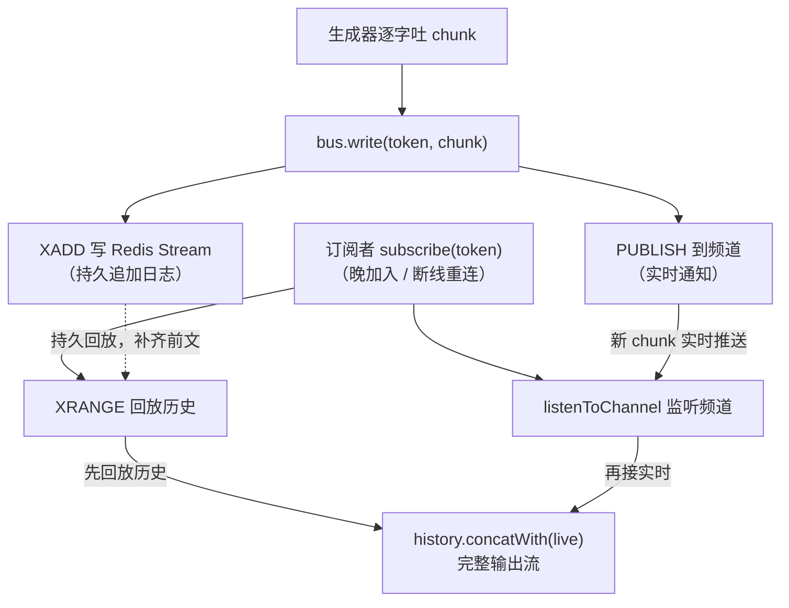

### 4.2 动手

#### 4.2.1 加 Redis 依赖 + 配置

**【改已有文件，追加】** `pom.xml` 的 `<dependencies>` 里加：

```xml
<!-- ▼ 第4章新增：响应式 Redis（流式场景必须用 reactive 版，否则会阻塞事件循环） -->
<dependency>
    <groupId>org.springframework.boot</groupId>
    <artifactId>spring-boot-starter-data-redis-reactive</artifactId>
</dependency>
```

> **为什么是 `data-redis-reactive` 而不是 `data-redis`？** 我们整个 Web 栈是 WebFlux（响应式、事件循环驱动）。如果用阻塞版 Redis 客户端，每次 Redis 调用会卡住一个线程，在高并发下事件循环会被榨干。**响应式栈必须配响应式客户端**，这是一条铁律。

**【改已有文件，追加】** `application.yaml`：

```yaml
spring:
  data:
    redis:
      host: ${REDIS_HOST:localhost}
      port: ${REDIS_PORT:6379}
```

> **本地起 Redis**（任选其一）：
> ```bash
> # 方式一：brew（macOS）
> brew install redis && brew services start redis
> # 方式二：docker
> docker run -d --name redis -p 6379:6379 redis:7
> ```

#### 4.2.2 ReactiveRedis 配置（String 序列化）

Spring Boot 默认的 Redis 序列化是 JDK 序列化（存进去是乱码二进制）。我们要存可读的字符串，配一个 `ReactiveRedisTemplate<String, String>`。

**【新建文件】** `research-stream/src/main/java/com/example/stream/config/RedisConfig.java`：

```java
package com.example.stream.config;

import org.springframework.context.annotation.Bean;
import org.springframework.context.annotation.Configuration;
import org.springframework.data.redis.connection.ReactiveRedisConnectionFactory;
import org.springframework.data.redis.core.ReactiveRedisTemplate;
import org.springframework.data.redis.serializer.RedisSerializationContext;
import org.springframework.data.redis.serializer.StringRedisSerializer;

@Configuration
public class RedisConfig {

    @Bean
    public ReactiveRedisTemplate<String, String> reactiveRedisTemplate(
            ReactiveRedisConnectionFactory factory) {
        // key 和 value 都用 String 序列化（可读、和 redis-cli 里看到的一致）
        RedisSerializationContext<String, String> context = RedisSerializationContext
                .<String, String>newSerializationContext(new StringRedisSerializer())
                .key(new StringRedisSerializer())
                .value(new StringRedisSerializer())
                .hashKey(new StringRedisSerializer())
                .hashValue(new StringRedisSerializer())
                .build();
        return new ReactiveRedisTemplate<>(factory, context);
    }
}
```

#### 4.2.3 StreamBus：Redis Stream 持久 + Pub/Sub 广播

这是本章核心。它接管写和读，StreamService 不再直接持有 Sink。

**【新建文件】** `research-stream/src/main/java/com/example/stream/bus/StreamBus.java`：

```java
package com.example.stream.bus;

import org.slf4j.Logger;
import org.slf4j.LoggerFactory;
import org.springframework.data.domain.Range;
import org.springframework.data.redis.connection.stream.MapRecord;
import org.springframework.data.redis.connection.stream.StreamRecords;
import org.springframework.data.redis.connection.stream.StringRecord;
import org.springframework.data.redis.core.ReactiveRedisTemplate;
import org.springframework.stereotype.Component;
import reactor.core.publisher.Flux;
import reactor.core.publisher.Mono;

import java.util.Map;
import java.util.concurrent.atomic.AtomicBoolean;

/**
 * 流总线（第 4 章）：Redis Stream 持久 + Pub/Sub 实时广播。
 *
 * 写：每个 chunk → XADD（持久）+ PUBLISH（实时通知）。
 * 读：先回放 Stream 历史，再按需接监听频道实时。
 *
 * 简陋处（第 5 章补）：
 *   - 没有 seq 游标，回放靠"读全量再过滤已发"，重连窗口可能漏/重复 chunk。
 *   - 晚加入者读全量历史，对已结束任务 OK，但长任务会读到中间态。
 * （第 5 章用 seq 单调号 + 游标精确控制"从第 N 条开始读"。）
 */
@Component
public class StreamBus {

    private static final Logger log = LoggerFactory.getLogger(StreamBus.class);

    private static final String KEY_STREAM = "gen:%s:chunks";   // Stream key
    private static final String CHANNEL    = "gen:%s";           // Pub/Sub 频道
    private static final String END_MARK   = "__END__";          // 结束标记（第 5 章会被 seq 取代）

    private final ReactiveRedisTemplate<String, String> redis;

    // ▼ 注意：这里不再注入共享的 ReactiveRedisMessageListenerContainer。
    //   实时订阅改用 redis.listenToChannel(...)——每次调用新建独立容器。
    //   容器隔离之外，还必须关掉 Lettuce 共享连接（RedisConfig 里 shareNativeConnection=false），
    //   否则所有容器仍压在一条物理连接上，刷新一页仍会连坐其他页（见 4.2.4）。
    public StreamBus(ReactiveRedisTemplate<String, String> redis) {
        this.redis = redis;
    }

    /** 写一个 chunk：XADD 持久 + PUBLISH 实时通知。返回 Mono<Void>，可串到生成流里。 */
    public Mono<Void> write(String token, String chunk) {
        String streamKey = KEY_STREAM.formatted(token);
        String channel   = CHANNEL.formatted(token);
        StringRecord record = StreamRecords.string(Map.of("chunk", chunk))
                .withStreamKey(streamKey);
        return redis.opsForStream().add(record)              // ▼ XADD 持久
                .then(redis.convertAndSend(channel, chunk))   // ▼ PUBLISH 实时
                .doOnSuccess(v -> log.debug("[bus] write token={} chunk={}", token, chunk.length()))
                .then();
    }

    /** 写结束标记。 */
    public Mono<Void> writeEnd(String token) {
        return write(token, END_MARK);
    }

    /** 订阅：回放历史 + 按需接实时。读到结束标记就完成。 */
    public Flux<String> subscribe(String token) {
        String streamKey = KEY_STREAM.formatted(token);
        String channel   = CHANNEL.formatted(token);
        AtomicBoolean ended = new AtomicBoolean(false);    // ▼ 标记历史里是否已有 END

        // 1. 回放历史（XRANGE 全量），标记是否见到了结束标记
        Flux<String> history = redis.opsForStream().range(streamKey, Range.unbounded())
                .map(this::chunkOf)
                .doOnNext(s -> { if (END_MARK.equals(s)) ended.set(true); });

        // 2. 接实时——只有历史里没见到结束标记时才连 Pub/Sub
        //    （如果生成已完成、END 在历史里，再连 live 就永远等不到 END → 请求挂起）
        //    ▼ 用 redis.listenToChannel(...) 而非共享 listener 容器：
        //      每次调用新建独立容器，多页面各自订阅互不影响。
        //      ⚠️ 但这还不够——还必须关掉 Lettuce 的共享连接（见 4.2.4）：
        //      默认 shareNativeConnection=true 会把所有容器压在一条物理连接上，
        //      一页刷新仍会连坐其他页面。listenToChannel 管"容器"、关共享连接管"物理连接"，缺一不可。
        Flux<String> live = Flux.defer(() -> ended.get()
                ? Flux.<String>empty()
                : redis.listenToChannel(channel).map(m -> m.getMessage()));

        // 拼接：先吐历史，再吐实时（如需要），遇到结束标记就 takeUntil 终止。
        // 注意：本章还没有 seq，无法按序去重，history.concatWith(live) 在"回放完到订阅live生效"
        // 之间的极小窗口仍可能漏掉新 chunk——这个拼接缝隙在第 5 章引入 seq 后解决。
        return history.concatWith(live)
                .takeUntil(s -> s.equals(END_MARK))     // ▼ 遇到 END 就停
                .filter(s -> !s.equals(END_MARK));       // ▼ END 本身不输出给前端
    }

    // ▼ Spring Data Redis 3.x：range() 返回 MapRecord<K, Object, Object>，value 需 toString()
    private String chunkOf(MapRecord<String, Object, Object> r) {
        return String.valueOf(r.getValue().get("chunk"));
    }
}
```

> **几个 API 讲清楚**：
> - `redis.opsForStream()` 返回 Stream 操作接口。`.add(record)` = `XADD`，`.range(key, Range.unbounded())` = `XRANGE - +`（读全量）。
> - `StreamRecords.string(Map).withStreamKey(key)` 构造一条 Stream 记录，value 是个 Map（我们只放一个 `chunk` 字段）。
> - `redis.convertAndSend(channel, msg)` = `PUBLISH`，返回订阅者数量（我们忽略）。
> - `redis.listenToChannel(channel)` 返回该频道消息的**永不结束**的 `Flux`，每收到一条频道消息就发出一个 `Message`。用 `.map(m -> m.getMessage())` 取消息体。**它每次调用都新建一个监听容器**，订阅结束时自动销毁——这是"每个 SSE 连接独立订阅"的第一半。
> - **为什么不用共享的 `ReactiveRedisMessageListenerContainer`？** 共享容器把所有页面的订阅绑在**同一条** Pub/Sub 连接上，任何页面刷新（取消订阅→重新订阅）都可能破坏这条连接，其他页面一起"停流"。`listenToChannel` 解决的是"容器"层面的隔离——但**默认 `shareNativeConnection=true` 会把所有容器压在同一条物理连接上**，一页刷新仍会连坐其他页（这是真实踩过的坑，第 5 章详述）。所以**必须搭配 4.2.4 的 `shareNativeConnection=false`**，才真正做到物理连接隔离。
> - **`AtomicBoolean` + `Flux.defer` 防挂起**：`history.concatWith(live)` 在 history 完成后会订阅 live，但如果 history 里已经有结束标记（生成已完成），live 就永远等不到 END_MARK → 请求永久挂起。用 `doOnNext` 标记是否见过 `__END__`，再用 `Flux.defer` 按条件跳过 live 订阅——见到了就返回 `Flux.empty()`，不会挂起。
> - **Pub/Sub 永不停的特性**：`redis.listenToChannel` 返回的 Flux **不会自发结束**（它一直监听频道）。必须靠 `takeUntil`（或 `take`）来终止订阅。如果终止条件（END_MARK）在订阅前已发布，就永远收不到——这正是 `AtomicBoolean` 要防的。
> - **`history.concatWith(live)`**：先吐完 history，再接 live。`concatWith` 保证这个顺序。本章还没有 seq，故保留简单的顺序拼接（极小窗口可能漏 chunk，第 5 章用"先订阅 live + 按 seq 去重"补齐）。

#### 4.2.4 监听容器 Bean——不需要声明，但必须关掉共享连接

**第一件事：不要声明共享的 `ReactiveRedisMessageListenerContainer` Bean。** `listenToChannel` 每次调用会自己 new 一个容器，用完自动销毁。共享容器把所有页面的订阅挤在一条连接上，一个页面刷新就可能把其他页面一起带走——这是本书刻意规避的坑。

**第二件事（真正的关键）：关掉 Lettuce 的共享连接。** 只换 `listenToChannel` 还不够——Lettuce 默认 `shareNativeConnection=true`，所有容器虽然各自 `new` 了一个 `ReactiveRedisMessageListenerContainer`，但 `getReactiveConnection()` 返回的都是**同一条共享物理连接**，而且每个容器各自持有独立的 Pub/Sub 引用计数。于是刷新一页，那一页的引用计数归零 → 在共享物理连接上发 UNSUBSCRIBE → 其他页面的订阅被一起带走。**多页面"一挂全挂"的真凶是共享物理连接，不是共享容器。**

**【改已有文件】** `RedisConfig.java` 加：

```java
// ▼ 第4章关键修复：关闭 Lettuce 共享原生连接。
//   默认 shareNativeConnection=true 把 template 和所有 listenToChannel 容器
//   挤在一条物理连接上，刷新一页的取消订阅会连坐其他页面。
//   关闭后每次 getReactiveConnection() 都是独立物理连接，页面间互不影响。
@Bean
public LettuceConnectionFactory lettuceConnectionFactory(DataRedisProperties props) {
    RedisStandaloneConfiguration cfg = new RedisStandaloneConfiguration();
    cfg.setHostName(props.getHost());
    cfg.setPort(props.getPort());
    if (props.getPassword() != null) {
        cfg.setPassword(props.getPassword());
    }
    LettuceConnectionFactory factory = new LettuceConnectionFactory(cfg);
    factory.setShareNativeConnection(false);   // ← 核心一行
    return factory;
}
```

> 为什么不用 yaml 配？Spring Boot 4.1.0 已经**移除了** `spring.data.redis.lettuce.share-native-connection` 这个属性（`DataRedisProperties.Lettuce` 里只有 `shutdownTimeout/readFrom/pool/cluster`），所以必须在代码里 `setShareNativeConnection(false)`。

> 代价要知道：关闭后连接数 = `redisTemplate` 1 条 + 每个在线 SSE 订阅各 1 条。demo/中低并发无压力；到"同实例上千并发 SSE"量级，应改为"每实例对每 channel 订阅一次 + 实例内 fan-out"（见第 10 章 Kafka 的按 key 分发思路），而不是退回共享连接。

#### 4.2.5 StreamService 改用 StreamBus

**【改已有文件，完整版覆盖】** `StreamService.java`：

```java
package com.example.stream.serve;

import com.example.stream.bus.StreamBus;
import com.example.stream.generator.TextGenerator;
import org.slf4j.Logger;
import org.slf4j.LoggerFactory;
import org.springframework.stereotype.Service;
import reactor.core.publisher.Flux;

import java.util.UUID;

/**
 * 管数分离 + Redis 持久（第 4 章）。
 *
 * 触发：生成器每个字 → bus.write（落 Redis）。
 * 订阅：bus.subscribe（回放历史 + 实时）。
 *
 * 注意：不再用内存 Sink——chunk 全程落 Redis，服务重启不丢（只要 Redis 没清）。
 * 多个订阅者各自调 bus.subscribe，都读到同一份 Redis 数据。
 */
@Service
public class StreamService {

    private static final Logger log = LoggerFactory.getLogger(StreamService.class);

    private final TextGenerator generator;
    private final StreamBus bus;

    public StreamService(TextGenerator generator, StreamBus bus) {
        this.generator = generator;
        this.bus = bus;
    }

    /** ▼ 管理面：触发。生成器逐字写进 Redis。 */
    public String trigger(String prompt) {
        String token = "gen_" + UUID.randomUUID().toString().replace("-", "").substring(0, 12);
        generator.generate(prompt)
                .concatMap(chunk -> bus.write(token, chunk))   // ▼ 每个字落 Redis
                .doOnComplete(() -> {
                    bus.writeEnd(token).subscribe();           // ▼ 写结束标记
                    log.info("[trigger] 生成完成 token={}", token);
                })
                .doOnError(err -> log.error("[trigger] 失败 token={}: {}", token, err.getMessage()))
                .subscribe();
        return token;
    }

    /** ▼ 数据面：只读订阅。回放历史 + 实时。 */
    public Flux<String> subscribe(String token) {
        return bus.subscribe(token);
    }
}
```

> **为什么是 `concatMap` 而不是 `flatMap`？** `flatMap` 默认并发 256，会把多个 chunk 的异步 `bus.write`（XADD）同时丢出去执行——**谁先完成谁先落库，chunk 顺序被打乱**，客户端拼出来就是乱文（这是真实的坑：一段话被切成"大还在槐树…"这种乱序片段）。`concatMap` 严格串行：写完一个 chunk 再写下一个，顺序和模型输出完全一致。**凡是"把有序流逐条异步写出去"的地方，都用 `concatMap`（或 `flatMapSequential`）保序。**

#### 4.2.6 Controller 加 SSE 协议级 id（断线续传）

**【改已有文件，完整版覆盖】** `GenerateController.java`：

```java
package com.example.stream.generator;

import com.example.stream.serve.StreamService;
import org.springframework.http.HttpStatus;
import org.springframework.http.MediaType;
import org.springframework.http.ResponseEntity;
import org.springframework.http.codec.ServerSentEvent;
import org.springframework.web.bind.annotation.*;
import reactor.core.publisher.Flux;
import reactor.core.publisher.Mono;

import java.util.Map;

/**
 * 管数分离 + SSE 协议级 id（第 4 章）。
 *   POST /generate            → 202 + token
 *   GET  /generate/stream     → SSE，每个事件带 id（浏览器记录，重连自动带 Last-Event-ID）
 */
@RestController
@RequestMapping("/generate")
public class GenerateController {

    private final StreamService streamService;

    public GenerateController(StreamService streamService) {
        this.streamService = streamService;
    }

    @PostMapping
    public Mono<ResponseEntity<Map<String, String>>> trigger(@RequestParam String prompt) {
        String token = streamService.trigger(prompt);
        return Mono.just(ResponseEntity.status(HttpStatus.ACCEPTED)
                .body(Map.of("token", token, "streamUrl", "/generate/stream?token=" + token)));
    }

    @GetMapping(value = "/stream", produces = MediaType.TEXT_EVENT_STREAM_VALUE)
    public Flux<ServerSentEvent<String>> stream(@RequestParam String token) {
        long seq = 0;   // 第 4 章先从 0 读（第 5 章用 Last-Event-ID 精确续传）
        return streamService.subscribe(token)
                .map(chunk -> ServerSentEvent.<String>builder()
                        .data(chunk)
                        .build());
    }
}
```

> **关于 `ServerSentEvent`**：相比直接返回 `Flux<String>`，返回 `Flux<ServerSentEvent<String>>` 能控制 SSE 的每个字段（`id`、`event`、`data`、`retry`、`comment`）。第 4 章先用最基本的 `data`，第 5 章加 `id`。

### 4.3 验证

```bash
./mvnw spring-boot:run

# 1. 触发
curl -i -X POST "http://localhost:8080/generate?prompt=管数分离"
# 拿到 token

# 2. 订阅
curl -N "http://localhost:8080/generate/stream?token=<token>"
# 逐字流出，结束后自动关闭

# 3. 关键验证：等结束后，再次订阅同一个 token——能看到完整内容（来自 Redis 历史回放）！
curl -N "http://localhost:8080/generate/stream?token=<token>"
# 即使生成早就结束了，历史还在 Redis 里，照样能读到全文

# 4. 用 redis-cli 直接看持久化数据
redis-cli XRANGE gen:<token>:chunks - +
```

**关键观察**：
- **任务结束后仍可订阅**——历史在 Redis 里，不像第 3 章 Sink 一结束就没了。
- **重启服务后**，只要 Redis 数据还在（没过期/没清），老 token 仍能读到内容。

### 4.4 checkpoint

```bash
git add -A && git commit -m "第4章:Redis Stream持久+Pub/Sub实时"
```

项目结构：

```
research-stream/src/main/java/com/example/stream/
├── StreamApplication.java
├── config/RedisConfig.java
├── bus/StreamBus.java
├── serve/StreamService.java
└── generator/{TextGenerator, GenerateController}.java
```

### 4.5 复盘 + 暴露问题

持久化和历史回放有了。但**回放的精确性**有问题（驱动第 5 章）：

1. **重连窗口可能漏 chunk**：当前是"读全量历史 + 接实时"，但"读历史结束"到"开始接实时"之间如果有新 chunk 写入，会漏掉（竞态）。而且重复读全量历史，已看过的字会重复推送。
2. **晚加入者读全量**是对的，但**断线重连**应该从"上次最后看到的字"之后续读，而不是从头——当前做不到。
3. **没有 id 字段**，浏览器重连不会带 `Last-Event-ID`，服务端也不知道从哪续。

**第 5 章用"seq 单调号 + 游标"精确解决**：给每个 chunk 编号，客户端记录最后收到的 seq，重连带上，服务端从该 seq 之后精确补推。

---

## 第 5 章：晚加入的设备漏掉了前半段——seq 游标回放 + 客户端去重

### 5.0 场景

第 4 章的回放是"读全量"，带来两个精确性问题：

1. **断线重连会重复**：用户看到第 30 个字时断网，重连后从头读，前 30 个字**又来一遍**——文字重复。
2. **回放与实时之间的竞态会漏**：XRANGE 读完历史、到开始监听频道之间，如果有新字写入，会被漏掉。

真实需求：**重连时从"上次最后看到的字"之后精确续读，不重复、不漏。**

### 5.1 思路：给每个 chunk 编号（seq）

业界标准做法（SSE 的 `Last-Event-ID`、Kafka 的 offset、ChatGPT 的 `conversation_id+offset`）本质都一样：**单调递增编号 + 从编号之后补推**。

本章设计：

- 写 chunk 时，用一个 Redis INCR 维护一个**单调递增的 seq**，和 chunk 一起存进 Stream。
- 订阅时，传入 `lastSeq`（客户端最后收到的 seq），**只回放 seq > lastSeq 的历史**，再接实时。
- SSE 每个事件带 `id = seq`，浏览器记录最后收到的 id，断线重连**自动**带 `Last-Event-ID` 头——服务端读这个头作为 `lastSeq`。
- 客户端按 seq 去重（at-least-once 交付的必然要求）。

| 概念 | 作用 |
|------|------|
| seq（单调号） | 每条 chunk 的全局递增编号 |
| lastSeq 游标 | 客户端"已收到最大 seq"，重连时带上 |
| SSE `id` 字段 | 让浏览器自动记录 seq，重连自动带 `Last-Event-ID` |

> **为什么用 INCR 维护 seq，而不是用 Stream 自动 id？** Redis Stream 的自动 id 是个 10 位时间戳+序号的大数字（如 `1719...-0`），用它做 SSE 的 `id` 不直观、客户端不好处理。我们用一个独立的 INCR 计数器，从 1 开始的干净整数，和 SSE `Last-Event-ID`（浏览器要求是字符串，但整数最清晰）配合最自然。

**断线续传核心时序（seq + Last-Event-ID）**：

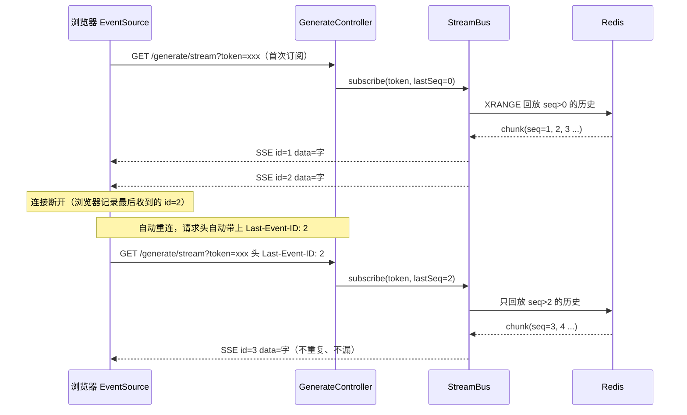

### 5.2 动手

#### 5.2.1 StreamBus：seq 化的写与读

**【改已有文件，完整版覆盖】** `StreamBus.java`：

```java
package com.example.stream.bus;

import org.slf4j.Logger;
import org.slf4j.LoggerFactory;
import org.springframework.data.domain.Range;
import org.springframework.data.redis.connection.stream.MapRecord;
import org.springframework.data.redis.connection.stream.StreamRecords;
import org.springframework.data.redis.connection.stream.StringRecord;
import org.springframework.data.redis.connection.ReactiveSubscription;
import org.springframework.data.redis.core.ReactiveRedisTemplate;
import org.springframework.stereotype.Component;
import reactor.core.publisher.Flux;
import reactor.core.publisher.Mono;
import tools.jackson.databind.ObjectMapper;

import java.util.Map;

/**
 * 流总线（第 5 章）：seq 单调号 + 回放续传，解决"重连重复/漏 chunk"。
 *
 * 写：INCR 得到 seq → XADD（带 seq 和 chunk）→ PUBLISH（ChunkEntity 的 JSON）。
 * 读：history 只回放 seq>lastSeq 的历史；live 直接消费 Pub/Sub 的 JSON，反序列化成 ChunkEntity。
 *
 * 设计取舍（重点）：history 和 live 分工——
 *   - 持久层（Stream）负责"正确性"：所有 chunk 全量落盘，刷新/重连从 lastSeq 回放，一定不丢。
 *   - 实时层（Pub/Sub）负责"实时性"：新 chunk 立刻推给在线订阅者；它只做加速，不做唯一来源。
 *   因此 live 不必再"收到通知就重读 Stream"，避免了每条 chunk 都 XRANGE 全量的 O(N²) 性能问题。
 *
 * 输出格式：`ChunkEntity(seq, chunk)` 值对象（history 从 Stream 字段构造，live 从 Pub/Sub 的 JSON 反序列化，
 * 两条路径输出统一类型；Controller 直接取 `entity.seq()` / `entity.chunk()`，无需解析字符串协议）。
 */
@Component
public class StreamBus {

    private static final Logger log = LoggerFactory.getLogger(StreamBus.class);

    private static final String KEY_STREAM = "gen:%s:chunks";
    private static final String CHANNEL    = "gen:%s";
    private static final String KEY_SEQ    = "gen:%s:seq";        // ▼ seq 计数器
    private static final String END_MARK   = "__END__";           // 结束标记（放进 chunk 字段）

    private final ReactiveRedisTemplate<String, String> redis;
    private final ObjectMapper mapper = new ObjectMapper();      // ▼ Pub/Sub 消息用 JSON 传输

    // ▼ 不再注入共享 ReactiveRedisMessageListenerContainer：
    //   live 订阅用 redis.listenToChannel(...)——每次调用新建独立容器。
    //   还需配合 RedisConfig 里 shareNativeConnection=false（见 4.2.4），
    //   否则所有容器仍压在一条物理连接上，刷新一页仍会连坐其他页。
    public StreamBus(ReactiveRedisTemplate<String, String> redis) {
        this.redis = redis;
    }

    /** 写 chunk：INCR seq → XADD(seq,chunk) → PUBLISH(ChunkEntity 的 JSON)。 */
    public Mono<Void> write(String token, String chunk) {
        String streamKey = KEY_STREAM.formatted(token);
        String channel   = CHANNEL.formatted(token);
        String seqKey    = KEY_SEQ.formatted(token);

        return redis.opsForValue().increment(seqKey)        // ▼ INCR 得到新 seq
                .flatMap(seq -> {
                    StringRecord record = StreamRecords.string(
                            Map.of("seq", String.valueOf(seq), "chunk", chunk))
                            .withStreamKey(streamKey);
                    return redis.opsForStream().add(record)            // ▼ XADD（带 seq）
                            .then(redis.convertAndSend(channel,
                                    mapper.writeValueAsString(new ChunkEntity(seq, chunk))));  // ▼ PUBLISH（JSON）
                })
                .then();
    }

    /** 写结束标记（chunk 字段放 END_MARK，带末尾 seq）。 */
    public Mono<Void> writeEnd(String token) {
        return redis.opsForValue().get(KEY_SEQ.formatted(token))
                .defaultIfEmpty("0")
                .flatMap(maxSeq -> write(token, END_MARK));
    }

    /**
     * 订阅：history 从 lastSeq 之后回放 + live 直接消费 Pub/Sub 实时消息。
     * 输出 ChunkEntity，遇到 chunk == END_MARK 结束。
     *
     * 为什么 live 直接读 Pub/Sub，而不是"收到通知就重读 Stream"：
     *   chunk 写入时 XADD（落 Stream）与 PUBLISH（发通知）几乎连续，避免每条 chunk
     *   都 XRANGE 全量的 O(N²) 性能问题（长文本会明显变慢）。
     *
     * 多页面隔离（与早期版本的区别）：
     *   ① live 用 redis.listenToChannel 独立订阅——每个 SSE 连接独立容器（共享容器
     *     把多页面绑在一条连接上，刷新一个页面会连带其他页面停流）；
     *   ② 还必须关掉 Lettuce 共享连接（RedisConfig 里 shareNativeConnection=false）——
     *     否则所有容器仍压在一条物理连接上，一页刷新仍会连坐其他页（见 4.2.4）。
     */
    public Flux<ChunkEntity> subscribe(String token, long lastSeq) {
        String streamKey = KEY_STREAM.formatted(token);
        String channel   = CHANNEL.formatted(token);

        // 1. 回放历史：只取 seq > lastSeq 的（断线续传：重连不会重复已看过的）
        Flux<ChunkEntity> history = readAfter(streamKey, lastSeq);

        // 2. 接实时：▼ 用 redis.listenToChannel 独立订阅——每次调用新建容器，
        //    直接消费频道里的 JSON，反序列化成 ChunkEntity（PUBLISH 发的就是这个格式）。
        Flux<ChunkEntity> live = redis.listenToChannel(channel)
                .map(ReactiveSubscription.Message::getMessage)
                .map(json -> mapper.readValue(json, ChunkEntity.class));

        // 3. concatWith 先吐历史、再吐实时（简单顺序拼接）。
        //    已知取舍：concatWith 等 history 回放完才订阅 live，回放期间新写入的 chunk
        //    有极小窗口可能两边都漏（拼接缝隙）——但因为数据全量持久在 Stream 里，
        //    客户端一刷新就从 lastSeq 重放补上，正确性由持久层兜底，故接受这个缝隙。
        //    （若要求"实时通道也不漏"，可改 mergeWith + distinct(seq)，留作扩展点。）
        return history.concatWith(live)
                .takeUntil(e -> END_MARK.equals(e.chunk()))   // ▼ 遇到 END 结束
                .filter(e -> !END_MARK.equals(e.chunk()));
    }

    /** 读 streamKey 中 seq > lastSeq 的所有历史记录（只用于回放，不推进任何游标）。 */
    private Flux<ChunkEntity> readAfter(String streamKey, long lastSeq) {
        return redis.opsForStream().range(streamKey, Range.unbounded())
                .filter(r -> seqOf(r) > lastSeq)            // ▼ 只取 lastSeq 之后的
                .map(r -> new ChunkEntity(seqOf(r), String.valueOf(r.getValue().get("chunk"))));
    }

    // ▼ Spring Data Redis 3.x：range() 返回 MapRecord<K, Object, Object>
    private long seqOf(MapRecord<String, Object, Object> r) {
        try { return Long.parseLong(String.valueOf(r.getValue().get("seq"))); }
        catch (Exception e) { return 0; }
    }

    /** chunk 消息的值对象：seq（续传/排序用） + chunk（文本片段）。history 从 Stream 字段构造，
     *  live 从 Pub/Sub 的 JSON 反序列化，两条路径输出统一类型，消费方无需关心传输格式。 */
    public record ChunkEntity(Long seq, String chunk) {
    }
}
```

> **持久层兜底 + 实时层直读的设计（重点理解）**：
> - `history` 把当前 Stream 里所有 `seq > lastSeq` 的读出来，封装成 `ChunkEntity`——断线续传时**不重复**已看过的字。
> - `live` **直接消费** Pub/Sub 频道里的 JSON，反序列化成 `ChunkEntity`——新 chunk 写入时 PUBLISH 出去，在线订阅者立刻收到。
> - **两条路径输出同一类型 `ChunkEntity`**：history 从 Stream 字段构造，live 从 JSON 反序列化。消费方（Controller）只认 `entity.seq()` / `entity.chunk()`，不用关心底层是 Stream 字段还是 JSON 字符串——这是用值对象替代 `"seq::chunk"` 字符串协议的好处（类型安全、不泄漏传输格式、易扩展）。
> - **为什么 live 不再"收到通知就重读 Stream"？** 上一版的写法是 `live.flatMap(notify -> readAfter(...))`，每来一条通知就 `XRANGE` 读全量再过滤——对长文本是 **O(N²)**（第 N 条通知读 N 条，总读取量平方级增长）。改成直读 Pub/Sub 后变成 **O(N)**。
> - **多页面隔离为什么是"两件事"？** ① 用 `redis.listenToChannel`（而非共享容器 Bean）让每个 SSE 连接有自己的监听容器；② 但容器隔离 ≠ 物理连接隔离——Lettuce 默认 `shareNativeConnection=true`，所有容器仍压在**同一条物理连接**上，且各自持有独立的 Pub/Sub 引用计数。刷新一页 → 那一页引用计数归零 → 在共享物理连接上发 UNSUBSCRIBE → **其他页面一起停流**（真实踩过的坑：两页看同一会话，刷新一页，另一页当场断流）。所以必须再在 `RedisConfig` 里 `shareNativeConnection=false`（见 4.2.4），让每个容器有独立物理连接，刷新才只影响自己。
> - **`concatWith` 顺序拼接 + 已知取舍**：`concatWith` 先吐 history 再吐 live。它的缝隙在于——等 history 回放完才订阅 live，回放期间新写入的 chunk 有极小窗口两边都漏。但因为数据全量持久在 Stream 里，客户端一刷新就从 `lastSeq` 重放补上，**正确性由持久层兜底**，所以接受这个缝隙（若要"实时通道也不漏"，改 `mergeWith + distinct(seq)`，留作扩展点）。
> - **`seq` 的作用没变**：它仍用于① history 按 `lastSeq` 过滤（不重复），② Controller 把 `entity.seq()` 放进 SSE `id`，浏览器记录后重连自动带 `Last-Event-ID`。

#### 5.2.2 StreamService 透传 lastSeq

**【改已有文件，完整版覆盖】** `StreamService.java`（只改 subscribe 签名）：

```java
package com.example.stream.serve;

import com.example.stream.bus.StreamBus;
import com.example.stream.generator.TextGenerator;
import org.slf4j.Logger;
import org.slf4j.LoggerFactory;
import org.springframework.stereotype.Service;
import reactor.core.publisher.Flux;

import java.util.UUID;

@Service
public class StreamService {

    private static final Logger log = LoggerFactory.getLogger(StreamService.class);

    private final TextGenerator generator;
    private final StreamBus bus;

    public StreamService(TextGenerator generator, StreamBus bus) {
        this.generator = generator;
        this.bus = bus;
    }

    public String trigger(String prompt) {
        String token = "gen_" + UUID.randomUUID().toString().replace("-", "").substring(0, 12);
        generator.generate(prompt)
                .concatMap(chunk -> bus.write(token, chunk))   // ▼ 保序：flatMap 并发会把 chunk 写乱
                .doOnComplete(() -> { bus.writeEnd(token).subscribe(); log.info("[trigger] 完成 token={}", token); })
                .doOnError(err -> log.error("[trigger] 失败 token={}: {}", token, err.getMessage()))
                .subscribe();
        return token;
    }

    /** ▼ 数据面：带 lastSeq 的只读订阅（断线续传用），返回 ChunkEntity 流。 */
    public Flux<StreamBus.ChunkEntity> subscribe(String token, long lastSeq) {
        return bus.subscribe(token, lastSeq);
    }
}
```

#### 5.2.3 Controller：SSE id + Last-Event-ID 解析

**【改已有文件，完整版覆盖】** `GenerateController.java`：

```java
package com.example.stream.generator;

import com.example.stream.serve.StreamService;
import org.springframework.http.HttpStatus;
import org.springframework.http.MediaType;
import org.springframework.http.ResponseEntity;
import org.springframework.http.codec.ServerSentEvent;
import org.springframework.web.bind.annotation.*;
import reactor.core.publisher.Flux;
import reactor.core.publisher.Mono;

import java.time.Duration;
import java.util.Map;

/**
 * 管数分离 + SSE 协议级 id/Last-Event-ID（第 5 章）。
 *   POST /generate            → 202 + token
 *   GET  /generate/stream     → SSE，id=seq，浏览器重连自动带 Last-Event-ID
 */
@RestController
@RequestMapping("/generate")
public class GenerateController {

    private final StreamService streamService;

    public GenerateController(StreamService streamService) {
        this.streamService = streamService;
    }

    @PostMapping
    public Mono<ResponseEntity<Map<String, String>>> trigger(@RequestParam String prompt) {
        String token = streamService.trigger(prompt);
        return Mono.just(ResponseEntity.status(HttpStatus.ACCEPTED)
                .body(Map.of("token", token, "streamUrl", "/generate/stream?token=" + token)));
    }

    @GetMapping(value = "/stream", produces = MediaType.TEXT_EVENT_STREAM_VALUE)
    public Flux<ServerSentEvent<String>> stream(
            @RequestParam String token,
            @RequestHeader(value = "Last-Event-ID", required = false) Long lastEventId) {

        // ▼ 续传：浏览器重连会自动带 Last-Event-ID（=上次最后收到的 seq），从它之后续读
        long fromSeq = lastEventId != null ? lastEventId : 0;

        Flux<ServerSentEvent<String>> data = streamService.subscribe(token, fromSeq)
                .map(e -> ServerSentEvent.<String>builder()
                        .id(String.valueOf(e.seq()))    // ▼ 浏览器记录此 id，重连自动带
                        .event("token")
                        .data(e.chunk())
                        .build())
                // ▼ 正常结束发一个 done 事件，前端据此知道"结束"
                .concatWithValues(ServerSentEvent.<String>builder().event("done").data("").build());

        // ▼ 心跳：每秒发一个注释，防止代理/浏览器因空闲超时断开长连接
        Flux<ServerSentEvent<String>> heartbeat = Flux.interval(Duration.ofSeconds(1))
                .map(i -> ServerSentEvent.<String>builder().comment("ping").build());

        // data 跑完（包括 done）后，心跳也该停：用 takeUntilOther
        return data.mergeWith(heartbeat).takeUntilOther(data.then());
    }
}
```

> **几个 SSE 细节（生产级必须懂）**：
> - **`id` 字段**：SSE 规定，每个事件可以带 `id`。浏览器 `EventSource` 会**自动记录**最后收到的 id。**连接断开重连时，浏览器会自动带上 `Last-Event-ID: <那个id>` 请求头**——这就是断线续传的协议级支持，不用前端写任何代码。
> - **`event` 字段**：给事件分类（`token` / `done`）。前端可以用 `addEventListener('done', ...)` 分别处理。
> - **`comment`（心跳）**：SSE 的注释行（`:` 开头）不会触发前端事件，但能保持连接活跃。**nginx 等代理默认会在连接空闲 60s 后掐断**，心跳是防这个的。
> - **`data.then()`**：`data` 是个 Flux，`.then()` 返回一个"data 完成时才 complete 的 Mono"，用作 `takeUntilOther` 的终止条件——data 流完了，心跳跟着停。

### 5.3 验证（断线续传端到端）

```bash
./mvnw spring-boot:run

# 1. 触发
curl -i -X POST "http://localhost:8080/generate?prompt=管数分离"
# 拿到 token

# 2. 订阅，记录最后看到的 seq（观察 id: 字段）
curl -N -D - "http://localhost:8080/generate/stream?token=<token>"
# 输出里每个事件有 id: 1, id: 2, ...  最后看到比如 id: 15 时手动 Ctrl+C 断开

# 3. 断线重连——带上 Last-Event-ID: 15，应该从第 16 个字续读
curl -N "http://localhost:8080/generate/stream?token=<token>" -H "Last-Event-ID: 15"
# 输出从 seq=16 开始，没有重复前 15 个字 ✅
```

**浏览器端无需任何特殊代码**——`EventSource` 断线会自动重连并带 `Last-Event-ID`。前端 demo：

```html
<pre id="out"></pre>
<script>
  const token = "<从POST拿到的token>";
  const es = new EventSource(`/generate/stream?token=${token}`);
  es.addEventListener("token", e => document.getElementById("out").textContent += e.data);
  es.addEventListener("done",  e => console.log("完成"));
</script>
```

拔网线再插上，浏览器自动重连，内容**不重复不遗漏**地续上。

### 5.4 checkpoint

```bash
git add -A && git commit -m "第5章:seq游标回放+SSE Last-Event-ID续传"
```

### 5.5 复盘 + 暴露问题

回放的精确性问题解决了：**断线续传不重复、不漏**。到这里，"管数分离 + 多设备同步 + 持久回放"的单实例版已经相当完整。还剩这些（驱动后续）：

1. **`202 + token` 仍是弱状态**：前端不知道任务在跑还是已结束、能否取消。**第 6 章：run 资源 + 状态机。**
2. **多端同时 POST 触发**：手机和 iPad 同时点生成，会创建两个 token、跑两次生成器。**第 6 章：会话级独占挡多端并发 + 幂等键防单端重试。**
3. **长文本性能已优化**：上一版 `live` 每收到一条通知就 `XRANGE` 读全量再过滤，是 O(N²)；本章已改为 `live` 直接消费 Pub/Sub 消息（O(N)）。正确性由 Stream 持久层兜底。`concatWith` 在"回放完到订阅 live 生效"之间有极小拼接缝隙——因为数据全量持久在 Stream 里，刷新即从 `lastSeq` 重放补上，故接受（若要"实时通道也不漏"，可改 `mergeWith + distinct(seq)`，留作扩展点）。
4. **多页面隔离是本章补的另一课**：`listenToChannel` 管住容器还不够，必须在 `RedisConfig` 里 `shareNativeConnection=false` 管住物理连接——否则所有容器仍压在一条共享物理连接上，刷新一页连坐其他页（详见 4.2.4 / 5.2.1 注释）。

下一章把"触发"升级成企业级的 run 资源，补上状态机和幂等。

---

## 第 6 章：多端同时点生成，重复触发——run 资源 + 幂等键 + 会话级独占

### 6.0 场景

第 5 章后，单实例的管数分离已经很完整。但产品提了三个需求，暴露当前设计的弱：

1. **"用户手机点了生成，iPad 也点了一下"** → 创建了两个 token、跑了两次生成器。如果后面换真 LLM，这意味着**烧两次钱**，而且两份结果可能不同。
2. **前端想知道"任务跑完了没"** → 当前只有"流结束"这一个信号，没有可轮询的状态。前端拿不到"queued/RUNNING/DONE/FAILED"这种状态机。
3. **"用户在一个会话里，生成还没完，又点了发送问第二个问题"** → 同一会话里两个生成任务并发跑，结果错乱、资源浪费。ChatGPT 的做法是：**一个会话同一时间只允许一个生成任务，必须等它到终态（完成/失败/取消）才能发起新的**。

真实 AI 平台（OpenAI Assistants、Anthropic）怎么做的？**把"触发"建模成一个有生命周期的 run 资源**——有独立 id、归属会话、有状态机、可查询/取消/订阅，配幂等键防重复提交，配**会话级独占**保证同一会话串行生成。

> **从本章起引入 `sessionId`**：前 5 章只有 `prompt`，没有会话概念。真实产品里，用户的多轮提问属于同一个"会话"（conversation）。本章给接口加上 `sessionId`，并用它实现"会话级独占"——这是企业级聊天产品的标配语义。

### 6.1 思路：run 资源 + 状态机 + 幂等键 + 会话级独占

| 概念 | 设计 |
|------|------|
| **run 资源** | 每次触发创建一个 `run`，有 `runId`、归属 `sessionId`、状态（`queued → RUNNING → DONE/FAILED/CANCELLED`）、创建时间 |
| **状态存储** | 本章先放 Redis（`run:{id}:status`）；**第 7 章迁到 PostgreSQL**（结构化数据该进关系库） | 状态查询要低延迟、可跨实例 |
| **幂等键** | 请求头 `Idempotency-Key` → 同 key 返回同一个 runId | **同一客户端**重试，只有一个 run（多端靠 sessionId + 会话锁） |
| **会话级独占** | Redisson 锁 `session:{id}:running` → 同一会话同时只一个 run | 串行化，防并发错乱 |
| **取消** | `POST /runs/{id}/cancel` | 主动停止（终态，释放会话锁） |

**run 生命周期状态机**：

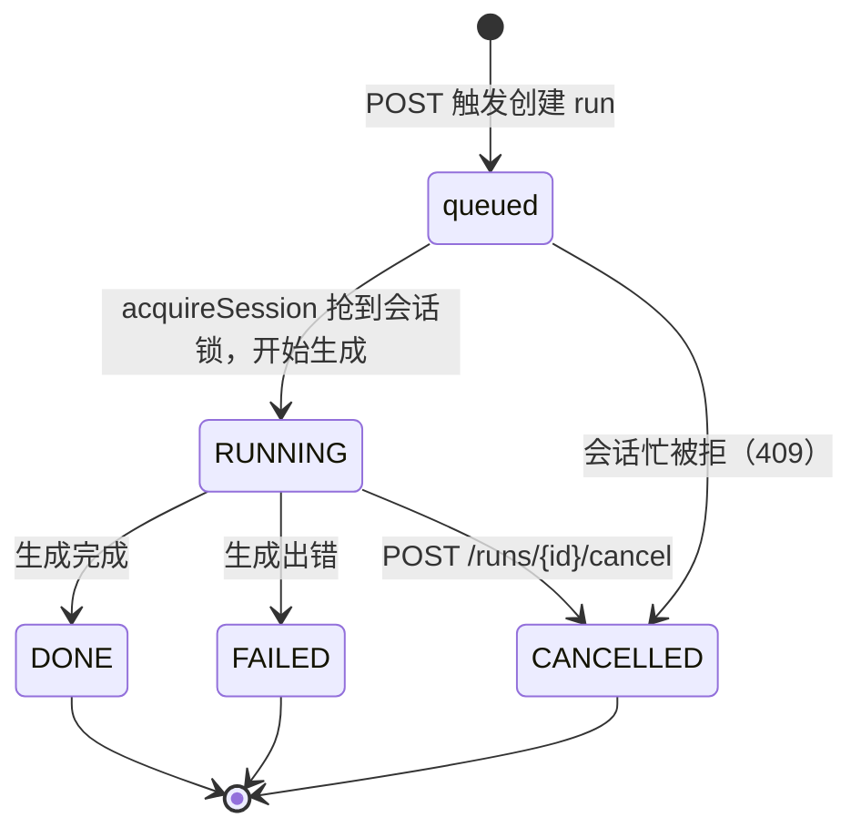

REST 形态升级：

```
POST /api/runs?sessionId=X&prompt=Y  头 Idempotency-Key → 201 + run 资源
GET  /api/runs/{runId}               → 查状态（轮询）
POST /api/runs/{runId}/cancel        → 取消
GET  /api/runs/{runId}/stream        → 只读 SSE（沿用第 5 章）
```

> **为什么是 run 资源，而不是 `202+{status:"started"}`？** 弱版只有"started"，前端没法轮询、没法取消、状态黑盒。run 资源让任务**可观测、可治理**——这是"能上生产"和"玩具 demo"的分水岭。

> **幂等键的原理**：客户端为"这次提交"生成一个随机 key（如设备id+时间戳），放在 `Idempotency-Key` 头里。服务端把 `key → runId` 存进 Redis（带 TTL）。**同一个 key 再次来，直接返回已存的 runId，不重复触发。** 这样"手机和 iPad 同时点"（同一个 key）只会创建一个 run。

> **会话级独占的原理（本章重点）**：给每个 `sessionId` 维护一把 Redisson 分布式锁 `session:{id}:running`（抢到锁=会话被占用，终态释放）。触发时先抢这把锁——**抢到才允许生成，抢不到（说明该会话已有任务在跑）直接返回 409**。生成到终态（DONE/FAILED/CANCELLED）时释放锁，会话才能接受下一个任务。**这是最外层的并发闸门**，比幂等键、任务锁都靠前——它保证"同一会话永远不会有并发生成"。

> **三道防线的层次关系（别混淆）**：
> - **会话级独占**（本章新增，粒度=sessionId）：同一会话同时只一个任务 → **最外层闸门**。
> - **幂等键**（粒度=idempotencyKey）：同一提交只创建一个 run。
> - **任务级单一写者锁**（第 9 章，粒度=runId）：同一任务多实例只跑一个。
>
> 三者**并存**，从外到内依次生效。会话级独占挡掉绝大多数并发问题，后两个是兜底。

**三道并发防线（从外到内）**：

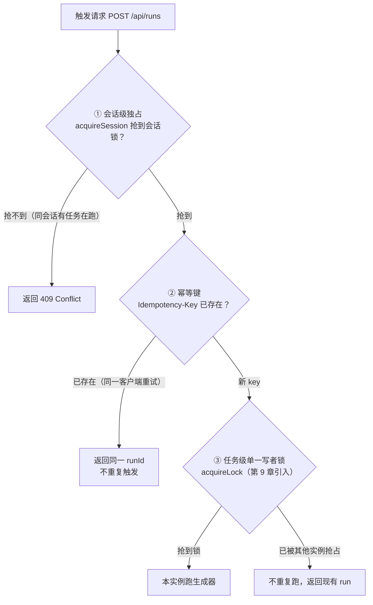

### 6.2 动手

#### 6.2.1 RunStore：run 资源 + 幂等映射

先加 Redisson 依赖——**会话锁是分布式锁，按企业级标准用 Redisson，而不是手写 SETNX**：

**【改已有文件，追加】** `pom.xml`：

```xml
<!-- ▼ 第6章新增：Redisson 分布式锁（会话级独占；看门狗自动续期，业务没跑完锁不过期） -->
<dependency>
    <groupId>org.redisson</groupId>
    <artifactId>redisson-spring-boot-starter</artifactId>
</dependency>
```

> **为什么会话锁用 Redisson 而不是手写 SETNX？** 会话锁要在**整个 run 的生命周期**里锁住会话（可能几分钟）。手写 `SETNX + 固定 TTL` 有两个坑：① run 生成很慢（LLM 卡顿）时 TTL 可能过期，锁被别人抢走，并发闸门失效；② `DELETE` 释放不校验持有者，旧锁过期被抢走后，原持有者可能误删别人的锁。Redisson 的**看门狗**每 10s 把锁续期到 30s（只要实例活着锁不过期），释放走 Lua **先比对 owner 再删**——两个坑都解了（详见第 9 章的对比）。

**【新建文件】** `research-stream/src/main/java/com/example/stream/run/RunStore.java`：

```java
package com.example.stream.run;

import org.redisson.api.RLock;
import org.redisson.api.RedissonClient;
import org.springframework.data.redis.core.ReactiveRedisTemplate;
import org.springframework.stereotype.Component;
import reactor.core.publisher.Mono;
import reactor.core.scheduler.Schedulers;

import java.time.Duration;
import java.time.Instant;
import java.util.UUID;
import java.util.concurrent.ConcurrentHashMap;
import java.util.concurrent.TimeUnit;

/**
 * Run 资源存储（落 Redis）。
 *
 * - create(idemKey, sessionId) ：幂等创建 run。同 idemKey 返回同一 runId；否则新建（带 sessionId）。
 * - get(runId)       ：查 run 资源 JSON。
 * - setStatus(runId) ：改状态（queued/RUNNING/DONE/FAILED/CANCELLED）。
 * - acquireSession(sessionId) ：会话级独占——Redisson 抢 session:{id}:running。
 * - releaseSession(sessionId)        ：释放会话独占（终态时调）。
 *
 * 状态机：queued → RUNNING → DONE / FAILED / CANCELLED
 *
 * ⚠️ 会话锁是分布式锁，用 Redisson RLock（企业级）：看门狗自动续期，业务没跑完锁不过期；
 *    释放走 Lua 校验 owner 才删，不会误删别人的锁（详见第 9 章对比）。
 */
@Component
public class RunStore {

    private static final String KEY_RUN     = "run:%s:status";
    private static final String KEY_CURRENT = "run:%s:current";        // sessionId → 当前 runId（多页面加入用）
    private static final String KEY_IDEM    = "idem:%s";              // idempotencyKey → runId
    private static final String KEY_SESSION = "session:%s:running";   // ▼ 会话级独占锁（Redisson）
    private static final Duration TTL          = Duration.ofDays(1);  // run 状态/幂等映射的保留时长

    private final ReactiveRedisTemplate<String, String> redis;
    private final RedissonClient redisson;   // ▼ 企业级分布式锁客户端
    /** 本实例抢到的会话锁引用。释放时必须用同一个对象，Redisson 才能比对 owner 安全释放。 */
    private final ConcurrentHashMap<String, RLock> sessionLocks = new ConcurrentHashMap<>();

    public RunStore(ReactiveRedisTemplate<String, String> redis, RedissonClient redisson) {
        this.redis = redis;
        this.redisson = redisson;
    }

    /** 幂等创建：同 idemKey 返回同一 runId；否则新建（记录归属 sessionId）。 */
    public Mono<String> create(String idempotencyKey, String sessionId) {
        if (idempotencyKey != null && !idempotencyKey.isBlank()) {
            // 先查 idem 映射；没有才新建，并写回映射
            return redis.opsForValue().get(KEY_IDEM.formatted(idempotencyKey))
                    .switchIfEmpty(Mono.defer(() -> newRun(sessionId)
                            .flatMap(runId -> redis.opsForValue()
                                    .set(KEY_IDEM.formatted(idempotencyKey), runId, TTL)
                                    .thenReturn(runId))));
        }
        return newRun(sessionId);
    }

    /** ▼ 会话级独占：Redisson 抢 session:{id}:running。返回 true=抢到可生成；false=该会话已有任务在跑。
     *  tryLock(0, -1)：0=拿不到立即返回；-1=启用看门狗自动续期（每 10s 续到 30s，业务没跑完锁不过期）。
     *  ⚠️ RLock 是阻塞 API，用 Schedulers.boundedElastic() 隔离，避免卡住 reactor 事件循环。
     *  注意：锁的值是 Redisson 内部 owner 令牌，不存 runId；会话↔run 归属由 StreamService 的 runSession 映射维护。 */
    public Mono<Boolean> acquireSession(String sessionId) {
        return Mono.fromCallable(() -> {
            RLock lock = redisson.getLock(KEY_SESSION.formatted(sessionId));
            boolean acquired = lock.tryLock(0, -1, TimeUnit.MILLISECONDS);
            if (acquired) {
                sessionLocks.put(KEY_SESSION.formatted(sessionId), lock);   // 留着 release 用同一对象安全释放
            }
            return acquired;
        }).subscribeOn(Schedulers.boundedElastic());
    }

    /** ▼ 释放会话独占（run 到终态时调）。用抢锁时存下的 RLock 引用 unlock——Redisson 内部走 Lua 校验 owner 后才删，不会误删别人的锁。 */
    public Mono<Void> releaseSession(String sessionId) {
        return Mono.fromRunnable(() -> {
            RLock lock = sessionLocks.remove(KEY_SESSION.formatted(sessionId));
            if (lock != null && lock.isHeldByCurrentThread()) {
                lock.unlock();
            }
        }).subscribeOn(Schedulers.boundedElastic()).then();
    }

    private Mono<String> newRun(String sessionId) {
        String runId = "run_" + UUID.randomUUID().toString().replace("-", "").substring(0, 12);
        String json = "{\"id\":\"" + runId + "\",\"session\":\"" + sessionId
                + "\",\"status\":\"queued\",\"createdAt\":\"" + Instant.now() + "\"}";
        return redis.opsForValue().set(KEY_RUN.formatted(runId), json, TTL)
                // ▼ 同时记 sessionId → 当前 runId（多页面靠它加入：见下方 getRunId）
                .then(redis.opsForValue().set(KEY_CURRENT.formatted(sessionId), runId, TTL))
                .thenReturn(runId);
    }

    public Mono<Void> setStatus(String runId, String status) {
        return redis.opsForValue().get(KEY_RUN.formatted(runId))
                .flatMap(json -> redis.opsForValue().set(
                        KEY_RUN.formatted(runId),
                        json.replaceAll("\"status\":\"[^\"]*\"", "\"status\":\"" + status + "\""),
                        TTL).then());
    }

    public Mono<String> get(String runId) {
        return redis.opsForValue().get(KEY_RUN.formatted(runId));
    }

    /** ▼ 会话 → 当前 runId：**第二个页面没做过 POST，靠 sessionId 查这个**（借鉴 demo04 的 getRunId 模式）。 */
    public Mono<String> getRunId(String sessionId) {
        return redis.opsForValue().get(KEY_CURRENT.formatted(sessionId));
    }
}
```

> **`switchIfEmpty(Mono.defer(...))` 的细节**：`switchIfEmpty` 接收的 Mono 会**立即求值**（即使上游有值）。用 `Mono.defer(() -> ...)` 包一层，让它**延迟到真正需要时**才执行 `newRun()`——避免每次查询都白创建一个 run。这是 Reactor 的常见坑。

> **`getRunId(sessionId)`：多页面加入的关键（借鉴真实项目 demo04）**。第二个页面没有 runId（它没做过 POST），但它有 sessionId——查 `GET /api/runs/current?sessionId=X`（内部调 `getRunId`）就能拿到当前 runId，再订阅流。这正好补上了"**幂等键解决不了、sessionId 才能解决**"的多页面场景（详见第 12 章）。

> **会话锁靠看门狗自动续期**：用 Redisson 后，只要实例活着、run 没到终态，锁就每 10s 续到 30s——**生成再慢锁也不会过期**（这正是手写 `SETNX + 固定 TTL` 在长生成时会失效的坑）。实例崩溃时看门狗随之死亡，锁 30s 后自动过期，会话不会永久锁死。

#### 6.2.2 StreamService：接 RunStore，触发时维护状态 + 记取消句柄

**【改已有文件，完整版覆盖】** `StreamService.java`：

```java
package com.example.stream.serve;

import com.example.stream.bus.StreamBus;
import com.example.stream.generator.TextGenerator;
import com.example.stream.run.RunStore;
import org.slf4j.Logger;
import org.slf4j.LoggerFactory;
import org.springframework.stereotype.Service;
import reactor.core.Disposable;
import reactor.core.publisher.Flux;
import reactor.core.publisher.Mono;

import java.util.UUID;
import java.util.concurrent.ConcurrentHashMap;

/**
 * 管数分离 + run 资源 + 会话级独占（第 6 章）。
 *
 * 触发顺序（最外层闸门在最前）：
 *   ① acquireSession(sessionId)  会话级独占——同会话同时只一个任务
 *   ② create(idemKey, sessionId) 幂等创建 run
 *   ③ setStatus(RUNNING) → 跑生成器写 Redis → setStatus(DONE/FAILED)
 *   ④ 任何终态（DONE/FAILED/CANCELLED）都要 releaseSession，让会话能接受下一个任务。
 * 记住 Disposable 句柄，cancel 时 dispose 掉生成流。
 */
@Service
public class StreamService {

    private static final Logger log = LoggerFactory.getLogger(StreamService.class);

    private final TextGenerator generator;
    private final StreamBus bus;
    private final RunStore runs;
    /** runId → 生成流的 Disposable（用于主动取消）。 */
    private final ConcurrentHashMap<String, Disposable> handles = new ConcurrentHashMap<>();
    /** runId → sessionId（cancel/终态时需要用它释放会话锁）。 */
    private final ConcurrentHashMap<String, String> runSession = new ConcurrentHashMap<>();

    public StreamService(TextGenerator generator, StreamBus bus, RunStore runs) {
        this.generator = generator;
        this.bus = bus;
        this.runs = runs;
    }

    /** ▼ 管理面：会话级独占 + 幂等创建 run + 触发。返回 runId；会话忙时返回 409 错误。 */
    public Mono<String> trigger(String prompt, String sessionId, String idempotencyKey) {
        return runs.create(idempotencyKey, sessionId)
                .flatMap(runId -> runs.acquireSession(sessionId)   // ▼ ① 最外层闸门
                        .flatMap(acquired -> {
                            if (Boolean.FALSE.equals(acquired)) {
                                // 该会话已有任务在跑：标记 run 为 CANCELLED（作废），返回 409
                                runs.setStatus(runId, "CANCELLED").subscribe();
                                return Mono.<String>error(new IllegalStateException(
                                        "当前会话有任务正在生成，请等待完成后再提问"));
                            }
                            runSession.put(runId, sessionId);
                            return runs.setStatus(runId, "RUNNING")
                                    .then(Mono.fromRunnable(() -> startGeneration(runId, prompt)))
                                    .thenReturn(runId);
                        }));
    }

    /** 跑生成器（fire-and-forget）。三终态都要释放会话锁。 */
    private void startGeneration(String runId, String prompt) {
        Disposable handle = generator.generate(prompt)
                .concatMap(chunk -> bus.write(runId, chunk))    // ▼ 用 runId 当流 key；concatMap 保序
                .doOnComplete(() -> finishRun(runId, "DONE"))
                .doOnError(err -> {
                    log.error("[run] 失败 runId={}: {}", runId, err.getMessage());
                    finishRun(runId, "FAILED");
                })
                .subscribe();
        handles.put(runId, handle);   // ▼ 存句柄，供 cancel 用
    }

    /** ▼ 终态统一处理：写结束标记、改状态、释放会话锁、清理句柄。 */
    private void finishRun(String runId, String status) {
        bus.writeEnd(runId).subscribe();
        runs.setStatus(runId, status).subscribe();
        handles.remove(runId);
        String sessionId = runSession.remove(runId);
        if (sessionId != null) {
            runs.releaseSession(sessionId).subscribe();   // ▼ 释放会话锁，会话回到空闲
        }
        log.info("[run] 终态 runId={} status={}", runId, status);
    }

    /** ▼ 数据面：只读订阅（按 runId）。 */
    public Flux<StreamBus.ChunkEntity> subscribe(String runId, long lastSeq) {
        return bus.subscribe(runId, lastSeq);
    }

    /** ▼ 管理面：查状态。 */
    public Mono<String> status(String runId) {
        return runs.get(runId);
    }

    /** ▼ 管理面：取消 run（CANCELLED 也是终态，要释放会话锁）。 */
    public Mono<Void> cancel(String runId) {
        Disposable handle = handles.remove(runId);
        if (handle != null && !handle.isDisposed()) {
            handle.dispose();   // ▼ 停掉生成流，不再继续写 chunk
        }
        String sessionId = runSession.remove(runId);
        return runs.setStatus(runId, "CANCELLED")
                .then(bus.writeEnd(runId))   // 通知订阅者结束
                .then(sessionId != null ? runs.releaseSession(sessionId) : Mono.empty()); // ▼ 释放会话锁
    }
}
```

> **关键改动**：
> - 接口引入 `sessionId`，触发时**先抢会话级独占**（`acquireSession`）——同一会话同时只一个任务，抢不到返回 409。
> - 流 key 用 `runId`——一个会话**串行地**发起多次 run（前一个到终态，才能发起下一个），互不干扰。
> - **三终态（DONE/FAILED/CANCELLED）统一走 `finishRun`/`cancel`，都释放会话锁**——这是会话能继续接受新任务的关键。漏任何一个，会话会被永久锁死。
> - 存 `Disposable` 句柄 + `runId→sessionId` 映射，cancel 时能 dispose 生成流并找到对应会话释放锁。

> **为什么 409 用 `IllegalStateException`？** Spring WebFlux 默认会把未处理的异常转成 500。生产级应在 Controller 里捕获这个异常并映射成 `409 Conflict`（见 6.2.3 的 Controller）。这里先抛异常，Controller 层做状态码映射。

> **会话级独占的状态机视图**：

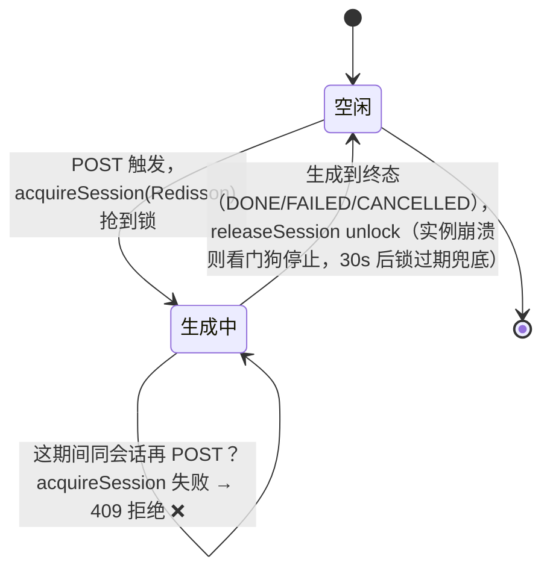

#### 6.2.3 RunController：企业级 REST

**【新建文件，替换原 GenerateController】** `research-stream/src/main/java/com/example/stream/run/RunController.java`：

```java
package com.example.stream.run;

import com.example.stream.serve.StreamService;
import org.springframework.http.HttpStatus;
import org.springframework.http.MediaType;
import org.springframework.http.ResponseEntity;
import org.springframework.http.codec.ServerSentEvent;
import org.springframework.web.bind.annotation.*;
import reactor.core.publisher.Flux;
import reactor.core.publisher.Mono;

import java.net.URI;
import java.time.Duration;

/**
 * 管数分离企业级 REST（run 资源）：
 *
 * 管理面：
 *   POST /api/runs               头 Idempotency-Key → 201 + run 资源
 *   GET  /api/runs/{runId}       → 查状态
 *   POST /api/runs/{runId}/cancel→ 取消
 * 数据面：
 *   GET  /api/runs/{runId}/stream→ 只读 SSE（Last-Event-ID 续传）
 */
@RestController
@RequestMapping("/api/runs")
public class RunController {

    private final StreamService streamService;

    public RunController(StreamService streamService) {
        this.streamService = streamService;
    }

    /** 管理面：会话级独占 + 幂等创建 run + 触发。201 Created + run 资源；会话忙时 409 Conflict。 */
    @PostMapping
    public Mono<ResponseEntity<String>> create(@RequestParam String sessionId,
            @RequestParam String prompt,
            @RequestHeader(value = "Idempotency-Key", required = false) String idemKey) {
        return streamService.trigger(prompt, sessionId, idemKey)
                .map(runId -> ResponseEntity
                        .status(HttpStatus.CREATED)                    // ▼ 201 Created
                        .location(URI.create("/api/runs/" + runId))    // ▼ Location 头指向资源
                        .body("{\"runId\":\"" + runId + "\",\"session\":\"" + sessionId
                                + "\",\"streamUrl\":\"/api/runs/" + runId + "/stream\"}"))
                // ▼ 会话级独占拒绝时，StreamService 抛 IllegalStateException → 映射成 409 Conflict
                .onErrorResume(IllegalStateException.class, e -> Mono.just(ResponseEntity
                        .status(HttpStatus.CONFLICT)   // ▼ 409：当前会话有任务在跑
                        .body("{\"error\":\"" + e.getMessage() + "\"}")));
    }

    /** 管理面：查状态（前端轮询）。 */
    @GetMapping("/{runId}")
    public Mono<ResponseEntity<String>> status(@PathVariable String runId) {
        return streamService.status(runId)
                .map(json -> ResponseEntity.ok().body(json))
                .defaultIfEmpty(ResponseEntity.notFound().build());
    }

    /** 管理面：取消。 */
    @PostMapping("/{runId}/cancel")
    public Mono<Void> cancel(@PathVariable String runId) {
        return streamService.cancel(runId);
    }

    /** 数据面：只读 SSE（沿用第 5 章的 id/Last-Event-ID）。 */
    @GetMapping(value = "/{runId}/stream", produces = MediaType.TEXT_EVENT_STREAM_VALUE)
    public Flux<ServerSentEvent<String>> stream(@PathVariable String runId,
            @RequestHeader(value = "Last-Event-ID", required = false) Long lastEventId) {
        long fromSeq = lastEventId != null ? lastEventId : 0;

        Flux<ServerSentEvent<String>> data = streamService.subscribe(runId, fromSeq)
                .map(e -> ServerSentEvent.<String>builder()
                        .id(String.valueOf(e.seq())).event("token").data(e.chunk()).build())
                .concatWithValues(ServerSentEvent.<String>builder().event("done").data("").build());

        Flux<ServerSentEvent<String>> heartbeat = Flux.interval(Duration.ofSeconds(1))
                .map(i -> ServerSentEvent.<String>builder().comment("ping").build());

        return data.mergeWith(heartbeat).takeUntilOther(data.then());
    }
}
```

> **删掉旧文件**：第 2-5 章用的 `GenerateController.java` 和它的 `/generate` 路径被 `RunController` 的 `/api/runs` 取代，请删除 `GenerateController.java`（保留 `TextGenerator.java`）。

### 6.3 验证

```bash
./mvnw spring-boot:run

# 1. 触发（带 sessionId + 幂等键）——201 + run 资源
curl -i -X POST "http://localhost:8080/api/runs?sessionId=sess-001&prompt=管数分离" -H "Idempotency-Key: deviceA-001"
# HTTP/1.1 201 Created
# Location: /api/runs/run_xxxxx
# {"runId":"run_xxxxx","session":"sess-001","streamUrl":"/api/runs/run_xxxxx/stream"}

# 2. 幂等验证：同一个幂等键再触发一次——返回同一个 runId，不重复触发
curl -X POST "http://localhost:8080/api/runs?sessionId=sess-001&prompt=管数分离" -H "Idempotency-Key: deviceA-001"
# {"runId":"run_xxxxx",...}  ← 同一个！

# 3. ▼ 会话级独占验证（本章重点）：run_xxxxx 还在生成时，同会话再发一个（不同幂等键）——应被拒绝
curl -i -X POST "http://localhost:8080/api/runs?sessionId=sess-001&prompt=第二个问题" -H "Idempotency-Key: deviceA-002"
# HTTP/1.1 409 Conflict
# {"error":"当前会话有任务正在生成，请等待完成后再提问"}  ← 同会话串行，拒绝并发 ✅

# 3b. 但换一个 sessionId 就能正常触发（不同会话互不影响）
curl -i -X POST "http://localhost:8080/api/runs?sessionId=sess-002&prompt=另一会话的问题" -H "Idempotency-Key: deviceB-001"
# HTTP/1.1 201 Created  ← 不同会话，正常 ✅

# 4. 查状态（run 资源里现在带 session 字段）
curl "http://localhost:8080/api/runs/run_xxxxx"
# {"id":"run_xxxxx","session":"sess-001","status":"RUNNING",...}  / 生成结束后变成 DONE

# 5. 订阅
curl -N "http://localhost:8080/api/runs/run_xxxxx/stream"

# 6. 取消（CANCELLED 也是终态，会释放会话锁，之后该会话能发起新任务）
curl -X POST "http://localhost:8080/api/runs/run_xxxxx/cancel"
# 订阅端立刻收到 done，生成器停止；session:sess-001:running 被删除，会话可接受新请求
```

**幂等的正确场景（注意：只针对同一客户端重试）**：同一个页面/设备，网络超时后重试同一个提交，带**同一个** `Idempotency-Key` → 返回同一个 runId，不重复创建。**幂等键是"单客户端重试"的机制，不是多端共享的机制**（每个设备各自生成 key，无法共享）。

**多设备/多页面"同时看同一个生成"靠什么？——靠 `sessionId`，不是靠 key**：手机和 iPad 都用同一个 `sessionId` 提交，服务端的**会话级独占锁**（`session:{id}:running`）保证这个会话同时只跑一个 run——手机先到创建 `run_1`，iPad 再提交要么被 409 拒绝，要么通过"查会话当前 run"（`GET /api/sessions/{id}/status`）拿到 `run_1` 再订阅。**两台设备共享的是 `sessionId`（URL 里就有），不是 key**。

**会话级独占的多端场景**：用户在手机上 sess-001 正在生成，这时 iPad 用 sess-001 问第二个问题 → 后端 `acquireSession` 失败，返回 409，**不会并发跑第二个生成**。必须等前一个到终态（完成/失败/取消），sess-001 才能发起新任务——这就是 ChatGPT 式的"一次只回一条"语义。

### 6.4 checkpoint

```bash
git add -A && git commit -m "第6章:run资源+状态机+幂等键+会话级独占+取消"
```

### 6.5 复盘 + 暴露问题

到这里，**单实例的管数分离已经是企业级标准形态**了：run 资源、状态机、幂等、**会话级独占**、取消、断线续传、持久回放。三道并发防线（会话级独占 → 幂等键 → 任务锁）也到位了两道（任务锁第 9 章补）。但第 6 章有个**一直被刻意回避的隐患**现在藏不住了：

> run 状态、幂等映射**全部存在 Redis 的 KV 里**（`run:{id}:status`、`idem:{key}`），而且都**带 TTL（1 天）**（会话锁虽然升级成了 Redisson，但仍在 Redis）。这意味着——**服务一重启、TTL 一到，所有 run 记录、幂等关系全部蒸发**。你想"查上周某个 run 跑了什么"、"按会话统计生成次数"、"给幂等创建加 ACID 保证防并发"、"做审计对账"——Redis KV 全做不到。

**run 状态是结构化的业务数据（有字段、要查询、要事务、要长期保留），它天生该住关系库，而不是 Redis 的临时 KV**。

**第 7 章：PostgreSQL + MyBatis-Flex 持久化**——把 run 状态、幂等映射、会话记录从 Redis KV 迁到 PG，拿到 SQL 查询、ACID 事务、长期保留、审计能力。Redis 退回到它真正擅长的角色：锁 + 实时 Pub/Sub 通知。

---

## 第 7 章：run 状态存 Redis 重启全清、查不动——PostgreSQL + MyBatis-Flex 持久化

### 7.0 场景

第 6 章后，run 资源、幂等、会话独占都成型了，但全存在 Redis KV 里。真实生产里这立刻撞墙：

> 运营想看"昨天 sess-001 这个用户跑了哪些生成、分别什么状态、什么时候完成的"——查不到。Redis KV 的 `run:{id}:status` 只存单个 run 的 JSON，**没有索引、没法按 session 查、没法按时间范围查、过 1 天 TTL 就没了**。幂等创建也只是"先 GET 再 SET"两步操作，**没有原子性**——并发下两个请求都 GET 到空、都 SET，幂等失效。

这些都是**结构化数据放进 KV 存储**的典型水土不服。该上关系库了。

### 7.1 思路：结构化数据落 PG，Redis 退居本职

**关键判断：不是所有数据都该进 PG**。按数据形态分工，这和企业真实做法一致：

| 数据 | 形态 | 放哪里 | 理由 |
|------|------|--------|------|
| **run 状态/记录** | 结构化、要查询、要长期保留、要事务 | **PostgreSQL** | 关系库主场：SQL 查询、ACID、索引、审计 |
| **幂等映射** | 结构化、要唯一约束、要原子防并发 | **PostgreSQL** | 用 `UNIQUE(idempotency_key)` + 事务，原子防并发，比 Redis 两步操作稳 |
| **会话记录** | 结构化、要按 session 查历史 | **PostgreSQL** | 同上 |
| **会话独占标记** | 临时并发闸门，短命 | **Redis**（保留） | 极低延迟、TTL 自动过期兜底，KV 正合适 |
| **chunk 流** | 高频追加、流式、按游标回放 | **Redis Stream**（第 4 章）→ 后续 Kafka（第 10 章） | 流式追加不该进关系库 |
| **分布式锁** | 临时、低延迟 | **Redis（Redisson）** | 第 6 章用（会话锁）；第 9 章（任务锁） |
| **实时取消/结束通知** | 即时广播、不持久 | **Redis Pub/Sub** | 第 9 章用 |

**数据按形态分工**：

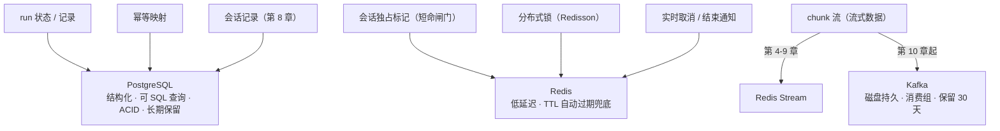

> **为什么 chunk 不进 PG？** chunk 是"每秒几十条、按顺序追加、按游标回放"的流式数据。PG 的关系表做高频追加 + 范围回放，性能和成本都不如 Redis Stream（第 4 章）/ Kafka（第 10 章）。**把流式数据塞进关系库是常见反模式**——流有流的家（Kafka），记录有记录的家（PG）。

#### 为什么选 MyBatis-Flex 而不是 MyBatis-Plus / JPA

| 方案 | 取舍 |
|------|------|
| **MyBatis-Flex**（本章用） | 轻量、链式 `QueryWrapper`、原生 `@Table` 注解、**对 Spring Boot 4 / Java 21 适配最积极**。国内新项目主流选择。 |
| MyBatis-Plus | 老牌、生态广，但近年迭代慢，对高版本 Boot 的兼容偶有滞后。 |
| Spring Data JPA | 标准、面向对象，但复杂查询要写 SQL 或 Specification，流式场景不够灵活。 |

> **响应式栈的一个坑（重要）**：本文是 WebFlux 响应式栈，而 **MyBatis-Flex / JDBC 是阻塞的**。直接在 reactor 线程里调 Mapper 会卡住事件循环。**正确做法：用 `Mono.fromCallable(...).subscribeOn(Schedulers.boundedElastic())` 把阻塞的 DB 调用隔离到弹性线程池**。本章 `RunStore` 的每个方法都这么包。这是响应式 + 阻塞 DB 的标准配合方式，和第 9 章 Redisson 锁的处理一致。

### 7.2 动手

#### 7.2.1 加 PG + MyBatis-Flex 依赖

**【改已有文件，追加】** `pom.xml`：

```xml
<!-- ▼ 第7章新增：PostgreSQL 驱动（run 状态/幂等/会话持久化） -->
<dependency>
    <groupId>org.postgresql</groupId>
    <artifactId>postgresql</artifactId>
</dependency>

<!-- ▼ 第7章新增：MyBatis-Flex（Spring Boot 3/4 starter，自带 HikariCP 连接池自动装配） -->
<dependency>
    <groupId>com.mybatis-flex</groupId>
    <artifactId>mybatis-flex-spring-boot3-starter</artifactId>
    <version>1.10.0</version>
</dependency>
```

> **版本说明**：`mybatis-flex-spring-boot3-starter` 虽然名字带 `boot3`，但兼容 Spring Boot 4.x（MyBatis-Flex 1.10+ 已适配）。`postgresql` 驱动版本由 Spring Boot BOM 管理，不用手写。HikariCP 连接池由 starter 自动装配，无需额外配置。

#### 7.2.2 数据源 + MyBatis-Flex 配置

**【改已有文件，追加】** `application.yaml`：

```yaml
spring:
  datasource:
    url: jdbc:postgresql://${PG_HOST:localhost}:5432/research_stream
    username: ${PG_USER:postgres}
    password: ${PG_PASS:postgres}
    driver-class-name: org.postgresql.Driver
    hikari:
      maximum-pool-size: 10            # ▼ 连接池大小（按 DB 规格调）
      connection-timeout: 30000

# MyBatis-Flex（基本零配置即可用，这里只显式开启日志方便调试）
mybatis-flex:
  global-config:
    print-banner: false
  configuration:
    map-underscore-to-camel-case: true # ▼ run_id → runId 自动驼峰映射
```

#### 7.2.3 建表（run 状态 + 幂等映射）

**【新建文件】** `research-stream/src/main/resources/schema.sql`（Spring Boot 启动时若 `spring.sql.init.mode=always` 会自动执行；生产建议用 Flyway/Liquibase 管迁移）：

```sql
-- ▼ run 资源表：一次生成一行
CREATE TABLE IF NOT EXISTS gen_run (
    id            VARCHAR(32)  PRIMARY KEY,             -- runId
    session_id    VARCHAR(64)  NOT NULL,                -- 归属会话
    status        VARCHAR(16)  NOT NULL DEFAULT 'queued', -- queued/RUNNING/DONE/FAILED/CANCELLED
    prompt        TEXT,                                -- 触发的 prompt（审计用）
    created_at    TIMESTAMPTZ  NOT NULL DEFAULT now(),
    finished_at   TIMESTAMPTZ                          -- 终态时间
);
CREATE INDEX IF NOT EXISTS idx_gen_run_session ON gen_run (session_id, created_at); -- ▼ 按会话查历史

-- ▼ 幂等映射表：idempotencyKey → runId。UNIQUE 约束 + 事务 = 原子防并发（替代第6章 Redis 的两步 GET/SET）
CREATE TABLE IF NOT EXISTS gen_idempotency (
    idempotency_key VARCHAR(128) PRIMARY KEY,           -- 幂等键（客户端提供）
    run_id          VARCHAR(32)  NOT NULL,              -- 对应的 runId
    created_at      TIMESTAMPTZ  NOT NULL DEFAULT now(),
    CONSTRAINT fk_idem_run FOREIGN KEY (run_id) REFERENCES gen_run(id) ON DELETE CASCADE
);
```

> **幂等从"两步操作"升级为"唯一约束"**：第 6 章用 Redis 的"先 GET 再 SET"防并发，理论上两步之间有窗口。PG 用 `PRIMARY KEY(idempotency_key)` 的唯一约束——并发插入同一个 key，数据库直接拒绝第二个（抛唯一约束异常），**由数据库保证原子性**，比应用层两步操作稳得多。这是"结构化数据进关系库"的核心收益之一。

#### 7.2.4 Run 实体 + Mapper（MyBatis-Flex）

**【新建文件】** `research-stream/src/main/java/com/example/stream/run/RunEntity.java`：

```java
package com.example.stream.run;

import com.mybatisflex.annotation.Column;
import com.mybatisflex.annotation.Id;
import com.mybatisflex.annotation.KeyType;
import com.mybatisflex.annotation.Table;
import java.time.OffsetDateTime;

/** ▼ run 资源实体（对应 gen_run 表）。MyBatis-Flex 用 @Table 映射。 */
@Table("gen_run")
public class RunEntity {

    @Id(keyType = KeyType.None)   // ▼ runId 由应用生成（非自增），KeyType.None 表示不由 DB 生成
    private String id;

    @Column("session_id")
    private String sessionId;

    private String status;

    private String prompt;

    @Column("created_at")
    private OffsetDateTime createdAt;

    @Column("finished_at")
    private OffsetDateTime finishedAt;

    // getters / setters 省略（实际项目用 Lombok @Data）
}
```

**【新建文件】** `research-stream/src/main/java/com/example/stream/run/RunMapper.java`：

```java
package com.example.stream.run;

import com.mybatisflex.core.BaseMapper;
import org.apache.ibatis.annotations.Mapper;

/** ▼ MyBatis-Flex Mapper：继承 BaseMapper 自动获得 insert/selectById/update 等 CRUD。 */
@Mapper
public interface RunMapper extends BaseMapper<RunEntity> {
}
```

> **`BaseMapper` 免写 SQL**：继承它就免费拿到 `insert / selectById / update / selectListByQuery` 等方法。复杂查询用 `QueryWrapper` 链式构造（如 `QueryWrapper.create().where(GEN_RUN.SESSION_ID.eq(sid))`），MyBatis-Flex 会自动生成 `gen_run` 表的元数据类 `table.GenRunTableDef`（编译时生成）。本章 CRUD 够用，不展开 QueryWrapper。
>
> **幂等表同理**：`gen_idempotency` 表有对应的 `IdempotencyEntity` + `IdempotencyMapper`（同样 `extends BaseMapper`）+ 编译期元数据 `GEN_IDEMPOTENCY`，下面 `RunStore` 会用到。源码结构与 `RunEntity`/`RunMapper` 完全对称，不重复贴。

#### 7.2.5 RunStore：从 Redis KV 改为 PG（响应式包装）

**【改已有文件，完整版覆盖】** `RunStore.java`（核心：run 状态/幂等走 PG；会话独占锁**保留 Redis + Redisson**——短命并发闸门，锁本身就适合留 Redis）：

```java
package com.example.stream.run;

import com.mybatisflex.core.query.QueryWrapper;
import org.redisson.api.RLock;
import org.redisson.api.RedissonClient;
import org.springframework.dao.DuplicateKeyException;
import org.springframework.data.redis.core.ReactiveRedisTemplate;
import org.springframework.stereotype.Component;
import reactor.core.publisher.Mono;
import reactor.core.scheduler.Schedulers;

import java.time.OffsetDateTime;
import java.util.UUID;
import java.util.concurrent.ConcurrentHashMap;
import java.util.concurrent.TimeUnit;

/**
 * Run 资源存储（第 7 章：结构化数据落 PostgreSQL，会话独占锁保留 Redis + Redisson）。
 *
 * - create(idemKey, sessionId) ：幂等创建 run。同 idemKey 返回同一 runId（PG 唯一约束保证原子）。
 * - get(runId)       ：查 run 资源（从 PG）。
 * - setStatus(runId) ：改状态（更新 PG）。
 * - acquireSession(sessionId) ：会话级独占——Redisson 抢 session:{id}:running。
 * - releaseSession(sessionId)        ：释放会话独占。
 *
 * 状态机：queued → RUNNING → DONE / FAILED / CANCELLED
 *
 * ⚠️ MyBatis-Flex/JDBC 是阻塞的，每个 DB 调用都用 Schedulers.boundedElastic() 隔离，
 *    不能在 reactor 线程里直接调 Mapper（会卡住事件循环）。
 */
@Component
public class RunStore {

    private static final String KEY_SESSION = "session:%s:running";   // ▼ 会话独占锁（Redisson，保留 Redis）

    private final RunMapper runMapper;
    private final IdempotencyMapper idempotencyMapper;
    private final ReactiveRedisTemplate<String, String> redis;
    private final RedissonClient redisson;   // ▼ 企业级分布式锁
    /** 本实例抢到的会话锁引用（release 用同一对象安全释放）。 */
    private final ConcurrentHashMap<String, RLock> sessionLocks = new ConcurrentHashMap<>();

    public RunStore(RunMapper runMapper, IdempotencyMapper idempotencyMapper,
                    ReactiveRedisTemplate<String, String> redis, RedissonClient redisson) {
        this.runMapper = runMapper;
        this.idempotencyMapper = idempotencyMapper;
        this.redis = redis;
        this.redisson = redisson;
    }

    /** 幂等创建：同 idemKey 返回同一 runId；否则新建。
     *  ▼ 用 PG 的唯一约束做原子幂等：并发插入同一 key，第二个抛 DuplicateKeyException，
     *    捕获后回查已存在的 runId——比第6章 Redis 的"先 GET 再 SET"两步操作更稳。 */
    public Mono<String> create(String idempotencyKey, String sessionId) {
        if (idempotencyKey == null || idempotencyKey.isBlank()) {
            return insertRun(idempotencyKey, sessionId);
        }
        // 有幂等键：先查；没有则插入，插入遇唯一约束冲突则回查
        return findByKey(idempotencyKey)
                .switchIfEmpty(Mono.defer(() -> insertRun(idempotencyKey, sessionId)
                        .onErrorResume(DuplicateKeyException.class, e -> findByKey(idempotencyKey))));
    }

    /** 查 run 资源（从 PG，返回 JSON 字符串，保持与第6章 get 签名兼容）。 */
    public Mono<String> get(String runId) {
        return Mono.fromCallable(() -> {
                    RunEntity r = runMapper.selectOneById(runId);
                    return r == null ? null : toJson(r);
                })
                .subscribeOn(Schedulers.boundedElastic());
    }

    /** 改状态（更新 PG）。终态时同时写 finished_at。 */
    public Mono<Void> setStatus(String runId, String status) {
        return Mono.fromRunnable(() -> {
                    RunEntity update = new RunEntity();
                    update.setId(runId);
                    update.setStatus(status);
                    if (isTerminal(status)) {
                        update.setFinishedAt(OffsetDateTime.now());
                    }
                    runMapper.update(update);
                })
                .subscribeOn(Schedulers.boundedElastic()).then();
    }

    /** ▼ 会话级独占：Redisson 抢 session:{id}:running。返回 true=抢到可生成；false=该会话已有任务在跑。
     *  tryLock(0, -1)：0=拿不到立即返回；-1=看门狗自动续期（业务没跑完锁不过期）。
     *  ⚠️ RLock 是阻塞 API，用 boundedElastic 隔离（同第 6 章）。 */
    public Mono<Boolean> acquireSession(String sessionId) {
        return Mono.fromCallable(() -> {
            RLock lock = redisson.getLock(KEY_SESSION.formatted(sessionId));
            boolean acquired = lock.tryLock(0, -1, TimeUnit.MILLISECONDS);
            if (acquired) {
                sessionLocks.put(KEY_SESSION.formatted(sessionId), lock);
            }
            return acquired;
        }).subscribeOn(Schedulers.boundedElastic());
    }

    /** ▼ 释放会话独占（run 到终态时调）。用抢锁时存下的 RLock 引用 unlock——Redisson 走 Lua 校验 owner 后才删。 */
    public Mono<Void> releaseSession(String sessionId) {
        return Mono.fromRunnable(() -> {
            RLock lock = sessionLocks.remove(KEY_SESSION.formatted(sessionId));
            if (lock != null && lock.isHeldByCurrentThread()) {
                lock.unlock();
            }
        }).subscribeOn(Schedulers.boundedElastic()).then();
    }

    // —— 内部：阻塞 DB 操作 —— //

    private Mono<String> insertRun(String idempotencyKey, String sessionId) {
        return Mono.fromCallable(() -> {
                    String runId = "run_" + UUID.randomUUID().toString().replace("-", "").substring(0, 12);
                    RunEntity run = new RunEntity();
                    run.setId(runId);
                    run.setSessionId(sessionId);
                    run.setStatus("queued");
                    run.setCreatedAt(OffsetDateTime.now());
                    runMapper.insert(run);   // ▼ 唯一约束冲突会抛 DuplicateKeyException
                    // 幂等映射：同一个事务概念上应包住 run 插入 + 幂等插入（生产用 @Transactional）
                    if (idempotencyKey != null && !idempotencyKey.isBlank()) {
                        IdempotencyEntity idem = new IdempotencyEntity();
                        idem.setIdempotencyKey(idempotencyKey);
                        idem.setRunId(runId);
                        idempotencyMapper.insert(idem);   // gen_idempotency 表，唯一约束保证原子幂等
                    }
                    return runId;
                })
                .subscribeOn(Schedulers.boundedElastic());
    }

    private Mono<String> findByKey(String idempotencyKey) {
        return Mono.fromCallable(() ->
                    // ▼ 查幂等映射表。GEN_IDEMPOTENCY 是 MyBatis-Flex 编译期生成的表元数据类，
                    //   .eq(...) 是类型安全的链式条件（避免硬编码列名）。
                    idempotencyMapper.selectOneByQuery(
                            QueryWrapper.create().where(GEN_IDEMPOTENCY.IDEMPOTENCY_KEY.eq(idempotencyKey))))
                .subscribeOn(Schedulers.boundedElastic())
                .map(IdempotencyEntity::getRunId);
    }

    private boolean isTerminal(String status) {
        return "DONE".equals(status) || "FAILED".equals(status) || "CANCELLED".equals(status);
    }

    private String toJson(RunEntity r) {
        return "{\"id\":\"" + r.getId() + "\",\"session\":\"" + r.getSessionId()
                + "\",\"status\":\"" + r.getStatus() + "\",\"createdAt\":\"" + r.getCreatedAt() + "\"}";
    }
}
```

> **三个关键改动（对比第 6 章 Redis 版）**：
> 1. **run 状态/幂等从 Redis KV → PG**：`get`/`setStatus`/`create` 全走 `RunMapper`，重启不丢、能 SQL 查、有唯一约束原子幂等。
> 2. **会话独占锁保留 Redis（Redisson）**：`acquireSession`/`releaseSession` 用 Redisson（第 6 章引入）——它是"短命并发闸门"，锁本身就是 Redis 的强项（低延迟 + 看门狗续期），没必要落 PG。
> 3. **每个 DB 调用包 `Schedulers.boundedElastic()`**：MyBatis-Flex 是阻塞的，必须隔离出 reactor 线程，否则卡事件循环。
>
> ⚠️ **教学简化处（诚实标注）**：为聚焦"管数分离主线"，`IdempotencyEntity`/`IdempotencyMapper`/`GEN_IDEMPOTENCY`（MyBatis-Flex 编译期生成的表元数据）只示意用法、未全部展开源码；`insertRun` 里的"run 插入 + 幂等插入"应用 `@Transactional` 包成一个事务（生产级必须，否则半失败会脏）。这些 ORM/事务细节非本文重点，详见 [数据库事务与 @Transactional 详解](../../附录/协议与数据库/02-数据库事务与Transactional详解.md) 附录。

### 7.3 验证

```bash
# 起 PG（本地起一个，第 10 章起 Kafka，PG/Kafka 也可统一进 docker-compose）
docker run -d --name pg -p 5432:5432 \
  -e POSTGRES_PASSWORD=postgres -e POSTGRES_DB=research_stream postgres:16

./mvnw spring-boot:run

# 触发
curl -i -X POST "http://localhost:8080/api/runs?sessionId=sess-001&prompt=管数分离持久化" -H "Idempotency-Key: deviceA-001"
# 假设 runId=run_xxx

# ▼ 关键验证1：直接用 SQL 查 run（以前在 Redis 里查不动！）
docker exec -it pg psql -U postgres -d research_stream \
  -c "SELECT id, session_id, status, created_at FROM gen_run WHERE session_id='sess-001';"
# ✅ 能按 session 查历史、看状态——Redis KV 做不到的事

# ▼ 关键验证2：重启服务，run 还在（以前重启 Redis TTL 内也丢）
docker exec -it pg psql -U postgres -d research_stream -c "SELECT count(*) FROM gen_run;"
./mvnw spring-boot:run   # 重启
# ✅ PG 里的 run 记录不受影响（不依赖进程内存、没有 TTL 蒸发）

# ▼ 关键验证3：幂等的原子性（并发同 key 只创建一个）
for i in 1 2 3; do
  curl -s -X POST "http://localhost:8080/api/runs?sessionId=sess-002&prompt=并发" -H "Idempotency-Key: same-key" &
done; wait
docker exec -it pg psql -U postgres -d research_stream \
  -c "SELECT count(*) FROM gen_idempotency WHERE idempotency_key='same-key';"
# ✅ 只有 1 条——PG 唯一约束挡住了并发重复，比第6章 Redis 两步操作更稳
```

### 7.4 checkpoint

```bash
git add -A && git commit -m "第7章:run状态/幂等从Redis迁PostgreSQL+MyBatis-Flex持久化"
```

### 7.5 复盘 + 暴露问题

run 状态、幂等映射现在落 PG 了——能 SQL 查询、重启不丢、ACID 保证幂等原子、可审计。Redis 退回到真正擅长的角色：会话独占标记 + （后续）锁 + 实时通知。**结构化数据进关系库、流式数据进 Stream/Kafka、临时并发标记进 Redis KV——各司其职**。

但还有一件"正式项目必须有"的事没做：**对话内容没人管**。用户问过什么、AI 回过什么，没有落库；LLM 每轮都"失忆"；前端也没有历史列表、不能新建/切换会话。这三件事，前 7 章一个都答不了。

**第 8 章：会话历史与多轮上下文**——把对话记录落库、按会话注入上下文、补上会话管理接口和前端切换。

---

## 第 8 章：会话历史与多轮上下文——正式项目必须有历史记录

### 8.0 场景

第 7 章后，run 状态/幂等落 PG 了。但产品提了三个真实需求，当前设计一个都答不了：

1. **"我换台设备，想接着之前的对话看"**——用户问过什么、AI 回过什么，**没有任何地方记录**。chunk 在 Redis Stream 里，但那是给"实时流"用的，不是给人看的历史记录。
2. **"我再问一个问题，它得记得我刚才问过什么"**——`TextGenerator` 每次只发当前 prompt，LLM 每轮都"失忆"。真实聊天产品必须把**该会话的历史上下文**喂给模型。
3. **"前端要有个历史列表，能新建会话、能点开旧会话继续聊"**——没有"会话"这个一级资源，没有列表接口，前端无从下手。

> 一句话：**前 7 章把"任务怎么跑"管好了，但"人说了什么"没人管。** 正式项目里"历史记录"不是加分项，是基本盘——对话内容要能查、能回看、能作为上下文继续聊。

### 8.1 思路：对话历史落 PG，上下文跟着 sessionId 走

**关键判断（延续第 7 章）**：chunk 总线负责"快 + 实时回放"，**对话历史是结构化、要长期查的业务数据，落 PG**——这是系统记录（system of record），不是 Redis/Kafka 的临时缓存。

| 决策 | 选择 | 理由 |
|------|------|------|
| 历史存储 | **PostgreSQL**（`gen_session` + `gen_message`） | 结构化、可 SQL 查、长期保留、与 run 状态同库 |
| user 消息写入 | 触发时（`POST /api/runs`）落库 | 一触发就有记录 |
| assistant 消息写入 | 生成完（终态），把 chunk 缓冲拼成全文落库 | 对话内容以"完整消息"为单位存，不回放拼接 |
| 多轮上下文 | 触发时读该 session 最近 N 轮 → 注入 `ChatClient` | 让 LLM 记得前文 |
| 会话管理 | `POST /api/sessions`（新建）+ `GET /api/sessions`（列表）+ `GET /api/sessions/{id}/messages`（对话） | 前端"新会话"按钮 + 历史列表 + 切换 |

**"上下文跟着 sessionId 走"（本章最重要的设计点，记住这句话）**：

> 每次触发，后端从**请求里的 sessionId** 读该会话的历史注入模型。所以**前端切到哪个历史会话，LLM 就感知哪个会话的历史**——会话 A 的问题不会串到会话 B，切回 A 它记得 A 说过什么。上下文**不是**"全局最后状态"，而是"当前会话的历史"。这正是真实聊天产品（ChatGPT 等）的语义，也是"切回历史会话不失忆"的机制本身。

**多轮上下文注入流程（上下文跟着 sessionId 走）**：

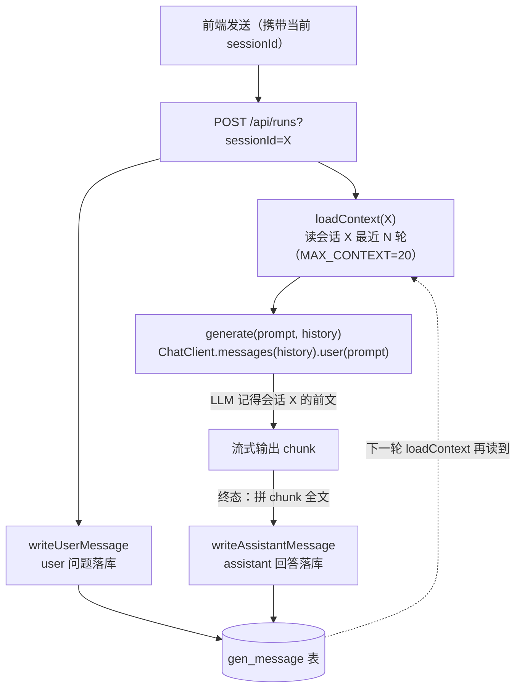

**表设计**：

```
gen_session  会话本体（历史列表用：id / title / 创建/更新时间）
gen_message  对话消息（每轮一行：session_id / run_id / role / content / 时间）
```

> **一个约定变化（重要）**：第 6、7 章里 `sessionId` 是前端随手传的字符串（如 `sess-001`）。从本章起，**会话要先用 `POST /api/sessions` 创建**（拿到合法 sessionId），`gen_message` 用外键约束保证消息一定挂在已存在的会话下——否则历史列表和消息对不上。前几章的 curl 样例照旧能跑，但那只是"无历史"的简版。

### 8.2 动手

#### 8.2.1 建表：gen_session + gen_message

**【改已有文件，追加】** `schema.sql`：

```sql
-- ▼ 第8章新增：会话本体（历史列表、新会话）
CREATE TABLE IF NOT EXISTS gen_session (
    id          VARCHAR(64)  PRIMARY KEY,          -- sessionId
    title       VARCHAR(128) NOT NULL DEFAULT '新会话',
    created_at  TIMESTAMPTZ  NOT NULL DEFAULT now(),
    updated_at  TIMESTAMPTZ  NOT NULL DEFAULT now()
);

-- ▼ 第8章新增：对话消息（每轮一行，user/assistant）
CREATE TABLE IF NOT EXISTS gen_message (
    id          BIGSERIAL    PRIMARY KEY,
    session_id  VARCHAR(64)  NOT NULL,
    run_id      VARCHAR(32)  NOT NULL,
    role        VARCHAR(16)  NOT NULL,             -- user / assistant
    content     TEXT         NOT NULL,             -- 该轮完整文本
    created_at  TIMESTAMPTZ  NOT NULL DEFAULT now(),
    CONSTRAINT fk_msg_session FOREIGN KEY (session_id) REFERENCES gen_session(id) ON DELETE CASCADE,
    CONSTRAINT fk_msg_run     FOREIGN KEY (run_id)     REFERENCES gen_run(id)     ON DELETE CASCADE
);
CREATE INDEX IF NOT EXISTS idx_gen_msg_session ON gen_message (session_id, created_at); -- ▼ 按会话查对话
```

> **两张表的分工**：`gen_session` 是会话的"门牌"（历史列表页靠它），`gen_message` 是会话的"聊天记录"。run 结束、消息挂好，会话随时能翻出完整对话。

#### 8.2.2 实体 + Mapper（MyBatis-Flex）

与第 7 章 `RunEntity`/`RunMapper` 完全对称，这里新建两个实体、两个 Mapper。

**【新建文件】** `research-stream/src/main/java/com/example/stream/run/SessionEntity.java`：

```java
package com.example.stream.run;

import com.mybatisflex.annotation.Column;
import com.mybatisflex.annotation.Id;
import com.mybatisflex.annotation.KeyType;
import com.mybatisflex.annotation.Table;
import java.time.OffsetDateTime;

/** ▼ 会话实体（对应 gen_session 表）。 */
@Table("gen_session")
public class SessionEntity {

    @Id(keyType = KeyType.None)   // sessionId 由应用生成
    private String id;

    private String title;

    @Column("created_at")
    private OffsetDateTime createdAt;

    @Column("updated_at")
    private OffsetDateTime updatedAt;

    // getters / setters 省略（实际项目用 Lombok @Data）
}
```

**【新建文件】** `research-stream/src/main/java/com/example/stream/run/MessageEntity.java`：

```java
package com.example.stream.run;

import com.mybatisflex.annotation.Column;
import com.mybatisflex.annotation.Id;
import com.mybatisflex.annotation.KeyType;
import com.mybatisflex.annotation.Table;
import java.time.OffsetDateTime;

/** ▼ 对话消息实体（对应 gen_message 表）。 */
@Table("gen_message")
public class MessageEntity {

    @Id(keyType = KeyType.Auto)   // BIGSERIAL 自增
    private Long id;

    @Column("session_id")
    private String sessionId;

    @Column("run_id")
    private String runId;

    private String role;          // user / assistant

    private String content;

    @Column("created_at")
    private OffsetDateTime createdAt;

    // getters / setters 省略
}
```

**【新建文件】** `SessionMapper.java` + `MessageMapper.java`：

```java
package com.example.stream.run;

import com.mybatisflex.core.BaseMapper;
import org.apache.ibatis.annotations.Mapper;

/** ▼ 会话表 Mapper：继承 BaseMapper 自动获得 CRUD。 */
@Mapper
public interface SessionMapper extends BaseMapper<SessionEntity> {
}
```

```java
package com.example.stream.run;

import com.mybatisflex.core.BaseMapper;
import org.apache.ibatis.annotations.Mapper;

/** ▼ 消息表 Mapper。 */
@Mapper
public interface MessageMapper extends BaseMapper<MessageEntity> {
}
```

#### 8.2.3 HistoryStore：历史读写 + 上下文装载

**【新建文件】** `research-stream/src/main/java/com/example/stream/run/HistoryStore.java`：

```java
package com.example.stream.run;

import com.mybatisflex.core.query.QueryWrapper;
import org.slf4j.Logger;
import org.slf4j.LoggerFactory;
import org.springframework.ai.chat.messages.AssistantMessage;
import org.springframework.ai.chat.messages.Message;
import org.springframework.ai.chat.messages.UserMessage;
import org.springframework.stereotype.Component;
import reactor.core.publisher.Flux;
import reactor.core.publisher.Mono;
import reactor.core.scheduler.Schedulers;

import java.time.OffsetDateTime;
import java.util.ArrayList;
import java.util.Collections;
import java.util.List;
import java.util.UUID;

/**
 * 会话历史存储（第 8 章）。
 *
 * 写：user 消息（触发时）、assistant 消息（run 终态，chunk 拼成全文）。
 * 读：loadContext(sessionId) —— 该会话最近 N 轮 → Spring AI Message 列表，注入 LLM。
 * 会话：createSession / listSessions / listMessages。
 *
 * ⚠️ MyBatis-Flex/JDBC 是阻塞的，每个 DB 调用都用 Schedulers.boundedElastic() 隔离
 *    （同第 7 章 RunStore），否则卡住 reactor 事件循环。
 */
@Component
public class HistoryStore {

    private static final Logger log = LoggerFactory.getLogger(HistoryStore.class);
    private static final int MAX_CONTEXT = 20;   // ▼ 注入 LLM 的最近轮数（控制 token 开销）

    private final SessionMapper sessionMapper;
    private final MessageMapper messageMapper;

    public HistoryStore(SessionMapper sessionMapper, MessageMapper messageMapper) {
        this.sessionMapper = sessionMapper;
        this.messageMapper = messageMapper;
    }

    /** 写 user 消息（触发时调）。 */
    public Mono<Void> writeUserMessage(String sessionId, String runId, String content) {
        return write(sessionId, runId, "user", content);
    }

    /** 写 assistant 消息（run 终态，chunk 拼成的全文）。 */
    public Mono<Void> writeAssistantMessage(String sessionId, String runId, String content) {
        return write(sessionId, runId, "assistant", content);
    }

    /**
     * 读该会话最近 N 轮，转成 Spring AI 的 Message 列表（注入 ChatClient 用）。
     * ▼ 关键：上下文**跟着 sessionId 走**——前端切到哪个历史会话，这里就读哪个会话的历史，
     *   所以"切回旧会话继续聊"时模型记得那个会话之前说过的话。
     */
    public Mono<List<Message>> loadContext(String sessionId) {
        return Mono.fromCallable(() -> {
            List<MessageEntity> recent = messageMapper.selectListByQuery(
                    QueryWrapper.create()
                            .where(GEN_MESSAGE.SESSION_ID.eq(sessionId))
                            .orderBy(GEN_MESSAGE.ID.desc())
                            .limit(MAX_CONTEXT));
            Collections.reverse(recent);          // ▼ 最近 N 条（倒序）→ 翻回时间正序
            List<Message> context = new ArrayList<>(recent.size());
            for (MessageEntity m : recent) {
                context.add("user".equals(m.getRole())
                        ? new UserMessage(m.getContent())
                        : new AssistantMessage(m.getContent()));
            }
            return context;
        }).subscribeOn(Schedulers.boundedElastic());
    }

    /** ▼ 会话管理：新建会话（前端"新会话"按钮调它）。 */
    public Mono<SessionEntity> createSession() {
        return Mono.fromCallable(() -> {
            SessionEntity s = new SessionEntity();
            s.setId("sess_" + UUID.randomUUID().toString().replace("-", "").substring(0, 12));
            s.setTitle("新会话");
            OffsetDateTime now = OffsetDateTime.now();
            s.setCreatedAt(now);
            s.setUpdatedAt(now);
            sessionMapper.insert(s);
            return s;
        }).subscribeOn(Schedulers.boundedElastic());
    }

    /** ▼ 会话管理：历史列表（按最近活跃倒序，前端侧栏用）。 */
    public Flux<SessionEntity> listSessions() {
        return Mono.fromCallable(() ->
                    sessionMapper.selectListByQuery(
                            QueryWrapper.create().orderBy(GEN_SESSION.UPDATED_AT.desc())))
                .subscribeOn(Schedulers.boundedElastic())
                .flatMapMany(Flux::fromIterable);
    }

    /** ▼ 会话管理：某会话的对话记录（时间正序，切换会话后回看用）。 */
    public Flux<MessageEntity> listMessages(String sessionId) {
        return Mono.fromCallable(() ->
                    messageMapper.selectListByQuery(
                            QueryWrapper.create()
                                    .where(GEN_MESSAGE.SESSION_ID.eq(sessionId))
                                    .orderBy(GEN_MESSAGE.ID.asc())))
                .subscribeOn(Schedulers.boundedElastic())
                .flatMapMany(Flux::fromIterable);
    }

    /** ▼ 内部：插入一条消息 + 刷新会话的 updated_at。 */
    private Mono<Void> write(String sessionId, String runId, String role, String content) {
        return Mono.fromRunnable(() -> {
            MessageEntity m = new MessageEntity();
            m.setSessionId(sessionId);
            m.setRunId(runId);
            m.setRole(role);
            m.setContent(content);
            m.setCreatedAt(OffsetDateTime.now());
            messageMapper.insert(m);
            SessionEntity s = sessionMapper.selectOneById(sessionId);
            if (s != null) {
                s.setUpdatedAt(OffsetDateTime.now());
                // ▼ 生产小细节：该会话第一条 user 消息当标题（截断）
                if ("user".equals(role) && "新会话".equals(s.getTitle())) {
                    s.setTitle(content.length() > 20 ? content.substring(0, 20) + "…" : content);
                }
                sessionMapper.update(s);
            }
        }).subscribeOn(Schedulers.boundedElastic()).then();
    }
}
```

> **Spring AI 的 `Message` 三件套**：`org.springframework.ai.chat.messages.Message`（接口）、`UserMessage`、`AssistantMessage`（实现类）。`ChatClient.prompt().messages(list)` 正是收 `List<Message>`。把 PG 里存的 role/content 翻回 `UserMessage`/`AssistantMessage`，就能把历史上下文原样喂回模型。
>
> **`GEN_MESSAGE` / `GEN_SESSION` 是什么**：MyBatis-Flex 编译期自动生成的表元数据类（同第 7 章的 `GEN_IDEMPOTENCY`），`SESSION_ID.eq(...)`、`ID.desc()` 是类型安全的链式条件，避免硬编码列名。
>
> **`loadContext` 的 token 开销**：喂给 LLM 的历史越多越贵、越慢，所以只取最近 20 轮（`MAX_CONTEXT`）。这是生产聊天产品的标准做法（类似 ChatGPT 的"模型看到最近几十条"），控制成本与延迟。

#### 8.2.4 TextGenerator：支持历史注入

**【改已有文件，完整版覆盖】** `TextGenerator.java`：

```java
package com.example.stream.generator;

import org.springframework.ai.chat.client.ChatClient;
import org.springframework.ai.chat.messages.Message;
import org.springframework.stereotype.Component;
import reactor.core.publisher.Flux;

import java.util.List;

/**
 * 流式生成器（数据源）—— 基于 Spring AI 2.0 的 ChatClient。
 * 第 8 章起支持带历史上下文的生成：先注入该会话最近 N 轮，再问当前问题。
 */
@Component
public class TextGenerator {

    private final ChatClient chatClient;

    public TextGenerator(ChatClient.Builder builder) {
        this.chatClient = builder.build();
    }

    /** ▼ 流式生成（第8章起带历史上下文）。history 是该会话最近 N 轮，可为空。 */
    public Flux<String> generate(String prompt, List<Message> history) {
        return chatClient.prompt()
                .messages(history)          // ▼ 先注入历史（模型据此"记得"前文）
                .user(prompt)               // 再问当前问题
                .stream()
                .content();
    }

    /** 兼容无历史的调用（第0-7章的老调用，直接转空历史）。 */
    public Flux<String> generate(String prompt) {
        return generate(prompt, List.of());
    }
}
```

> **`prompt().messages(history)`**：ChatClient 的 prompt 构造里可以塞一组历史消息，再叠加当前的 `.user(...)`。注入顺序就是对话顺序（时间正序）——模型看到的是完整上下文。这也是 `loadContext` 要按时间正序返回的原因。

> 📌 **Spring AI 内置的多轮记忆（借鉴真实项目 demo04 的更省事做法）**：如果只需要"模型记得前文"、不需要把历史落 PG 查询，可以用 Spring AI 的 `MessageChatMemoryAdvisor` + `ChatMemory`，一行把会话记忆接上——按 `ChatMemory.CONVERSATION_ID`（就是 sessionId）自动管理上下文：
>
> ```java
> @Bean
> public ChatClient client(ChatClient.Builder builder, ChatMemory memory) {
>     return builder
>             .defaultAdvisors(MessageChatMemoryAdvisor.builder(memory).build())  // ▼ 内置多轮记忆
>             .build();
> }
> ```
> 之后调用时 `client.prompt().user(prompt).advisors(spec -> spec.param(ChatMemory.CONVERSATION_ID, sessionId))` 即可。**注意**：`ChatMemory` 默认在内存，要长期可查、可审计（本仓库 ch8 的需求），仍需要 PG 持久化（`HistoryStore`）；两者可结合——用 Advisor 做记忆、用 `HistoryStore` 做存档。

#### 8.2.5 StreamService：接 HistoryStore

**【改已有文件，完整版覆盖】** `StreamService.java`（基于第 7 章状态；触发时读上下文 + 落 user 消息，终态拼全文落 assistant 消息）：

```java
package com.example.stream.serve;

import com.example.stream.bus.StreamBus;
import com.example.stream.generator.TextGenerator;
import com.example.stream.run.HistoryStore;
import com.example.stream.run.RunStore;
import org.slf4j.Logger;
import org.slf4j.LoggerFactory;
import org.springframework.ai.chat.messages.Message;
import org.springframework.stereotype.Service;
import reactor.core.Disposable;
import reactor.core.publisher.Flux;
import reactor.core.publisher.Mono;

import java.util.List;
import java.util.concurrent.ConcurrentHashMap;

/**
 * 管数分离 + 会话历史 + 多轮上下文（第 8 章）。
 *
 * 触发：会话独占 → 幂等创建 → 读该会话历史上下文 → 落 user 消息 → 带上下文生成。
 * 终态：把缓冲的 chunk 拼成完整回答，落 assistant 消息（历史以"完整消息"为单位存）。
 * 上下文跟着 sessionId 走——切到哪个会话，模型就记得哪个会话。
 */
@Service
public class StreamService {

    private static final Logger log = LoggerFactory.getLogger(StreamService.class);

    private final TextGenerator generator;
    private final StreamBus bus;
    private final RunStore runs;
    private final HistoryStore history;   // ▼ 第8章新增：会话历史

    private final ConcurrentHashMap<String, Disposable> handles = new ConcurrentHashMap<>();
    private final ConcurrentHashMap<String, String> runSession = new ConcurrentHashMap<>();
    private final ConcurrentHashMap<String, StringBuilder> buffers = new ConcurrentHashMap<>();  // ▼ chunk 缓冲

    public StreamService(TextGenerator generator, StreamBus bus, RunStore runs, HistoryStore history) {
        this.generator = generator;
        this.bus = bus;
        this.runs = runs;
        this.history = history;
    }

    /** ▼ 管理面：会话独占 → 幂等创建 → 读上下文 → 落 user 消息 → 触发。返回 runId；会话忙时 409。 */
    public Mono<String> trigger(String prompt, String sessionId, String idempotencyKey) {
        return runs.create(idempotencyKey, sessionId)
                .flatMap(runId -> runs.acquireSession(sessionId)
                        .flatMap(acquired -> {
                            if (Boolean.FALSE.equals(acquired)) {
                                // 会话忙：请求被拒，这条 user 消息不该进历史（它没真正开始）
                                runs.setStatus(runId, "CANCELLED").subscribe();
                                return Mono.<String>error(new IllegalStateException(
                                        "当前会话有任务正在生成，请等待完成后再提问"));
                            }
                            runSession.put(runId, sessionId);
                            return history.loadContext(sessionId)           // ▼ ① 读该会话最近 N 轮（不含本轮）
                                    .flatMap(context -> runs.setStatus(runId, "RUNNING")
                                            .then(history.writeUserMessage(sessionId, runId, prompt)) // ▼ ② user 落库
                                            .then(Mono.fromRunnable(() -> startGeneration(runId, prompt, context)))
                                            .thenReturn(runId));
                        }));
    }

    /** 跑生成器：带历史上下文；每个 chunk 缓冲一份，终态拼成全文落库。 */
    private void startGeneration(String runId, String prompt, List<Message> context) {
        StringBuilder buf = new StringBuilder();
        buffers.put(runId, buf);
        Disposable handle = generator.generate(prompt, context)
                .doOnNext(buf::append)                        // ▼ 缓冲 chunk
                .concatMap(chunk -> bus.write(runId, chunk))  // 同时写总线（实时推流）；concatMap 保序
                .doOnComplete(() -> finishRun(runId, "DONE"))
                .doOnError(err -> {
                    log.error("[run] 失败 runId={}: {}", runId, err.getMessage());
                    finishRun(runId, "FAILED");
                })
                .subscribe();
        handles.put(runId, handle);
    }

    /** ▼ 终态统一：写结束标记、改状态、落 assistant 全文、释放会话锁。 */
    private void finishRun(String runId, String status) {
        bus.writeEnd(runId).subscribe();
        runs.setStatus(runId, status).subscribe();
        handles.remove(runId);
        saveAssistantMessage(runId);                          // ▼ 拼缓冲 → 落 assistant 历史
        String sessionId = runSession.remove(runId);
        if (sessionId != null) {
            runs.releaseSession(sessionId).subscribe();
        }
        log.info("[run] 终态 runId={} status={}", runId, status);
    }

    /** ▼ 把缓冲的 chunk 拼成完整回答，写进历史。失败/取消时落"已生成的部分"，诚实记录半截回答。 */
    private void saveAssistantMessage(String runId) {
        StringBuilder buf = buffers.remove(runId);
        String sessionId = runSession.get(runId);
        if (buf != null && sessionId != null && !buf.isEmpty()) {
            history.writeAssistantMessage(sessionId, runId, buf.toString()).subscribe();
        }
    }

    /** ▼ 数据面：只读订阅（按 runId）。 */
    public Flux<StreamBus.ChunkEntity> subscribe(String runId, long lastSeq) {
        return bus.subscribe(runId, lastSeq);
    }

    /** ▼ 管理面：查状态。 */
    public Mono<String> status(String runId) {
        return runs.get(runId);
    }

    /** ▼ 管理面：取消（CANCELLED 也是终态，落半截回答 + 释放会话锁）。 */
    public Mono<Void> cancel(String runId) {
        saveAssistantMessage(runId);
        Disposable handle = handles.remove(runId);
        if (handle != null && !handle.isDisposed()) {
            handle.dispose();
        }
        String sessionId = runSession.remove(runId);
        return runs.setStatus(runId, "CANCELLED")
                .then(bus.writeEnd(runId))
                .then(sessionId != null ? runs.releaseSession(sessionId) : Mono.empty());
    }
}
```

> **两个关键改动（对比第 7 章）**：
> - **触发**：`history.loadContext(sessionId)` 先把该会话最近 20 轮读出来，传给 `startGeneration` → `generate(prompt, context)`。**上下文来自请求里的 sessionId**——前端切到哪个历史会话，模型就感知哪个会话的上下文（这就是"切回旧会话不失忆"的机制）。
> - **终态**：生成过程中把每个 chunk 缓冲进 `StringBuilder`，`finishRun` 时拼成**完整回答**写入 `gen_message`。历史存的是"一条完整消息"，不是几千条 chunk——回看、导出、审计都方便。

> **为什么用内存缓冲拼全文，而不是从总线回放？** 简单、不依赖总线结构；生产上"生成完落一条完整消息"也是标准做法。代价是 run 期间多占一份内存——对文本生成（K~几十 KB）完全可接受。失败/取消时缓冲里是"已生成的部分"，照样落库（诚实记录半截回答）。

> **`loadContext` 放在 `acquireSession` 之后**：会话忙（409）时请求被拒，**不该把这条 user 消息写进历史**（它没真正开始）。顺序：先抢到会话 → 再读上下文 → 写 user 消息 → 开跑。

#### 8.2.6 SessionController：会话管理 + 历史接口

**【新建文件】** `research-stream/src/main/java/com/example/stream/run/SessionController.java`：

```java
package com.example.stream.run;

import org.springframework.http.HttpStatus;
import org.springframework.http.ResponseEntity;
import org.springframework.web.bind.annotation.*;
import reactor.core.publisher.Flux;
import reactor.core.publisher.Mono;

/**
 * 会话历史（第 8 章）。
 *   POST /api/sessions                          → 新建会话（前端"新会话"按钮调它）
 *   GET  /api/sessions                          → 会话列表（历史列表，按最近活跃倒序）
 *   GET  /api/sessions/{id}/messages            → 某会话的对话记录（切换会话后回看）
 *   GET  /api/sessions/{id}/current-run         → 该会话当前/最近 runId（**第二个页面加入流靠它**）
 */
@RestController
@RequestMapping("/api/sessions")
public class SessionController {

    private final HistoryStore history;
    private final RunStore runs;   // ▼ 第8章：多页面加入需要查"会话当前 runId"

    public SessionController(HistoryStore history, RunStore runs) {
        this.history = history;
        this.runs = runs;
    }

    /** 新会话按钮：创建会话，返回 sessionId。 */
    @PostMapping
    public Mono<ResponseEntity<SessionEntity>> create() {
        return history.createSession()
                .map(s -> ResponseEntity.status(HttpStatus.CREATED).body(s));
    }

    /** 历史列表（按最近活跃倒序）。 */
    @GetMapping
    public Flux<SessionEntity> list() {
        return history.listSessions();
    }

    /** 某会话的对话记录（时间正序）。 */
    @GetMapping("/{sessionId}/messages")
    public Flux<MessageEntity> messages(@PathVariable String sessionId) {
        return history.listMessages(sessionId);
    }

    /** ▼ 该会话当前/最近 runId：第二个页面没做过 POST，靠这个接口拿 runId 再订阅流。
     *  借鉴真实项目 demo04 的 getRunId 模式——多页面共享靠 sessionId，不靠幂等键。 */
    @GetMapping("/{sessionId}/current-run")
    public Mono<ResponseEntity<String>> currentRun(@PathVariable String sessionId) {
        return runs.getRunId(sessionId)
                .map(runId -> ResponseEntity.ok()
                        .body("{\"currentRunId\":\"" + runId + "\"}"))
                .defaultIfEmpty(ResponseEntity.notFound().build());
    }
}
```

#### 8.2.7 前端：新会话按钮 + 历史列表 + 切换会话

**【新建文件】** `research-stream/src/main/resources/static/index.html`（WebFlux 默认静态目录，起服务后直接打开 `http://localhost:8080/`）：

```html
<!DOCTYPE html>
<html lang="zh">
<head>
<meta charset="utf-8">
<title>管数分离 · 会话历史演示</title>
<style>
  body { margin:0; display:flex; height:100vh; font-family: sans-serif; }
  aside { width:220px; border-right:1px solid #ddd; padding:8px; overflow:auto; }
  aside button { width:100%; padding:8px; margin-bottom:8px; }
  aside li { padding:6px; cursor:pointer; border-bottom:1px solid #eee; }
  aside li:hover { background:#f5f5f5; }
  main { flex:1; padding:12px; display:flex; flex-direction:column; }
  #chat { flex:1; overflow:auto; white-space:pre-wrap; }
  input { padding:8px; font-size:14px; }
</style>
</head>
<body>
  <aside>
    <button id="newBtn">＋ 新会话</button>
    <ul id="sessionList"></ul>
  </aside>
  <main>
    <pre id="chat"></pre>
    <input id="input" placeholder="输入问题，回车发送">
  </main>
<script>
  let currentSession = null;   // ▼ 当前会话：切到哪个历史会话，发的消息就挂到哪个会话

  // 1. 加载会话列表（历史记录）
  async function loadSessions() {
    const list = await fetch("/api/sessions").then(r => r.json());
    sessionList.innerHTML = "";
    for (const s of list) {
      const li = document.createElement("li");
      li.textContent = s.title;
      li.onclick = () => switchTo(s.id, true);   // 2. 点击历史会话 → 切换
      sessionList.appendChild(li);
    }
  }

  // 3. 新会话按钮 → POST /api/sessions
  newBtn.onclick = async () => {
    const s = await fetch("/api/sessions", {method: "POST"}).then(r => r.json());
    await switchTo(s.id, false);
    loadSessions();
  };

  // 4. 切换会话：清屏 + 加载该会话的历史对话
  async function switchTo(sessionId, loadHistory) {
    currentSession = sessionId;
    chat.textContent = "";
    if (loadHistory) {
      const msgs = await fetch(`/api/sessions/${sessionId}/messages`).then(r => r.json());
      for (const m of msgs)
        chat.textContent += (m.role === "user" ? "我： " : "AI： ") + m.content + "\n";
    }
  }

  // 5. 发送 → POST /api/runs（带 currentSession）→ EventSource 订阅流
  input.addEventListener("keydown", async e => {
    if (e.key !== "Enter" || !currentSession) return;
    const prompt = input.value; input.value = "";
    chat.textContent += "我： " + prompt + "\nAI： ";
    const r = await fetch(`/api/runs?sessionId=${currentSession}&prompt=${encodeURIComponent(prompt)}`,
                          {method: "POST", headers: {"Idempotency-Key": crypto.randomUUID()}});
    const { runId } = await r.json();
    const es = new EventSource(`/api/runs/${runId}/stream`);
    es.addEventListener("token", e => chat.textContent += e.data);
    es.addEventListener("done",  e => { es.close(); loadSessions(); });   // 结束刷新列表（标题/时间变了）
  });

  loadSessions();
</script>
</body>
</html>
```

> **切换会话 = 切换上下文（呼应 8.1 的设计点）**：前端每次发送都带 `currentSession`，后端从该 sessionId 读历史注入模型。**所以"点开旧会话继续聊"时，模型自动记得那个会话之前说过的话**——这就是"历史记录要和 LLM 交互对上"的落点。点"新会话"（`POST /api/sessions`）换一个 sessionId，历史从零开始。
>
> **`Idempotency-Key` 用 `crypto.randomUUID()`**：浏览器原生生成随机键，防双击/重试重复触发（第 6 章机制）。

### 8.3 验证（端到端：新建会话 → 多轮 → 切回历史会话）

```bash
./mvnw spring-boot:run

# 1. 新建会话（前端"新会话"按钮调它）
curl -i -X POST http://localhost:8080/api/sessions
# {"id":"sess_xxx...","title":"新会话",...}   ← 记下 sess_xxx

# 2. 在会话里问第一句
curl -i -X POST "http://localhost:8080/api/runs?sessionId=sess_xxx&prompt=我叫小明" -H "Idempotency-Key: k1"
curl -N "http://localhost:8080/api/runs/run_xxx/stream"   # 看流

# 3. 问第二句——模型应该"记得"刚才我叫小明
curl -i -X POST "http://localhost:8080/api/runs?sessionId=sess_xxx&prompt=我刚才说自己叫什么" -H "Idempotency-Key: k2"
# ✅ 输出里会提到"小明"——多轮上下文生效（历史注入在起作用）

# 4. 历史记录：查这个会话的完整对话（换设备、重启都不丢，在 PG 里）
curl "http://localhost:8080/api/sessions/sess_xxx/messages"
# [{"role":"user","content":"我叫小明",...},{"role":"assistant","content":"你好，小明！...",...}, ...]

# 5. 会话列表
curl "http://localhost:8080/api/sessions"
# [{"id":"sess_xxx","title":"我叫小明…",...}]   ← 标题自动用第一句

# 6. SQL 直接看（系统记录在 PG）
docker exec -it pg psql -U postgres -d research_stream \
  -c "SELECT role, left(content,20) FROM gen_message WHERE session_id='sess_xxx' ORDER BY id;"

# 7. ▼ 切换会话场景：新建另一个会话，问同一个问题，模型不该"记得"上一个会话
curl -X POST http://localhost:8080/api/sessions   # 得到 sess_yyy
curl -i -X POST "http://localhost:8080/api/runs?sessionId=sess_yyy&prompt=我刚才说自己叫什么" -H "Idempotency-Key: k3"
# ✅ 这个会话没有"我叫小明"的历史 → 模型回答"你没有告诉过我"——上下文按会话隔离
```

**关键观察（对应 8.1 的设计）**：
- **同会话多轮**：第 2、3 步之间模型记得上下文（历史注入）。
- **跨会话隔离**：第 7 步换会话后，模型不记得上一个会话——**上下文跟着 sessionId 走，不是全局状态**。切回 `sess_xxx` 再问，它又记得小明。
- **历史可查**：`/api/sessions/{id}/messages` 拿到完整对话，PG 里也有——换设备、重启都不丢。

### 8.4 checkpoint

```bash
git add -A && git commit -m "第8章:会话历史(gen_session/gen_message)+多轮上下文+会话管理API+前端切换"
```

项目结构新增：

```
research-stream/src/main/java/com/example/stream/run/
├── SessionEntity.java / MessageEntity.java
├── SessionMapper.java / MessageMapper.java
├── HistoryStore.java
└── SessionController.java
research-stream/src/main/resources/
├── static/index.html      # 前端演示：新会话按钮 + 历史列表 + 切换
└── schema.sql             # 追加 gen_session / gen_message
```

### 8.5 复盘 + 暴露问题

历史记录这关过了：对话落库、列表可查、**多轮上下文按会话注入、切换会话不失忆**、前端能新建/切换会话。但有两个真实问题藏不住了：

1. **所有东西还在一个进程里**。水平扩展成两台实例后，A 实例触发的 run，B 实例的订阅请求会落空（生成流句柄 `Disposable` 只在 A 的内存里）；两台实例如果都收到触发请求，可能各自跑一次（虽然有会话级独占、幂等键兜底，但任务级单一写者锁需要显式处理）。**第 9 章：跨实例广播 + 单一写者锁**，把管数分离推向真正的多实例集群。
2. **历史消息的写入是"fire-and-forget"**（`history.writeAssistantMessage(...).subscribe()`），没等落库成功就返回了。单机够用，但严格场景（审计对账）要等写库成功再标 DONE——留作进阶。第 9 章跨实例时这点依然成立。

---

## 第 9 章：水平扩展成两台实例——跨实例广播 + 单一写者锁

### 9.0 场景

单实例扛不住流量了，你部署了两台实例（`instance-1` 端口 8080、`instance-2` 端口 8081），前面挂个负载均衡。真实问题立刻浮现：

> 用户手机访问，负载均衡把**触发请求**分给了 instance-1，instance-1 跑起了生成器、往 Redis 写 chunk。然后 iPad 上的**订阅请求**被负载均衡分给了 instance-2。

**问题**：第 6 章里，"谁触发谁持有 Disposable 句柄、谁就能取消"。现在 instance-2 收到订阅请求——它能读到 Redis 里的历史和实时 chunk 吗？

好消息：**能**。因为 chunk 全程落 Redis Stream + Pub/Sub 频道，**任何实例只要连着同一个 Redis**，都能 `subscribe(runId)` 读到内容。**这正是第 4 章把数据搬出进程、落 Redis 的回报**——天然支持跨实例订阅。

但有两个新问题要解决：

1. **重复触发**：如果触发请求被负载均衡分给两台实例各一次（极端情况，或前端重试），两台都跑生成器。需要**单一写者**保证——全集群只有一个实例真正去跑。
2. **取消跨实例**：用户在 instance-2 上点取消，但生成器句柄在 instance-1 的内存里。instance-2 怎么停掉 instance-1 的生成器？

### 9.1 思路

#### ① 单一写者：Redisson 分布式锁

用分布式锁保证**抢到锁的实例才跑生成器**，没抢到的直接返回"已有人在跑"。第 6 章我们已用 Redisson 做过**会话锁**，这里用同一个 `RLock` 做**任务级单一写者锁**——Redisson 是 Redis 分布式锁的**生产首选**实现，比手写 `SET NX EX` 稳得多：

| 方案 | 实现 | 取舍 |
|------|------|------|
| **Redisson `RLock`**（本章用） | Lua 脚本安全释放 + 看门狗自动续期 | 生产首选；仍残留 GC 停顿导致的陈旧写入窗口（见下） |
| 手写 `SET NX EX` | 最简分布式锁 | 缺陷多：误删别人锁、过期无续期、过期后旧持有者继续写 |
| Redis Redlock | 跨多 Redis 实例 | 更抗单点，但有著名的时钟漂移批评（Martin Kleppmann） |
| lease + fencing token | 锁带租约+单调 token，存储层拒绝旧 token 写 | 业界最稳（Google Chubby 思路），复杂 |

**Redisson 解决了手写 SETNX 的三个经典坑**（详见 [Redis 分布式锁实战](../../附录/Redis专题/02-Redis分布式锁实战.md) 附录）：

1. **误删别人的锁**：手写 `releaseLock` 直接 `DEL`，不校验持有者——A 的锁过期后 B 抢到，A 此时跑完会误删 B 的锁。Redisson 释放走 Lua 脚本，**先比对 value=自己再删**。
2. **业务没跑完锁过期**：手写锁的 TTL 是死的，生成器跑得慢（LLM 卡顿）就会在锁过期后被别人抢走。Redisson 的**看门狗**默认每 10s 把锁续期到 30s，只要实例活着，锁就不过期。
3. **崩溃兜底**：实例宕机，看门狗随之死亡，锁 30s 后自动过期，不会永久锁死。

> **诚实标注**：即使用了 Redisson，仍有一个理论缺陷——**GC 长停顿 / 进程冻结期间，看门狗也被冻结无法续期，锁过期后旧持有者恢复，会继续写入**，出现"两个实例同时写"的窗口。生产级严格场景（金融扣款等）要上 **fencing token**（锁带单调递增 token，存储层拒绝旧 token 写）。**本文用 Redisson 起步，把 fencing 作为附录扩展点**，而不是假装锁完美。多数业务场景（含本案例的流式生成）Redisson 已足够。

#### ② 取消跨实例：Pub/Sub 下发取消指令

`cancel` 时不再依赖本地 `Disposable`，而是 `PUBLISH` 一个取消指令到频道。**持有生成器的那台实例监听到指令，自己 dispose 掉生成流。** 这样取消天然跨实例。

**多实例架构（跨实例广播 + 单一写者）**：

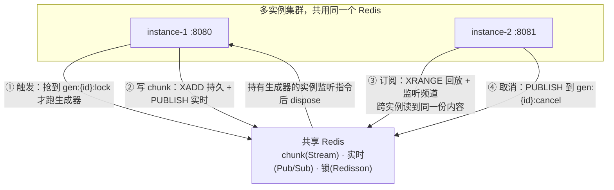

### 9.2 动手

#### 9.2.1 StreamBus：加锁 + 跨实例取消监听

**【改已有文件，完整版覆盖】** `StreamBus.java`（核心：`trigger` 变成"抢锁才跑"，新增取消频道监听）：

```java
package com.example.stream.bus;

import org.redisson.api.RLock;
import org.redisson.api.RedissonClient;
import org.slf4j.Logger;
import org.slf4j.LoggerFactory;
import org.springframework.beans.factory.annotation.Value;
import org.springframework.data.domain.Range;
import org.springframework.data.redis.connection.stream.MapRecord;
import org.springframework.data.redis.connection.stream.StreamRecords;
import org.springframework.data.redis.connection.stream.StringRecord;
import org.springframework.data.redis.connection.ReactiveSubscription;
import org.springframework.data.redis.core.ReactiveRedisTemplate;
import org.springframework.stereotype.Component;
import reactor.core.Disposable;
import reactor.core.publisher.Flux;
import reactor.core.publisher.Mono;
import reactor.core.scheduler.Schedulers;
import tools.jackson.databind.ObjectMapper;

import java.util.Map;
import java.util.concurrent.ConcurrentHashMap;
import java.util.concurrent.TimeUnit;

/**
 * 流总线（第 9 章）：Redisson 分布式锁保证单一写者 + Pub/Sub 跨实例取消。
 *
 * trigger：Redisson 抢锁，抢到才跑生成器（全集群只有一个实例跑）。看门狗自动续期，业务没跑完锁不过期。
 * cancel：PUBLISH 取消指令，持有生成器的实例监听后自行 dispose。
 */
@Component
public class StreamBus {

    private static final Logger log = LoggerFactory.getLogger(StreamBus.class);

    private static final String KEY_STREAM = "gen:%s:chunks";
    private static final String CHANNEL    = "gen:%s";
    private static final String KEY_SEQ    = "gen:%s:seq";
    private static final String KEY_LOCK   = "gen:%s:lock";       // ▼ Redisson 锁 key
    private static final String CH_CANCEL  = "gen:%s:cancel";    // ▼ 取消频道
    private static final String END_MARK   = "__END__";

    private final ReactiveRedisTemplate<String, String> redis;
    private final RedissonClient redisson;   // ▼ 分布式锁客户端（独立于 ReactiveRedisTemplate）
    private final String instanceId;   // ▼ 本实例唯一标识（日志/取消归属）
    private final ObjectMapper mapper = new ObjectMapper();   // ▼ Pub/Sub 消息用 JSON 传输

    /** 本实例持有的"runId → 生成流句柄"（只存自己跑的那些）。 */
    private final ConcurrentHashMap<String, Disposable> localHandles = new ConcurrentHashMap<>();

    /** ▼ 本实例抢到的"runId → RLock 引用"。释放时必须用同一个对象，Redisson 才能比对 owner 做安全释放。 */
    private final ConcurrentHashMap<String, RLock> heldLocks = new ConcurrentHashMap<>();

    // ▼ 不注入共享 ReactiveRedisMessageListenerContainer：live 订阅和取消监听都用
    //   redis.listenToChannel(...)——每次调用独立容器；配合 RedisConfig 里
    //   shareNativeConnection=false（见 4.2.4），多页面/多实例互不干扰。
    public StreamBus(ReactiveRedisTemplate<String, String> redis,
                     RedissonClient redisson,
                     @Value("${spring.application.name:inst}-${random.uuid}") String instanceId) {
        this.redis = redis;
        this.redisson = redisson;
        this.instanceId = instanceId.substring(0, 12);
        // ▼ 启动时监听全局取消频道（通配）：实际按 runId 监听，见 cancel 流程
    }

    /** ▼ 单一写者：Redisson 抢锁才跑。返回 true=本实例抢到并启动；false=别的实例在跑。
     *  tryLock(0, -1)：0=拿不到立即返回（不阻塞 reactor 线程太久）；-1=启用看门狗自动续期（默认每 10s 续到 30s）。
     *  ⚠️ Redisson 的 RLock 是阻塞 API，在 WebFlux 里用 Schedulers.boundedElastic() 隔离，避免卡住事件循环。 */
    public Mono<Boolean> acquireLock(String runId) {
        return Mono.fromCallable(() -> {
                    RLock lock = redisson.getLock(KEY_LOCK.formatted(runId));
                    boolean acquired = lock.tryLock(0, -1, TimeUnit.MILLISECONDS); // -1 触发看门狗
                    if (acquired) {
                        heldLocks.put(runId, lock);   // 留着 releaseLock 用同一对象安全释放
                    }
                    return acquired;
                })
                .subscribeOn(Schedulers.boundedElastic())
                .doOnNext(ok -> log.info("[bus] acquireLock runId={} acquired={} by={}", runId, ok, instanceId));
    }

    /** ▼ 释放锁。用抢锁时存下的 RLock 引用调用 unlock()——Redisson 内部走 Lua 校验 owner 后才删，不会误删别人的锁。 */
    public Mono<Boolean> releaseLock(String runId) {
        return Mono.fromRunnable(() -> {
                    RLock lock = heldLocks.remove(runId);
                    if (lock != null && lock.isHeldByCurrentThread()) {
                        lock.unlock();
                    }
                })
                .subscribeOn(Schedulers.boundedElastic())
                .thenReturn(true);
    }

    /** 写 chunk（同第 5 章：XADD + PUBLISH JSON）。 */
    public Mono<Void> write(String runId, String chunk) {
        String streamKey = KEY_STREAM.formatted(runId);
        String channel   = CHANNEL.formatted(runId);
        String seqKey    = KEY_SEQ.formatted(runId);
        return redis.opsForValue().increment(seqKey)
                .flatMap(seq -> {
                    StringRecord record = StreamRecords.string(
                            Map.of("seq", String.valueOf(seq), "chunk", chunk)).withStreamKey(streamKey);
                    return redis.opsForStream().add(record)
                            .then(redis.convertAndSend(channel,
                                    mapper.writeValueAsString(new ChunkEntity(seq, chunk))));
                }).then();
    }

    public Mono<Void> writeEnd(String runId) {
        return redis.opsForValue().get(KEY_SEQ.formatted(runId))
                .defaultIfEmpty("0")
                .flatMap(maxSeq -> write(runId, END_MARK));
    }

    /** 订阅（同第 5 章）：history 按 lastSeq 回放 + live 直读 Pub/Sub 的 JSON；
     *  live 用 redis.listenToChannel 独立订阅（多页面/多实例互不干扰，配合 shareNativeConnection=false）。
     *  concatWith 顺序拼接，回放缝隙由持久层兜底（刷新重放补上），与第 5 章一致。 */
    public Flux<ChunkEntity> subscribe(String runId, long lastSeq) {
        Flux<ChunkEntity> history = readAfter(KEY_STREAM.formatted(runId), lastSeq);
        Flux<ChunkEntity> live = redis.listenToChannel(CHANNEL.formatted(runId))
                .map(ReactiveSubscription.Message::getMessage)
                .map(json -> mapper.readValue(json, ChunkEntity.class));
        return history.concatWith(live)
                .takeUntil(e -> END_MARK.equals(e.chunk()))
                .filter(e -> !END_MARK.equals(e.chunk()));
    }

    // —— 跨实例取消：本实例持有句柄的 run，监听取消频道后自行 dispose —— //

    /** 注册本实例持有的生成句柄，并开始监听该 run 的取消频道。
     *  ▼ 用 redis.listenToChannel 独立订阅：take(1) 收到取消指令即完成，订阅自动销毁（不泄漏）；
     *    即使 run 正常完成而取消监听一直挂着，也只是本 run 一条独立订阅，不影响他人。 */
    public void registerLocalRun(String runId, Disposable handle) {
        localHandles.put(runId, handle);
        redis.listenToChannel(CH_CANCEL.formatted(runId))
                .take(1)   // 收到一条取消指令就停
                .subscribe(m -> {
                    Disposable d = localHandles.remove(runId);
                    if (d != null && !d.isDisposed()) {
                        d.dispose();
                        log.info("[bus] 收到取消指令，停止生成 runId={} by={}", runId, instanceId);
                    }
                    writeEnd(runId).subscribe();   // 通知订阅者结束
                });
    }

    /** 取消 run（任何实例都可调）：发取消指令到频道，持有者会响应。 */
    public Mono<Void> cancel(String runId) {
        return redis.convertAndSend(CH_CANCEL.formatted(runId), "CANCEL")
                .then(releaseLock(runId));
    }

    private Flux<ChunkEntity> readAfter(String streamKey, long lastSeq) {
        return redis.opsForStream().range(streamKey, Range.unbounded())
                .filter(r -> seqOf(r) > lastSeq)
                .map(r -> new ChunkEntity(seqOf(r), String.valueOf(r.getValue().get("chunk"))));
    }

    // ▼ Spring Data Redis 3.x：range() 返回 MapRecord<K, Object, Object>
    private long seqOf(MapRecord<String, Object, Object> r) {
        try { return Long.parseLong(String.valueOf(r.getValue().get("seq"))); }
        catch (Exception e) { return 0; }
    }

    /** chunk 消息的值对象（同第 5 章）。 */
    public record ChunkEntity(Long seq, String chunk) {
    }
}
```

#### 9.2.2 StreamService：会话级独占 + 触发抢锁 + 注册本地 run

**【改已有文件，完整版覆盖】** `StreamService.java`：

```java
package com.example.stream.serve;

import com.example.stream.bus.StreamBus;
import com.example.stream.generator.TextGenerator;
import com.example.stream.run.HistoryStore;
import com.example.stream.run.RunStore;
import org.slf4j.Logger;
import org.slf4j.LoggerFactory;
import org.springframework.ai.chat.messages.Message;
import org.springframework.stereotype.Service;
import reactor.core.Disposable;
import reactor.core.publisher.Flux;
import reactor.core.publisher.Mono;

import java.util.List;
import java.util.concurrent.ConcurrentHashMap;

/**
 * 管数分离 + 多实例（第 9 章）：会话级独占 → 幂等创建 → 抢分布式锁 → 抢到才跑；取消走 Pub/Sub。
 * 历史能力延续第 8 章：触发读上下文 + 落 user 消息，终态拼 chunk 落 assistant 消息。
 *
 * 三道防线（从外向内）：
 *   ① 会话级独占（acquireSession）—— 同 session 同时只一个任务，拒绝 409
 *   ② 幂等键         —— 同 key 只创建一个 run
 *   ③ 任务级锁（acquireLock）—— 同 run 多实例只一个跑
 */
@Service
public class StreamService {

    private static final Logger log = LoggerFactory.getLogger(StreamService.class);

    private final TextGenerator generator;
    private final StreamBus bus;
    private final RunStore runs;
    private final HistoryStore history;   // ▼ 第8章新增：会话历史
    /** runId → sessionId（用于终态释放会话锁 + 落历史）。 */
    private final ConcurrentHashMap<String, String> runSession = new ConcurrentHashMap<>();
    /** runId → chunk 缓冲（终态拼全文落历史）。 */
    private final ConcurrentHashMap<String, StringBuilder> buffers = new ConcurrentHashMap<>();

    public StreamService(TextGenerator generator, StreamBus bus, RunStore runs, HistoryStore history) {
        this.generator = generator;
        this.bus = bus;
        this.runs = runs;
        this.history = history;
    }

    /** ▼ 管理面：① 会话独占 → ② 幂等创建 → ③ 抢任务锁 → 抢到才读上下文/落 user/跑生成。返回 runId。 */
    public Mono<String> trigger(String prompt, String sessionId, String idempotencyKey) {
        return runs.create(idempotencyKey, sessionId)
                .flatMap(runId -> runs.acquireSession(sessionId)
                        .flatMap(acquired -> {
                            if (Boolean.FALSE.equals(acquired)) {
                                // 会话忙：标记 run 作废，返回 409
                                runs.setStatus(runId, "CANCELLED").subscribe();
                                return Mono.<String>error(new IllegalStateException(
                                        "当前会话有任务正在生成，请等待完成后再提问"));
                            }
                            runSession.put(runId, sessionId);
                            return runs.setStatus(runId, "RUNNING")
                                    .then(bus.acquireLock(runId))
                                    .flatMap(taskLocked -> {
                                        if (Boolean.TRUE.equals(taskLocked)) {
                                            // ▼ 抢到锁才落历史：读该会话最近 N 轮 → 落 user → 带上下文生成
                                            return history.loadContext(sessionId)
                                                    .flatMap(context -> history.writeUserMessage(sessionId, runId, prompt)
                                                            .then(Mono.fromRunnable(() -> startGeneration(runId, prompt, context)))
                                                            .thenReturn(runId));
                                        }
                                        log.info("[run] runId={} 已有其他实例在跑", runId);
                                        return Mono.just(runId);
                                    });
                        }));
    }

    private void startGeneration(String runId, String prompt, List<Message> context) {
        StringBuilder buf = new StringBuilder();
        buffers.put(runId, buf);
        Disposable handle = generator.generate(prompt, context)   // ▼ 带历史上下文（第8章）
                .doOnNext(buf::append)                            // ▼ 缓冲 chunk，终态拼全文落历史
                .concatMap(chunk -> bus.write(runId, chunk))      // ▼ 保序：flatMap 并发会把 chunk 写乱
                .doOnComplete(() -> finishRun(runId, "DONE"))
                .doOnError(err -> finishRun(runId, "FAILED"))
                .subscribe();
        bus.registerLocalRun(runId, handle);   // ▼ 注册句柄 + 监听取消频道
    }

    /** ▼ 终态统一：写结束标记、改状态、落 assistant 全文、释放任务锁、释放会话锁。 */
    private void finishRun(String runId, String status) {
        bus.writeEnd(runId).subscribe();
        runs.setStatus(runId, status).subscribe();
        saveAssistantMessage(runId);          // ▼ 第8章：拼缓冲 → 落 assistant 历史
        bus.releaseLock(runId).subscribe();
        releaseSessionFor(runId);
        log.info("[run] 终态 runId={} status={}", runId, status);
    }

    /** ▼ 把缓冲的 chunk 拼成完整回答写进历史（失败/取消落已生成部分）。 */
    private void saveAssistantMessage(String runId) {
        StringBuilder buf = buffers.remove(runId);
        String sessionId = runSession.get(runId);
        if (buf != null && sessionId != null && !buf.isEmpty()) {
            history.writeAssistantMessage(sessionId, runId, buf.toString()).subscribe();
        }
    }

    /** 释放 run 对应的会话锁（三终态 + cancel 都要调）。 */
    private void releaseSessionFor(String runId) {
        String sessionId = runSession.remove(runId);
        if (sessionId != null) {
            runs.releaseSession(sessionId).subscribe();
        }
    }

    public Flux<StreamBus.ChunkEntity> subscribe(String runId, long lastSeq) {
        return bus.subscribe(runId, lastSeq);
    }

    public Mono<String> status(String runId) {
        return runs.get(runId);
    }

    /** ▼ 管理面：取消（走 Pub/Sub，跨实例），落半截回答 + 释放会话锁。 */
    public Mono<Void> cancel(String runId) {
        saveAssistantMessage(runId);          // ▼ 第8章：取消也把已生成的部分存下来
        releaseSessionFor(runId);          // ▼ 释放会话锁，让会话能接受新任务
        return runs.setStatus(runId, "CANCELLED").then(bus.cancel(runId));
    }
}
```

> **关键改动（第 9 章恢复第 6 章的会话级独占）**：
> - `trigger` 恢复 `sessionId` 参数，先 `acquireSession`→ 幂等创建 → 抢任务锁（三道防线从外到内）。
> - **历史能力延续第 8 章**：抢到锁才 `loadContext` + 落 user 消息 + 带上下文生成（上下文仍跟着 sessionId 走，多实例下每个会话的历史在共享 PG 里，任意实例都能读）；`finishRun` 把 chunk 拼成全文落 assistant。
> - `finishRun` 统一处理终态：写结束标记 + 改状态 + 落 assistant + 释放任务锁 + **释放会话锁**（五件事一件不能少）。
> - `cancel` 也释放会话锁——CANCELLED 是终态，不释放会话就永久锁死。
> - **跨实例取消的会话锁释放**：`runSession` 是本实例内存 Map，跨实例取消时该 Map 没有映射，`releaseSessionFor` 不会生效。但会话锁有 Redisson 看门狗兜底（实例崩溃 30s 后锁自动过期）——这是已知取舍，严格场景应把 run→session 映射存 Redis（留作进阶扩展点）。

> **三道防线的层次**：

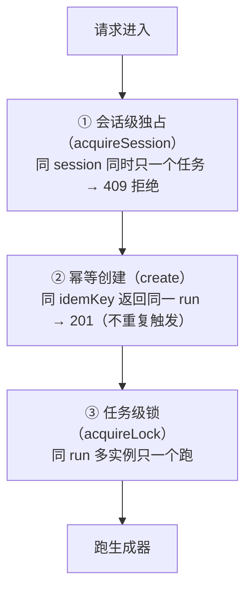

> ① 是**最外层闸门**——挡掉绝大多数并发（"同一个会话狂点发送"）；②③ 是兜底。

### 9.3 验证（两个实例）

```bash
# 终端1：实例1
SERVER_PORT=8080 ./mvnw spring-boot:run

# 终端2：实例2（注意端口不同）
SERVER_PORT=8081 ./mvnw spring-boot:run

# 触发（打到任一实例）
curl -i -X POST "http://localhost:8080/api/runs?sessionId=sess-001&prompt=管数分离" -H "Idempotency-Key: deviceA-001"
# 假设 runId=run_xxx

# 关键验证：从另一个实例订阅！
curl -N "http://localhost:8081/api/runs/run_xxx/stream"
# ✅ 即使生成器跑在实例1，实例2 也能读到完整内容（数据在共享的 Redis 里）

# 取消：从任意实例取消，跑生成器的那个实例会响应，且会话锁被释放
curl -X POST "http://localhost:8081/api/runs/run_xxx/cancel"
# 看实例1 的日志："[bus] 收到取消指令，停止生成" —— 跨实例取消成功
# 取消后 sess-001 恢复空闲，可以发起新任务 ✅
```

**核心收获**：因为第 4 章就把数据搬出进程落 Redis，**多实例下订阅天然可用，几乎不用改订阅逻辑**。新增的是"会话级独占 + 单一写者锁 + 跨实例取消"——三道防线从外到内保证并发安全。

### 9.4 checkpoint

```bash
git add -A && git commit -m "第9章:多实例跨实例广播+Redisson单一写者+Pub/Sub跨实例取消"
```

### 9.5 复盘 + 暴露问题

多实例同步成了。到这里，**管数分离 + 多实例**的单体集群已经很稳。下一个需求驱动 Kafka：

> 生成出来的 chunk 是宝贵数据，**审计/计费/分析三个服务都要消费同一批 chunk**，而且**法规要求保留 30 天**。Redis Stream 是内存型，存 30 天太贵；跨服务各自消费 Redis Streams 也不够标准。

**第 10 章：chunk 总线升级 Kafka**——磁盘持久、消费组、跨服务标准化消费。

---

## 第 10 章：chunk 要跨服务消费、长期保留——升级 Kafka 持久总线

### 10.0 场景

第 9 章后，多实例集群已就绪。新需求来了：

1. **审计、计费、分析三个独立服务都要消费同一批 chunk**（跨服务消费）。Redis Streams 也能多消费者读，但各自为战、没有标准的消费组进度管理。
2. **法规要求 chunk 保留 30 天**。Redis Stream 是内存型，存 30 天成本高得离谱。
3. **chunk 流成了公司级数据资产**，多个团队各自维护消费进度。

这些需求指向同一个答案：**把 chunk 持久总线从 Redis Streams 升级到 Kafka**。

> **Redis 不下岗，是分工**：
> - **Kafka** 接管 chunk 持久总线（磁盘原生、保留 30 天便宜、消费组标准化、跨服务消费）。
> - **Redis** 继续做 Redisson 分布式锁（低延迟）、会话独占标记（低延迟）、断线续传的实时 Pub/Sub 通知（低延迟）。
> - **PG** 管 run 状态/幂等（第 7 章已落库，与 Kafka 无关）。
>
> 这是企业级的常见分工——**不是"用 Kafka 替换 Redis"，而是"各司其职"**。

### 10.1 思路：Redis Streams 多播 → Kafka 消费组

| 维度 | Redis Streams（第 4-9 章） | Kafka（本章） |
|------|---------------------------|--------------|
| 持久 | 内存（AOF/RDB 成本高） | 磁盘原生（保留 30 天成本低） |
| 消费模式 | 多个消费者各自读 | **消费组**（每组进度独立、自动提交） |
| offset/游标 | 手写 seq | **内建 offset**（消费组托管） |
| 跨服务消费 | 能，但各服务自己管进度 | **标准化**（groupId + topic） |
| 分区/保序 | 单 key | **按 key 分区**（同 runId 进同分区，保序） |

**本章设计**：

- 写：生成器每吐一个 chunk → 发到 Kafka topic `gen-chunks`，**key = runId**（保证同一个 run 的所有 chunk 进同一分区，顺序保证）。
- 读（SSE 订阅）：每个实例用一个 Kafka 消费者订阅 topic，**按 key(runId) 分发到本实例的 Sinks.Many**，再扇出给本实例的多个 SSE 连接。
- 断线续传：Kafka 自带消费组 offset——重连时消费组从上次 offset 续读（替代第 5 章手写 seq）。

> **为什么"每个实例一个消费者，N 个 SSE 连接共享"？** 如果每个 SSE 连接都建一个 Kafka 消费者，连接数一多，消费者数会爆炸（Kafka 单分区同时只能被组内一个消费者消费，消费者数 > 分区数会闲置）。正确做法：**一个实例一个消费者，把收到的消息按 key 扇出到内存 Sinks，N 个 SSE 连接共享这个 Sinks**。这是 Kafka + SSE 的标准架构。

**Kafka chunk 总线架构（每实例一个消费者 + 按 key 分发）**：

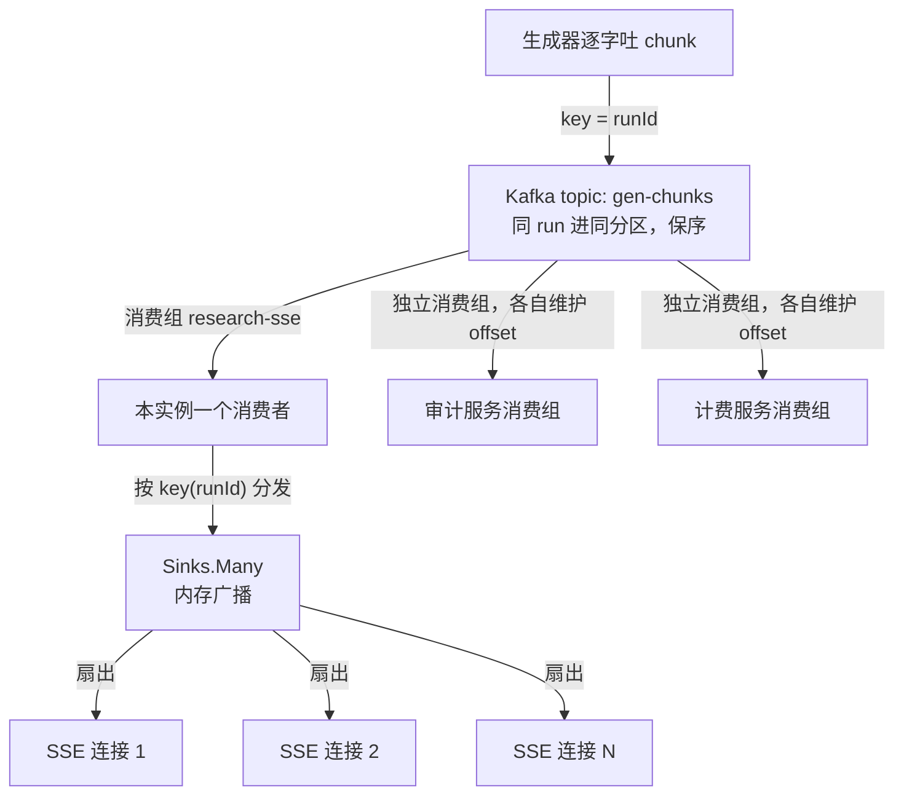

### 10.2 动手

#### 10.2.1 加 Kafka 依赖 + 配置

**【改已有文件，追加】** `pom.xml`：

```xml
<!-- ▼ 第10章新增：Kafka（Spring Boot 官方 starter）
     spring-boot-starter-kafka = spring-kafka 库 + Boot 自动装配（KafkaTemplate / 消费容器 / 配置类）。
     版本由 Spring Boot BOM 管理，无需手写版本号。 -->
<dependency>
    <groupId>org.springframework.kafka</groupId>
    <artifactId>spring-boot-starter-kafka</artifactId>
</dependency>

<!-- ▼ Kafka 测试支持：嵌入式 Kafka broker，单元/集成测试不依赖外部 Kafka。
     scope=test，不打进生产包。企业级标配。 -->
<dependency>
    <groupId>org.springframework.kafka</groupId>
    <artifactId>spring-kafka-test</artifactId>
    <scope>test</scope>
</dependency>
```

> **为什么 `spring-boot-starter-kafka` 就是"Spring Boot 企业版 Kafka"？** 它是 Spring Boot 官方的 Kafka starter（= `spring-kafka` 库 + Boot 自动装配）。引了它之后，Spring Boot 自动装配会：① 根据 `spring.kafka.*` 配置创建 `ProducerFactory`/`ConsumerFactory`；② 自动注册 `KafkaTemplate` Bean（生产端注入即用）；③ 自动注册 `ConcurrentKafkaListenerContainerFactory`（让 `@KafkaListener` 注解开箱即用）；④ 暴露 Kafka 健康指标到 actuator。**不需要手动 `new KafkaTemplate`**——这正是"Spring Boot 形态"的含义。

**【改已有文件，追加】** `application.yaml`：

```yaml
spring:
  kafka:
    bootstrap-servers: ${KAFKA_SERVERS:localhost:9092}
    producer:
      key-serializer: org.apache.kafka.common.serialization.StringSerializer
      value-serializer: org.apache.kafka.common.serialization.StringSerializer
      acks: all                 # ▼ 所有副本确认才算成功（不丢消息，企业级默认）
      retries: 3                # ▼ 发送失败重试次数
      batch-size: 16384         # ▼ 批量发送大小（字节），吞吐与延迟的权衡
      properties:
        enable.idempotence: true # ▼ 幂等生产者：防重复消息（企业级开启）
    consumer:
      group-id: research-sse
      auto-offset-reset: earliest   # ▼ 新消费组从头读（晚加入能看到历史）
      enable-auto-commit: false     # ▼ 关闭自动提交，改用手动/容器托管提交（防丢消息）
      key-deserializer: org.apache.kafka.common.serialization.StringDeserializer
      value-deserializer: org.apache.kafka.common.serialization.StringDeserializer
    listener:
      ack-mode: manual_immediate   # ▼ 每条消息处理完立即确认（配合关闭自动提交，精确控制）
      concurrency: 3               # ▼ 消费容器线程数（≤ 分区数）
```

> **企业级 Kafka 配置的三个关键开关**：
> 1. **`acks: all` + `enable.idempotence: true`**：最强不丢、不重。生产端宁可慢一点也不丢消息。
> 2. **`enable-auto-commit: false` + `ack-mode: manual_immediate`**：关闭自动提交 offset，处理完再确认——**防止"消息没处理完就提交 offset，崩溃后丢消息"**。这是流式系统的基本盘。
> 3. **`concurrency: 3`**：消费容器并发线程数，要 ≤ topic 分区数（否则多余线程闲置，见坑 6）。

#### 10.2.2 KafkaChunkBus：chunk 持久总线

**【新建文件】** `research-stream/src/main/java/com/example/stream/bus/KafkaChunkBus.java`：

```java
package com.example.stream.bus;

import org.apache.kafka.clients.consumer.ConsumerRecord;
import org.slf4j.Logger;
import org.slf4j.LoggerFactory;
import org.springframework.kafka.core.KafkaTemplate;
import org.springframework.stereotype.Component;
import reactor.core.publisher.Flux;
import reactor.core.publisher.Sinks;

import java.util.concurrent.ConcurrentHashMap;

/**
 * 基于 Kafka 的 chunk 持久总线（第 10 章）。
 *
 * 写：produce 到 topic=gen-chunks，key=runId（同 run 进同分区，保序）。
 * 读：本实例一个消费者收所有消息，按 key(runId) 分发到对应 Sinks.Many，
 *     再由多个 SSE 连接共享这个 Sinks。
 *
 * 分工：Kafka 管 chunk 持久总线；PG 管 run 状态/幂等；Redis 管锁/会话独占/实时通知。
 */
@Component
public class KafkaChunkBus {

    private static final Logger log = LoggerFactory.getLogger(KafkaChunkBus.class);
    private static final String TOPIC = "gen-chunks";

    private final KafkaTemplate<String, String> kafka;
    /** runId → 本实例的广播 Sinks（扇出给本实例多个 SSE 连接）。 */
    private final ConcurrentHashMap<String, Sinks.Many<String>> sinks = new ConcurrentHashMap<>();

    public KafkaChunkBus(KafkaTemplate<String, String> kafka) {
        this.kafka = kafka;
    }

    /** 写一条 chunk。key=runId 保证同 run 进同分区、保序。 */
    public void write(String runId, String chunk) {
        kafka.send(TOPIC, runId, chunk);
    }

    /** 订阅 run 流：返回本实例该 run 的 Sinks（多个 SSE 连接共享）。
     *  注意：offset 由 Kafka 消费组托管，本实例消费组会在 earliest 续读历史。 */
    public Flux<String> subscribe(String runId) {
        Sinks.Many<String> sink = sinks.computeIfAbsent(runId,
                k -> Sinks.many().multicast().onBackpressureBuffer());
        return sink.asFlux();
    }

    /** Kafka 消费者回调：按 key(runId) 把消息分发到对应 Sinks。 */
    public void dispatch(ConsumerRecord<String, String> record) {
        Sinks.Many<String> sink = sinks.get(record.key());
        if (sink != null) {
            sink.tryEmitNext(record.value());
        }
    }

    /** 订阅结束清理（SSE 连接全断后调）。 */
    public void unsubscribe(String runId) {
        Sinks.Many<String> sink = sinks.remove(runId);
        if (sink != null) sink.tryEmitComplete();
    }
}
```

> **回顾第 3 章的 Sinks**：这里又用上了 `Sinks.many().multicast().onBackpressureBuffer()`——但这次不是从生成器直接塞，而是从 Kafka 消费者塞。**Sinks 是"把一份数据扇出给多个订阅者"的通用工具**，无论数据来自生成器还是 Kafka。

#### 10.2.3 Kafka 消费容器：一个消费者按 key 分发

**【新建文件】** `research-stream/src/main/java/com/example/stream/config/KafkaConfig.java`：

```java
package com.example.stream.config;

import com.example.stream.bus.KafkaChunkBus;
import org.springframework.context.annotation.Bean;
import org.springframework.context.annotation.Configuration;
import org.springframework.kafka.core.ConsumerFactory;
import org.springframework.kafka.listener.ConcurrentMessageListenerContainer;
import org.springframework.kafka.listener.ContainerProperties;
import org.springframework.kafka.listener.MessageListener;

/**
 * 全局 Kafka 消费容器：一个消费者订阅 topic=gen-chunks，按 key 分发到 KafkaChunkBus。
 * 关键：N 个 SSE 连接共享一个消费者（高效），而非每连接一个消费者（会爆）。
 */
@Configuration
public class KafkaConfig {

    @Bean
    public ConcurrentMessageListenerContainer<String, String> chunkContainer(
            ConsumerFactory<String, String> cf, KafkaChunkBus bus) {
        ContainerProperties props = new ContainerProperties("gen-chunks");
        props.setMessageListener((MessageListener<String, String>) record -> bus.dispatch(record));
        ConcurrentMessageListenerContainer<String, String> container =
                new ConcurrentMessageListenerContainer<>(cf, props);
        container.getContainerProperties().setGroupId("research-sse");
        container.getContainerProperties().setAckMode(ContainerProperties.AckMode.BATCH);   // ▼ 批量确认
        return container;
    }
}
```

> **`ConcurrentMessageListenerContainer` 是什么？** Spring Kafka 提供的消息监听容器——它内部跑一个或多个消费者线程，不断从 topic 拉消息，每条交给 `MessageListener` 回调处理。我们在这里把回调设成 `bus.dispatch(record)`，于是每条 Kafka 消息按 key 分发到对应 Sinks。**这个 Bean 一启动，消费就开始了。**

#### 10.2.4 StreamService：会话级独占 + Kafka chunk 总线

**【改已有文件，完整版覆盖】** `StreamService.java`（触发时 chunk 写 Kafka，订阅走 KafkaChunkBus；锁/状态/会话独占仍走 Redis）：

```java
package com.example.stream.serve;

import com.example.stream.bus.KafkaChunkBus;
import com.example.stream.bus.StreamBus;
import com.example.stream.generator.TextGenerator;
import com.example.stream.run.HistoryStore;
import com.example.stream.run.RunStore;
import org.slf4j.Logger;
import org.slf4j.LoggerFactory;
import org.springframework.ai.chat.messages.Message;
import org.springframework.stereotype.Service;
import reactor.core.Disposable;
import reactor.core.publisher.Flux;
import reactor.core.publisher.Mono;

import java.util.List;
import java.util.concurrent.ConcurrentHashMap;

/**
 * 管数分离 + Kafka 持久总线（第 10 章）。
 *
 * 三道防线（继承第 6-9 章）：
 *   ① 会话级独占 —— 同 session 同时只一个任务
 *   ② 幂等创建   —— 同 key 只创建一个 run
 *   ③ 任务级锁   —— 同 run 多实例只一个跑
 *
 * 触发：会话独占 → 幂等创建 → 抢 Redis 锁 → 读上下文 + 落 user → 生成器 chunk 写 Kafka。
 * 订阅：走 KafkaChunkBus（消费组托管 offset）。
 * 历史：延续第 8 章——上下文按 sessionId 注入，终态把 chunk 拼全文落 gen_message。
 * Redis 仍负责：会话锁、任务锁、run 状态、跨实例取消通知。
 */
@Service
public class StreamService {

    private static final Logger log = LoggerFactory.getLogger(StreamService.class);

    private final TextGenerator generator;
    private final StreamBus bus;          // Redis：会话锁 + 任务锁 + 跨实例取消
    private final KafkaChunkBus chunkBus; // Kafka：chunk 持久总线
    private final RunStore runs;
    private final HistoryStore history;   // ▼ 第8章：会话历史
    /** runId → sessionId（用于终态释放会话锁 + 落历史）。 */
    private final ConcurrentHashMap<String, String> runSession = new ConcurrentHashMap<>();
    /** runId → chunk 缓冲（终态拼全文落历史）。 */
    private final ConcurrentHashMap<String, StringBuilder> buffers = new ConcurrentHashMap<>();

    public StreamService(TextGenerator generator, StreamBus bus,
                         KafkaChunkBus chunkBus, RunStore runs, HistoryStore history) {
        this.generator = generator;
        this.bus = bus;
        this.chunkBus = chunkBus;
        this.runs = runs;
        this.history = history;
    }

    /** ▼ 管理面：① 会话独占 → ② 幂等创建 → ③ 抢任务锁 → 抢到才读上下文/落 user/跑生成。 */
    public Mono<String> trigger(String prompt, String sessionId, String idempotencyKey) {
        return runs.create(idempotencyKey, sessionId)
                .flatMap(runId -> runs.acquireSession(sessionId)
                        .flatMap(acquired -> {
                            if (Boolean.FALSE.equals(acquired)) {
                                runs.setStatus(runId, "CANCELLED").subscribe();
                                return Mono.<String>error(new IllegalStateException(
                                        "当前会话有任务正在生成，请等待完成后再提问"));
                            }
                            runSession.put(runId, sessionId);
                            return runs.setStatus(runId, "RUNNING")
                                    .then(bus.acquireLock(runId))
                                    .flatMap(taskLocked -> {
                                        if (Boolean.TRUE.equals(taskLocked)) {
                                            // ▼ 读该会话最近 N 轮 → 落 user → 带上下文生成
                                            return history.loadContext(sessionId)
                                                    .flatMap(context -> history.writeUserMessage(sessionId, runId, prompt)
                                                            .then(Mono.fromRunnable(() -> startGeneration(runId, prompt, context)))
                                                            .thenReturn(runId));
                                        }
                                        return Mono.just(runId);
                                    });
                        }));
    }

    private void startGeneration(String runId, String prompt, List<Message> context) {
        StringBuilder buf = new StringBuilder();
        buffers.put(runId, buf);
        Disposable handle = generator.generate(prompt, context)   // ▼ 带历史上下文（第8章）
                .doOnNext(chunk -> { buf.append(chunk); chunkBus.write(runId, chunk); })  // ▼ 缓冲 + 写 Kafka
                .doOnComplete(() -> finishRun(runId, "DONE"))
                .doOnError(err -> finishRun(runId, "FAILED"))
                .subscribe();
        bus.registerLocalRun(runId, handle);
    }

    /** ▼ 终态统一：写结束标记、改状态、落 assistant 全文、释放任务锁、释放会话锁。 */
    private void finishRun(String runId, String status) {
        chunkBus.write(runId, "__END__");
        runs.setStatus(runId, status).subscribe();
        saveAssistantMessage(runId);          // ▼ 第8章：拼缓冲 → 落 assistant 历史
        bus.releaseLock(runId).subscribe();
        releaseSessionFor(runId);
        log.info("[run] 终态 runId={} status={}", runId, status);
    }

    /** ▼ 把缓冲的 chunk 拼成完整回答写进历史。 */
    private void saveAssistantMessage(String runId) {
        StringBuilder buf = buffers.remove(runId);
        String sessionId = runSession.get(runId);
        if (buf != null && sessionId != null && !buf.isEmpty()) {
            history.writeAssistantMessage(sessionId, runId, buf.toString()).subscribe();
        }
    }

    private void releaseSessionFor(String runId) {
        String sessionId = runSession.remove(runId);
        if (sessionId != null) {
            runs.releaseSession(sessionId).subscribe();
        }
    }

    /** ▼ 数据面：走 Kafka 消费组（offset 托管，earliest 可读历史）。 */
    public Flux<String> subscribe(String runId) {
        return chunkBus.subscribe(runId)
                .takeUntil(s -> s.equals("__END__"))
                .filter(s -> !s.equals("__END__"));
    }

    public Mono<String> status(String runId) {
        return runs.get(runId);
    }

    /** ▼ 管理面：取消（走 Pub/Sub，跨实例），落半截回答 + 释放会话锁。 */
    public Mono<Void> cancel(String runId) {
        saveAssistantMessage(runId);          // ▼ 第8章：取消也把已生成的部分存下来
        releaseSessionFor(runId);          // ▼ 释放会话锁
        return runs.setStatus(runId, "CANCELLED").then(bus.cancel(runId));
    }
}
```

> **关键改动（第 10 章恢复会话级独占）**：
> - `trigger` 恢复 `sessionId` 参数，三道防线从外到内（会话独占 → 幂等 → 任务锁）——与第 9 章一致。
> - **历史能力延续第 8 章**：触发仍读该会话上下文注入（上下文跟着 sessionId 走，与总线换不换无关）；`finishRun` 把 chunk 拼成全文落 `gen_message`。
> - `finishRun` 终态统一处理：写结束标记 + 改状态 + 落 assistant + 释放任务锁 + **释放会话锁**。Kafka 下结束标记写进 topic 而非 Redis Pub/Sub。
> - `cancel` 也释放会话锁——CANCELLED 是终态。
> - **Kafka 下 SSE 续传说明**：Kafka 消费组 offset 托管，不需要手写 seq（第 5 章的 seq 在 Kafka 下被 offset 取代）。但 `Last-Event-ID` 在 Kafka 下不再自动生效——回放靠 `auto-offset-reset: earliest` + 消费组续读。

#### 10.2.5 Controller 订阅改调 KafkaChunkBus

**【改已有文件，stream 方法】** `RunController.java` 的 `stream` 简化（不再解析 seq）：

```java
@GetMapping(value = "/{runId}/stream", produces = MediaType.TEXT_EVENT_STREAM_VALUE)
public Flux<ServerSentEvent<String>> stream(@PathVariable String runId) {
    Flux<ServerSentEvent<String>> data = streamService.subscribe(runId)
            .map(chunk -> ServerSentEvent.<String>builder().event("token").data(chunk).build())
            .concatWithValues(ServerSentEvent.<String>builder().event("done").data("").build());
    Flux<ServerSentEvent<String>> heartbeat = Flux.interval(Duration.ofSeconds(1))
            .map(i -> ServerSentEvent.<String>builder().comment("ping").build());
    return data.mergeWith(heartbeat).takeUntilOther(data.then());
}
```

（去掉 `Last-Event-ID` 头解析——Kafka 下续读由消费组托管。）

### 10.3 验证（Kafka 跨服务消费）

```bash
# 起 Kafka（KRaft 单节点，无需 ZooKeeper）
docker run -d --name kafka -p 9092:9092 \
  -e KAFKA_NODE_ID=1 -e KAFKA_PROCESS_ROLES=broker,controller \
  -e KAFKA_LISTENERS=PLAINTEXT://:9092 -e KAFKA_ADVERTISED_LISTENERS=PLAINTEXT://localhost:9092 \
  -e KAFKA_CONTROLLER_QUORUM_VOTERS=1@localhost:9092 -e KAFKA_INTER_BROKER_LISTENER_NAME=PLAINTEXT \
  confluentinc/cp-kafka:latest

./mvnw spring-boot:run

# 触发 + 订阅
curl -i -X POST "http://localhost:8080/api/runs?sessionId=sess-001&prompt=Kafka测试" -H "Idempotency-Key: k-1"
curl -N "http://localhost:8080/api/runs/<runId>/stream"

# ▼ 会话独占验证：Kafka 下会话锁仍然生效，同 session 未完成时再发 → 409
curl -i -X POST "http://localhost:8080/api/runs?sessionId=sess-001&prompt=第二个问题" -H "Idempotency-Key: k-2"
# HTTP/1.1 409 Conflict  ← 无论 chunk 走 Redis 还是 Kafka，会话锁都在 Redis 里，始终生效 ✅

# 关键：跨服务消费！模拟审计服务用另一个消费组读同一批 chunk
docker exec kafka kafka-console-consumer --bootstrap-server localhost:9092 \
  --topic gen-chunks --group audit-service --from-beginning
# ✅ 审计组能看到完整的 chunk 历史（Kafka 保留 + 消费组各自进度）

# 看 chunk 在 Kafka 里保留（磁盘）
docker exec kafka kafka-console-consumer --bootstrap-server localhost:9092 \
  --topic gen-chunks --from-beginning --max-messages 5
```

**核心收获**：Kafka 让 chunk 变成**可被多服务、标准化、长期保留**的数据资产。审计/计费/分析各起一个消费组，互不干扰，各自维护进度。

### 10.4 checkpoint

```bash
git add -A && git commit -m "第10章:chunk总线升级Kafka+消费组跨服务消费"
```

### 10.5 复盘 + 暴露问题

chunk 总线升级完成。系统现在有 **PG（run 状态/幂等）+ Redis（锁/会话独占/取消通知）+ Kafka（chunk 总线）** 三套存储各司其职，很稳。但架构上仍是**一个进程干所有事**。下一个痛点：

> 触发接口是**轻量 IO**（收请求、写 Kafka、写 PG），而生成器是**CPU/长连接密集**（跑生成、维持大量 SSE 长连接）。两者资源画像冲突——SSE 长连接把进程的事件循环占满，连触发请求都进不来。

**第 11 章：拆订阅服务**——把"维持 SSE 长连接"和"触发/生成"分开部署。

---

## 第 11 章：触发与生成资源画像冲突——拆订阅服务

### 11.0 场景

第 10 章后，系统一个进程包揽所有事：收触发请求、跑生成器、维持 SSE 长连接。上量后暴露资源冲突：

> 生成器是 **CPU 密集**（占计算），SSE 订阅是**长连接密集**（占连接数、占事件循环）。两者挤在一个进程——某次流量高峰，大量 SSE 长连接把 WebFlux 事件循环占满，**连触发请求都处理不了**。生成和订阅互相拖累。

而且从**职责**看：管数分离已经把"触发（管理面）"和"订阅（数据面）"在接口上拆开了，但**物理上还是同一个进程**。下一步自然是**物理拆分**——让它们各自独立扩展。

### 11.1 思路：按资源画像拆服务

| 服务 | 职责 | 资源画像 | 独立扩展理由 |
|------|------|---------|------------|
| **trigger-service**（触发服务） | 收 POST、跑生成器、写 Kafka | CPU 密集 | 按"生成并发量"扩 |
| **stream-service**（订阅服务） | 维持 SSE 长连接、从 Kafka 读 chunk 推给前端 | 连接/IO 密集 | 按"在线连接数"扩 |

拆开后：生成高峰扩 trigger-service，连接高峰扩 stream-service，互不干扰。

> **怎么拆（学习阶段的最简方式）**：不需要立刻上完整微服务体系。**用同一个代码库 + Spring Profile**——同一个应用，根据激活的 profile 决定暴露哪些 Controller。本地两个不同端口、不同 profile 起两个进程，就模拟出两个服务。这比一上来搞多 module + Eureka + Gateway 对初学者友好得多。**第 12 章再加网关收口。**

**通信方式**：两个服务**不直接调用**，而是通过 **Kafka（chunk 总线）+ Redis（锁/会话独占）+ PG（状态/幂等）** 间接通信。trigger-service 写 Kafka/PG，stream-service 从 Kafka 读——天然解耦。这正是第 4 章"把数据搬出进程"的又一次回报。

**服务拆分架构（同代码库 + Profile）**：

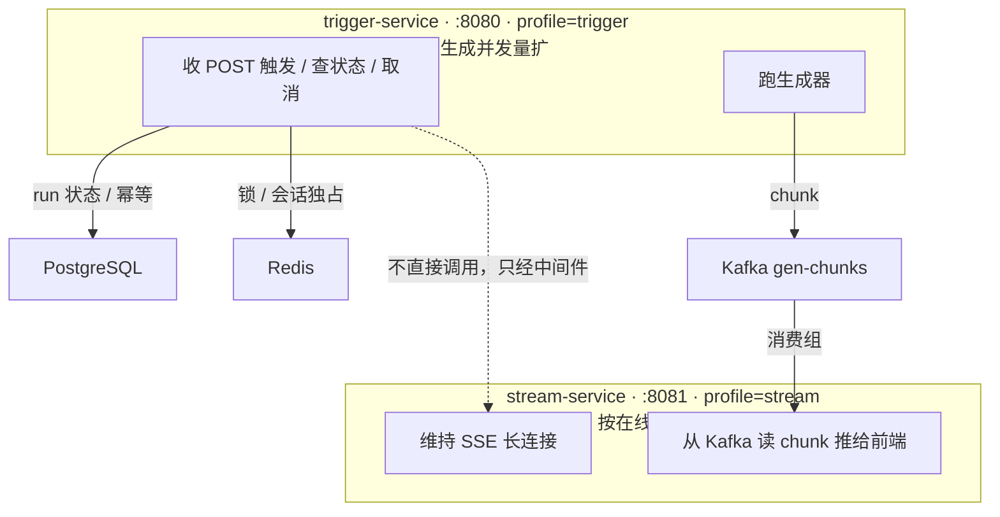

### 11.2 动手（同代码库 + Profile 拆分）

#### 11.2.1 配置两个 Profile

**【改已有文件】** `application.yaml`（加 profile 分组）：

```yaml
spring:
  profiles:
    active: ${PROFILE:all}   # 默认 all（单进程跑全部，向后兼容前面章节）
```

#### 11.2.2 Controller 加 profile 条件

**【改已有文件，加注解】** `RunController.java`：把"触发类接口"和"订阅接口"分别限定 profile。

```java
// 触发/状态/取消：只在 trigger（或 all）激活
@PostMapping
@org.springframework.context.annotation.Profile({"trigger", "all"})
public Mono<ResponseEntity<String>> create(...) { ... }

@GetMapping("/{runId}")
@org.springframework.context.annotation.Profile({"trigger", "all"})
public Mono<ResponseEntity<String>> status(...) { ... }

@PostMapping("/{runId}/cancel")
@org.springframework.context.annotation.Profile({"trigger", "all"})
public Mono<Void> cancel(...) { ... }

// SSE 订阅：只在 stream（或 all）激活
@GetMapping(value = "/{runId}/stream", produces = MediaType.TEXT_EVENT_STREAM_VALUE)
@org.springframework.context.annotation.Profile({"stream", "all"})
public Flux<ServerSentEvent<String>> stream(...) { ... }
```

> **`@Profile` 的作用**：Spring 启动时，只有激活的 profile 匹配时，这个方法/Bean 才生效。`Profile({"trigger","all"})` 表示激活 `trigger` 或 `all` 时生效。这样同一个 Controller，在 trigger 实例上只暴露管理面接口，在 stream 实例上只暴露订阅接口。**更干净的做法是拆成两个 Controller 类**（`TriggerController` + `StreamController`），这里为改动最小用方法级 `@Profile`，留作练习。
>
> **第 8 章的 `SessionController` 同理**：新建会话/会话列表/消息列表都是管理面（读 PG 历史），给这个 Controller 也加类级 `@org.springframework.context.annotation.Profile({"trigger", "all"})`，让它只在 trigger-service 暴露。stream-service 只管 SSE 订阅，不需要历史接口。

#### 11.2.3 运行两个服务

```bash
# 终端1：触发服务（端口 8080，profile=trigger）
PROFILE=trigger SERVER_PORT=8080 ./mvnw spring-boot:run

# 终端2：订阅服务（端口 8081，profile=stream）
PROFILE=stream SERVER_PORT=8081 ./mvnw spring-boot:run
```

### 11.3 验证（服务拆分）

```bash
# 触发请求打到 trigger-service（8080）
curl -i -X POST "http://localhost:8080/api/runs?sessionId=sess-001&prompt=拆服务测试" -H "Idempotency-Key: split-1"
# runId=run_xxx

# 订阅请求打到 stream-service（8081）——不同端口、不同进程！
curl -N "http://localhost:8081/api/runs/run_xxx/stream"
# ✅ stream-service 从 Kafka 读 chunk，推给前端——完全不需要知道 trigger-service 在哪
```

**核心收获**：两个服务**物理隔离**，只通过 Kafka/Redis 通信。trigger-service 挂了，已生成的 chunk 仍可被 stream-service 读出（Kafka 持久）；stream-service 挂了，不影响 trigger-service 继续生成。

### 11.4 checkpoint

```bash
git add -A && git commit -m "第11章:按Profile拆触发服务/订阅服务"
```

### 11.5 复盘 + 暴露问题

服务拆开了，但现在前端要记两个端口（触发打 8080、订阅打 8081）。多几个服务前端就要记几个端口——不现实。

**第 12 章：API 网关**——统一入口，前端只认一个地址。

---

## 第 12 章：前端记一堆端口——API 网关统一入口

### 12.0 场景

第 11 章后有两个服务、两个端口。前端代码写死 `POST localhost:8080`、`GET localhost:8081`。问题：

1. **前端记一堆端口**——服务一多就乱。
2. **扩容/迁移要改前端**——后端换地址，前端跟着改。
3. **没有统一入口做鉴权/限流/监控**。

企业级标准答案：**API 网关**。所有请求先到网关，网关按路径路由到后端服务。前端永远只认网关地址。

### 12.1 思路：Spring Cloud Gateway

**Spring Cloud Gateway** 是 Spring 生态的响应式网关。它做三件事：

1. **路由**：按路径把请求转发到后端服务（如 `/api/runs/*/stream` → stream-service，其余 → trigger-service）。
2. **服务发现**：配合 Eureka，后端服务自动注册，网关动态发现，扩容无需改配置。
3. **横切关注点**：鉴权、限流、日志、监控都在网关统一做。

> **SSE 长连接经过网关的坑**：网关默认可能缓冲响应或断开长连接。Spring Cloud Gateway 是响应式的（基于 WebFlux），**原生支持流式透传**——这是我们选它而非阻塞式网关的原因。学习阶段先做**固定路由版**，Eureka 服务发现作为进阶方向标注，不在这章强加。

### 12.2 动手（最小版：固定路由，先不引 Eureka）

#### 12.2.1 新建网关项目

```
gateway/
└── pom.xml
```

**【新建文件】** `gateway/pom.xml`：

```xml
<?xml version="1.0" encoding="UTF-8"?>
<project xmlns="http://maven.apache.org/POM/4.0.0"
         xmlns:xsi="http://www.w3.org/2001/XMLSchema-instance"
         xsi:schemaLocation="http://maven.apache.org/POM/4.0.0
         https://maven.apache.org/xsd/maven-4.0.0.xsd">
    <modelVersion>4.0.0</modelVersion>

    <parent>
        <groupId>org.springframework.boot</groupId>
        <artifactId>spring-boot-starter-parent</artifactId>
        <version>4.0.6</version>
        <relativePath/>
    </parent>

    <groupId>com.example</groupId>
    <artifactId>gateway</artifactId>
    <version>0.0.1-SNAPSHOT</version>

    <properties>
        <java.version>21</java.version>
        <spring-cloud.version>2025.1.2</spring-cloud.version>
    </properties>

    <dependencyManagement>
        <dependencies>
            <dependency>
                <groupId>org.springframework.cloud</groupId>
                <artifactId>spring-cloud-dependencies</artifactId>
                <version>${spring-cloud.version}</version>
                <type>pom</type>
                <scope>import</scope>
            </dependency>
        </dependencies>
    </dependencyManagement>

    <dependencies>
        <dependency>
            <groupId>org.springframework.cloud</groupId>
            <artifactId>spring-cloud-starter-gateway-server-webflux</artifactId>
        </dependency>
    </dependencies>

    <build>
        <plugins>
            <plugin>
                <groupId>org.springframework.boot</groupId>
                <artifactId>spring-boot-maven-plugin</artifactId>
            </plugin>
        </plugins>
    </build>
</project>
```

> **Spring Cloud 版本（重要，已按官方矩阵修正）**：Spring Boot 4.x 配 **Spring Cloud 2025.1.x（Oakwood）**，本文用 `2025.1.2`（支持 Boot 4.0/4.1，4.1.x 支持从 2025.1.2 起）。注意 **2025.0.x（Northfields）是给 Boot 3.5 的**，不能用在 Boot 4。以你实际 Spring Boot 版本的[官方兼容矩阵](https://spring.io/projects/spring-cloud)为准。

**【新建文件】** `gateway/src/main/java/com/example/gateway/GatewayApplication.java`：

```java
package com.example.gateway;

import org.springframework.boot.SpringApplication;
import org.springframework.boot.autoconfigure.SpringBootApplication;

@SpringBootApplication
public class GatewayApplication {
    public static void main(String[] args) {
        SpringApplication.run(GatewayApplication.class, args);
    }
}
```

#### 12.2.2 网关路由配置

**【新建文件】** `gateway/src/main/resources/application.yaml`：

```yaml
server:
  port: 8000   # ▼ 网关端口：前端只认这个

spring:
  cloud:
    gateway:
      server:
        webflux:
          routes:
            # SSE 订阅流 → stream-service（先匹配 stream，它更具体）
            - id: stream-route
              uri: http://localhost:8081
              predicates:
                - Path=/api/runs/*/stream
            # 其余（触发/状态/取消）→ trigger-service
            - id: trigger-route
              uri: http://localhost:8080
              predicates:
                - Path=/api/runs/**
```

> **路由匹配顺序**：Gateway 按配置顺序匹配。`/api/runs/*/stream` 更具体，放前面；`/api/runs/**` 兜底放后面。**Spring Cloud Gateway 默认支持 SSE 流式透传**——长连接不会被缓冲截断，无需额外配置。

### 12.3 验证（统一入口）

```bash
# 起三个进程：trigger(8080)、stream(8081)、gateway(8000)
PROFILE=trigger SERVER_PORT=8080 ./mvnw -f research-stream/pom.xml spring-boot:run
PROFILE=stream  SERVER_PORT=8081 ./mvnw -f research-stream/pom.xml spring-boot:run
./mvnw -f gateway/pom.xml spring-boot:run

# 前端只打网关（8000）！
curl -i -X POST "http://localhost:8000/api/runs?sessionId=sess-001&prompt=网关测试" -H "Idempotency-Key: gw-1"
# runId=run_xxx

curl -N "http://localhost:8000/api/runs/run_xxx/stream"
# ✅ 网关把 stream 路由到 8081，触发路由到 8080，前端无感知
```

**核心收获**：前端只认 `localhost:8000` 一个地址。后端 trigger/stream 怎么扩容、怎么迁移，前端代码一行不改——**网关屏蔽了后端的物理拓扑**。

### 12.4 checkpoint

```bash
git add -A && git commit -m "第12章:Spring Cloud Gateway统一入口"
```

### 12.5 复盘 + 后续进阶方向

到这里，你已经从"一个 `Flux<String>` 接口"演进到了**网关 + 触发服务 + 订阅服务 + Redis（锁/会话独占/通知）+ Kafka（chunk 总线）**的完整分布式管数分离系统。

**进阶方向（不在本文范围，列出供你继续）**：

1. **服务发现（Eureka）**：把固定路由换成动态发现，trigger/stream 自动注册，网关自动路由。扩容真正零配置。
2. **网关鉴权/限流**：JWT 认证、租户隔离、按租户限流——横切关注点收口到网关。
3. **Kafka 精确续传**：把消费组 offset 暴露给前端，实现 Kafka 方案下的"从某条精确续读"（弥补第 10 章的取舍）。
4. **fencing token**：在 Redisson 锁之上叠加单调递增 token，消除"GC 停顿导致看门狗冻结、旧持有者恢复后继续写"的窗口（第 9 章遗留的严格性问题）。
5. **可观测性**：OpenTelemetry 链路追踪、指标、告警——分布式系统出问题时能定位到哪个服务。

---

## 全文演进总览与后续方向

### 你走过的路（一张图）

**演进路线（Mermaid 版）**：


### 每章引入的核心概念回顾

| 章 | 引入的概念 | 解决的痛点 |
|---|-----------|-----------|
| 0 | WebFlux + Flux | 流式的基础 |
| 1 | SSE（text/event-stream） | 逐字推送、不等 30 秒 |
| 2 | 管理面/数据面分离 | 一个接口干三件事 |
| 3 | Sinks.Many（热流广播） | 冷流导致重复触发 |
| 4 | Redis Stream + Pub/Sub | 内存丢失、断线丢内容 |
| 5 | seq 游标 + Last-Event-ID | 重连重复/漏 chunk |
| 6 | run 资源 + 幂等键（单端重试）+ 会话级独占（Redisson 会话锁） | 同会话并发触发、重试重复提交、状态黑盒 |
| 7 | PostgreSQL + MyBatis-Flex | run 状态存 Redis 重启全清、查不动、幂等无原子保证 |
| 8 | 会话历史 + 多轮上下文 + 会话管理 | 对话内容没落库、LLM 每轮失忆、无历史列表/切换 |
| 9 | Redisson 任务级单一写者锁 + 跨实例取消 | 多实例重复触发、压测并发打挂服务、取消跨不了实例 |
| 10 | Kafka 消费组 | 跨服务消费、长期保留 |
| 11 | Profile 拆服务 | 资源画像冲突 |
| 12 | API 网关 | 前端记一堆端口 |

### 这套设计的几个关键判断（值得记住）

1. **先逻辑后物理**：管数分离先在单进程内把接口拆开（第 2 章），物理拆服务是第 11 章的事。顺序不能反。
2. **数据搬出进程，越早越好**：第 4 章就把 chunk 落 Redis，这让后面的多实例（第 9 章）、拆服务（第 11 章）几乎"免费"获得跨实例能力。
3. **结构化数据进关系库，流式数据进流总线**：run 状态/幂等这种结构化数据落 PG（第 7 章），chunk 这种流式数据落 Kafka（第 10 章），临时并发标记留 Redis KV——各按数据形态选家，不混用。
4. **并发闸门要分层**：会话级独占（最外层）→ 幂等键 → 任务锁（最内层）。三道防线各管一层，不能互相替代。"同一个 session 在输出时不允许再次调用"是生产级系统的基本功——没有这道闸门，压测一轮就能把服务打挂。
5. **不是替换，是分工**：PG 管结构化状态 + 会话历史，Redis 管锁/会话独占/低延迟通知，Kafka 管持久总线/跨服务消费。各司其职。
6. **诚实标注局限**：Redisson 锁仍有 GC 停顿导致的陈旧写入窗口（第 9 章）、Kafka 下 Last-Event-ID 失效（第 10 章）、`readAfter` 读全量（第 5 章）——都明确写出，并在合适的地方给出进阶方向。**生产级工程师知道每个方案的代价，而不是假装完美。**

### 学完之后

你现在的代码库 `research-stream` + `gateway` 是一个**完整的、可复现的、企业级分布式管数分离系统**。把 `TextGenerator` 换成真 LLM（返回 `Flux<String>`），**业务代码一行不用改**——这就是管数分离 + 持久总线架构的价值：**它和具体的"生成器"解耦**。

如果想要更全的企业级演进（Agent 循环、RAG、审计、多租户、可观测性），回到 [34-轻依赖版](./34-轻依赖版-Agent与知识库实战.md)——它的架构演进章节，你现在看会很轻松。

---

## 附录：项目结构与踩坑手册

### A.1 最终项目结构

```
research-stream/                    # 主应用（trigger/stream 双 profile）
├── pom.xml
└── src/main/
    ├── java/com/example/stream/
    │   ├── StreamApplication.java
    │   ├── config/
    │   │   ├── RedisConfig.java           # ReactiveRedisTemplate（无共享监听容器 Bean）
    │   │   └── KafkaConfig.java           # Kafka 消费容器（按 key 分发 chunk）
    │   ├── generator/
    │   │   └── TextGenerator.java         # 数据源（换真 LLM 只改这里）
    │   ├── bus/
    │   │   ├── StreamBus.java             # Redis：Redisson 锁 + Pub/Sub 跨实例取消
    │   │   └── KafkaChunkBus.java         # Kafka：chunk 持久总线
    │   ├── serve/
    │   │   └── StreamService.java         # 编排：触发/订阅/状态/取消/历史落库
    │   └── run/
    │       ├── RunEntity.java             # ▼ MyBatis-Flex 实体（gen_run 表）
    │       ├── RunMapper.java             # ▼ MyBatis-Flex Mapper
    │       ├── RunStore.java              # run 状态/幂等（PG）+ 会话独占（Redis）
    │       ├── SessionEntity.java         # ▼ 会话实体（gen_session 表）
    │       ├── MessageEntity.java         # ▼ 对话消息实体（gen_message 表）
    │       ├── SessionMapper.java         # ▼ 会话 Mapper
    │       ├── MessageMapper.java         # ▼ 消息 Mapper
    │       ├── HistoryStore.java          # 会话历史读写 + 上下文装载 + 会话管理
    │       ├── SessionController.java     # 会话管理 REST（新建/列表/消息）
    │       └── RunController.java         # 企业级 REST
    └── resources/
        ├── application.yaml
        ├── static/index.html              # ▼ 前端演示：新会话按钮 + 历史列表 + 切换
        └── schema.sql                     # ▼ PG 建表（gen_run / gen_idempotency / gen_session / gen_message）

gateway/                            # API 网关
└── src/main/
    ├── java/com/example/gateway/GatewayApplication.java
    └── resources/application.yaml

docker/
└── pg/docker-compose.yaml                 # ▼ PostgreSQL（第 7 章）
```

### A.2 常见踩坑

#### 坑 1：SSE 不流式，一次性吐完

**现象**：`curl` 看到等很久后一次性输出全部内容，不是逐字。
**原因**：`produces` 不是 `text/event-stream`，或 curl 没加 `-N`（缓冲）。
**解决**：Controller 必须 `produces = MediaType.TEXT_EVENT_STREAM_VALUE`；curl 加 `-N`。

#### 坑 2：响应式栈用了阻塞 Redis 客户端

**现象**：高并发下服务卡死、事件循环被榨干。
**原因**：引了 `spring-boot-starter-data-redis`（阻塞版）而非 `data-redis-reactive`。
**解决**：WebFlux 栈必须用 `data-redis-reactive`。这是铁律。

#### 坑 3：`subscribe()` 忘了调，生成器根本不启动

**现象**：触发后没有任何输出，日志也没有"完成"。
**原因**：Reactor 的 `Flux` 是声明式的，**只有 `.subscribe()` 才真正执行**。光 `.doOnNext(...).flatMap(...)` 不调 subscribe，啥也不发生。
**解决**：链式最后一定要 `.subscribe()`（fire-and-forget 场景）或由调用方订阅。

#### 坑 4：Sinks 晚加入错过前文

**现象**：第二个标签页晚几秒打开，看不到前面已吐的字。
**原因**：`Sinks.many().multicast()` 是热流，不缓存订阅前的数据。
**解决**：这正是第 4-5 章引入 Redis Stream + seq 回放的原因——持久 + 游标补推。

#### 坑 5：网关后 SSE 长连接被截断

**现象**：经过 Gateway 后，SSE 流式变成块状或断开。
**原因**：网关/代理缓冲响应，或空闲超时。
**解决**：Spring Cloud Gateway 响应式原生支持 SSE 透传；若前面还有 nginx，设 `proxy_buffering off` + `proxy_read_timeout` 加大；应用层加心跳（第 5 章）防空闲断开。

#### 坑 6：Kafka 消费者数 > 分区数导致闲置

**现象**：扩了很多 stream-service 实例，但部分实例收不到消息。
**原因**：Kafka 一个分区同时只能被消费组内一个消费者消费。消费者数 > 分区数时，多的消费者闲置。
**解决**：topic 分区数 ≥ 消费者数。生产按预期并发量规划分区数（如 `gen-chunks` 建时指定 6/12 分区）。

#### 坑 7：Redisson 锁在 GC 停顿后陈旧写入

**现象**：极端情况下（JVM 长 GC / 进程冻结）两个实例同时写同一 run（结果分叉）。
**原因**：Redisson 看门狗虽然能续期，但**GC 停顿期间看门狗线程也被冻结无法续期**，锁过期被别人抢走；旧持有者 GC 恢复后不知道锁已丢，继续写。这是 Redis 分布式锁的固有理论缺陷（Martin Kleppmann 的批评）。
**解决**：严格场景上 fencing token（锁带单调递增 token，存储层拒绝旧 token 写）。本文作为进阶扩展点，详见 [Redis 分布式锁实战](../../附录/Redis专题/02-Redis分布式锁实战.md)。

#### 坑 8：`switchIfEmpty` 立即求值导致误创建

**现象**：查幂等映射时，明明已有值，却还是创建了新 run。
**原因**：`switchIfEmpty(newRun())` 中 `newRun()` **立即执行**（方法调用先于 switchIfEmpty 判断）。
**解决**：用 `switchIfEmpty(Mono.defer(() -> newRun()))` 延迟到真正需要时。见第 6 章 `RunStore`。

#### 坑 9：切换会话后，LLM 还"记得"上一个会话（上下文泄漏）

**现象**：用户切到历史会话 B 提问，模型的回答却带着会话 A 的上下文。
**原因**：上下文注入没有跟着 sessionId 走——比如把上下文缓存成了"最后一次会话"，或把 `loadContext(sessionId)` 的 sessionId 传错成固定值。**上下文是"当前会话"的属性，不是全局状态。**
**解决**：每次触发都用**请求里的 sessionId** 重新 `loadContext(sessionId)`（第 8 章 `HistoryStore.loadContext`）。验证方法：新开会话问同一个问题，模型必须答"你没告诉过我"——见第 8 章 8.3 验证第 7 步。

### A.3 外部依赖一键起

```bash
# PostgreSQL（第 7 章）
docker run -d --name pg -p 5432:5432 \
  -e POSTGRES_PASSWORD=postgres -e POSTGRES_DB=research_stream postgres:16

# Kafka KRaft 单节点（第 10 章）
docker run -d --name kafka -p 9092:9092 \
  -e KAFKA_NODE_ID=1 -e KAFKA_PROCESS_ROLES=broker,controller \
  -e KAFKA_LISTENERS=PLAINTEXT://:9092 -e KAFKA_ADVERTISED_LISTENERS=PLAINTEXT://localhost:9092 \
  -e KAFKA_CONTROLLER_QUORUM_VOTERS=1@localhost:9092 -e KAFKA_INTER_BROKER_LISTENER_NAME=PLAINTEXT \
  confluentinc/cp-kafka:latest
```

### A.4 配套学习资料（按需深入）

本文聚焦"管数分离"主线，用到但没展开的底层知识，都在 `docs/附录/` 下有独立专题。**遇到看不懂的概念，或想深入某个点，按下表找对应附录。**

| 你想深入的点 | 对应附录 | 对应本文章节 |
|------------|---------|------------|
| 这套系统里所有的 ID（sessionId/runId/幂等键/seq/offset…谁生成、何时用、存哪） | [管数分离 ID 体系全解析](../../附录/管数分离专题/01-管数分离ID体系全解析.md) | 全文 |
| `Flux`/`Mono` 的各种操作符（map/flatMap/concatWith...） | [Flux 方法速查](../../附录/Reactor响应式编程/02-Flux方法速查.md) | 全文 |
| `Sinks.Many` 是什么、怎么用 | [Reactor Sinks 入门](../../附录/Reactor响应式编程/03-Reactor-Sinks入门.md) | 第 3、11 章 |
| "消费太慢怎么办"——背压（Backpressure） | [Reactor 背压详解](../../附录/Reactor响应式编程/04-Reactor背压详解.md) | 第 3 章 `onBackpressureBuffer` |
| 到底在哪个线程跑——subscribeOn/publishOn、阻塞隔离 | [Reactor 调度器与线程模型](../../附录/Reactor响应式编程/06-Reactor调度器与线程模型.md) | 第 8 章 `boundedElastic` 隔离 |
| 流式错误怎么处理——onErrorResume/retry/doOnError | [Reactor 错误处理详解](../../附录/Reactor响应式编程/07-Reactor错误处理详解.md) | 第 2-6 章 流式错误 |
| Redis 基础数据结构 + Spring Boot 响应式收发 | [Redis 基础 + Spring Boot 使用](../../附录/Redis专题/00-Redis基础与SpringBoot使用.md) | 第 4 章 |
| Redis Stream（XADD/XRANGE/消费组）与 Pub/Sub | [Redis Streams 与 Pub/Sub 实战](../../附录/Redis专题/01-Redis-Streams与PubSub实战.md) | 第 4、9 章 |
| 缓存怎么用对——Cache-Aside、穿透/击穿/雪崩 | [Redis 缓存实战](../../附录/Redis专题/03-Redis缓存实战.md) | 第 6 章 run 状态缓存 |
| PostgreSQL + MyBatis-Flex（ORM/事务/连接池） | [数据库事务与 @Transactional 详解](../../附录/协议与数据库/02-数据库事务与Transactional详解.md) | 第 7、8 章持久化 |
| 分布式锁（SETNX/Lua/Redisson/fencing token） | [Redis 分布式锁实战](../../附录/Redis专题/02-Redis分布式锁实战.md) | 第 6 章会话锁 / 第 9 章单一写者 |
| Kafka 消息队列（topic/分区/offset/消费组）与 Spring Boot 实战 | [Kafka 消息队列从入门到架构师](../../附录/Kafka消息队列实战专题/01-Kafka消息队列从入门到架构师.md) | 第 10 章 |
| Kafka 进阶（生产调优、Kafka Streams、EDA、响应式真相） | [Kafka 进阶实战](../../附录/Kafka消息队列实战专题/02-Kafka进阶实战.md) | 第 10 章扩展 |
| 事件驱动微服务端到端实战（Saga、幂等、多服务落地） | [事件驱动微服务端到端实战](../../附录/Kafka消息队列实战专题/03-事件驱动微服务端到端实战.md) | 第 10 章扩展 |
| 生产级进阶（Outbox 模式、Schema Registry、分区调优） | [生产级进阶：Outbox 与 Schema 与分区调优](../../附录/Kafka消息队列实战专题/04-生产级进阶-Outbox与Schema与分区调优.md) | 第 10 章扩展 |
| Kafka 全知识点实践（每个 API 都有可跑代码） | [Kafka 全知识点实践项目](../../附录/Kafka消息队列实战专题/05-全知识点实践项目.md) | 第 10 章扩展 |
| 事件溯源与 CQRS（用事件当数据源、读写分离） | [事件溯源与 CQRS 专题](../../附录/事件溯源与CQRS专题/README.md) | 第 10 章扩展 |
| Kafka Streams 流处理（窗口、JOIN、状态查询） | [Kafka Streams 流处理专题](../../附录/Kafka-Streams流处理专题/README.md) | 第 10 章扩展 |
| Debezium CDC（变更数据捕获、Outbox 投递落地） | [Debezium CDC 实战专题](../../附录/Debezium-CDC实战/README.md) | 第 10 章扩展 |
| SSE 协议（id/event/Last-Event-ID/心跳/代理穿透） | [SSE 协议详解](../../附录/协议与数据库/01-SSE协议详解.md) | 第 1、5 章 |

> **建议学习顺序**：先跟完本文 0→12 章（主线），遇到卡点再翻对应附录。附录之间相互独立，可按需挑读。

---

> **写在最后**：这份文档刻意只讲"管数分离"一件事，把步子切到最细。如果你完整跟下来，你拥有的不只是一套能跑的代码，而是**一套关于"实时数据如何在分布式系统里可靠流动"的思维模型**——触发与订阅解耦、单一写者、持久回放、断线续传、跨实例广播、消费组、网关收口。这些模式在你日后做任何流式/实时系统时都会反复用到。祝你学习顺利。
