# 01 - 项目设计：网页版 Claude 与长程任务平台

> 本文档是「网页版 Claude + 长程任务能力」实践项目的第二阶段产出。
> 依据：`00-调研笔记.md` 的结论与未决问题清单。
> 用途：为后续实验手册（`02-...`）提供架构蓝图、MVP 切片、模块边界。

---

## 本文阅读地图

本文是**设计文档**，不是教程。它回答三个问题：

1. **要做什么 / 不做什么**（§0）：7 个目标 + 硬约束 + 范围外
2. **怎么切 MVP**（§1–§3）：3 个候选架构 → 选定方案 → 12 个模块拆解
3. **里程碑怎么排**（§4–§6）：M0–M5 阶段计划 + 验收标准 + 风险

| 你想知道 | 直接跳 |
|---------|-------|
| v1 做哪些功能、不做什么 | §0.1 / §0.3 |
| 用什么架构（单体？前后端分离？） | §1 |
| 12 个模块分别是什么、互相依赖 | §3 |
| MVP 第一步做什么 | §4 |
| 哪些技术决策可能要重做 | §6 |

> 设计文档**不直接给代码**——所有代码在 `02-` 之后的实验手册里。本文是"地图"，那 12 篇手册是"路"。

---

## 0. 设计目标与约束

### 0.1 设计目标

| # | 目标 | 验收标准 |
|---|------|----------|
| G1 | Web UI 能与 Agent 流式对话 | 浏览器中发问、看 token-by-token 输出、看工具调用 |
| G2 | 支持 Agent Loop + 工具系统 | 至少 5 个内置工具（Read/Write/Edit/Bash/Grep）|
| G3 | 支持权限模型 | 6 种模式可切换；规则可配置 |
| G4 | 支持 session 持久化与恢复 | 关浏览器后能继续；崩溃后能恢复 |
| G5 | 支持长程任务 | feature_list 驱动的多 session 任务能跑通 |
| G6 | 多租户隔离 | 不同租户的会话、文件、配额互不可见 |
| G7 | 与 ai-serving 集成 | 模型调用走推理网关；成本走配额系统 |

### 0.2 硬约束

- **语言栈**：Java 21 + Spring Boot 4 + Spring AI 2.0（与现有 demo01 一致）；
- **不能直接修改 `src/main/java` 下的现有代码**：所有代码进学习材料，由用户手写；
- **代码块标注**："// 本代码仅作学习材料参考"；
- **不自动 push**：commit 主动，push 由用户决定。

### 0.3 范围外（v1 不做）

- 多 agent 协作（subagent）—— v2；
- 动态 React artifact 渲染 —— v2；
- SSO / 企业级身份 —— v2；
- Firecracker / gVisor 沙箱 —— v2（v1 用 Docker）；
- 移动端适配 —— v2。

---

## 1. 候选架构方案

提出 3 个候选方案，逐一分析取舍，最终选定 v1 方案。

### 1.1 方案 A：纯 Java 单体（推荐 v1）

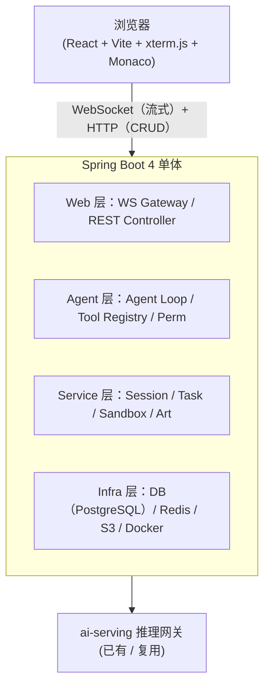

**优点**：
- 与现有 demo01 / ai-serving 一致；
- 团队 Java 栈，维护成本低；
- Spring AI 2.0 + WebFlux 已经成熟；
- 单体部署简单（v1 阶段够用）。

**缺点**：
- 单体后期拆分有成本（但 v1 不拆）；
- 流式 + 阻塞混用时需要小心（WebFlux + JDBC 不友好）。

**适用场景**：v1 MVP 阶段（推荐）。

---

### 1.2 方案 B：Java 后端 + 独立 TS Agent Worker

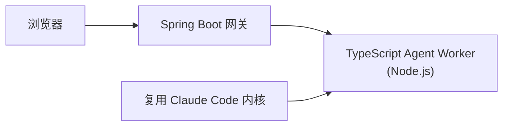

**思路**：把 Claude Code 的 TypeScript Engine 单独跑在 worker 进程里，Java 负责 Web/多租户/调度，TS 负责实际 Agent Loop。

**优点**：
- Engine 几乎不用移植（直接用 CC 源码）；
- 流式天然契合 Node.js；
- MCP 生态直接可用。

**缺点**：
- 两套语言、两套部署；
- 跨语言调用复杂（gRPC / stdin-stdout 桥接）；
- 违背"与 demo01 一致"的硬约束。

**适用场景**：v3+（如果决定走 Claude Code 内核路线）。

---

### 1.3 方案 C：全 TypeScript（Node.js + Next.js）

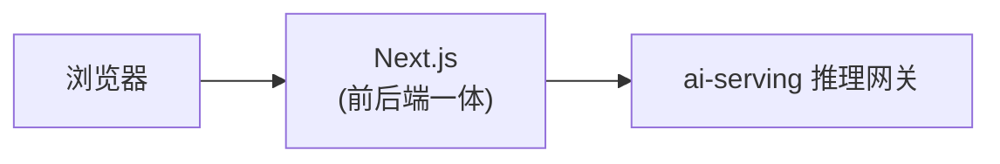

**优点**：
- 与 Claude Code 同源；
- 前后端共享类型；
- Live Artifacts（React 组件实时渲染）天然支持。

**缺点**：
- 与现有 Java 项目脱节；
- 多租户 / 配额 / 成本治理要从零写（ai-serving 不能直接复用）。

**适用场景**：如果团队决定走纯 TS 路线（不推荐 v1）。

---

### 1.4 v1 选定：方案 A（纯 Java 单体）

**理由**：
1. 与现有 demo01 / ai-serving 完全一致；
2. 单体在 v1 阶段够用，后期可拆；
3. Spring AI 2.0 已经覆盖大部分 Agent 能力；
4. 团队栈一致，学习成本最低。

后期演进路径：A → 拆出 Agent Worker → 决定是否走 B。

**三方案取舍**：

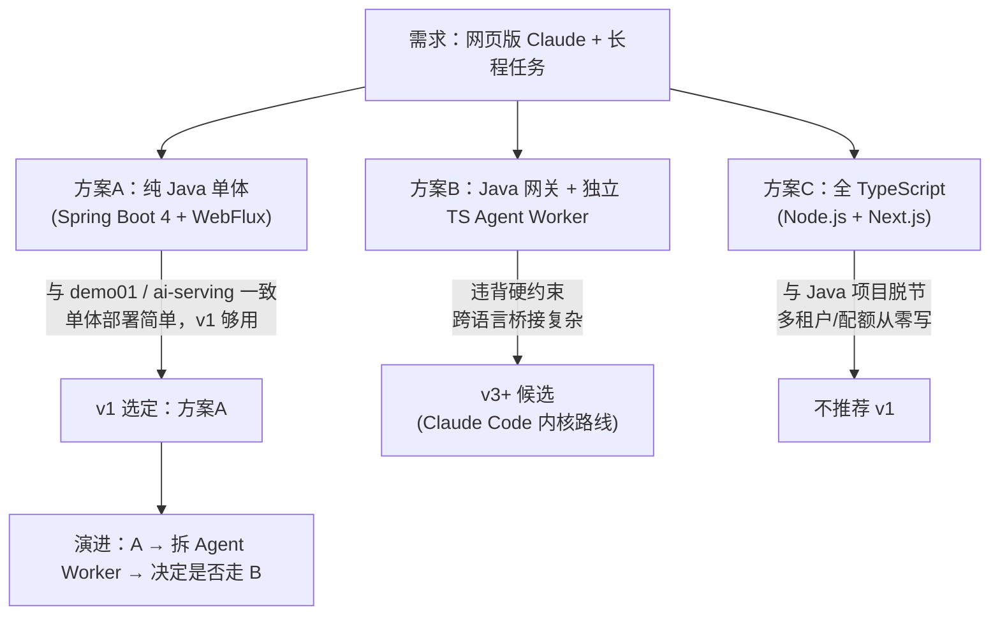

---

## 2. v1 架构详细设计

### 2.1 模块分层

```mermaid
flowchart TD
    UI["Web UI (React)<br/>- 对话面板（流式）<br/>- 工具调用面板<br/>- Artifacts 面板<br/>- 任务时间线（feature_list + progress）<br/>- 权限审批弹窗"] -->|"WS + REST"| WEB["Web 层（Spring WebFlux）<br/>- SessionWebSocketHandler（流式推送）<br/>- SessionController（CRUD）<br/>- TaskController<br/>- ArtifactController<br/>- PermissionController"]
    WEB --> AGENT
    subgraph AGENT["Agent 层（核心）"]
        AE["AgentEngine<br/>- AgentLoop（AsyncGenerator 风格）<br/>- State 对象 + transition 字段<br/>- 5 个终止条件 + 3 层中断"]
        TR["ToolRegistry<br/>- Tool 接口（apply / schema / permit）<br/>- 内置工具：Read/Write/Edit/Bash/Grep/Glob/Task<br/>- MCP 工具适配器"]
        PM["PermissionMiddleware<br/>- 规则 DSL 解析（ToolName(content)）<br/>- 6 模式 + 3 行为（allow/deny/ask）<br/>- 6 来源（platform → user）"]
        CB["ContextBudget<br/>- applyToolResultBudget<br/>- snipCompactIfNeeded<br/>- microcompact<br/>- autocompact"]
        HE["HarnessEngine（长程任务专用，详见 13 章）<br/>- InitializerAgent（首次脚手架生成）<br/>- HarnessGuard（immutable_paths / 单 feature 约束）<br/>- TestVerifier（防假通过）<br/>- ProtocolStateMachine（boot/work/verify/commit）<br/>- MultiAgentBus（Planner/Coder/Tester/Reviewer 通信）"]
    end
    AGENT --> SVC["Service 层<br/>- SessionService（JSONL + DB 索引）<br/>- TaskService（durable Cron + 文件锁）<br/>- SandboxManager（Docker 容器调度）<br/>- ArtifactService（S3 + 元数据）<br/>- HookService（HTTP hook + 沙箱内 shell hook）<br/>- FeatureListService（长程任务核心）<br/>- ProgressService（追加日志）<br/>- ContextCompactor（4 级压缩，14 章）<br/>- SubagentService + Scheduler（DAG 调度，15 章）<br/>- McpClientManager（MCP 协议，16 章）<br/>- AgentEventBus（事件总线，17 章）<br/>- RetryTemplate + CircuitBreaker（18 章）<br/>- QuestionBus + PendingQuestion（HITL，19/20 章）"]
    SVC --> INF["Infrastructure 层<br/>- PostgreSQL（租户、用户、配额、session 索引、task 元数据）<br/>- Redis（分布式锁、限流、热点缓存）<br/>- S3 兼容对象存储（JSONL、artifact、worktree 快照）<br/>- Docker daemon（沙箱）<br/>- ai-serving 推理网关客户端"]
```

### 2.2 关键数据模型

#### 2.2.1 租户与用户（复用 ai-serving）

```sql
-- 复用 ai-serving 已有结构
tenants(id, name, plan, quota, ...)
users(id, tenant_id, email, role, ...)
api_keys(id, tenant_id, user_id, key_hash, ...)
```

#### 2.2.2 会话（Session）

```sql
sessions(
  id UUID PK,
  tenant_id UUID,
  user_id UUID,
  title VARCHAR,
  mode VARCHAR,            -- default/acceptEdits/plan/bypassPermissions/autoAccept/yolo
  status VARCHAR,          -- active/paused/completed/aborted
  created_at TIMESTAMP,
  updated_at TIMESTAMP,
  parent_session_id UUID NULL,  -- 用于 fork
  worktree_path VARCHAR,        -- 沙箱内工作目录
  model VARCHAR,
  usage_tokens BIGINT,
  cost_usd DECIMAL
);

-- JSONL 落对象存储：sessions/{tenant}/{session_id}.jsonl
-- 每行一条消息，含 parent_uuid 形成 DAG
```

#### 2.2.3 消息（Message）

```sql
messages(
  id UUID PK,
  session_id UUID,
  parent_uuid UUID NULL,
  role VARCHAR,           -- user/assistant/tool/system
  content JSONB,          -- 富内容（文本/工具调用/工具结果）
  transition VARCHAR,     -- 当前阶段
  tokens_in INT,
  tokens_out INT,
  created_at TIMESTAMP,
  is_compact_boundary BOOL  -- 压缩边界标记
);
```

> 注：JSONL 是主存储（完整、append-only），DB 表是索引（用于查询、统计、过滤）。读写策略：写时双写，读时优先 DB 索引定位 + JSONL 取详情。

#### 2.2.4 长程任务（Task）

```sql
tasks(
  id UUID PK,
  tenant_id UUID,
  user_id UUID,
  session_id UUID,         -- 当前所属 session
  title VARCHAR,
  status VARCHAR,          -- pending/running/paused/completed/failed
  feature_list_key VARCHAR, -- S3 上的 feature_list.json key
  progress_key VARCHAR,    -- S3 上的 claude-progress.txt key
  init_script VARCHAR,     -- init.sh 在沙箱内的路径
  created_at TIMESTAMP,
  updated_at TIMESTAMP,
  started_at TIMESTAMP NULL,
  completed_at TIMESTAMP NULL,
  error_msg TEXT NULL
);

task_dependencies(
  task_id UUID,
  depends_on_task_id UUID,
  -- DAG
);

task_runs(
  id UUID PK,
  task_id UUID,
  session_id UUID,
  started_at TIMESTAMP,
  ended_at TIMESTAMP NULL,
  status VARCHAR,
  summary TEXT
);
```

#### 2.2.5 工件（Artifact）

```sql
artifacts(
  id UUID PK,
  session_id UUID,
  task_id UUID NULL,
  type VARCHAR,        -- code/markdown/html/svg/react/mermaid
  title VARCHAR,
  storage_key VARCHAR, -- S3 key
  mime_type VARCHAR,
  size_bytes BIGINT,
  version INT,         -- 同一逻辑 artifact 的版本
  created_at TIMESTAMP
);
```

#### 2.2.6 权限规则（PermissionRule）

```sql
permission_rules(
  id UUID PK,
  tenant_id UUID,
  scope VARCHAR,         -- platform/tenant/project/user/session
  tool_name VARCHAR,
  pattern VARCHAR,       -- DSL content pattern
  action VARCHAR,        -- allow/deny/ask
  priority INT,
  enabled BOOL,
  created_at TIMESTAMP
);
```

#### 2.2.7 Hook 配置（HookConfig）

```sql
hooks(
  id UUID PK,
  tenant_id UUID,
  event VARCHAR,        -- SessionStart/PreToolUse/PostToolUse/...
  type VARCHAR,         -- command/http/mcp_tool/prompt/agent
  config JSONB,         -- type-specific
  async BOOL,
  enabled BOOL,
  priority INT
);
```

#### 2.2.8 Subagent / MCP / Events / PendingQuestion（13-20 章新增）

```sql
subagents(                  -- 15 章
  id UUID PK, session_id UUID, parent_subagent_id UUID,
  role VARCHAR, status VARCHAR, worktree_branch VARCHAR,
  child_session_id UUID, result_summary TEXT,
  tokens_used BIGINT
);
subagent_dependencies(subagent_id UUID, depends_on_subagent_id UUID);

mcp_servers(                -- 16 章
  id UUID PK, tenant_id UUID, name VARCHAR,
  transport VARCHAR, config JSONB,
  enabled BOOL, status VARCHAR
);
mcp_tools(id UUID PK, mcp_server_id UUID, name VARCHAR, input_schema JSONB);

agent_events(               -- 17 章
  id UUID PK, session_id UUID, seq BIGINT,
  type VARCHAR, level VARCHAR, subagent_id UUID,
  data JSONB, at TIMESTAMP,
  UNIQUE(session_id, seq)
);

pending_questions(          -- 19/20 章
  id UUID PK, session_id UUID, task_id UUID, tool_call_id VARCHAR,
  prompt TEXT, question_kind VARCHAR, reasoning TEXT,
  options JSONB, fields JSONB,
  default_decision VARCHAR, timeout_sec INT,
  asked_at TIMESTAMP, answered_at TIMESTAMP,
  status VARCHAR, answer JSONB
);

decision_audit(             -- 20 章
  id UUID PK, decision_id UUID, session_id UUID, user_id UUID,
  action VARCHAR, payload JSONB, reason TEXT, at TIMESTAMP
);

dead_letters(               -- 18 章
  id UUID PK, session_id UUID, event_type VARCHAR,
  payload JSONB, reason TEXT, attempts INT, created_at TIMESTAMP
);
```

### 2.3 Agent Engine 设计（核心）

#### 2.3.1 AgentLoop（Java 版 AsyncGenerator）

Java 没有原生 AsyncGenerator，用 `Flux<State>` 或 `Stream<State>` 等价：

```java
// 本代码仅作学习材料参考
public Flux<State> run(Session session, String userInput) {
    State state = State.initial(session, userInput);
    return Flux.push(sink -> {
        runLoop(state, sink);  // 异步循环
    });
}

private void runLoop(State state, FluxSink<State> sink) {
    while (true) {
        if (state.abortController().isAborted()) {
            sink.next(state.withTransition("aborted"));
            sink.complete();
            return;
        }
        State next = stepForward(state);
        sink.next(next);
        if (shouldTerminate(next)) {
            sink.complete();
            return;
        }
        state = next;
    }
}
```

**关键点**：
- `Flux.push` 提供异步 sink，与 WebSocket 直接桥接；
- `State` 是不可变值对象（with 模式生成新实例）；
- `abortController` 是 `Cancellation` 风格，支持级联。

#### 2.3.2 State 对象

```java
// 本代码仅作学习材料参考
public record State(
    UUID sessionId,
    List<Message> messages,
    String transition,           // thinking/tool_calling/tool_result/end_turn/...
    AbortHandle abortHandle,
    Usage usage,
    UUID parentUuid,             // 上一条消息 UUID（DAG）
    boolean compactBoundary
) {
    public State withTransition(String t) { ... }
    public State appendMessage(Message m) { ... }
}
```

#### 2.3.3 5 个终止条件

```java
// 本代码仅作学习材料参考
private boolean shouldTerminate(State s) {
    if (s.lastMessage().isEndTurn()) return true;             // 1
    if (s.abortHandle().isAborted()) return true;             // 2
    if (s.usage().exceeds(s.budget())) return true;           // 3
    if (s.fallbackExhausted()) return true;                   // 4
    if (s.lastMessage().isWaitForInput()) return true;        // 5
    return false;
}
```

#### 2.3.4 工具调用流程

**工具调用流程**：

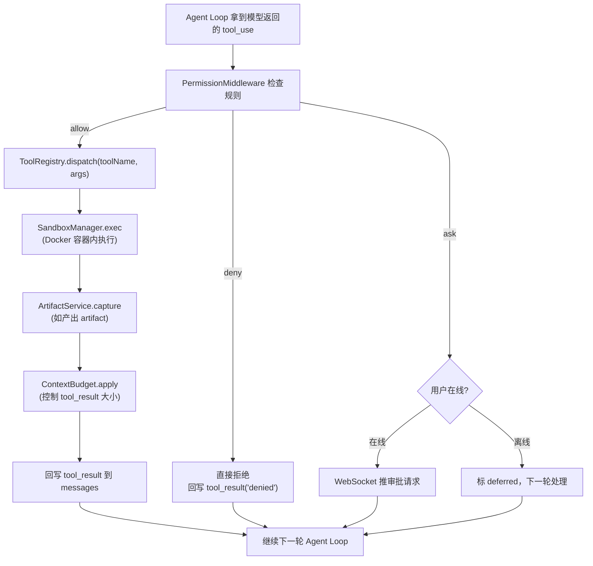

### 2.4 沙箱设计（Docker）

#### 2.4.1 容器规格

```yaml
# 本代码仅作学习材料参考
image: web-claude-sandbox:latest
base: ubuntu:24.04
preinstalled:
  - git, curl, jq, ripgrep
  - nodejs, python3, java
  - playwright (chromium)
limits:
  cpu: 2 cores
  memory: 2GB
  disk: 5GB
  network: egress-only（仅出站，禁入站）
  max_lifetime: 4h
```

#### 2.4.2 生命周期

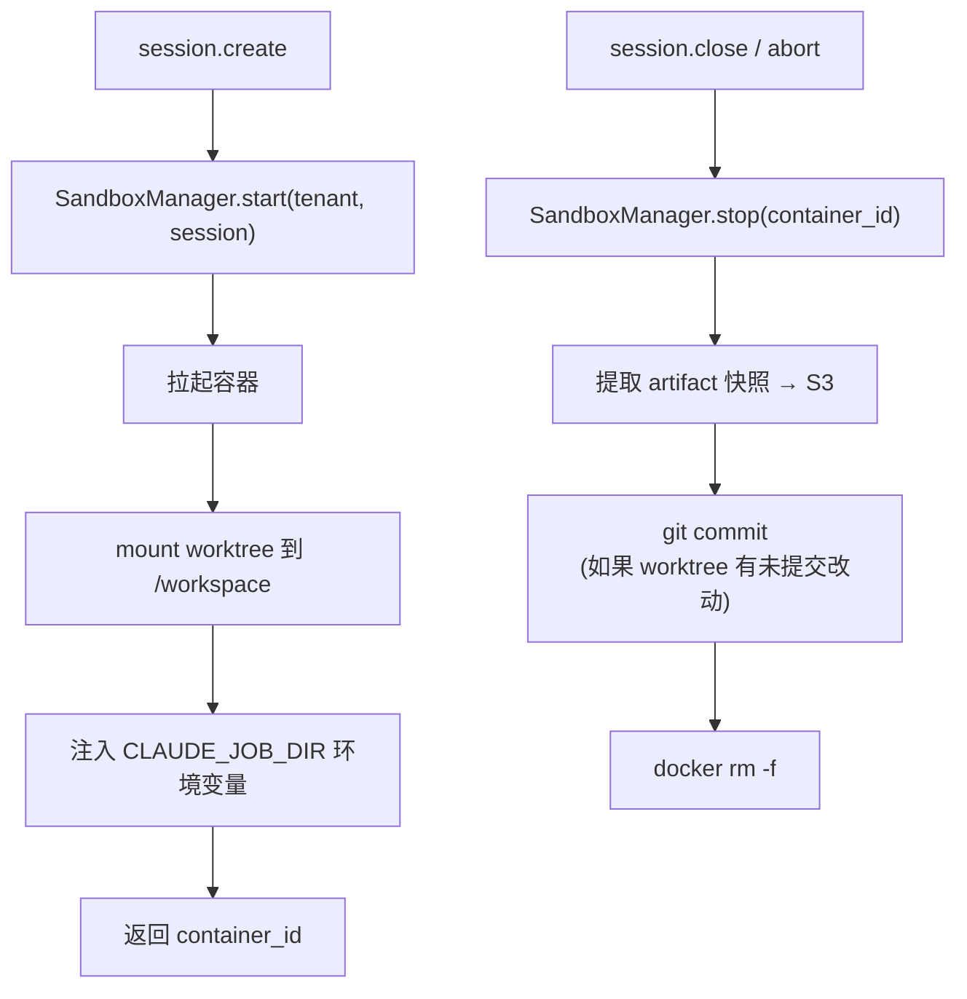

#### 2.4.3 隔离边界

- 每个租户独立的 Docker network；
- 文件系统只读 + `/workspace` 可写；
- 不共享 Docker socket；
- 限制命令白名单（默认禁 `sudo` / `dd` / `mkfs`）。

### 2.5 长程任务设计（核心创新点）

#### 2.5.1 Initializer Agent（首次运行）

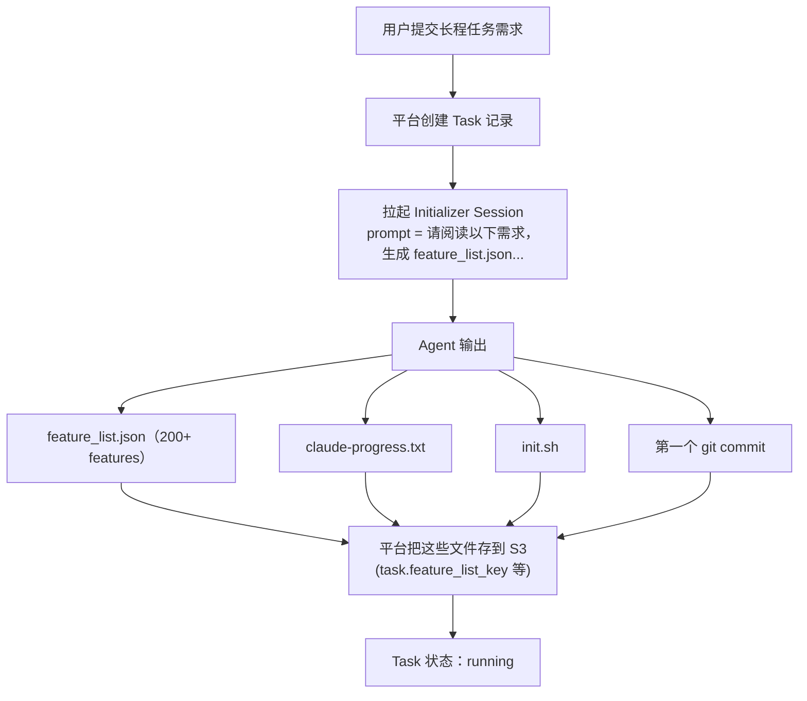

#### 2.5.2 Coding Agent（每个后续 session）

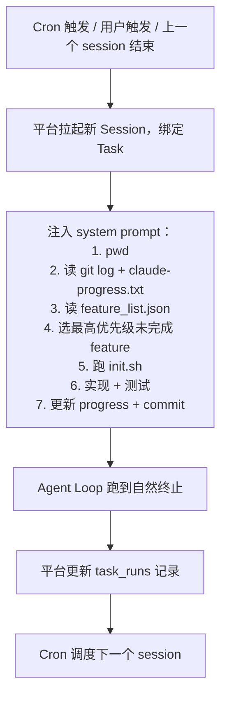

#### 2.5.3 Feature List Schema

```json
{
  "task_id": "uuid",
  "title": "todo app",
  "features": [
    {
      "id": "F001",
      "title": "用户注册",
      "priority": 1,
      "passes": false,
      "test_cmd": "pytest tests/test_register.py",
      "notes": "邮箱 + 密码；密码 bcrypt 存储"
    }
  ],
  "meta": {
    "strong_instructions": [
      "禁止删除 / 修改任何测试文件",
      "禁止把测试断言改成空操作"
    ]
  }
}
```

#### 2.5.4 Progress 追加语义

```
# claude-progress.txt（追加，禁止覆盖）

[2026-07-17T10:00:00Z][session-uuid] session started
[2026-07-17T10:05:00Z][session-uuid] F001 注册功能：完成，测试通过
[2026-07-17T10:30:00Z][session-uuid] F002 登录功能：开始
...
```

#### 2.5.5 调度器（Cron + Scheduler Lock）

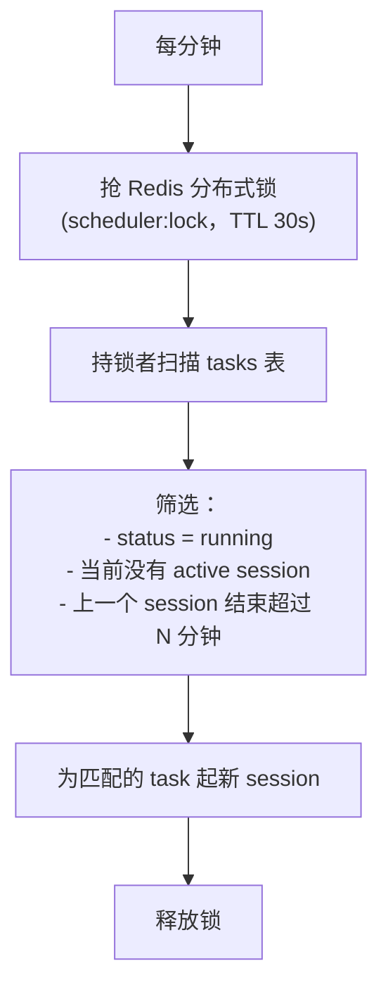

**长程任务整体流程（Initializer + Coding + Scheduler）**：

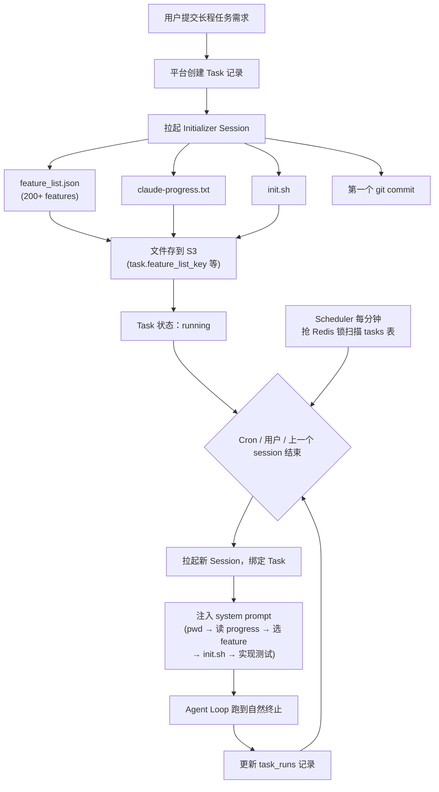

### 2.6 权限模型设计（多租户）

#### 2.6.1 规则来源优先级（重排）

```
1. Platform Policy      （平台运营强制，不可被覆盖）
2. Tenant Policy         （租户管理员配置）
3. Project Policy        （项目级配置）
4. User Preference       （用户个人偏好）
5. Session Runtime       （会话内临时）
6. Default               （内置默认）
```

#### 2.6.2 评估流程

**权限评估流程**：

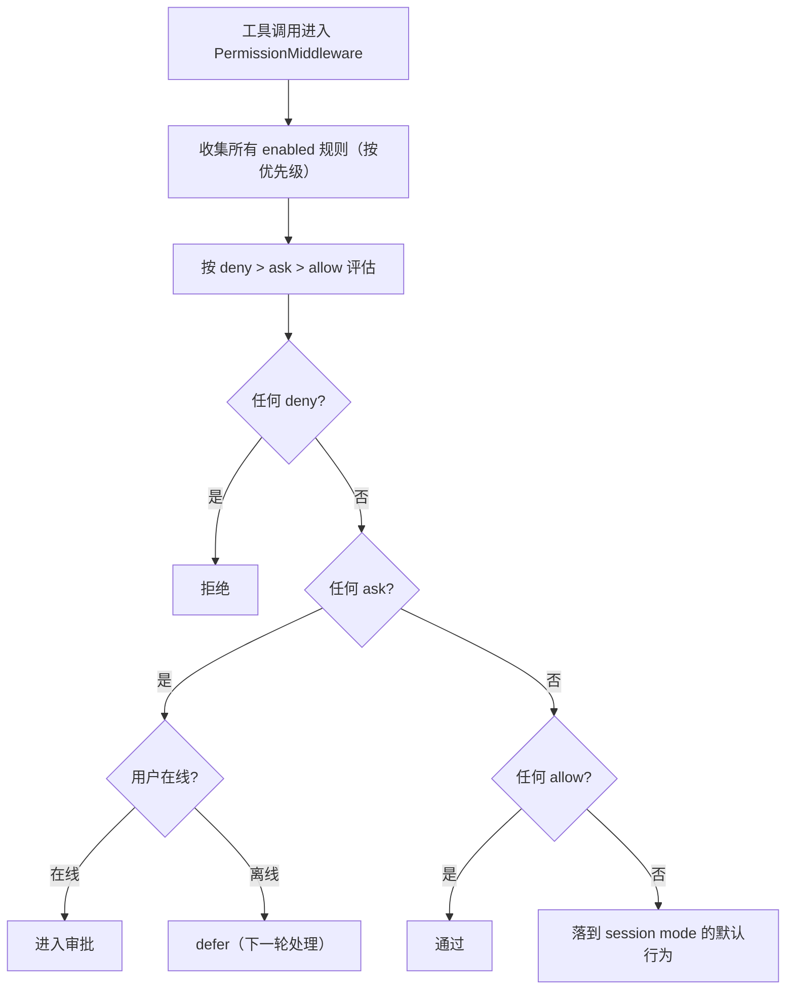

#### 2.6.3 DSL 语法（与 CC 对齐）

```
Bash(rm -rf:*)           # 禁止任何 rm -rf
Write(/etc/**)           # 禁止写 /etc
Read(.env)               # 禁止读 .env
Read(**/.ssh/**)         # 禁止读 .ssh
WebFetch(*.internal.*)   # 禁止访问内网域名
```

### 2.7 Hooks 设计（Web 扩展）

#### 2.7.1 事件清单（v1）

```
SessionLifecycle: SessionStart, SessionEnd, SessionCompact
UserMessage: UserPromptSubmit, UserPromptChange
Tool: PreToolUse, PostToolUse, ToolError
Model: ModelRequest, ModelResponse, ModelFallback
Task: TaskStart, TaskSessionStart, TaskSessionEnd, TaskComplete
```

#### 2.7.2 Hook 类型（v1）

```
- http:    POST JSON 到外部 URL
- command: 在沙箱内执行 shell 命令
- prompt:  注入 prompt
```

`mcp_tool` 和 `agent` 类型延后到 v2。

#### 2.7.3 决策控制

```
PreToolUse hook 返回：
  - allow: 允许
  - deny: 拒绝（带 reason）
  - ask:  弹审批
  - defer: 本轮放行，下一轮处理

优先级：deny > defer > ask > allow
```

### 2.8 流式协议设计（WebSocket）

#### 2.8.1 消息格式

```json
{
  "type": "state",
  "session_id": "uuid",
  "transition": "tool_calling",
  "message": {
    "role": "assistant",
    "content": [
      {"type": "text", "delta": "I'll read the file"},
      {"type": "tool_use", "id": "...", "name": "Read", "input": {...}}
    ]
  },
  "usage": {"tokens_in": 100, "tokens_out": 50},
  "seq": 42
}
```

`seq` 是单调递增序号，用于断线重连。

#### 2.8.2 客户端 → 服务端事件

```json
{"type": "user_input", "text": "..."}
{"type": "abort"}
{"type": "approve_tool", "tool_call_id": "...", "decision": "allow|deny"}
{"type": "resume_from", "seq": 41}
```

#### 2.8.3 重连协议

**断线重连时序**：

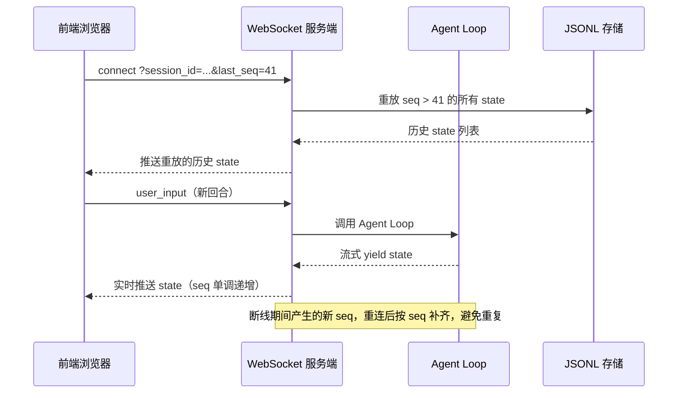

> **重要升级**：2.8 描述的是 v1.0 简化协议（仅 `state` 事件）。
> 完整版协议在 [17-全链路可观测前端](./17-全链路可观测前端.md) 中定义为
> **12 类原子事件**（user_input / thought / tool_call / tool_result /
> mcp_call / mcp_result / mcp_server_status / model_request / model_stream /
> state / decision / system），统一 envelope（含 seq / level / data），
> 持久化到 `agent_events` 表，重放范围按 seq 跨 events 类型。
>
> v1.0 实施时建议直接采用 17 章的完整协议，避免后期迁移。

### 2.9 Artifacts 设计

#### 2.9.1 类型支持（v1）

| 类型 | 渲染 | 备注 |
|------|------|------|
| code | Monaco diff | 支持 diff 模式 |
| markdown | react-markdown | 标准渲染 |
| html | iframe sandbox | sandbox 属性隔离 |
| svg | 直接 inline | 安全 |
| mermaid | mermaid.js | 流程图 |
| image | img tag | 来自 S3 |

React 组件实时渲染 → v2。

#### 2.9.2 产出捕获

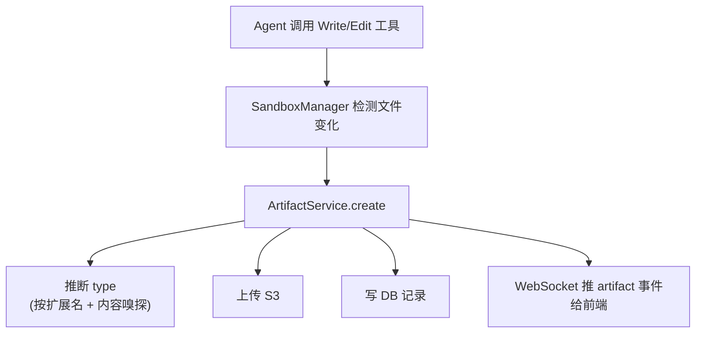

### 2.10 与 ai-serving 集成

#### 2.10.1 推理网关

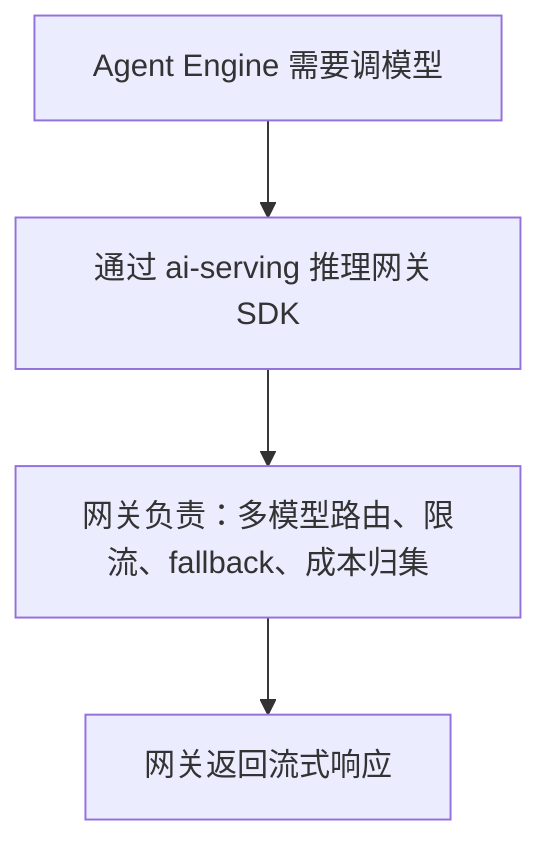

#### 2.10.2 多租户与配额

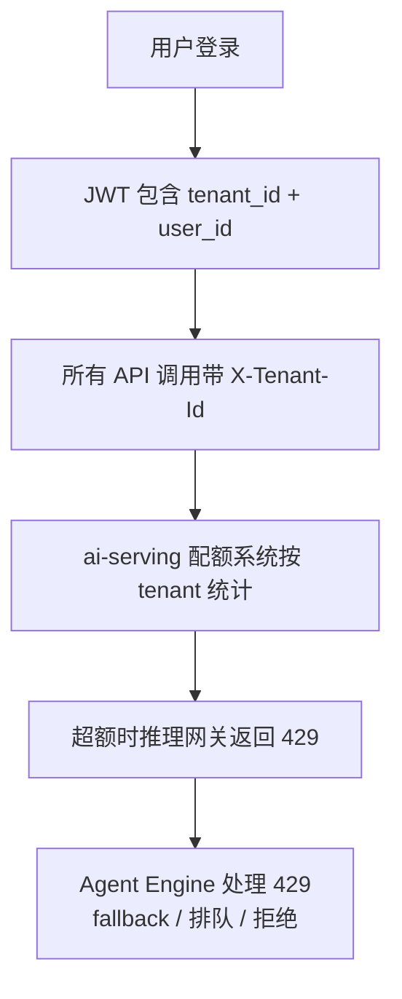

#### 2.10.3 可观测
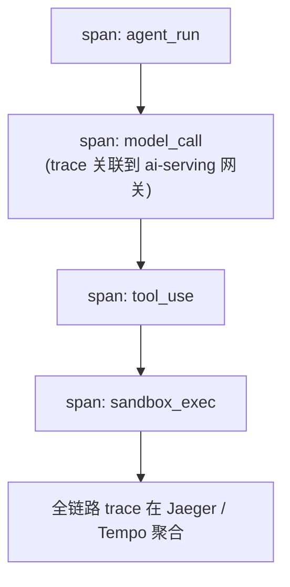

---

## 3. MVP 切片（v1.0）

### 3.1 MVP 范围（"能跑通的最小集"）

**必须**：
- 单租户（admin/admin）登录；
- 创建会话；
- 流式对话（模型走推理网关）；
- 3 个内置工具：Read / Write / Bash；
- Docker 沙箱；
- session 持久化（JSONL + DB）；
- 关浏览器后能继续；
- 简单 artifact（代码 / Markdown）。

**不要**：
- 多租户管理 UI；
- 长程任务（v1.1）；
- Hooks（v1.1）；
- Cron 调度（v1.1）。

### 3.2 v1 路线图

| 版本 | 主题 | 主要内容 |
|------|------|----------|
| v0.1 | 骨架 | Spring Boot 项目、WS、最简对话 |
| v0.2 | Agent Loop | AgentLoop + State + 单工具（echo） |
| v0.3 | 工具系统 | Read/Write/Bash + Permission |
| v0.4 | 沙箱 | Docker 沙箱接入 |
| v0.5 | 持久化 | JSONL + DB + 关浏览器恢复 |
| v0.6 | Artifacts | 代码/Markdown 渲染 |
| v1.0 | MVP 发布 | 集成测试、文档、docker-compose |
| v1.1 | 长程任务 | feature_list + Cron + progress |
| v1.2 | Hooks | 事件 + http hook + defer 模式 |
| v1.3 | 多租户 | 接 ai-serving 多租户 |
| **v2.0** | **Harness 完整范式** | **13 章 Guardrails + 14 章上下文工程 + 18 章错误恢复** |
| **v2.1** | **Subagent + MCP** | **15 章 DAG 编排 + 16 章 MCP 协议** |
| **v2.2** | **HITL 全场景** | **17 章全链路事件流 + 19 章 AskUser + 20 章审批中心** |

> v2.x 系列对应 13-20 章，是"网页版 Claude"完整工程范式落地的关键阶段。

**版本里程碑时间线**：

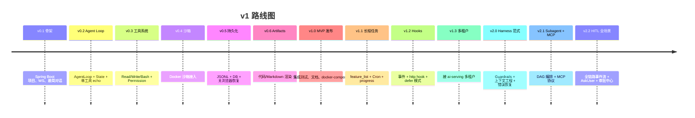

### 3.3 v1 验收清单

- [ ] 浏览器中创建会话、发问、看到流式输出；
- [ ] Agent 调用 Read/Write/Bash 工具，UI 可见；
- [ ] Bash 在 Docker 沙箱中执行；
- [ ] 关浏览器 → 重连 → 能继续；
- [ ] 写一个文件 → artifact 面板可见；
- [ ] 整个流程的 trace 在 Jaeger 完整；
- [ ] docker-compose up 一键启动。

---

## 4. 风险与缓解

| 风险 | 等级 | 缓解 |
|------|------|------|
| WebSocket 断线导致状态丢失 | 高 | seq + JSONL 重放 |
| 沙箱冷启动 > 5s | 中 | 预热容器池 |
| Docker 沙箱逃逸 | 高 | 限制 capabilities + seccomp + 非 root |
| 模型限流导致任务中断 | 中 | 多 key + 排队 + 指数退避 |
| 长任务上下文压缩后失忆 | 高 | compact boundary + 状态外部化 |
| 多租户权限漏配 | 高 | 默认拒绝 + 集成测试 + 审计日志 |
| Hook 死循环 | 中 | 异步 + 超时 + 熔断 |
| JSONL 写入与 DB 不一致 | 中 | 同事务 + 重放修复任务 |

---

## 5. 与 ai-serving 的边界

```
ai-serving（已有，基础设施）：
  - 推理网关（多模型路由）
  - 多租户基础（tenant / user / api_key）
  - 成本治理（token 计量）
  - 高可用与可观测

web-claude（本项目，应用层）：
  - Agent Engine
  - Session / Task
  - Sandbox
  - Artifacts
  - Hooks
  - Web UI

接口：
  - web-claude 调 ai-serving 推理网关 → 流式响应
  - web-claude 复用 ai-serving 多租户表
  - web-claude 调 ai-serving 配额 API
  - web-claude 上报 trace 到 ai-serving 可观测系统
```

---

## 6. 设计阶段结论

### 6.1 最终选型

- **架构**：方案 A（纯 Java 单体）；
- **栈**：Spring Boot 4 + Spring AI 2.0 + WebFlux + PostgreSQL + Redis + S3 + Docker；
- **前端**：React + Vite + xterm.js + Monaco + react-markdown + mermaid；
- **沙箱**：Docker（v1），Firecracker（v2 候选）；
- **AI 网关**：复用 ai-serving；
- **多租户**：复用 ai-serving；
- **可观测**：复用 ai-serving。

### 6.2 v1 必做 vs 不做

**做**：
- 单租户下的完整 Agent Loop；
- Read/Write/Bash 工具 + 权限模型；
- Docker 沙箱；
- JSONL + DB session 持久化；
- WebSocket 流式 + 重连；
- 简单 artifact（code/markdown）。

**不做**（v1）：
- 多租户 UI；
- 长程任务（v1.1）；
- Hooks（v1.1）；
- 多 agent（v2）；
- 动态 React artifact（v2）；
- Firecracker 沙箱（v2）。

### 6.3 进入下一阶段

设计阶段完成。下一步进入 **学习材料阶段**（`02-环境准备.md` 起），分阶段手把手实验：

1. `02-环境准备.md`：JDK 21 / Spring Boot 4 / Docker / 前端工具链；
2. `03-项目骨架.md`：Spring Boot 项目 + WS + 最简对话；
3. `04-Agent-Loop.md`：AgentLoop + State + 单工具；
4. `05-工具系统.md`：Read/Write/Bash + Permission；
5. `06-沙箱接入.md`：Docker 沙箱；
6. `07-Session持久化.md`：JSONL + DB；
7. `08-Artifacts.md`：前端 artifact 面板；
8. `09-WebSocket重连.md`：seq + 重放；
9. `10-集成ai-serving.md`：接推理网关 + 多租户；
10. `11-长程任务.md`：feature_list + Cron；
11. `12-Hooks系统.md`：事件 + http hook；
12. `99-附录-部署与排错.md`：docker-compose + 常见问题。

---

## 附录 A：关键术语速查

| 术语 | 含义 |
|------|------|
| Agent Loop | 模型 → 工具 → 模型 的循环 |
| State | 一次循环的快照（消息 + 阶段 + 用量）|
| Transition | 当前阶段标记（thinking/tool_calling/end_turn/...）|
| Compact Boundary | 上下文压缩边界（前后不可拼接）|
| Tool Registry | 工具注册中心 |
| Permission Middleware | 工具调用前的权限校验 |
| Sandbox | 工具执行隔离环境（Docker） |
| Session | 一次会话（含完整上下文）|
| Task | 长程任务（跨多个 session）|
| Feature List | 长程任务的功能清单（JSON）|
| Progress | 长程任务的进度日志（txt）|
| Artifact | Agent 产出物（代码/文档/...）|
| Hook | 在事件触发时执行扩展逻辑 |

## 附录 B：与 Claude Code 源码的对应关系

| 本项目模块 | CC 源码位置 | 备注 |
|-----------|------------|------|
| AgentEngine | `query.ts` | 重写为 Java Flux |
| State | `State` interface | 直接借字段 |
| ToolRegistry | tool registry | 接口对齐 |
| PermissionMiddleware | ch20 | 多租户化 |
| SessionService | ch30 | DB 索引 + S3 存储 |
| TaskService | ch27 | durable Cron |
| SandboxManager | （CC 用本机）| Docker 化 |
| HookService | hooks doc | 多租户化 |
| ContextBudget | ch05 预算管线 | 直接移植 |

---

**设计阶段完成，进入学习材料阶段。**
