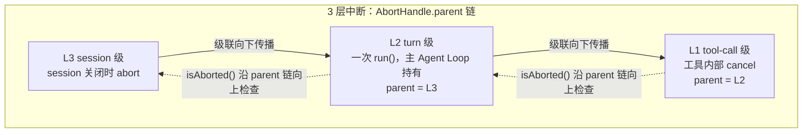
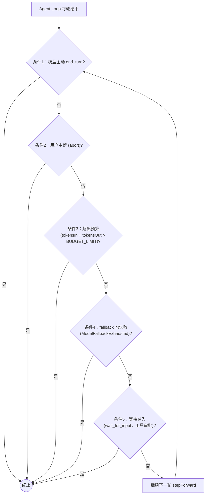
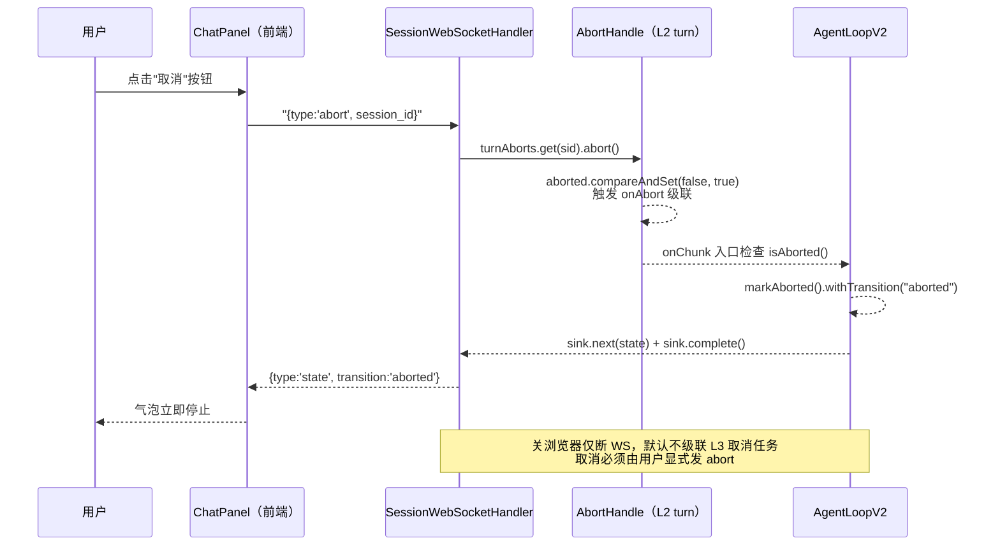
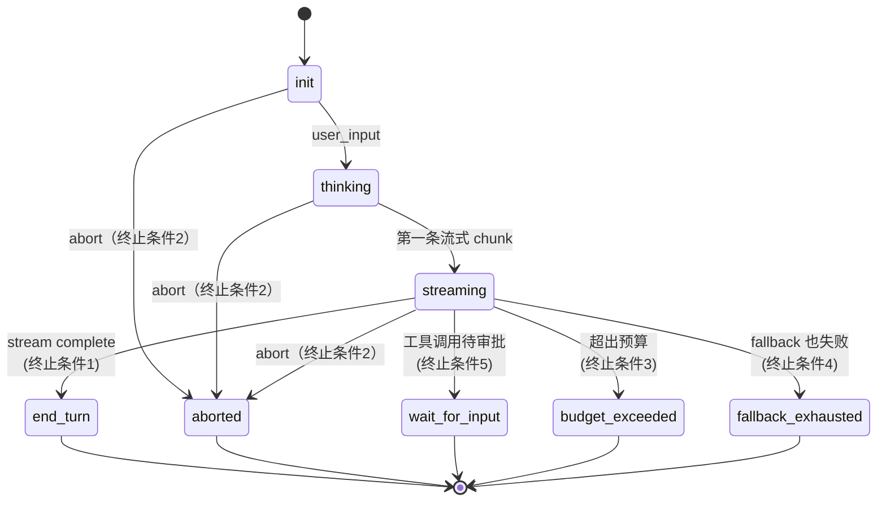

# 04 - Agent Loop 深化：State + 终止条件 + 中断

> 本章目标：把上一章的最简 Agent Loop 升级到接近 Claude Code 源码的设计。
> 完成后：thread-safe 的状态管理、5 个终止条件、3 层中断支持。
>
> **本章范围**：
> - 本章不碰上下文压缩（那是长任务触发自动压缩时的处理，涉及多级压缩与 compact boundary 语义）；
> - 本章不碰工具调用（Read/Write/Bash 注册与权限中间件是后续内容）；
> - 本章不碰事件埋点（Agent Loop 的每个原子操作都要 emit 事件，事件流持久化是后续内容）；
> - 本章不碰错误恢复（所有 IO 都要套 RetryTemplate，属于错误恢复主题）。
>
> **v2.0 关联**：
> - ContentBlock 上要挂 Provenance 标签（untrusted vs trusted，区分模型可信来源与工具结果）；
> - system prompt 装配时要注入用户偏好（记忆与个性化系统的能力）；
> - 给模型的请求过 SecretGuard 扫描（凭据不进 model context）；
> - 前端通过路由 + 跨 tab 接收 Agent Loop 的 events。

---

## 本章五步地图

| 步 | 节 | 你要带走什么 |
|----|----|---------|
| ① 痛点 | §1 | 上一章的 `StringBuilder` 字段在并发下会串字；只有"完成"一个停止条件 |
| ② 最小实现 | §2–§5 | AgentLoopV2（thread-safe）+ AbortHandle（3 层级联）+ 5 终止条件 + 前端取消按钮 |
| ③ 验证 | §6 | 流式中点取消，立即停；关浏览器 WS 断但任务还在 |
| ④ 对照 | §0（章末汇总）| 与上一章的 State / 终止 / 中断对比表 |
| ⑤ 避坑 | §8 | 浏览器关闭 ≠ 取消任务；transition 字符串约定；abort 级联死循环 |

---

## 0. 与上一章的差异

| 维度 | 上一章（骨架） | 本章 |
|------|-------|-------|
| State 累积 | `StringBuilder` 字段（线程不安全）| per-call builder |
| 终止条件 | 只看 stream complete | 5 个完整条件 |
| 中断 | 不支持 | 3 层中断 |
| transition | 简化 | 完整状态机 |
| 工具调用 | 无 | 无（工具系统与权限篇做）|

---

## 1. 痛点：上一章的 AgentLoop 在生产里会出三件事

读完上一章你会发现它的"骨架"其实是"独木桥"：

1. **`StringBuilder buffer` 是字段不是局部变量**。两个请求并发跑同一个 `AgentLoop` Bean，A 的回复会拼到 B 的回复里——肉眼看不出错但答非所问。这是上一章故意留的雷，本章必须修。
2. **只有"流式完成"一个停止条件**。模型卡死、超预算、用户想停——都没法主动终止。一次失败的请求会一直占着资源直到模型自己出完。
3. **没有中断机制**。用户点了"取消"按钮，前端什么都做不了——只能干等模型说完。这在长输出（写代码、长文）场景下是体验灾难。

> 还有一个**故意留的悬念**：上一章关浏览器时 `afterConnectionClosed` 是空的。本章要正面回答"关浏览器 ≠ 取消任务"——这是后面长程任务的语义基础。

## 2. State 重构

### 2.1 不可变 + per-call builder

新建 `src/main/java/org/demo02/webclaude/agent/AgentLoopV2.java`（保留原 AgentLoop 作为参考，新版本替换使用）：

```java
// 本代码仅作学习材料参考
package org.demo02.webclaude.agent;

import org.springframework.ai.chat.client.ChatClient;
import org.springframework.ai.chat.messages.AssistantMessage;
import org.springframework.ai.chat.messages.UserMessage;
import org.springframework.ai.chat.model.ChatResponse;
import reactor.core.publisher.Flux;
import reactor.core.publisher.FluxSink;

import java.util.ArrayList;
import java.util.List;
import java.util.UUID;
import java.util.concurrent.atomic.AtomicReference;

public class AgentLoopV2 {

    private final ChatClient chatClient;

    public AgentLoopV2(ChatClient chatClient) {
        this.chatClient = chatClient;
    }

    public Flux<State> run(UUID sessionId, List<Message> history, String userInput,
                           AbortHandle abort) {
        return Flux.create(sink -> {
            // 1. 加入 user message
            UUID lastParentId = history.isEmpty() ? null : history.get(history.size() - 1).id();
            Message userMsg = Message.user(lastParentId, userInput);
            State initial = State.initial(sessionId, history)
                .append(userMsg)
                .withTransition("thinking");
            sink.next(initial);

            // 2. per-call builder（线程安全）
            var contentBuilder = new AtomicReference<>(new StringBuilder());
            var tokenInBox = new long[1];
            var tokenOutBox = new long[1];

            // 3. 中断检查
            if (abort.isAborted()) {
                sink.next(initial.markAborted().withTransition("aborted"));
                sink.complete();
                return;
            }

            // 4. 调模型
            var msgs = new ArrayList<org.springframework.ai.chat.messages.Message>();
            history.forEach(m -> appendSpring(msgs, m));
            msgs.add(new UserMessage(userInput));

            chatClient.prompt()
                .messages(msgs)
                .stream()
                .chatResponse()
                .subscribe(
                    response -> onChunk(response, initial, contentBuilder, tokenInBox, tokenOutBox, sink, abort),
                    error -> onError(error, initial, sink),
                    () -> onComplete(initial, contentBuilder, tokenInBox, tokenOutBox, sink, abort)
                );
        }, FluxSink.OverflowStrategy.BUFFER);
    }

    private void appendSpring(List<org.springframework.ai.chat.messages.Message> list, Message m) {
        if ("user".equals(m.role())) {
            m.content().stream()
                .filter(b -> b instanceof ContentBlock.Text)
                .forEach(b -> list.add(new UserMessage(((ContentBlock.Text) b).text())));
        } else if ("assistant".equals(m.role())) {
            m.content().stream()
                .filter(b -> b instanceof ContentBlock.Text)
                .forEach(b -> list.add(new AssistantMessage(((ContentBlock.Text) b).text())));
        }
    }

    private void onChunk(ChatResponse resp,
                         State state,
                         AtomicReference<StringBuilder> builder,
                         long[] tokenInBox,
                         long[] tokenOutBox,
                         FluxSink<State> sink,
                         AbortHandle abort) {
        if (abort.isAborted()) {
            sink.next(state.markAborted().withTransition("aborted"));
            sink.complete();
            return;
        }
        if (resp.getResult() == null || resp.getResult().getOutput() == null) return;

        String chunk = resp.getResult().getOutput().getText();
        if (chunk != null) {
            builder.get().append(chunk);
            sink.next(state.withTransition("streaming"));
        }

        if (resp.getMetadata() != null && resp.getMetadata().getUsage() != null) {
            var u = resp.getMetadata().getUsage();
            tokenInBox[0] += u.getPromptTokens() == null ? 0 : u.getPromptTokens();
            tokenOutBox[0] += u.getCompletionTokens() == null ? 0 : u.getCompletionTokens();
        }
    }

    private void onError(Throwable err, State state, FluxSink<State> sink) {
        sink.next(state.withTransition("error: " + err.getMessage()));
        sink.complete();
    }

    private void onComplete(State state,
                            AtomicReference<StringBuilder> builder,
                            long[] tokenInBox,
                            long[] tokenOutBox,
                            FluxSink<State> sink,
                            AbortHandle abort) {
        if (abort.isAborted()) {
            sink.next(state.markAborted().withTransition("aborted"));
            sink.complete();
            return;
        }
        String full = builder.get().toString();
        Message assistantMsg = Message.assistant(null,
            List.of(new ContentBlock.Text(full)));
        State finalState = state.append(assistantMsg)
            .addUsage(tokenInBox[0], tokenOutBox[0])
            .withTransition("end_turn");
        sink.next(finalState);
        sink.complete();
    }
}
```

### 2.2 AbortHandle

新建 `src/main/java/org/demo02/webclaude/agent/AbortHandle.java`：

```java
// 本代码仅作学习材料参考
package org.demo02.webclaude.agent;

import java.util.concurrent.atomic.AtomicBoolean;
import java.util.function.Consumer;

public class AbortHandle {

    private final AtomicBoolean aborted = new AtomicBoolean(false);
    private final AbortHandle parent;
    private final Consumer<AbortHandle> onAbort;

    public AbortHandle() {
        this(null, h -> {});
    }

    public AbortHandle(AbortHandle parent, Consumer<AbortHandle> onAbort) {
        this.parent = parent;
        this.onAbort = onAbort;
    }

    public boolean isAborted() {
        return aborted.get() || (parent != null && parent.isAborted());
    }

    public void abort() {
        if (aborted.compareAndSet(false, true)) {
            onAbort.accept(this);
        }
    }
}
```

**3 层中断设计**：
- **L1 tool-call 级**：在工具内部创建，工具内部 cancel；
- **L2 turn 级**：一次 `run()`，主 Agent Loop 持有；
- **L3 session 级**：session 关闭时 abort，所有 turn 自动级联。

`AbortHandle.parent` 链让级联自动传播。

**3 层中断级联结构**：



---

## 3. 5 个终止条件

修改 `AgentLoopV2.onComplete` 上方的判断，整合 5 个条件：

```java
// 本代码仅作学习材料参考
private boolean shouldTerminate(State state, Throwable error) {
    // 条件 1：模型主动 end_turn
    if ("end_turn".equals(state.transition())) return true;
    // 条件 2：用户中断
    if (state.aborted()) return true;
    // 条件 3：超出预算
    if (state.tokensIn() + state.tokensOut() > BUDGET_LIMIT) return true;
    // 条件 4：fallback 也失败
    if (error != null && error instanceof ModelFallbackExhausted) return true;
    // 条件 5：等待输入（工具调用前要审批）
    if ("wait_for_input".equals(state.transition())) return true;
    return false;
}
```

> 本章不实现条件 4 和 5 的完整逻辑（fallback 与 wait_for_input 的完整实现见后续相关主题），只放占位符。

**5 个终止条件评估**：



---

## 4. WebSocket 接入中断

修改 `SessionWebSocketHandler`，支持 abort 事件：

```java
// 本代码仅作学习材料参考
@Override
protected void handleTextMessage(WebSocketSession ws, TextMessage raw) throws Exception {
    Map<?, ?> req = om.readValue(raw.getPayload(), Map.class);
    String type = (String) req.get("type");

    switch (type) {
        case "user_input" -> {
            String sessionId = (String) req.get("session_id");
            String text = (String) req.get("text");
            UUID sid = UUID.fromString(sessionId);

            // L2 turn-level abort handle（绑定到 L3 session）
            AbortHandle turnAbort = new AbortHandle(sessionAborts.get(sid), h -> {});
            turnAborts.put(sid, turnAbort);

            List<Message> history = loadHistory(sid);
            agentLoop.run(sid, history, text, turnAbort).subscribe(state -> {
                try {
                    ws.sendMessage(new TextMessage(om.writeValueAsString(toWire(state))));
                } catch (Exception e) {
                    e.printStackTrace();
                }
            });
        }
        case "abort" -> {
            String sessionId = (String) req.get("session_id");
            UUID sid = UUID.fromString(sessionId);
            AbortHandle turn = turnAborts.get(sid);
            if (turn != null) turn.abort();
        }
    }
}

private final Map<UUID, AbortHandle> sessionAborts = new ConcurrentHashMap<>();
private final Map<UUID, AbortHandle> turnAborts = new ConcurrentHashMap<>();

@Override
public void afterConnectionClosed(WebSocketSession session, CloseStatus status) {
    // session 关闭 → 触发 L3 中断（但默认不真取消任务，只是断 WS）
    // 注意：浏览器关闭 ≠ 任务取消，长程任务设计的关键决策
    // 这里暂不级联取消；如果需要取消，用户应当显式发 abort
}
```

**关键决策**：
- 浏览器关闭默认**不**取消任务；
- 用户必须点"取消"按钮才发 abort；
- 这是长程任务的核心语义：任务生命周期超过单次会话生命周期，任务不会因为浏览器关闭而消失。

---

## 5. 前端：中断按钮

修改 `ChatPanel.tsx`：

```tsx
// 本代码仅作学习材料参考
const abort = () => {
  ws.send({ type: 'abort', session_id: sessionId } as any);
};

// 在发送按钮旁加：
<button onClick={abort} disabled={!streaming}>取消</button>
```

**取消按钮 → 中断级联时序**：



---

## 6. 验证：测试中断

### 6.1 流程

1. 发送一个会触发长输出的问题（"写一篇 1000 字的故事"）；
2. 在流式过程中点"取消"；
3. 看到 assistant 气泡立即停止，transition = "aborted"。

**检查点 04-1**：取消按钮能立即停止流式输出。

### 6.2 边界测试

| 场景 | 预期 |
|------|------|
| 流式刚开始就取消 | transition = "aborted"，几乎不输出文字 |
| 流式完成后再点取消 | 按钮禁用（streaming=false）|
| 关浏览器 | WS 断，但下次重连能看到上一条 end_turn（Session 持久化篇实现）|

---

## 6. State 状态机总结

**State 状态机**：



---

## 8. 本章产出

```
后端：
  ✅ AgentLoopV2（thread-safe + 完整状态机）
  ✅ AbortHandle（3 层级联）
  ✅ WebSocket 接入 abort 事件

前端：
  ✅ 取消按钮
```

## 7. 避坑：本章容易踩的雷

| 雷 | 现象 | 规避 |
|----|------|------|
| `AbortHandle.parent` 成环 | abort 调用栈溢出 | 构造时检查 parent 链不重复 |
| transition 用中文 / 含空格 | 前端 switch case 匹配不上 | 统一用 snake_case 英文常量 |
| WS 关闭时立即 abort L3 | 用户切 tab 任务就被取消 | **不要**在 `afterConnectionClosed` 级联 abort |
| abort 后没 sink.complete() | Flux 永远不结束，订阅泄漏 | `markAborted()` 后**必须** `sink.complete()` |
| `onChunk` 里检查 abort 太晚 | 已读完一大段才停 | 在每个 chunk 入口就检查 |
| AtomicReference<StringBuilder> | 不必要的封装，直接局部变量也行 | 这个是为了教学演示，生产可简化 |

---

## 9. 下一步

进入下一节：**05-工具系统与权限**——让 Agent 能调用 Read/Write/Bash 等工具，并加上权限中间件。
