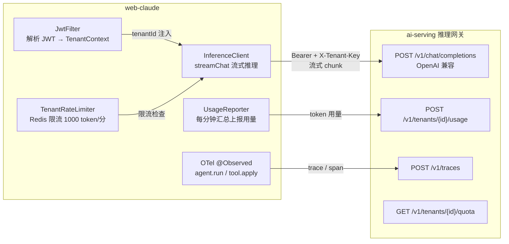
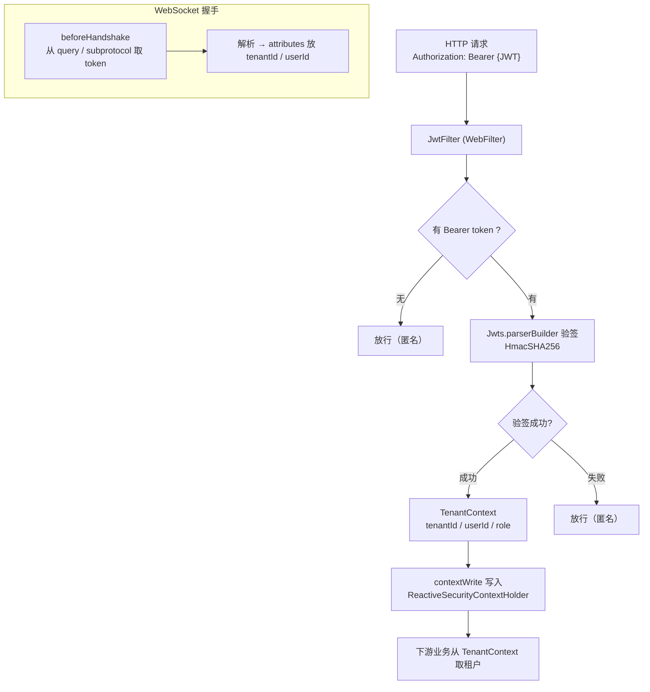
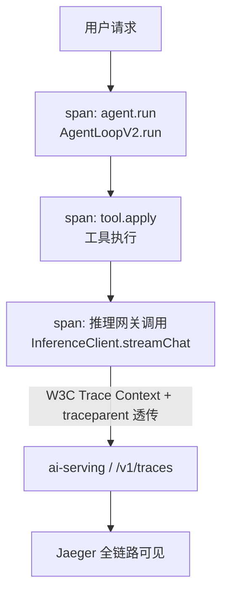
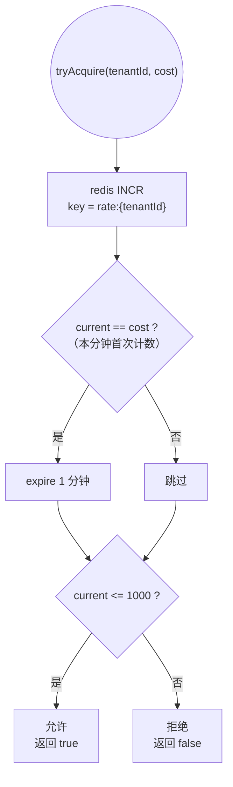

# 10 - 集成 ai-serving：多租户 + 推理网关

> 本章目标：把单租户 MVP 接入 ai-serving 五章的基础设施。
> 完成后：多租户隔离、模型走推理网关、成本归集、可观测。
>
> **本章范围**：
> - 模型 fallback / max_output_tokens 恢复的深度实现（渐进降级：主模型失败换备模型、截断后恢复）；
> - 多租户背景下的 Subagent 配额（子 agent 消耗计入租户额度）；
> - trace 在 subagent / 工具 / MCP 间传递（W3C Trace Context 全链路贯穿）。
>
> **Web 项目专项**：
> - CORS 严格配置（明确域名，禁 `*` + credentials）；
> - Cookie 安全标志（HttpOnly + Secure + SameSite=Strict）；
> - CSRF 防护（如果用 cookie 而非纯 JWT header）；
> - Refresh Token 轮转（JWT 短时 15min + Refresh 7d）。

> 前置阅读：AI Serving 五章设计（推理网关 / 向量库 / 多租户 / 成本治理 / 高可用），本章直接把 web-claude 接到这套已有基础设施上。

---

## 本章五步地图

| 步 | 节 | 你要带走什么 |
|----|----|---------|
| ① 痛点 | §1 | 上一章是单租户、本地模型——上生产必须接企业 AI 网关 |
| ② 最小实现 | §2–§7 | 多租户上下文 + InferenceClient + 成本上报 + OTel + 限流配额 |
| ③ 验证 | §8 | 两租户互相看不到对方 session；token 用量出现在 ai-serving 后台 |
| ④ 对照 | §9 | 与上一章（单租户单模型）的能力差异 |
| ⑤ 避坑 | §10 | JWT 透传链路 / 配额误扣 / 跨服务 trace 断 |

---

## 1. 痛点：上一章是"个人玩具"，本章是"企业产品"

读完上一章你的平台能"用"——但只能你自己用。一旦给别人用立刻爆雷：

- **单租户**：所有人共用一个 session 列表，A 看到 B 的对话
- **直连模型**：每个用户自己出 OpenAI key——不现实
- **无成本治理**：一个用户跑出 $1000 账单没人知道
- **无可观测**：模型调用的 trace、latency、error rate 全没有

> 企业的 AI 网关（ai-serving）就是为了解决这四件事。本章不重造轮子，**只把 web-claude 这边接进去**——ai-serving 五章（推理网关 / 向量库 / 多租户 / 成本治理 / 高可用）是已有资产。
>
> 这一章是后面长程任务、Subagent 编排、生产部署的**租户基础**。所有跨 session 的能力都假设有这一章的多租户上下文。

## 2. ai-serving 提供的接口（假设）

- `POST /v1/chat/completions` —— 推理网关入口（OpenAI 兼容）；
- `GET /v1/tenants/{id}/quota` —— 查询租户配额；
- `POST /v1/tenants/{id}/usage` —— 上报使用量；
- `POST /v1/traces` —— OTel 上报；
- API key 通过 `Authorization: Bearer` 透传。

> 你需要在 ai-serving 那边部署 / 调通这些接口；本章只覆盖 web-claude 这边的接入。

**集成架构**：



---

## 3. 多租户上下文

### 1.1 JWT 鉴权

新建 `src/main/java/org/demo02/webclaude/security/JwtFilter.java`：

```java
// 本代码仅作学习材料参考
package org.demo02.webclaude.security;

import io.jsonwebtoken.Claims;
import io.jsonwebtoken.Jws;
import io.jsonwebtoken.Jwts;
import org.springframework.http.server.reactive.ServerHttpRequest;
import org.springframework.security.authentication.UsernamePasswordAuthenticationToken;
import org.springframework.security.core.context.ReactiveSecurityContextHolder;
import org.springframework.stereotype.Component;
import org.springframework.web.server.ServerWebExchange;
import org.springframework.web.server.WebFilter;
import org.springframework.web.server.WebFilterChain;
import reactor.core.publisher.Mono;

import javax.crypto.spec.SecretKeySpec;
import java.nio.charset.StandardCharsets;

@Component
public class JwtFilter implements WebFilter {

    private static final String SECRET = System.getenv("JWT_SECRET");
    private static final byte[] KEY = SECRET.getBytes(StandardCharsets.UTF_8);

    @Override
    public Mono<Void> filter(ServerWebExchange exchange, WebFilterChain chain) {
        String auth = exchange.getRequest().getHeaders().getFirst("Authorization");
        if (auth == null || !auth.startsWith("Bearer ")) {
            return chain.filter(exchange);
        }
        String token = auth.substring(7);
        try {
            Jws<Claims> parsed = Jwts.parserBuilder()
                .setSigningKey(new SecretKeySpec(KEY, "HmacSHA256"))
                .build().parseClaimsJws(token);
            Claims claims = parsed.getBody();
            TenantContext ctx = new TenantContext(
                claims.get("tenant_id", String.class),
                claims.get("user_id", String.class),
                claims.get("role", String.class)
            );
            return chain.filter(exchange)
                .contextWrite(ReactiveSecurityContextHolder.withAuthentication(
                    new UsernamePasswordAuthenticationToken(ctx, null, java.util.List.of())
                ));
        } catch (Exception e) {
            return chain.filter(exchange);
        }
    }

    public record TenantContext(String tenantId, String userId, String role) {}
}
```

### 1.2 WebSocket 鉴权

WebSocket 在握手时取 JWT（query string 或 subprotocol）：

```java
// 本代码仅作学习材料参考
@Override
public void registerWebSocketHandlers(WebSocketHandlerRegistry registry) {
    registry.addHandler(new TenantAwareHandler(delegate), "/ws/session")
        .addInterceptors(new HandshakeInterceptor() {
            @Override
            public boolean beforeHandshake(ServerHttpRequest req, WebSocketHttpHeaders headers,
                                           org.springframework.web.socket.WebSocketHandler wsHandler,
                                           Map<String, Object> attributes) {
                String token = req.getURI().getQuery();
                // 解析 token → 把 tenantId/userId 放到 attributes
                return true;
            }
        });
}
```

**多租户上下文注入流程**：



---

## 4. 推理网关客户端

新建 `src/main/java/org/demo02/webclaude/inference/InferenceClient.java`：

```java
// 本代码仅作学习材料参考
package org.demo02.webclaude.inference;

import org.springframework.beans.factory.annotation.Value;
import org.springframework.stereotype.Component;
import org.springframework.web.reactive.function.client.WebClient;
import reactor.core.publisher.Flux;

import java.util.List;
import java.util.Map;

@Component
public class InferenceClient {

    private final WebClient webClient;

    public InferenceClient(@Value("${ai.gateway.url}") String url,
                           @Value("${ai.gateway.key}") String key) {
        this.webClient = WebClient.builder()
            .baseUrl(url)
            .defaultHeader("Authorization", "Bearer " + key)
            .build();
    }

    public Flux<Map<String, Object>> streamChat(Map<String, Object> request, String tenantKey) {
        return webClient.post()
            .uri("/v1/chat/completions")
            .header("X-Tenant-Key", tenantKey)
            .bodyValue(request)
            .retrieve()
            .bodyToFlux(new org.springframework.core.ParameterizedTypeReference<Map<String, Object>>() {})
            .onErrorResume(e -> Flux.just(Map.of("error", e.getMessage())));
    }
}
```

---

## 5. 改造 AgentLoop 用 InferenceClient

替换 `AgentLoopV2` 中直接调 `ChatClient` 的部分：

```java
// 本代码仅作学习材料参考
public Flux<State> run(UUID sessionId, List<Message> history, String userInput,
                       AbortHandle abort, TenantContext tenant) {
    return Flux.create(sink -> {
        Map<String, Object> req = Map.of(
            "model", "claude-sonnet-4-6",
            "messages", buildOpenAiMessages(history, userInput),
            "stream", true,
            "tools", tools.schemasForMode(tenant.mode())
        );

        inferenceClient.streamChat(req, tenant.tenantId())
            .subscribe(chunk -> {
                // 处理 OpenAI 风格 SSE chunk
                // ...
            }, sink::error, () -> sink.complete());
    });
}
```

> 完整 OpenAI streaming chunk 解析略；可直接复用 Spring AI 的 OpenAIChatModel，通过 base-url 指向网关。

---

## 6. 成本上报

```java
// 本代码仅作学习材料参考
@Component
public class UsageReporter {

    private final WebClient webClient;

    @Scheduled(fixedRate = 60_000)
    public void reportAggregated() {
        // 每分钟把累计的 token 用量上报到 ai-serving
        // POST /v1/tenants/{id}/usage
    }
}
```

---

## 7. OTel Tracing

### 5.1 依赖

```xml
<dependency>
    <groupId>io.micrometer</groupId>
    <artifactId>micrometer-tracing-bridge-otel</artifactId>
</dependency>
<dependency>
    <groupId>io.opentelemetry</groupId>
    <artifactId>opentelemetry-exporter-otlp</artifactId>
</dependency>
```

### 5.2 在关键位置打 span

```java
// 本代码仅作学习材料参考
@Observed(name = "agent.run", contextualName = "agent-run")
public Flux<State> run(...) { ... }

@Observed(name = "tool.apply", contextualName = "tool-" /* + toolName */)
public CompletableFuture<ToolResult> apply(...) { ... }
```

**Trace 传播**：



---

## 8. 限流与配额

### 6.1 推理网关侧

ai-serving 网关已经做：
- 多 key 轮转；
- 按租户限流；
- 429 返回。

### 6.2 web-claude 侧

```java
// 本代码仅作学习材料参考
@Component
public class TenantRateLimiter {

    private final StringRedisTemplate redis;

    public boolean tryAcquire(UUID tenantId, int cost) {
        String key = "rate:" + tenantId;
        Long current = redis.opsForValue().increment(key, cost);
        if (current == cost) {
            redis.expire(key, Duration.ofMinutes(1));
        }
        return current <= 1000;  // 每分钟 1000 tokens
    }
}
```

**限流决策**：



---

## 9. 验证：测试集成

### 7.1 流程

1. 启动 ai-serving 基础设施（含高可用与可观测组件）；
2. 配置 `AI_GATEWAY_URL` 指向网关；
3. 启动 web-claude；
4. 登录，开始对话；
5. 看 ai-serving 网关日志收到请求。

### 7.2 验证多租户隔离

1. 用两个不同 tenant 创建 session；
2. 两边各对话几轮；
3. 验证 session、message、artifact 在 DB 中按 tenant 分隔。

**检查点 10-1**：
- 所有模型请求都过网关；
- 不同 tenant 互不可见；
- trace 在 Jaeger 完整可见。

---

## 10. 对照：与上一章单租户单模型的能力差异

| 维度 | 上一章 | 本章 |
|------|-------|-------|
| 租户 | 单一 | ✅ 多租户隔离 |
| 模型调用 | 直连 OpenAI | ✅ 推理网关 |
| 成本归集 | 无 | ✅ 按租户累计 |
| trace | 无 | ✅ OTel 跨服务 |
| 配额 | 无 | ✅ 限流 + 配额 |
| 上生产 | ❌ | ✅（生产部署篇补部署） |

## 11. 避坑：接入 ai-serving 常踩的雷

| 雷 | 现象 | 规避 |
|----|------|------|
| JWT 没透传到下游 | trace 断 / 配额错算 | InferenceClient 强制注入 Authorization + traceparent |
| 配额超限不退回 | retry 多扣 | 失败请求的 usage 不上报；幂等 key 去重 |
| tenantId 从前端传 | 用户改 header 越权 | 必须从 JWT claim 取，不信 header |
| 跨服务 trace 不一致 | Jaeger 看不到全链路 | W3C Trace Context + baggage 标准化 |
| 网关超时短 | 长输出截断 | 流式 chunk 模式 + 调整网关超时 |
| `--header "Authorization: ..."` 进日志 | 凭据泄漏 | 日志脱敏过滤器 |
| 限流粒度太粗（全租户共享）| 大客户挤掉小客户 | 按租户 + 按 user 两级令牌桶 |
| 成本精度丢 | 浮点累计误差 | 用 `BigDecimal` 不要 `double` |
| 模型 fallback 失败 | 主备都没了用户卡死 | 上下文工程 / 错误恢复篇深度实现 |

---

## 12. 本章产出

```
后端：
  ✅ JwtFilter + TenantContext
  ✅ InferenceClient（网关客户端）
  ✅ UsageReporter（成本上报）
  ✅ TenantRateLimiter
  ✅ OTel tracing 接入
```

## 13. Web 项目专项升级（生产升级预告）

本章的 JWT / 鉴权是最小实现，生产 Web 项目要补：

| 升级 | 解决问题 |
|------|---------|
| CORS 严格配置 | 默认 `*` 不安全 |
| Cookie 安全标志 | XSS 偷 token |
| CSRF 防护 | cookie fallback 必须 |
| Refresh Token 轮转 | JWT 长时风险大 |
| 跨租户 share token | 同事只读 review |

## 14. 下一步

进入下一节：**11-长程任务**——实现 Initializer + Coding Agent 模式，跑通跨 session 自动续跑。
