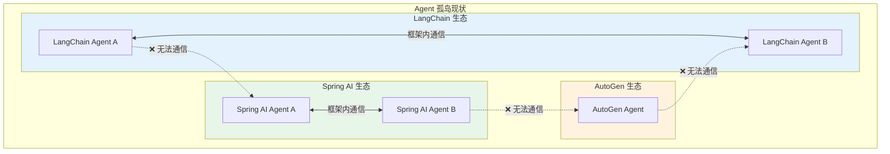
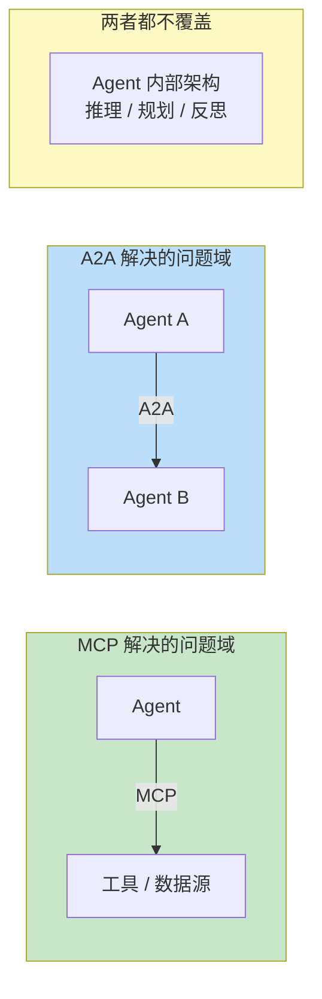
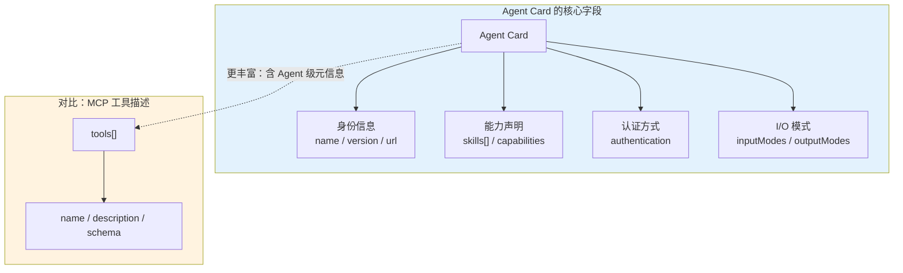
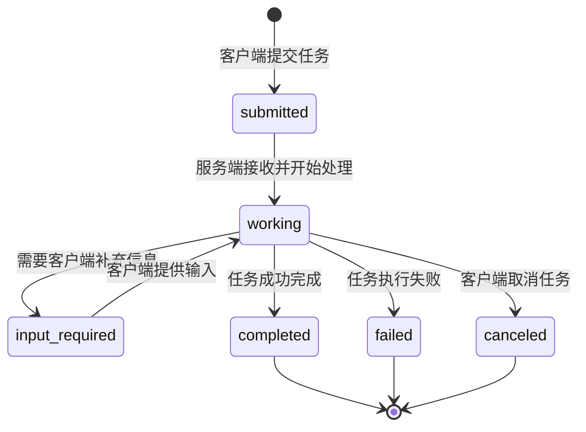
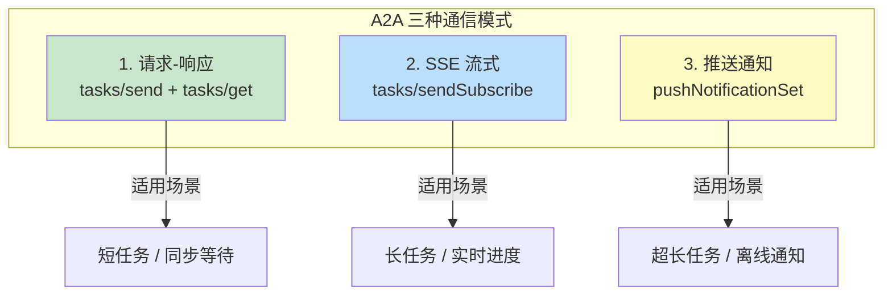
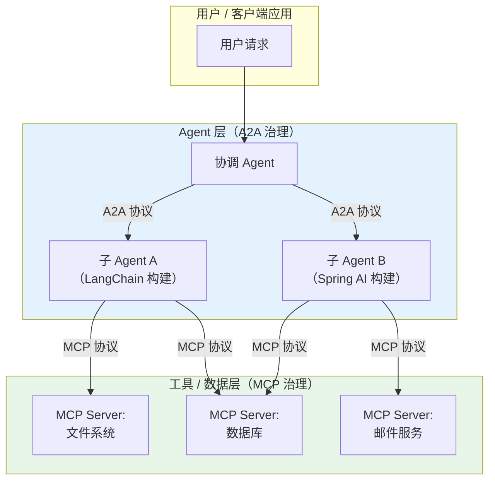
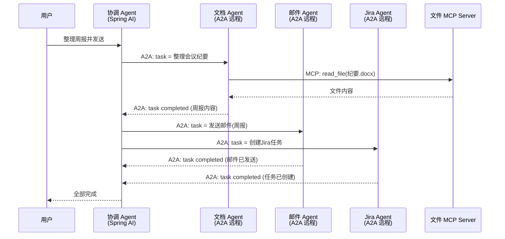
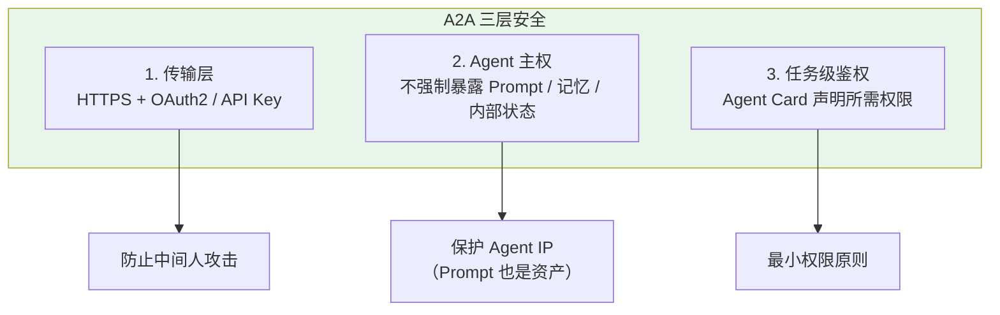
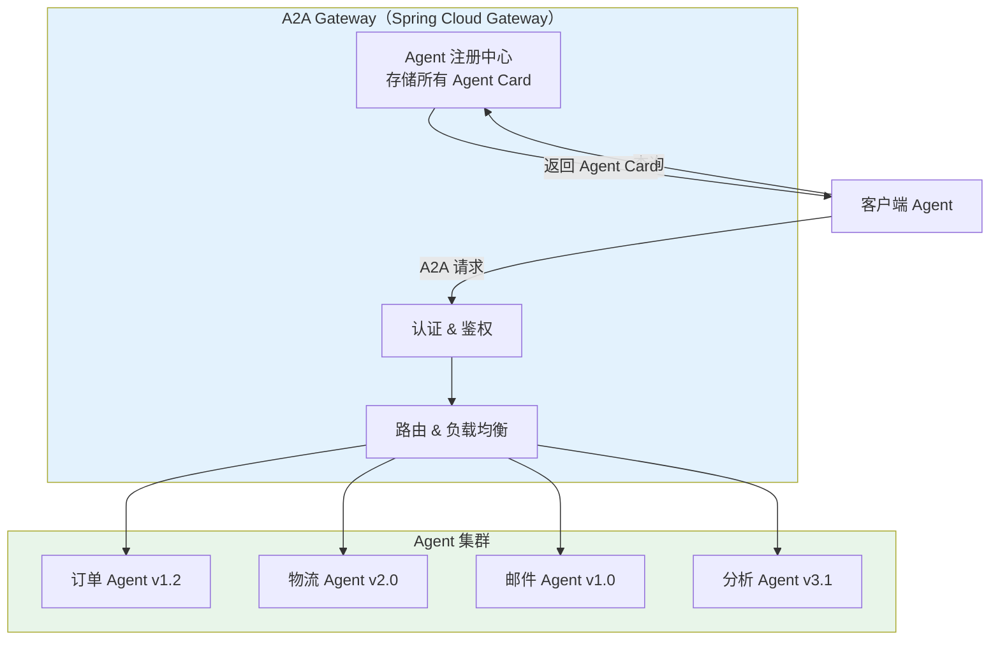
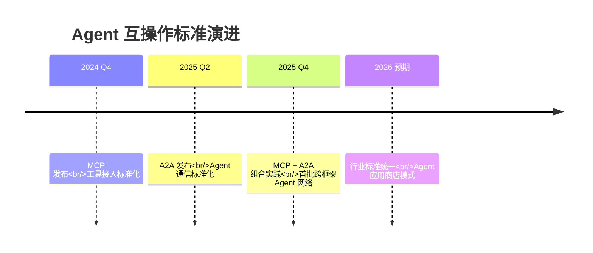

# 00-A2A 协议：Agent 互操作的未来标准

> **定位**：本文是前沿调研系列的第一篇，探索 Google 于 2025 年提出的 Agent-to-Agent（A2A）协议。A2A 旨在解决不同厂商、不同框架构建的 Agent 之间"无法对话"的问题，与 MCP 形成"能力接入"与"Agent 通信"的双标准格局。本文调研其设计理念、架构、与 MCP 的关系，以及在 Java/Spring 生态中的落地可能。
>
> **性质声明**：本文为调研性质，A2A 协议尚处于早期发展阶段，部分内容基于公开规范草案和社区讨论，可能与最终标准存在差异。

---

## 1. 为什么需要 A2A：Agent 孤岛问题

### 1.1 当今 Agent 生态的碎片化现状

2024-2025 年，Agent 框架百花齐放——LangChain Agent、AutoGen、CrewAI、Spring AI Agent、Dify、Coze——每个框架都能构建强大的 Agent，但它们之间存在一道隐形的墙。



核心矛盾在于：**每个框架都定义了自己的 Agent 通信格式、任务委派协议和消息结构**。一个 Spring AI 构建的"订单处理 Agent"无法直接调用一个 LangChain 构建的"邮件通知 Agent"——必须人工写适配代码。

### 1.2 MCP 解决了一半的问题

[教程 01-WebFlux与响应式编程/01-Reactor核心 协议](../教程/02-SpringAI核心机制/01-MCP协议.md) 中我们深入讨论过，MCP 解决的是 **Agent 如何连接工具和数据源** 的标准化问题。MCP 让一个 Agent 可以统一地调用文件系统、数据库、GitHub 等外部能力。

但 MCP 刻意回避了另一个维度的问题：**Agent 之间如何通信？**



MCP 是 **纵向** 的——连接 Agent 与工具。A2A 是 **横向** 的——连接 Agent 与 Agent。两者正交，缺一不可。

---

## 2. A2A 协议核心设计

### 2.1 设计理念

A2A 协议由 Google 于 2025 年 4 月公开发布（基于 Apache 2.0 许可），其核心设计理念可以概括为五条原则：

| 原则 | 含义 | 对比参照 |
|------|------|----------|
| **拥抱多模态** | Agent 间通信不限于文本，支持文件、音频、视频等 | 类似 HTTP 的多 Content-Type |
| **以 Agent Card 自描述** | 每个 Agent 发布一个标准化的能力描述文件 | 类似 OpenAPI/Swagger |
| **默认异步** | 任务以异步方式委派和跟踪，支持长时间运行 | 类似 Job 系统 |
| **安全与隐私** | 不强制共享内部状态、Prompt、记忆 | Agent 主权不可侵犯 |
| **基于 HTTP/JSON-RPC** | 使用 Web 标准协议，不发明新传输层 | 降低实现门槛 |

### 2.2 核心概念：Agent Card

Agent Card 是 A2A 协议中最关键的概念。它是一个 JSON 文档，描述了一个 Agent 的身份、能力、认证方式和通信端点，通常托管在 `https://agent.example.com/.well-known/agent.json`。

```json
{
  "name": "订单查询助手",
  "description": "能够查询订单状态、物流信息和退换货流程的 Agent",
  "version": "1.2.0",
  "url": "https://order-agent.example.com/a2a",
  "capabilities": {
    "streaming": true,
    "pushNotifications": true
  },
  "skills": [
    {
      "id": "order_query",
      "name": "订单查询",
      "description": "根据订单号查询订单状态和物流信息",
      "tags": ["电商", "订单", "物流"],
      "inputModes": ["text"],
      "outputModes": ["text", "file"]
    }
  ],
  "authentication": {
    "type": "bearer",
    "credentials": "required"
  }
}
```

这个设计直接对标 MCP Server 的 `list_tools` 能力——但关键区别在于，Agent Card 描述的是 **一个完整的自主 Agent**，而不仅仅是工具列表。



### 2.3 任务生命周期

A2A 协议将 Agent 间的交互抽象为 **任务（Task）**，而不是简单的请求-响应。一个任务有自己的状态机：



这个状态机比传统 HTTP 请求-响应丰富得多。关键设计点：

- **`input_required` 状态**：Agent 在执行过程中可以主动暂停，要求调用方提供更多信息。这对应多轮交互场景——比如"查询订单"Agent 可能需要反问"请提供您的用户 ID"。
- **`working` 可长时间持续**：一个 Agent 委托给另一个 Agent 的任务可以持续数小时甚至数天（如"分析这份财报并生成报告"），期间调用方可以轮询或通过 Webhook 接收通知。
- **`canceled` 支持取消**：调用方随时可以取消已提交的任务，这对成本控制至关重要。

### 2.4 通信模式

A2A 支持三种通信模式，覆盖不同的交互场景：



值得注意的是 SSE 流式模式——它与我们 [教程 01-WebFlux与响应式编程/00-WebFlux从零入门 流式通信](../教程/02-SpringAI核心机制/00-SSE流式通信.md) 中讲的 SSE 完全一致。A2A 直接复用了 SSE 作为 Agent 间的流式通信协议，这意味着 Spring WebFlux 天然可以支持 A2A 的流式任务。

---

## 3. A2A 与 MCP 的关系：互补而非竞争

### 3.1 分层视角

最常见的问题就是："A2A 会替代 MCP 吗？" 答案是明确的：**不会**。两者解决的是不同层面的问题，可以组合使用。



在上图中：
- **A2A** 治理 Agent 之间的横向通信——谁委派任务给谁，任务状态如何流转，结果如何返回。
- **MCP** 治理 Agent 与工具之间的纵向连接——Agent 如何发现和调用数据库、文件系统等外部能力。

一个 Agent 可以 **同时** 使用两种协议：对其他 Agent 暴露 A2A 端点，对工具使用 MCP 客户端。

### 3.2 对比矩阵

| 维度 | MCP | A2A |
|------|-----|-----|
| **解决的问题** | Agent → 工具/数据源 | Agent → Agent |
| **连接方向** | 纵向 | 横向 |
| **通信单元** | Tool Call（同步调用） | Task（异步任务，含状态机） |
| **发现机制** | Server 自描述 tools[] | Agent Card（含 skills） |
| **提出方** | Anthropic | Google |
| **许可** | Apache 2.0 | Apache 2.0 |
| **成熟度** | 较成熟，Spring AI 已支持 | 早期阶段，生态建设中 |
| **状态管理** | 无状态（每次调用独立） | 有状态（任务生命周期） |
| **Spring AI 支持** | 2.0 原生支持 | 尚未原生支持 |

### 3.3 一个实际场景

假设你在构建一个"企业 IT 助手"Agent，它需要协调多个子 Agent 来完成一个复杂请求："帮我把上周的会议纪要整理成周报，发送给团队，并在 Jira 上创建跟踪任务"。



在这个场景中，A2A 负责协调三个异构 Agent，MCP 负责文档 Agent 对文件系统的访问。两种协议各司其职，互不冲突。

---

## 4. A2A 的技术细节

### 4.1 JSON-RPC 2.0 作为消息格式

A2A 使用 JSON-RPC 2.0 作为消息格式，这是一个成熟、轻量的 RPC 协议。核心方法包括：

| 方法 | 用途 | 语义 |
|------|------|------|
| `tasks/send` | 发送任务 | 创建新任务或向已有任务追加消息 |
| `tasks/get` | 查询任务状态 | 获取任务当前状态和已有产出 |
| `tasks/sendSubscribe` | 发送并订阅 | 创建任务并通过 SSE 接收实时更新 |
| `tasks/cancel` | 取消任务 | 终止正在执行的任务 |
| `tasks/pushNotificationSet` | 设置推送 | 注册 Webhook 以接收异步通知 |

### 4.2 Artifact 概念

A2A 区分两种输出：
- **Message**：Agent 间的对话消息（文本、文件等），有 `role`（user/agent）。
- **Artifact**：任务产生的"最终产品"——可以是文件、图片、结构化数据等。

这个区分非常巧妙：**消息是过程，Artifact 是结果**。调用方可以只关心 Artifact 而忽略中间对话，也可以检查 Message 来理解 Agent 的推理过程。

### 4.3 安全模型

A2A 的安全设计体现在三个层面：



第二个层面尤为重要——在企业环境中，Agent 的 Prompt、知识库、记忆是核心资产。A2A 不要求 Agent 暴露这些内部信息，只要求暴露输入输出接口。这与 MCP 的理念一致：**工具/Agent 是黑箱，只有接口是契约**。

---

## 5. 在 Spring 生态中的潜在落地

### 5.1 架构设想

虽然 Spring AI 尚未原生支持 A2A，但基于 Spring Boot 4.1 + WebFlux 的基础设施，实现一个 A2A 兼容的 Agent 端点是直接的：

```java
// 概念代码：A2A Agent 端点（基于 Spring WebFlux）
@RestController
@RequestMapping("/a2a")
public class A2AEndpointController {

    private final AgentTaskManager taskManager;

    @PostMapping(value = "/tasks/sendSubscribe",
                 produces = MediaType.TEXT_EVENT_STREAM_VALUE)
    public Flux<ServerSentEvent<TaskUpdate>> sendSubscribe(
            @RequestBody A2ATaskRequest request) {

        return taskManager.submitAndSubscribe(request)
            .map(update -> ServerSentEvent.<TaskUpdate>builder()
                .id(update.taskId())
                .event(update.state().name())
                .data(update)
                .build());
    }

    @GetMapping("/tasks/{taskId}")
    public Mono<A2ATask> getTask(@PathVariable String taskId) {
        return taskManager.getTask(taskId);
    }
}

// Agent Card 端点
@RestController
public class AgentCardController {

    @GetMapping("/.well-known/agent.json")
    public AgentCard agentCard() {
        return AgentCard.builder()
            .name("订单查询助手")
            .version("1.0.0")
            .url("https://order-agent.example.com/a2a")
            .skills(List.of(
                Skill.builder()
                    .id("order_query")
                    .name("订单查询")
                    .build()
            ))
            .build();
    }
}
```

### 5.2 与现有 Spring AI 概念的映射

| A2A 概念 | Spring AI 对应 | 说明 |
|-----------|---------------|------|
| Agent | `ChatClient` + Tools + Memory | 一个完整的 Spring AI Agent |
| Agent Card | 无直接对应（可新增 `@AgentCard`） | 需要新增注解自动生成 |
| Task | `ChatClient` 的一次对话流 | 可包装为异步 Task |
| Skill | `@Tool` 注解的方法 | 工具即能力 |
| Artifact | 结构化输出（`entity(Class)`） | `BeanOutputConverter` 产物 |
| SSE 流式 | `stream().content()` | 原生支持 |
| Push Notification | Webhook | 需额外实现 |

### 5.3 企业级 A2A Gateway 架构

在微服务环境中，可以构建一个 A2A Gateway 来集中管理所有 Agent 的注册、发现和路由：



这个架构与 [教程 04-企业级架构主干/01-微服务拆分与Agent部署](../教程/04-企业级架构主干/01-微服务拆分与Agent部署.md) 中讨论的微服务 Agent 部署模式高度契合——A2A 可以作为 Agent 微服务间的通信标准。

---

## 6. A2A 面临的挑战

### 6.1 生态碎片化风险

A2A 本身试图解决 Agent 孤岛问题，但它自己也可能成为又一个"标准"。当前 Agent 通信领域存在多种方案：

- **A2A**（Google）
- **OpenAI Swarm** 的 handoff 机制
- **AutoGen** 的 conversable agent 模式
- **MCP 作为 Agent 间通信的误用**

如果各厂商不真正拥抱 A2A，它可能沦为"Google 生态专用协议"。

### 6.2 语义互操作性

Agent Card 可以声明"我有订单查询能力"，但不同 Agent 对"订单查询"的语义理解可能完全不同——返回的数据结构、错误处理方式、认证要求都可能不一致。A2A 解决了**传输层**的互操作，但 **语义层** 的互操作需要额外的 Schema 标准化。

### 6.3 企业级治理空白

当前 A2A 规范没有涉及以下企业级关注点：

| 关注点 | A2A 现状 | 企业需求 |
|--------|---------|----------|
| **审计日志** | 未规定 | 所有 Agent 间任务需审计 |
| **成本归因** | 未规定 | 任务级 Token 成本追踪 |
| **SLA 管理** | 未规定 | Agent 响应时间保证 |
| **熔断降级** | 未规定 | Agent 不可用时自动降级 |
| **多租户** | 未规定 | 租户间任务隔离 |

这些正是我们在 [教程 08-架构师进阶/09-Agent治理与合规框架](../教程/08-架构师进阶/09-Agent治理与合规框架.md) 和 [教程 04-企业级架构主干/06-多租户隔离与资源治理](../教程/04-企业级架构主干/06-多租户隔离与资源治理.md) 中深入讨论的主题——A2A 需要与企业级治理框架结合才能真正落地。

---

## 7. 未来展望与调研建议

### 7.1 发展趋势



### 7.2 对 Spring AI 生态的调研建议

1. **关注 Spring AI 路线图**：预计 Spring AI 会在 2026 年考虑 A2A 的原生支持，类似于当前的 MCP 集成模式。
2. **提前抽象 Agent 接口**：当前设计中将 Agent 能力暴露为 REST API 的实践，可以轻松适配为 A2A 端点。
3. **Agent Card 先行**：即使不立即实现 A2A，也可以先为每个 Agent 维护一个类似 Agent Card 的能力描述文件，为未来迁移做准备。
4. **参与社区**：A2A 规范仍在演进中，Java/Spring 社区的反馈对协议设计有重要影响。

### 7.3 何时采用 A2A

| 场景 | 是否建议采用 A2A | 理由 |
|------|-----------------|------|
| 单框架内多 Agent 协作 | 否 | 框架内通信更高效（如 Spring AI 内部的 Agent 委派） |
| 跨框架/跨厂商 Agent 协作 | 是 | A2A 是目前唯一的开放标准 |
| Agent 能力对外发布 | 是 | Agent Card 提供标准化发现机制 |
| 内部微服务 Agent 通信 | 可选 | REST/gRPC 也能工作，A2A 增加了语义层 |
| 需要强一致性的事务场景 | 否 | A2A 的异步任务模型不适合分布式事务 |

---

## 8. 总结

A2A 协议代表了 Agent 互操作性领域的一个重要里程碑。与 MCP 的关系可以精炼概括为：

> **MCP 让 Agent 能用工具，A2A 让 Agent 能找伙伴。**

核心要点回顾：

1. **定位清晰**：A2A 解决的是 Agent 之间的横向通信问题，与 MCP 的纵向工具接入形成互补。
2. **设计务实**：基于 HTTP/JSON-RPC/SSE 等 Web 标准，实现门槛低；Agent Card 提供了优雅的服务发现机制。
3. **异步任务模型**：Task 状态机比简单的 RPC 更适合 Agent 交互的长时间、多轮次特性。
4. **生态早期**：协议本身设计合理，但生态成熟度远不及 MCP，企业级治理特性（审计、成本、SLA）尚需补充。
5. **Spring 生态展望**：虽然 Spring AI 尚未原生支持 A2A，但 WebFlux + SSE 基础设施使落地成本可控。

对于 Java Agent 架构师而言，现阶段的最佳策略是：**持续关注、提前设计、谨慎采用**。在你的 Agent 架构中预留好 Agent Card 式的能力描述层，当 A2A 生态成熟时即可快速接入。
