# 01-Agent 操作系统：自主智能体的运行时基础设施

> **定位**：本文调研"Agent OS"这一前沿概念——当 Agent 从单进程应用演变为需要调度、隔离、计费的分布式系统时，是否需要一套类似传统 OS 的中间层？本文探索 Agent OS 的核心理念、架构设计、关键技术挑战，以及与 Spring Boot 运行时的关系。
>
> **性质声明**：本文为调研性质，Agent OS 概念尚处于学术界和工业界的早期探索阶段，没有公认的标准定义。本文综合多家观点（MIT-IBM Watson AI Lab、Google、清华大学等）给出一个面向 Java 架构师的解读。

---

## 1. 为什么需要 Agent OS

### 1.1 从应用到平台：Agent 的演化困境

当前大多数 Agent 开发还停留在"应用"层面——一个 Spring Boot 应用里跑一个或几个 Agent，共享同一个 JVM 进程。这在演示和中小规模场景下没问题，但当你需要在生产环境运行数百个 Agent 时，会遭遇以下系统性困境：

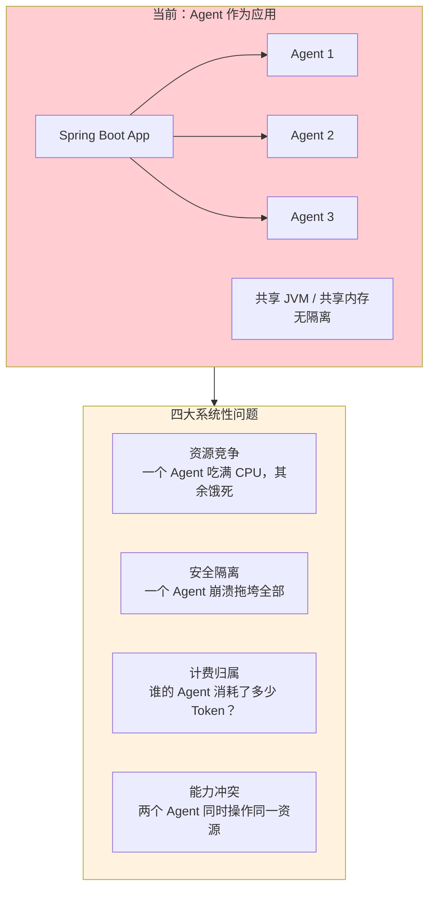

这四大困境——资源竞争、安全隔离、计费归属、能力冲突——正是操作系统在几十年前就为传统进程解决的问题。Agent 需要类似的抽象。

### 1.2 类比：传统 OS vs Agent OS

Agent OS 的核心思想是：把 Agent 类比为"进程"，用操作系统级别的抽象来管理它们。

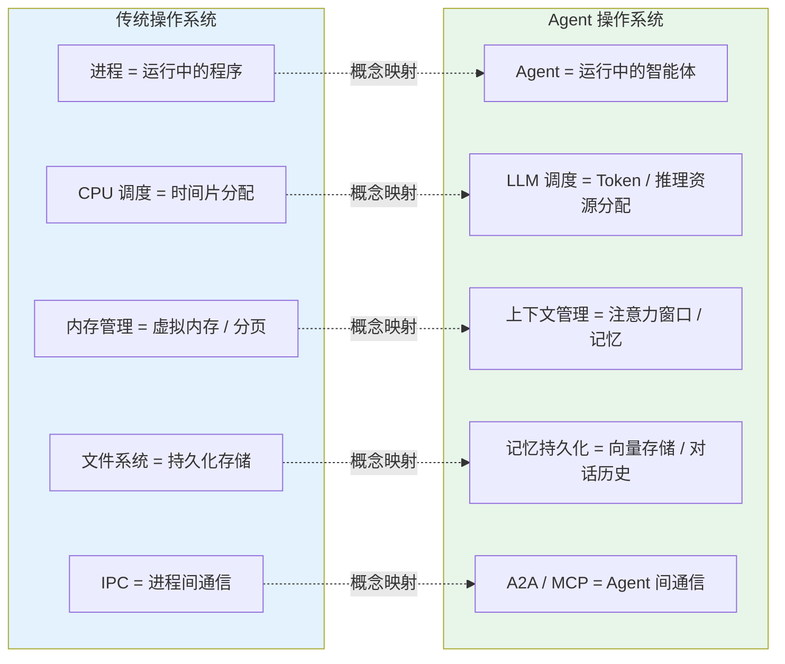

这个类比不仅是学术类比——它可以直接映射到架构设计决策。

---

## 2. Agent OS 的核心架构

### 2.1 分层架构

基于现有研究和工业实践，Agent OS 的架构可以划分为五个层次：

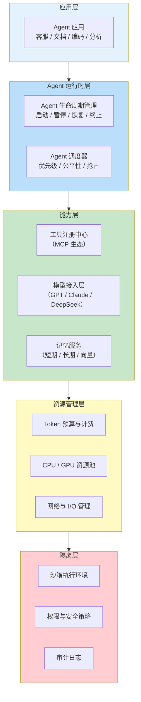

### 2.2 Agent 进程抽象

在 Agent OS 中，每个 Agent 被抽象为一个"Agent 进程"，拥有以下属性：

```java
// 概念模型：Agent 进程描述符
public record AgentProcess(
    String agentId,              // 唯一标识
    String agentName,            // 名称
    AgentState state,            // 状态：CREATED / RUNNING / PAUSED / TERMINATED
    ResourceQuota quota,         // 资源配额
    List<Permission> permissions,// 权限列表
    MemorySpace memorySpace,     // 记忆空间（隔离的）
    Instant createdAt,           // 创建时间
    Duration cpuTime,            // 累计推理时间
    long tokenConsumed           // 累计 Token 消耗
) {}

public record ResourceQuota(
    int maxConcurrentLLMCalls,   // 最大并发 LLM 调用数
    long dailyTokenLimit,        // 每日 Token 上限
    Duration maxExecutionTime,   // 单次任务最大执行时间
    long maxMemoryMB             // 最大记忆存储
) {}
```

这个抽象直接借鉴了 Unix 进程模型——`cpuTime` 对应 CPU 时间，`tokenConsumed` 对应资源消耗，`ResourceQuota` 对应 `ulimit`。

### 2.3 Agent 状态机

Agent OS 中的 Agent 有明确的生命周期状态机，与 [教程 01-WebFlux与响应式编程/02-背压与流量控制 状态管理](../教程/02-SpringAI核心机制/02-Agent状态管理.md) 中讨论的业务层状态不同，这是 **运行时级别** 的状态：

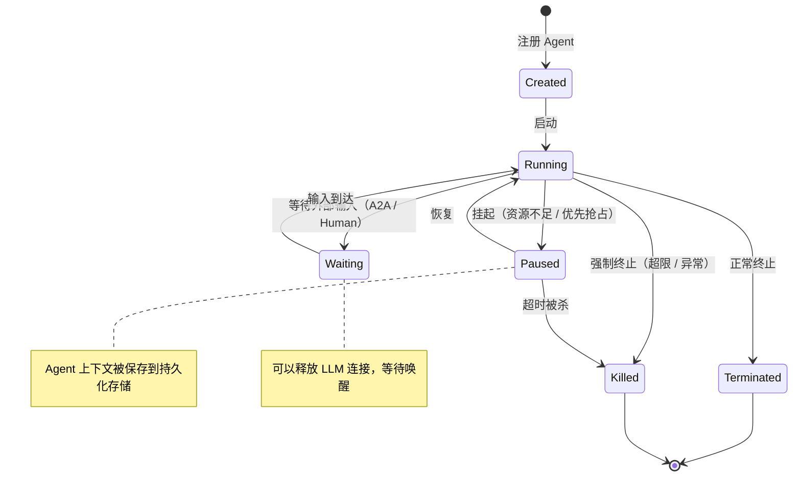

---

## 3. 调度器：Token 就是新 CPU

### 3.1 调度问题的本质

传统 OS 调度器管理的是 CPU 时间片——多个进程争抢有限的 CPU 核心。Agent OS 调度器管理的是 **LLM 推理资源**——多个 Agent 争抢有限的模型推理能力和 Token 预算。

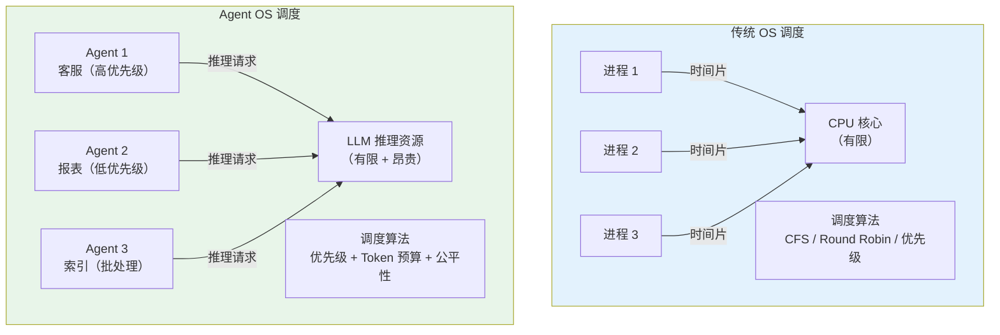

Agent OS 调度器需要在以下维度做权衡：

| 维度 | 说明 | 对应传统 OS 概念 |
|------|------|-----------------|
| **优先级** | 客服 Agent 优先级高于后台索引 Agent | nice value |
| **公平性** | 每个租户的 Agent 都能获得推理资源 | CFS 带宽控制 |
| **成本控制** | 不能让一个 Agent 耗尽 Token 预算 | cgroup 内存限制 |
| **延迟** | 用户交互 Agent 需要低延迟响应 | 实时调度 |
| **吞吐** | 后台批量 Agent 需要高吞吐 | 批处理调度 |

### 3.2 调度算法设想

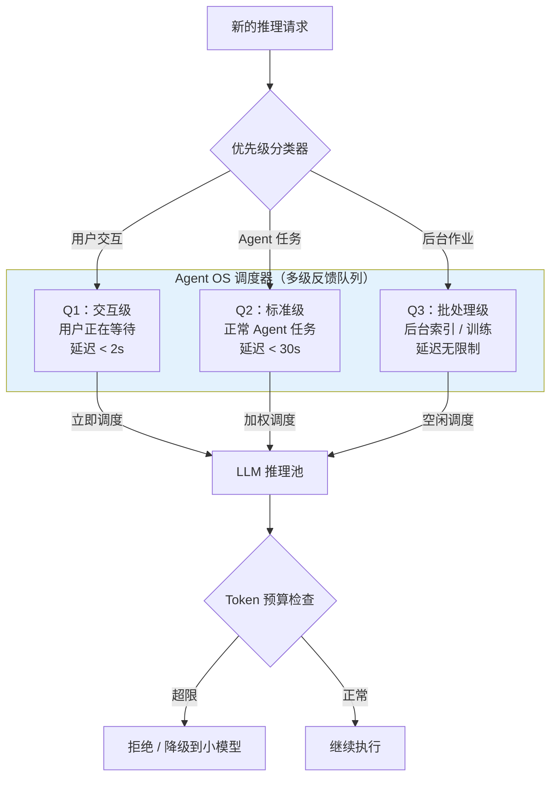

这种多级反馈队列设计借鉴了 Linux 的 CFS + nice + cgroup 的组合策略，但将"CPU 时间"替换为"Token 消耗"作为核心资源度量。

---

## 4. 记忆管理：Agent 的"虚拟内存"

### 4.1 记忆层级架构

传统 OS 的内存层级是：寄存器 → L1/L2/L3 Cache → RAM → Swap → Disk。Agent OS 的记忆层级有惊人的对应关系：

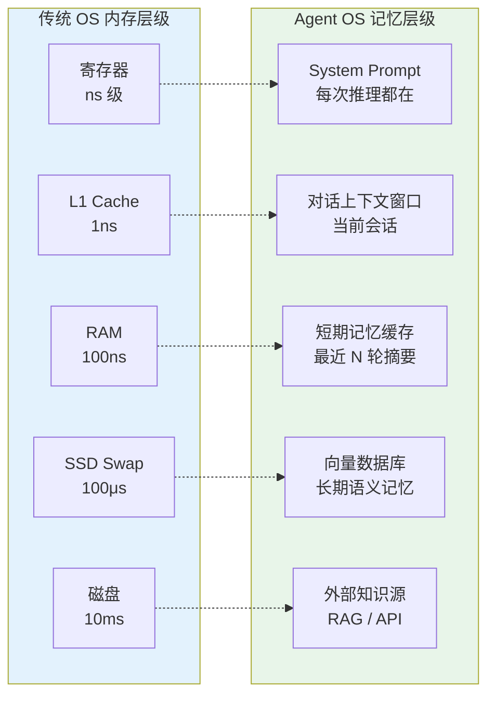

### 4.2 记忆交换（Memory Swap）

当 Agent 的上下文窗口超出模型限制时，Agent OS 需要做类似"内存换页"的操作——将部分记忆从上下文窗口"换出"到外部存储，需要时再"换入"：

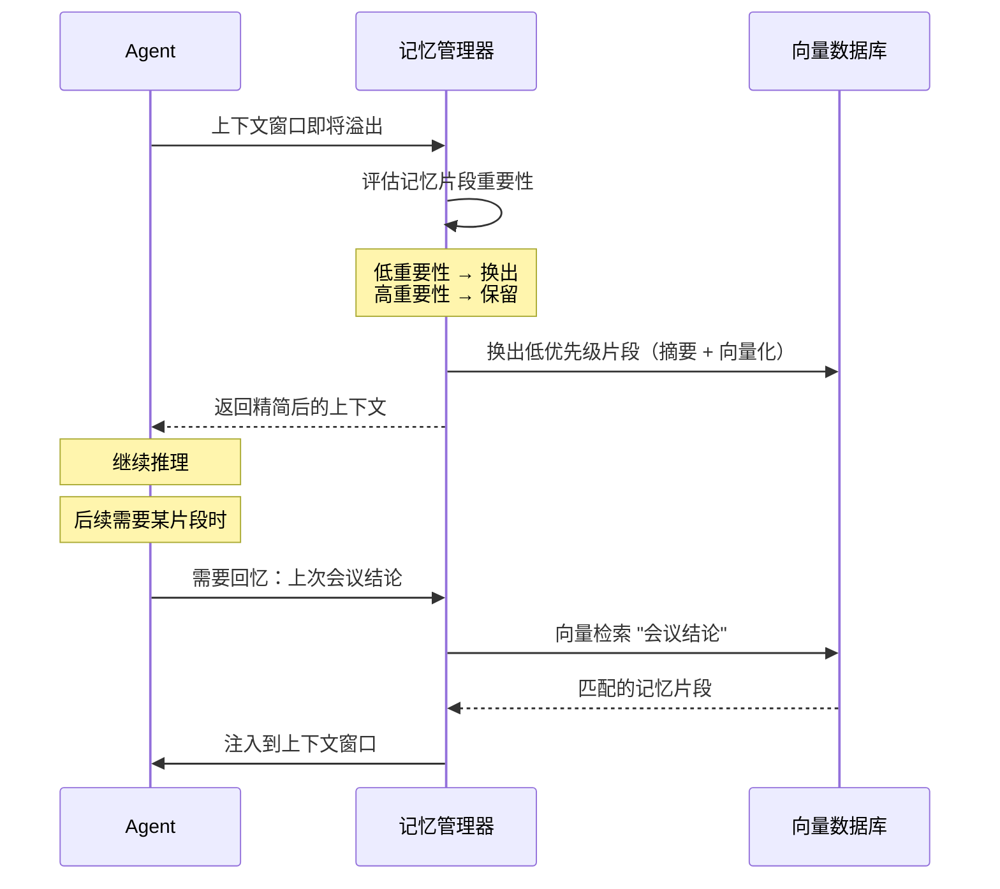

这个机制与我们 [教程 08-架构师进阶/05-高级记忆架构](../教程/08-架构师进阶/05-高级记忆架构.md) 和 [教程 08-架构师进阶/00-上下文工程](../教程/08-架构师进阶/00-上下文工程.md) 中讨论的记忆压缩和上下文窗口管理是一致的，Agent OS 将其从应用层提升到了运行时层。

### 4.3 记忆隔离

在多租户 Agent OS 中，不同租户的 Agent 记忆必须严格隔离——这对应了 OS 中的进程地址空间隔离：

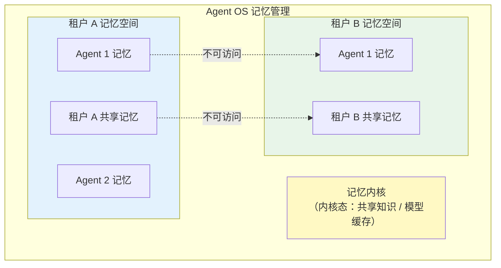

这与 [教程 04-企业级架构主干/06-多租户隔离与资源治理](../教程/04-企业级架构主干/06-多租户隔离与资源治理.md) 中的多租户架构直接对应——Agent OS 提供运行时级别的记忆隔离，而不是依赖应用层手动处理。

---

## 5. 工具与文件系统

### 5.1 MCP 作为 Agent OS 的"文件系统"

传统 OS 有文件系统来统一管理存储资源。在 Agent OS 中，**MCP 生态扮演了类似的角色**——它统一了 Agent 访问外部能力的方式。

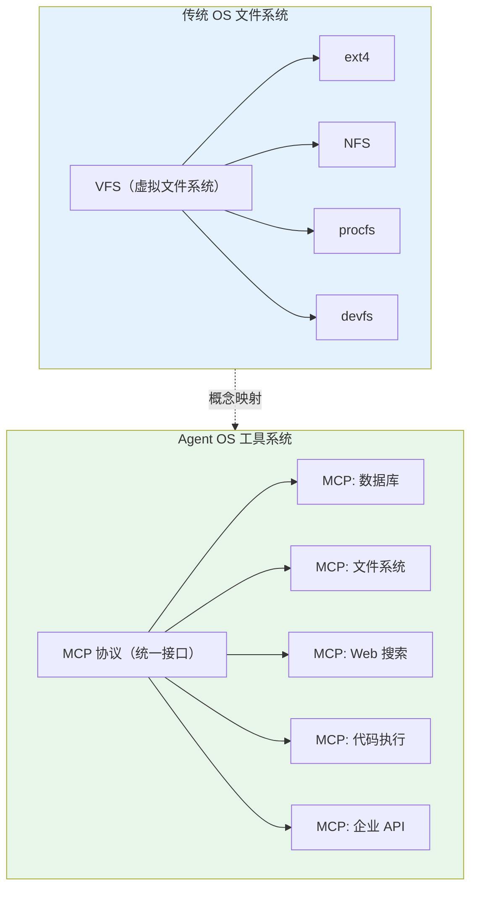

Agent OS 中的"文件权限"对应于 MCP Server 的能力控制——Agent 只能访问被授权的 MCP Server。

### 5.2 能力即文件

在 Unix 中"一切皆文件"，在 Agent OS 中可以类比"一切皆工具"：

```java
// Agent OS 中的"标准库"
public interface AgentOS {
    // 类似 stdin / stdout
    Flux<String> readInputStream();
    void writeOutputStream(String content);
    
    // 类似文件系统操作
    ToolHandle openTool(String toolName);  // open()
    Object callTool(ToolHandle handle, Map<String, Object> args);  // read/write
    void closeTool(ToolHandle handle);  // close()
    
    // 类似进程间通信
    void sendToAgent(String agentId, Message msg);  // kill -USR1
    Flux<Message> receiveFromAgents();  // signal handler
}
```

---

## 6. 安全与权限模型

### 6.1 Capability-based Security

Agent OS 应该采用基于能力的安全模型（Capability-based Security），而不是传统的 ACL 模型。原因在于 Agent 的自主性——它可能在运行时动态决定调用什么工具，ACL 的静态授权太僵硬。

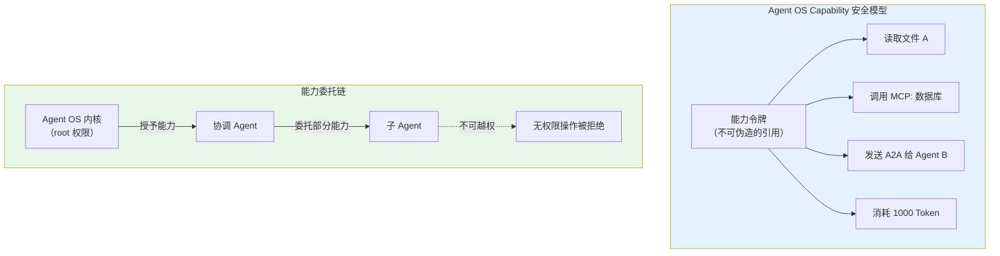

### 6.2 沙箱执行

Agent 在执行工具调用时，必须在沙箱中运行——类似浏览器的沙箱机制：

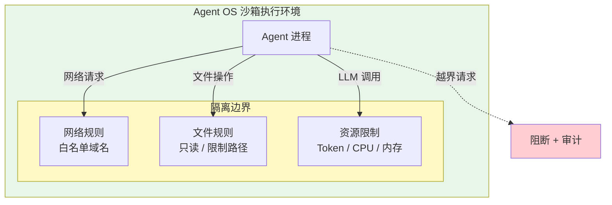

---

## 7. 现有实现与研究方向

### 7.1 学术界

| 项目 | 来源 | 核心贡献 |
|------|------|----------|
| **AIOS** | Rutgers University | 首个学术级 Agent OS 原型，定义了调度器和记忆管理 |
| **AutoGen Studio** | Microsoft | Agent 编排平台，包含基础的 Agent 生命周期管理 |
| **AgentScope** | 阿里巴巴 | 分布式 Agent 框架，提供容错和调度能力 |

### 7.2 工业界

| 产品 | 定位 | 与 Agent OS 的关系 |
|------|------|-------------------|
| **Kubernetes + AI 扩展** | 容器编排 + GPU 调度 | 基础设施层，不含 Agent 语义 |
| **Dify** | Agent 应用平台 | 应用层 PaaS，不涉及 OS 级抽象 |
| **LangGraph Cloud** | Agent 编排云 | 最接近 Agent OS 理念的商业实现 |
| **Spring AI + 运行时扩展** | Java 生态 | 有潜力在 JVM 层实现 Agent OS 抽象 |

### 7.3 Java/Spring 生态的机遇

Java 生态在构建 Agent OS 方面有独特优势：

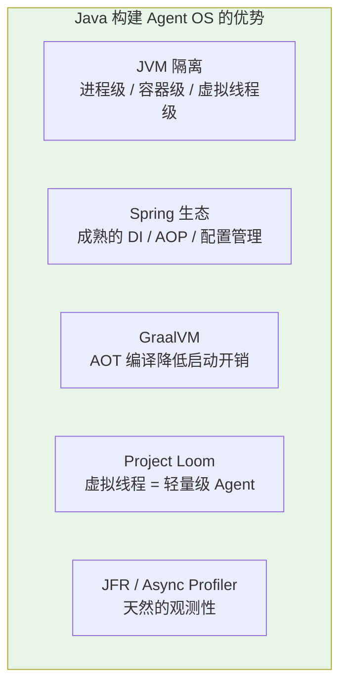

特别是 **虚拟线程（Virtual Threads）** 与 Agent OS 的契合度极高——每个 Agent 可以运行在一个虚拟线程上，实现数万级 Agent 并发，而无需 OS 级线程开销。我们在 [附录-虚拟线程](../附录/00-Java21新特性/00-虚拟线程.md) 中详细讨论了这个特性。

---

## 8. 企业级 Agent OS 架构设想

综合以上调研，一个企业级 Agent OS 的参考架构如下：

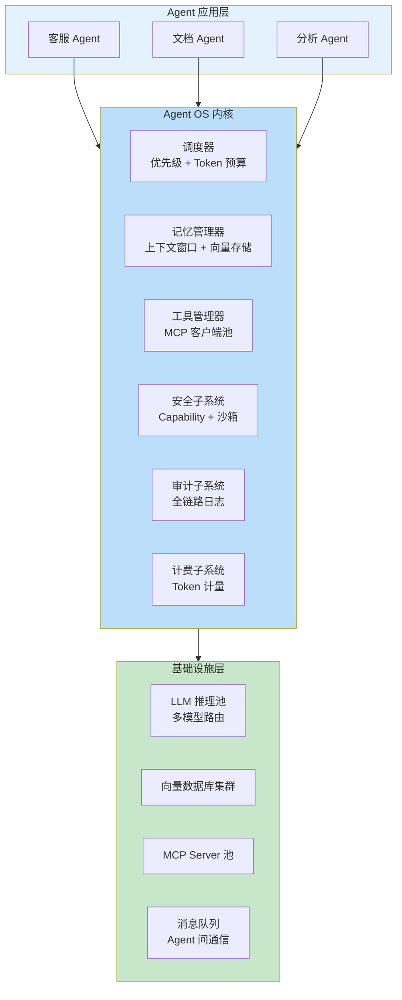

这个架构与我们在 [教程 04-企业级架构主干/00-管控分离架构](../教程/04-企业级架构主干/00-管控分离架构.md) 中讨论的"数据面/控制面分离"理念一致——Agent OS 内核就是控制面，Agent 应用是数据面。

---

## 9. 总结

Agent OS 是一个前瞻性概念，它将操作系统级的抽象引入 Agent 管理。核心调研发现如下：

1. **四大基石**：调度器（Token 即 CPU）、记忆管理（上下文即内存）、工具系统（MCP 即文件系统）、安全沙箱（Capability 即权限）。
2. **与传统 OS 的深度对应**：几乎每个 OS 概念（进程、调度、内存管理、IPC、文件系统、权限）都能在 Agent 领域找到对应物，说明 Agent OS 不是凭空发明，而是对成熟理念的迁移。
3. **Java 生态有天然优势**：JVM 隔离、虚拟线程、Spring 生态、GraalVM 使 Java 成为构建 Agent OS 的理想平台。
4. **现有实现的差距**：目前没有真正意义上的"Agent OS"产品——学术原型过于简化，商业平台停留在应用层。
5. **演进路径**：Agent OS 不会一蹴而就，而是从当前的 Agent 框架逐步抽象和分层演化而来。Spring AI 2.0 的模块化设计已经为这种演化埋下了伏笔。

对于 Java Agent 架构师而言，理解 Agent OS 的概念有助于在当前架构中做出更好的前瞻性设计——即使你不会构建一个完整的 OS，但其调度、隔离、记忆管理的思想可以直接应用于今天的系统设计。
