# 02-多模态 Agent：视觉、音频与跨模态智能体

> **定位**：本文调研多模态 Agent 的前沿发展——当 LLM 演化为多模态大模型（LMM），Agent 不再局限于文本处理，而是能看图、听音频、分析视频、生成图像。本文探索多模态 Agent 的架构设计、Spring AI 的多模态支持现状，以及视觉 Agent 和语音 Agent 的典型应用模式。
>
> **性质声明**：本文为调研性质，多模态 Agent 技术正处于快速发展期，API 和最佳实践变化频繁。

---

## 1. 从单模态到多模态：Agent 的感知升级

### 1.1 单模态 Agent 的天花板

我们在 [教程 00-Agent 核心概念](../教程/00-Agent核心概念.md) 中定义的 Agent 是基于文本 LLM 的——输入是文本，输出也是文本。这在很多场景下足够强大，但在以下领域存在根本性瓶颈：

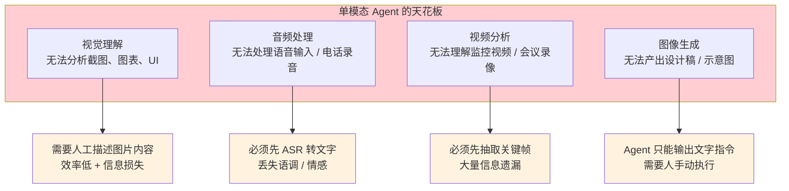

多模态 Agent 的目标就是突破这些天花板——让 Agent 直接感知和理解非文本信息。

### 1.2 LMM：Large Multimodal Model

多模态 Agent 的基础是 **多模态大模型（LMM, Large Multimodal Model）**。与 LLM 不同，LMM 能同时处理多种模态的输入：

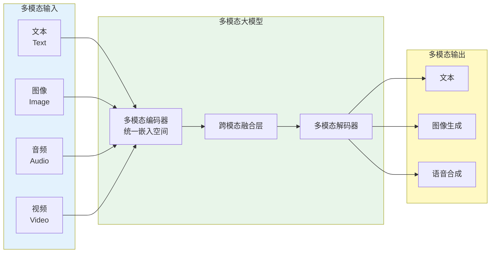

当前主流的 LMM 包括：GPT-4o（OpenAI）、Claude 3.5/4 Sonnet & Opus（Anthropic）、Gemini 2.0（Google）、Qwen-VL（阿里），它们都支持至少文本 + 图像的双模态输入。

### 1.3 多模态 Agent 的能力矩阵

| 模态组合 | 典型场景 | 当前成熟度 |
|----------|----------|-----------|
| 文本 → 图像 | UI 设计 Agent、图表生成 | 中等（DALL-E、Stable Diffusion） |
| 图像 → 文本 | 截图分析、OCR、UI 理解 | 高（GPT-4o、Claude Vision） |
| 语音 → 文本 | 语音助手、电话客服 | 高（Whisper、Azure ASR） |
| 文本 → 语音 | 语音播报、有声读物 | 高（Azure TTS、ElevenLabs） |
| 视频 → 文本 | 监控分析、视频摘要 | 早期（Gemini 2.0 开始支持） |
| 图像 → 图像 | 图像编辑、风格迁移 | 中等（InstructPix2Pix） |
| 音频 → 音频 | 实时语音对话 | 早期（GPT-4o 实时音频） |

---

## 2. 视觉 Agent：让 Agent 能"看"

### 2.1 视觉理解的核心能力

视觉 Agent 的核心是让 LMM 理解图像内容。这包括多个层次的视觉能力：

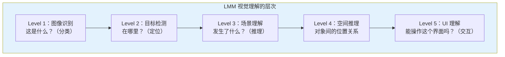

对于 Agent 架构师而言，Level 5（UI 理解）尤其重要——它使 **Computer Use Agent**（计算机使用 Agent）成为可能。Agent 可以截图屏幕，理解当前 UI 状态，然后决定点击哪里、输入什么。

### 2.2 视觉 Agent 架构

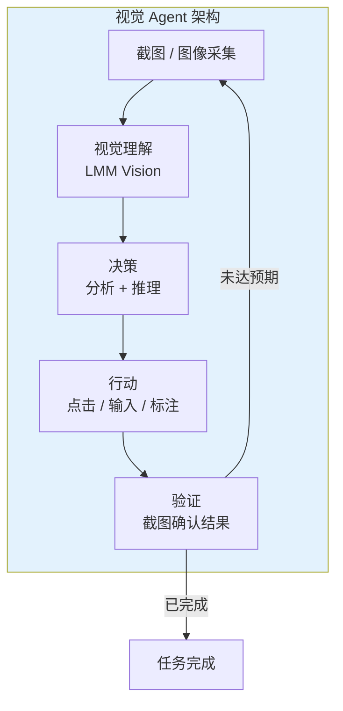

这个"感知-决策-行动-验证"循环是视觉 Agent 的核心模式。注意它与 [教程 06-ReAct 推理模式](../教程/07-ReAct推理模式.md) 中的 Thought-Action-Observation 循环是同构的——只是 Observation 从文本变成了图像。

### 2.3 典型应用：自动化测试 Agent

```java
// 概念代码：基于 Spring AI 的视觉测试 Agent
@RestController
public class VisualTestAgent {

    private final ChatClient chatClient;
    private final WebDriverManager driverManager;

    @PostMapping("/test/visual")
    public Flux<String> runVisualTest(@RequestBody TestPlan plan) {
        var driver = driverManager.getDriver();

        return chatClient.prompt()
            .user(u -> u
                .text("""
                    你是一个 UI 测试专家。请分析以下截图，
                    判断页面是否符合预期，如果不符合，描述问题。
                    测试场景：{scenario}
                    """)
                .param("scenario", plan.scenario())
                .media(MimeTypeUtils.IMAGE_PNG,
                       captureScreenshotAsResource(driver))
            )
            .stream()
            .content();
    }

    private Resource captureScreenshotAsResource(WebDriver driver) {
        var screenshot = ((TakesScreenshot) driver).getScreenshotAs(OutputType.BYTES);
        return new ByteArrayResource(screenshot);
    }
}
```

这段代码展示了 Spring AI 的多模态 API——`user()` 方法可以同时接收文本和媒体内容，底层通过 LMM 的 Vision 能力处理图像。

---

## 3. 语音 Agent：让 Agent 能"听"和"说"

### 3.1 语音 Agent 的三个层级

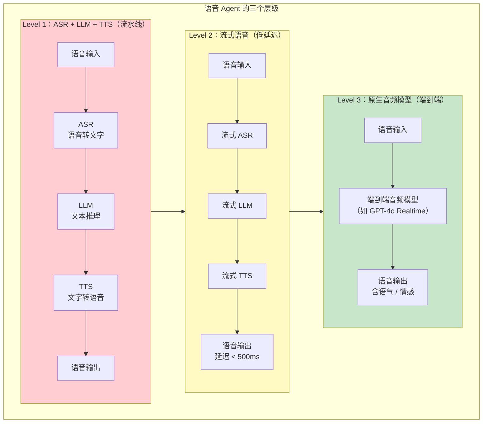

| 层级 | 延迟 | 情感保留 | 实现复杂度 | 代表方案 |
|------|------|---------|-----------|----------|
| 流水线 | 2-5s | 丢失 | 低 | Whisper + GPT + Azure TTS |
| 流式 | 0.5-1s | 部分保留 | 中 | Deepgram + LLM + ElevenLabs |
| 端到端 | <0.3s | 完整保留 | 高 | GPT-4o Realtime API |

### 3.2 语音 Agent 的独特挑战

语音 Agent 比纯文本 Agent 多了几个维度的复杂性：

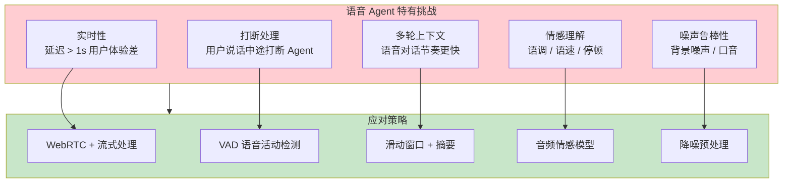

其中 **VAD（Voice Activity Detection）** 是语音 Agent 的关键技术——它判断用户何时开始说话、何时停止，是实现自然对话节奏的基础。传统电话客服系统的"用户说完了吗？"判断就是靠 VAD。

### 3.3 Spring AI 中的音频支持

Spring AI 2.0 提供了音频模型（Audio Model）的抽象：

```java
// Spring AI 音频转文字（Transcription）
@Service
public class VoiceAgentService {

    private final AudioTranscriptionModel transcriptionModel;
    private final ChatClient chatClient;
    private final TextToSpeechModel ttsModel;

    public Flux<AudioStream> handleVoice(Flux<AudioData> voiceInput) {
        // 1. 语音转文字
        var transcription = voiceInput
            .collectList()
            .flatMap(audio -> transcriptionModel.transcribe(audio));

        // 2. LLM 推理
        var response = transcription
            .flatMap(text -> chatClient.prompt()
                .user(text)
                .call()
                .content());

        // 3. 文字转语音
        return response
            .flatMapMany(ttsModel::synthesize);
    }
}
```

---

## 4. Spring AI 的多模态支持

### 4.1 多模态消息 API

Spring AI 2.0 通过 `Media` 和 `Media.ContentType` 来支持多模态输入：

```java
// 多模态消息构建
chatClient.prompt()
    .user(u -> u
        .text("分析这张图表的数据趋势，并给出投资建议")
        .media(MimeTypeUtils.IMAGE_PNG, chartImageResource)
    )
    .call()
    .content();
```

### 4.2 多模态架构在 Spring 中的集成

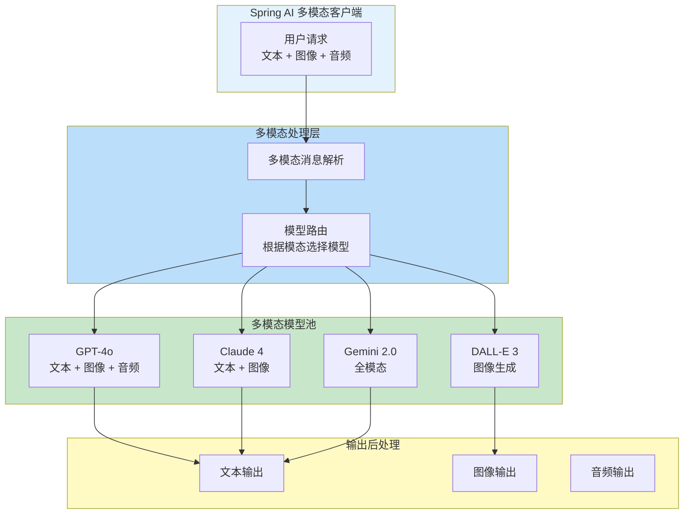

### 4.3 模型路由策略

不同 LMM 的模态支持能力不同，Spring AI 需要根据输入模态自动路由到合适的模型。这与 [教程 32-模型路由与降级](../教程/32-模型路由与降级.md) 中的模型路由策略是一致的——只是路由维度从"任务复杂度"扩展到了"输入模态"。

```java
// 多模态感知的模型路由
@Component
public class MultimodalModelRouter {

    public String selectModel(List<Media> media) {
        boolean hasImage = media.stream()
            .anyMatch(m -> m.getContentType().includes("image"));
        boolean hasAudio = media.stream()
            .anyMatch(m -> m.getContentType().includes("audio"));

        if (hasAudio) {
            return "gpt-4o";  // 唯一支持原生音频的模型
        }
        if (hasImage) {
            return "claude-4-sonnet";  // 图像理解最优
        }
        return "deepseek-v3";  // 纯文本用高性价比模型
    }
}
```

---

## 5. 多模态 Agent 应用场景

### 5.1 场景矩阵

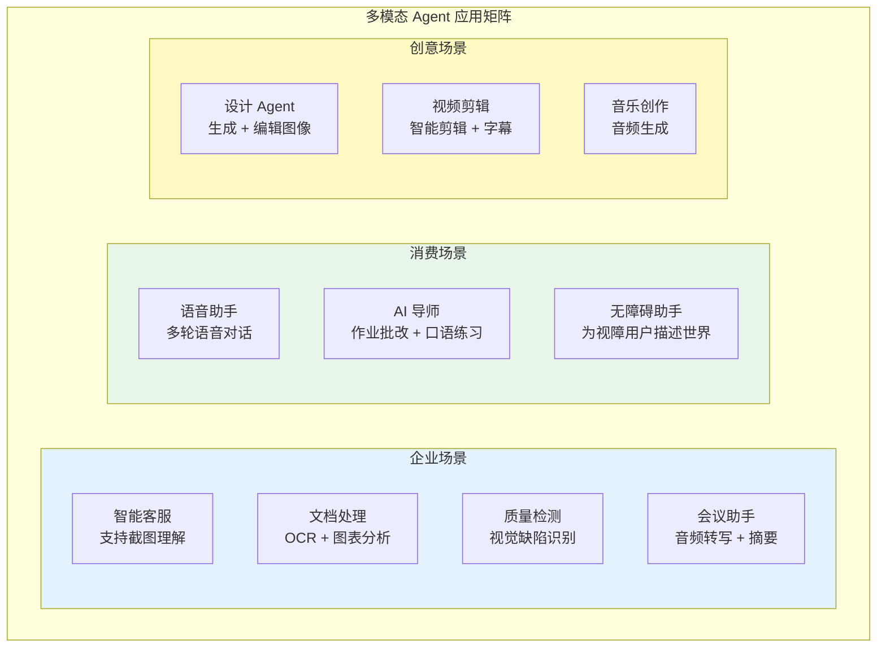

### 5.2 深度场景：多模态 RAG

传统 RAG（[教程 05-RAG 检索增强生成](../教程/05-RAG检索增强生成.md)）只处理文本。多模态 RAG 可以同时检索和生成跨模态内容：

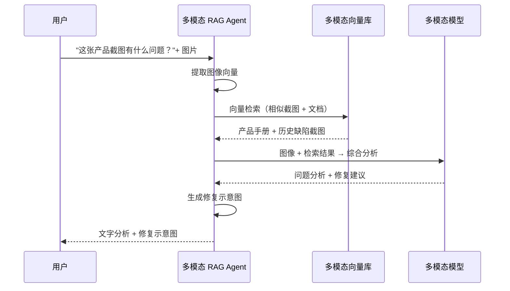

多模态 RAG 的关键技术挑战是 **跨模态对齐**——文本和图像需要在同一个向量空间中可比较，这要求使用专门的多模态嵌入模型（如 CLIP、SigLIP）。

---

## 6. 多模态 Agent 的架构挑战

### 6.1 上下文窗口膨胀

图像和音频消耗的 Token 远超文本：

| 模态 | Token 消耗（等效） | 说明 |
|------|-------------------|------|
| 文本 100 字 | ~150 Token | 基准 |
| 一张 1024x1024 图 | ~765 Token（GPT-4o） | 约等于 500 字文本 |
| 1 分钟音频 | ~1500 Token | ASR 转写后 |
| 1 分钟视频（1fps） | ~45000 Token | 每秒一帧截图 |

这意味着多模态 Agent 的上下文窗口会快速膨胀，必须更激进地管理记忆——回到 [教程 34-上下文工程](../教程/34-上下文工程.md) 和 [前沿 05-Agent 记忆前沿](05-Agent记忆前沿.md) 中讨论的记忆压缩技术。

### 6.2 延迟与吞吐权衡

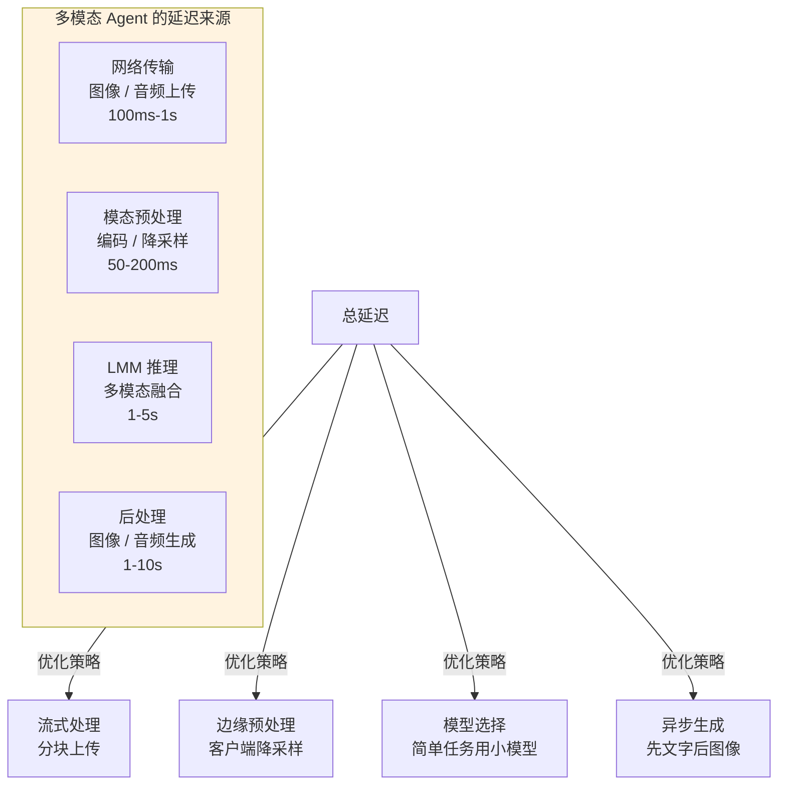

### 6.3 成本挑战

多模态模型的成本显著高于纯文本模型：

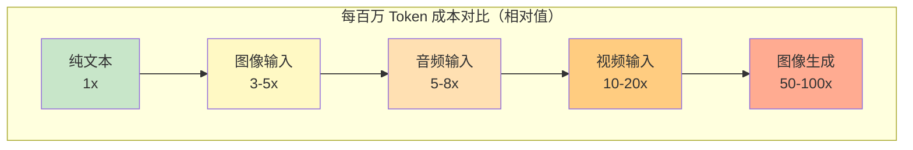

这要求多模态 Agent 必须有严格的成本治理——[教程 21-成本治理与 Token 计量](../教程/27-成本治理与Token计量.md) 中的策略需要扩展到多模态场景。

---

## 7. 技术趋势与展望

### 7.1 实时多模态交互

GPT-4o Realtime API 的出现标志着 Agent 从"轮次式交互"向"实时连续交互"演进。这意味着 Agent 需要同时处理并发到达的文本、音频、视频流，对架构设计提出了全新要求。

### 7.2 Agent 生成的多模态内容

当前 Agent 主要消费多模态输入（看图、听音频），但生成多模态输出（画图、做视频）的能力正在快速提升。未来的 Agent 将能够：

- 根据文字描述生成 UI 原型图
- 根据数据自动生成可视化图表
- 生成教学视频（含配音 + 动画）
- 编写并演奏音乐

### 7.3 具身智能（Embodied AI）

多模态 Agent 的终极形态是 **具身智能**——Agent 与物理世界交互。机器人 Agent 需要同时处理视觉（摄像头）、听觉（麦克风）、触觉（传感器），并输出物理动作。这是 Agent OS（[前沿 01](01-Agent操作系统.md)）理念的物理延伸。

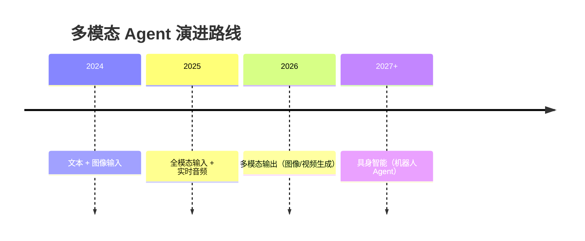

---

## 8. 总结

多模态 Agent 正在从实验室走向生产环境，核心调研发现如下：

1. **LMM 是基础**：GPT-4o、Claude 4、Gemini 2.0 等多模态大模型为 Agent 提供了视觉、音频理解能力，Spring AI 通过 `Media` API 支持多模态输入。
2. **三大应用方向**：视觉 Agent（UI 自动化、文档处理）、语音 Agent（语音助手、电话客服）、多模态 RAG（跨模态检索）各有独特的架构挑战。
3. **成本与延迟是主要瓶颈**：图像和音频 Token 消耗远超文本，要求更精细的模型路由和成本治理。
4. **实时交互是未来方向**：从轮次式到流式再到实时连续交互，Agent 架构需要全面演进。
5. **Spring AI 生态准备不足**：虽然 Spring AI 2.0 支持多模态消息，但缺乏多模态模型路由、流式音频处理、图像生成等高级特性的完整抽象。

对于 Java Agent 架构师而言，建议在当前架构中预留多模态扩展点——即使今天的 Agent 只处理文本，未来添加图像和音频能力的可能性极高。
