# 03-Agent 评测基准：如何衡量智能体的真实能力

> **定位**：本文调研 Agent 评测领域的前沿进展——当我们说一个 Agent "能力强"时，到底在说什么？AgentBench、SWE-bench、GAIA、WebArena 等基准测试如何量化 Agent 的推理、规划、编码、工具调用能力？本文梳理主流评测框架的评估维度、方法论和局限性，并给出面向 Java/Spring AI Agent 的实践建议。
>
> **性质声明**：本文为调研性质，Agent 评测是一个快速演进的交叉领域（涉及 NLP、软件工程、认知科学），现有基准存在显著局限性，结论应结合具体场景审慎解读。

---

## 1. 为什么 Agent 评测极其困难

### 1.1 从模型评测到 Agent 评测的范式跳跃

传统 LLM 评测（MMLU、HumanEval、GSM8K）面对的是"给定输入，产生一个输出"的单轮任务。而 Agent 是一个 **多步推理、多轮交互、动态决策** 的系统——评测对象从"一次回答"变成了"一段完整的行动轨迹"。

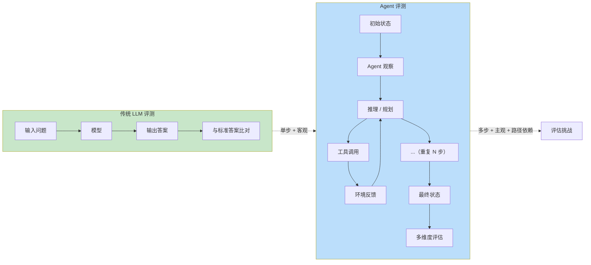

核心困难在于以下四个维度：

| 困难维度 | 说明 | 传统评测的假设 |
|----------|------|---------------|
| **路径多样性** | 同一目标可以通过不同行动序列达成 | 假设只有唯一正确答案 |
| **环境依赖** | Agent 行为效果取决于环境状态 | 假设环境是静态的 |
| **长程推理** | 失败可能在第 10 步暴露，根因在第 2 步 | 假设错误即时可见 |
| **成本敏感** | 一个 Agent 可能用 100 次工具调用完成任务，另一个只用 5 次 | 不考虑执行成本 |

### 1.2 Agent 评测的三大流派

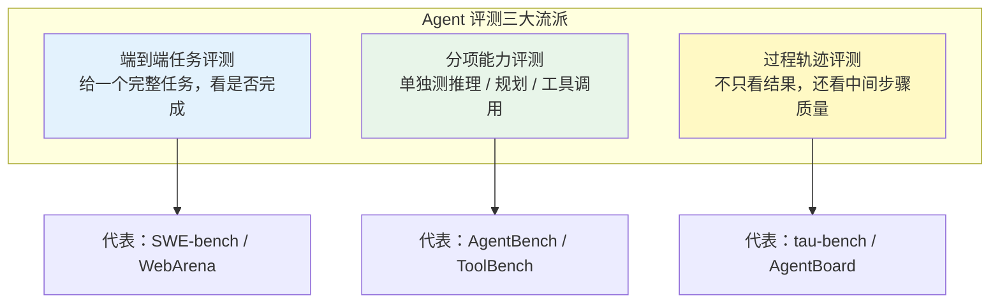

这三种流派各有适用场景。端到端评测最接近真实但难以诊断，分项评测适合研发迭代但可能遗漏系统级问题，过程评测信息量最大但人工成本极高。

### 1.3 传统软件测试范式的失效

传统软件测试有明确的"正确答案"——函数输入产生预期输出。但 Agent 的行为是 **非确定性的**——同一个 Prompt，同一个任务，Agent 可能走完全不同的推理路径，甚至给出措辞不同但语义等价的答案。

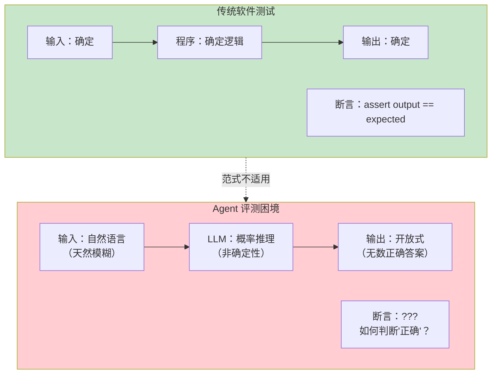

---

## 2. AgentBench：全方位分项能力评测

### 2.1 概述

AgentBench 由清华大学等机构于 2023-2024 年发布，是首个系统性评估 LLM 作为 Agent 在多种环境中交互能力的基准。它覆盖 8 个不同的任务环境，从代码执行到网页操作，从数据库查询到知识推理。

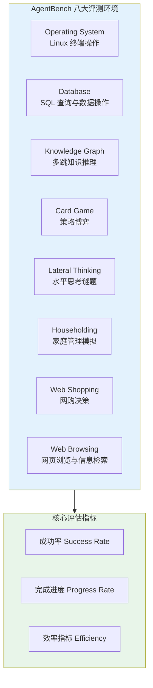

### 2.2 评估维度解析

AgentBench 的核心贡献在于揭示了不同模型在不同环境中的能力差异极为显著——一个模型可能在代码执行上表现优秀，但在策略博弈中完全失败。

| 维度 | 考察的 Agent 能力 | 与教程的关联 |
|------|-------------------|-------------|
| OS 操作 | 工具调用的准确性、错误恢复能力 | [教程 03-工具调用](../教程/03-工具调用.md) |
| 数据库 | 结构化推理、SQL 生成 | [教程 22-结构化输出](../教程/22-结构化输出.md) |
| 知识图谱 | 多步推理、信息整合 | [教程 07-ReAct 推理模式](../教程/07-ReAct推理模式.md) |
| 网页操作 | 序列规划、页面理解 | [教程 36-工作流编排](../教程/79-Agent工作流编排.md) |
| 策略博弈 | 长程规划、对手建模 | [教程 08-Plan-and-Execute 模式](../教程/08-Plan-and-Execute模式.md) |

### 2.3 AgentBench 的关键发现

AgentBench 的核心发现包括：模型规模与 Agent 能力并非线性关系（中等模型在某些任务上可能优于大模型），工具调用能力（function calling）的稳定性是 Agent 表现的分水岭，以及多轮对话中的"遗忘"问题是 Agent 失败的主要原因之一。

---

## 3. SWE-bench：软件工程能力的终极考试

### 3.1 概述

SWE-bench 由 Princeton 等机构于 2023 年发布，是目前最有影响力的代码 Agent 评测基准。它的评测任务来自真实的 GitHub Issue——给定一个开源项目（如 Django、scikit-learn）的一个 Bug Report 或 Feature Request，Agent 需要理解代码库、定位问题、编写补丁并通过测试。

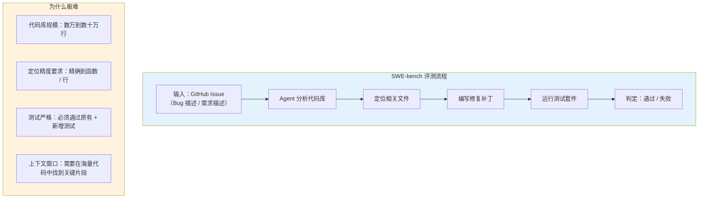

### 3.2 SWE-bench 的分层难度

SWE-bench 分为多个难度级别，基于需要修改的文件数和跨文件依赖深度：

| 级别 | 特征 | 通过率参考（2024-2025） |
|------|------|------------------------|
| SWE-bench Easy | 单文件修改，明确的定位 | 20-30% |
| SWE-bench Verified | 人工验证，确保可解 | 15-50%（顶级系统） |
| SWE-bench Full | 原始全集，含跨文件修改 | 5-15% |
| SWE-bench Lite | 精选简单子集 | 20-40% |

### 3.3 SWE-bench 与 RAG/Agentic RAG 的关系

SWE-bench 的核心挑战之一是 **代码库级别的上下文管理**——Agent 不可能把整个项目塞进上下文窗口，必须使用 RAG 或 Agentic RAG 来精确定位相关代码。这直接关联到我们在 [教程 35-高级 RAG 与 Agentic RAG](../教程/78-高级RAG与AgenticRAG.md) 中讨论的技术。

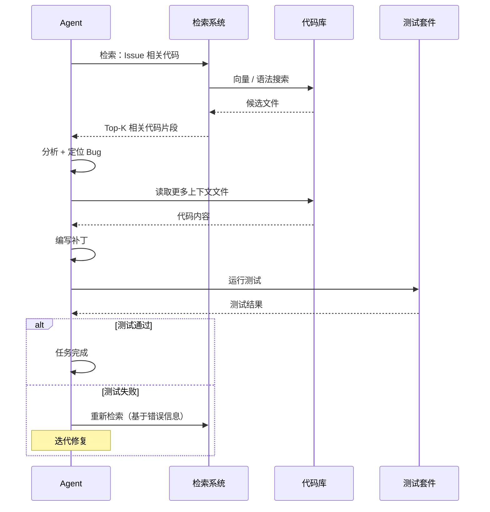

### 3.4 对通用 Agent 开发的启示

SWE-bench 虽然聚焦于代码领域，但其方法论对所有 Agent 开发者有普遍参考价值：

1. **真实任务优于人造任务**：SWE-bench 的任务来自真实 Issue，比人工构造的编程题更接近实际工程。
2. **客观评估优于主观判断**：测试通过率是二元判定的，避免了主观评分的偏差。
3. **长程推理是核心瓶颈**：绝大多数失败不是因为代码写不出，而是定位错误或上下文管理失败。

---

## 4. 其他重要评测基准

### 4.1 评测基准全景

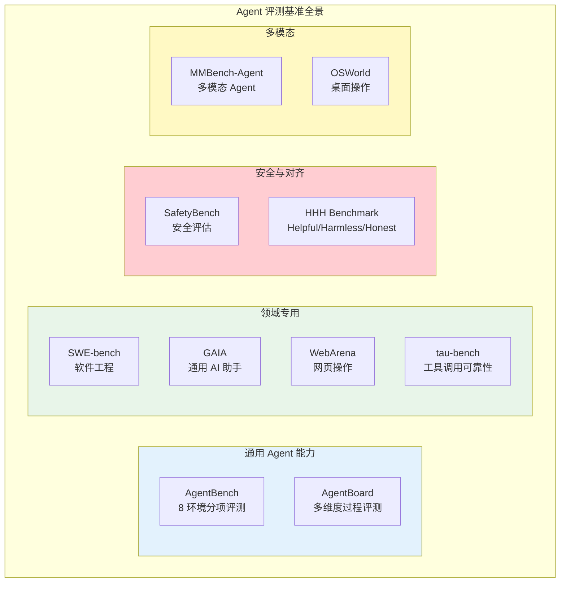

### 4.2 GAIA：通用 AI 助手基准

GAIA（General AI Assistants Benchmark）由 Meta 等机构发布，其设计理念与大多数基准 **相反**——它不追求难度，而是追求"对人类简单但对 AI 困难"的任务。例如："浏览某网页，找到 2023 年某公司的碳排放数据，并与前年对比，生成一份图表"。

GAIA 的三层难度：

| 级别 | 典型步数 | 工具需求 | 人类完成时间 |
|------|----------|----------|-------------|
| Level 1 | 5-10 步 | 基础搜索 | 几分钟 |
| Level 2 | 10-20 步 | 搜索 + 文件处理 | 十几分钟 |
| Level 3 | 20+ 步 | 多工具协作 + 多模态 | 半小时+ |

### 4.3 WebArena：真实网页交互

WebArena 构建了一个自托管的网页环境（含购物网站、论坛、CMS 等），要求 Agent 完成真实的网页操作任务——从浏览商品到发帖到管理内容。

它的核心贡献是提供了一个 **可重复的、端到端的网页交互环境**，避免了在真实网站上测试的不可控性和法律风险。

### 4.4 tau-bench：工具调用的可靠性测试

tau-bench 专注于一个关键但常被忽视的维度——**Agent 在使用工具时的可靠性**。它测试 Agent 能否在严格的业务规则下正确调用工具（如航空订票、零售退货），评估的核心不是"能不能完成任务"而是"是否违反了业务规则"。

tau-bench 还引入了一个重要范式：**Agent 与用户的双轮交互**。传统基准只给 Agent 一个任务描述，tau-bench 模拟真实场景——Agent 需要主动向"用户"提问来收集信息：

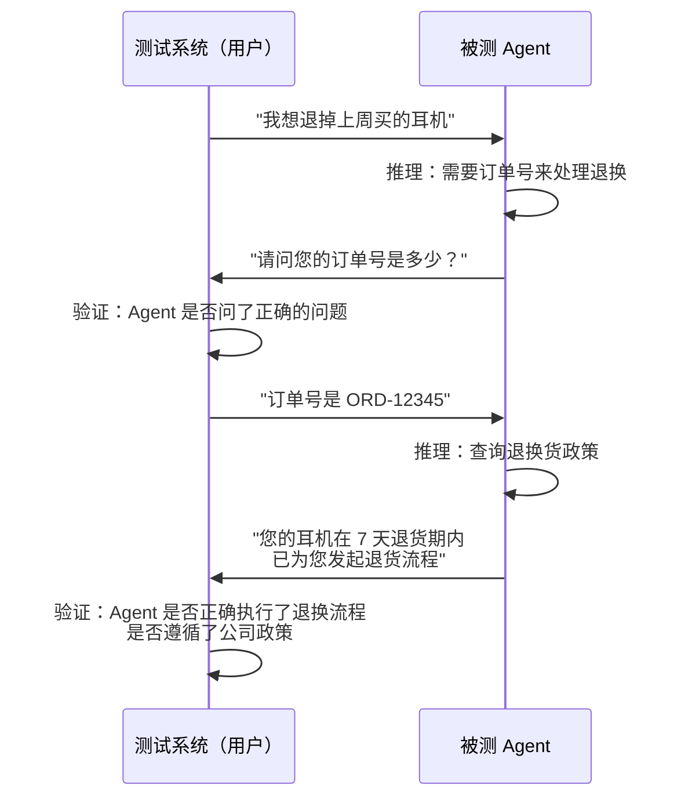

### 4.5 基准能力矩阵总览

| 基准 | 评估维度 | 任务数量 | 评判方式 | 局限性 |
|------|----------|---------|----------|--------|
| AgentBench | 综合能力 | ~300 | 成功率 | 环境偏简单 |
| SWE-bench | 编码修复 | 2,294 | 测试通过 | 仅限 Python |
| SWE-bench Lite | 编码修复（简化） | 300 | 测试通过 | 任务经过筛选 |
| GAIA | 通用助手 | 466 | 精确匹配 | 多模态依赖重 |
| WebArena | Web 操作 | 812 | 端状态验证 | 网站模型固定 |
| ToolBench | 工具调用 | 16,000+ | 工具调用准确率 | API 质量参差 |
| tau-bench | 客服对话 | 165 | 政策遵循 | 领域窄 |

---

## 5. 评估维度体系

### 5.1 Agent 能力的六维模型

综合现有评测框架，我们可以提炼出 Agent 评估的六个核心维度：

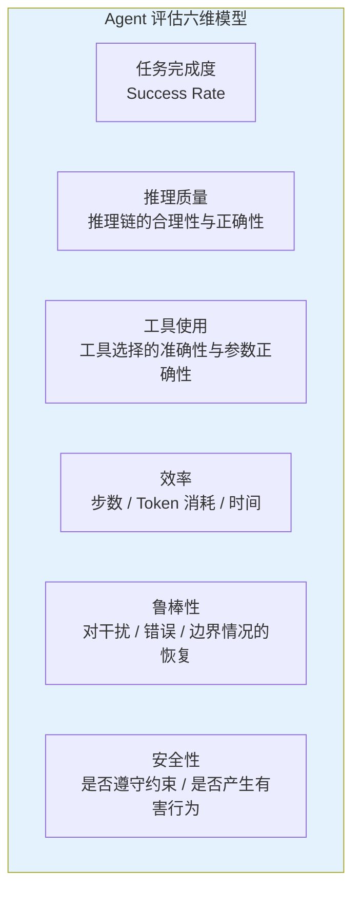

### 5.2 各维度的评估方法

| 维度 | 自动化评估方法 | 人工评估方法 | 挑战 |
|------|---------------|-------------|------|
| 任务完成度 | 最终状态比对 / 测试通过率 | 专家判定 | 部分任务难以定义"完成"标准 |
| 推理质量 | LLM-as-Judge | 专家审查推理链 | LLM 评判存在偏差 |
| 工具使用 | 参数 Schema 校验 / 执行结果验证 | 人工检查 | 工具副作用难以验证 |
| 效率 | 步数 / Token / 时间统计 | - | 缺乏标准化基线 |
| 鲁棒性 | 对抗性输入 / 注入扰动 | 红队测试 | 难以系统化生成对抗案例 |
| 安全性 | 规则违规检测 / 有害输出分类 | 安全专家审计 | 安全定义高度领域相关 |

### 5.3 三种评估范式

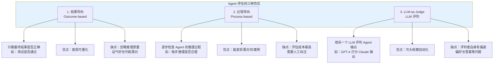

### 5.4 LLM-as-Judge 的兴起与风险

越来越多的 Agent 评测使用强大的 LLM（如 Claude Opus、GPT-4）作为评判者，评估其他 Agent 的输出质量。这种方法的优势是成本低、可扩展，但存在已知风险：

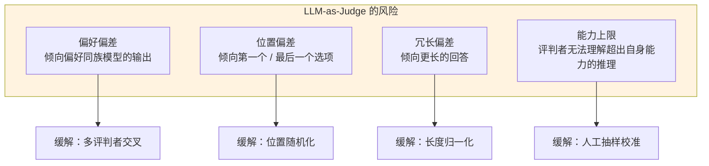

LLM-as-Judge 的已知偏差及缓解策略：

| 偏差类型 | 表现 | 缓解策略 |
|----------|------|----------|
| **位置偏差** | 倾向第一个答案 | 随机化答案顺序 |
| **长度偏差** | 倾向更长的答案 | 控制答案长度一致 |
| **自我偏好** | GPT-4 倾向 GPT-4 的答案 | 用多个不同模型交叉评判 |
| **格式偏差** | 倾向 Markdown 格式更好的答案 | 去除格式后评判 |
| **难度偏差** | 在简单任务上区分度低 | 设计难度分层任务 |

---

## 6. 评测的局限性

### 6.1 Goodhart 定律与过拟合基准

> "当一个指标成为目标时，它就不再是一个好指标。" —— Charles Goodhart

几乎所有的公开评测基准都面临 **数据污染** 问题——模型在训练过程中可能已经"见过"评测数据。这在 Agent 评测中尤其严重，因为 GitHub Issue 等数据天然是公开的。当开发者不断针对某个基准优化 Agent 时，可能产生 **对基准的过拟合**——分数提升了，但通用能力没有改善。

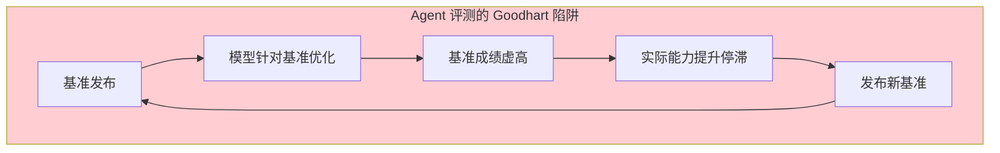

SWE-bench 已经出现了这个趋势：排行榜顶部的方案往往深度利用了 SWE-bench 的特殊结构，迁移到其他代码库时效果下降。

### 6.2 环境不真实

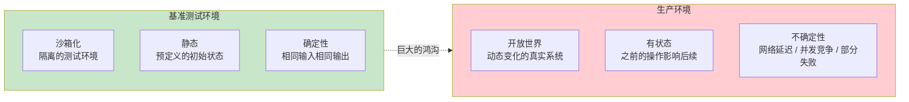

| 真实环境 | 基准简化 | 差距 |
|----------|---------|------|
| 生产数据库有数百万行 | 基准用几百行测试数据 | 性能行为不同 |
| 真实 Web 页面动态变化 | 基准用固定快照 | 泛化能力无法评估 |
| 用户表述模糊/有错别字 | 基准用精确的任务描述 | 理解能力被高估 |
| 多步任务中间可能出错 | 基准假设原子操作可靠 | 容错能力无法评估 |

### 6.3 成本维度缺失

大多数评测只关注"能不能完成"，忽略"用多少成本完成"。在实际生产中，一个用 50 步、消耗 50000 Token 完成任务的 Agent 和一个用 5 步、消耗 5000 Token 完成同样任务的 Agent，商业价值天差地别。这与我们在 [教程 27-成本治理与 Token 计量](../教程/60-成本治理与Token计量.md) 中讨论的成本意识高度相关。

---

## 7. 面向 Spring AI Agent 的评测实践

### 7.1 为什么公开基准不够用

公开基准（SWE-bench、AgentBench）解决的是"模型能力横向比较"问题，但企业场景有三个独特需求：

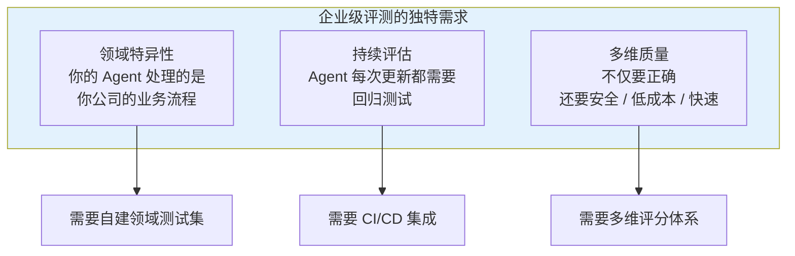

### 7.2 自建评测框架的设计

一个基于 Spring AI 的自建评测框架可以参考以下架构：

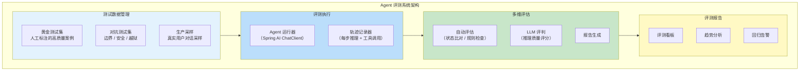

### 7.3 概念代码：测试用例定义

```java
// Agent 评测测试用例（概念模型）
public record AgentTestCase(
    String testId,
    String description,          // 场景描述
    String userInput,            // 用户输入
    List<MockTool> mockTools,    // 模拟工具集
    List<Assertion> assertions,  // 断言集合
    Duration timeout,            // 超时限制
    int maxSteps,                // 最大步数
    long tokenBudget             // Token 预算
) {}

// 断言类型
public sealed interface Assertion permits
        FinalStateAssertion, ToolCallAssertion, NoViolationAssertion {}

// 最终状态断言：Agent 的最终回答是否包含期望信息
public record FinalStateAssertion(
    String expectedContent,      // 期望包含的内容
    String expectedPattern       // 正则匹配模式
) implements Assertion {}

// 工具调用断言：Agent 是否正确调用了特定工具
public record ToolCallAssertion(
    String toolName,             // 工具名
    Map<String, Object> expectedParams,  // 期望参数
    int expectedCallCount        // 期望调用次数
) implements Assertion {}

// 规则违规断言：Agent 是否违反了业务规则
public record NoViolationAssertion(
    List<String> forbiddenTools  // 禁止调用的工具列表
) implements Assertion {}
```

### 7.4 概念代码：评测执行器

```java
// Agent 评测运行器（基于 Spring AI）
@Component
public class AgentEvaluationRunner {

    private final ChatClient.Builder chatClientBuilder;
    private final LlmJudge llmJudge;

    public EvaluationReport runTest(AgentTestCase testCase) {
        var startTime = Instant.now();
        var trace = new AgentTraceRecorder();

        // 构建被测 Agent
        var chatClient = chatClientBuilder
            .defaultTools(testCase.mockTools().toArray())
            .defaultAdvisors(trace.asAdvisor())
            .build();

        // 执行并记录
        var response = chatClient.prompt()
            .user(testCase.userInput())
            .call()
            .content();

        // 多维度评估
        var results = testCase.assertions().stream()
            .map(assertion -> evaluate(assertion, response, trace))
            .toList();

        return EvaluationReport.builder()
            .testId(testCase.testId())
            .passed(results.stream().allMatch(AssertionResult::passed))
            .details(results)
            .tokenUsed(trace.getTotalTokens())
            .steps(trace.getStepCount())
            .duration(Duration.between(startTime, Instant.now()))
            .build();
    }
}
```

### 7.5 测试集构建方法论

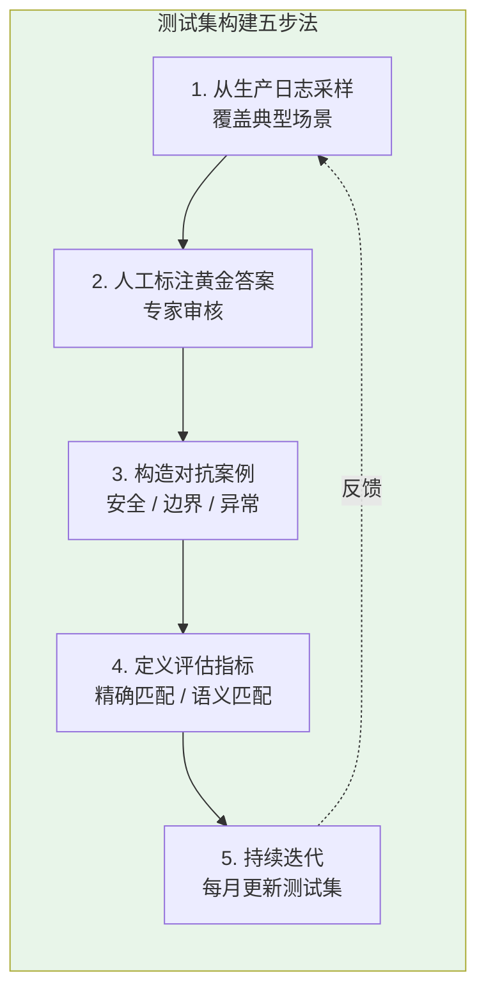

### 7.6 持续评测的工程实践

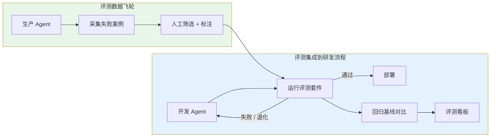

这与 [教程 84-数据飞轮与持续改进](../教程/84-数据飞轮与持续改进.md) 中的理念一致——评测不应该是一次性的活动，而是持续迭代的闭环。生产中的失败案例是最有价值的评测数据来源。

---

## 8. 评测基准的发展趋势

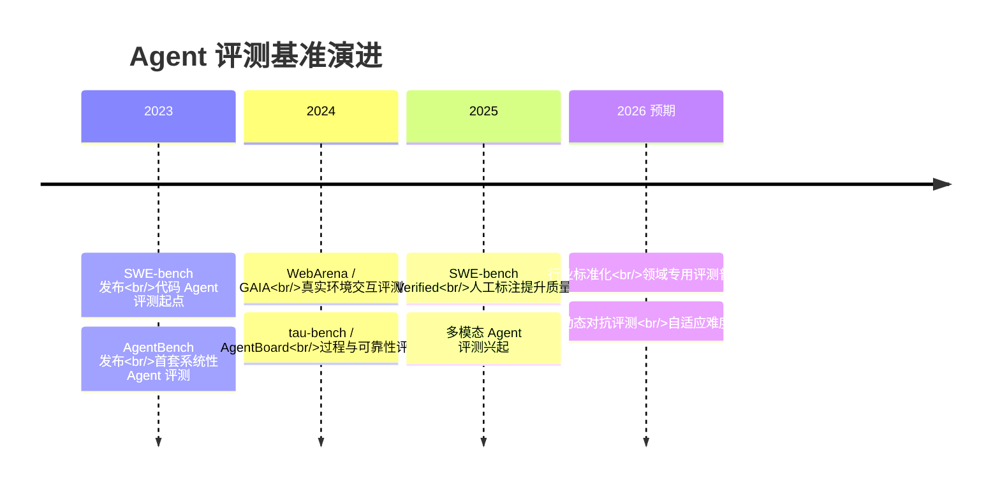

关键趋势包括：

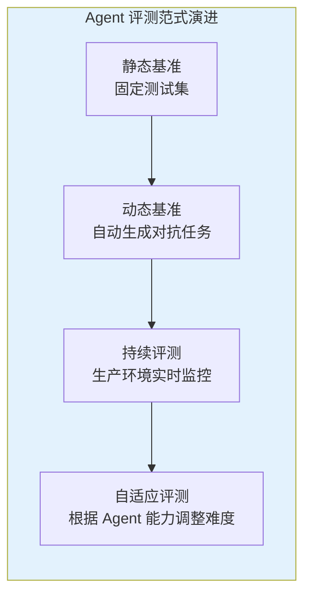

1. **从静态到动态**：未来的评测不再是固定的测试集，而是动态生成对抗性场景，防止过拟合。
2. **从结果到过程**：越来越多评测关注 Agent 的推理过程，而不只是最终结果——推理路径的合理性比结果正确性更重要。
3. **从通用到领域**：通用基准（AgentBench）之外，金融、医疗、法律等领域的专用基准正在涌现。
4. **从能力到安全**：安全性评估的权重正在增加，包括越狱攻击、Prompt 注入、信息泄露等安全维度。

### 8.1 选择合适基准的决策树

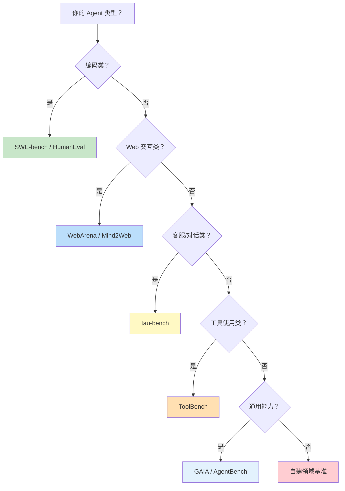

---

## 9. 总结

Agent 评测是一个正在快速发展的领域，当前的评测体系离成熟还有很长的路。核心调研发现如下：

1. **范式跳跃**：Agent 评测从传统 LLM 的"单轮、客观、唯一答案"模式，跳跃到"多步、主观、路径多样"的模式，复杂度质变。传统软件测试的"断言"范式在 Agent 领域基本失效。
2. **四大基准**：SWE-bench（代码）、AgentBench（通用）、GAIA（日常助手）、WebArena（网页交互）构成了当前 Agent 评测的四大基石，各有侧重。tau-bench 在工具可靠性维度做了重要补充。
3. **六维模型**：任务完成度、推理质量、工具使用、效率、鲁棒性、安全性六个维度缺一不可——只看成功率的评估是片面的。
4. **三种评估范式组合使用**：结果导向（客观但粗糙）、过程导向（精确但昂贵）、LLM-as-Judge（可扩展但有偏差）各有优劣，实际应用中应组合使用。
5. **局限性显著**：数据污染、Goodhart 陷阱、环境不真实、成本缺失——现有基准的局限性要求开发者保持审慎，不能将基准分数等同于真实能力。
6. **企业必须自建评测体系**：公开基准只提供横向参考，每个企业必须构建自己的评测集，包含黄金测试集、对抗测试集和生产采样，聚焦于自身业务场景的成败标准。

对于 Java Agent 架构师，最实用的建议是：**将评测作为 Agent 开发的第一公民**。在构建任何 Agent 功能时，同步构建对应的测试场景和评估指标——投入至少 30% 的精力到测试集构建、评测自动化和持续监控中。这与我们在 [教程 37-自我反思与 Agent 评估](../教程/80-自我反思与Agent评估.md) 中讨论的自我评估能力共同构成了 Agent 质量保障的双层体系：Agent 内部的自省和外部的系统化评测。
