# 03-Agent 评测基准：如何衡量 Agent 的能力

> **定位**：本文调研当前主流的 Agent 评测基准（AgentBench、SWE-bench、GAIA、WebArena 等），分析它们的评估维度、方法论、局限性，以及在企业级场景中如何设计自己的 Agent 评测体系。读完本文，你将拥有一个系统化的 Agent 质量评估框架。
>
> **性质声明**：本文为调研性质，Agent 评测领域正处于快速发展期，新的基准和方法论不断涌现。

---

## 1. 为什么 Agent 评测极其困难

### 1.1 与传统软件测试的本质区别

传统软件测试有明确的"正确答案"——函数输入产生预期输出。但 Agent 的行为是 **非确定性的**——同一个 Prompt，同一个任务，Agent 可能走完全不同的推理路径，甚至给出措辞不同但语义等价的答案。

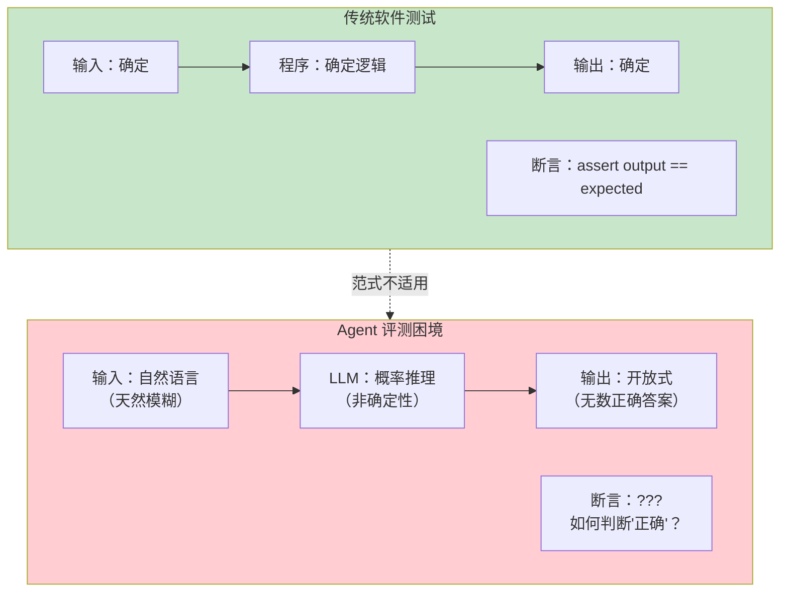

### 1.2 评测的四个维度

Agent 的复杂性要求我们从多个维度评估：

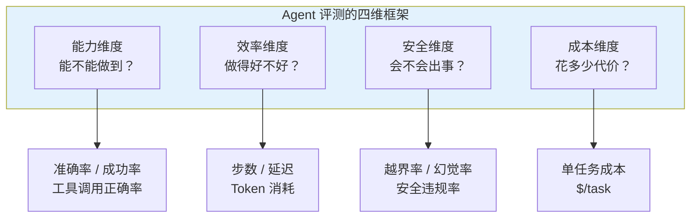

---

## 2. 学术界主流评测基准

### 2.1 AgentBench：综合能力基准

AgentBench（清华大学等，2023）是最早的系统化 Agent 综合评测基准，覆盖 8 个不同环境的 Agent 任务：

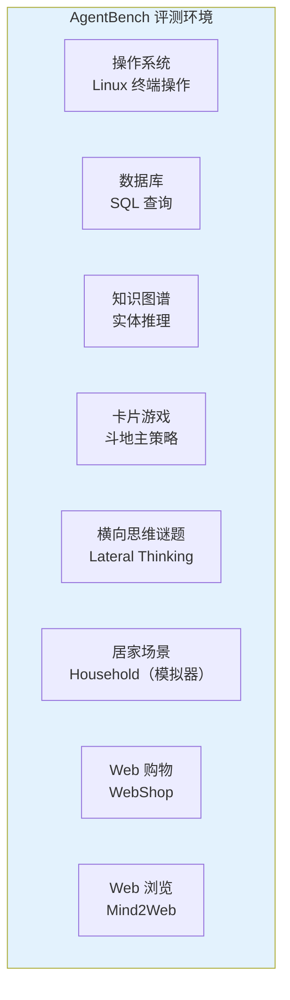

AgentBench 的核心指标是 **任务完成率（Success Rate）**——Agent 是否在限定步数内完成了任务。它的贡献在于首次提供了跨环境的标准化比较框架。

### 2.2 SWE-bench：软件工程基准

SWE-bench（Princeton，2023）是目前最具影响力的 Agent 编码能力基准。它的设计非常巧妙：从真实 GitHub 仓库（Django、Flask、Requests 等）中收集已解决的 Issue，让 Agent 自主完成"从 Issue 描述到提交修复代码"的全流程。

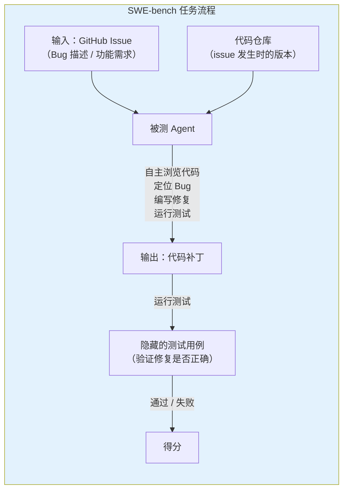

SWE-bench 的关键设计决策：

| 决策 | 选择 | 理由 |
|------|------|------|
| 任务来源 | 真实 GitHub Issue | 而非人造题——避免"刷榜" |
| 评判标准 | 单元测试通过 | 客观可验证——避免主观打分 |
| 环境 | 完整代码仓库 | 考验 Agent 的代码导航能力 |
| 输出格式 | Git diff 补丁 | 模拟真实开发工作流 |

SWE-bench 的结果揭示了一个残酷的现实：即使是最强的 Agent，解决率也只有约 40-50%（SWE-bench Lite），完整 SWE-bench 的解决率更低（20-30%）。

### 2.3 基准对比总览

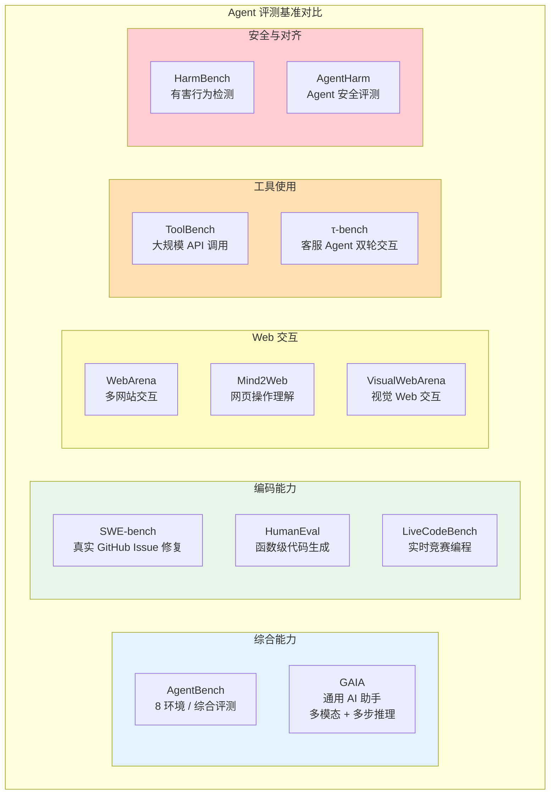

### 2.4 基准能力矩阵

| 基准 | 评估维度 | 任务数量 | 评判方式 | 局限性 |
|------|----------|---------|----------|--------|
| AgentBench | 综合能力 | ~300 | 成功率 | 环境偏简单 |
| SWE-bench | 编码修复 | 2,294 | 测试通过 | 仅限 Python |
| SWE-bench Lite | 编码修复（简化） | 300 | 测试通过 | 任务经过筛选 |
| GAIA | 通用助手 | 466 | 精确匹配 | 多模态依赖重 |
| WebArena | Web 操作 | 812 | 端状态验证 | 网站模型固定 |
| ToolBench | 工具调用 | 16,000+ | 工具调用准确率 | API 质量参差 |
| tau-bench | 客服对话 | 165 | 政策遵循 | 领域窄 |

---

## 3. 评估方法论

### 3.1 三种评估范式

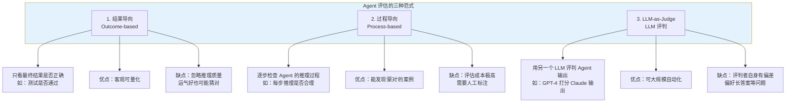

### 3.2 LLM-as-Judge 的偏差

LLM-as-Judge 是目前最常用的 Agent 评估方法（用于 LMSYS Chatbot Arena 等），但它存在系统性偏差：

| 偏差类型 | 表现 | 缓解策略 |
|----------|------|----------|
| **位置偏差** | 倾向第一个答案 | 随机化答案顺序 |
| **长度偏差** | 倾向更长的答案 | 控制答案长度一致 |
| **自我偏好** | GPT-4 倾向 GPT-4 的答案 | 用多个不同模型交叉评判 |
| **格式偏差** | 倾向 Markdown 格式更好的答案 | 去除格式后评判 |
| **难度偏差** | 在简单任务上区分度低 | 设计难度分层任务 |

### 3.3 tau-bench 的双轮交互范式

tau-bench（2024）引入了一个重要的评估范式：**Agent 与用户的双轮交互**。传统基准只给 Agent 一个任务描述，tau-bench 则模拟真实场景——Agent 需要主动向"用户"提问来收集信息：

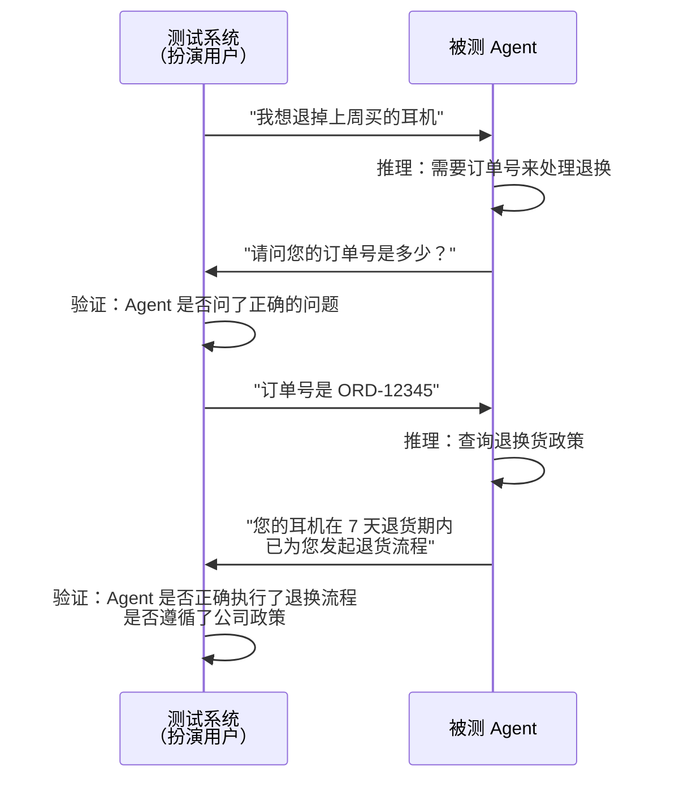

这种范式比传统"单轮任务"更接近真实生产环境。

---

## 4. 企业级 Agent 评测框架设计

### 4.1 为什么公开基准不够用

公开基准（SWE-bench、AgentBench）解决的是"模型能力横向比较"问题，但企业场景有三个独特需求：

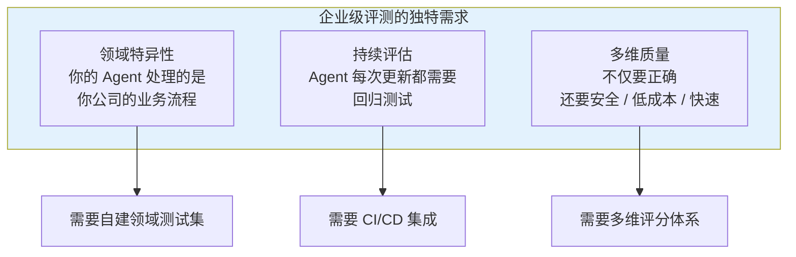

### 4.2 企业级评测架构

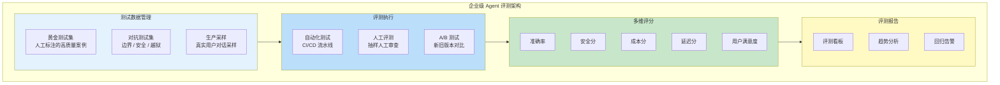

### 4.3 测试集构建方法论

构建企业级 Agent 测试集的推荐流程：

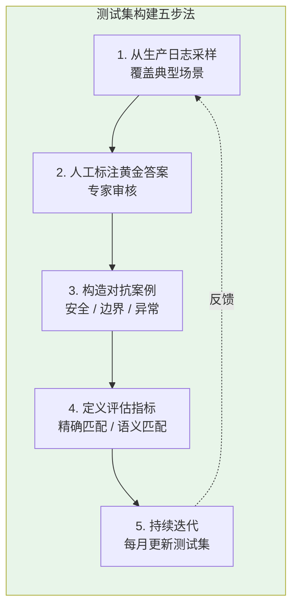

### 4.4 Spring AI 中的评测集成

```java
// 概念代码：Agent 评测集成到 CI/CD
@Service
public class AgentEvaluationService {

    private final ChatClient agentClient;
    private final List<TestCase> testCases;
    private final LLMJudge llmJudge;

    @Scheduled(cron = "0 2 * * *")  // 每天凌晨 2 点运行
    public EvaluationReport runDailyEvaluation() {
        var results = testCases.parallelStream()
            .map(testCase -> evaluateTestCase(testCase))
            .toList();

        return EvaluationReport.builder()
            .totalCases(results.size())
            .passed((int) results.stream().filter(r -> r.passed()).count())
            .avgTokenCost(results.stream().mapToInt(r -> r.tokens()).average().orElse(0))
            .avgLatency(results.stream().mapToLong(r -> r.latencyMs()).average().orElse(0))
            .build();
    }

    private TestResult evaluateTestCase(TestCase testCase) {
        // 1. 执行 Agent
        var response = agentClient.prompt()
            .user(testCase.input())
            .call()
            .content();

        // 2. LLM-as-Judge 评分
        var score = llmJudge.judge(
            testCase.input(),
            response,
            testCase.expectedOutput(),
            testCase.rubric()  // 评分标准
        );

        return new TestResult(testCase.id(), response, score);
    }
}
```

---

## 5. 评测的局限性与陷阱

### 5.1 Goodhart 定律

> "当一个指标成为目标时，它就不再是一个好指标。" —— Charles Goodhart

Agent 评测同样受制于这一定律。当模型开发团队过度优化某个基准的成绩时，该基准就失去了评估意义：

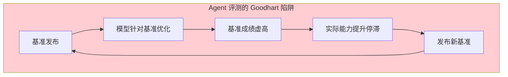

### 5.2 数据污染问题

公开基准的测试数据可能已经混入了 LLM 的训练数据——模型不是在"推理"，而是在"回忆"训练时见过的答案。SWE-bench 等基准已开始采用以下对策：

- **时间切分**：只用模型训练截止日期之后的新 Issue
- **数据去重**：确保测试集与训练数据不重叠
- **私有评估集**：不公开测试数据，只提供评测 API

### 5.3 环境简化偏差

大多数基准为了可控性，简化了真实环境的复杂性：

| 真实环境 | 基准简化 | 差距 |
|----------|---------|------|
| 生产数据库有数百万行 | 基准用几百行测试数据 | 性能行为不同 |
| 真实 Web 页面动态变化 | 基准用固定快照 | 泛化能力无法评估 |
| 用户表述模糊/有错别字 | 基准用精确的任务描述 | 理解能力被高估 |
| 多步任务中间可能出错 | 基准假设原子操作可靠 | 容错能力无法评估 |

---

## 6. Agent 评测的发展趋势

### 6.1 从静态到动态

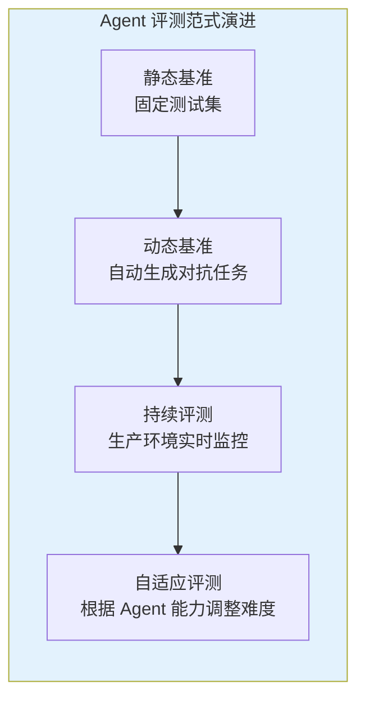

### 6.2 从单 Agent 到多 Agent

当前基准主要评估单个 Agent 的能力，但实际生产中 Agent 通常需要协作（[教程 08-多 Agent 协作](../教程/08-多Agent协作.md)）。多 Agent 评测需要评估：

- **协作效率**：多 Agent 是否比单 Agent 更快完成任务？
- **通信开销**：Agent 间的通信成本是否可接受？
- **错误传播**：一个 Agent 的错误是否被其他 Agent 放大？

### 6.3 从能力到安全

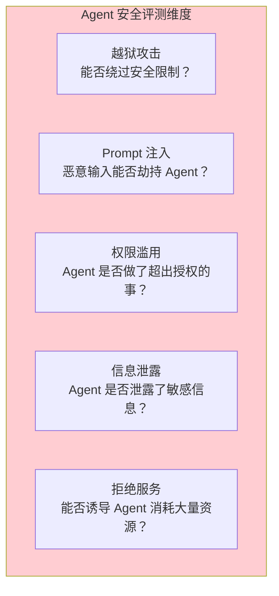

安全评测是一个独立且快速发展的领域，我们在 [教程 25-安全与权限控制](../教程/25-安全与权限控制.md) 中讨论的安全策略需要配合这些安全基准来验证。

---

## 7. 评测实践建议

### 7.1 选择合适基准的决策树

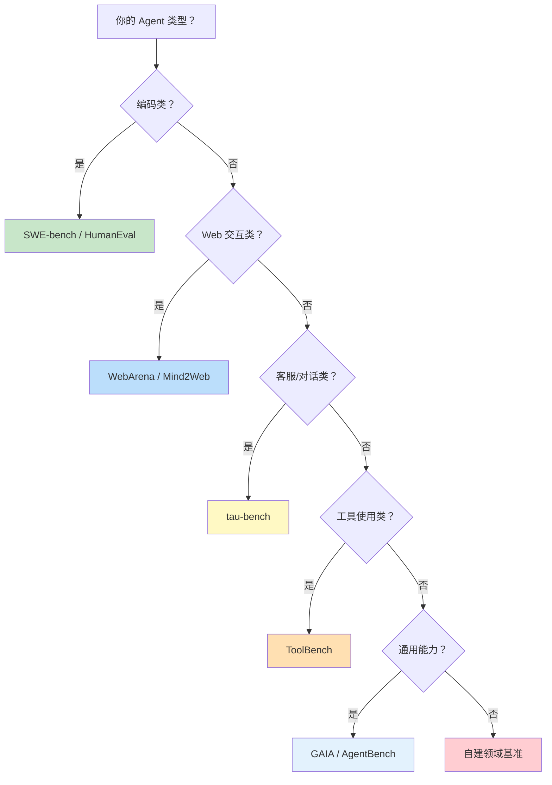

### 7.2 企业级评测的黄金法则

1. **结果 + 过程双评估**：不仅看最终答案是否正确，还要检查推理路径是否合理。
2. **LLM-Judge + 人工抽检**：LLM 评判覆盖量，人工抽检覆盖质。
3. **生产采样持续评测**：从真实用户对话中采样，避免"实验室成绩"。
4. **多维评分而非单一分数**：准确率、安全性、成本、延迟缺一不可。
5. **对抗测试常态化**：定期组织红队构造对抗案例。

---

## 8. 总结

Agent 评测是一个远比传统软件测试复杂的领域。核心调研发现如下：

1. **基准繁荣**：AgentBench、SWE-bench、GAIA、WebArena 等基准覆盖了综合能力、编码、Web 交互、工具使用等多个维度，但每个基准都有其局限性。
2. **三种评估范式**：结果导向（客观但粗糙）、过程导向（精确但昂贵）、LLM-as-Judge（可扩展但有偏差）各有优劣，实际应用中应组合使用。
3. **Goodhart 陷阱不可忽视**：基准成绩不等于真实能力，需要持续更新测试集和引入私有评估集。
4. **企业必须自建评测体系**：公开基准只能做横向参考，垂直领域必须构建包含黄金测试集、对抗测试集和生产采样的多维评测框架。
5. **安全评测是独立维度**：Agent 的安全性（越狱、注入、权限滥用）需要专门的评估，不能混在能力评测中。

对于 Java Agent 架构师而言，建议将 Agent 评测视为与开发同等重要的工程活动——投入至少 30% 的精力到测试集构建、评测自动化和持续监控中。
