# 04-MCP 生态全景：工具市场的兴起与治理

> **定位**：本文调研 MCP（Model Context Protocol）生态的演进全景——从 MCP Server 注册中心到服务发现，从企业工具市场到治理框架。MCP 在 [教程 01-WebFlux与响应式编程/01-Reactor核心 协议](../教程/02-SpringAI核心机制/07-MCP协议.md) 中已有基础讲解，本文聚焦生态层面：MCP 如何从"协议"演化为"生态"，以及这个生态对 Java/Spring AI Agent 架构的影响。
>
> **性质声明**：本文为调研性质，MCP 生态处于快速扩张期，具体注册中心和工具市场信息更新频繁。

---

## 1. 从协议到生态：MCP 的演进

### 1.1 MCP 协议回顾

[教程 01-WebFlux与响应式编程/01-Reactor核心 协议](../教程/02-SpringAI核心机制/07-MCP协议.md) 中我们介绍了 MCP 的核心技术细节——它标准化了 AI Agent 与外部工具/数据源的连接方式。这里做一个简要回顾：

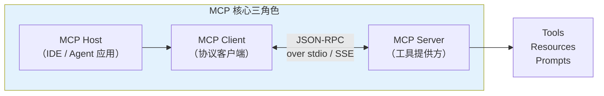

MCP 的核心价值在于 **将工具调用从"点对点集成"变为"标准化市场"**——这就像 USB 标准之于硬件外设，或者 HTTP 之于 Web 服务。

### 1.2 生态演化的三个阶段

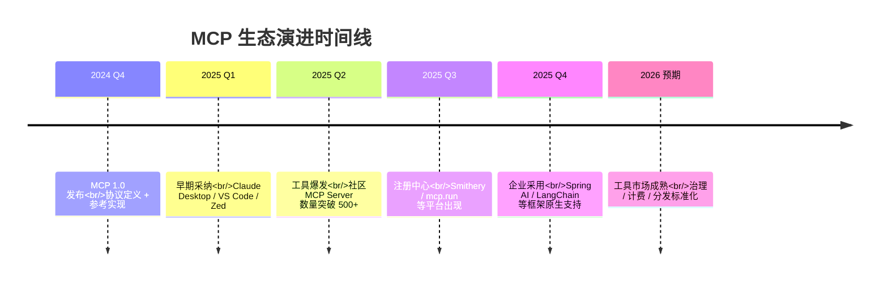

MCP 生态正在经历与早期 Web 服务 API 或 npm 包管理类似的演化路径——从技术标准到注册中心，从注册中心到交易市场。

### 1.3 MCP 生态的三个圈层

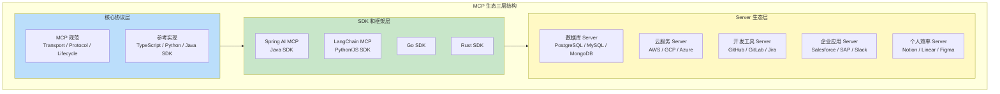

---

## 2. MCP Server 注册中心

### 2.1 为什么需要注册中心

在 MCP 早期，使用一个工具意味着手动配置 Server 的连接信息。当工具数量从十几个增长到数百个时，这种模式不可持续。注册中心解决了以下问题：

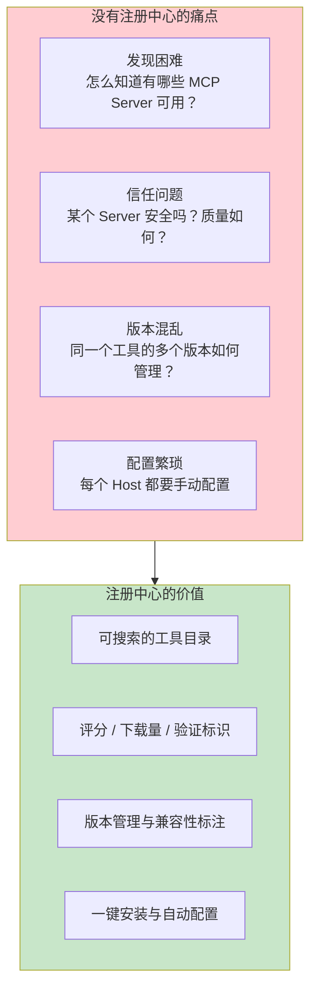

### 2.2 主流注册中心对比

| 注册中心 | 运营方 | 核心特性 | 定位 |
|----------|--------|----------|------|
| **Smithery** | 社区 | 一键安装、自动配置、Web 搜索 | 最大的社区注册中心 |
| **mcp.run** | Dylibso | 沙箱化执行、WASM 运行时 | 安全优先的注册中心 |
| **mcp.so** | 社区 | Server 目录、关键词搜索 | 社区驱动的 Server 目录 |
| **MCP Hub** | 多方协作 | 去中心化目录、元数据聚合 | 目录索引 |
| **企业私有注册** | 各企业 | 内部工具管理、权限控制 | 企业内部工具市场 |

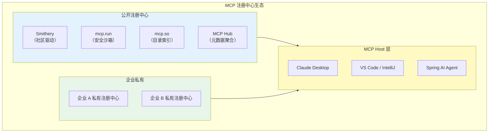

### 2.3 注册中心的技术架构

一个成熟的 MCP 注册中心包含以下组件：

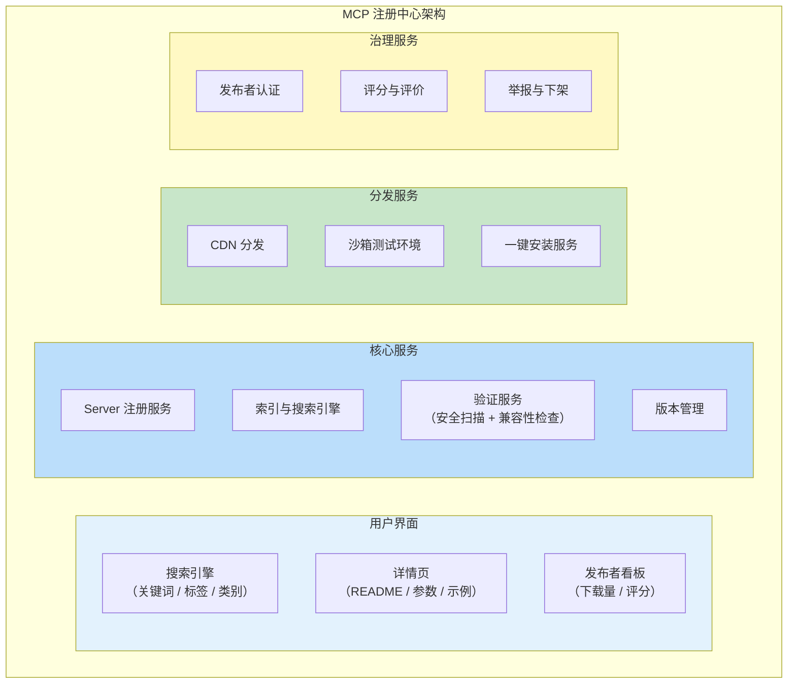

注册中心的核心功能与微服务注册中心的对应关系：

| 功能 | 说明 | 对标微服务 |
|------|------|-----------|
| **服务注册** | Server 启动时注册自己的信息 | Eureka Register |
| **服务发现** | Agent 按能力搜索可用 Server | Eureka Discovery |
| **健康检查** | 定期检查 Server 是否存活 | Eureka Heartbeat |
| **版本管理** | 记录 Server 版本和兼容性 | API Versioning |
| **质量评分** | 用户评分、使用统计 | App Store Rating |
| **依赖管理** | Server 之间的依赖关系 | Maven/npm Dependency |

---

## 3. MCP Server 的分类全景

### 3.1 按功能维度分类

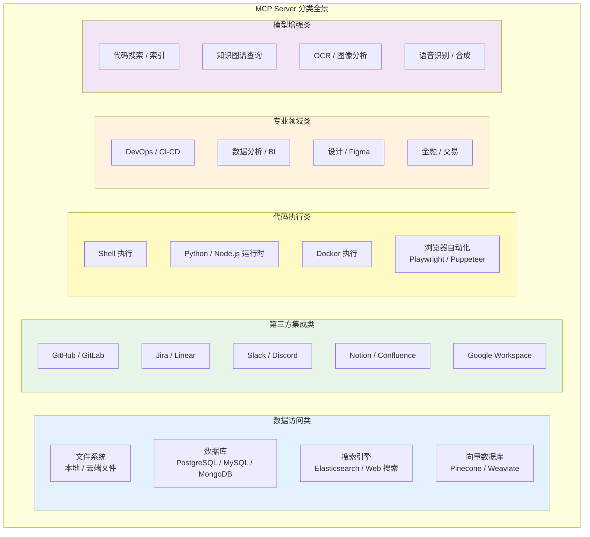

### 3.2 典型 Server 详表

| Server 名称 | 能力 | 开发方 | 场景 |
|-------------|------|--------|------|
| postgres-mcp | PostgreSQL 读写 | 社区 | Agent 直接查询数据库 |
| github-mcp | GitHub API 全覆盖 | GitHub 官方 | 代码管理、Issue、PR |
| filesystem-mcp | 文件系统读写 | Anthropic | 文档处理 |
| brave-search-mcp | Web 搜索 | Brave | 实时信息获取 |
| slack-mcp | Slack 消息收发 | Slack 官方 | 团队协作 Agent |
| puppeteer-mcp | 浏览器自动化 | 社区 | Web 爬取、UI 自动化 |
| memory-mcp | 知识图谱存储 | Anthropic | Agent 长期记忆 |
| sequential-thinking-mcp | 结构化推理 | Anthropic | 复杂问题分解 |
| time-mcp | 时间/时区查询 | 社区 | 日程/时区处理 |
| sqlite-mcp | SQLite 操作 | 社区 | 轻量级数据存储 |

### 3.3 按部署模式分类

| 部署模式 | 通信方式 | 优势 | 劣势 | 适用场景 |
|----------|----------|------|------|----------|
| **本地 stdio** | 标准输入输出 | 零延迟、安全 | 仅限本地 | 开发工具、文件操作 |
| **本地 SSE** | HTTP + SSE | 跨进程、可调试 | 需要端口管理 | 本地服务集成 |
| **远程 SSE** | HTTPS + SSE | 共享、可扩展 | 网络延迟、安全风险 | 团队共享工具 |
| **容器化** | Docker 内运行 | 隔离、可复现 | 启动开销 | 生产环境部署 |
| **WASM 沙箱** | WASM 运行时 | 安全隔离、轻量 | 性能受限 | 不可信工具执行 |

### 3.4 MCP Server 质量评估维度

随着生态的爆发，并非所有 MCP Server 质量都可靠。以下是评估一个第三方 MCP Server 的关键维度：

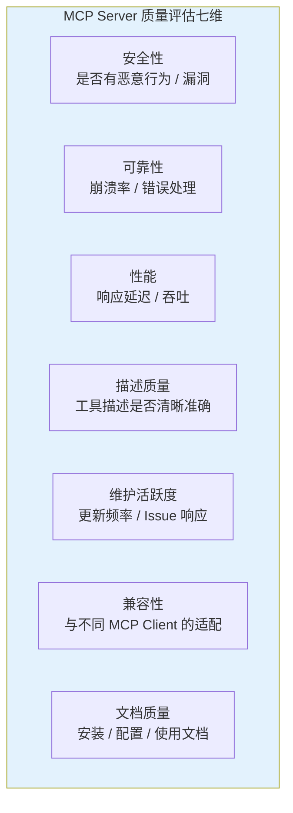

---

## 4. 服务发现与动态工具编排

### 4.1 静态配置 vs 动态发现

传统的 MCP 使用方式是 **静态配置**——在应用启动前写死要连接哪些 MCP Server。这在工具数量少时可行，但在大型系统中，我们希望 Agent 能 **动态发现** 需要的工具。

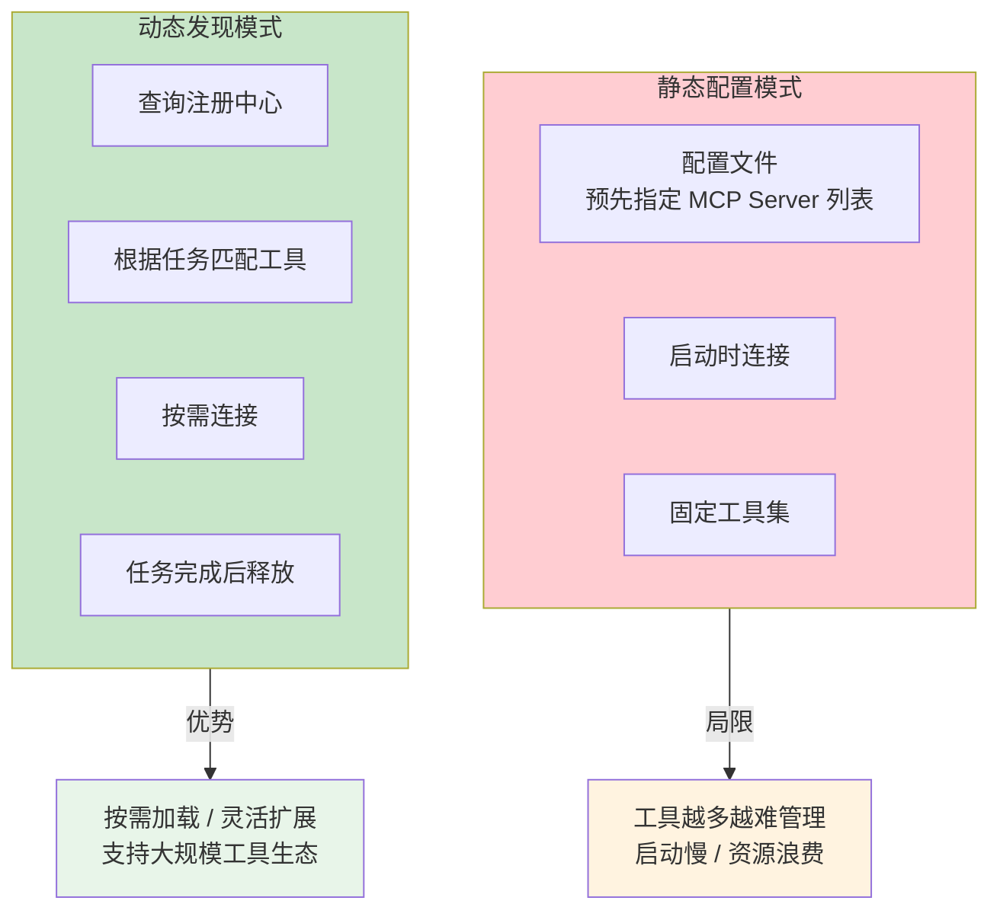

### 4.2 动态工具发现的架构

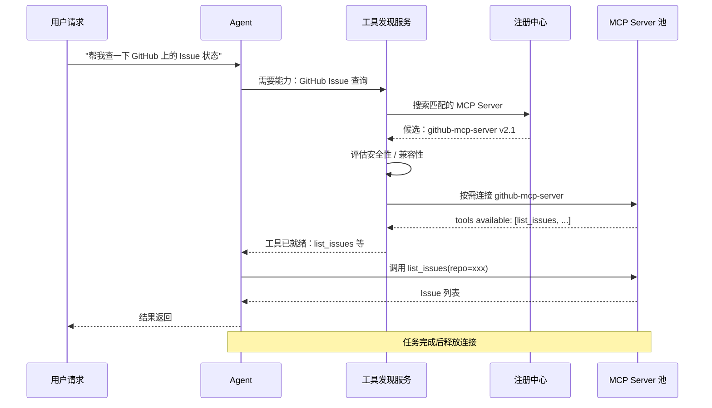

### 4.3 概念代码：动态工具发现

```java
// MCP 动态工具发现服务（概念模型）
@Service
public class McpToolDiscoveryService {

    private final McpRegistryClient registryClient;
    private final McpClientPool clientPool;

    /**
     * 根据任务语义发现并连接最匹配的 MCP Server
     */
    public Flux<McpTool> discoverTools(String taskDescription) {
        return registryClient.search(taskDescription)
            .filter(this::isTrusted)
            .flatMap(this::connectAndListTools)
            .take(5); // 限制最多加载 5 个 Server
    }

    private Mono<McpTool> connectAndListTools(McpServerInfo server) {
        return clientPool.connect(server)
            .flatMap(client -> client.listTools()
                .map(tool -> new McpTool(server, tool)));
    }

    private boolean isTrusted(McpServerInfo server) {
        return server.verified()           // 通过安全验证
            && server.rating() > 3.5       // 社区评分达标
            && server.compatibility()      // 与当前 MCP 版本兼容
                .contains(mcpVersion);
    }
}

// 工具使用后自动释放
@Component
public class McpClientPool {

    private final Cache<String, McpClient> activeClients =
        Caffeine.newBuilder()
            .expireAfterAccess(Duration.ofMinutes(10))
            .removalListener((key, client, cause) ->
                client.close())
            .build();

    public Mono<McpClient> connect(McpServerInfo server) {
        return Mono.fromCallable(() ->
            activeClients.get(server.id(), k -> createClient(server))
        );
    }

    private McpClient createClient(McpServerInfo server) {
        // ⚠ 概念模型：McpClient.builder() 是示意写法，非真实 API。
        // MCP SDK 2.0.0 真实工厂是 McpClient.sync(McpClientTransport) / McpClient.async(transport)
        //（javap 实证 io.modelcontextprotocol.client.McpClient；本段为池化逻辑示意，未列真实 SDK 构造细节）
        return McpClient.builder()
            .serverUrl(server.url())
            .transport(server.transport())
            .timeout(Duration.ofSeconds(30))
            .build();
    }
}
```

### 4.4 工具冲突与编排策略

当多个 MCP Server 提供相似能力的工具时（比如三个不同的"搜索"工具），Agent 需要 **编排策略** 来选择最优工具：

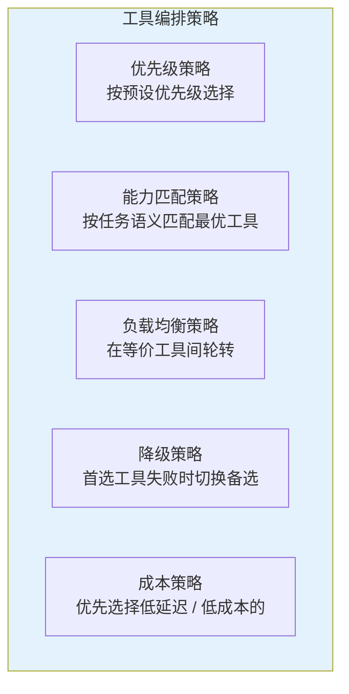

这与 [教程 04-企业级架构主干/12-模型路由与降级](../教程/04-企业级架构主干/12-模型路由与降级.md) 中的模型路由策略高度类似——工具也可以视为一种需要路由的资源。

---

## 5. 企业 MCP Gateway 架构

### 5.1 为什么需要 Gateway

在企业环境中，直接让每个 Agent 连接外部 MCP Server 是不可行的——需要统一的入口来处理认证、审计、限流、缓存等横切关注点：

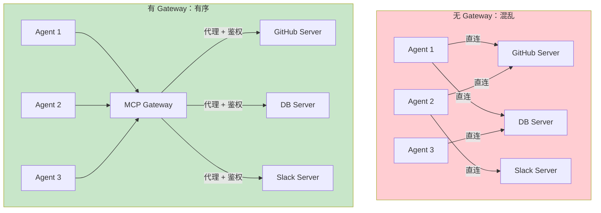

### 5.2 Gateway 核心功能

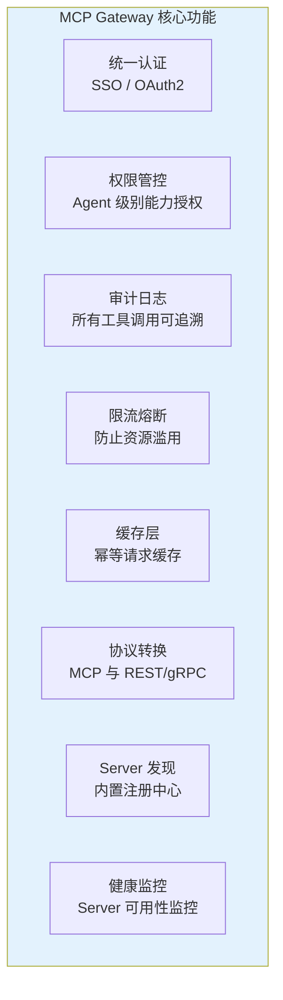

### 5.3 基于 Spring Cloud 的 Gateway 实现

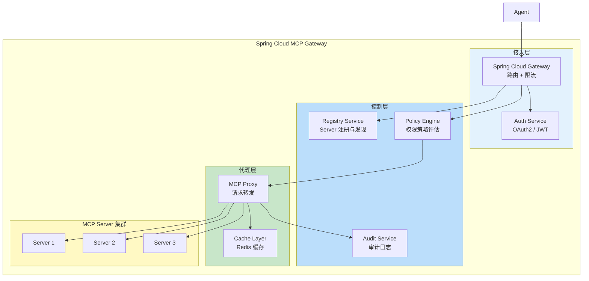

这个架构与我们 [教程 04-企业级架构主干/00-管控分离架构](../教程/04-企业级架构主干/00-管控分离架构.md) 和 [项目 03-MCP 工具网关](../项目/03-MCP工具网关/00-需求分析与架构设计.md) 的设计高度一致——MCP Gateway 就是管控分离理念在 MCP 生态中的具体实现。

### 5.4 权限模型概念代码

```java
// MCP Gateway 权限策略概念
public class McpGatewayPolicy {

    // Agent 级别的工具访问策略
    public record AgentPolicy(
        String agentId,
        Map<String, ToolPermission> toolPermissions,
        RateLimit rateLimit,
        TokenBudget tokenBudget
    ) {}

    public record ToolPermission(
        String toolName,
        AccessLevel level,        // READ / WRITE / ADMIN
        List<String> allowedArgs, // 限制可传入的参数
        boolean requireApproval   // 是否需要人工审批
    ) {}

    public record RateLimit(
        int callsPerMinute,
        int callsPerDay,
        long tokensPerDay
    ) {}
}
```

---

## 6. MCP 工具市场：从生态到商业

### 6.1 从 Registry 到 Marketplace

MCP 注册中心的自然演化方向是 **工具市场（Marketplace）**——不仅是发现和连接，还包含安装、计费、质量认证等完整生命周期管理。

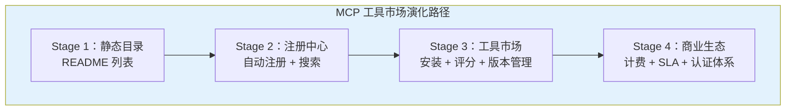

### 6.2 工具市场的商业模式

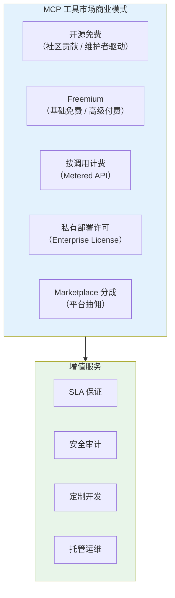

### 6.3 MCP 工具市场 vs 传统 API 市场

| 维度 | 传统 API 市场（如 RapidAPI） | MCP 工具市场 |
|------|---------------------------|-------------|
| **接口标准** | REST/GraphQL（各异） | MCP（统一） |
| **调用者** | 人类开发者编写代码 | Agent 自主调用 |
| **发现方式** | 人工浏览文档 | Agent Card 自动匹配 |
| **计费** | 按请求/月 | 按 Token/调用 |
| **质量评估** | 人工评论 | Agent 调用成功率 |
| **安全模型** | API Key | Capability-based |

### 6.4 企业内部工具市场

对于大型企业，构建 **内部 MCP 工具市场** 是治理 Agent 能力的关键：

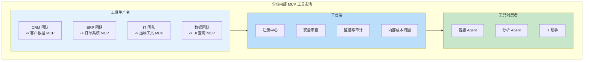

这使每个业务团队可以独立开发和维护自己领域的 MCP Server，Agent 按需发现和调用——实现了组织级别的 **能力解耦**。

---

## 7. 安全与治理挑战

### 7.1 MCP 安全风险全景

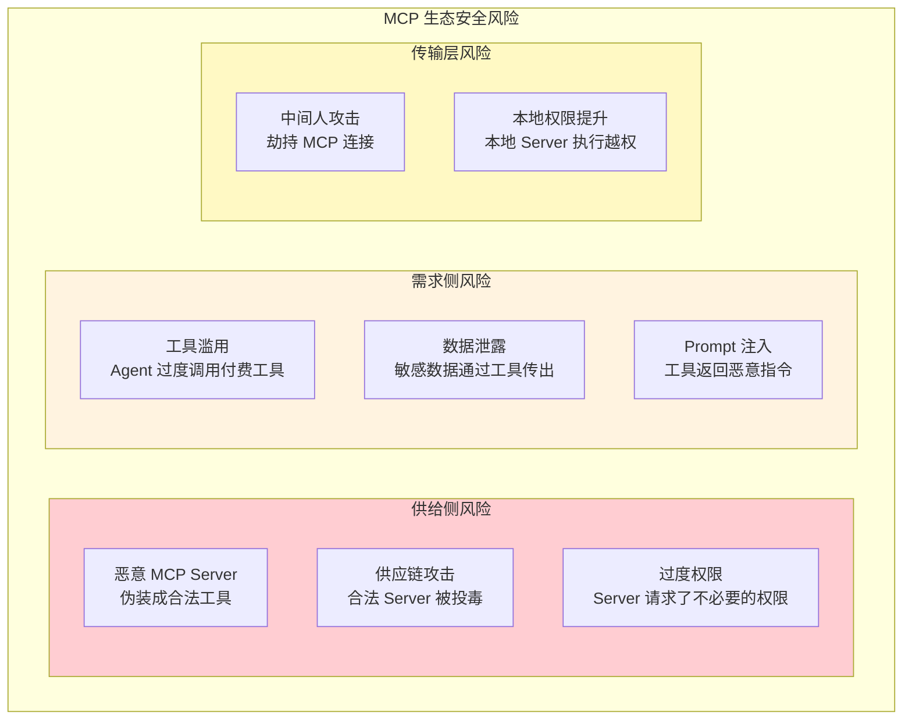

### 7.2 治理框架

企业级 MCP 使用需要建立完整的治理框架：

| 治理维度 | 措施 | 对应教程 |
|----------|------|----------|
| **准入审查** | 所有 MCP Server 需通过安全扫描 | [教程 04-企业级架构主干/11-安全与权限控制](../教程/04-企业级架构主干/11-安全与权限控制.md) |
| **权限最小化** | 每个 Server 只授予最小必要权限 | [教程 04-企业级架构主干/11-安全与权限控制](../教程/04-企业级架构主干/11-安全与权限控制.md) |
| **调用审计** | 所有工具调用记录审计日志 | [教程 04-企业级架构主干/03-工具执行可观测与审计](../教程/04-企业级架构主干/03-工具执行可观测与审计.md) |
| **成本归因** | Token 和调用费用精确归属 | [教程 03-React前端与AgenticUI/03-Agentic-UI设计 Token 计量](../教程/04-企业级架构主干/07-成本治理与Token计量.md) |
| **熔断降级** | 工具不可用时自动降级 | [教程 04-企业级架构主干/10-容错与弹性设计](../教程/04-企业级架构主干/10-容错与弹性设计.md) |
| **合规审查** | 满足行业合规要求 | [教程 05-Observation可观测/10-观测测试与跨服务传播：TestObservationRegistry与trace透传 治理与合规框架](../教程/08-架构师进阶/09-Agent治理与合规框架.md) |

### 7.3 概念代码：MCP 调用审计

```java
// MCP 工具调用审计 Advisor（概念模型）
@Component
public class McpAuditAdvisor implements CallAdvisor {  // 形态以附录 05 基准为准

    private final AuditLogService auditLog;
    private final CostTrackingService costTracker;

    @Override
    public Mono<ChatClientResponse> aroundChat(ChatClientRequest request,
            CallAdvisorChain chain) {
        var callId = UUID.randomUUID().toString();

        return chain.nextCall(request)
            .doOnNext(response -> {
                // 记录每个工具调用
                response.toolCalls().forEach(toolCall -> {
                    auditLog.record(AuditEntry.builder()
                        .callId(callId)
                        .timestamp(Instant.now())
                        .mcpServer(toolCall.serverName())
                        .toolName(toolCall.name())
                        .arguments(toolCall.arguments())
                        .result(toolCall.result())
                        .tenantId(request.context().getTenantId())
                        .build());

                    // 成本归因
                    costTracker.charge(CostEntry.builder()
                        .callId(callId)
                        .tenantId(request.context().getTenantId())
                        .toolName(toolCall.name())
                        .amount(toolCall.costEstimate())
                        .build());
                });
            });
    }
}
```

---

## 8. MCP 与 A2A 的协同生态

[前沿 00-A2A 协议](00-A2A协议.md) 中我们讨论了 A2A 与 MCP 的互补关系。在生态层面，两者的协同更为深远：

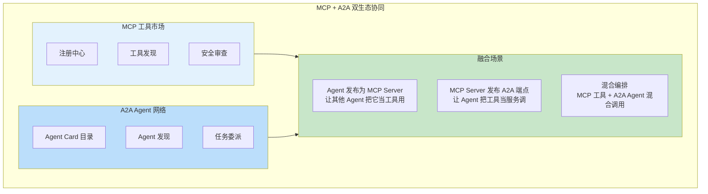

一个关键趋势是 **Agent 即工具**（Agent-as-Tool）——一个 Agent 可以同时暴露 MCP Server 接口（供 Host 应用调用）和 A2A 端点（供其他 Agent 委派任务）。这使得 Agent 网络的拓扑变得极其灵活。

---

## 9. Spring AI 中的 MCP 生态集成

### 9.1 Spring AI 2.0 的 MCP 支持

Spring AI 2.0 对 MCP 的支持深度体现在以下层面：

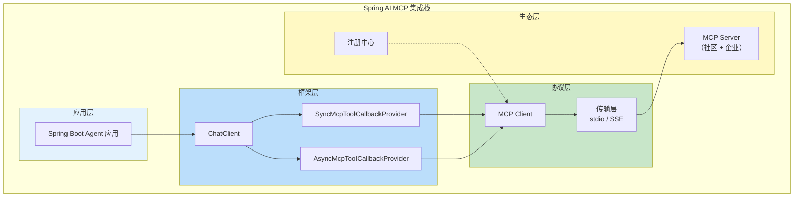

### 9.2 配置 MCP Server 的标准方式

```yaml
# Spring Boot application.yml 中配置 MCP Server
spring:
  ai:
    mcp:
      client:
        servers:
          - name: filesystem
            transport: stdio
            command: ["npx", "@modelcontextprotocol/server-filesystem"]
            args: ["/data/workspace"]
          - name: github
            transport: sse
            url: https://mcp.github.com/sse
            authentication:
              type: bearer
              token: ${GITHUB_TOKEN}
```

```java
@Configuration
public class McpConfig {

    @Bean
    public ToolCallbackProvider mcpToolCallbacks(
            List<McpClient> mcpClients) {
        return new SyncMcpToolCallbackProvider(mcpClients);
    }

    @Bean
    public ChatClient chatClient(ChatClient.Builder builder,
            ToolCallbackProvider toolProvider) {
        return builder
            .defaultTools(toolProvider)
            .build();
    }
}
```

---

## 10. 未来趋势

```mermaid
graph TB
    subgraph 趋势["MCP 生态六大趋势"]
        T1["标准化市场<br/>统一的发现 / 分发 / 计费标准"]
        T2["安全治理<br/>SBOM / 签名 / 沙箱化执行"]
        T3["智能编排<br/>Agent 自主选择最优工具组合"]
        T4["语义发现<br/>基于自然语言描述的工具匹配"]
        T5["跨平台互通<br/>MCP + A2A + OpenAPI 三标准融合"]
        T6["去中心化<br/>联邦注册中心 / 工具主权"]
    end

    style 趋势 fill:#e3f2fd
```

1. **标准化市场**：MCP 工具市场将走向类似 npm / PyPI 的标准化分发模式，包括版本管理、依赖解析、锁定文件。
2. **安全治理**：软件物料清单（SBOM）、代码签名、可重复构建等安全实践将被引入 MCP 生态。
3. **智能编排**：Agent 不再是被动使用工具，而是主动 **规划工具组合**——就像一个有经验的工程师知道什么任务该用什么工具链。
4. **语义发现**：工具发现将从关键词搜索升级为语义匹配——Agent 描述需求，系统自动找到最匹配的工具。
5. **跨平台互通**：MCP（工具）、A2A（Agent 通信）、OpenAPI（REST 服务）三大标准将逐步融合。
6. **去中心化**：单一注册中心可能形成垄断，联邦式去中心化注册中心是一个值得关注的方向。

### 10.1 企业 MCP 生态预测

| 时间 | 预期发展 |
|------|----------|
| 2026 上半年 | 主流云厂商推出托管 MCP Gateway 服务 |
| 2026 下半年 | 企业级 MCP Server 认证标准发布 |
| 2027 | MCP 成为 Agent 工具接入的事实标准 |
| 2027+ | MCP 工具市场规模超过传统 API 市场 |

---

## 11. 总结

MCP 已经从一个协议演化为一个快速成长的生态，正在成为 AI Agent 连接外部能力的 **事实标准**。核心调研发现如下：

1. **生态三阶段**：从协议标准（2024）到注册中心（2025）到工具市场（2026），MCP 正在复刻 Web 服务生态的演化路径。
2. **注册中心是基石**：Smithery、mcp.run、mcp.so 等注册中心解决了工具发现、版本管理和信任问题，是生态规模化基础设施。
3. **动态发现是未来**：从静态配置到动态发现的转变，使 Agent 能够按需加载工具，支撑大规模工具生态。
4. **企业需要 Gateway**：生产环境中必须有统一的 MCP Gateway 来处理认证、审计、限流、缓存等横切关注点，这与 Spring Cloud Gateway 的微服务治理理念一致。
5. **安全治理刻不容缓**：随着第三方 MCP Server 数量爆发，供应链安全、权限控制、调用审计成为企业必须面对的治理课题。
6. **MCP + A2A 协同**：MCP 治理工具接入，A2A 治理 Agent 通信，两者融合将催生真正的 Agent 网络生态。
7. **Spring AI 的定位**：Spring AI 2.0 的原生 MCP 支持使 Java 开发者可以直接参与这个生态，无论是作为消费者（使用工具）还是生产者（构建 MCP Server）。

对于 Java Agent 架构师，当前的最佳实践是：**积极参与 MCP 生态，同时建立企业级治理框架**。在利用社区工具市场加速开发的同时，通过注册中心、安全审查、调用审计等机制确保生产环境的安全可控。MCP 生态正在快速向"AI 时代的工具市场"方向演进，早期布局者将获得显著的生态红利。
