# 04-MCP 生态全景：Server 注册中心、服务发现与工具市场

> **定位**：本文调研 MCP 协议（[教程 10-MCP 协议](../教程/10-MCP协议.md) 的延伸）的生态全景——从单个 MCP Server 到注册中心、服务发现、工具市场、企业 MCP Gateway。探索 MCP 如何从"协议"演化为"生态"，以及这对 Agent 架构的影响。
>
> **性质声明**：本文为调研性质，MCP 生态正在快速扩张，具体产品和统计数据可能随时间变化。

---

## 1. MCP 生态的爆发

### 1.1 从协议到生态

MCP 于 2024 年 11 月发布时，只有一个参考实现和少数几个示例 Server。到 2025 年底，MCP 生态经历了爆发式增长：

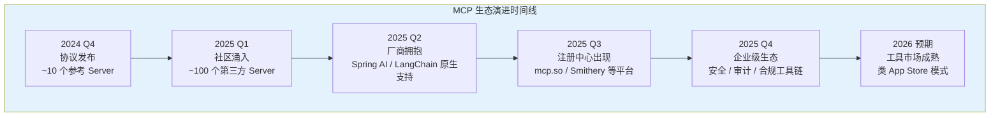

### 1.2 MCP 生态的三个圈层

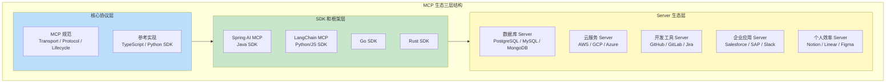

---

## 2. MCP Server 分类全景

### 2.1 按能力类型分类

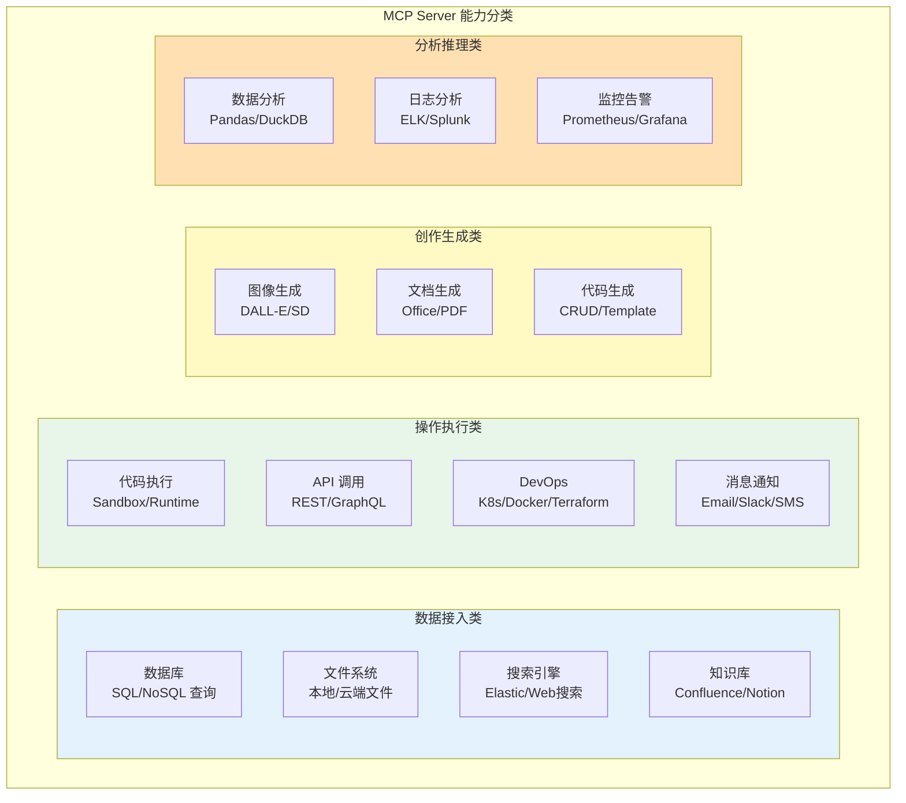

### 2.2 典型 Server 详表

| Server 名称 | 能力 | 开发方 | 场景 |
|-------------|------|--------|------|
| postgres-mcp | PostgreSQL 读写 | 社区 | Agent 直接查询数据库 |
| github-mcp | GitHub API 全覆盖 | GitHub 官方 | 代码管理、Issue、PR |
| filesystem-mcp | 文件系统读写 | Anthropic | 文档处理 |
| brave-search-mcp | Web 搜索 | Brave | 实时信息获取 |
| slack-mcp | Slack 消息收发 | Slack 官方 | 团队协作 Agent |
| puppeteer-mcp | 浏览器自动化 | 社区 | Web 爬取、UI 自动化 |
| memory-mcp | 知识图谱存储 | Anthropic | Agent 长期记忆 |
| sequential-thinking-mcp | 结构化推理 | Anthropic | 复杂问题分解 |
| time-mcp | 时间/时区查询 | 社区 | 日程/时区处理 |
| sqlite-mcp | SQLite 操作 | 社区 | 轻量级数据存储 |

---

## 3. 服务发现：MCP 的"DNS"

### 3.1 问题的产生

当 MCP Server 数量从十几个增长到数千个时，Agent 如何知道"有哪些 Server 可用"、"哪个 Server 能做我需要的事"？这就是 **MCP 服务发现** 问题。

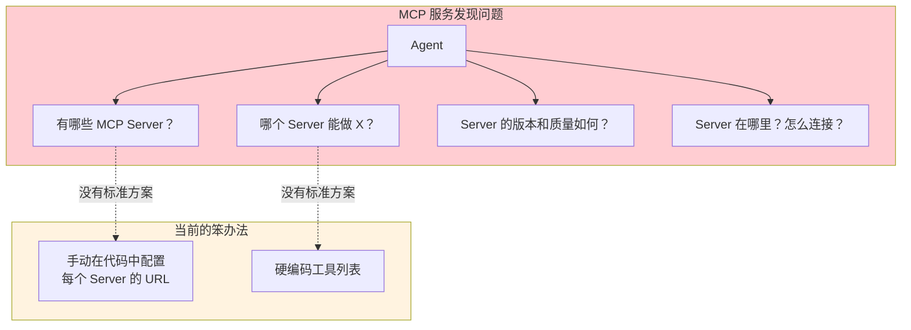

### 3.2 注册中心架构

MCP 注册中心（Registry）是解决服务发现的标准方案，其架构借鉴了微服务注册中心（如 Eureka、Consul）：

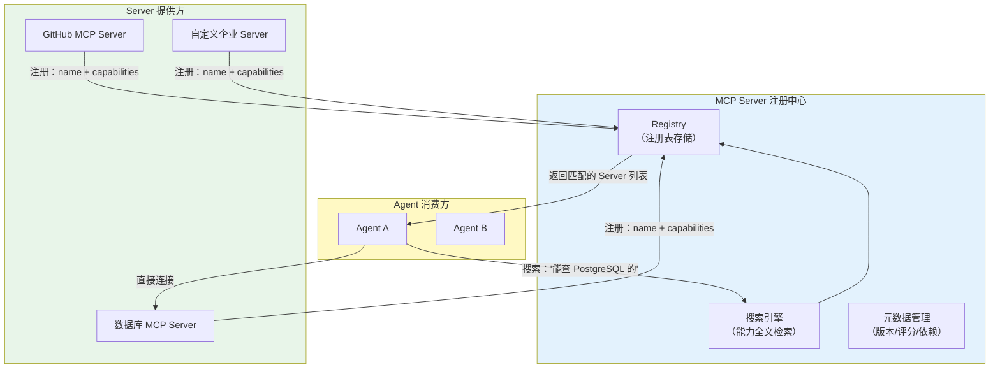

### 3.3 注册中心的核心功能

| 功能 | 说明 | 对标微服务 |
|------|------|-----------|
| **服务注册** | Server 启动时注册自己的信息 | Eureka Register |
| **服务发现** | Agent 按能力搜索可用 Server | Eureka Discovery |
| **健康检查** | 定期检查 Server 是否存活 | Eureka Heartbeat |
| **版本管理** | 记录 Server 版本和兼容性 | API Versioning |
| **质量评分** | 用户评分、使用统计 | App Store Rating |
| **依赖管理** | Server 之间的依赖关系 | Maven/npm Dependency |

### 3.4 现有平台

2025 年出现了多个 MCP Server 聚合平台：

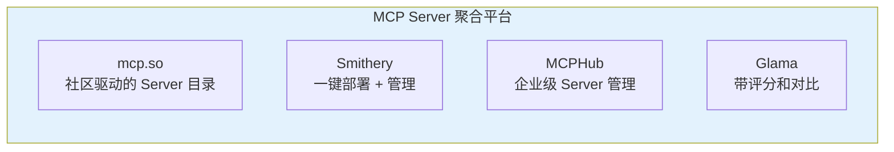

这些平台类似于 MCP 生态的"App Store"——浏览、搜索、安装、管理 MCP Server。

---

## 4. 企业 MCP Gateway 架构

### 4.1 为什么需要 Gateway

在企业环境中，直接让每个 Agent 连接外部 MCP Server 是不可行的——需要统一的入口来处理认证、审计、限流、缓存等横切关注点：

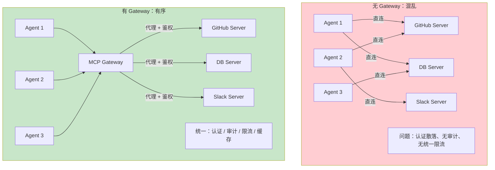

### 4.2 Gateway 核心功能

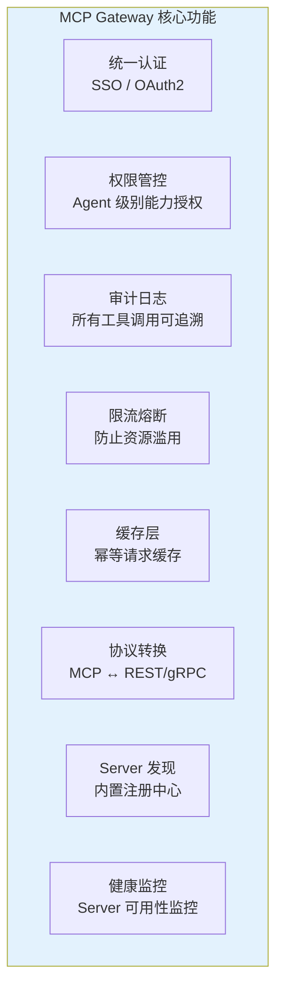

### 4.3 基于 Spring Cloud 的 Gateway 实现

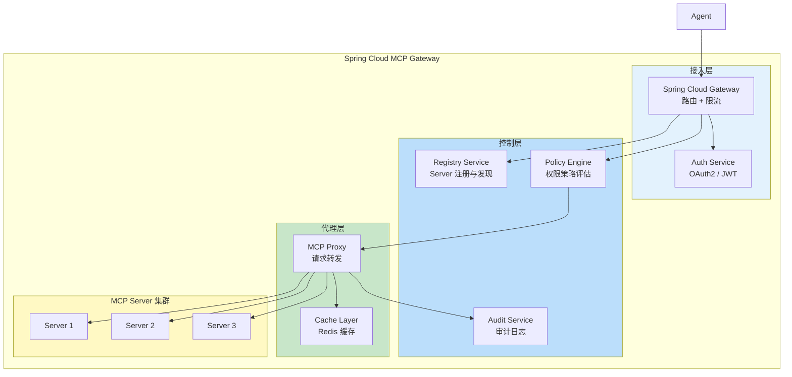

这个架构与我们 [教程 14-管控分离架构](../教程/14-管控分离架构.md) 和 [项目 03-MCP 工具网关](../项目/03-MCP工具网关/00-需求分析与架构设计.md) 的设计高度一致——MCP Gateway 就是管控分离理念在 MCP 生态中的具体实现。

### 4.4 权限模型

```java
// MCP Gateway 权限策略概念
public class McpGatewayPolicy {

    // Agent 级别的工具访问策略
    public record AgentPolicy(
        String agentId,
        Map<String, ToolPermission> toolPermissions,
        RateLimit rateLimit,
        TokenBudget tokenBudget
    ) {}

    public record ToolPermission(
        String toolName,
        AccessLevel level,        // READ / WRITE / ADMIN
        List<String> allowedArgs, // 限制可传入的参数
        boolean requireApproval   // 是否需要人工审批
    ) {}

    public record RateLimit(
        int callsPerMinute,
        int callsPerDay,
        long tokensPerDay
    ) {}
}
```

---

## 5. MCP 工具市场展望

### 5.1 从 Registry 到 Marketplace

MCP 注册中心的自然演化方向是 **工具市场（Marketplace）**——不仅是发现和连接，还包含安装、计费、质量认证等完整生命周期管理。

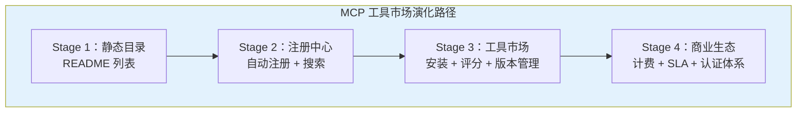

### 5.2 工具市场的关键挑战

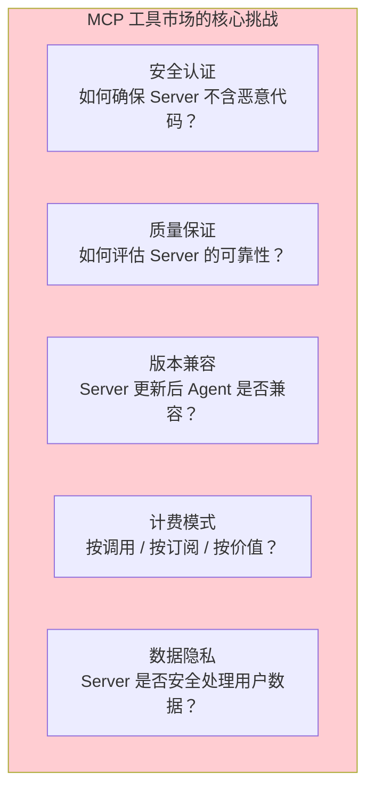

### 5.3 MCP 市场与 API 市场的对比

| 维度 | 传统 API 市场（如 RapidAPI） | MCP 工具市场 |
|------|---------------------------|-------------|
| **接口标准** | REST/GraphQL（各异） | MCP（统一） |
| **调用者** | 人类开发者编写代码 | Agent 自主调用 |
| **发现方式** | 人工浏览文档 | Agent Card 自动匹配 |
| **计费** | 按请求/月 | 按 Token/调用 |
| **质量评估** | 人工评论 | Agent 调用成功率 |
| **安全模型** | API Key | Capability-based |

---

## 6. MCP Server 的工程实践

### 6.1 Server 设计原则

设计一个好的 MCP Server 需要遵循以下原则：

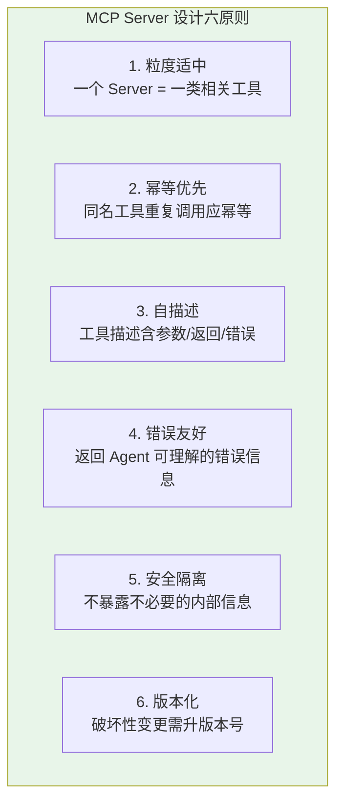

### 6.2 Spring AI MCP Server 示例

```java
// 基于 Spring AI 2.0 构建企业级 MCP Server
@SpringBootApplication
public class EnterpriseMcpServer {

    public static void main(String[] args) {
        SpringApplication.run(EnterpriseMcpServer.class, args);
    }

    @Bean
    @Tool(description = "查询客户订单状态")
    public OrderStatus queryOrder(
            @ToolParam(description = "订单号") String orderId,
            @ToolParam(description = "客户ID", required = false) String customerId
    ) {
        return orderService.findByOrderId(orderId);
    }

    @Bean
    @Tool(description = "创建退货申请")
    public ReturnRequest createReturn(
            @ToolParam(description = "订单号") String orderId,
            @ToolParam(description = "退货原因") String reason
    ) {
        // 幂等检查：同一订单已有退货申请则返回已有记录
        return returnService.findOrCreate(orderId, reason);
    }
}
```

### 6.3 Server 测试策略

MCP Server 的测试需要覆盖三个层次：

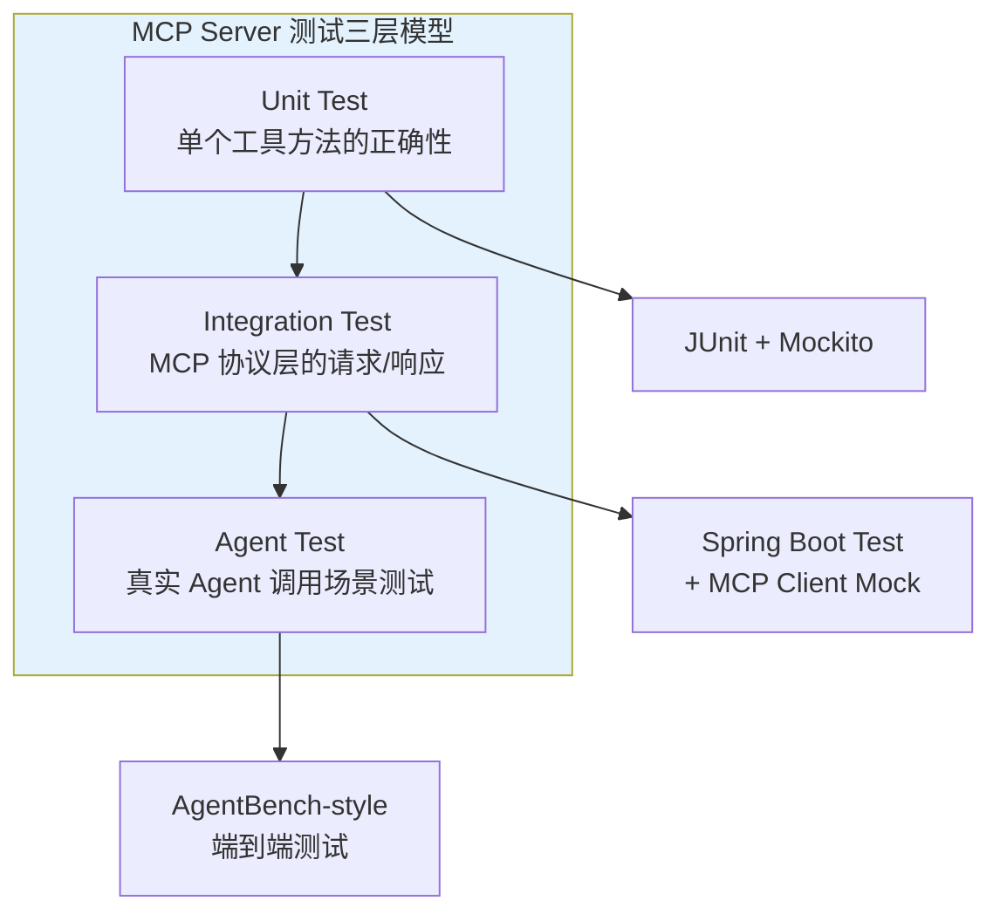

---

## 7. 生态发展趋势

### 7.1 MCP + A2A 组合

[前沿 00-A2A 协议](00-A2A协议.md) 中我们讨论了 A2A 与 MCP 的互补关系。未来的 Agent 网络将同时使用两种协议：

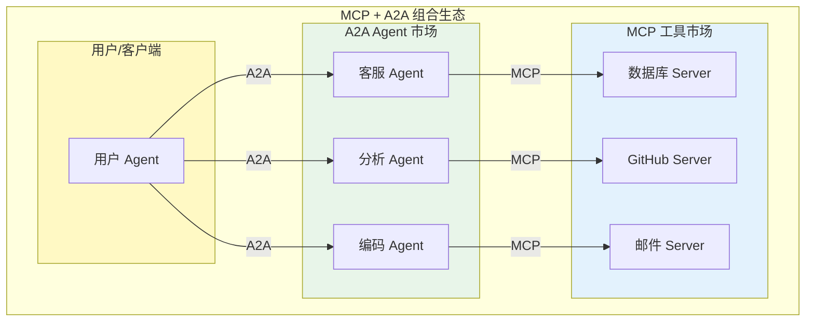

### 7.2 MCP 标准化进程

MCP 正在向行业标准演进：

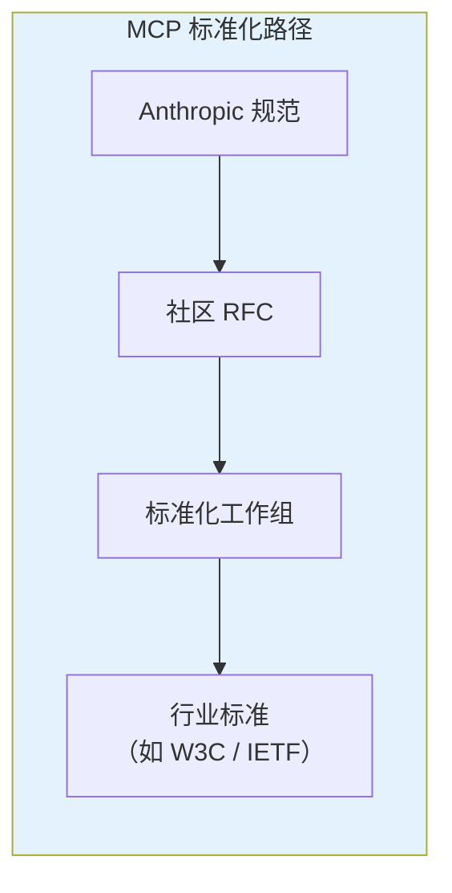

### 7.3 企业 MCP 生态预测

| 时间 | 预期发展 |
|------|----------|
| 2026 上半年 | 主流云厂商推出托管 MCP Gateway 服务 |
| 2026 下半年 | 企业级 MCP Server 认证标准发布 |
| 2027 | MCP 成为 Agent 工具接入的事实标准 |
| 2027+ | MCP 工具市场规模超过传统 API 市场 |

---

## 8. 总结

MCP 正在从一项协议演化为一个完整的生态系统。核心调研发现如下：

1. **生态爆发**：MCP Server 从 2024 年底的数十个增长到 2025 年底的数千个，覆盖数据库、云服务、开发工具、企业应用等各类场景。
2. **服务发现是关键缺口**：当前 MCP 生态最大的痛点是缺乏标准化的服务发现机制，注册中心和聚合平台正在填补这一空白。
3. **企业需要 Gateway**：生产环境中必须有统一的 MCP Gateway 来处理认证、审计、限流、缓存等横切关注点，这与 Spring Cloud Gateway 的微服务治理理念一致。
4. **工具市场是终局**：MCP 注册中心将自然演化为工具市场，包含安装、计费、质量认证等完整能力，类似 App Store 模式。
5. **MCP + A2A 构成完整生态**：MCP 治理 Agent 与工具的纵向连接，A2A 治理 Agent 间的横向通信，两者共同构成 Agent 网络的基础设施。

对于 Java Agent 架构师而言，建议积极参与 MCP 生态建设——在企业内部构建 MCP Server 时遵循社区最佳实践，为未来接入公共 MCP 工具市场做好准备。
