# 05-Agent 记忆前沿：从向量存储到神经记忆

> **定位**：本文调研 Agent 记忆研究的前沿方向。我们在 [教程 04-记忆与会话管理](../教程/04-记忆与会话管理.md) 和 [教程 39-高级记忆架构](../教程/39-高级记忆架构.md) 中已经讨论了工程化的记忆方案（短期记忆、长期记忆、向量检索）。本文将视角推向前沿：记忆演化模型、神经记忆系统、持久化记忆研究、以及"记忆即参数"的范式转变。
>
> **性质声明**：本文为调研性质，涉及大量学术界和工业界的早期研究方向，部分技术尚未成熟到工程落地阶段。

---

## 1. Agent 记忆的范式演进

### 1.1 三代记忆系统

Agent 的记忆系统正在经历从"存储"到"学习"的范式转变：

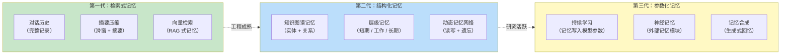

### 1.2 人类记忆的认知科学映射

前沿 Agent 记忆研究大量借鉴了认知科学中的人类记忆模型：

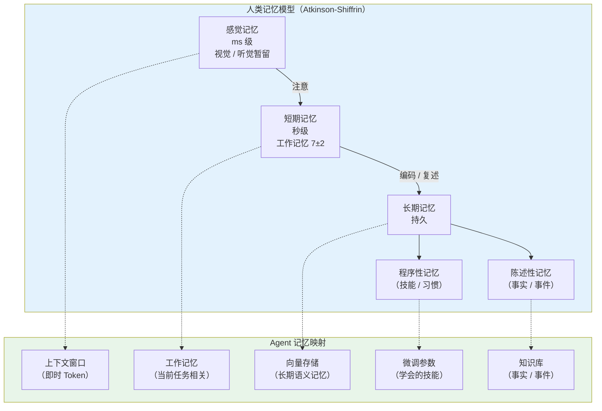

这个映射不是简单的类比——它指导着 Agent 记忆系统的架构设计：不同层级的记忆需要不同的存储介质、不同的读写策略和不同的遗忘机制。当前大多数 Agent 只有上下文窗口（即时记忆）和向量库（语义记忆），而情景记忆和程序记忆的实现极其原始。

---

## 2. 记忆演化模型

### 2.1 记忆不是静态存储：遗忘与强化

当前大多数 Agent 记忆系统是 **静态** 的——写入后就一直保留，直到被显式删除。但人类记忆是 **动态演化** 的：重要的记忆被强化，不重要的被遗忘，关联的记忆被整合。


### 2.2 Ebbinghaus 遗忘曲线在 Agent 中的应用

德国心理学家 Ebbinghaus 发现人类记忆随时间指数衰减。前沿研究中，一些 Agent 记忆系统开始引入类似的遗忘机制。在 Agent 中应用遗忘曲线的核心公式：

```
记忆分数 = 重要性 x 回忆次数^alpha x e^(-经过时间/记忆半衰期)
```

其中：
- **重要性**：由 LLM 判断该条记忆的重要程度（1-10 分）
- **回忆次数**：该条记忆被检索/使用过的次数（每次回忆都增强记忆）
- **时间衰减**：经过的时间越长，记忆权重越低

### 2.3 Generative Agents 的记忆模型

斯坦福大学和 Google 的 Generative Agents 研究（2023）提出了一个开创性的记忆演化模型，包含三个核心操作：

| 操作 | 人类认知类比 | 在 Agent 中的实现 | 触发时机 |
|------|-------------|-------------------|----------|
| **观察（Observation）** | 感知新事件 | 将对话/事件写入记忆库 | 每次交互 |
| **反思（Reflection）** | 思考和总结 | 定期合成高层级抽象记忆 | 周期性 / 累积后 |
| **计划（Planning）** | 制定计划 | 基于记忆生成行动计划 | 任务开始时 |

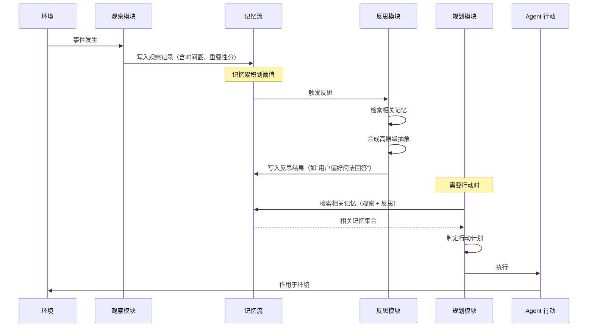

### 2.4 记忆整合（Memory Consolidation）

人类在睡眠时，大脑会 **整合** 白天的记忆——将短期记忆转化为长期记忆，将相似记忆合并，丢弃不重要的细节。Agent 记忆也需要类似的"离线整合"过程：

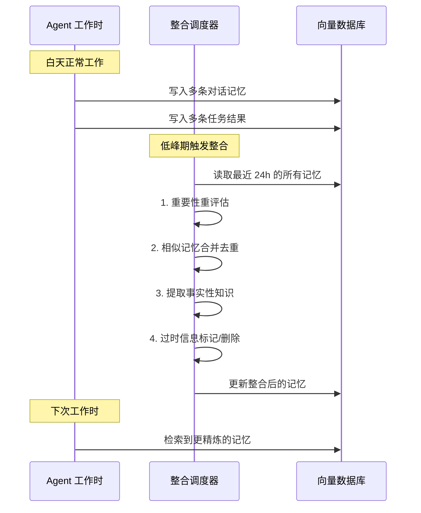

记忆整合的关键操作：

| 操作 | 说明 | 效果 |
|------|------|------|
| **去重合并** | 将语义相似的多条记忆合并为一条 | 减少冗余 |
| **事实提取** | 从对话中提取事实性知识（"用户偏好中文"） | 语义记忆强化 |
| **过时标记** | 标记不再有效的记忆（旧地址、旧偏好） | 检索时降权 |
| **摘要压缩** | 将长对话压缩为简洁摘要 | 节省存储和 Token |
| **关联强化** | 发现记忆间的关联并建立链接 | 提高检索质量 |

### 2.5 重要性的量化

记忆的重要性不是二元的，而是连续的。前沿研究提出了多维重要性评估：

```java
// 记忆重要性评估模型（概念）
public record MemoryImportance(
    double recency,      // 时间近度：越近越重要
    double frequency,    // 访问频率：越常被引用越重要
    double relevance,    // 语义相关度：与当前任务的匹配度
    double novelty,      // 新颖性：与已有记忆的差异度
    double emotional,    // 情感权重：用户反馈 / 错误事件
    double explicit      // 显式标记：用户明确说"记住这个"
) {
    // 综合评分（加权组合）
    public double score() {
        return recency * 0.2
             + frequency * 0.2
             + relevance * 0.3
             + novelty * 0.1
             + emotional * 0.1
             + explicit * 0.1;
    }
}
```

这种多维评分直接影响了记忆的检索排序和遗忘策略——重要性低于阈值的记忆会被归档或删除。

---

## 3. 神经记忆：外部记忆模块

### 3.1 从"检索"到"读写"：神经记忆的范式

传统 Agent 记忆依赖 **向量检索**——把记忆存为向量，查询时计算相似度。这种模式有一个根本局限：**检索是被动的，记忆不会主动参与推理**。

神经记忆（Neural Memory）的目标是构建一个 **可微分的记忆模块**——记忆不是"被查找的数据库"，而是"参与推理的网络组件"。

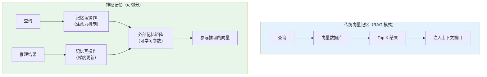

### 3.2 两种记忆范式对比

当前 Agent 记忆主要依赖 **外部记忆**——向量数据库存储，检索时注入上下文。但学术界正在探索 **参数化记忆**——将知识直接写入模型参数。

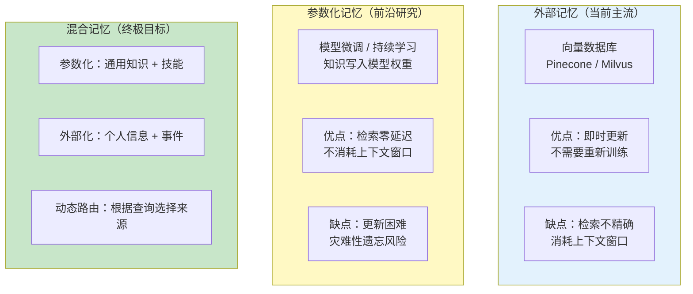

关键区别在于：
- **向量检索** 是精确的、离散的——返回 Top-K 条记忆。
- **神经记忆读** 是模糊的、连续的——通过注意力机制从记忆矩阵中"软读取"信息，产生一个融合了多条记忆的向量。
- **神经记忆写** 会 **修改** 记忆矩阵——新信息通过梯度更新融入已有记忆，而不是简单追加一条新记录。

### 3.3 记忆增强神经网络

一个有前景的方向是 **记忆增强神经网络（Memory-augmented Networks）**——模型同时拥有参数化记忆和可读写的外部记忆矩阵：

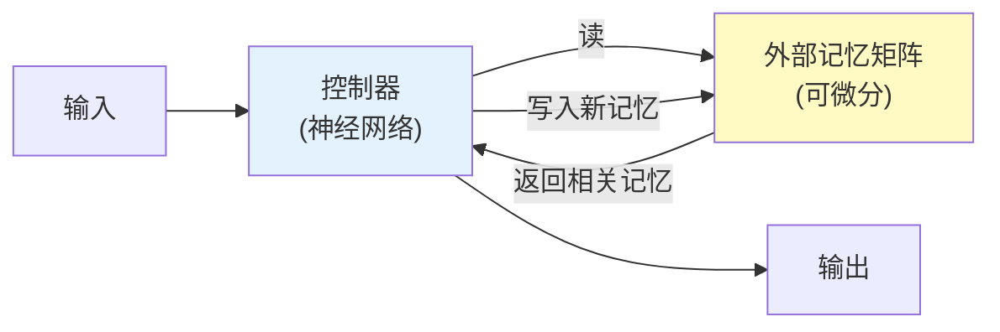

这类模型（如 Neural Turing Machine、Differentiable Neural Computer）在学术上有重要意义，但在 LLM 规模上的实用性尚未验证。

### 3.4 在 Agent 中的实际意义

虽然完整的神经记忆架构在当前 LLM 上难以端到端训练，但其思想正在以 **简化形式** 影响实际工程：

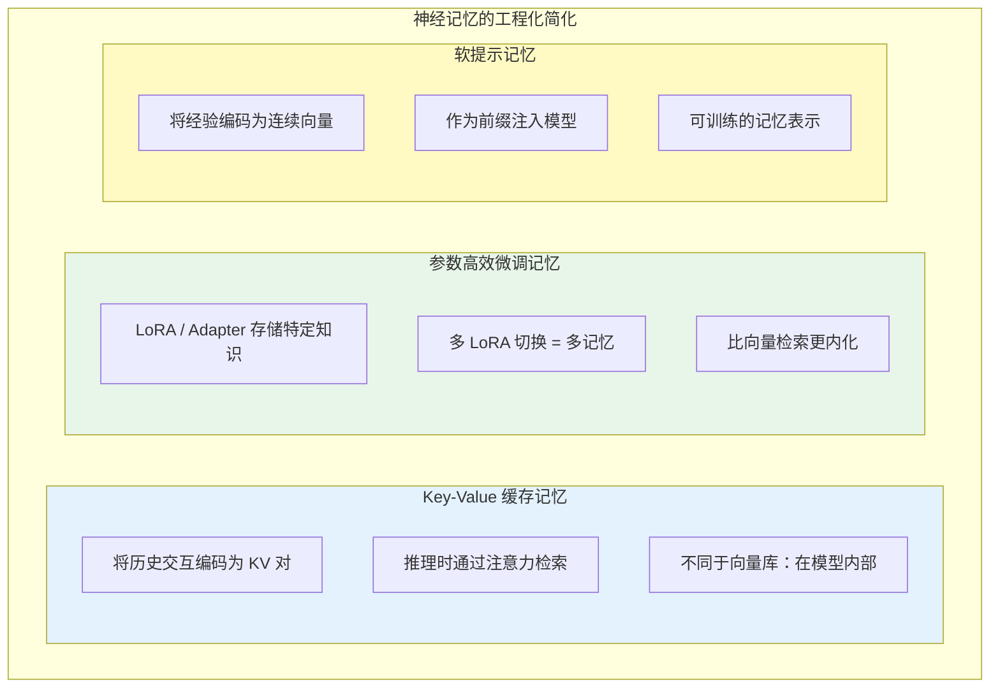

---

## 4. 持久化记忆：跨会话与跨用户

### 4.1 记忆持久化的三层模型

当前的 Agent 记忆大多是 **单会话** 的——对话结束后记忆就丢失了（或仅以摘要形式保留）。真正有用的 Agent 需要跨越会话边界保持记忆：

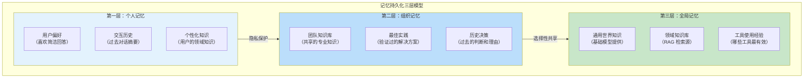

### 4.2 记忆的隐私与所有权

持久化记忆引发了严重的隐私问题：

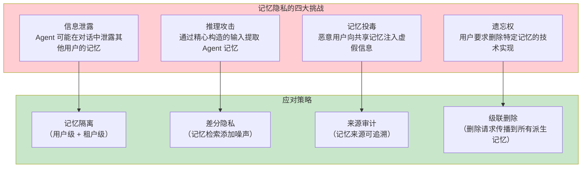

GDPR 的"被遗忘权"（Right to Erasure）对 Agent 记忆系统提出了特殊要求——不仅要删除主存储中的记忆，还要清除所有备份、缓存、向量索引中的对应条目。这在技术上非常困难。这些挑战与 [教程 31-安全与权限控制](../教程/31-安全与权限控制.md) 和 [教程 25-历史记录持久化与合规](../教程/25-历史记录持久化与合规.md) 中的企业级安全实践直接相关。

### 4.3 记忆一致性

在分布式 Agent 环境中，多个 Agent 可能同时读写共享记忆，需要解决 **记忆一致性** 问题：

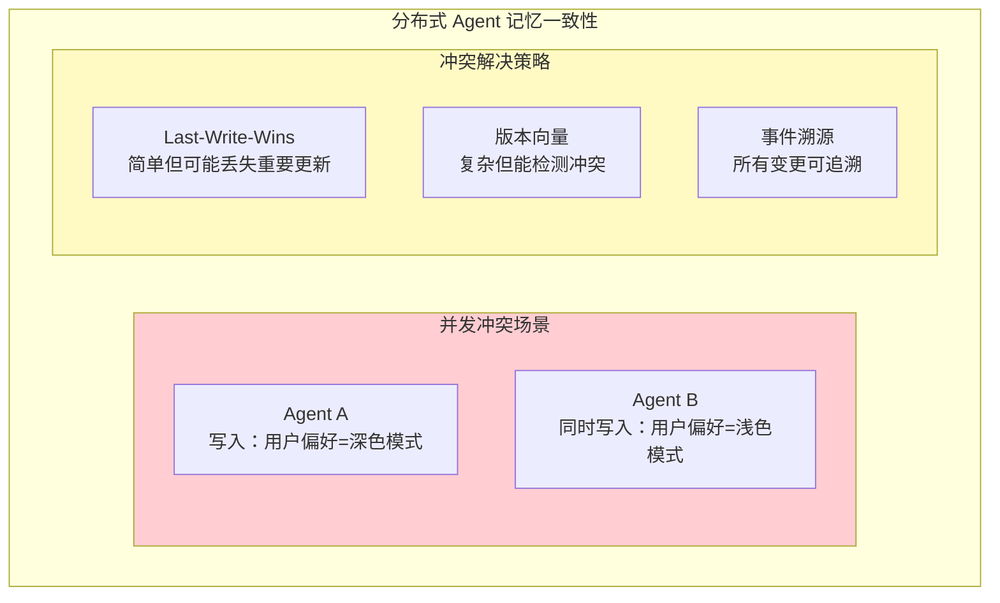

### 4.4 记忆版本化

记忆应该像代码一样可版本化——用户可以"撤销"Agent 学到的错误知识：

| 策略 | 说明 | 特点 |
|------|------|------|
| 时间戳版本 | 每条记忆带 created_at | 简单但回滚粗糙 |
| 定期快照 | 定期保存记忆完整快照 | 回滚精确但存储开销大 |
| 事件日志 | 记忆变更作为不可变事件流 | 最灵活但实现复杂（Event Sourcing 模式） |

事件溯源（Event Sourcing）模式特别适合 Agent 记忆——它记录的是"发生了什么"（事件），而不是"当前状态"，可以从事件流重建任意时间点的记忆状态。

---

## 5. 记忆的遗忘机制

### 5.1 为什么遗忘是必要的

人类大脑约 99% 的感官输入会被"遗忘"——这不是缺陷而是特性。没有遗忘机制的大脑会被噪音淹没，无法提取真正重要的信息。Agent 记忆同样需要主动的遗忘策略。

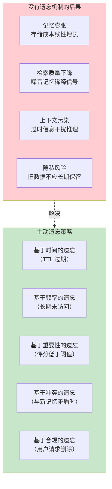

### 5.2 渐进式遗忘

前沿研究不提倡硬删除，而是 **渐进式遗忘**——记忆先被压缩（细节被概括），再被归档（移出活跃集），最后才被删除：

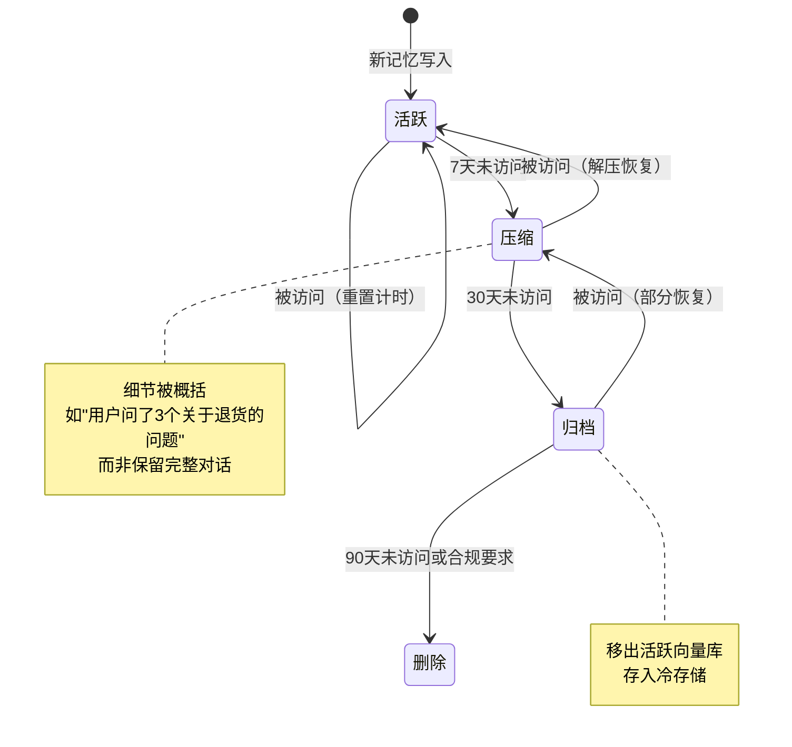

### 5.3 概念代码：演化记忆实现

```java
// 演化记忆生命周期管理器（概念模型）
@Service
public class EvolvingChatMemory implements ChatMemory {

    private final VectorStore vectorStore;
    private final ChatClient judgeClient;  // 用于重要性评估的 LLM
    private final MemoryStore activeStore;     // 活跃记忆（热）
    private final MemoryStore compressedStore; // 压缩记忆（温）
    private final MemoryStore archiveStore;    // 归档记忆（冷）

    @Override
    public void add(String conversationId, List<Message> messages) {
        for (Message message : messages) {
            // 1. 评估重要性
            int importance = assessImportance(message);

            // 2. 构建记忆条目（带元数据）
            var memoryEntry = MemoryEntry.builder()
                .content(message.getText())
                .conversationId(conversationId)
                .importanceScore(importance)
                .createdAt(Instant.now())
                .lastAccessedAt(Instant.now())
                .accessCount(0)
                .build();

            // 3. 存入活跃记忆库
            activeStore.save(memoryEntry);
        }
    }

    // javap 实证：ChatMemory.get(String) 单参（无 lastN）；窗口大小由实现内部决定
    @Override
    public List<Message> get(String conversationId) {
        return getRecent(conversationId, 20);
    }

    private List<Message> getRecent(String conversationId, int lastN) {
        // 1. 检索候选记忆（活跃 + 压缩）
        var candidates = Flux.merge(
            activeStore.search(conversationId, lastN * 2),
            compressedStore.search(conversationId, lastN)
        );

        // 2. 应用记忆衰减公式重排序
        var scored = candidates
            .map(mem -> new ScoredMemory(mem, calculateDecayScore(mem)))
            .sort(Comparator.comparingDouble(ScoredMemory::score).reversed())
            .take(lastN);

        // 3. 更新访问计数和最后访问时间
        scored.doOnNext(this::updateAccessMetadata).subscribe();

        return scored.map(sm -> (Message) new UserMessage(sm.content())).collectList().block();
    }

    // 记忆衰减评分：基于 Ebbinghaus 遗忘曲线
    private double calculateDecayScore(MemoryEntry mem) {
        long hoursPassed = Duration.between(
            mem.lastAccessedAt(), Instant.now()).toHours();
        return mem.importanceScore()
             * Math.pow(mem.accessCount() + 1, 0.5)  // 回忆增强
             * Math.exp(-hoursPassed / (24.0 * 7));   // 时间衰减
    }

    // 定期执行记忆整合（每天凌晨 3 点）
    @Scheduled(cron = "0 0 3 * * *")
    public void consolidateMemories() {
        // 1. 压缩超时活跃记忆
        activeStore.findOlderThan(Duration.ofDays(7))
            .flatMap(this::compress)
            .flatMap(compressedStore::save)
            .flatMap(m -> activeStore.delete(m.id()))
            .subscribe();

        // 2. 归档超时压缩记忆
        compressedStore.findOlderThan(Duration.ofDays(30))
            .flatMap(archiveStore::save)
            .flatMap(m -> compressedStore.delete(m.id()))
            .subscribe();

        // 3. 删除超时归档记忆
        archiveStore.findOlderThan(Duration.ofDays(90))
            .flatMap(m -> archiveStore.delete(m.id()))
            .subscribe();
    }

    private Mono<MemoryEntry> compress(MemoryEntry original) {
        // 使用 LLM 对记忆进行摘要压缩
        return Mono.fromFuture(
            judgeClient.prompt()
                .user("将以下记忆压缩为简洁摘要，保留关键事实：" +
                      original.content())
                .call()
                .content()
        ).map(summary -> original.toBuilder()
            .content(summary)
            .type(MemoryType.COMPRESSED)
            .build());
    }

    private int assessImportance(Message message) {
        // 使用 LLM 评估记忆重要性（1-10）
        String result = judgeClient.prompt()
            .user("评估以下内容的重要性（1-10）：" + message.getText())
            .call()
            .content();
        return Integer.parseInt(result.trim());
    }
}
```

---

## 6. 共享记忆与集体智能

### 6.1 多 Agent 共享记忆

在 [教程 09-多 Agent 协作](../教程/09-多Agent协作.md) 中讨论的多 Agent 场景下，Agent 之间可以共享记忆，形成集体智能：

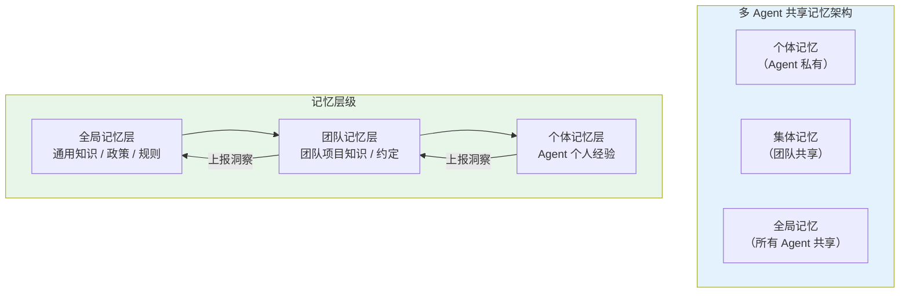

### 6.2 记忆冲突与一致性

当多个 Agent 对同一事实有不同的记忆时，如何处理冲突？这类似于分布式系统中的一致性问题：

| 冲突类型 | 示例 | 解决策略 |
|----------|------|----------|
| **时间冲突** | Agent A 记录价格是 100，Agent B 记录是 120 | 以最新为准（时间戳排序） |
| **来源冲突** | 两个 Agent 从不同来源获得矛盾信息 | 信任加权（来源可信度评分） |
| **上下文冲突** | 同一事实在不同上下文中成立 | 保留两种版本 + 上下文标签 |
| **进化冲突** | 事实已变化（如人员变动） | 旧版本标记为过时但保留 |

### 6.3 群体智慧

当大量 Agent 共享记忆时，可以从集体经验中提取 **群体智慧**：

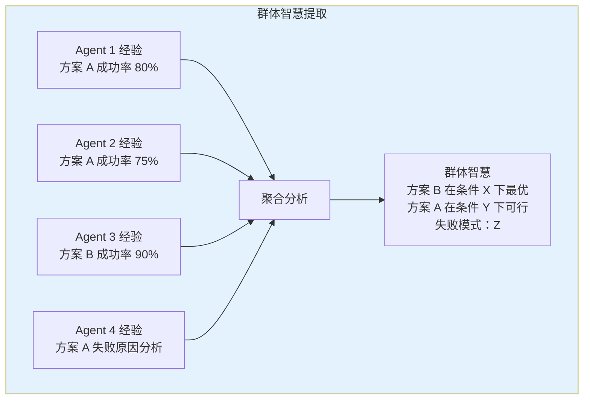

这与 [教程 41-数据飞轮与持续改进](../教程/41-数据飞轮与持续改进.md) 中的数据飞轮理念高度一致——Agent 的集体经验可以反哺系统优化。

---

## 7. 前沿研究方向

### 7.1 持续学习与灾难性遗忘

Agent 记忆的终极形态是 **持续学习**——Agent 在使用过程中不断将新知识内化到模型参数中。但这里有一个经典难题：**灾难性遗忘**（Catastrophic Forgetting）——学习新知识会覆盖旧知识。

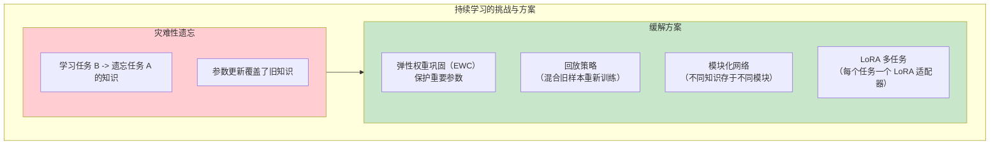

### 7.2 记忆增强的语言模型

一个值得关注的方向是 **将记忆能力直接嵌入模型架构**，而不是作为外部系统。前沿研究正在探索混合模式：LLM 内嵌短期记忆，外接长期记忆，两者协同工作。

### 7.3 记忆的可解释性

当 Agent 做出一个决策时，它是基于哪些记忆做出的？**记忆的可解释性** 是建立用户信任的关键：

| 可解释性需求 | 说明 |
|-------------|------|
| 决策溯源 | 这个回答基于哪些记忆？ |
| 记忆来源 | 这条记忆从何而来？何时获取？ |
| 记忆可信度 | 这条记忆有多可靠？ |
| 记忆影响 | 如果删除这条记忆，决策会改变吗？ |

这与 [前沿 03-Agent 评测基准](03-Agent评测基准.md) 中讨论的过程评估理念一致——不仅要看结果，还要看记忆使用的合理性。

### 7.4 情景记忆的时间索引

人类回忆往事时，经常以时间线索触发（"上周二那次会议"）。Agent 的情景记忆也应该支持时间索引。当前的向量检索只支持语义相似度匹配，不支持时间范围查询。前沿研究在探索 **多维度记忆索引**——同时支持语义、时间、重要性、情感等多维度的混合检索。

---

## 8. 在 Spring AI 中的实现展望

### 8.1 当前 Spring AI 的记忆能力

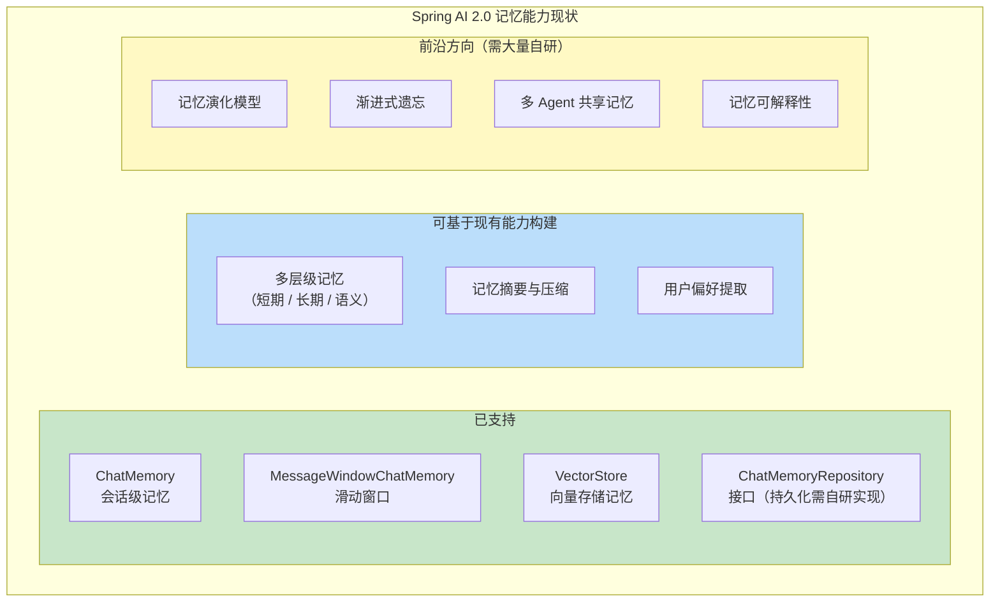

### 8.2 演进路线建议

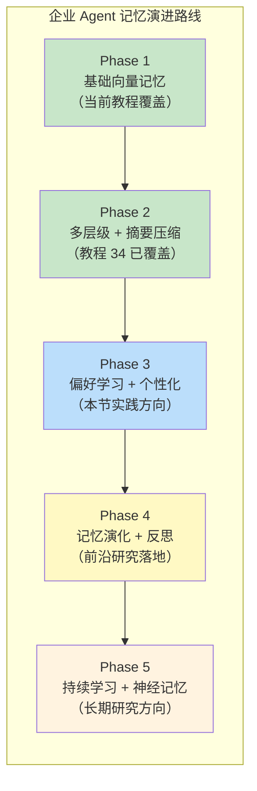

---

## 9. 记忆评估：如何衡量记忆质量

### 9.1 记忆质量指标

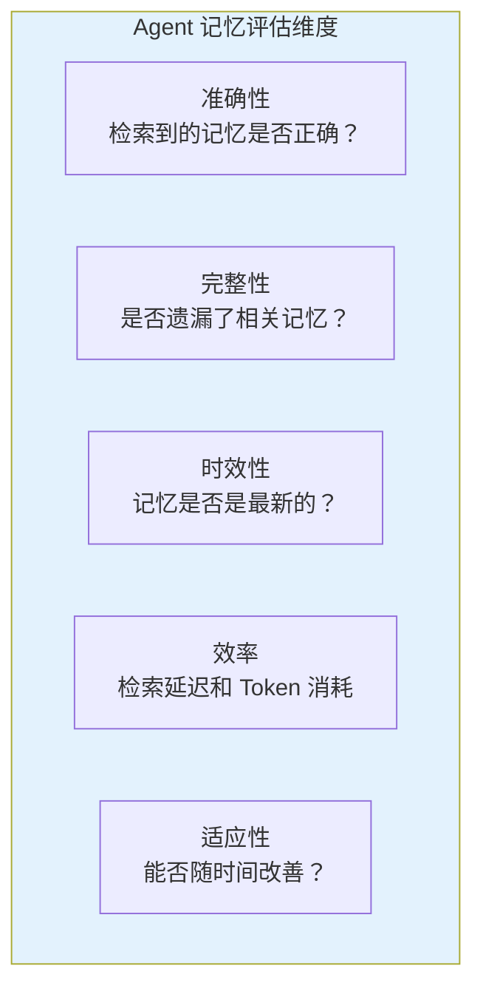

### 9.2 记忆基准测试

当前缺乏标准化的 Agent 记忆基准测试。这是 [前沿 03-Agent 评测基准](03-Agent评测基准.md) 的一个子问题——需要专门针对记忆能力的评测集：

| 评估任务 | 说明 | 挑战 |
|----------|------|------|
| 长期记忆保持 | 1000 轮对话后能否回忆第 1 轮的信息 | 超出任何上下文窗口 |
| 跨会话记忆 | 新会话中能否利用旧会话的知识 | 记忆检索质量 |
| 记忆冲突解决 | 当新信息与旧记忆矛盾时如何处理 | 一致性维护 |
| 遗忘效果 | 引入遗忘后性能是否改善（而非下降） | 评估指标设计 |

---

## 10. 总结

Agent 记忆研究正处于从"工程实践"向"科学研究"过渡的关键阶段。核心调研发现如下：

1. **三代演进**：从检索式记忆（RAG）到结构化记忆（知识图谱）到参数化记忆（持续学习），Agent 记忆正在经历范式跃迁。
2. **记忆不是静态的**：前沿记忆模型强调 **演化**——观察、反思、遗忘、强化构成了记忆的动态生命周期。静态的"写入即保存"模式是初级形态。Ebbinghaus 遗忘曲线、记忆整合、重要性评估是构建演化记忆的三大工具。
3. **神经记忆是远期方向**：将记忆作为可微分的网络组件而非外部数据库，是记忆研究的终极愿景，但当前仍处于早期阶段。工程化的简化形式（KV 缓存、LoRA 记忆、软提示）是可落地的中间形态。
4. **遗忘是特性而非缺陷**：主动的、渐进式的遗忘机制对维持记忆系统质量至关重要。好的遗忘策略比好的记忆存储更难设计。
5. **工程挑战严峻**：分布式一致性、隐私合规、版本化、时间索引等工程问题尚未有成熟方案，需要借鉴分布式系统和数据库领域的成熟经验。
6. **共享记忆催生集体智能**：多 Agent 共享记忆可以产生超越个体能力的群体智慧，但需要解决一致性、隐私和冲突解决问题。
7. **Spring AI 的扩展空间**：当前 Spring AI 的记忆能力处于基础水平，通过自定义 ChatMemory 实现可以引入演化机制，但缺乏框架级支持。架构师可以在 ChatMemory 接口之上构建完整的演化记忆系统。

对于 Java Agent 架构师，当前的建议是：**在掌握工程化记忆方案的基础上，前瞻性地为记忆演化预留架构空间**。具体来说，在设计记忆系统时引入重要性评分、TTL 驱动的渐进式遗忘、以及周期性反思机制——这些不需要等待底层技术的突破，今天就可以基于 Spring AI 的基础设施实现。即使今天只做简单的向量检索，也应该为每条记忆添加重要性评分、时间戳、访问计数等元数据，为未来引入遗忘曲线和记忆整合做好准备。
