# 05-Agent 记忆前沿：记忆演化、神经记忆与持久化研究

> **定位**：本文调研 Agent 记忆系统的前沿研究方向——从工程化的记忆架构（[教程 34-高级记忆架构](../教程/34-高级记忆架构.md) 的延伸）到学术界的记忆演化模型、神经记忆机制、终身学习。探索 Agent 记忆从"存储"到"演化"的范式跃迁。
>
> **性质声明**：本文为调研性质，涉及大量前沿学术研究，部分方向尚处于论文阶段，距离工程落地有较大差距。

---

## 1. 记忆问题的本质

### 1.1 为什么记忆是 Agent 的核心瓶颈

Agent 的记忆不是简单的"存取"问题，而是一个涉及认知科学、信息检索、分布式系统的复杂问题。让我们从人类记忆系统出发理解 Agent 记忆的设计空间。

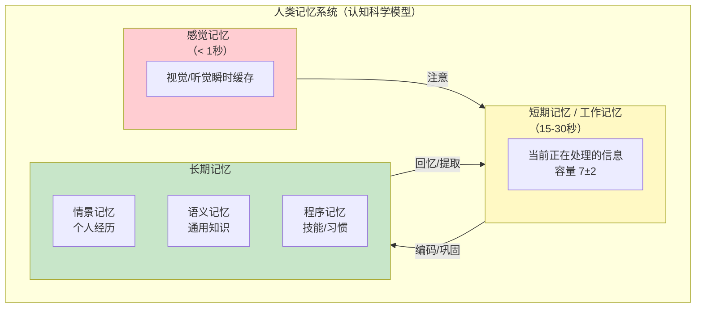

### 1.2 Agent 记忆的对应关系

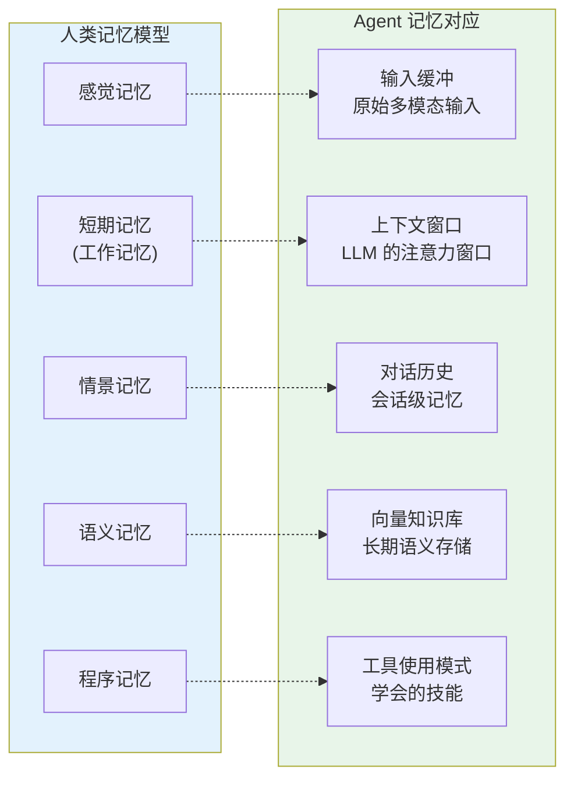

这个对应关系不仅是学术类比——它直接指导 Agent 记忆架构的设计。当前大多数 Agent 只有 A1（输入）和 A2（上下文窗口），少数有 A4（向量库），而 A3（情景记忆）和 A5（程序记忆）的实现极其原始。

---

## 2. 记忆演化模型

### 2.1 记忆不是静态的

当前 Agent 记忆系统有一个根本缺陷：**记忆是静态存储的**。一条对话记录一旦写入向量库，就永远以原始形式存在，不会随着时间推移而演化。但人类记忆是动态的——我们会遗忘、会整合、会修正、会强化。

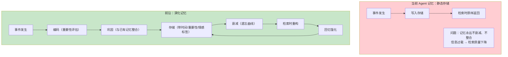

### 2.2 Ebbinghaus 遗忘曲线在 Agent 中的应用

德国心理学家 Ebbinghaus 发现人类记忆随时间指数衰减。前沿研究中，一些 Agent 记忆系统开始引入类似的遗忘机制：

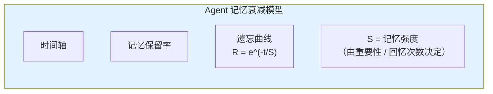

在 Agent 中应用遗忘曲线的核心公式：

```
记忆分数 = 重要性 × 回忆次数^α × e^(-经过时间/记忆半衰期)
```

其中：
- **重要性**：由 LLM 判断该条记忆的重要程度（1-10 分）
- **回忆次数**：该条记忆被检索/使用过的次数（每次回忆都增强记忆）
- **时间衰减**：经过的时间越长，记忆权重越低

### 2.3 记忆整合（Memory Consolidation）

人类在睡眠时，大脑会 **整合** 白天的记忆——将短期记忆转化为长期记忆，将相似记忆合并，丢弃不重要的细节。Agent 记忆也需要类似的"离线整合"过程：

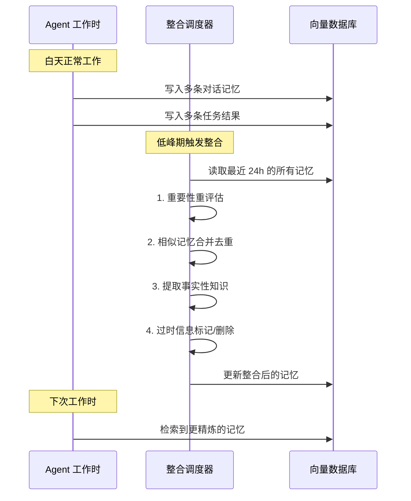

记忆整合的关键操作：

| 操作 | 说明 | 效果 |
|------|------|------|
| **去重合并** | 将语义相似的多条记忆合并为一条 | 减少冗余 |
| **事实提取** | 从对话中提取事实性知识（"用户偏好中文"） | 语义记忆强化 |
| **过时标记** | 标记不再有效的记忆（旧地址、旧偏好） | 检索时降权 |
| **摘要压缩** | 将长对话压缩为简洁摘要 | 节省存储和 Token |
| **关联强化** | 发现记忆间的关联并建立链接 | 提高检索质量 |

---

## 3. 神经记忆：参数化记忆 vs 外部记忆

### 3.1 两种记忆范式

当前 Agent 记忆主要依赖 **外部记忆**——向量数据库存储，检索时注入上下文。但学术界正在探索 **参数化记忆**——将知识直接写入模型参数。

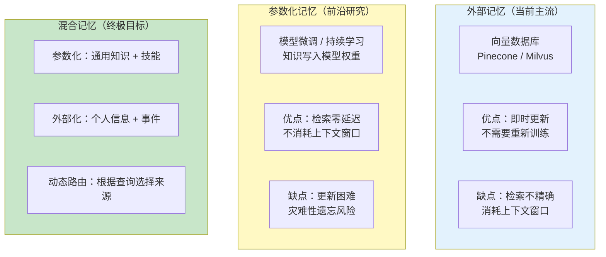

### 3.2 Memory-augmented Neural Networks

一个有前景的方向是 **记忆增强神经网络（Memory-augmented Networks）**——模型同时拥有参数化记忆和可读写的外部记忆矩阵：

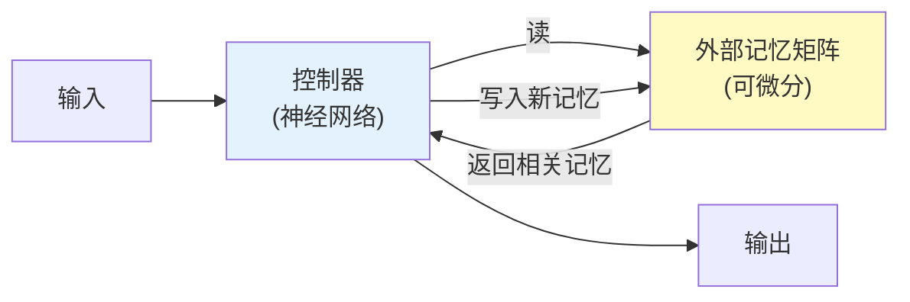

这类模型（如 Neural Turing Machine、Differentiable Neural Computer）在学术上有重要意义，但在 LLM 规模上的实用性尚未验证。

### 3.3 RLHF 与记忆学习

前沿研究（如斯坦福的 Generative Agents）尝试将记忆与强化学习结合——Agent 通过经验学习哪些记忆在什么场景下有用，类似于人类"学会如何回忆"：

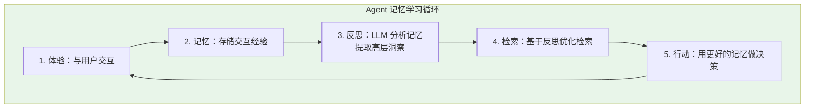

这个"体验-记忆-反思"循环是斯坦福 Generative Agents 论文的核心贡献，也是目前 Agent 记忆研究最有影响力的框架之一。

---

## 4. 持久化记忆的工程挑战

### 4.1 记忆一致性

在分布式 Agent 环境中，多个 Agent 可能同时读写共享记忆，需要解决 **记忆一致性** 问题：

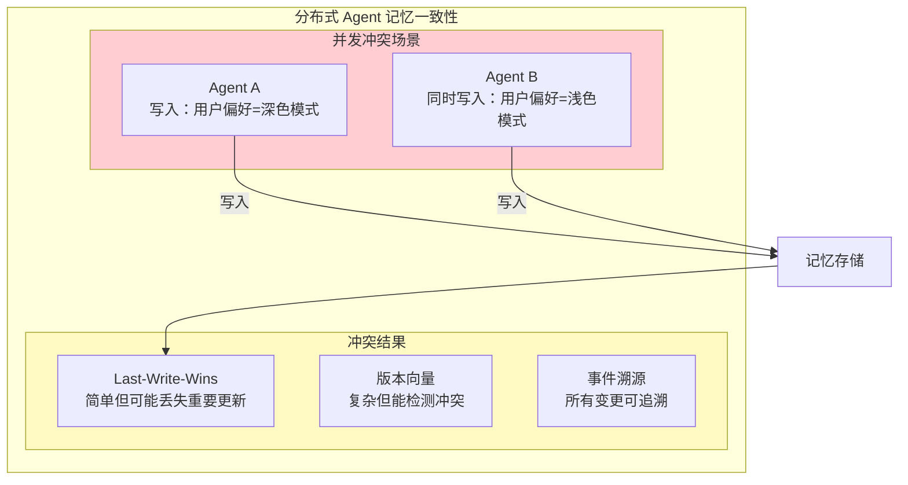

### 4.2 记忆版本化

记忆应该像代码一样可版本化——用户可以"撤销"Agent 学到的错误知识：

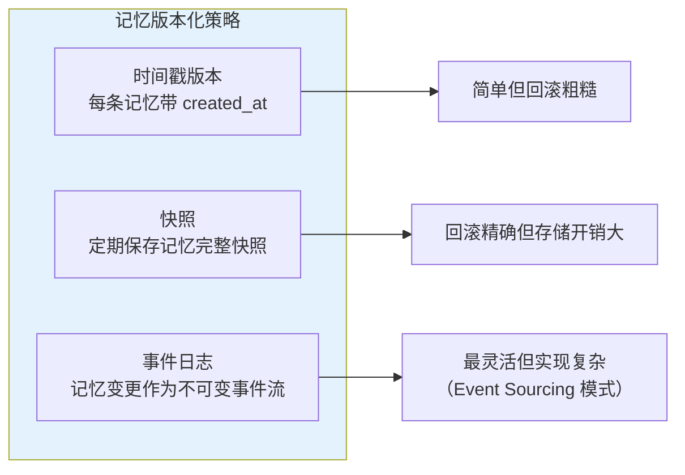

事件溯源（Event Sourcing）模式特别适合 Agent 记忆——它记录的是"发生了什么"（事件），而不是"当前状态"，可以从事件流重建任意时间点的记忆状态。

### 4.3 隐私与记忆

Agent 记忆存储用户的个人信息，面临严峻的隐私挑战：

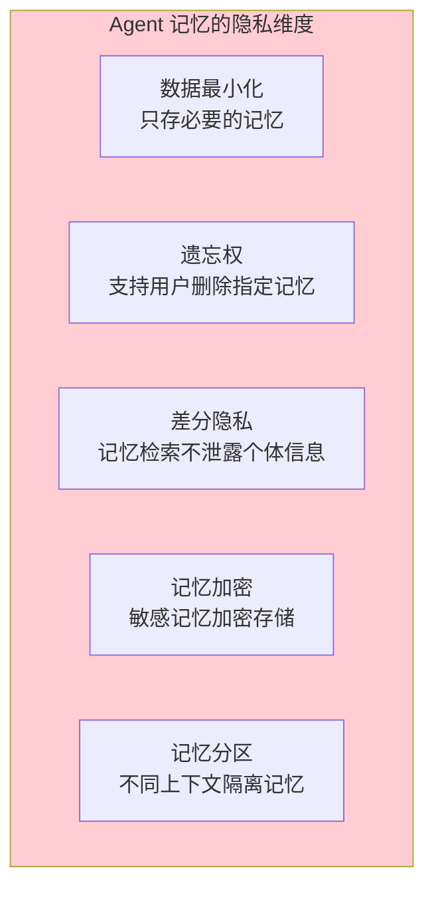

GDPR 的"被遗忘权"（Right to Erasure）对 Agent 记忆系统提出了特殊要求——不仅要删除主存储中的记忆，还要清除所有备份、缓存、向量索引中的对应条目。这在技术上非常困难。

---

## 5. 前沿研究方向

### 5.1 终身学习（Lifelong Learning）

终身学习是 Agent 记忆的终极目标——Agent 在持续运行中不断学习新知识，同时不遗忘旧知识。核心挑战是 **灾难性遗忘（Catastrophic Forgetting）**：

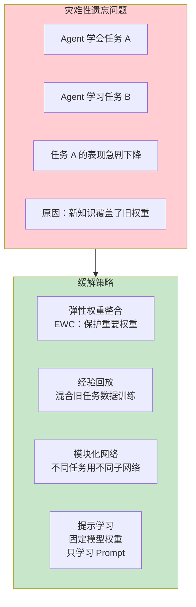

### 5.2 情景记忆的时间索引

人类回忆往事时，经常以时间线索触发（"上周二那次会议"）。Agent 的情景记忆也应该支持时间索引：

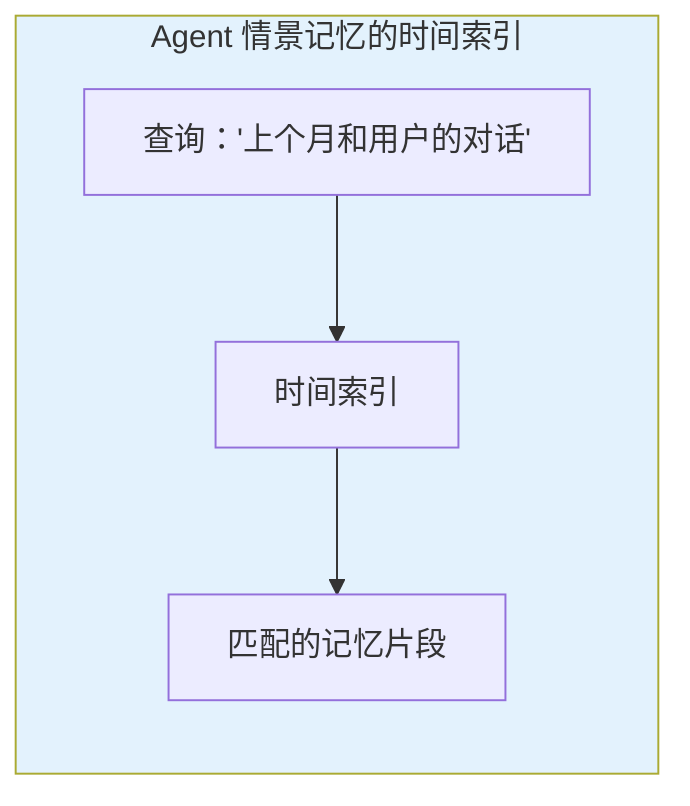

当前的向量检索只支持语义相似度匹配，不支持时间范围查询。前沿研究在探索 **多维度记忆索引**——同时支持语义、时间、重要性、情感等多维度的混合检索。

### 5.3 集体记忆（Collective Memory）

多个 Agent 协作时，是否可以共享记忆？这就是 **集体记忆** 的概念：

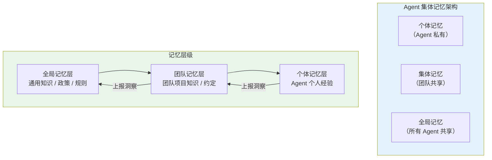

集体记忆需要解决的核心问题是 **知识冲突**——当 Agent A 的经验与 Agent B 的经验矛盾时，如何处理？

---

## 6. 记忆架构的评估维度

### 6.1 记忆质量指标

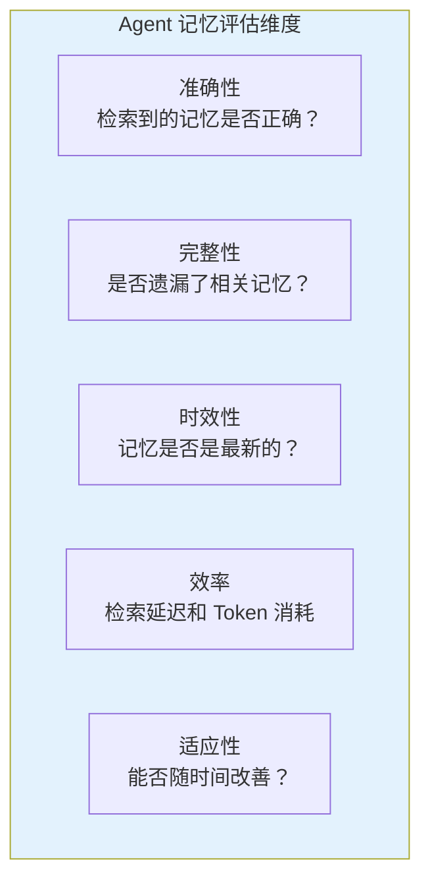

### 6.2 记忆基准测试

当前缺乏标准化的 Agent 记忆基准测试。这是 [前沿 03-Agent 评测基准](03-Agent评测基准.md) 的一个子问题——需要专门针对记忆能力的评测集：

| 评估任务 | 说明 | 挑战 |
|----------|------|------|
| 长期记忆保持 | 1000 轮对话后能否回忆第 1 轮的信息 | 超出任何上下文窗口 |
| 跨会话记忆 | 新会话中能否利用旧会话的知识 | 记忆检索质量 |
| 记忆冲突解决 | 当新信息与旧记忆矛盾时如何处理 | 一致性维护 |
| 遗忘效果 | 引入遗忘后性能是否改善（而非下降） | 评估指标设计 |

---

## 7. 在 Spring AI 中的实现展望

### 7.1 当前 Spring AI 的记忆能力

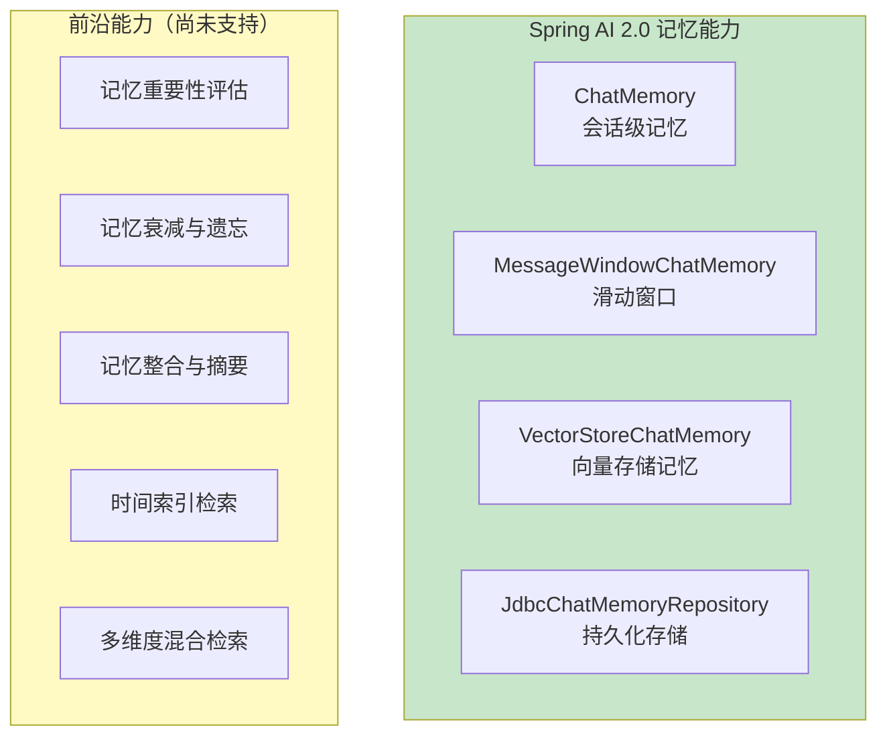

### 7.2 自定义高级记忆实现

基于 Spring AI 的扩展机制，可以实现一个带演化功能的记忆系统：

```java
// 概念代码：演化记忆实现
@Component
public class EvolvingChatMemory implements ChatMemory {

    private final VectorStore vectorStore;
    private final ChatClient judgeClient;  // 用于重要性评估的 LLM
    private final MemoryDecayCalculator decayCalculator;

    @Override
    public void add(String conversationId, List<Message> messages) {
        for (Message message : messages) {
            // 1. 评估重要性
            int importance = assessImportance(message);
            
            // 2. 构建记忆条目（带元数据）
            var memoryEntry = MemoryEntry.builder()
                .content(message.getText())
                .conversationId(conversationId)
                .importanceScore(importance)
                .createdAt(Instant.now())
                .lastAccessedAt(Instant.now())
                .accessCount(0)
                .build();

            // 3. 存入向量库（含元数据）
            vectorStore.add(List.of(
                new Document(memoryEntry.content(), 
                    memoryEntry.toMetadata())
            ));
        }
    }

    @Override
    public List<Message> get(String conversationId, int lastN) {
        // 1. 向量检索候选记忆
        var candidates = vectorStore.similaritySearch(
            SearchRequest.query("recent context")
                .withFilterExpression("conversationId == " + conversationId)
                .withTopK(lastN * 2)  // 过检索
        );

        // 2. 应用记忆衰减公式重排序
        var scored = candidates.stream()
            .map(doc -> new ScoredMemory(doc, 
                decayCalculator.calculateScore(doc)))
            .sorted(Comparator.comparingDouble(ScoredMemory::score).reversed())
            .limit(lastN)
            .toList();

        // 3. 更新访问计数和最后访问时间
        scored.forEach(this::updateAccessMetadata);

        return scored.stream()
            .map(sm -> (Message) new UserMessage(sm.content()))
            .toList();
    }

    // 定期执行记忆整合
    @Scheduled(cron = "0 0 3 * * *")  // 每天凌晨 3 点
    public void consolidateMemories() {
        memoryConsolidationService.consolidate();
    }
}
```

---

## 8. 总结

Agent 记忆是一个横跨认知科学、信息检索、分布式系统的复杂研究领域。核心调研发现如下：

1. **静态记忆是当前瓶颈**：大多数 Agent 记忆是静态存储，缺乏遗忘、整合、演化机制，导致信息过载和检索质量下降。
2. **记忆演化是关键方向**：引入 Ebbinghaus 遗忘曲线、记忆整合（去重/摘要/事实提取）、反思循环等机制，可以让 Agent 记忆更加智能。
3. **参数化 vs 外部化之争**：参数化记忆（写入模型权重）延迟低但更新困难，外部记忆（向量库）灵活但消耗上下文窗口，混合记忆是终极方案。
4. **工程挑战严峻**：分布式一致性、隐私合规、版本化、时间索引等工程问题尚未有成熟方案。
5. **Spring AI 的扩展空间**：当前 Spring AI 的记忆能力处于基础水平，通过自定义 ChatMemory 实现可以引入演化机制，但缺乏框架级支持。

对于 Java Agent 架构师而言，理解记忆前沿研究的价值在于——**在当前架构中预留记忆演化能力**。即使今天只做简单的向量检索，也应该为每条记忆添加重要性评分、时间戳、访问计数等元数据，为未来引入遗忘曲线和记忆整合做好准备。
