# 06-Spring AI 生态全景：框架对比与选型指南

> **定位**：本文调研 Spring AI 生态的完整全景，对比 Spring AI Alibaba、JetBrains Koog、JManus 等基于 Spring AI 或 JVM 构建的 Agent 框架，给出面向不同场景的选型建议。本文不是 Spring AI 的入门教程（参见 [教程 01-Spring AI 框架入门](../教程/01-Spring-AI框架入门.md)），而是站在架构选型视角审视生态格局。
>
> **性质声明**：本文为调研性质，各框架处于快速迭代期，版本特性和成熟度可能随时变化。选型建议基于截至调研时点的公开信息，请以各框架最新文档为准。

---

## 1. Spring AI 生态格局

### 1.1 从框架到生态

Spring AI 自 2024 年发布以来，已经从一个 Spring 官方的 AI 集成库发展为围绕它的 **生态圈**。多个组织和公司基于 Spring AI 构建了更高层的 Agent 框架，形成了"Spring AI 内核 + 多框架外壳"的格局。

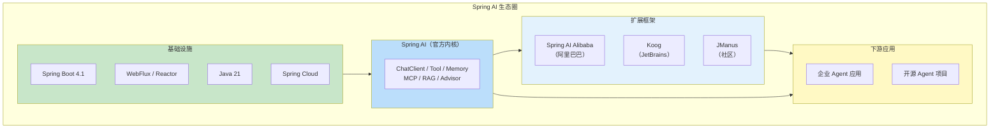

### 1.2 为什么需要扩展框架

Spring AI 的定位是 **基础设施层**——它提供了 ChatClient、Tool Calling、Memory、RAG 等基础能力，但刻意不包含高层的 Agent 编排模式。这就像 Spring Framework 提供了 IoC/AOP 但不包含业务逻辑。扩展框架的价值在于：

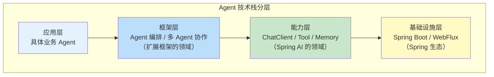

各扩展框架的差异化主要在 **框架层**：如何编排多步推理、如何管理 Agent 生命周期、如何实现多 Agent 协作、如何抽象工作流。

### 1.3 竞争格局全景

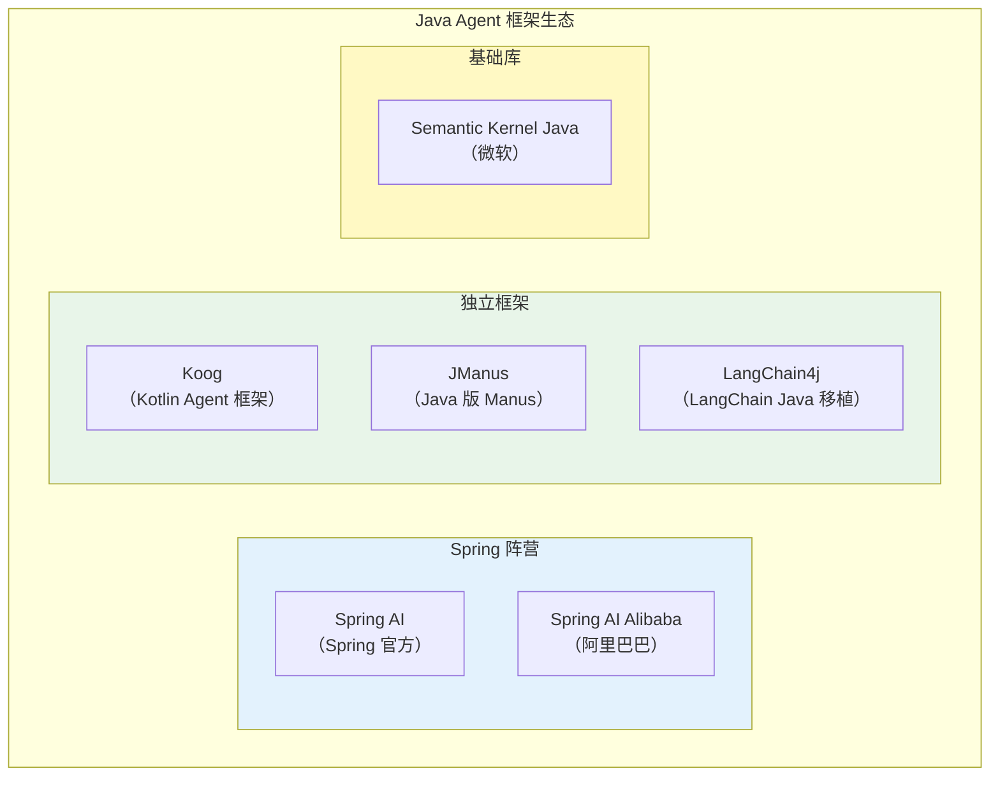

本文重点调研 Spring AI、Spring AI Alibaba、Koog、JManus 四个框架。

---

## 2. Spring AI：官方旗舰

### 2.1 定位与设计理念

Spring AI 是 Spring 官方的 AI 集成框架，其设计理念可以用一句话概括：**"做 AI 领域的 Spring Data"**——提供统一的抽象层，屏蔽不同 AI 供应商的差异。

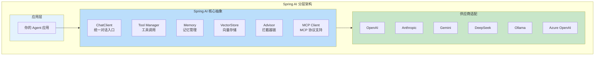

### 2.2 核心特性

| 特性 | 说明 | 成熟度 |
|------|------|--------|
| ChatClient 统一 API | 一套 API 对接所有 LLM | 高 |
| Tool Calling | `@Tool` 注解式工具定义 | 高 |
| Structured Output | `entity(Class)` 结构化输出 | 高 |
| Advisor Chain | 拦截器链（类 AOP） | 高 |
| ChatMemory | 会话记忆管理 | 中 |
| VectorStore | 统一向量存储抽象 | 高 |
| MCP 支持 | 原生 MCP 客户端 + 服务端 | 中 |
| RAG | 检索增强生成支持 | 中 |
| 多模态 | 图像/音频输入支持 | 中 |
| Observation | Micrometer 集成 | 高 |
| Streaming | WebFlux 流式响应 | 高 |

### 2.3 优势与劣势

**优势**：
- Spring 生态无缝集成（DI、AOP、配置、安全）
- 统一抽象降低供应商锁定风险
- 社区活跃，文档完善
- 与 Spring Boot 4.1 深度整合

**劣势**：
- Agent 高级模式（多 Agent 协作、复杂工作流）需要手工构建
- 没有 Agent 运行时（调度、生命周期管理）
- 记忆系统较为基础（详见 [前沿 05](05-Agent记忆前沿.md)）
- 对最新模型特性支持可能滞后

---

## 3. Spring AI Alibaba：阿里增强版

### 3.1 定位

Spring AI Alibaba 是阿里巴巴基于 Spring AI 的扩展项目，定位为 **Spring AI 的超集**——在兼容 Spring AI API 的基础上，增加阿里云模型适配和企业级 Agent 能力。

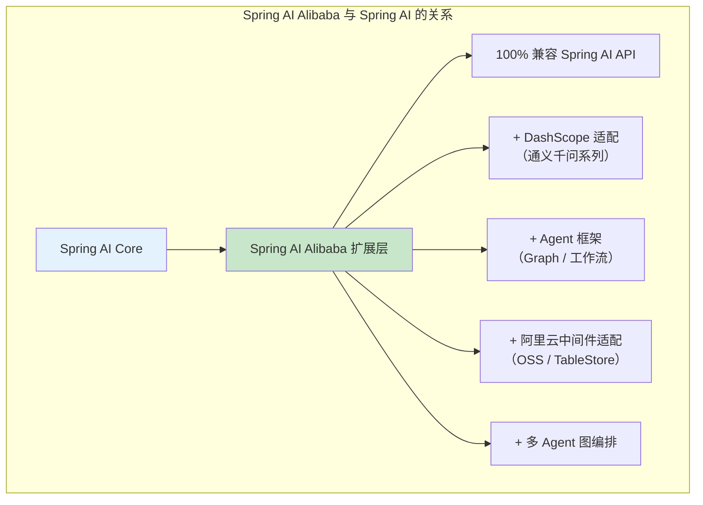

### 3.2 增强特性

| 特性 | 说明 | 与 Spring AI 的差异 |
|------|------|-------------------|
| DashScope 适配 | 通义千问/Qwen-VL/Qwen-Audio | Spring AI 原生不支持 |
| Agent Graph | 多 Agent 图编排 | Spring AI 需手工实现 |
| Flow 配置 | 声明式 Agent 工作流 | Spring AI 无此能力 |
| RAG 增强 | 智能文档解析 / 分块 | 比 Spring AI 更丰富 |
| Nacos 集成 | 配置中心 / 服务发现 | Spring AI 无此集成 |
| OssVectorStore | 阿里云向量存储 | Spring AI 无此适配 |
| Prompt 管理 | 结构化 Prompt 模板和版本管理 | Spring AI 的 Prompt 管理较简单 |

### 3.3 Agent Graph 编排

Spring AI Alibaba 最大的差异化特性是 **Agent Graph**——一个声明式的多 Agent 图编排框架：

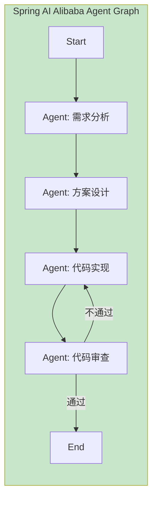

这种 Graph 编排模式与我们 [教程 36-Agent 工作流编排](../教程/36-Agent工作流编排.md) 中讨论的编排需求高度对应，但提供了框架级的抽象。它填补了 Spring AI 在多 Agent 协作方面的空白，类似于 LangGraph 在 Python 生态的角色。

### 3.4 适用场景

- 使用阿里云基础设施（DashScope、Nacos、OSS）的团队
- 需要多 Agent 图编排但不想引入额外框架
- 国内企业优先选择国产模型
- 中文 NLP 场景（通义千问优势）
- 国内部署和合规要求

---

## 4. JetBrains Koog：Kotlin 原生 Agent 框架

### 4.1 定位

Koog 是 JetBrains 开源的 Agent 框架，基于 Kotlin 构建（但可被 Java 互操作使用），强调 **类型安全** 和 **结构化 Agent 设计**。它的定位是 **IDE 集成优先的、类型安全的 Agent 框架**。

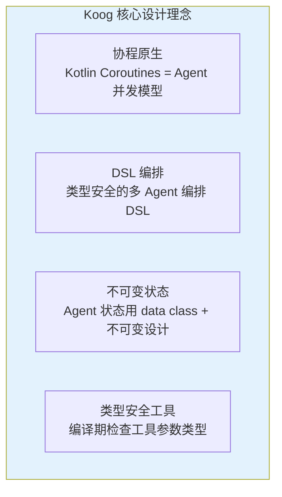

### 4.2 与 Spring AI 的对比

| 维度 | Spring AI | Koog |
|------|-----------|------|
| **语言** | Java 优先 | Kotlin 优先 |
| **并发模型** | WebFlux（Reactor） | Coroutines |
| **Agent 编排** | 手工 / Advisor | 声明式 DSL |
| **工具定义** | `@Tool` 注解 | 类型安全 DSL |
| **状态管理** | 手工 / Advisor | 内置 AAR（Agent-Agnostic Runtime） |
| **Spring 集成** | 原生 | 需要适配 |
| **成熟度** | 高 | 早期 |
| **社区规模** | 大 | 小但活跃 |

### 4.3 Koog DSL 风格示例

```kotlin
// Koog 风格的 Agent 编排（概念代码）
val workflow = agentWorkflow {
    val researcher = agent("researcher") {
        model = ModelProvider.GPT4
        systemPrompt = "你是一个研究助手"
        tools = listOf(SearchTool(), ReadTool())
    }

    val writer = agent("writer") {
        model = ModelProvider.CLAUDE
        systemPrompt = "你是一个技术写作专家"
    }

    val reviewer = agent("reviewer") {
        model = ModelProvider.GPT4
        systemPrompt = "你是一个严格的技术审稿人"
    }

    pipeline {
        researcher transforms { input ->
            "研究以下主题：$input"
        }
        writer transforms { research ->
            "基于研究结果写文章：$research"
        }
        reviewer validates { article ->
            article.length > 1000
        }
    }
}
```

Koog 的 DSL 更 **结构化**——推理步骤、工具定义、错误处理都是一等公民。对比 Spring AI 原生方式，Koog 在类型安全和声明式编排上有明显优势。

### 4.4 适用场景

- Kotlin 技术栈的团队
- 重视类型安全和 DSL 开发体验
- 对协程有深度理解
- JetBrains 生态用户
- Agent 逻辑高度结构化的场景

---

## 5. JManus：Java 版通用 Agent

### 5.1 定位

JManus 是一个受 Manus（通用 AI Agent 产品）启发的 Java 框架，目标是构建 **真正自主的通用 Agent**——不需要为每个任务定制工具和流程，Agent 自己决定做什么、怎么做。它的定位不是提供基础设施，而是提供一个 **可直接使用的通用 Agent 应用**。

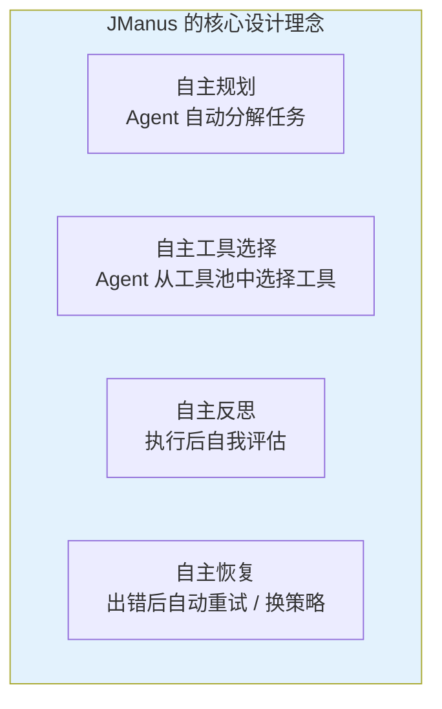

### 5.2 核心能力

| 能力 | 说明 | 与 Spring AI 的差异 |
|------|------|-------------------|
| ReAct 引擎 | 内置 Thought-Action-Observation 循环 | Spring AI 需手工实现 |
| Plan & Execute | 内置任务分解和执行 | Spring AI 无内置支持 |
| Dynamic Tool Selection | 运行时动态选择工具 | Spring AI 工具是静态绑定的 |
| Self-Reflection | 执行后自动反思 | Spring AI 无内置支持 |
| Code Execution | 内置代码沙箱 | Spring AI 需集成 MCP |
| Web Browsing | 内置 Web 浏览能力 | Spring AI 需集成 MCP |
| File Operations | 内置文件读写 | Spring AI 需集成 MCP |

### 5.3 JManus 架构

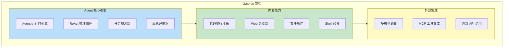

### 5.4 适用场景

- 需要"通用 Agent"能力的场景（不像客服/文档等垂直场景）
- 快速原型开发——不需要为每个任务定制工具
- 探索性任务——Agent 自主决定工具和流程
- 个人或小团队使用

---

## 6. 四框架横向对比

### 6.1 功能对比雷达

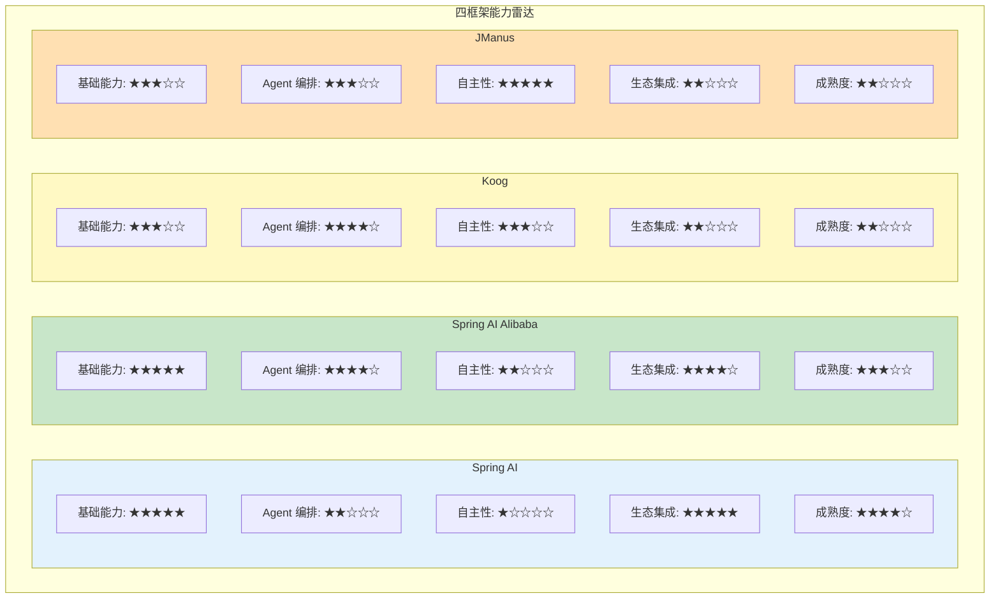

### 6.2 详细对比表

| 维度 | Spring AI | Spring AI Alibaba | Koog | JManus |
|------|-----------|-------------------|------|--------|
| **基础定位** | AI 集成框架 | Spring AI 增强版 | Kotlin Agent 框架 | 通用自主 Agent |
| **语言** | Java | Java | Kotlin | Java |
| **Agent 模式** | 工具调用 + Advisor | Agent Graph + 工作流 | DSL 协程编排 | ReAct + 自主规划 |
| **多 Agent 协作** | 手工实现 | 内置 Graph | 内置 Pipeline | 内置（Agent 自主委派） |
| **MCP 支持** | 客户端 + 服务端 | 同 Spring AI | 社区适配 | 社区适配 |
| **模型支持** | 全主流模型 | 全主流 + 通义千问 | 全主流模型 | 全主流模型 |
| **Spring 集成** | 原生 | 原生 | 需适配 | 需适配 |
| **学习曲线** | 低（Spring 开发者） | 低 | 中（需学 Kotlin） | 中 |
| **企业级特性** | 强（Observation 等） | 强 | 弱 | 中 |
| **社区活跃度** | 高 | 中高 | 中 | 中 |
| **许可证** | Apache 2.0 | Apache 2.0 | Apache 2.0 | Apache 2.0 |

### 6.3 架构哲学对比

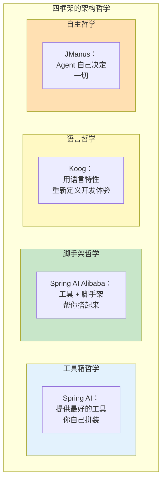

---

## 7. 与其他主流 Agent 框架的对比

### 7.1 跨生态对比

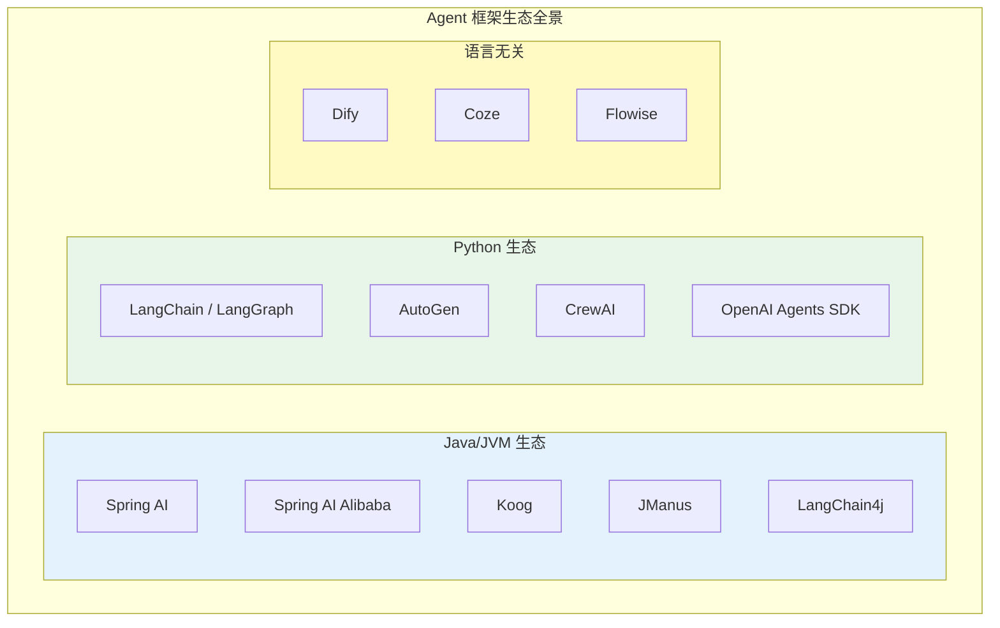

### 7.2 Java 生态内部对比：Spring AI vs LangChain4j

| 维度 | Spring AI | LangChain4j |
|------|-----------|-------------|
| **设计哲学** | Spring 生态原生 | LangChain Python 的 Java 移植 |
| **依赖管理** | Spring Boot Starter | 独立依赖 |
| **社区** | Spring 官方 + VMware | 社区驱动 |
| **成熟度** | 2.0 GA | 较早发布但仍在迭代 |
| **企业特性** | 深度 Spring 集成 | 轻量、独立 |
| **学习曲线** | Spring 开发者低 | 任何 Java 开发者 |
| **推荐场景** | 已有 Spring 技术栈 | 非 Spring 项目 |

### 7.3 Java vs Python 生态

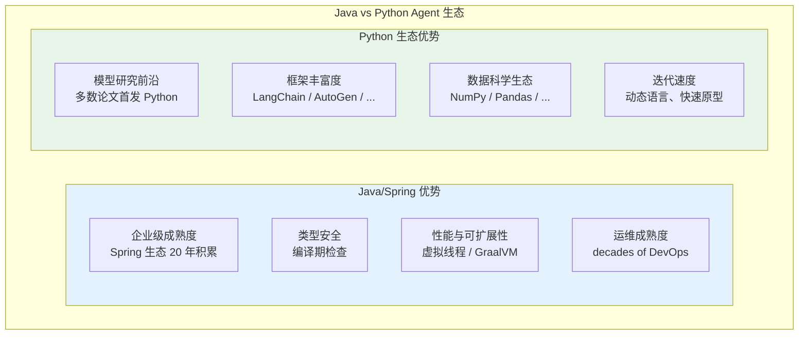

---

## 8. 选型决策框架

### 8.1 决策树

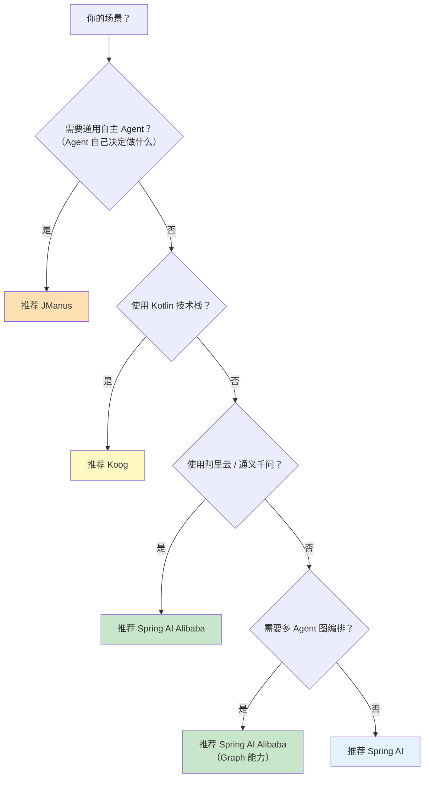

### 8.2 场景化推荐

| 场景 | 首选框架 | 备选 | 理由 |
|------|----------|------|------|
| **Spring Boot 企业应用** | Spring AI | Spring AI Alibaba | 无缝集成 Spring 生态 |
| **阿里云全栈** | Spring AI Alibaba | Spring AI | DashScope/Nacos 深度集成 |
| **Kotlin 微服务** | Koog | Spring AI + Kotlin DSL | 协程 + 类型安全 DSL |
| **通用 AI Agent** | JManus | Spring AI + 手工编排 | 自主决策能力强 |
| **多 Agent 协作系统** | Spring AI Alibaba | Koog | Graph 编排能力 |
| **快速原型** | JManus | Spring AI Alibaba | 开箱即用的自主能力 |
| **高可观测性需求** | Spring AI | Spring AI Alibaba | Micrometer 深度集成 |
| **严格类型安全** | Koog | Spring AI | Kotlin 编译期检查 |
| **金融/银行级** | Spring AI 原生 + 自建治理 | - | 最大控制力，满足合规 |
| **多租户 SaaS** | Spring AI 原生 + 自建多租户 | - | 框架级多租户需深度定制 |
| **内部工具/个人使用** | JManus | - | 即用性最强 |
| **教育/学习** | Spring AI 原生 | - | 理解底层原理最重要 |
| **高并发实时场景** | Spring AI 原生 + WebFlux | - | 响应式栈优势 |

### 8.3 选型的常见误区

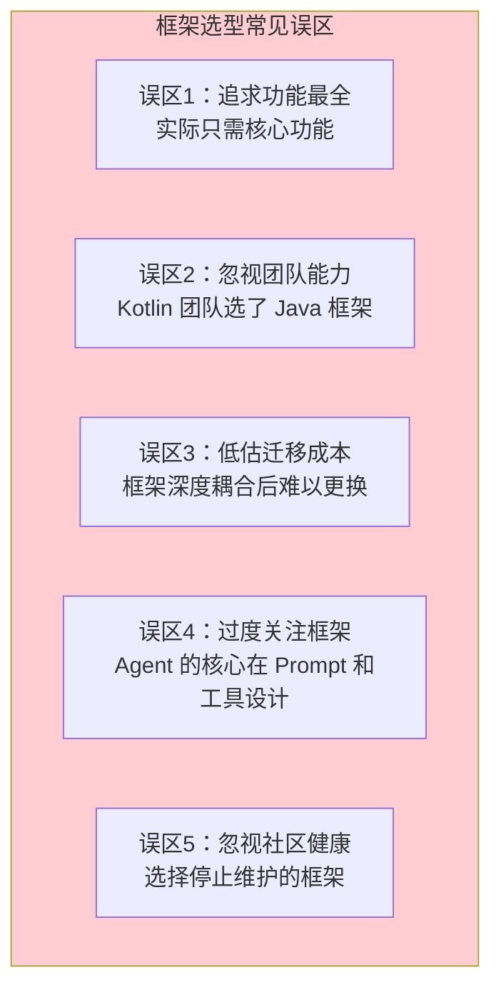

---

## 9. 混合使用策略

### 9.1 框架组合的可能性

在实际项目中，多个框架可以 **混合使用** 而非互斥选择：

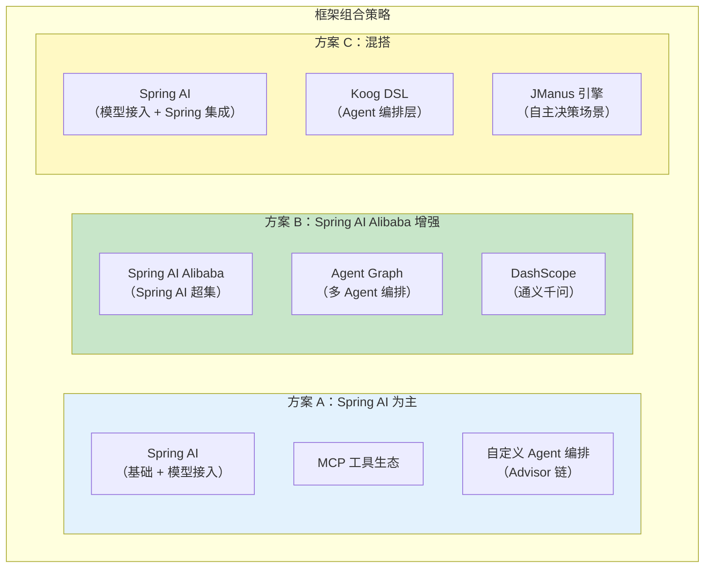

### 9.2 避免供应商锁定

无论选择哪个框架，都应该 **在核心逻辑与框架之间保留抽象层**：

```java
// 防止供应商锁定的抽象层设计（概念）
// 将 Agent 核心逻辑与框架解耦

public interface AgentOrchestrator {
    Flux<AgentStep> execute(AgentTask task);
}

public interface AgentMemory {
    void store(String key, Object value);
    <T> Optional<T> retrieve(String key, Class<T> type);
}

// 实现可以基于任何框架
// 切换框架时只需替换实现，不改业务逻辑
@Component
public class SpringAiOrchestrator implements AgentOrchestrator {
    // Spring AI 实现
}

@Component
@ConditionalOnProperty(name = "agent.framework", havingValue = "alibaba")
public class AlibabaOrchestrator implements AgentOrchestrator {
    // Spring AI Alibaba 实现
}
```

### 9.3 迁移路径评估

| 迁移方向 | 难度 | 说明 |
|----------|------|------|
| Spring AI -> Spring AI Alibaba | 低 | 超集兼容，只需添加依赖 |
| Spring AI Alibaba -> Spring AI | 中 | 需替换 Graph 编排和阿里云依赖 |
| Spring AI -> Koog | 高 | 编程范式不同（Reactor -> Coroutines） |
| Spring AI -> JManus | 中 | API 层差异，但都是 Java |
| LangChain4j -> Spring AI | 中 | 理念相似，API 不同 |

---

## 10. 生态发展趋势

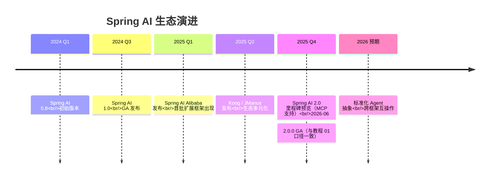

### 10.1 融合趋势

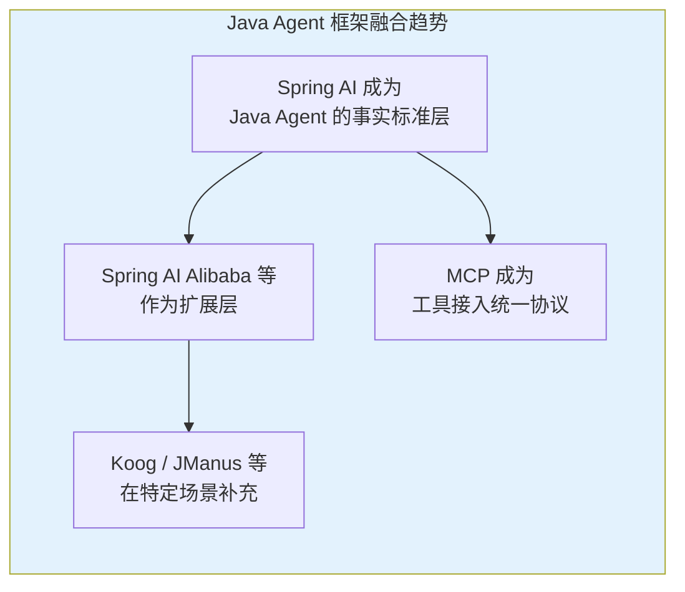

### 10.2 未来预期

| 时间 | 预期发展 |
|------|----------|
| 2026 上半年 | Spring AI 增加 Agent Graph 能力（缩小与 Alibaba 差距） |
| 2026 下半年 | Spring AI 原生支持 A2A 协议 |
| 2026-2027 | Koog 成熟度提升，进入企业采用阶段 |
| 2027+ | Java Agent 框架格局基本稳定，Spring AI 成为标准底座 |

关键趋势：

1. **Spring AI 2.0 的 Agent API**：Spring AI 正在引入更高层的 Agent 抽象（类似 `Agent` 接口），缩小与扩展框架之间的差距。这可能减少扩展框架在编排层面的差异化。
2. **MCP 标准化**：所有框架都在向 MCP 对齐，工具层的差异将缩小，编排层的差异将成为主要区分点。
3. **跨框架互操作**：A2A 协议的兴起可能使不同框架构建的 Agent 之间可以通信，减少"选一个框架"的压力。
4. **企业级特性下沉**：目前扩展框架独有的特性（编排、治理、监控）可能逐步被 Spring AI 原生吸收。

---

## 11. 总结

Spring AI 生态正处于从"单一框架"向"多框架生态"的过渡期。核心调研发现如下：

1. **三层定位清晰**：Spring AI 是内核（基础设施），Spring AI Alibaba / Koog / JManus 是扩展（框架层），具体业务 Agent 是应用。理解这个分层是选型的基础。
2. **Spring AI 是基石**：作为 Spring 官方框架，它是所有 Java Agent 项目的合理起点，统一抽象层和 Spring 生态集成是核心竞争力。
3. **三大框架各有侧重**：Spring AI Alibaba 强在企业集成和 Graph 编排，Koog 强在类型安全和 Kotlin 体验，JManus 强在即用性和通用任务完成。没有"最好"的框架，只有"最合适"的。
4. **选型核心是团队能力与场景**：技术栈匹配度比框架功能列表更重要。一个 Spring 团队选 Koog 造成的摩擦远大于框架本身的优势。
5. **避免过度依赖框架**：Agent 的核心竞争力在于 Prompt 设计、工具生态和记忆策略——这些超越了任何框架的范畴。框架是脚手架，不是建筑本身。
6. **组合使用是可行策略**：不同框架构建的 Agent 可以通过 A2A 协议互操作，不需要强迫自己"只选一个"。
7. **关注 Spring AI 2.0 的演进**：Spring AI 正在加速引入高层 Agent 抽象，这可能重新定义框架层的边界。密切关注官方路线图。

对于本教程体系的技术栈选择（Spring Boot 4.1 + Spring AI 2.0 + WebFlux + Java 21），Spring AI 是自然的核心框架。在需要多 Agent 编排时，可以考虑 Spring AI Alibaba 的 Graph 能力，或基于 Spring AI Advisor 链自行构建编排层。本教程系列的 41 篇教程正是基于 Spring AI 原生能力编写的，它们构成的知识体系超越了任何单一框架的选择。
