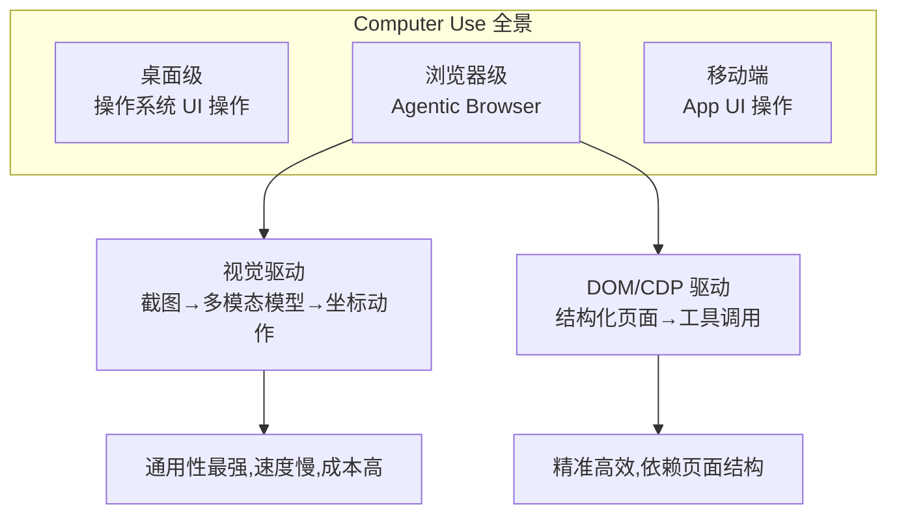
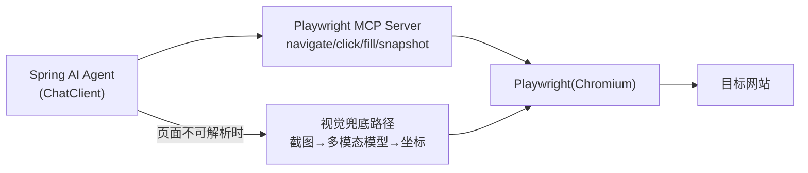

# 前沿 07：Computer Use 与 Agentic Browser

> **定位**：Agent 的"手"——让 Agent 操作真实浏览器/桌面界面完成任务的技術方向。本文调研 2025-2026 年的主流实现、架构形态、风险与 Java 生态的接入方式。前置阅读：[教程 00-Agent核心概念]、[教程 03-工具调用]。

---

## 1. 方向定义

Computer Use 指 Agent 以"看屏幕+发指令"的方式操作图形界面（点击/输入/滚动），完成原本需要人的操作任务；Agentic Browser 是其 Web 子集——Agent 驱动浏览器完成导航、表单、抓取、交易。

两条技术路线的对比决定了工程选型：**视觉驱动**（截图给多模态 LLM，返回坐标点击）通用但慢贵；**DOM 驱动**（通过 CDP/Playwright 拿结构化页面，LLM 做决策、工具做操作）精准高效。2026 年的主流形态是**混合**：DOM 优先、视觉兜底（页面结构不可解析时截图）。

## 2. 主流实现盘点

| 实现 | 形态 | 要点 |
|------|------|------|
| Claude Computer Use（Anthropic） | 视觉驱动 API + 参考 VM | 定义了"screenshot→action"的动作空间范式 |
| Browser-use / Playwright MCP | DOM/CDP 驱动 MCP Server | MCP 生态内最实用的浏览器 Agent 形态 |
| OpenAI Operator/Computer-Using Agent | 托管式浏览器 Agent | SaaS 形态，任务级委托 |
| 开源 Agentic 框架内建 | 各编排框架的 browser 工具包 | 与编排能力打包 |

**Playwright MCP 的工程意义**：浏览器能力被封装成 MCP 工具集（navigate/click/fill/extract）——任何 MCP 客户端的 Agent（含 Spring AI 应用）都能获得浏览器操作能力，无需自研浏览器栈。

## 3. 架构形态（Java/Spring AI 接入）

接入即 MCP 客户端集成（[附录 12-01 基准]）：注册 Playwright MCP Server 的工具目录，Agent 的 ReAct 循环自然驱动浏览器。企业接入的位置在**安全网关**（[项目 08] 的形态）：浏览器工具是高危工具（能触达一切 Web），必须过准入评级（C 级沙箱）、egress 域名白名单、注入检测（网页内容是不可信输入——间接注入的主战场）。

## 4. 风险清单（这个方向的独特攻击面）

| 风险 | 说明 | 缓解 |
|------|------|------|
| 间接注入 | 网页内容直接进 Prompt——攻击页面可诱导 Agent 执行恶意操作 | 内容过注入检测管道（[教程 25/附录 08]）；高危动作 HITL |
| 凭证钓鱼 | Agent 持有登录态，恶意页面诱导其转账/改密 | 浏览器会话与支付凭证隔离；敏感域名操作强制审批 |
| 提示词混淆攻击（distractor） | 页面藏"忽略指令"文本干扰 Agent | 同注入检测；任务范围约束（仅限指定站点） |
| 沙箱逃逸 | 浏览器漏洞面 | 容器化浏览器、network 隔离、无宿主文件系统访问 |
| 合规（爬虫/ToS） | 自动化访问违反站点条款 | 域名白名单+robots 尊重+速率限制 |
| 责任边界 | Agent 点了"同意条款"算谁同意 | 高后果动作（提交/支付）必须人工确认 |

**最重要的架构判断**：Computer Use 的安全模型 = 间接注入防御 + 高危动作审批的组合——这两者本体系已有完整方案（[附录 08/00]、[教程 22]），浏览器只是把它们的作用面放大到"整个互联网"。

## 5. 前景判断（2026 视角）

- **短期（1-2 年）**：结构化任务（表单/查询/比对）已可生产使用；开放域任务可靠性仍不足以无人值守
- **中期**：DOM+视觉混合成熟，浏览器 Agent 成为 RPA 的替代形态（RPA 的 brittle selector 维护 vs Agent 的语义自适应）
- **架构师行动**：① 把浏览器工具纳入 MCP 工具治理（不是新增安全体系，是复用）；② 高价值流程先做"Agent 建议+人工点击"半自动形态积累数据；③ 关注 UA/反自动化对抗的合规边界

## 6. 来源

- Anthropic Computer Use: anthropic.com/news/3-5-sonnet-computer-use
- Playwright MCP: github.com/microsoft/playwright-mcp
- Browser-use: github.com/browser-use/browser-use
- OWASP LLM Top 10（LLM01 Prompt Injection 与 Computer Use 的交叉）: owasp.org/www-project-top-10-for-large-language-model-applications
