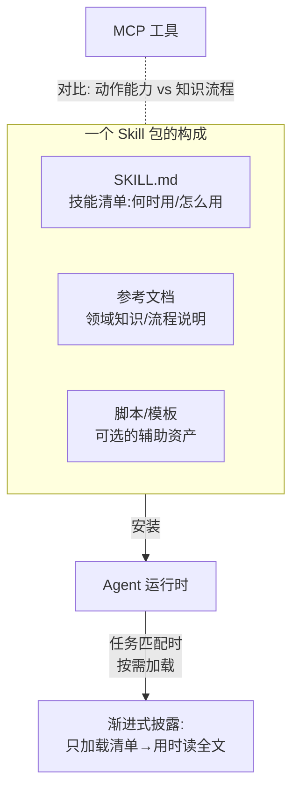
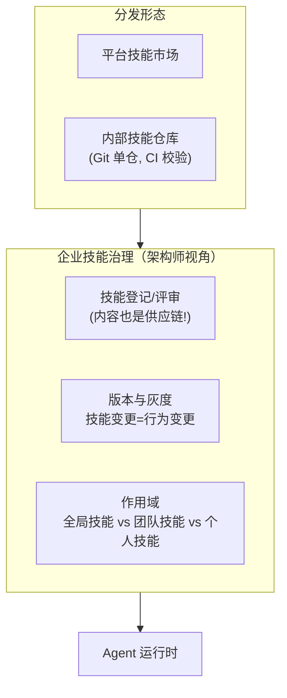

# 前沿 08：Agent Skills（可分发的技能包）

> **定位**：Agent 的"能力复用单元"——Skills 作为 2025 年后主流 Agent 平台的标准扩展机制，正在改变工具/提示词/知识打包分发的方式。本文调研其形态、与 MCP 的关系、对企业架构的影响。前置阅读：[教程 10-MCP协议]、[前沿 04-MCP生态全景]。

---

## 1. 什么是 Agent Skills

Skills 是**声明式的技能包**：把"如何完成某类任务"的指令（提示词）、辅助资源（脚本/模板/参考资料）打包成可安装、可分发的单元。Agent 安装 Skill 后获得该领域的能力提升——不是新工具（那是 MCP 的职责），而是**新知识与新流程**。

**与 MCP 的本质区别**：MCP 给 Agent 新的**动作**（能做什么）；Skills 给 Agent 新的**方法**（怎么做更好）。二者正交组合：一个"财务报表分析" Skill 可能指导 Agent 调用 MCP 的 spreadsheet 工具按特定流程完成分析。

## 2. 核心机制：渐进式披露（Progressive Disclosure）

Skills 的关键设计是**分层加载**，解决"能力多了上下文爆炸"：

| 层 | 何时加载 | 内容 |
|----|---------|------|
| L1 清单 | 常驻 | 技能名+一句话描述（数十 token） |
| L2 概要 | 任务匹配时 | 触发条件、步骤概要（数百 token） |
| L3 全文 | 执行时 | 完整指令+参考资料（按需，可数万 token） |

这与 [教程 29-上下文工程 §五层拼接] 的分层理念完全同构——Skills 是上下文工程在"能力分发"维度的应用：**上下文预算管理成了技能系统的设计约束**。

## 3. 企业架构影响

对企业架构师的三个要点：

1. **Skill 是供应链的一部分**：技能包内容会进入 Prompt——恶意/劣质 Skill 与恶意 MCP 工具同级别危险（间接注入的载体）。治理复用 [项目 08] 的准入/审查模式：来源验证、内容审查、指纹固定
2. **Skill 变更需要灰度**：技能指令的变更直接改变 Agent 行为——与 Prompt 版本管理（[教程 23]）同一套灰度/回滚机制
3. **作用域设计**：全局技能（合规要求类）强制安装、团队技能按角色分发——技能分发的权限模型类似工具权限（[教程 20 §工具权限分级]）

## 4. 与本体系技术的衔接

Spring AI 生态中 Skills 的等价物与衔接点：

| Skills 概念 | 本体系对应 |
|------------|-----------|
| 技能清单（L1 常驻） | 系统提示词中的能力目录 |
| 按需加载（L2/L3） | RAG 检索技能文档（[教程 05/29]）或动态工具发现（[教程 03 §动态发现]） |
| 技能包分发 | Prompt 版本管理（[教程 23]）+ 配置下发（[项目 05 v3] 控制面） |
| 技能治理 | 工具准入（[项目 08 v2]）同模式 |

**实现路径**：控制面维护技能库（版本化、审批流），Agent 运行时按任务匹配加载技能文档进上下文——本质上是在管控分离架构里给"知识资产"一个与工具同级的治理位。

## 5. 前景判断

- **短期**：主流平台（Claude Skills 等）确立格式事实标准；企业开始建内部技能库
- **中期**：技能市场 + 技能组合（技能间依赖声明）出现；技能的质量评估（效果而非描述）成为焦点
- **架构师行动**：① 把"提示词+领域知识"资产化（从散落文档到版本化技能包）；② 技能治理复用工具供应链模式；③ 关注格式标准化进程，避免过早绑定单一平台的私有格式

## 6. 来源

- Anthropic Agent Skills: anthropic.com/news/skills
- Model Context Protocol: modelcontextprotocol.io
- 渐进式披露与上下文工程关联：本体系 [教程 29-上下文工程]
