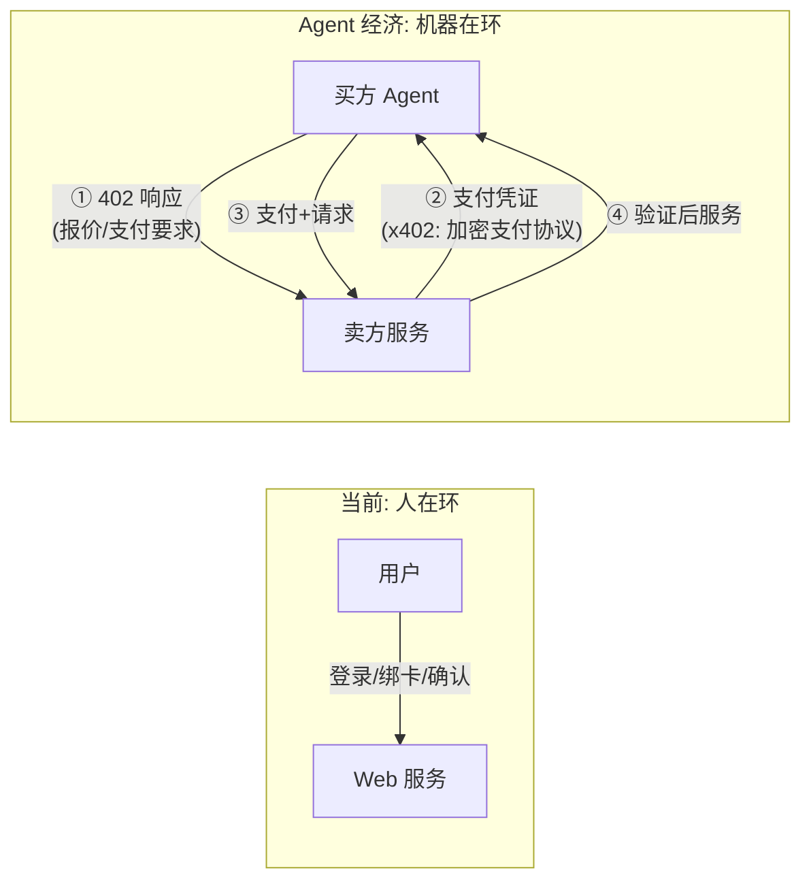
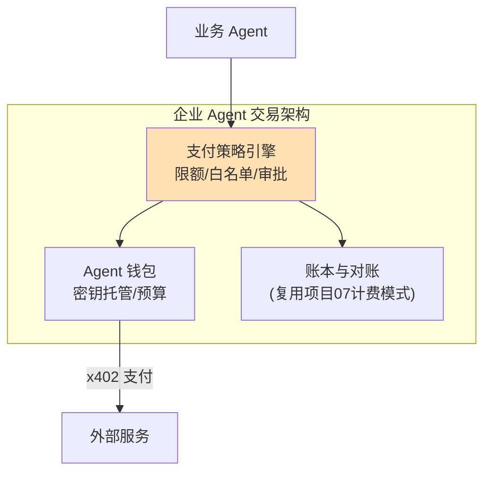

# 前沿 09：Agent 经济与支付（x402 / ANP / Agent 间结算）

> **定位**：Agent 的"钱包"——当 Agent 开始代表主体进行交易（购买服务/支付 API 调用/互相结算），支付协议与 Agent 身份/互操作协议构成 Agent 经济的基础设施。本文调研 x402 支付协议、ANP（Agent Network Protocol）与 Agent 间交易架构。前置阅读：[前沿 00-A2A协议]、[教程 31-安全与权限控制]。

---

## 1. 为什么需要"Agent 支付"

现有 HTTP 的 402 状态码（Payment Required）几乎从未被使用——因为人类用户走的是"登录+绑卡+确认"流程。Agent 交易改变了前提：

- Agent 需要程序化地发现价格、协商、支付、验证——**没有"人"在浏览器里点支付按钮**
- Agent 间交易（A 买 B 的检索服务）需要机器可执行的支付语义
- 微支付场景（单次 API 调用几分钱）不适合绑卡流程

## 2. x402：HTTP 原生的支付协议

x402（2025 年 Coinbase 推出，命名取自 HTTP 402 状态码）把支付嵌入 HTTP 语义：

| 机制 | 说明 |
|------|------|
| 402 响应 | 服务端返回支付要求（金额/收款地址/资产类型，机器可读） |
| 支付头 | 客户端在后续请求携带签名支付凭证 |
| 稳定币结算 | USDC 等链上结算，微支付可行（无卡组织手续费） |
| 中间商/Facilitator | 验证支付+结算的可信第三方（服务端无需自建链上验证） |

**对 Java 架构师的意义**：x402 让"Agent 按次付费调用你的 API"成为标准 HTTP 交互——LLM 网关/工具市场（[前沿 04]）的商业模式从"订阅+Key"扩展到"按次微支付"。Spring 侧集成点：WebClient 拦截器处理 402 重试+支付头注入；服务端 Filter 校验支付凭证。

## 3. ANP 与 Agent 互操作的身份层

ANP（Agent Network Protocol，基于 W3C DID 的去中心化 Agent 互操作提案）解决交易前的**身份与发现**：

| 层 | 能力 | 与其他协议关系 |
|----|------|---------------|
| DID 身份 | Agent 拥有可验证的去中心化身份 | 与 A2A 的 Agent Card 互补（A2A 集中式发现，ANP 去中心化） |
| 能力发现 | Agent 发布服务/价格/条款（机器可读） | A2A AgentCard 的对应物 |
| 可信交互 | DID 签名的请求/协商 | MCP OAuth 2.1 的对等扩展 |

**协议全景的位置**：MCP（工具接入）+ A2A（Agent 协作）+ x402（支付）+ ANP/DID（身份与发现）——四层拼出完整 Agent 经济协议栈。2026 年的状态：MCP 成熟、A2A 快速采用、x402 早期试点、ANP 提案阶段。

## 4. 架构与风险（企业视角）

| 风险 | 说明 | 缓解 |
|------|------|------|
| 钱包失窃 | Agent 持有支付密钥=高价值目标 | 密钥 HSM 托管、单笔/日限额、支付白名单 |
| 注入诱导支付 | 间接注入让 Agent 乱买（"购买 1000 次服务"） | 支付是最高危动作：强制 HITL（[教程 22]）、金额阈值审批 |
| 不可逆性 | 链上支付无退款 | 交易对手信誉/白名单、小额试错、争议条款线下化 |
| 合规 | 支付牌照/外汇/稳定币监管 | 法务前置；企业场景先走内部结算试点 |
| 对账复杂度 | 机器高频微支付的账务 | 账本设计复用 [项目 07 v5] 三副本对账 |

**核心架构判断**：Agent 支付 = HITL 的高级形态 + 计费系统的新输入。企业落地不需要全新体系——支付策略引擎挂进现有审批流（阈值内自动、超阈值人工），钱包账本复用计量对账架构。真正的难点是**密钥治理与注入防御**，两者本体系已有完整方案。

## 5. 前景判断

- **短期**：x402 类协议在开发者 API 市场试点（按次付费 LLM/检索 API）；企业内部"虚拟结算"先行（不涉真钱，练治理）
- **中期**：Agent 间自主交易（A2A+x402 组合）在特定生态成型；监管框架是最大变量
- **架构师行动**：① 支付作为工具建模（过零信任策略与 HITL，[项目 08 v6]）；② 账本与对账架构预留外部支付输入；③ 关注稳定币合规进展（决定微支付何时可用）

## 6. 来源

- x402 协议: x402.org
- ANP（Agent Network Protocol）: agentnetworkprotocol.com / W3C DID: w3.org/TR/did-core
- A2A 与支付生态关联: google.github.io/A2A
